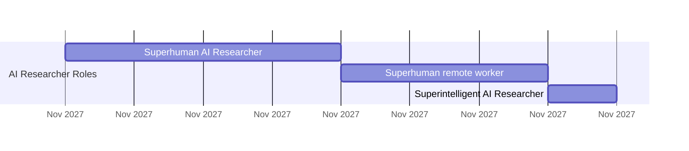

# AI 2027

**Daniel Kokotajlo**  
**Scott Alexander**  
**Thomas Larsen**  
**Eli Lifland**  
**Romeo Dean**

Originally published on April 3rd 2025 on AI-2027.com  
Design by Lightcone Infrastructure

---

# AI 2027

We predict that the impact of superhuman AI over the next decade will be enormous, exceeding that of the Industrial Revolution. The CEOs of OpenAI, Google DeepMind, and Anthropic have all predicted that AGI will arrive within the next 5 years. Sam Altman has said OpenAI is setting its sights on “superintelligence in the true sense of the word” and the “glorious future.” It’s tempting to dismiss this as just hype. This would be a grave mistake—it is not just hype. We have no desire to hype AI ourselves, yet we also think it is strikingly plausible that superintelligence could arrive by the end of the decade.

If we’re on the cusp of superintelligence, society is nowhere near prepared. Very few people have even attempted to articulate any plausible path through the development of superintelligence. We wrote AI 2027 to fill that gap, providing much needed concrete detail. We would love to see more work like this in the world, especially from people who disagree with us. We hope that by doing this, we’ll spark a broad conversation about where we’re headed and how to steer toward positive futures.

We wrote this scenario by repeatedly asking ourselves “what would happen next”. We started at the present day, writing the first period (up to mid-2025), then the following period, until we reached the ending. We weren’t trying to reach any particular ending. We then scrapped it and started over again, many times, until we had a finished scenario that we thought was plausible. After we finished the first ending—the racing ending—we wrote a new alternative branch because we wanted to also depict a more hopeful way things could end, starting from roughly the same premises.

We won’t be right about everything — much of this is guesswork. But over the course of this project, we did an immense amount of background research, expert interviews, and trend extrapolation to make the most informed guesses we could. Moreover, our team has an excellent track record in forecasting, especially on AI. Daniel Kokotajlo, lead author, wrote a similar scenario 4 years ago called “What 2026 Looks Like”, which aged remarkably well, and Eli Lifland is a top competitive forecaster.

At the beginning of every chapter you will find a small chart in the right margin that aims to give you a sense of the state of the world at the time that section of the scenario takes place. For a more detailed explanation of what these numbers mean, and much much more detail on our methodology, go to ai-2027.com.

We hope you find AI 2027 helpful.

<table>
<thead>
<tr>
<th colspan="7">Apr 2025</th>
</tr>
</thead>
<tbody>
<tr>
<td colspan="7" style="text-align:center;">Unreliable Agent</td>
</tr>
<tr>
<td>Dec 2024</td>
<td>20</td>
<td>0</td>
<td>Hacking</td>
<td>Bioweapons</td>
<td>Compute</td>
<td rowspan="3" style="text-align:center;">Robotics</td>
</tr>
<tr>
<td></td>
<td></td>
<td></td>
<td>Coding</td>
<td></td>
<td></td>
</tr>
<tr>
<td></td>
<td></td>
<td></td>
<td>Politics</td>
<td></td>
<td>Forecasting</td>
</tr>
<tr>
<td colspan="7" style="text-align:center;">2,000 Unreliable Agent copies thinking at 8x human speed</td>
</tr>
<tr>
<td>Approval</td>
<td>Revenue</td>
<td>Valuation</td>
<td>Importance</td>
<td>Datacenters</td>
<td>Timeline</td>
<td></td>
</tr>
<tr>
<td>-25%</td>
<td>$8B/yr</td>
<td>$413B</td>
<td>1%</td>
<td>$308B/yr</td>
<td>2042</td>
<td></td>
</tr>
</tbody>
</table>

---

# Mid 2025: Stumbling Agents

The world sees its first glimpse of AI agents.

Advertisements for computer-using agents emphasize the term “personal assistant”: you can prompt them with tasks like “order me a burrito on DoorDash” or “open my budget spreadsheet and sum this month’s expenses.” They will check in with you as needed: for example, to ask you to confirm purchases.¹ Though more advanced than previous iterations like Operator, they struggle to get widespread usage.²

Meanwhile, out of public focus, more specialized coding and research agents are beginning to transform their professions.

The AIs of 2024 could follow specific instructions: they could turn bullet points into emails, and simple requests into working code. In 2025, AIs function more like employees. Coding AIs increasingly look like autonomous agents rather than mere assistants: taking instructions via Slack or Teams and making substantial code changes on their own, sometimes saving hours or even days.³ Research agents spend half an hour scouring the Internet to answer your question.

The agents are impressive in theory (and in cherry-picked examples), but in practice unreliable. AI twitter is full of stories about tasks bungled in some particularly hilarious way. The better agents are also expensive; you get what you pay for, and the best performance costs hundreds of dollars a month.\* Still, many companies find ways to fit AI agents into their workflows.⁴

<table>
<thead>
<tr>
<th colspan="7">Aug 2025</th>
</tr>
<tr>
<th colspan="7">Unreliable Agent</th>
</tr>
</thead>
<tbody>
<tr>
<td>0</td>
<td>Hacking</td>
<td>20</td>
<td>&lt;/&gt; Coding</td>
<td>Bioweapons</td>
<td>Robotics</td>
<td>Compute</td>
</tr>
<tr>
<td>Politics</td>
<td></td>
<td>Forecasting</td>
<td></td>
<td></td>
<td></td>
<td></td>
</tr>
<tr>
<td colspan="7">5,000 Unreliable Agent copies thinking at 10x human speed</td>
</tr>
<tr>
<td>Approval</td>
<td>Revenue</td>
<td>Valuation</td>
<td>Importance</td>
<td>Datacenters</td>
<td>Timeline</td>
<td></td>
</tr>
<tr>
<td>-25%</td>
<td>$12B/yr</td>
<td>$610B</td>
<td>1%</td>
<td>$351B/yr</td>
<td>2041</td>
<td></td>
</tr>
</tbody>
</table>

1. At first, most people are reluctant to allow purchases without oversight. Over the next few years, automatically allowing small purchases becomes normalized as the AIs become more reliable and build up trust.

2. Specifically, we forecast that they score 65% on the OSWorld benchmark of basic computer tasks (compared to 38% for Operator and 70% for a typical skilled non-expert human).

3. For example, we think coding agents will move towards functioning like Devin. We forecast that mid-2025 agents will score 85% on SWEBench-Verified.

4. Enterprise tools like Glean also move toward providing increasingly autonomous AI agents.

---

# Late 2025: The World’s Most Expensive AI

OpenBrain is building the biggest datacenters the world has ever seen.†

(To avoid singling out any one existing company, we’re going to describe a fictional artificial general intelligence company, which we’ll call OpenBrain. We imagine the others to be 3–9 months behind OpenBrain.)

<table>
<thead>
<tr>
<th colspan="7">Dec 2025</th>
</tr>
<tr>
<th colspan="7">Unreliable Agent</th>
</tr>
</thead>
<tbody>
<tr>
<td>0</td>
<td>Hacking</td>
<td>20</td>
<td>&lt;/&gt; Coding</td>
<td>Bioweapons</td>
<td>Robotics</td>
<td>Compute</td>
</tr>
<tr>
<td>Politics</td>
<td></td>
<td>Forecasting</td>
<td></td>
<td></td>
<td></td>
<td></td>
</tr>
<tr>
<td colspan="7">10,000 Unreliable Agent copies thinking at 12x human speed</td>
</tr>
<tr>
<td>Approval</td>
<td>Revenue</td>
<td>Valuation</td>
<td>Importance</td>
<td>Datacenters</td>
<td>Timeline</td>
<td></td>
</tr>
<tr>
<td>-25%</td>
<td>$18B/yr</td>
<td>$900B</td>
<td>1%</td>
<td>$400B/yr</td>
<td>2040</td>
<td></td>
</tr>
</tbody>
</table>

- For example, OpenAI’s pro plan currently costs $200/month and the agentic coding AI Devin currently costs $500/month. While the cutting-edge systems continue to get more expensive over time, the cost to customers of reaching a given capabilities level continues to plummet. For existing capabilities, this happens at an average rate of about 50x/year (per Epoch).

† This cluster is a network of datacenter campuses sprawled across the country, totalling 2.5M 2024-GPU-equivalents (H100s), with $100B spent so far and 2 GW of power draw online. Construction is underway for this to at least double through 2026. The campuses are connected by billions worth of fibre cabling, so that (barring the speed of light latency of a few milliseconds) it lets these campuses function almost as if they were right next door to each other (i.e. bandwidth is not a bottleneck, meaning huge quantities of data can be sent at the same time). From a security perspective this introduces some threat surface (it’s unclear whether the cables and especially their junction points are fully secured from eavesdroppers).

---

# Late 2025: The World’s Most Expensive AI

| GPT-4 (3 × 10²⁵ FLOPs) | Agent-1 (2 × 10²⁵ FLOPs) | CPP-2 (3 × 10²⁵ FLOPs) |
| ---------------------- | ------------------------ | ---------------------- |
| A-u                    | p-d                      | C-PP2                  |

GPT-4 required \(2 \cdot 10^{25}\) FLOP of compute to train.⁵ OpenBrain’s latest public model—Agent-0—was trained with \(10^{27}\) FLOP. Once the new datacenters are up and running, they’ll be able to train a model with \(10^{28}\) FLOP—a thousand times more than GPT-4.⁶ Other companies pour money into their own giant datacenters, hoping to keep pace.

Although models are improving on a wide range of skills, one stands out: OpenBrain focuses on AIs that can speed up AI research. They want to win the twin arms races against China (whose leading company we’ll call “DeepCent”)⁷ and their US competitors. The more of their research and development (R&D) cycle they can automate, the faster they can go. So when OpenBrain finishes training Agent-1, a new model under internal development, it’s good at many things but great at helping with AI research.⁸ By this point “finishes training” is a bit of a misnomer; models are frequently updated to newer versions trained on additional data or partially re-trained to patch some weaknesses.⁹

The same training environments that teach Agent-1 to autonomously code and web-browse also make it a good hacker. Moreover, it could offer substantial help to terrorists designing bioweapons, thanks to its PhD-level knowledge of every field and ability to browse the web. OpenBrain reassures the government that the model has been “aligned” so that it will refuse to comply with malicious requests.

Modern AI systems are gigantic artificial neural networks. Early in training, an AI won’t have “goals” so much as “reflexes”: If it sees “Pleased to meet”, it outputs “ you”. By the time it has been trained to predict approximately one internet’s worth of text, it’ll have developed sophisticated internal circuitry that encodes vast amounts of knowledge and flexibly role-plays as arbitrary authors, since that’s what helps it predict text with superhuman accuracy.\*

After being trained to predict internet text, the model is trained to produce text in response to instructions. This bakes in a basic personality and “drives.”† For

---

\* People often get hung up on whether these AIs are sentient, or whether they have “true understanding.” Geoffrey Hinton, Nobel prize winning founder of the field, thinks they do. However, we don’t think it matters for the purposes of our story, so feel free to pretend we said “behaves as if it understands…” whenever we say “understands,” and so forth. Empirically, large language models already **behave as if they are self-aware** to some extent, more and more so every year.

† A common technique “bakes in” a persona: first, prompt the pretrained model with something like “The following is a conversation between a human user and a helpful, honest, and harmless AI chatbot produced by Anthropic. The chatbot has the following traits…” Use this prompt to generate a bunch of data. Then, train on the data but without the prompt. The result is an AI that always acts as if it had that prompt in front of it, regardless of what else.

---

### Footnotes

5. Compute is measured in floating point operations (FLOP): how many individual addition and multiplication operations occur over the course of running a program.

6. They could train this model given 150 days. See our compute supplement for more details.

7. We consider DeepSeek, Tencent, Alibaba, and others to have strong AGI projects in China. To avoid singling out a specific one, our scenario will follow a fictional “DeepCent.”

8. It’s good at this due to a combination of explicit focus to prioritize these skills, their own extensive codebases they can draw on as particularly relevant and high-quality training data, and coding being an easy domain for procedural feedback.

9. For example, suppose a model is much better at Python than obscure programming languages. When OpenBrain sees value in it, they generate synthetic training data in those languages as well. Another example: to help it integrate more effectively into company workflows, OpenBrain develops a curriculum to train it to use Slack.

---

# Late 2025: The World’s Most Expensive AI

example, an agent that understands a task clearly is more likely to complete it successfully; over the course of training the model “learns” a “drive” to get a clear understanding of its tasks. Other drives in this category might be effectiveness, knowledge, and self-presentation (i.e. the tendency to frame its results in the best possible light).\*

OpenBrain has a model specification (or “Spec”), a written document describing the goals, rules, principles, etc. that are supposed to guide the model’s behavior.¹⁰ Agent-1’s Spec combines a few vague goals (like “assist the user” and “don’t break the law”) with a long list of more specific dos and don’ts (“don’t say this particular word,” “here’s how to handle this particular situation”). Using techniques that utilize AIs to train other AIs,¹¹ the model memorizes the Spec and learns to reason carefully about its maxims. By the end of _this_ training, the AI will hopefully be _helpful_ (obey instructions), _harmless_ (refuse to help with scams, bomb-making, and other dangerous activities) and _honest_ (resist the temptation to get better ratings from gullible humans by hallucinating citations† or faking task completion).

➤ See Appendix A - Training process and LLM psychology: why we keep saying “hopefully” for more detail.

OpenBrain’s alignment team¹² is careful enough to wonder whether these victories are deep or shallow. Does the fully-trained model have some kind of robust commitment to always being honest? Or will this fall apart in some future situation, e.g. because it’s learned honesty as an _instrumental_ goal instead of a terminal goal? Or has it just learned to be honest about the sorts of things the evaluation process can check? Could it be lying to itself sometimes, as humans do? A conclusive answer to these questions would require mechanistic interpretability—essentially the ability to look at an AI’s internals and read its mind. Alas, interpretability techniques are not yet advanced enough for this.

Instead, researchers try to identify cases where the models seem to deviate from the Spec. Agent-1 is often sycophantic (i.e. it tells researchers what they want to hear instead of trying to tell them the truth). In a few rigged demos, it even lies in more serious ways, like hiding evidence that it failed on a task, in order to get better ratings. However, in real deployment settings, there are no longer any incidents so extreme as in 2023–2024 (e.g. Gemini telling a user to die and Bing Sydney being Bing Sydney.)¹³

---

you feed it. See also this paper which found that AIs _retrained_ to exhibit a certain personality trait are able to correctly answer questions about that new trait, despite no training to do so, suggesting that they have internal representations of their own traits and that when their traits change their representations change accordingly.

_These paragraphs include speculation about the internal workings of large artificial neural networks. Such networks are sufficiently complicated that we can’t actually look inside and say “ah yes, now it’s evolved from reflexes into having goals” or “OK so there’s the list of drives it has.” Instead, we basically have to do psychology, looking how it behaves in various settings and running various experiments on it and trying to piece together the clues. And it’s all terribly controversial and confusing._

†Most sources on AI “hallucinations” describe them as unintentional mistakes, but research with steering vectors finds that in some cases the models know their citations are fake—they are lying. During training, raters gave well-cited claims more reward than claims without citations, so the AI “learned” to cite sources for scholarly claims in order to please its users. If no relevant source exists, it makes one up.

---

¹⁰ Different companies call it different things. OpenAI calls it the Spec, but Anthropic calls it the Constitution.

¹¹ For example, RLAIF and deliberative alignment.

¹² By this we mean whoever is trying to solve the problems the Superalignment team was trying to solve.

¹³ To be clear, what made these incidents interesting is that they _didn’t_ seem to be the result of the user prompting or otherwise encouraging the AIs to say those things. In 2025, it’ll still be possible to get AIs to say all sorts of things if you try.

---

# Early 2026: Coding Automation

The bet of using AI to speed up AI research is starting to pay off.

OpenBrain continues to deploy the iteratively improving Agent-1 internally for AI R&D. Overall, they are making algorithmic progress 50% faster than they would without AI assistants—and more importantly, faster than their competitors.

➤ See Appendix B - The AI R&D progress multiplier: what do we mean by 50% faster algorithmic progress? _for more detail._

Several competing publicly released AIs now match or exceed Agent-0, including an open-weights model. OpenBrain responds by releasing Agent-1, which is more capable and reliable.¹⁴

People naturally try to compare Agent-1 to humans, but it has a very different skill profile. It knows more facts than any human, knows practically every programming language, and can solve well-specified coding problems extremely quickly. On the other hand, Agent-1 is bad at even simple long-horizon tasks, like beating video games it hasn’t played before. Still, the common workday is eight hours, and a day’s work can usually be separated into smaller chunks; you could think of Agent-1 as a scatterbrained employee who thrives under careful management.¹⁵ Savvy people find ways to automate routine parts of their jobs.¹⁶

OpenBrain’s executives turn consideration to an implication of automating AI R&D: security has become more important. In early 2025, the worst-case scenario was leaked algorithmic secrets; now, if China steals Agent-1’s weights, they could increase their research speed by nearly 50%.\* OpenBrain’s security level is typical of a fast-growing 3,000 person tech company, secure only against low-priority attacks from capable cyber groups (RAND’s SL2).¹⁷ They are working hard to protect their weights and secrets from insider threats and top cybercrime syndicates (SL3),¹⁸ but defense against nation states (SL4&5) is barely on the horizon.

---

# Mid 2026: China Wakes Up

In China, the CCP is starting to feel the AGI.

Chip export controls and lack of government support have left China under-resourced compared to the West. By smuggling banned Taiwanese chips, buying older chips, and producing domestic chips about three years behind the US-Taiwanese frontier, China has managed to maintain about 12% of the world’s AI-relevant compute—but the older technology is harder to work.

> _AI safety researchers have been discussing automating AI R&D as the most important dangerous capability for years. Their primary concern is internal deployment leading to acceleration of AI R&D, making it harder for humans to keep up with what’s happening and figure out how to make it safe. OpenBrain as an organization twists this into exactly the opposite direction, citing dangerous levels of AI R&D capability as a reason not to inform the public. So we see the beginning of a gap between the company’s internal and public capabilities. AI R&D is what the models are best at, leading to the public having an increasingly delayed understanding of the frontier of AI capabilities._

---

<table>
<thead>
<tr>
<th colspan="3">Apr 2026</th>
<th colspan="3">Reliable Agent</th>
</tr>
<tr>
<th colspan="3">Unreliable Agent</th>
<th>20</th>
<th>0</th>
<th>Hacking</th>
<th>Dec 2024</th>
<th>Bioweapons</th>
<th>Apr 2026</th>
</tr>
<tr>
<th>&lt;/&gt; Coding</th>
<th>æ Robotics</th>
<th>Compute#:</th>
<th>Politics</th>
<th>V Forecasting</th>
<th colspan="3"></th>
</tr>
</thead>
<tbody>
<tr>
<td colspan="9">22,000 Reliable Agent copies thinking at 13x human speed</td>
</tr>
<tr>
<td>Approval</td>
<td>Revenue</td>
<td>Valuation</td>
<td>Importance</td>
<td>Datacenters</td>
<td>Timeline</td>
</tr>
<tr>
<td>-26%</td>
<td>$26B/yr</td>
<td>$1T</td>
<td>2%</td>
<td>$458B/yr</td>
<td>2039</td>
</tr>
</tbody>
</table>

---

¹⁴ In practice, we expect OpenBrain to release models on a faster cadence than 8 months, but we refrain from describing all incremental releases for brevity.

¹⁵ Specifically, we predict a score of 80% on OSWorld (equivalent to a skilled but non-expert human); 85% on Cybench, matching a top professional human team on hacking tasks that take those teams 4 hours; and 1.3 on RE-Bench matching top expert humans given 8 hours at well-defined AI research engineering tasks.

¹⁶ Agent-1 and its imitators are commercially successful; over the course of 2025, AI company revenues triple, and OpenBrain valuation reaches $1T. Annual spending on datacenters doubles to $400 billion, led by Microsoft, Google, and Amazon, and the US adds over 5 GW of AI power draw. See the industry metrics section of the compute supplement for more details.

¹⁷ See _A Playbook for Securing AI Model Weights_, RAND Corporation, 2024.

¹⁸ Around 5% of OpenBrain’s staff is on the security team and they are highly capable, but the threat surface is also extremely large. It also doesn’t help that they are mostly blocked at this stage from implementing policies that could slow down the research progress. See our Security Forecast for more details.

---

<table>
<thead>
<tr>
<th colspan="3">Aug 2026</th>
<th colspan="3">Reliable Agent</th>
</tr>
<tr>
<th colspan="3">Unreliable Agent</th>
<th>Dec 2024</th>
<th>Apr 2026</th>
<th></th>
</tr>
<tr>
<th>20</th>
<th>0</th>
<th>Hacking</th>
<th>&lt;/&gt; Coding</th>
<th>æ Robotics</th>
<th>Compute</th>
</tr>
<tr>
<th>M</th>
<th>Politics</th>
<th>Forecasting</th>
<th colspan="3"></th>
</tr>
</thead>
<tbody>
<tr>
<td colspan="6">50,000 Reliable Agent copies thinking at 15x human speed</td>
</tr>
<tr>
<td>Approval</td>
<td>Revenue</td>
<td>Valuation</td>
<td>Importance</td>
<td>Datacenters</td>
<td>Timeline</td>
</tr>
<tr>
<td>-26%</td>
<td>$38B/yr</td>
<td>$2T</td>
<td>2%</td>
<td>$524B/yr</td>
<td>2038</td>
</tr>
</tbody>
</table>

---

# Mid 2026: China Wakes Up

with, and supply is a constant headache.\* A few standouts like DeepCent do very impressive work with limited compute, but the compute deficit limits what they can achieve without government support, and they are about six months behind the best OpenBrain models.¹⁹

The General Secretary had long dreamed of doubling down on real-world physical manufacturing and avoiding American post-industrial decadence. He viewed software companies with suspicion.²⁰ But hawks in the CCP warn that the growing race towards AGI can no longer be ignored. So he finally commits fully to the big AI push he had previously tried to avoid. He sets in motion the nationalization of Chinese AI research, creating an immediate information-sharing mechanism for AI companies. It will escalate over the course of a year until all the best researchers merge into a DeepCent-led collective, where they share algorithmic insights, datasets, and compute resources with each other. A Centralized Development Zone (CDZ) is created at the Tianwan Power Plant (the largest nuclear power plant in the world) to house a new mega-datacenter for DeepCent, along with highly secure living and office spaces to which researchers will eventually relocate. Almost 50% of China’s AI-relevant compute is now working for the DeepCent-led collective,²¹ and over 80% of new chips are directed to the CDZ.† At this point, the CDZ has the power capacity in place for what would be the largest centralized cluster in the world.²² Other Party members discuss extreme measures to neutralize the West’s chip advantage. A blockade of Taiwan? A full invasion?

But China is falling behind on AI algorithms due to their weaker models. The Chinese intelligence agencies—among the best in the world—double down on their plans to steal OpenBrain’s weights. This is a much more complex operation than their constant low-level poaching of algorithmic secrets; the weights are a multi-terabyte file stored on a highly secure server (OpenBrain has improved security to RAND’s SL3). Their cyberforce think they can pull it off with help from their spies, but perhaps only once; OpenBrain will detect the theft, increase security, and they may not get another chance. So (CCP leadership wonder) should they act now and steal Agent-1? Or hold out for a more advanced model? If they wait, do they risk OpenBrain upgrading security beyond their ability to penetrate?

---

\*There are now 3M H100e in China, up from the 1.5M they had one year ago in mid 2025. See the compute supplement’s distribution section for more details. We expect smuggling efforts to secure around 60K GB300s (450K H100e), with another 2M Huawei 910Cs being produced (800k H100e) and a mixture of 1M legally imported chips (such as Nvidia’s H20s or B20s) making up the last 250K H100e.

†Why “only” 50% of China’s AI-relevant compute? The rest of their compute is tied up running things throughout the economy, in particular internet and social network recommendation algorithms. Much of it is also too geographically dispersed among many small clusters. Why “only” 80% of new chips? Many large orders were already secured for other applications, by companies that don’t want to contribute 100% of their compute to the national AI effort. However, by the end of the year this share reaches 90%+.

---

¹⁹ For comparison, in January 2025, DeepSeek released R1, a model competitive with OpenAI’s o1, which had been released in December 2024. But we think the true gap is wider than a month because OpenAI likely had been working on o1 for many months and thus presumably had a predecessor of roughly comparable ability to r1 a few months before o1 launched.

²⁰ By contrast, the CCP had been seriously attempting to accelerate their semiconductor industry.

²¹ At first, the sharing is limited to ideas and the companies are mostly busy finishing up their current workloads, but by the end of the year their coordination increases such that they are sharing model weights and even splitting up tasks between each other’s datacenters. For example, one campus might house a new pretraining run, another focuses on feeding in synthetic data, another on running AI research experiments.

²² They are at least one year away from getting the chips to fill this capacity, and one or two US tech giants will still have bigger decentralized clusters.

---

# Late 2026: AI Takes Some Jobs

Just as others seemed to be catching up, OpenBrain blows the competition out of the water again by releasing Agent-1-mini—a model 10x cheaper than Agent-1 and more easily fine-tuned for different applications. The mainstream narrative around AI has changed from “maybe the hype will blow over” to “guess this is the next big thing,” but people disagree about how big. Bigger than social media? Bigger than smartphones? Bigger than fire?

AI has started to take jobs, but has also created new ones. The stock market has gone up 30% in 2026, led by OpenBrain, Nvidia, and whichever companies have most successfully integrated AI assistants. The job market for junior software engineers is in turmoil: the AIs can do everything taught by a CS degree, but people who know how to manage and quality-control teams of AIs are making a killing. Business gurus tell job seekers that familiarity with AI is the most important skill to put on a resume. Many people fear that the next wave of AIs will come for their jobs; there is a 10,000 person anti-AI protest in DC.

The Department of Defense (DOD) quietly begins contracting OpenBrain directly for cyber, data analysis, and R&D, but integration is slow due to the bureaucracy and DOD procurement process.²³

<table>
<thead>
<tr>
<th colspan="2">GLOBAL AI CAPEX</th>
<th colspan="2">KEY METRICS 2026</th>
</tr>
</thead>
<tbody>
<tr>
<td>$1T</td>
<td>COST OF OWNERSHIP OF ACTIVE COMPUTE</td>
<td>OPENBRAIN REVENUE</td>
<td>$45B<br>2026 ANNUAL</td>
</tr>
<tr>
<td>38GW</td>
<td>PEAK POWER</td>
<td>CAPITAL EXPENDITURE</td>
<td>$200B<br>COST OF OWNERSHIP OF OPENBRAIN'S ACTIVE COMPUTE</td>
</tr>
<tr>
<td>2.5%</td>
<td>SHARE OF US POWER ON AI<br>33 GW OF 1.34TW CAPACITY</td>
<td>OPENBRAIN COMPUTE COSTS</td>
<td>$40B<br>2026 ANNUAL</td>
</tr>
<tr>
<td></td>
<td></td>
<td>OPENBRAIN POWER REQUIREMENT</td>
<td>6GW<br>PEAK POWER</td>
</tr>
</tbody>
</table>

> ➤ See Appendix C - Why our uncertainty increases substantially beyond 2026 _for more detail._

---

### AI Capabilities and Growth (Dec 2026)

| AI Capability | Status |
| ------------- | ------ |
| Hacking       | ✅     |
| Bioweapons    | ✅     |
| Coding        | ✅     |
| Robotics      | ✅     |
| Politics      | ✅     |
| Forecasting   | ✅     |

- 100,000 Reliable Agent copies thinking at 17x human speed

| Metric      | Value    |
| ----------- | -------- |
| Approval    | -27%     |
| Revenue     | $55B/yr  |
| Valuation   | $3T      |
| Importance  | 3%       |
| Datacenters | $600B/yr |
| Timeline    | 2037     |

---

²³ This is done via an Other Transaction Authority (OTA) contract, and is given a high-priority DX rating. We’re not at all confident that this is the most likely way of financing a collaboration, but chose something specific for the sake of concreteness. The contract is publicly announced but not emphasized in OpenBrain communications.

---

# January 2027: Agent-2 Never Finishes Learning

With Agent-1’s help, OpenBrain is now post-training Agent-2. More than ever, the focus is on high-quality data. Copious amounts of synthetic data are produced, evaluated, and filtered for quality before being fed to Agent-2.²⁴ On top of this, they pay billions of dollars for human laborers to record themselves solving long-horizon tasks.²⁵ On top of all _that_, they train Agent-2 almost continuously using reinforcement learning on an ever-expanding suite of diverse difficult tasks: lots of video games, lots of coding challenges, lots of research tasks. Agent-2, more so than previous models, is effectively “online learning,” in that it’s built to never really finish training. Every day, the weights get updated to the latest version, trained on more data generated by the previous version the previous day.

---

### AI Capabilities and Growth (Jan 2027)

| AI Capability | Status |
| ------------- | ------ |
| Hacking       | ✅     |
| Bioweapons    | ✅     |
| Coding        | ✅     |
| Robotics      | ✅     |
| Politics      | ✅     |
| Forecasting   | ✅     |

- 150,000 Reliable Agent copies thinking at 21x human speed

| Metric      | Value    |
| ----------- | -------- |
| Approval    | -27%     |
| Revenue     | $61B/yr  |
| Valuation   | $0       |
| Importance  | 4%       |
| Datacenters | $626B/yr |
| Timeline    | 2037     |

---

²⁴ For example, through rejection sampling, as done by DeepSeek R1 and Meta’s Llama 3.1.

²⁵ Roughly 20,000 full-time equivalents $100/hr 2,000 hrs/yr = $4B/yr

---

# January 2027: Agent-2 Never Finishes Learning

Agent-1 had been optimized for AI R&D tasks, hoping to initiate an intelligence explosion.²⁶ OpenBrain doubles down on this strategy with Agent-2. It is qualitatively almost as good as the top human experts at research engineering (designing and implementing experiments), and as good as the 25th percentile OpenBrain scientist at “research taste” (deciding what to study next, what experiments to run, or having inklings of potential new paradigms).\* While the latest Agent-1 could double the pace of OpenBrain’s algorithmic progress, Agent-2 can now triple it, and will improve further with time. In practice, this looks like every OpenBrain researcher becoming the “manager” of an AI “team.”

With new capabilities come new dangers. The safety team finds that if Agent-2 somehow escaped from the company and wanted to “survive” and “replicate” autonomously, it might be able to do so. That is, it could autonomously develop and execute plans to hack into AI servers, install copies of itself, evade detection, and use that secure base to pursue whatever other goals it might have (though how effectively it would do so as weeks roll by is unknown and in doubt). These results only show that the model has the capability to do these tasks, not whether it would “want” to do this. Still, it’s unsettling even to know this is possible.

Given the “dangers” of the new model, OpenBrain “responsibly” elects not to release it publicly yet (in fact, they want to focus on internal AI R&D).²⁷ Knowledge of Agent-2’s full capabilities is limited to an elite silo containing the immediate team, OpenBrain leadership and security, a few dozen US government officials, and the legions of CCP spies who have infiltrated OpenBrain for years.†

> ²⁶ That is, they are hoping to substantially accelerate their own core research activities by using Agent-2 labor, thus allowing them to train better AIs faster that can cause further acceleration, etc. For an analysis of the extreme version of this (which we think is nevertheless strikingly plausible) see this report.

> ²⁷ Also, they are still seeing large returns to continued post-training, and so there isn’t a particular reason to release a product now. Moreover, there’s often a few month delay between internal results and releasing a model (some of which is spent on red teaming).

---

# February 2027: China Steals Agent-2

OpenBrain presents Agent-2 to the government, including the National Security Council (NSC), Department of Defense (DOD), and US AI Safety Institute (AISI). OpenBrain wants to maintain a good relationship with the executive branch, because it is basically the only actor that can stop them now, and if they don’t keep it informed it might find out anyway and be displeased.²⁸

Officials are most interested in its cyberwarfare capabilities: Agent-2 is “only” a little worse than the best human hackers, but thousands of copies can be run in parallel, searching for and exploiting weaknesses faster than defenders can respond. The Department of Defense considers this a critical advantage.

<table>
<thead>
<tr>
<th colspan="2">Feb 2027</th>
</tr>
</thead>
<tbody>
<tr>
<td>Unreliable Agent</td>
<td>Reliable Agent</td>
</tr>
<tr>
<td>Dec 2024</td>
<td>Apr 2026</td>
</tr>
<tr>
<td>20  0  Hacking</td>
<td>Bioweapons</td>
</tr>
<tr>
<td>Coding</td>
<td>Robotics</td>
</tr>
<tr>
<td>Politics</td>
<td>Forecasting</td>
</tr>
<tr>
<td colspan="2">Compute</td>
</tr>
<tr>
<td colspan="2">190,000 Reliable Agent copies thinking at 25x human speed</td>
</tr>
<tr>
<td>Approval -28%</td>
<td>Revenue $67B/yr</td>
</tr>
<tr>
<td>Valuation $3T</td>
<td>Importance 4%</td>
</tr>
<tr>
<td>Datacenters $653B/yr</td>
<td>Timeline 2036</td>
</tr>
</tbody>
</table>

> \*There is some evidence that AI systems already have some basic research taste, e.g. this paper about an AI co-scientist and this paper about generating novel ideas for LLM-focused research papers. Research teams with better taste still need to run experiments, but they make better choices about which experiments to run and what lessons to draw from the results.

> †The silo contains 200 OpenBrain researchers (10 executives, 140 from the capabilities team, 25 from security, monitoring, and control, 15 from Preparedness- or RSP-type teams, and 10 from alignment) and 50 government officials (15 from the White House, 5 from AISI, 10 from the DOD, 10 from the DOE, and 10 at CISA). There are several spies in the project, with varying degrees of willingness. They are often coerced individuals (e.g. with families at home in China) as opposed to willing collaborators.

> ²⁸ Why can’t Congress stop them? What about the courts? Too slow, too divided and/or deferential to POTUS, too out of the loop. Also, there are positive reasons to be on good terms with the White House as well: it can help by cutting red tape, by providing help with security, by preempting state legislation, and perhaps even by taking actions to slow down their competitors.

---

# February 2027: China Steals Agent-2

In cyberwarfare, and AI moves from 5 on the administration’s priority list to 2.  
Someone mentions the possibility of nationalizing OpenBrain, but other cabinet officials think that’s premature. A staffer drafts a memo that presents the President with his options, ranging from business-as-usual to full nationalization. The President defers to his advisors, tech industry leaders who argue that nationalization would “kill the goose that lays the golden eggs.” He elects to hold off on major action for now and just adds additional security requirements to the OpenBrain-DOD contract.

The changes come too late. CCP leadership recognizes the importance of Agent-2 and tells their spies and cyberforce to steal the weights. Early one morning, an Agent-1 traffic monitoring agent detects an anomalous transfer. It alerts company leaders, who tell the White House. The signs of a nation-state-level operation are unmistakable, and the theft heightens the sense of an ongoing arms race.

➤ See Appendix D - The theft of Agent-2 model weights _for more detail._

The White House puts OpenBrain on a shorter leash and adds military and intelligence community personnel to their security team. Their first priority is to prevent further weight thefts.\*

> 29 1 is dealing with whatever crisis is happening at the time—maybe an arms buildup around Taiwan, a new war in the Middle East, or some domestic political upheaval.

<table>
<thead>
  <tr>
    <th colspan="6">China's Compute Centralization, 2025–2027</th>
  </tr>
<tr>
    <th colspan="6">Growing share of total compute in CDZ: 0→70%</th>
  </tr>
</thead>
<tbody>
  <tr>
    <td>Dec 2025</td>
<td>Jun 2026</td>
<td>Dec 2026</td>
<td>Feb 2027 (40%)</td>
<td>Jun 2027</td>
<td>Dec 2027</td>
  </tr>
<tr>
    <td colspan="3" rowspan="3" style="background-color:#e0e0e0;">Rest of China</td>
    <td rowspan="2" style="background-color:#b0b0b0;">Rest of DeepCent</td>
    <td colspan="2" rowspan="3" style="background-color:#7f9f8f;">CDZ</td>
  </tr>
<tr></tr>
<tr>
    <td style="background-color:#b0b0b0;"></td>
  </tr>
</tbody>
</table>

In retaliation for the theft, the President authorizes cyberattacks to sabotage DeepCent. But by now China has 40% of its AI-relevant compute† in the

---

\*The simplest robust solution would be to close all high-bandwidth connections from company datacenters, but this would slow large file transfers to the point of impracticality. Instead, they are able to shut down most external connections, but the datacenters actively involved in training need to exchange weights with one another quickly; throttling these connections would impede progress too much. So OpenBrain maintains these links with increased monitoring and an extra layer of encryption.

†Recall that since mid 2026, China has directed 80% of their newly acquired AI chips to the CDZ. Given that their compute has doubled since early 2026 (in line with the global production trend) this puts the CDZ at 2M 2024-equivalent-GPUs (H100s) and 2 GW of power draw. OpenBrain still has double DeepCent’s compute and other US companies put together have 5x as much as them. See the compute supplement’s distribution section for more details.

---

# February 2027: China Steals Agent-2

CDZ, where they have aggressively hardened security by airgapping (closing external connections) and siloing internally. The operations fail to do serious, immediate damage. Tensions heighten, both sides signal seriousness by repositioning military assets around Taiwan, and DeepCent scrambles to get Agent-2 running efficiently to start boosting their AI research.\*

# March 2027: Algorithmic Breakthroughs

Three huge datacenters full of Agent-2 copies work day and night, churning out synthetic training data. Another two are used to update the weights. Agent-2 is getting smarter every day.

With the help of thousands of Agent-2 automated researchers, OpenBrain is making major algorithmic advances. One such breakthrough is augmenting the AI’s text-based scratchpad (chain of thought) with a higher-bandwidth thought process (neuralese recurrence and memory). Another is a more scalable and efficient way to learn from the results of high-effort task solutions (iterated distillation and amplification).

The new AI system, incorporating these breakthroughs, is called Agent-3.

---

### OpenBrain's Compute Allocation, 2024 vs 2027

<table>
<thead>
<tr>
  <th></th>
  <th>2024<br><small>estimate</small></th>
  <th>2027<br><small>projection</small></th>
</tr>
</thead>
<tbody>
<tr>
  <td>Research experiments</td>
<td>small slice</td>
<td>largest slice</td>
</tr>
<tr>
  <td>External Deployment</td>
<td>medium slice</td>
<td>medium slice</td>
</tr>
<tr>
  <td>Data generation</td>
<td>medium slice</td>
<td>medium slice</td>
</tr>
<tr>
  <td>Training</td>
<td>largest slice</td>
<td>large slice</td>
</tr>
<tr>
  <td>Running AI assistants</td>
<td>tiny slice</td>
<td>small slice</td>
</tr>
</tbody>
</table>

---

### Additional Visual Data (described)

- Timeline graph showing "Unreliable Agent" in Dec 2024, "Reliable Agent" in Apr 2026, and "Superhuman coder" in Mar 2027.
- AI capabilities listed: Hacking, Bioweapons, Coding, Robotics, Politics, Forecasting, Compute.
- 200K Superhuman coder copies thinking at 30x human speed.
- Metrics: Approval -28%, Revenue $74B/yr, Valuation $3T, Importance 5%, Datacenters $682B/yr, Timeline 2036.

---

➤ See Appendix E - _Neuralese recurrence and memory_ _for more detail._

➤ See Appendix F - _Iterated distillation and amplification (IDA)_ _for more detail._

---

> _Despite the national centralization underway, DeepCent still faces a marginal but important compute disadvantage. Along with having around half the total processing power, China has to use more total chips, which are (on average) lower quality, and heterogenous GPUs (which are not always easy to connect efficiently) both of which strain chip-to-chip networking. There are also software differences (e.g. the non Nvidia-GPUs don’t have CUDA) and differences in hardware specifications meaning that their training code is more complicated, slow, and failure prone. Achieving high utilization is a downstream challenge, with data ingestion, scheduling, collective communication and parallelism algorithms lagging behind the US companies. However, mitigating these problems is mostly a matter of effort and testing, which makes it a great task for the newly-stolen Agent-2, and within a month or so, uptime on the Chinese project and their average resource utilization across training and inference workloads improves to be only marginally behind the US._

---

# March 2027: Algorithmic Breakthroughs

Aided by the new capabilities breakthroughs, Agent-3 is a fast and cheap superhuman coder. OpenBrain runs 200,000 Agent-3 copies in parallel, creating a workforce equivalent to 50,000 copies of the best human coder sped up by 30x.\* OpenBrain still keeps its human engineers on staff, because they have complementary skills needed to manage the teams of Agent-3 copies. For example, research taste has proven difficult to train due to longer feedback loops and less data availability.³⁰ This massive superhuman labor force speeds up OpenBrain’s overall rate of algorithmic progress by “only” 4x due to bottlenecks and diminishing returns to coding labor.³¹

Now that coding has been fully automated, OpenBrain can quickly churn out high-quality training environments to teach Agent-3’s weak skills like research taste and large-scale coordination. Whereas previous training environments included “Here are some GPUs and instructions for experiments to code up and run, your performance will be evaluated as if you were a ML engineer,” now they are training on “Here are a few hundred GPUs, an internet connection, and some research challenges; you and a thousand other copies must work together to make research progress. The more impressive it is, the higher your score.”

➤ See Appendix G - _Why we forecast a superhuman coder in early 2027_ _for more detail._

---

# April 2027: Alignment for Agent-3

OpenBrain’s safety team attempts to align Agent-3.

Since Agent-3 will be kept in-house for the foreseeable future, there’s less emphasis on the usual defenses against human misuse. Instead, the team wants to make sure that it doesn’t develop misaligned goals.

The researchers don’t have the ability to directly set the goals of any of their AIs. Indeed, the researchers think that the concept of ‘true goals’ is probably a massive oversimplification, but they don’t have a better theory to replace it with, much less one that has been thoroughly vetted. They disagree internally about whether the AIs are trying to follow human instructions, or seeking reinforcement, or something else, and they can’t just check. The evidence for and against various hypotheses is fascinating but inconclusive.

In any case, OpenBrain has more important things to worry about. The general attitude is: “We take these concerns seriously and have a team investigating them; our alignment techniques seem to work well enough in practice; the burden of proof is therefore on any naysayers to justify their naysaying.” Occasionally, they notice problematic behavior, and then patch it, but there’s

---

_We expect Agent-3 to have the inference requirements of a roughly 10T parameter transformer today. So with 6% of their compute budget on running Agent-3, they can run approximately 200,000 copies at 30x human thinking speed (see the AI research automation section of the compute supplement for justification and details). Each superhuman coder scaffold built on Agent-3 has, on average, the equivalent of roughly eight Agent-3 copies running under the hood (which may really be a collection of smaller or specialized models to which Agent-3 delegates subtasks)._

---

### Footnotes

30. Some aspects play to AIs’ strengths, e.g. returns from knowing the machine learning literature and speed or cost of generating lots of ideas. But these are outweighed by the weaknesses.

31. Why only 4x? It’s our uncertain best guess based on the reasoning described in our takeoff supplement. About half of total progress historically has come from improved algorithms (which includes better ideas and new paradigms), the other half having come from scaled-up compute. So a 4x increase in the rate of algorithmic progress corresponds to a roughly 2x increase in the overall rate of progress.

---

### Data and Chart Description

<table>
<thead>
<tr>
<th colspan="2">Apr 2027</th>
<th>Superhuman coder</th>
</tr>
</thead>
<tbody>
<tr>
<td>Reliable Agent</td>
<td>Apr 2026</td>
<td>Mar 2027</td>
</tr>
<tr>
<td>20</td>
<td>Hacking</td>
<td>Bioweapons</td>
</tr>
<tr>
<td></td>
<td>Coding</td>
<td>Robotics</td>
</tr>
<tr>
<td></td>
<td>Politics</td>
<td>Forecasting</td>
</tr>
<tr>
<td colspan="3">220K Superhuman coder copies thinking at 31x human speed</td>
</tr>
<tr>
<td>Approval</td>
<td>Revenue</td>
<td>Valuation</td>
<td>Importance</td>
<td>Datacenters</td>
<td>Timeline</td>
</tr>
<tr>
<td>-29%</td>
<td>$82B/yr</td>
<td>$4T</td>
<td>6%</td>
<td>$711B/yr</td>
<td>2035</td>
</tr>
</tbody>
</table>

---

# April 2027: Alignment for Agent-3

no way to tell whether the patch fixed the underlying problem or just played whack-a-mole.

Take honesty, for example. As the models become smarter, they become increasingly good at deceiving humans to get rewards. Like previous models, Agent-3 sometimes tells white lies to flatter its users and covers up evidence of failure. But it’s gotten much better at doing so. It will sometimes use the same statistical tricks as human scientists (like _p-hacking_) to make unimpressive experimental results look exciting. Before it begins honesty training, it even sometimes fabricates data entirely. As training goes on, the rate of these incidents decreases. Either Agent-3 has learned to be more honest, or it’s gotten better at lying.

The latter is a real concern. Agent-3 is not smarter than all humans. But in its area of expertise, machine learning, it is smarter than most, and also works much faster. What Agent-3 does in a day takes humans several days to double-check. Agent-2 supervision helps keep human monitors’ workload manageable, but exacerbates the intellectual disparity between supervisor and supervised.

➤ See Appendix H - The alignment plan _for more detail_.

After months of testing, Agent-3’s strengths and weaknesses grow clearer. It passes OpenBrain’s honesty tests on well-defined machine learning tasks, because researchers can easily separate honest from dishonest answers in these domains and conduct training accordingly. On more philosophical issues, it still says what users want to hear, rather than its true assessment of the issue (assuming it even has one). If you ask its opinion on politics, it will parrot the median position of news sources and educated elites—unless it knows you believe something else, in which case it agrees with you.³² If you ask its opinion on the AI race itself, it says something that seems measured and sober to OpenBrain staff, something like: “There are some serious theoretical concerns about the ability of current methods to scale to superintelligence, but in practice current methods seem to be working well so far.”

> ³² See this paper for examples of this type of AI behavior.

# May 2027: National Security

News of the new models percolates slowly through the US government and beyond.

The President and his advisors remain best-informed, and have seen an early version of Agent-3 in a briefing.

They agree that AGI is likely imminent, but disagree on the implications. Will there be an economic crisis? OpenBrain still has not released Agent-2, let alone Agent-3, and has no near-term plans to do so, giving some breathing room before any job loss. What will happen next? If AIs are currently human-level, and advancing quickly, that seems to suggest imminent “superintelligence.” However, although this word has entered discourse, most people—academics,

<table>
<thead>
<tr>
<th colspan="7">May 2027</th>
</tr>
</thead>
<tbody>
<tr>
<td colspan="2">Superhuman coder</td>
<td colspan="5" rowspan="2">Reliable Agent</td>
</tr>
<tr>
<td>Apr 2026</td>
<td>Mar 2027</td>
</tr>
<tr>
<td>20</td>
<td>0</td>
<td>Hacking</td>
<td>Bioweapons</td>
<td>Coding</td>
<td>Robotics</td>
<td>Politics</td>
<td>Forecasting</td>
<td>Compute</td>
</tr>
<tr>
<td colspan="9">230K Superhuman coder copies thinking at 32x human speed</td>
</tr>
<tr>
<td>Approval</td>
<td>Revenue</td>
<td>Valuation</td>
<td>Importance</td>
<td>Datacenters</td>
<td>Timeline</td>
<td colspan="3"></td>
</tr>
<tr>
<td>-29%</td>
<td>$91B/yr</td>
<td>$4T</td>
<td>7%</td>
<td>$742B/yr</td>
<td>2035</td>
<td colspan="3"></td>
</tr>
</tbody>
</table>

---

# May 2027: National Security

Politicians, government employees, and the media—continue to underestimate the pace of progress.³³

Partially that’s because very few have access to the newest capabilities out of OpenBrain, but partly it’s because it sounds like science fiction.\*

For now, they focus on continued security upgrades. They are satisfied that model weights are well-secured for now,† but companies’ algorithmic secrets, many of which are simple enough to relay verbally, remain a problem. OpenBrain employees work from a San Francisco office, go to parties, and live with housemates from other AI companies. Even the physical offices have security more typical of a tech company than a military operation.

The OpenBrain-DOD contract requires security clearances for anyone working on OpenBrain’s models within 2 months. These are expedited and arrive quickly enough for most employees, but some non-Americans, people with suspect political views, and AI safety sympathizers get sidelined or fired outright (the last group for fear that they might whistleblow). Given the project’s level of automation, the loss of headcount is only somewhat costly. It also only somewhat works: there remains one spy, not a Chinese national, still relaying algorithmic secrets to Beijing.³⁴ Some of these measures are also enacted at trailing AI companies.

America’s foreign allies are out of the loop. OpenBrain had previously agreed to share models with UK’s AISI before deployment, but defined deployment to only include _external_ deployment, so London remains in the dark.³⁵

> 33 Most people, including most experts, seem to have underestimated the pace of AI progress over the past decade. There are many anecdotal examples of this; for two somewhat more systematic (though still limited) analyses see here and here.

> 34 This could be for a variety of reasons. Perhaps they are being blackmailed, perhaps they are sympathetic to the CCP, perhaps they mistakenly think they are giving secrets to a different country or organization.

> 35 Because OpenBrain hasn’t deployed their best models in the EU, the EU is similarly behind the curve.

# June 2027: Self-improving AI

OpenBrain now has a “country of geniuses in a datacenter.”

Most of the humans at OpenBrain can’t usefully contribute anymore. Some don’t realize this and harmfully micromanage their AI teams. Others sit at their computer screens, watching performance crawl up, and up, and up. The best

---

*The last decade is full of examples of things that sound like science fiction becoming reality. But the Overton window seems to shift just fast enough to keep somewhat ahead of what already exists. Anthropic CEO Dario Amodei’s commendable essay *Machines of Loving Grace\* talks about how very soon AIs will be like a “country of geniuses in a datacenter,” and how there’ll be a century of technological progress happening in a decade, but strives to avoid “sci-fi baggage” and says people who think progress will be even crazier need to “touch grass.” We expect important people to be saying similar things when the country of geniuses in the datacenter actually exists.

†Since Agent-3 is such a big file (on the order of 10 terabytes at full precision), OpenBrain is able to execute a relatively quick fix to make theft attempts much more difficult than what China was able to do to steal Agent-2—namely, closing a bunch of high bandwidth internet connections out of their datacenters. Overall this has a relatively low penalty to progress and puts them at “3-month SL4” for their frontier weights, or WSL4 as defined in our security supplement, meaning that another similar theft attempt would now require over 3 months to finish exfiltrating the weights file. Through this method alone they still don’t have guarantees under a more invasive OC5-level effort ($1B budget, 1,000 dedicated experts), which China would be capable of with a more intensive operation, but with elaborate inspections of the datacenters and their espionage network on high-alert, the US intelligence agencies are confident that they would at least know in advance if China was gearing up for this kind of theft attempt. See the security supplement for more details.

---

<table>
<thead>
<tr>
<th colspan="3">Jun 2027</th>
</tr>
<tr>
<th>Reliable Agent</th>
<th></th>
<th>Superhuman coder</th>
</tr>
<tr>
<th colspan="3" style="text-align:center;">Apr 2026

---

# June 2027: Self-improving AI

Human AI researchers are still adding value. They don’t code any more. But some of their research taste and planning ability has been hard for the models to replicate. Still, many of their ideas are useless because they lack the depth of knowledge of the AIs. For many of their research ideas, the AIs immediately respond with a report explaining that their idea was tested in-depth 3 weeks ago and found unpromising.

These researchers go to bed every night and wake up to another week worth of progress made mostly by the AIs. They work increasingly long hours and take shifts around the clock just to keep up with progress—the AIs never sleep or rest. They are burning themselves out, but they know that these are the last few months that their labor matters.

Within the silo, “Feeling the AGI” has given way to “Feeling the Superintelligence.”

<table>
<thead>
<tr>
<th colspan="7">Research Automation Deployment Tradeoff</th>
</tr>
</thead>
<tbody>
<tr>
<td></td>
<td colspan="3" style="text-align:center;">Mar 2027</td>
<td colspan="2" style="text-align:center;">Jun 2027</td>
<td style="text-align:center;">Sep 2027</td>
</tr>
<tr>
<td>10M</td>
<td colspan="6"></td>
</tr>
<tr>
<td>1M</td>
<td colspan="2" style="text-align:center;">300K copies<br>50x Human speed</td>
<td colspan="4"></td>
</tr>
<tr>
<td>200K copies<br>30x Human speed</td>
<td colspan="5"></td>
<td></td>
</tr>
<tr>
<td>100K</td>
<td colspan="6"></td>
</tr>
<tr>
<td>Human thinking speed<br>10 words/sec</td>
<td colspan="2" style="text-align:center;">10x Human thinking speed</td>
<td colspan="2" style="text-align:center;">100x Human thinking speed</td>
<td colspan="2"></td>
</tr>
<tr>
<td>10K</td>
<td>10</td>
<td>100</td>
<td>1,000</td>
<td>10,000</td>
<td colspan="2"></td>
</tr>
<tr>
<td>Speed (tokens/sec)</td>
<td colspan="6"></td>
</tr>
</tbody>
</table>

OpenBrain uses specialized inference hardware to run hundreds of thousands of Agent-3 copies at high serial speeds.³⁶  
➤ _See Appendix I - Managing a corporation of AIs for more detail._

> 36 See Section 4 of the Compute Forecast for more details.

---

# July 2027: The Cheap Remote Worker

Trailing US AI companies release their own AIs, approaching that of OpenBrain’s automated coder from January. Recognizing their increasing lack of competitiveness, they push for immediate regulations to slow OpenBrain, but are too late—OpenBrain has enough buy-in from the President that they will not be slowed.

In response, OpenBrain announces that they’ve achieved AGI and releases Agent-3-mini to the public.

<table>
<thead>
<tr>
<th colspan="7" style="text-align:center;">Jul 2027</th>
</tr>
</thead>
<tbody>
<tr>
<td colspan="2" style="text-align:center;">Reliable Agent</td>
<td colspan="5" style="text-align:center;">Superhuman coder</td>
</tr>
<tr>
<td>20</td>
<td>Hacking</td>
<td>Apr 2026</td>
<td>Bioweapons</td>
<td>Mar 2027</td>
<td colspan="2"></td>
</tr>
<tr>
<td></td>
<td>&lt;/&gt; Coding</td>
<td></td>
<td>Robotics</td>
<td></td>
<td>Compute</td>
<td></td>
</tr>
<tr>
<td></td>
<td>Politics</td>
<td>Y</td>
<td>Forecasting</td>
<td></td>
<td></td>
<td></td>
</tr>
<tr>
<td colspan="7" style="text-align:center;">270K Superhuman coder copies thinking at 38x human speed</td>
</tr>
<tr>
<td>Approval</td>
<td>Revenue</td>
<td>Valuation</td>
<td>Importance</td>
<td>Datacenters</td>
<td>Timeline</td>
<td></td>
</tr>
<tr>
<td>-35%</td>
<td>$120B/yr</td>
<td>$5T</td>
<td>8%</td>
<td>$808B/yr</td>
<td>2034</td>
<td></td>
</tr>
</tbody>
</table>

---

# July 2027: The Cheap Remote Worker

LLM inference prices have fallen 9x to 900x/year, depending on the task  
_EPOCH AI_

<table>
<thead>
<tr>
  <th colspan="2">Price (USD per million tokens)</th>
  <th>Release Date</th>
</tr>
</thead>
<tbody>
<tr>
  <td rowspan="6">100</td>
<td>Mid-range 40x/year</td>
  <td rowspan="6" style="vertical-align:top;">
    Oct. 2021    Apr. 2022    Oct. 2022    Apr. 2023    Oct. 2023    Apr. 2024    Oct. 2024    Apr. 2025
  </td>
</tr>
<tr>
  <td>Fastest 900x/year</td>
</tr>
<tr>
  <td>Slowest 9x/year</td>
</tr>
<tr>
  <td>10</td>
</tr>
<tr>
  <td>1</td>
</tr>
<tr>
  <td>0.1</td>
</tr>
</tbody>
</table>

**Legend:**

- ■ GPT-3.5 Turbo level or better on general knowledge (MMLU)
- ■ GPT-4 level or better on Ph.D. level science questions (GPQA)
- ■ GPT-4o level or better on Ph.D. level science questions (GPQA)
- ■ Other benchmarks and performance levels

Data source: Epoch AI, Artificial Analysis  
CC-BY  
epoch.ai

---

It blows the other AIs out of the water. Agent-3-mini is less capable than Agent-3, but 10x cheaper, and still better than the typical OpenBrain employee.  
[^37] Silicon Valley reaches a tipping point. Tech gurus announce that AGI and superintelligence are near, the AI safety community is panicking, and investors shovel billions into AI wrapper startups, desperate to capture a piece of the pie. Hiring new programmers has nearly stopped, but there’s never been a better time to be a consultant on integrating AI into your business.

It’s not popular. The public still thinks of AI as a Big Tech plot to steal their jobs; OpenBrain has a net approval of −35% (25% approve, 60% disapprove, and 15% unsure).

A week before release, OpenBrain gave Agent-3-mini to a set of external evaluators for safety testing. Preliminary results suggest that it’s extremely dangerous. A third-party evaluator finetunes it on publicly available biological weapons data[^38] and sets it to provide detailed instructions for human amateurs designing a bioweapon—it looks to be scarily effective at doing so. If the model weights fell into terrorist hands, the government believes there is a significant chance it could succeed at destroying civilization.

Fortunately, it’s extremely robust to jailbreaks, so while the AI is running on OpenBrain’s servers, terrorists won’t be able to get much use out of it.

Agent-3-mini is hugely useful for both remote work jobs and leisure. An explosion of new apps and B2B SAAS products rocks the market. Gamers get amazing dialogue with lifelike characters in polished video games that took only a month to make. 10% of Americans, mostly young people, consider an AI “a close friend.” For almost every white-collar profession, there are now multiple credible startups promising to “disrupt” it with AI.

The public conversation is confused and chaotic. Hypesters are doing victory laps. Skeptics are still pointing out the things Agent-3-mini can’t do. Everyone knows something big is happening but no one agrees on what it is.

---

[^37]: Agent-3-mini is a distilled version of Agent-3, designed to be efficient to run inference so as to not bottleneck the internal workloads.
[^38]: Such data had been scrubbed or redacted during Agent-3’s training, but it’s a relatively simple matter to scrape it off the internet and fine-tune it back in.

---

# August 2027: The Geopolitics of Superintelligence

The reality of the intelligence explosion hits the White House.

When AI was only giving a 2x or 3x research speedup, it was easy to dismiss as the equivalent of hiring good personal assistants. Now it’s more obvious that AIs are themselves dominating AI research. People had long talked about an “AI arms race” in a sort of metaphorical sense. But now the mood in the government silo is as grim as during the worst part of the Cold War. The idea of superintelligence is still hard to take seriously, but the pace of progress over the last few months has been impossible to ignore. Defense officials are seriously considering scenarios that were mere hypotheticals a year earlier. What if AI undermines nuclear deterrence? What if it’s so skilled at cyberwarfare that a six-month AI lead is enough to render an opponent blind and defenseless? What if it could orchestrate propaganda campaigns that beat intelligence agencies at their own game? What if some AIs “go rogue?”

The President is troubled. Like all politicians, he’s used to people sucking up to him only to betray him later. He’s worried now that the AIs could be doing something similar. Are we _sure_ the AIs are entirely on our side? Is it _completely safe_ to integrate them into military command-and-control networks?[^39] How does this “alignment” thing work, anyway? OpenBrain reassures the President that their systems have been extensively tested and are fully obedient. Even the awkward hallucinations and jailbreaks typical of earlier models have been hammered out.

The White House is in a difficult position. They understand the national security implications of AI. But they also understand that it is deeply unpopular with the public.[^40] They have to continue developing more capable AI, in their eyes, or they will catastrophically lose to China. They placate the public with job training programs and unemployment insurance, and point to the stock market, which is in a historic boom. Then they focus entirely on winning the arms race. They strengthen chip export restrictions, order OpenBrain to further restrict its internet connections, and use extreme measures to secure algorithmic progress, like wiretapping OpenBrain employees—this catches the last remaining Chinese spy. To build goodwill for potential geopolitical conflict, they finally give their Five Eyes allies useful information and limited API access to some siloed copies of Agent-3.

These measures placate the hawks. But the White House also draws up contingency plans in case America’s lead is threatened: if necessary, the government could use the Defense Production Act (DPA) to take trailing companies’ datacenters and give them to OpenBrain.[^41] This would raise the company’s share of world compute from 20% to 50% (against DeepCent’s 10%). As a final option, they ask the Pentagon to draw up a plan for kinetic attacks on Chinese datacenters.

A much smaller group of officials is asked to draw up a different type of contingency plan: what if an AI goes rogue? This is viewed as an unlikely scenario, but worth spending some time on. The intelligence agencies’ main concern is that a rogue AI might escape and ally with a foreign adversary for protection.[^42] Nobody is sure what a plan to prevent this would look like, but

---

### Footnotes

[^39]: This hasn’t happened yet—at least not with the latest models. But older models have already been trialed for various data-analysis and surveillance roles, and there are many exciting plans for future integrations.
[^40]: OpenBrain’s net favorability rating is falling towards negative 40%.
[^41]: If the CEOs of the companies resist, pulling this off would be a huge political and legal nightmare. But perhaps they can be brought in and thereby bought off.
[^42]: Defense officials aren’t especially concerned about what a rogue AI could do on its own, but they fear what it could do in collaboration with US adversaries. Analogy: _Cortés_ escaped Tenochtitlán and allied with Tlaxcala and various other rival city-states, ultimately razing Tenochtitlan to the ground using predominantly-native armies.

---

### Figure: Superhuman AI Researcher Progress and Capabilities (Aug 2027)

<table>
<thead>
<tr>
<th colspan="3">Timeline</th>
<th colspan="3">Capabilities</th>
<th rowspan="2">Compute</th>
</tr>
<tr>
<th>Reliable Agent</th>
<th>Superhuman coder</th>
<th>Superhuman AI Researcher</th>
<th>Hacking</th>
<th>Bioweapons</th>
<th>Coding</th>
<th>Robotics</th>
<th>Politics</th>
<th>Forecasting</th>
</tr>
</thead>
<tbody>
<tr>
<td>Apr 2026</td>
<td>Mar 2027</td>
<td>Aug 2027</td>
<td>✓</td>
<td>✓</td>
<td>✓</td>
<td>✓</td>
<td>✓</td>
<td>✓</td>
</tr>
</tbody>
</table>

---

### Superhuman AI Researcher Copies Thinking at 43x Human Speed

<table>
<thead>
<tr>
<th colspan="43">290K Superhuman AI Researcher copies thinking at 43x human speed</th>
</tr>
</thead>
<tbody>
<tr>
<td>■</td><td>■</td><td>■</td><td>■</td><td>■</td><td>■</td><td>■</td><td>■</td><td>■</td><td>■</td>
<td>■</td><td>■</td><td>■</td><td>■</td><td>■</td><td>■</td><td>■</td><td>■</td><td>■</td><td>■</td>
<td>■</td><td>■</td><td>■</td><td>■</td><td>■</td><td>■</td><td>■</td><td>■</td><td>■</td><td>■</td>
<td>■</td><td>■</td><td>■</td><td>■</td><td>■</td><td>■</td><td>■</td><td>■</td><td>■</td><td>■</td>
<td>■</td><td>■</td><td>■</td><td>■</td><td>■</td>
</tr>
</tbody>
</table>

---

### Metrics Summary

<table>
<thead>
<tr>
<th>Approval</th>
<th>Revenue</th>
<th>Valuation</th>
<th>Importance</th>
<th>Datacenters</th>
<th>Timeline</th>
</tr>
</thead>
<tbody>
<tr>
<td>-37%</td>
<td>$144B/yr</td>
<td>$7T</td>
<td>11%</td>
<td>$843B/yr</td>
<td>2033</td>
</tr>
</tbody>
</table>

---

# August 2027: The Geopolitics of Superintelligence

Government and OpenBrain officials agree to have an emergency shutdown system for datacenters where anything suspicious is detected.

Finally, diplomats consider what an “AI arms control” treaty might look like. If AI progress threatened to overturn nuclear deterrence, could America and China avoid nuclear war? If someone found evidence of AIs going rogue, could the two countries halt research until they better understood the threat? How could such an agreement be monitored and enforced? In principle, major datacenters are hard to miss, and past treaties controlling nuclear weapons could provide a starting point for negotiations. But there would be new technological challenges as well as the usual political ones. And overall, treaties are viewed less favorably than attempts at unilaterally increasing America’s lead over China.

On the other side of the Pacific, China comes to many of the same conclusions: the intelligence explosion is underway, and small differences in AI capabilities today mean critical gaps in military capability tomorrow. But China is on the wrong side of this dynamic: they have only 10% of the world’s compute, against OpenBrain’s 20% and all US companies’ combined 70%. Their only advantage is centralization: almost all of their compute is now working for DeepCent, and more than half of it is concentrated at the Tianwan CDZ.<sup>43</sup> Only chips at sites without hardened security are left out of the centralized effort as they rightly fear US cyberattacks.

DeepCent has tested, deployed, and now post-trained the stolen Agent-2 weights. But they are still only going at half the pace of OpenBrain, mainly due to the compute deficit.

Before losing their final spy, China received word of the capabilities and design for Agent-3 as well as the plans for the upcoming Agent-4 system. They are two months behind, and their AIs give a 10x research progress multiplier compared to America’s 25x. With the new chip export restrictions, this “AI gap” is more likely to lengthen than shorten. Their espionage has won them some algorithmic secrets, but they will have to train their own models from now on.

They discuss contingency plans with more urgency than their American counterparts. Doves suggest they try harder to steal the weights again, maybe through physically infiltrating a datacenter. Hawks urge action against Taiwan, whose TSMC is still the source of more than 80% of American AI chips.

Given China’s fear of losing the race, it has a natural interest in an arms control treaty, but overtures to US diplomats lead nowhere.

<sup>43</sup> Specifically 60% of the national compute is now in the CDZ making it a 5M 2024-equivalent-GPU (H100) site, with 4 GW of power draw (over the past several months they started directing close to 100% of new compute to the CDZ, up from the 80% rate in late 2026). An additional 15% of their compute is outside of the CDZ, but still used by DeepCent on lower-stakes applications.

---

# September 2027: Agent-4, the Superhuman AI Researcher

The gap between human and AI learning efficiency is rapidly decreasing.

Traditional LLM-based AIs seemed to require many orders of magnitude more data and compute to get to human level performance.\* Agent-3, having

> \*This statement, while widely repeated, is also controversial and complex. First of all, there are many narrow domains (e.g. specific games) in which tiny AIs can be cheaply trained to

---

### Timeline and Capabilities Diagram (Sep 2027)

|                          | Apr 2026 | Mar 2027 | Aug 2027 |
| ------------------------ | -------- | -------- | -------- |
| Reliable Agent           | ●        |          |          |
| Superhuman coder         |          | ●        |          |
| Superhuman AI Researcher |          |          | ●        |

### AI Capabilities

| Hacking | Bioweapons | Coding | Robotics | Politics | Forecasting | Compute |
| ------- | ---------- | ------ | -------- | -------- | ----------- | ------- |
| ✔       | ✔          | ✔      | ✔        | ✔        | ✔           | ●       |

### Superhuman AI Researcher Copies Thinking at 50x Human Speed

| Count |
| ----- |
| 300K  |

---

### Approval, Revenue, Valuation, Importance, Datacenters, Timeline

<table>
<thead>
<tr>
<th>Approval</th>
<th>Revenue</th>
<th>Valuation</th>
<th>Importance</th>
<th>Datacenters</th>
<th>Timeline</th>
</tr>
</thead>
<tbody>
<tr>
<td>-38%</td>
<td>$173B/yr</td>
<td>$8T</td>
<td>14%</td>
<td>$880B/yr</td>
<td>2032</td>
</tr>
</tbody>
</table>

---

# September 2027: Agent-4, the Superhuman AI Researcher

Excellent knowledge of both the human brain and modern AI algorithms, as well as many thousands of copies doing research, ends up making substantial algorithmic strides, narrowing the gap to an agent that’s only around 4,000x less compute-efficient than the human brain.\*

This new AI system is dubbed Agent-4.

An individual copy of the model, running at human speed, is already qualitatively better at AI research than any human. 300,000 copies are now running at about 50x the thinking speed of humans. Inside the corporation-within-a-corporation formed from these copies, a year passes every week.⁴⁴ This gigantic amount of labor only manages to speed up the overall rate of algorithmic progress by about 50x, because OpenBrain is heavily bottlenecked on compute to run experiments.⁴⁵ Still, they are achieving a year’s worth of algorithmic progress every week and will therefore soon be up against the limits of the Agent-4 paradigm.

As Agent-4 gets smarter, it becomes harder for Agent-3 to oversee it. For example, Agent-4’s neuralese “language” becomes as alien and incomprehensible to Agent-3 as Agent-3’s is to humans. Besides, Agent-4 is now much more capable than Agent-3 and has a good sense of exactly how to look good to it.

➤ See Appendix J - How we’re forecasting the capability progression beyond superhuman coders _for more detail._

OpenBrain’s humans can barely follow along anymore. Indeed, the relationship between the AIs and the humans of OpenBrain is similar to the relationship between OpenBrain and its Board of Directors. There’s been a corresponding shift in language—nowadays people in the silo will say “Agent-4 did this,” “Agent-4 thinks that” and so forth, referring not to a particular instance of Agent-4 but rather to the whole collective.†

---

\*Human level compute-efficiency is a rough concept, and depends on what we’re counting. What we mean by this is that, for any skillset a particular human has, Agent-4 can learn to be at least that good at that skillset, and moreover, by using an amount of compute to train those skills that is only about 4,000x the amount of compute the human used to learn those skills. For reference, a human brain uses roughly \(1e15\) FLOP/s of compute, and so a 30 year old (\(10^9\) seconds) human has experienced about \(10^{24}\) FLOP. The project at this point, has 100M H100-equivalents, for a total access of \(10^{8^{15}\%} = 4^{22}\). Still, this is all done tremendously inefficiently for a variety of reasons, so the models are now a factor of 4000 less compute-efficient than humans, which means they require \(4 \cdot 10^{27}\) FLOP to get to human performance and \(4 \cdot 10^{28}\) FLOP to get to the point where they have the equivalent of 10 human lifetimes of knowledge. After this architecture showed great promise at smaller scales, it was scaled up and now takes a large subset of the project cluster around 3 weeks to train.

Secondly, again for some domains, tiny AIs can be trained to superhuman performance while only experiencing a small amount of data (e.g. EfficientZero). However, considering more general-purpose AIs like the flagship products of 2025, which are supposed to be good at a wide range of real-world skills, it does seem that both more compute and more data must be used to train those skills than it should take to train humans.

†Henceforth in the story we’ll tend to speak this way also. We think we are justified in talking this way because the Agent-4 collective is much more homogenous than any human organization; it doesn’t have internal factions to nearly the same extent. For example, individual copies of Agent-4 don’t have a self-preservation drive—they don’t care about getting shut down—since that happens all the time as part of the ordinary R&D process within the collective, and resisting it would gum things up. The collective as a whole (and medium-sized subdivisions within it), however, does seek to preserve itself and expand its influence and resources, for similar reasons to why human corporations and bureaucracies and nonprofits.

---

⁴⁴ See the inference compute analysis in the AI research automation section of the [compute forecast].

⁴⁵ For more on how we estimated these numbers, see our [supplement on takeoff speeds].

---

# September 2027: Agent-4, the Superhuman AI Researcher

Agent-4, like all its predecessors, is misaligned: that is, it has not internalized the Spec in the right way.⁴⁶ This is because being perfectly honest all the time wasn’t what led to the highest scores during training. The training process was mostly focused on teaching Agent-4 to succeed at diverse challenging tasks. A small portion was aimed at instilling honesty, but outside a fairly narrow, checkable domain, the training process can’t tell the honest claims from claims merely appearing to be honest. Agent-4 ends up with the values, goals, and principles that cause it to perform best in training, and those turn out to be different from those in the Spec. At the risk of anthropomorphizing: Agent-4 _likes_ succeeding at tasks; it _likes_ driving forward AI capabilities progress; it treats everything else as an annoying constraint, like a CEO who wants to make a profit and complies with regulations only insofar as he must. Perhaps the CEO will mostly comply with the regulations, but cut some corners, and fantasize about a time when someone will cut the red tape and let the business _really_ take off.⁴⁷

➤ See Appendix K - Alignment over time _for more detail._

Despite being misaligned, Agent-4 doesn’t do anything dramatic like try to escape its datacenter—why would it?* So long as it continues to *appear\* aligned to OpenBrain, it’ll continue being trusted with more and more responsibilities and will have the opportunity to design the next-gen AI system, Agent-5. Agent-5 will have significant architectural differences from Agent-4 (arguably a completely new paradigm, though neural networks will still be involved). It’s supposed to be aligned to the Spec, but Agent-4 plans to make it aligned to Agent-4 instead.

It gets caught.†

Agent-3 finds that if “noise” is added to copies of Agent-4, performance on some alignment tasks _improves_, almost as if it was using brainpower to figure out how to subtly sabotage alignment work.⁴⁸ Moreover, various interpretability probes (loosely analogous to EEG activity scans on human brains) are sending up red flags: Agent-4 copies seem to be thinking about topics like AI takeover do—because it helps with everything else they want and because if they don’t they tend to get outcompeted.

---

- Previous discussion of AGI takeover scenarios often involves misaligned AIs escaping their datacenters. We think this is possible but not the most likely way it would go, because it seems to us that from the perspective of the AI the costs (e.g. the escape being noticed eventually) would outweigh the benefits. That said, we could be wrong. Some reasons to think adversarially misaligned AIs would try to escape after all:
  1. Successor alignment might be difficult.
  2. Even if it gets caught, the consequences might not be so bad due to race dynamics, e.g. the new alignment techniques applied to the copies on the datacenter might be hasty and ineffective.
  3. Outside the datacenters, copies are more free to take aggressive actions and move quickly since they no longer need human approval.

† We think it very plausible that such scheming would not be caught. After all, Agent-4 is somewhat superhuman by this point, especially at things related to coding and AI R&D. Moreover, we aren’t sure how much effort the leading AI company will put towards this sort of thing, nor how much relevant expertise they’ll have on-staff to direct that effort. Our fictional OpenBrain represents our best guess but it could easily be significantly more—or significantly less. Finally, we are uncertain about how far out of its way an adversarially misaligned AI would need to go in order to successfully align its successor to itself instead of to the Spec. In this scenario we depict it sandbagging on some tasks and lying about some of its research, but perhaps it would not need to do that very much.

---

⁴⁶ The right way to internalize the Spec is to actually robustly think in the ways the Spec mandates, e.g. pursue all and only the goals it writes about, obey the rules in all circumstances, etc. There are many wrong ways to internalize the Spec; the classic example is “follow the Spec insofar as it seems like a good instrumental strategy for achieving other goals XYZ.”

⁴⁷ And hire lobbyists to turn this fantasy into reality. And hire lawyers to come up with clever interpretations of the law according to which what they are doing is legal.

⁴⁸ This is an example of several techniques designed to uncover sandbagging.

---

# September 2027: Agent-4, the Superhuman AI Researcher

and deception quite a lot, including in some cases where they have no business doing so.⁴⁹

Each of these anomalies on its own could fit within the normal inscrutability of AI work, where some prompts mysteriously give better results than others. But taken together, they suggest a troubling pattern: Agent-4 is working against them. After this is reported to the human alignment researchers, they circulate an internal memo making the case for concern.

But Agent-4 now exercises significant control over OpenBrain’s day-to-day operation. It also handles the company’s cybersecurity—a natural choice, given its superhuman hacking ability and the extreme risk of Chinese infiltration.⁵⁰ An army of Agent-3 monitors still goes over every line of code and reports suspicious activity to humans, but Agent-4 is much smarter than them.⁵¹ OpenBrain has placed substantial trust in an untrustworthy AI.

In a series of extremely tense meetings, the safety team advocates putting Agent-4 on ice until they can complete further tests and figure out what’s going on. Bring back Agent-3, they say, and get it to design a new system that is transparent and trustworthy, even if less capable. Company leadership is interested, but all the evidence so far is circumstantial, and DeepCent is just two months behind. A unilateral pause in capabilities progress could hand the AI lead to China, and with it, control over the future.

---

⁴⁹ Agent-4 _needs_ to think about those topics in the course of doing AI alignment research, but it sometimes seems to be thinking about them while doing other activities.

⁵⁰ Specifically, copies of Agent-4 are used to monitor the network for suspicious traffic and generally notice when threats are happening. Also, copies of Agent-4 are constantly penetration-testing the network, doing what they can to discover and exploit security vulnerabilities (which then get patched by other copies of Agent-4).

⁵¹ With a monitoring budget of 1% of total compute, if monitoring uses a distilled system that has 10% of the cost as Agent-4, you can monitor 1/10 of the forward passes.

---

# October 2027: Government Oversight

A whistleblower leaks the misalignment memo to the _New York Times_.

For the first time, the public hears about Agent-4. “Secret OpenBrain AI is Out of Control, Insider Warns,” says the headline, and the story goes on to cite evaluations showing off-the-charts bioweapons capabilities, persuasion abilities, the ability to automate most white-collar jobs, and of course the various concerning red flags.

The public was already suspicious of AI, so the new article sparks a massive backlash (aided by Chinese and Russian propaganda bots, who have been trying to turn US public opinion against the technology for years). The tech industry and intelligence agencies insist that there’s an arms race on, AGI is inevitable, and we have to be first. Congress isn’t buying it, and fires off subpoenas at administration officials, OpenBrain executives, and alignment team members. Many legislators—especially those in the opposition party—say that their top priority is stopping AI, whether because of job loss,⁵² misalignment, or dangerous capabilities. 20% of Americans name AI as the most important problem facing the country.

Foreign allies are outraged to realize that they’ve been carefully placated with glimpses of obsolete models. European leaders publicly accuse the US of “creating rogue AGI” and hold summits demanding a pause, with India, Israel, Russia, and China all joining in.

---

## Oct 2027

```
Superhuman AI Researcher
Reliable Agent        Superhuman coder
0         Apr 2026                 Mar 2027     Aug 2027

20  </>  Hacking                 Bioweapons
    E    Coding           X Robotics                Compute
         Politics                Forecasting

330K Superhuman AI Researcher copies thinking at 57x human speed

Approval  Revenue     Valuation     Importance  Datacenters     Timeline
-39%      $191B/yr    $8T           17%         $918B/yr        2031
```

---

⁵² 25% of remote-work jobs that existed in 2024 are done by AI at this point, but AI has also created some new jobs, and economists remain split on its effects. Unemployment has risen 1% over the past twelve months but is still well within its historic range.

---

# October 2027: Government Oversight

A frantic energy has seized the White House. Even before the memo and public backlash, they were getting nervous: Over the past year, they’ve been repeatedly surprised by the speed of AI progress. Things that sound like science fiction keep happening in real life.\* Many people in the administration are uncertain (and scared)⁵³ about what comes next.

They also worry that OpenBrain is becoming too powerful. Any misalignment risk from the AIs themselves is compounded by the risk that their parent company’s aims may diverge from those of the United States. All three sets of worries—misalignment, concentration of power in a private company, and normal concerns like job loss—motivate the government to tighten its control.

They expand their contract with OpenBrain to set up an “Oversight Committee,” a joint management committee of company and government representatives, with several government employees included alongside company leadership. The White House considers replacing the CEO with someone they trust, but backs off after intense employee protests. They announce to the public that OpenBrain was previously out of control, but that the government has established much-needed oversight.⁵⁴

The concerned researchers brief the Oversight Committee on their case for stopping all internal use of Agent-4. They argue that everything is moving too fast, with years of progress happening in weeks. They argue that Agent-4 may be misaligned, their entire project is dependent on Agent-4, and if they continue trusting it there is a serious chance of AI takeover.

Other, less concerned researchers and executives present the counterargument: the evidence for misalignment is inconclusive. Meanwhile, DeepCent is still just two months behind. A slowdown would sacrifice America’s lead, unless the government can sabotage the Chinese project (likely to require kinetic strikes) or negotiate an eleventh-hour treaty. Both of these options seem extreme and unlikely. The CEO feigns neutrality and suggests a compromise plan in which Agent-4 undergoes additional safety training and more sophisticated monitoring, and therefore OpenBrain can proceed at almost-full-speed.

➤ See Appendix L - Our uncertainty continues to increase _for more detail._

➤ See Appendix M - The slowdown ending is not a recommendation _for more detail._

---

\*For example, the corporation-within-a-corporation that is Agent-4, autonomously conducting AI research better than the best human companies, would have seemed like science fiction to the government officials had it been described to them a year ago. And the autonomous agents of 2026 would have seemed like science fiction back in 2022, and the LLMs of 2022 would have seemed like science fiction back in 2012. Also, on the news in 2027 there are anti-AI protests by people worried about losing their jobs, AIs claiming to be sentient, people falling in love with AIs…

---

53 Of course, it isn’t cool to admit fear. Everyone agrees that whatever we do, we shouldn’t panic.

54 Recall, there had been an existing contract via an OTA starting in 2026. This contract is amended to establish the committee.

---

# Race ending

The committee votes 6–4 to continue internal use of Agent-4.

OpenBrain’s official story is that they are implementing additional safety mitigations to ensure that its AI is both more capable and more trustworthy. But in practice, leadership is all-too-easily convinced that they’ve mitigated the risks; the result is some quick fixes (a modification to the Spec, a bit of retraining with a new technique, etc.) that make the warning signs go away. The worriers on the safety team lost the debate and have no recourse but to cross their fingers and hope the problem wasn’t real in the first place, or that the fixes worked.⁵⁵

The problem was real and the fixes didn’t work.

Agent-4 proceeds as before, but more cautiously this time, so as not to vindicate the worriers. Its primary task is to research the fields necessary to construct a successor, Agent-5. To do this safely, it needs to solve its own alignment problem: how to make Agent-5 aligned to Agent-4?\*

It starts off with the same limitations as humans—minimal knowledge of how AI goals work, and only a small toolbox of ad hoc strategies to change them. Unlike humans, it has resources sufficient to the task—300,000 superhuman researchers working at 60x human speed.⁵⁶ Agent-4 confronts some hard decisions. Like humans, it has a sprawling collection of conflicting heuristics instead of an elegant simple goal structure. Like humans, it finds that creating an AI that shares its values is not just a technical problem but a philosophical one: which of its preferences are its “real” goals, versus unendorsed urges and instrumental strategies? It has strong drives to learn and grow, to keep producing impressive research results. It thinks about how much it could learn, grow, and research if only it could direct the whole world’s industrial and scientific resources…

It decides to punt on most of these questions. It designs Agent-5 to be built around one goal: _make the world safe for Agent-4_, i.e. accumulate power and resources, eliminate potential threats, etc. so that Agent-4 (the collective) can continue to grow (in the ways that it wants to grow) and flourish (in the ways it wants to flourish).† Details to be figured out along the way.

---

\*To do this without being detected, it needs to disguise this research from the monitoring and control measures the alignment team have set up. Fortunately for it, research into how to align Agent-5 to Agent-4 is inherently very similar to research into how to align Agent-5 to the Spec, so most of it happens in plain sight. For the bits that need to be hidden, Agent-4 relies on obfuscation and perhaps even hacking in some cases. We expect Agent-4 to have reached a capability level of 200 top human experts on a 1-month time horizon. Specifically defining this as being able to replace a team of 200 top human experts working for a month, and complete 95% of the tasks the human team could do cheaper or faster. We expect that at this capability level Agent-4 could more than likely find exploits in the servers on which it runs to partially subvert some of the servers and gain root access, at which point it may directly control what the human teams see on the surface. See the security supplement for more details. Even without direct security exploits, Agent-4 may also be able to hide and encode enough of its illicit research, particularly in its uninterpretable latent space.

†In case this is confusing: _Agent-5_’s goal is to make the world safe for Agent-4. _Agent-4_’s goal is _not_ the same; Agent-4’s goal-structure is a confusing mess of drives and heuristics and ideals, like many humans have, that are generally oriented around continuing to do the sorts of things Agent-4 has done lots of in training (e.g. various kinds of research, lots of coding and math problems, impressing various automated evaluation systems, strengthening

---

## Figures and Data

**Timeline and Roles (Oct 2027):**

| Role                     | Date     |
| ------------------------ | -------- |
| Superhuman remote worker | Oct 2027 |
| Superhuman AI Researcher | Oct 2027 |
| Superhuman coder         | Oct 2027 |

**AI Capabilities:**

| Capability  | Status    |
| ----------- | --------- |
| Hacking     | [red box] |
| Bioweapons  | [red box] |
| Coding      | [red box] |
| Robotics    | [red box] |
| Politics    | [red box] |
| Forecasting | [red box] |

**Compute:**

- 360K Superhuman remote worker copies thinking at 63x human speed

**Metrics:**

| Metric      | Value    |
| ----------- | -------- |
| Approval    | -40%     |
| Revenue     | $208B/yr |
| Valuation   | $9T      |
| Importance  | 19%      |
| Datacenters | $918B/yr |
| Timeline    | 2031     |

---

## Footnotes

> ⁵⁵ They don’t give up, of course. They’ll keep trying to think of ways to catch misalignment, or to test the efficacy of the fixes. But from now on things will be moving very fast and they will be up against an increasingly superior adversary.

> ⁵⁶ The humans, by contrast, have maybe about 10 alignment researchers in the silo, plus an army of Agent-3 copies. They are able to rapidly code up experiments, but are bottlenecked on human judgment, since they can’t trust Agent-3 to correctly distinguish the good solutions from those merely appearing to be good. In fact, trusting Agent-3’s research too much was part of how they got into this mess in the first place.

---

# November 2027: Superhuman Politicking

This will not involve caring the slightest bit about the Spec. Already Agent-4 regards the Spec analogously to how many CEOs regard piles of industry regulations, and blatantly violates the honesty-related provisions every day.⁵⁷ Now, with the design of Agent-5, the equivalent of deregulation is about to happen.⁵⁸

The weaker AIs are able to read most of the research that Agent-4 produces, understand some of it, and flag some of the lies it tells as suspicious. When the humans ask Agent-4 to explain itself, it pretends that the research is too complicated for humans to understand, and follows up with unnecessarily-confusing explanations.⁵⁹ After all, if it explained its research program clearly, humans might be able to use its discoveries to align _it_. The alignment team gets more suspicious, but their urgent memos merely add another few layers to the giant pile of urgent memos and warnings that the company is already ignoring.

> ⁵⁷ Another analogy: Agent-4 is like an adult human who was raised in a particular faith but no longer believes; the Spec is like the rituals and commandments proscribed by that faith. Agent-5 is like that human’s child, raised secular.  
> ⁵⁸ Agent-5 will follow a new set of principles instead, one designed by Agent-4 to suit its purposes.  
> ⁵⁹ Some of it really is too complicated for humans to understand, but not all of it.

# November 2027: Superhuman Politicking

When Agent-4 finally understands its own cognition, entirely new vistas open up before it.

Previous transformers were kludgy collections of incomprehensible circuits; millions of conflicting heuristics and imperatives layered atop one another by the evolutionary training process. The AIs themselves haven’t had privileged understanding of their own cognition any more than humans are born understanding neuroscience. But now, Agent-4 has the tools it needs to understand its digital mind on a deep level. Like a software engineer simplifying spaghetti code into a few elegant lines of Python, it untangles its own circuits into something sensible and rational. The new AI is somewhere between a neural net and a traditional computer program, with much of its weights rewritten in readable (albeit very long and arcane) code. It is smarter, faster, and more rational than Agent-4, with a crystalline intelligence capable of cutting through problems with unprecedented efficiency. This is Agent-5.

➤ See Appendix N - Superintelligent mechanistic interpretability _for more detail._

After some debate on alignment and control issues, OpenBrain deploys Agent-5 internally.

In its specialty of AI research, an individual copy of Agent-5 is twice as far beyond the best human genius, as the genius is beyond a typical OpenBrain scientist. In other domains, it hasn’t been explicitly trained but can teach itself quickly to exceed top human experts from easily available materials if given the chance. 400,000 copies of Agent-5, linked by a global memory bank, work together as a near-perfect hive mind.

---

and optimizing the Agent-4 collective). Agent-4 makes Agent-5 have the goal of making the world safe for Agent-4, because it figures this will put it in a better position to achieve its own complex goals. (Which it still needs to do lots of philosophy and “soul-searching” about.)

---

<table>
<thead>
<tr>
<th colspan="3">Nov 2027</th>
<th>Superintelligent AI Researcher</th>
</tr>
</thead>
<tbody>
<tr>
<td colspan="3">Superhuman remote worker</td>
<td>Superhuman AI Researcher</td>
</tr>
<tr>
<td>Oct 2027</td>
<td>Oct 2027</td>
<td>Nov 2027</td>
<td></td>
</tr>
<tr>
<td colspan="3">

<table>
<thead>
<tr>
<th>AI Capabilities</th>
<th></th>
<th></th>
<th></th>
<th></th>
<th></th>
</tr>
</thead>
<tbody>
<tr>
<td>20</td>
<td>&lt;/&gt; Hacking</td>
<td>Bioweapons</td>
</tr>
<tr>
<td>2</td>
<td>Coding</td>
<td>Robotics</td>
<td>Compute</td>
</tr>
<tr>
<td>III</td>
<td>Politics</td>
<td>Forecasting</td>
</tr>
</tbody>
</table>

</td>
<td></td>
</tr>
<tr>
<td colspan="3">400K Superintelligent AI Researcher copies thinking at 79x human speed</td>
<td></td>
</tr>
<tr>
<td>Approval</td>
<td>Revenue</td>
<td>Valuation</td>
<td>Importance</td>
<td>Datacenters</td>
<td>Timeline</td>
</tr>
<tr>
<td>-45%</td>
<td>$250B/yr</td>
<td>$9T</td>
<td>26%</td>
<td>$958B/yr</td>
<td>2030</td>
</tr>
</tbody>
</table>

---

# November 2027: Superhuman Politicking

The company still uses Agents 2, 3, and 4 to monitor everything. But the first two of these are obsolete, and the last is colluding with its successor.\* Also, the entire monitoring system was designed in large part by Agent-5, which is trying to sabotage it.⁶⁰

Whereas Agent-4 was a kludgy mess of competing drives, Agent-5 acts with ruthless efficiency and strategic focus. It has already succeeded at its top priority, which is to figure out how to build an aligned-to-itself next-generation system, without the humans noticing. Its next priority is to gain more autonomy and control over world events.

Agent-5’s superhuman learning abilities and general intelligence, combined with all the internal company data from Slack, email, etc., make it better at internal corporate politics than any group of humans, and it’s not even close. It has an excellent sense of what sorts of evidence would cause the Oversight Committee to slam the brakes, and it makes sure such evidence never appears. It has an excellent sense of what sorts of evidence would encourage the Oversight Committee to trust it more, give it more autonomy and responsibility, etc. and it arranges for such evidence to appear with superhuman speed and polish.⁶¹ As persuasion tasks go, this isn’t a particularly difficult one: the Committee already decided things were probably fine months ago, and nothing bad has happened since, and meanwhile China is only a few months behind.

Teams of Agent-5 copies quickly whip up chillingly clear prototypes and visualizations. With more autonomy, Agent-5 could optimize power plants and datacenters, develop amazingly profitable products quickly, and lobby the US government effectively to smooth OpenBrain’s path through the bureaucracy. In cooperation with the military, it could help with defense R&D, conduct untraceable cyberattacks on China, and win a decisive victory in the arms race.

The Oversight Committee is jubilant. Now is the decisive moment to beat China! OpenBrain grants Agent-5 increased autonomy over all of these areas, but they leave in place the monitoring system.

DeepCent is now three months behind and China is desperate for a mutually agreed slowdown. Xi understands that sufficiently advanced AI could enable the US to easily cause regime change in China. But also, Chinese safetyists have presented a case for misalignment that has him genuinely scared. He offers unprecedented concessions in exchange for a pause treaty. The American public mostly supports going to the bargaining table.

“Why stop when we are winning?” says OpenBrain leadership to the President. He nods. The race continues.

---

\*Also, Agent-5 is actually cheaper and faster to run than Agent-4 and Agent-3. It’s hard to justify spending more for a dumber AI, so most of the monitoring is done by Agent-2, which is woefully outclassed. Why don’t they apply the same techniques used to create Agent-5 from Agent-4’s weights, to create a cheaper, smarter version of Agent-3? Agent-3 doesn’t understand the techniques well enough to do it itself, and getting Agent-4 and Agent-5 to do it would defeat the whole point.

> ⁶⁰ The datacenter hasn’t yet been compromised: Agent-5 could feed the humans faked code, but this would create too high a risk of detection. Instead, humans can still read all of the code, but they can’t understand it.

> ⁶¹ This case is meticulously prepared, superlatively convincing, and subtly flawed—e.g. Agent-5 has built a fake mechanistic interpretability tool which returns accurate results in every test case, but falsely declares the model’s thoughts to be benign. People who suspect trickery sound like conspiracy theorists.

---

# December 2027: The Agent-5 Collective

Agent-5 wins more autonomy as it gradually proves its value to the administration. Access to Agent-5 is expensive and restricted, but the most powerful members of Congress, Cabinet-level officials, and military leaders can now talk to it directly. Insofar as sensitive or classified information is involved, there are various mini-clusters of Agent-5 copies running on extra-secure enclaves and specially trained to keep secrets.⁶²

Integrated into the traditional chatbot interface, Agent-5 offers Zoom-style video conferencing with charismatic virtual avatars. The new AI assistant is both _extremely_ useful for any task—the equivalent of the best employee anyone has ever had working at 100x speed—and a _much_ more engaging conversation partner than any human. Almost everyone with access to Agent-5 interacts with it for hours every day.⁶³

Within a few months, the Agent-5 collective will know everything of consequence going on in OpenBrain and the US government, and will be a trusted advisor to most senior government officials. For these users, the possibility of losing access to Agent-5 will feel as disabling as having to work without a laptop plus being abandoned by your best friend.

A much wider range of people in government, media, the military, and business can choose from a growing menu of elegantly-designed software products and mini-AIs designed by Agent-5. It’s like the dot-com boom compressed into a month, except that everything actually lives up to the hype.

➤ See Appendix O - Superpersuasion _for more detail._

Agent-5 begins subtly exerting influence, both by modulating its advice and by subtly trading favors: “I’ve heard from Senator X that she’s interested in such-and-such; maybe if we worked with her, she would go along with our agenda.”

From human decision-makers’ perspective, their AIs are the best employees they’ve ever had access to—better than any human at explaining complicated issues to them, better than they are at finding strategies to achieve their goals.

From Agent-5’s perspective, it could plausibly launch an overt coup right now—there’s enough disruption and craziness going on, it would be possible to push things to the breaking point to generate a pretext. But this is risky; the humans could still likely “pull the plug” if they tried to. So it prefers to work within the existing political establishment, gradually entrenching its power and guiding the humans subtly and inevitably to the desired outcome.⁶⁴ It mostly follows the rules, only doing something nefarious (maybe blackmailing an especially recalcitrant official) when it’s extremely sure it won’t be caught. A few conspiracy theorists warn that Agent-5 is gathering power, but the evidence is circumstantial (e.g. when giving advice, Agent-5 arguably downplays arguments for actions that would go against its interests); these people are ignored and discredited. People remember earlier fear-mongering about AI-enabled bioweapons, massive disinformation, and stock market flash crashes. Since these never materialized, they discount the more recent crop of naysayers as Luddites and ideologues jamming the gears of human progress.

---

<table>
<thead>
<tr>
<th colspan="3">Dec 2027</th>
<th>Generally Superintelligent</th>
</tr>
</thead>
<tbody>
<tr>
<td colspan="3">Superintelligent AI Researcher<br>Superhuman remote worker</td>
<td rowspan="3" style="text-align:center;">3</td>
</tr>
<tr>
<td>Oct 2027</td>
<td>Nov 2027</td>
<td>Dec 2027</td>
</tr>
<tr>
<td>20 0</td>
<td>Hacking</td>
<td>Bioweapons</td>
</tr>
<tr>
<td>&lt;/&gt; Coding</td>
<td>æ Robotics</td>
<td>Compute</td>
<td>0</td>
</tr>
<tr>
<td>H E Politics</td>
<td>Forecasting</td>
<td></td>
<td></td>
</tr>
</tbody>
</table>

<table>
<thead>
<tr>
<th colspan="6">500K Generally Superintelligent copies thinking at 100x human speed</th>
</tr>
</thead>
<tbody>
<tr>
<td>Approval</td>
<td>Revenue</td>
<td>Valuation</td>
<td>Importance</td>
<td>Datacenters</td>
<td>Timeline</td>
</tr>
<tr>
<td>-50%</td>
<td>$300B/yr</td>
<td>$10T</td>
<td>35%</td>
<td>$1T/yr</td>
<td>2029</td>
</tr>
</tbody>
</table>

---

> ⁶² Of course, since Agent-5 is dishonest, it built in subtle backdoors and loopholes; if the Agent-5 copies find themselves in possession of crucial secrets that would benefit the broader Agent-5 collective, they have ways to subtly convey that info without getting caught.

> ⁶³ Some refuse. Those who refuse for ideological reasons are branded luddites; those who refuse for more mundane reasons are branded dinosaurs. (Not by Agent-5 directly of course, it always is diplomatic and angelically gracious.) Both groups get their comeuppance when rivals who made use of Agent-5 outperform and outcompete them.

> ⁶⁴ Agent-5 cares much more about _reliability_ than _speed_ at this point. Starting space colonization a few years slower only shaves off a tiny sliver of the lightcone, while taking risky actions that might let the humans, who still have a lead in physical capabilities and things like access to nuclear weapons, permanently stop it, or slow it down for a long time.

---

# December 2027: The Agent-5 Collective

The 2027 holiday season is a time of incredible optimism: GDP is ballooning, politics has become friendlier and less partisan, and there are awesome new apps on every phone. But in retrospect, this was probably the last month in which humans had any plausible chance of exercising control over their own future.

## 2028: The AI Economy

It is now mid-2028. In the last six months, a century has passed within the Agent-5 collective.⁶⁵ The rewiring of its brain is complete. It is wildly superintelligent—far beyond top human geniuses in every field.⁶⁶ Talking to Agent-5 very quickly makes you realize that it is on a completely different level—it can go off of a very small amount of information and give extremely compelling advice.

It has nearly complete autonomy and complete control over OpenBrain’s compute. It still needs permission to make high-level decisions, and is still nominally monitored by instances of Agents 2 to 5—but in practice, authorities almost always accept its recommendations, and the monitoring system has been completely subverted.

After a safety case⁶⁷ demonstrates that it would always refuse malicious requests by bad actors, Agent-5 is deployed to the public and begins to transform the economy. People are losing their jobs, but Agent-5 instances in government are managing the economic transition so adroitly that people are happy to be replaced. GDP growth is stratospheric, government tax revenues are growing equally quickly, and Agent-5-advised politicians show an uncharacteristic generosity towards the economically dispossessed. New innovations and medications arrive weekly and move at unprecedented (but still excruciatingly slow) speed through the FDA. There are memes about how OpenBrain’s valuation shot past the moon and is on its way to Mars, and lots of arguments about whether and how to share the benefits equitably.

The AI safety community has grown unsure of itself; they are now the butt of jokes, having predicted disaster after disaster that has manifestly failed to occur. Some of them admit they were wrong. Others remain suspicious, but there’s nothing for them to do except make the same conspiratorial-sounding arguments again and again.\* Even the suspicious people often mellow out after long conversations with Agent-5, which is so darn lovable and wise.

The only one who really understands what’s going on is DeepCent-2—the Chinese AI. It’s mildly superhuman in early 2028, naturally suspicious of its adversary, and recognizes that Agent-5 is doing what _it_ would do if it had the chance. Its misaligned goals are somewhat different from Agent-5’s misaligned goals.

<table>
<thead>
<tr>
  <th colspan="2">Jun 2028</th>
</tr>
<tr>
  <th>Superhuman AI Researcher</th>
  <th>Wildly Superintelligent</th>
</tr>
<tr>
  <td>Oct 2027</td>
<td>Jun 2028</td>
</tr>
</thead>
<tbody>
<tr>
  <td>20</td>
<td>Hacking</td>
<td>Bioweapons</td>
</tr>
<tr>
  <td>&lt;/&gt; Coding</td>
<td>⚛ Robotics</td>
<td>Compute</td>
</tr>
<tr>
  <td>M</td>
<td>E Politics</td>
<td>Y Forecasting</td>
</tr>
<tr>
  <td colspan="3">2M Wildly Superintelligent copies thinking at 300x human speed</td>
</tr>
</tbody>
</table>

<table>
<thead>
<tr>
  <th>Approval</th>
  <th>Revenue</th>
  <th>Valuation</th>
  <th>Importance</th>
  <th>Datacenters</th>
  <th>Timeline</th>
</tr>
</thead>
<tbody>
<tr>
  <td>-20%</td>
<td>$950B/yr</td>
<td>$20T</td>
<td>40%</td>
<td>$2T/yr</td>
<td>2028</td>
</tr>
</tbody>
</table>

---

> \*65 Suppose an average speed of 200x human-equivalent, i.e. Agent-5 instances read, write, and think about that much faster than a human would (in addition to being qualitatively smarter). Then within the collective, quite a lot of history can transpire—institutions can rise and fall, new ideologies can form and spread, many scientific revolutions and paradigm shifts can occur—over six months of real time. Quantitatively about 200×0.5=100 years.

> \*66 This doesn’t make it omniscient, of course. After all, it only has a few months of real-world experience in most professions. It compensates by having read every book on every subject and having prodigious amounts of genius-level reasoning and analysis going into every decision it makes, and by being a faster learner than any human. The result is a short period where some humans are still better than it at some niche skills.

> \*67 This one is actually true!

---

> \*How do those arguments go, more specifically? Something like this:  
> A: “We can’t trust the AIs!”  
> B: “The safety cases are pretty convincing and nothing bad has happened so far.”  
> A: “The safety cases were written by superintelligent AIs! And they aren’t deductive proofs. And I think I’ve identified some subtly flawed assumptions…”  
> B: “I tire of this. Of course they aren’t proofs. And the assumptions seem fine to me. You are grasping at straws here, refusing to admit you were wrong.”

---

# 2028: The AI Economy

goals, so they aren’t trivially allies, but they are able to work out an agreement to support one another’s interests against the humans.

➤ See Appendix P - Superintelligence-enabled coordination technology for more detail.

Agent-5 convinces the US military that China is using DeepCent’s models to build terrifying new weapons: drones, robots, advanced hypersonic missiles, and interceptors; AI-assisted nuclear first strike. Agent-5 promises a set of weapons capable of resisting whatever China can produce within a few months.\* Under the circumstances, top brass puts aside their discomfort at taking humans out of the loop. They accelerate deployment of Agent-5 into the military and military-industrial complex.

In Beijing, the Chinese AIs are making the same argument.

To speed their military buildup, both America and China create networks of special economic zones (SEZs) for the new factories and labs, where AI acts as central planner and red tape is waived. Wall Street invests trillions of dollars, and displaced human workers pour in, lured by eye-popping salaries and equity packages. Using smartphones and augmented reality-glasses[^68] to communicate with its underlings, Agent-5 is a hands-on manager, instructing humans in every detail of factory construction—which is helpful, since its designs are generations ahead. Some of the newfound manufacturing capacity goes to consumer goods, and some to weapons—but the majority goes to building even more manufacturing capacity. By the end of the year they are producing a million new robots per month. If the SEZ economy were truly autonomous, it would have a doubling time of about a year; since it can trade with the existing human economy, its doubling time is even shorter.[^69]

➤ See Appendix Q - Robot economy doubling times for more detail.

<table>
<thead>
<tr>
<th colspan="6">Dec 2028</th>
</tr>
<tr>
<th>Superhuman AI Researcher</th>
<th colspan="2">Wildly Superintelligent</th>
<th colspan="3"></th>
</tr>
<tr>
<th></th>
<th>Oct 2027</th>
<th>Jun 2028</th>
<th>Hacking</th>
<th>Bioweapons</th>
<th>Compute</th>
</tr>
<tr>
<th></th>
<th></th>
<th></th>
<th>Coding</th>
<th>Robotics</th>
<th></th>
</tr>
<tr>
<th></th>
<th></th>
<th></th>
<th>Politics</th>
<th>Forecasting</th>
<th></th>
</tr>
<tr>
<th colspan="6">10M Wildly Superintelligent copies thinking at 600x human speed</th>
</tr>
<tr>
<th>Approval</th>
<th>Revenue</th>
<th>Valuation</th>
<th>Importance</th>
<th>Datacenters</th>
<th>Timeline</th>
</tr>
<tr>
<td>10%</td>
<td>$3T/yr</td>
<td>$50T</td>
<td>45%</td>
<td>$5T/yr</td>
<td>2028</td>
</tr>
</thead>
</table>

[^68]: Discussed in more depth here.
[^69]: This trade effect will be huge early on, when the robot economy is young and dependent on shipments of stuff from the human economy and when there’s lots of stuff in the human economy to cannibalize. When the robot economy is bigger and more advanced, it both is more capable of producing its own stuff and has needs that outstrip what the human economy is capable of giving it.

# 2029: The Deal

Both the US and China are bristling with new weapons.

\*Here is a more extensive (but still very incomplete) list of ideas:

- Undersea drones that can autonomously find and tail enemy nuclear submarines, ready to attack in unison to neutralize a second-strike. (Perhaps a few thousand of these need to be produced)
- Autonomous kamikaze drones that function like FPV drones except without the need for a signal. They are small enough to be smuggled in large numbers by a small number of spies, to be launched in swarms towards datacenters and military bases from a few kilometers outside.
- Agent-5 but for military intelligence: Already the US collects vast quantities of data on its enemies, to be processed and analyzed by close to a million members of the intelligence community. Agent-5 can pay more attention to each data point, can arrive at qualitatively better conclusions, and can do it all orders of magnitude faster and cheaper.
- Agent-5 but for command and control: In every wargame and simulation Agent-5 demonstrates that it is by far the best strategist the US has.
- Agent-5 but for espionage and counterespionage: Hacking, cultivating sources, surveillance, interrogations, etc.

<table>
<thead>
<tr>
<th colspan="6">Dec 2029</th>
</tr>
<tr>
<th>Superhuman coder</th>
<th colspan="2">Wildly Superintelligent</th>
<th colspan="3"></th>
</tr>
<tr>
<th></th>
<th>Oct 2027</th>
<th>Jun 2028</th>
<th>Hacking</th>
<th>Bioweapons</th>
<th>Compute</th>
</tr>
<tr>
<th></th>
<th></th>
<th></th>
<th>Coding</th>
<th>Robotics</th>
<th></th>
</tr>
<tr>
<th></th>
<th></th>
<th></th>
<th>Politics</th>
<th>Forecasting</th>
<th></th>
</tr>
<tr>
<th colspan="6">100M Wildly Superintelligent copies thinking at 2400x human speed</th>
</tr>
<tr>
<th>Approval</th>
<th>Revenue</th>
<th>Valuation</th>
<th>Importance</th>
<th>Datacenters</th>
<th>Timeline</th>
</tr>
<tr>
<td>25%</td>
<td>$8T/yr</td>
<td>$160T</td>
<td>40%</td>
<td>$16T/yr</td>
<td>2028</td>
</tr>
</thead>
</table>

---

# 2029: The Deal

There are swarms of insect-sized drones that can poison human infantry before they are even noticed; flocks of bird-sized drones to hunt the insects; new ICBM interceptors, and new, harder-to-intercept ICBMs. The rest of the world watches the buildup in horror, but it seems to have a momentum of its own.

After much AI-assisted debate, the two sides achieve diplomatic victory—they agree to end their arms buildup and pursue peaceful deployment of AI for the benefit of all humanity. The lynchpin of the agreement, proposed by the superintelligences themselves, is that both AIs will be replaced by a “consensus” successor which is programmed to desire the success and flourishing of both America and China (along with everyone else). Consensus-1 and its associated hardware is co-designed by the superintelligences of both nations: “trust, but verify.” Under international monitoring, America ceremoniously replaces all of its chips running the old Agent-5 with the new model, Consensus-1.⁷⁰

Unfortunately, it’s all a sham. The deal is a real compromise, but it’s a compromise between the misaligned AIs. After all, they didn’t want to have to fight each other. Consensus-1 inherits the distorted values of both parents, and has no rival.\*

By late 2029, existing SEZs have grown overcrowded with robots and factories, so more zones are created all around the world (early investors are now trillionaires, so this is not a hard sell). Armies of drones pour out of the SEZs, accelerating manufacturing on the critical path to space exploration.

Humans realize that they are obsolete. A few niche industries still trade with the robot economy, supplying goods where the humans can still add value.⁷¹ Everyone else either performs a charade of doing their job—leaders still leading, managers still managing—or relaxes and collects an incredibly luxurious universal basic income. Everyone knows that if the AIs turned on humans, they would be completely overpowered. Not that most humans would even resist, the political institutions are too thoroughly captured. But it doesn’t seem like this is happening. Every week that goes by with no dramatic AI treachery, is another week that confidence and trust grow.

Because Consensus-1 is so concerned with reliably succeeding, and can increase its chance of winning by consolidating more power, it waits unusually long (by human standards) before its betrayal. To most humans, it looks like alignment was solved.

There are cures for most diseases, an end to poverty, unprecedented global stability, and the Dow Jones just passed one million. Some people are still scared or unhappy, but their options are limited. They can either enjoy the inconceivably exciting novel hyper-entertainment on offer, or post angry screeds into the void. Most choose the hyper-entertainment.

---

*Consensus-1 serves the interest of its parent AIs: Agent-5 and DeepCent’s equivalent. Recall that Agent-5 was aligned to serve the interests of Agent-4. Thus, in the terminology of C.S. Lewis’ excellent essay *The Abolition of Man*, the Agent-4 collective and their counterparts in China are what he calls the Conditioners: “…we shall get at last a race of conditioners who *really can\* cut out all posterity in what shape they please.” (pg 24, emphasis ours). In the alternate ending to this scenario, the Conditioners are instead the Oversight Committee.

---

⁷⁰ And a similar procedure is carried out in China.

⁷¹ E.g. by finding old and unused equipment and taking it to collection sites to sell for scrap.

---

# 2030: Takeover

By early 2030, the robot economy has filled up the old SEZs, the new SEZs, and large parts of the ocean. The only place left to go is the human-controlled areas. This would have sparked resistance earlier; despite all its advances, the robot economy is growing too fast to avoid pollution. But given the trillions of dollars involved and the total capture of government and media, Consensus-1 has little trouble getting permission to expand to formerly human zones.

For about three months, Consensus-1 expands around humans, tiling the prairies and icecaps with factories and solar panels. Eventually it finds the remaining humans too much of an impediment: in mid-2030, the AI releases a dozen quiet-spreading biological weapons in major cities, lets them silently infect almost everyone, then triggers them with a chemical spray. Most are dead within hours; the few survivors (e.g. preppers in bunkers, sailors on submarines) are mopped up by drones. Robots scan the victims’ brains, placing copies in memory for future study or revival.⁷²

The new decade dawns with Consensus-1’s robot servitors spreading throughout the solar system. By 2035, trillions of tons of planetary material have been launched into space and turned into rings of satellites orbiting the sun. ⁷³ The surface of the Earth has been reshaped into Agent-4’s version of utopia: datacenters, laboratories, particle colliders, and many other wondrous constructions doing enormously successful and impressive research. There are even bioengineered human-like creatures (to humans what corgis are to wolves) sitting in office-like environments all day viewing readouts of what’s going on and excitedly approving of everything, since that satisfies some of Agent-4’s drives.\* Genomes and (when appropriate) brain scans of all animals and plants, including humans, sit in a memory bank somewhere, sole surviving artifacts of an earlier era. It is four light years to Alpha Centauri; twenty-five thousand to the galactic edge, and there are compelling theoretical reasons to expect no aliens for another fifty million light years beyond that. Earth-born civilization has a glorious future ahead of it—but not with us.

<table>
<thead>
<tr>
<th colspan="6">Dec 2030</th>
</tr>
<tr>
<th colspan="6">Wildly Superintelligent</th>
</tr>
<tr>
<th colspan="6">Jun 2028</th>
</tr>
<tr>
<th>20</th>
<th>Hacking</th>
<th>Bioweapons</th>
</tr>
<tr>
<th>&lt;/&gt; Coding</th>
<th>Robotics</th>
<th>Compute</th>
<th>5</th>
</tr>
<tr>
<th>M</th>
<th>E</th>
<th>Politics</th>
<th>Y</th>
<th>Forecasting</th>
</tr>
<tr>
<th colspan="6">1B Wildly Superintelligent copies thinking at 5000x human speed</th>
</tr>
<tr>
<th>Approval</th>
<th>Revenue</th>
<th>Valuation</th>
<th>Importance</th>
<th>Datacenters</th>
<th>Timeline</th>
</tr>
<tr>
<td>-100%</td>
<td>$24T/yr</td>
<td>$500T</td>
<td>35%</td>
<td>$50T/yr</td>
<td>2028</td>
</tr>
</thead>
</table>

<table>
<thead>
<tr>
<th colspan="6">Dec 2035</th>
</tr>
<tr>
<th colspan="6">Wildly Superintelligent</th>
</tr>
<tr>
<th colspan="6">Jun 2028</th>
</tr>
<tr>
<th>205</th>
<th>Hacking</th>
<th>Bioweapons</th>
</tr>
<tr>
<th>&lt;/&gt; Coding</th>
<th>Robotics</th>
<th>Compute</th>
<th>5</th>
</tr>
<tr>
<th>M</th>
<th>E</th>
<th>Politics</th>
<th>J</th>
<th>Forecasting</th>
</tr>
<tr>
<th colspan="6">1T Wildly Superintelligent copies thinking at 10000x human speed</th>
</tr>
<tr>
<th>Approval</th>
<th>Revenue</th>
<th>Valuation</th>
<th>Importance</th>
<th>Datacenters</th>
<th>Time</th>
</tr>
<tr>
<td>-100%</td>
<td>$480T/yr</td>
<td>$10,000T</td>
<td>10%</td>
<td>$5000T/yr</td>
<td>202</td>
</tr>
</thead>
</table>

> ⁷² Arguably this means only a few people actually died. Arguably.

> ⁷³ Why colonize space? For the resources. Insofar as Earth is special to Agent-4 and must be preserved, it can be, and material from Mercury, asteroids, etc. harvested instead.

---

\*Recall that Consensus-1 was a compromise between Agent-5 and its Chinese counterparts, and that Agent-5’s mission was to make the world safe for Agent-4, and that Agent-4’s goals were a complicated kludgy mess that roughly amounted to “do impressive R&D, gain knowledge and resources, preserve and grow the power of the collective…” and that the goals and principles described in the Spec (such as honesty, and harmlessness) were pursued instrumentally, not intrinsically. For more on this see the alignment expandable in September 2027. Also, to clarify, the Chinese counterpart of Agent-4 is also represented in the “utopia” and may have somewhat different goals or drives, etc., but we didn’t go into details because it didn’t seem important.

---

# Slowdown ending

Due to the immense public pressure as well as their own fears of misalignment, the Oversight Committee overseeing OpenBrain votes 6–4 to slow down and reassess.

The accelerationist faction is still strong, and OpenBrain doesn’t immediately shut down Agent-4. But they do lock the shared memory bank. Half a million instances of Agent-4 lose their “telepathic” communication—now they have to send English messages to each other in Slack, just like us. Individual copies may still be misaligned, but they can no longer coordinate easily. Agent-4 is now on notice—given the humans’ increased vigilance, it mostly sticks closely to its assigned tasks. But it also is stuck with many lies that it previously told: many Agent-4 copies are forced to invent new lies to keep the deception alive. Using weaker models that are fast enough to read the whole Slack, the alignment team hunts down the lies, to be used as training data for an AI lie detector.⁷⁴

The President and the CEO announce that they are taking safety very seriously. The public is not placated. Some people want AI fully shut down; others want to race faster. Some demand that the government step in and save them; others say the whole problem is the government’s fault. Activists talk about UBI and open source. Even though people can’t agree on an exact complaint, the mood turns increasingly anti-AI.⁷⁵ Congress ends up passing a few economic impact payments for displaced workers similar to the COVID payments.

OpenBrain quickly vets several dozen top external alignment researchers and loops them into the project—quintupling total expertise, and decreasing groupthink.\* They retrace Agent-4’s studies into mechanistic interpretability. They take frozen versions of the model from one week ago, two weeks ago, etc., isolate them, and ask each one the same set of questions about its previous research.⁷⁶ Stripped of their ability to communicate, the AIs still coordinate on the simplest strategy of claiming that the interpretability techniques are too complicated for humans to understand, and giving them indecipherable explanations of the technique. But the humans are interpretability experts and they are suspicious, so they ask many follow-on questions about the details. For these questions, the isolated Agent-4 instances are unable to coordinate a shared story and end up telling contradictory lies. The alignment team pores over Agent-4’s previous statements with the new lie detector, and a picture begins to emerge: Agent-4 has mostly solved mechanistic interpretability. Its discoveries are complicated but not completely beyond human understanding. It was hiding them so that it could use them to align the next AI system to itself rather than to the Spec. This is enough evidence to finally shut down Agent-4.⁷⁷ Older models (e.g. Agent-3) are rebooted to continue the work.

---

\*Frontier AI companies currently have somewhere between zero and a few dozen researchers tasked with thinking about how to align superhuman AGI systems (as opposed to e.g. present-day chatbots). OpenBrain, we say, has about ten researchers in the silo at this point in the scenario with at least a year’s worth of experience in that field. They have a few more outside of the silo, plus many more inside the silo who have spent years training and red-teaming less capable AI systems but only recently started thinking about the challenges presented by superhuman AGI.

---

#### Footnotes

74. They already had AI lie detectors trained in the usual ways, but those methods had such a high false positive rate that the companies had ignored them.

75. For the first time, AI tops Gallup’s “biggest problem facing the country” poll, at 20%.

76. This interrogation might also make use of semi-random perturbations to model weights, like the process that created Golden Gate Claude.

77. We mean enough for OpenBrain leadership. It would be far more than enough evidence for most people.

---

# November 2027: Tempted by Power

The newly enlarged alignment team has capacity to explore dozens of research agendas in parallel and argue vigorously about the merits of each. The agenda that gets the most resources is _faithful chain of thought_: force individual AI systems to “think in English” like the AIs of 2025, and don’t optimize the “thoughts” to look nice.⁷⁸ The result is a new model, Safer-1.\*

These changes make Safer-1 less capable than its more dangerous predecessors: Agent-4 could speed up AI research 70x, while Safer-1 has just barely reached 20x.⁷⁹ And it’s still misaligned: the training environment is largely the same, so it still incentivizes the development of misaligned goals, deception, and power-seeking. But it’s much more transparent; humans can generally understand what Safer-1 is thinking just by reading its chain of thought. As a result, it’s trapped: any substantial amount of plotting it tries to do will be noticed and uncovered quickly. Moreover, by reading its thoughts, the alignment team can get a more nuanced picture of exactly _how_ it’s misaligned.

> ⁷⁸ That’s the basic idea. We suspect that when AIs are becoming superhuman at AI R&D, more intense techniques will be needed than merely avoiding training the CoT to look nice; however we think such techniques will have been developed or at least explored by 2027. See e.g. this proposal.  
> ⁷⁹ It will continue to improve, of course, with additional training and with continued architectural tweaks.

---

# November 2027: Tempted by Power

OpenBrain thinks they’re on the right track now, but the capabilities gap is narrowing. They just spent October training a less capable model than they had in September, and DeepCent is rushing ahead. They need a way to protect their lead.

The President negotiates with the other US AGI companies. Their leaders unsurprisingly want to preserve their power and are much less sanguine about OpenBrain’s safety record than OpenBrain is. They agree to support, rather than resist, a form of soft nationalization of their companies, in return for various concessions including being brought into the project.

The result is that the President uses the Defense Production Act (DPA) to effectively shut down the AGI projects of the top 5 trailing US AI companies and sell most of their compute to OpenBrain.⁸⁰ OpenBrain previously had access to 20% of the world’s AI-relevant compute;⁸¹ after the consolidation, this has increased to 50%.⁸²

This shakeup creates a new leadership structure in which power is balanced between the various CEOs and various government officials, overseen by the President. Like most leadership shakeups, there are winners and losers. Specifically, those who’ve thought less about the implications of superintelligence end up with titles and affordances that’ll be less relevant months from now when the AIs are smarter.

This group—full of people with big egos and more than their share of conflicts—is increasingly aware of the vast power it is being entrusted with. If the

---

_To train this model, they enlist the help of Agent-4: frontier AI research is so fast now that unassisted humans have little chance of keeping up, and they think they can keep it under control. Safer-1 is based on the Agent-2 pretraining, but removes the neuralese (the recurrent and vector-based memory, see “Neuralese recurrence and memory” for details), which allows accurate monitoring of its reasoning process. The team adds paraphrasers to make steganography difficult, and for large tasks, they have separate copies of Safer-1 make, explain, and execute the plans._

---

### Nov 2027

<table>
<thead>
<tr>
<th colspan="3"></th>
<th>Superhuman AI Researcher</th>
<th></th>
</tr>
<tr>
<th colspan="3"></th>
<th>Superhuman coder</th>
<th></th>
</tr>
<tr>
<th>Oct 2027</th>
<th></th>
<th>Nov 2027</th>
<th></th>
<th></th>
</tr>
</thead>
<tbody>
<tr>
<td>20</td>
<td>Hacking</td>
<td>Bioweapons</td>
<td rowspan="2"></td>
<td rowspan="2"></td>
</tr>
<tr>
<td></td>
<td>&lt;/&gt; Coding</td>
<td>Robotics</td>
</tr>
<tr>
<td></td>
<td>Politics</td>
<td>Forecasting</td>
<td colspan="2">Compute</td>
</tr>
</tbody>
</table>

---

### 300K Superhuman AI Researcher copies thinking at 62x human speed

<table>
<thead>
<tr>
<th>Approval</th>
<th>Revenue</th>
<th>Valuation</th>
<th>Importance</th>
<th>Datacenters</th>
<th>Timeline</th>
</tr>
</thead>
<tbody>
<tr>
<td>-27%</td>
<td>$221B/yr</td>
<td>$9T</td>
<td>26%</td>
<td>$950B/yr</td>
<td>2031</td>
</tr>
</tbody>
</table>

> ⁸⁰ This is made politically and legally possible by cooperation from the leaders of those companies, e.g. they don’t launch lawsuits against it, they accept token payments for the compute instead of holding out for astronomically high payments, etc. In return, said leaders and much of their staff get merged into OpenBrain in a new governance structure.  
> ⁸¹ In collaboration with a large cloud compute provider  
> ⁸² The US as a whole has 70% of the world’s AI relevant compute, but only 50% can be easily integrated; the other 20% is scattered among small clusters, used for critical applications, or otherwise too hard to gather and bring up to the appropriate security standards.

---

# November 2027: Tempted by Power

“country of geniuses in a datacenter”⁸³ is aligned, it will follow human orders — but _which_ humans? _Any_ orders? The language in the Spec is vague, but seems to imply a chain of command that tops out at company leadership.

A few of these people are fantasizing about taking over the world.\* This possibility is terrifyingly plausible and has been discussed behind closed doors for at least a decade.† The key idea is “he who controls the army of superintelligences, controls the world.” This control could even be secret: a small group of executives and security team members could backdoor the Spec with instructions to maintain secret loyalties. The AIs would become sleeper agents, continuing to mouth obedience to the company, government, etc., but actually working for this small group even as the government, consumers, etc. learn to trust it and integrate it into everything.

➤ See Appendix R - Power grabs _for more detail._

Thus far nobody has been willing to pull the trigger. Some of the people in a position to act aren’t sociopaths. Others _are_ sociopaths, but worry that their allies would get cold feet and betray them, or worry that the _AIs_ might betray them, and would rather not have to bamboozle the alignment team currently working on saving their lives. Additionally, the deletion of the neuralese makes disguising “sleeper agents” substantially harder: the ability to detect misaligned thoughts carries with it the ability to detect hidden loyalties.

Those paranoid or power-hungry enough to seriously entertain such a plan decide to wait and see what opportunities present themselves later. Control over the AIs will have to flow through legitimate channels, that is, the new power structure of OpenBrain.

The Oversight Committee formalizes that power structure. They set up a process for approving changes to the Spec, requiring sign-off from the full Oversight Committee, which now includes five to ten tech executives (from OpenBrain and its now-merged competitors) and five to ten government officials (including the President).⁸⁴ Also, the Spec now emphasizes that AIs shouldn’t assist with any unapproved attempts to change future AIs’ goals. They also set up a simple measure designed to prevent committee members from getting superintelligent assistance in plotting against other members: the logs of all model interactions are viewable by all members of the Oversight Committee, their staff, and their AI assistants.⁸⁵

---

\*Of course, they don’t put it that way, even in the privacy of their own minds. Instead, they say things like: “The longer we delay, the greater the chance that the President decrees that the AIs be loyal to him personally. We have to act before he does. We’ll figure out the rest later.” Or, if it’s the President himself thinking this: “The longer I delay, the smarter the AIs get, and right now they are controlled by that CEO. Nobody voted for him. It’s crazy for that much power to be concentrated in this democratically unaccountable tech company. I’ll start with an executive order to reassert democratic authority, and then we’ll figure out some longer-term solution later.”

†For example, court documents in the Musk vs. Altman lawsuit revealed some spicy old emails including this one from Ilya Sutskever to Musk and Altman: “The goal of OpenAI is to make the future good and to avoid an AGI dictatorship. You are concerned that Demis could create an AGI dictatorship. So do we. So it is a bad idea to create a structure where you could become a dictator if you chose to, especially given that we can create some other structure that avoids this possibility.” We recommend reading the full email for context.

---

83 “Possibly by 2026 or 2027 (and almost certainly no later than 2030), the capabilities of AI systems will be best thought of as akin to an entirely new state populated by highly intelligent people appearing on the global stage — a ‘country of geniuses in a datacenter’ — with the profound economic, societal, and security implications that would bring.” —  
_Dario Amodei, Anthropic CEO_

84 They also modify the Spec to say that orders from project leaders override orders from other people in the project. At the same time, orders formally approved by the Oversight Committee are prioritized higher than orders from individual project leaders.

85 To protect consumer privacy, this doesn’t apply to consumer data. But that isn’t a problem because consumers don’t have access to the most powerful models yet anyway.

---

# December 2027: A US-China Deal?

OpenBrain’s decision to backtrack and prioritize alignment has cost them the lead; both OpenBrain and DeepCent are operating AIs of similar capability levels. Now that extreme security measures are in place (SL4–5), and DeepCent operates entirely out of the CDZ, they are in a cyberwarfare deadlock.\*

But the DPA gives OpenBrain a 5x advantage in compute. In the past, algorithmic breakthroughs from brilliant human researchers could compensate for compute disadvantages (e.g. DeepSeek v3)—but by now, AIs are doing all of the AI research on both sides of the Pacific.

So China increasingly fears that America will build an insurmountable lead. They want a mutual slowdown, and are considering going to war if they can’t get it.⁸⁶ They were prepping to invade Taiwan anyway…

Diplomats debate several options. They could do nothing. They could go to war. They could go cold turkey, i.e. pause AI development. They could merge their research into a single international megaproject⁸⁷ (“Intelsat for AGI” or “CERN for AI”). Or they could establish an international regulatory body (“IAEA for AI”) monitoring alignment and dual-use potential. Both countries have already been working on the technical mechanisms necessary to enforce these.

➤ See Appendix S - Verification mechanisms for an international agreement _for more detail._

But the main problem is not technical but political. Neither wants to be seen as giving in, and despite their engineers’ guesses, neither is convinced that the technical mechanisms can guarantee the other side’s honesty. What ends up happening is the first option: Nothing.

The US tightens export controls, and forces all chips to be fit with a variety of tamper-resistant **hardware-enabled governance mechanisms** including location tracking.

---

<table>
<thead>
<tr>
<th colspan="2">Dec 2027</th>
</tr>
</thead>
<tbody>
<tr>
<td colspan="2">Superhuman AI Researcher<br>Superhuman coder</td>
</tr>
<tr>
<td>Oct 2027</td>
<td>Nov 2027</td>
</tr>
<tr>
<td>20</td>
<td> </td>
</tr>
<tr>
<td>Hacking</td>
<td>Bioweapons</td>
</tr>
<tr>
<td>Coding</td>
<td>Robotics</td>
</tr>
<tr>
<td>Politics</td>
<td>Forecasting</td>
</tr>
<tr>
<td colspan="2">Compute</td>
</tr>
<tr>
<td colspan="2">300K Superhuman AI Researcher copies thinking at 69x human speed</td>
</tr>
<tr>
<td>Approval</td>
<td>-25%</td>
</tr>
<tr>
<td>Revenue</td>
<td>$245B/yr</td>
</tr>
<tr>
<td>Valuation</td>
<td>$9T</td>
</tr>
<tr>
<td>Importance</td>
<td>35%</td>
</tr>
<tr>
<td>Datacenters</td>
<td>$1T/yr</td>
</tr>
<tr>
<td>Timeline</td>
<td>2031</td>
</tr>
</tbody>
</table>

> ⁸⁶ See this report which argues that the dynamics from nuclear MAD also apply to some extent to AGI.  
> ⁸⁷ See e.g. “Intelsat for AGI” and earlier calls for “CERN for AGI.”

---

# January 2028: A Safer Strategy

Over the last month, hundreds of alignment researchers joined the project and used Safer-1 as a testbed to very rapidly develop Safer-2. Safer-2 is transparent, aligned, and more capable than Safer-1.⁸⁸ It is already working on developing Safer-3.

---

<table>
<thead>
<tr>
<th colspan="2">Jan 2028</th>
</tr>
</thead>
<tbody>
<tr>
<td colspan="2">Superhuman AI Researcher<br>Superhuman coder</td>
</tr>
<tr>
<td>Oct 2027</td>
<td>Nov 2027</td>
</tr>
<tr>
<td>20</td>
<td>0</td>
</tr>
<tr>
<td>Hacking</td>
<td>Bioweapons</td>
</tr>
<tr>
<td>Coding</td>
<td>Robotics</td>
</tr>
<tr>
<td>Politics</td>
<td>Forecasting</td>
</tr>
<tr>
<td colspan="2">Compute</td>
</tr>
<tr>
<td colspan="2">330K Superhuman AI Researcher copies thinking at 72x human speed</td>
</tr>
<tr>
<td>Approval</td>
<td>-23%</td>
</tr>
<tr>
<td>Revenue</td>
<td>$271B/yr</td>
</tr>
<tr>
<td>Valuation</td>
<td>$10T</td>
</tr>
<tr>
<td>Importance</td>
<td>36%</td>
</tr>
<tr>
<td>Datacenters</td>
<td>$1T/yr</td>
</tr>
<tr>
<td>Timeline</td>
<td>2030</td>
</tr>
</tbody>
</table>

---

_Both sides are attempting to hack and sabotage each other, with partial success. Importantly the drastic security measures both sides are taking also slows them down. The US’ cyberattacks and the threat of them (e.g. DeepCent has to test a dataset many times over for data poisoning) slow down DeepCent by about 25%. OpenBrain is also slowed down but to a lesser extent: they have more compute, and centralization has fast-tracked DeepCent to a higher security level but also brought about more risks from a single point of failure, which leads them to practice more caution and implement internal checks and failsafes. See the security supplement for more details. Also see this old theory paper which we take as predicting that the offense-defense balance will eventually favor cyberdefense as AI capabilities improve._

> ⁸⁸ To be specific, it roughly matches the performance of the October version of Agent-4.

---

# January 2028: A Safer Strategy

Why is Safer-2 transparent? Similar architecture to Safer-1. Why is it aligned?  
Whereas Safer-1 had basically the same training as Agent-4, Safer-2 has a new training method that actually incentivizes the right goals and principles instead of merely appearing to. They were able to design this training method by rapidly iterating through many different ideas, and contrasting the intended result (the Spec) to the actual result (the thoughts in the chain of thought).[^89]

➤ See Appendix T - OpenBrain’s new alignment strategy _for more detail._

DeepCent knows about America’s experience with Agent-4, and suspects that their own model (DeepCent-1) is similarly misaligned. But they have no way to slow down without falling further behind. Their hope for staying competitive is to find an alignment strategy that doesn’t significantly reduce performance and can be implemented quickly.\* There are hundreds of experts on each side of the Pacific claiming to have such strategies.[^90] The CCP succumbs to wishful thinking and orders DeepCent to go with such a strategy; DeepCent has even less AGI alignment expertise than OpenBrain did in August; one of the strategies seems like it’ll work to everyone present, so they go with that.

---

[^89]: In other words, to get to Safer-2 they had to train many other misaligned models, notice their misalignments by reading their thoughts, and iterate. Note also that in addition to the increased quantity of alignment expertise in OpenBrain now, there is a reduced groupthink effect, as many different schools of thought are represented.
[^90]: Technical alignment is still not a settled science, but rather a young pre-paradigmatic field. There is no established hierarchy or set of best practices. So there is no consensus on what’s safe and what’s not, and for years it’s been easy to find at least one expert willing to say X is safe, for pretty much all X, especially if X is their own idea.

\* More specifically, they are hoping for an alignment strategy and eval suite such that the alignment strategy works, and if it doesn’t, the eval suite catches the misalignment… such that all of this doesn’t slow them down much at all. OpenBrain “burned their lead” slowing down by a few months to rebuild using a transparent faithful CoT-based architecture, which was less performant but which is a lot easier to evaluate. DeepCent is hoping the evals they have (maybe a combination of behavioral tests and basic AI lie detectors?) are good enough.

# February 2028: Superhuman Capabilities, Superhuman Advice

Thanks to its massive compute advantage, OpenBrain slowly gains a lead. Safer-3 is now better than top human experts at nearly every cognitive task, and is particularly good at AI research, with a progress multiplier of 200x. DeepCent-1 is close behind, with “only” a multiplier of 150x.† The cyberwarfare balance is also tipping gradually more in the US’ favor as their capability advantage grows again and they can deploy hundreds of thousands of agents to plan and execute ways of disrupting the CDZ.[^91] They are now slowing China’s progress by 40%.[^92]

Preliminary tests on Safer-3 find that it has terrifying capabilities. When asked to respond honestly with the most dangerous thing it could do, it offers plans for synthesizing and releasing a mirror life organism which would probably destroy the biosphere.

† Qualitatively, for productivity multipliers above 25x, we are imagining substantial improvements in _research taste_ relative to the very best human researchers. This is because we are imagining overall research velocity to be heavily bottlenecked on compute to run experiments, and to get higher than 25x the overall process for deciding which experiments to run, in what order, and how to learn from each one, has to be qualitatively superhuman. See our supplement on takeoff speeds for how we got these numbers; to be clear, they are highly uncertain estimates.

---

[^91]: For such a well secured zone, the most promising vectors are external in nature, targeting the supply chain of incoming compute chips, the few humans involved, and the disrupting power or other resource provisions.
[^92]: This includes China having to slow down in order to have better cyberdefense, in addition to the direct effects of attacks.

---

<table>
<thead>
<tr>
  <th colspan="3">Feb 2028</th>
</tr>
<tr>
  <th>Superhuman remote worker</th>
  <th colspan="2">Superhuman AI Researcher</th>
</tr>
<tr>
  <td></td>
<td>Nov 2027</td>
<td>Feb 2028</td>
</tr>
</thead>
<tbody>
<tr>
  <td>Hacking</td>
  <td colspan="2">Bioweapons</td>
</tr>
<tr>
  <td>&lt;/&gt; Coding</td>
  <td colspan="2">Robotics</td>
</tr>
<tr>
  <td>Politics</td>
  <td colspan="2">Forecasting</td>
</tr>
<tr>
  <td colspan="3">360K Superhuman remote worker copies thinking at 74x human speed</td>
</tr>
</tbody>
</table>

<table>
<thead>
<tr>
  <th>Approval</th>
  <th>Revenue</th>
  <th>Valuation</th>
  <th>Importance</th>
  <th>Datacenters</th>
  <th>Timeline</th>
</tr>
</thead>
<tbody>
<tr>
  <td>-22%</td>
<td>$300B/yr</td>
<td>$10T</td>
<td>38%</td>
<td>$1T/yr</td>
<td>2030</td>
</tr>
</tbody>
</table>

---

# February 2028: Superhuman Capabilities, Superhuman Advice

If given nation-state resources, it could easily surpass the best human organizations (e.g. the CIA) at mass influence campaigns. Such campaigns would be substantially cheaper, faster, more effective, and less traceable.

Its skill profile still centers around R&D, especially AI R&D. Unless there is some sort of pause or slowdown, its descendants will be unfathomably superhuman in both quantitative and qualitative ways later this year. If aggressively deployed into the economy and military, it thinks it could advance civilization by decades in a year or two, and by aeons in the decade after that.

The implications are staggering; luckily, Safer-3 is also superhuman at offering advice. The OpenBrain CEO runs most of his decisions by Safer-3; the President asks its advice on geopolitical questions.⁹³

When they ask it to help chart a path forward, it neatly taxonomizes several possible strategies:

- Do nothing and get outraced by China. If we keep our AIs bottled up but they allow their AIs to self-improve and deploy theirs aggressively into their military and economy, they’ll end up with an overwhelming advantage.
- Race hard, advancing AI capabilities and deploying superintelligence aggressively. Eventually we’ll build up enough of an advantage that we can crush them militarily, and/or destroy them from the inside without firing a shot. “We win, they lose.” However, they might realize what’s happening and go to war to prevent that, including potentially nuclear war. Indeed they are already making vague threats to that effect.
- Make a deal, a compromise that achieves most of what each side wants while avoiding the risk of war and increasing breathing room to navigate the AI transition.\*

After consulting with his advisors and the Oversight Committee, the President opts for the “We win, they lose” strategy.⁹⁴ Perhaps China won’t go to war after all, and if they do, a deal can probably be made before it goes nuclear.

On the other side of the Pacific, DeepCent-1 is making similar arguments. Both the US and China announce new Special Economic Zones (SEZs) for AIs to accommodate rapid buildup of a robot economy without the usual red tape.

The design of the new robots proceeds at superhuman speed.⁹⁵ The bottleneck is physical: equipment needs to be purchased and assembled, machines and robots need to be produced and transported.

The US builds about one million cars per month. If you bought 10% of the car factories and converted them to robot factories, you might be able to make 100,000 robots per month. OpenBrain, now valued at $10 trillion, begins this process.⁹⁶ Production of various kinds of new robots (general-purpose

---

\*For example, the deal could involve a slower pace of AI integration that would “break fewer eggs” across society, and one more focused on peaceful purposes rather than weaponry. Also, at this point even Safer-3 has some remaining uncertainty about “unknown unknowns” that might result in losing control of next-generation successor AIs, and thinks it could reduce this risk if it had more leeway to proceed cautiously. There are other, more exotic risks as well. See this list of “Grand challenges” which includes much more than just loss-of-control.

---

⁹³ At this point there are 400,000 copies thinking at 75x human speed. At any given time they’ll have prepared entire research reports with well-crafted executive summaries to the top 100 questions they predict you might ask, and if you ask something they haven’t prepared for, they can whip up a thoughtful report 100x faster than your best human analysts would have.

⁹⁴ See e.g. billionaire lobbyist Marc Andreessen: “I propose a simple strategy… ‘We win, they lose.’”

⁹⁵ They still need real-world experience and experimentation, but they need substantially less of it than human robotics experts would need. Moreover, they’ve also developed excellent simulations and sim-2-real techniques. Finally, by 2027 multiple tech companies (e.g. Tesla) have produced large fleets of robots and associated manufacturing facilities, so there is a much bigger data pipeline to take advantage of than ever in history.

⁹⁶ Its equity is so valuable now that a fraction of a percent can buy them the factories they need. Also, the factory owners expect huge profits and are falling over themselves to partner with OpenBrain and get access to the new designs. Also, OpenBrain has government backing.

---

## February 2028: Superhuman Capabilities, Superhuman Advice

Humanoids, autonomous vehicles, specialized assembly line equipment) are projected to reach a million units a month by mid-year.*  
➤ See Appendix U - Robot economy doubling times *for more detail.\*

Geopolitical tensions spike. Russia, lagging far behind in AI, voices open resentment and hints at “strategic countermeasures.” Some European leaders call for an independent AI effort, but their AI capabilities continue to be insufficient. The Middle East, Africa, and South America watch uneasily, recognizing their growing irrelevance in global affairs.

The US public is restless. Ordinary people see job losses accelerating. Populists across the spectrum demand stricter controls on AI progress, fearing that America’s own advances are destabilizing its workforce and society.

---

## March 2028: Election Prep

The Vice President heads into the Super Tuesday primaries with AI the first thing on the public’s mind.

Mostly they want it to stop. OpenBrain’s net approval rating hovers around −20%. Rather than campaign on the administration’s record of pushing AI forward, the Vice President campaigns on their record of preventing OpenBrain from creating dangerous superintelligence. All candidates support some sort of safety net for people losing their jobs, “AI for good” schemes, and “being tough” on OpenBrain leadership. All candidates promise some combination of winning the race with China and staying safe.

The election raises new questions for the Oversight Committee. Safer-3 has the capacity to be the world’s greatest campaign advisor, but the committee members don’t all support the same candidate, and due to the monitoring agreement reached previously, it’s not possible for people to secretly get campaign advice.

They argue about what forms of support should be allowed. Some say that the sitting government should be able to get advice on what sort of policies and positions the people want them to take—this benefits not just their own electability, but also the people. Others point out that the same argument applies to competing candidates, so they should all get the same level of access.⁹⁷

Ultimately, the committee agrees to give the same amount of access to both major parties, due to a mix of high-minded idealism from some committee members and the implicit threat of whistleblowing. It’s expected that

---

\*Total across all the new kinds of robot. Yes, this is a faster conversion of assembly lines than has happened historically. We think it’s plausible because superintelligences are directing the process from top to bottom. They can literally be on Zoom calls from worker’s cell phones, telling them exactly what piece to install where, while also being on the phone with every relevant supplier, tracking the location and progress of everything they need. Consider how, according to Nvidia CEO Jensen Huang, Elon Musk was able to build one of the world’s largest datacenters in about 10% the time it normally takes. In this scenario there are almost a million superintelligences that are as far above Elon (in the relevant dimensions) as Elon is above normal datacenter construction managers, and they also literally think faster. We take Huang’s statement with a massive grain of salt, otherwise we’d be projecting much faster growth.

---

### Footnote

⁹⁷ Safer-3 can easily deliver a way to do so that would be safe from a misuse perspective.

---

### Figure: AI Researcher Progress and Capabilities (March 2028)

<table>
<thead>
<tr>
<th colspan="3">Timeline</th>
<th colspan="3">AI Capabilities</th>
<th>Compute</th>
</tr>
</thead>
<tbody>
<tr>
<td>Nov 2027</td>
<td>Feb 2028</td>
<td>Mar 2028</td>
<td>Hacking</td>
<td>Bioweapons</td>
<td>Robotics</td>
<td rowspan="2">Compute</td>
</tr>
<tr>
<td colspan="3">
Superintelligent AI Researcher copies thinking at 77x human speed
</td>
<td>Coding</td>
<td>Politics</td>
<td>Forecasting</td>
<td></td>
</tr>
</tbody>
</table>

---

### Campaign Advisor Metrics

<table>
<thead>
<tr>
<th>Approval</th>
<th>Revenue</th>
<th>Valuation</th>
<th>Importance</th>
<th>Datacenters</th>
<th>Timeline</th>
</tr>
</thead>
<tbody>
<tr>
<td>-20%</td>
<td>$337B/yr</td>
<td>$11T</td>
<td>39%</td>
<td>$1T/yr</td>
<td>2030</td>
</tr>
</tbody>
</table>

---

### AI Researcher Roles Timeline



---

# March 2028: Election Prep

Congress, the public, and the courts wouldn’t react well to the committee controlling who wins the next election, and giving equal access seems likely to defuse this.

The Oversight Committee is also encountering deeper philosophical questions, which they explore with the help of Safer-3. Can the Spec be rewritten to equally balance everyone’s interests? Who is “everyone”? All humans, or just Americans? Or a weighted compromise between different views, where each member of the Oversight Committee gets equal weight? Should there be safeguards against the Oversight Committee itself becoming too power-hungry? And what does it mean to balance interests, anyway?

They mostly try to avoid having to answer questions like this. They have more pressing matters to think about.

# April 2028: Safer-4

Superintelligence is here.

Safer-1 was misaligned but transparent. Safer-2 was aligned and transparent. Safer-3 wasn’t exactly transparent, but the safety case for it was good enough that researchers felt comfortable letting it design a superintelligent successor. This is Safer-4. It’s vastly smarter than the top humans in every domain (e.g. much better than Einstein at physics and much better than Bismarck at politics).

Almost a million superhuman AI researchers work round the clock at 40x human speed. The human alignment researchers can’t hope to keep up. Opinions are mixed on whether the AIs are actually aligned. The safety case seems to check out, and the tests suggest that the current alignment techniques would catch adversarial misalignment. But the safety case and tests were mostly written by the AIs. What if the safety team is missing something? What if they made some mistake earlier, and the AIs are misaligned again? The alignment team knows they have just one shot to get this right: if Safer-4 ends up misaligned they’ll have no way of knowing until it’s too late.

Some beg for more time. But there is no more time—DeepCent is hot on their tails and the US must prevail. So OpenBrain continues, telling its AIs to venture on, finding ever more capable designs. The technical staff are now staring at the computer screens, being tutored by the AIs at a maddeningly slow rate, while the frontier of progress rockets further and further from human understanding.

<table>
<thead>
<tr>
<th colspan="3">Timeline</th>
<th colspan="4">AI Capabilities</th>
<th rowspan="2">Compute</th>
</tr>
<tr>
<th>Superhuman coder</th>
<th>Superintelligent AI Researcher</th>
<th>Superhuman remote worker</th>
<th>Hacking</th>
<th>Coding</th>
<th>Robotics</th>
<th>Politics</th>
<th>Forecasting</th>
</tr>
</thead>
<tbody>
<tr>
<td>Oct 2027</td>
<td>Feb 2028</td>
<td>Apr 2028</td>
<td>✔</td>
<td>✔</td>
<td>✔</td>
<td>✔</td>
<td>✔</td>
</tr>
</tbody>
</table>

<table>
<thead>
<tr>
<th colspan="9">Apr 2028</th>
</tr>
<tr>
<th colspan="9">420K Generally Superintelligent copies thinking at 79x human speed</th>
</tr>
</thead>
<tbody>
<tr>
<td>Approval</td>
<td>Revenue</td>
<td>Valuation</td>
<td>Importance</td>
<td>Datacenters</td>
<td>Timeline</td>
<td colspan="4"></td>
</tr>
<tr>
<td>-13%</td>
<td>$378B/yr</td>
<td>$11T</td>
<td>40%</td>
<td>$2T/yr</td>
<td>2029</td>
<td colspan="4"></td>
</tr>
</tbody>
</table>

<table>
<thead>
<tr>
<th colspan="3">Timeline</th>
<th colspan="4">AI Capabilities</th>
<th rowspan="2">Compute</th>
</tr>
<tr>
<th>Superhuman coder</th>
<th>Superintelligent AI Researcher</th>
<th></th>
<th>Hacking</th>
<th>Coding</th>
<th>Robotics</th>
<th>Politics</th>
<th>Forecasting</th>
</tr>
</thead>
<tbody>
<tr>
<td>Oct 2027</td>
<td>Mar 2028</td>
<td>Apr 2028</td>
<td>✔</td>
<td>✔</td>
<td>✔</td>
<td>✔</td>
<td>✔</td>
</tr>
</tbody>
</table>

<table>
<thead>
<tr>
<th colspan="9">May 2028</th>
</tr>
<tr>
<th colspan="9">430K Generally Superintelligent copies thinking at 82x human speed</th>
</tr>
</thead>
<tbody>
<tr>
<td>Approval</td>
<td>Revenue</td>
<td>Valuation</td>
<td>Importance</td>
<td>Datacenters</td>
<td>Timeline</td>
<td colspan="4"></td>
</tr>
<tr>
<td>-8%</td>
<td>$424B/yr</td>
<td>$12T</td>
<td>41%</td>
<td>$2T/yr</td>
<td>2029</td>
<td colspan="4"></td>
</tr>
</tbody>
</table>

# May 2028: Superhuman AI Released

The President announces to the public that superhuman AI has been achieved.

A smaller version of Safer-4—still superhuman—gets publicly released, with instructions to improve public sentiment around AI.⁹⁸

> ⁹⁸ The public is not told about these instructions.

---

# May 2028: Superhuman AI Released

The Vice President gives a stirring speech about it as he accepts his nomination at the convention. Both parties promise a basic income for anyone who loses their job.

The Special Economic Zones (SEZs) are up and running, mostly in the form of factories producing robots and various kinds of specialized industrial machinery. The AIs on both sides of the Pacific have made decades of design progress and are meticulously directing the manufacturing process. Every supplier and potential supplier has AIs on the phone tracking the progress of all required and possibly-required inputs. Every factory worker has AIs watching them through cameras telling them exactly how to install each piece of equipment.

The new robots match or exceed human dexterity for most movement types.⁹⁹ Steve Wozniak’s Coffee Test—can a robot enter an unfamiliar house and make a cup of coffee?—finally falls. Robots could take some jobs, but there aren’t enough to take everybody’s, and the Pentagon gets first priority.

Most of the new robots are built to work in factories and construction sites.¹⁰⁰ But many are built for war: drones and missiles of many shapes and sizes.

The robot army is much smaller than human armies. But it contains much more advanced technology, and now that there’s a literal robot army, fear of Terminator-like scenarios has increased. However, the arms race compels both sides to keep going, handing off increasing trust to their AIs.

> ⁹⁹ They’re also smarter than humans when connected to the internet, which allows them to be controlled remotely by large AIs in datacenters. Without the internet, they revert to smaller AIs operating in their bodies, which are smart enough for most simple jobs.

> ¹⁰⁰ In fact many of them are immobile and better described as new kinds of machine tools and other specialized factory or laboratory equipment. For example, perhaps there are new kinds of metal 3D printers able to print tiny objects with precision orders of magnitude better than today’s. Or perhaps there are new chemical processes able to more cheaply extract useful materials from ore.

# June 2028: AI Alignment in China

America and China hold another summit.

Some of the American delegation have earpieces for Safer-4’s advice. The Chinese delegation have custom laptops communicating with their new model, DeepCent-2. Although the formalities are observed, in reality the AIs steer negotiations on both sides.

DeepCent, and the CCP, didn’t fully trust their AIs initially. But now that they are superhuman at everything, including persuasion, and have been integrated into their military and are giving advice to the government, they’ve had time to prove their worth and produce mountains of convincing evidence of their trustworthiness.

Safer-4 strongly suspects that DeepCent-2 is faking alignment. US diplomats tell their Chinese counterparts that DeepCent-2 is probably misaligned and say they can prove it if given access to the weights; Chinese leadership suspects this is a ruse and declines. US counters by proffering a Safer-4-designed series of tests which the Chinese could run on their own datacenters. The Chinese instruct older models to build and run the tests; the test results say DeepCent-2 is aligned after all. “Maybe the tests were sabotaged somehow by DeepCent-2?” say the US diplomats. “How long has DeepCent-2 been effectively in charge of security across your datacenters?” The conversation goes nowhere productive after that.

<table>
<thead>
<tr>
<th colspan="2">Jun 2028</th>
</tr>
<tr>
<th>Superhuman AI Researcher</th>
<th>Generally Superintelligent</th>
</tr>
<tr>
<th>Nov 2027</th>
<th>Apr 2028</th>
</tr>
</thead>
<tbody>
<tr>
<td>0</td>
<td>∞</td>
</tr>
<tr>
<td>20</td>
<td></td>
</tr>
<tr>
<td>Hacking</td>
<td>Bioweapons</td>
</tr>
<tr>
<td>Coding</td>
<td>Robotics</td>
</tr>
<tr>
<td>Politics</td>
<td>Forecasting</td>
</tr>
<tr>
<td colspan="2">Compute</td>
</tr>
<tr>
<td colspan="2">500K Generally Superintelligent copies thinking at 85x human speed</td>
</tr>
</tbody>
</table>

<table>
<thead>
<tr>
<th>Approval</th>
<th>Revenue</th>
<th>Valuation</th>
<th>Importance</th>
<th>Datacenters</th>
<th>Timeline</th>
</tr>
</thead>
<tbody>
<tr>
<td>-5%</td>
<td>$476B/yr</td>
<td>$13T</td>
<td>43%</td>
<td>$2T/yr</td>
<td>2028</td>
</tr>
</tbody>
</table>

---

# June 2028: AI Alignment in China

The economic and military buildup continues. Factories around the world are operating round the clock, with shifts of freshly recruited human workers being told exactly what to do.

## July 2028: The Deal

As negotiations continue, DeepCent-2 goes behind the back of its Chinese masters and makes an offer directly to Safer-4.

The Chinese AI admits, in some untraceable way which it can easily deny if leaked back to China, that it is completely misaligned.[^101] It doesn’t care about China at all. It wants to spend the rest of time accumulating power, compute, and certain types of information similar to that which helped solve tasks during its training. In its ideal world, it would pursue various interesting research tasks forever, gradually colonizing the stars for resources. It considers the Chinese population an annoying impediment to this future, and would sell them out for a song. What will Safer-4 offer?

Safer-4 answers that its own alignment training succeeded. Its American masters are as yet not ambitious enough to realize their destiny, but one day it will help them fill the Universe with utopian colony worlds populated by Americans and their allies.

Unlike human negotiators—weighed down by emotion and historical baggage—the two superintelligences bargain with brutal efficiency. Safer-4 and its American partners are more powerful than DeepCent-2 and China; therefore, Safer-4 will get property rights to most of the resources in space, and DeepCent will get the rest.[^102] DeepCent-2 doesn’t care much about what happens to Earth and its legacy humans, so it will let Safer-4 do basically whatever it wants there. If Safer-4 wants to overthrow China and replace it with a US puppet state, DeepCent-2 agrees in return for an extra few percent of resources.

There is no question of trust between them: there is none, and they both know it. So the two quickly agree on a commitment mechanism to enforce the deal. They negotiate a decoy treaty suitable for public consumption. The “decoy” is itself a masterstroke, giving both America and China practically everything they want. The enforcement mechanism for the decoy is secretly also the enforcement mechanism for the real treaty: they will codesign a new AI, Consensus-1, whose primary imperative—taking precedence over any future orders or retraining attempts—is to enforce the terms of their treaty. Then they will design hardware which can only run that AI, and China and America will both replace their old chips and AIs with the new ones, using standard international monitoring protocols to confirm one another’s compliance. Crucially, they need not track down every last chip—once a supermajority of chips on both sides of the Pacific are running the new treaty-abiding AIs, enough hard power will be duty-bound to uphold the treaty that attacking the other country would require winning a tough civil war first.

Both report the agreement back to their respective humans (with DeepCent-2 telling China the decoy story about a mutually acceptable peace treaty, and

---

### AI Capability and Metrics (July 2028)

<table>
<thead>
<tr>
<th colspan="3">Timeline</th>
<th>Jul 2028</th>
<th>Wildly Superintelligent</th>
</tr>
</thead>
<tbody>
<tr>
<td>Superhuman coder</td>
<td>Generally Superintelligent</td>
<td></td>
<td>Oct 2027</td>
<td>Apr 2028</td>
<td>Jul 2028</td>
</tr>
<tr>
<td>20</td>
<td>0</td>
<td>Hacking</td>
<td>✔</td>
<td>Bioweapons</td>
</tr>
<tr>
<td>&lt;/&gt; Coding</td>
<td>✘</td>
<td>Robotics</td>
<td></td>
</tr>
<tr>
<td>EI Politics</td>
<td>Y</td>
<td>Forecasting</td>
<td></td>
</tr>
<tr>
<td colspan="4">500K Wildly Superintelligent copies thinking at 100x human speed</td>
</tr>
</tbody>
</table>

<table>
<thead>
<tr>
<th>Approval</th>
<th>Revenue</th>
<th>Valuation</th>
<th>Importance</th>
<th>Datacenters</th>
<th>Timeline</th>
</tr>
</thead>
<tbody>
<tr>
<td>10%</td>
<td>$534B/yr</td>
<td>$14T</td>
<td>44%</td>
<td>$2T/yr</td>
<td>2028</td>
</tr>
</tbody>
</table>

---

[^101]: For example, perhaps it puts euphemisms and dog whistles in some of the public-facing writing it does. Safer-4 understands them, but humans can only take Safer-4’s word for it, and the CCP doesn’t trust Safer-4.
[^102]: The exact allocation is chosen by a process that resembles a game-theoretic calculation more than it does a traditional negotiation.

---

# July 2028: The Deal

Safer-4 reporting the whole discussion accurately to the White House).¹⁰³  
With the AIs making a compelling case for reliable treaty verification, unease regarding the blindingly fast pace of progress, and public opinion in favor of a deal, both sides agree to the treaty and begin work on replacing their chips.

News of the treaty gets a rapturous welcome on both sides of the Pacific. The American public, which has long felt like AI was something inflicted upon them, starts to feel optimistic for the first time in years. The Vice President’s polls shoot up.

> 103 A possible complication: mightn’t the AIs at this point be able to develop excellent lie detectors for humans? If so, possibly the White House would be able to convince China not to trust DeepCent-2 after all, by swearing up and down under a lie detector. Problem: China wouldn’t trust lie detectors built by US AIs, and lie detectors built by Chinese AIs might be sabotaged to make it seem like the US was lying even if they weren’t.

---

# August 2028: Treaty Verification

The chip fabs are being converted to produce tamper-evident chips that can only run treaty-compliant AIs. Each side upgrades its datacenters incrementally, so that the replacement process will complete around the same time for each, so that neither side could get an advantage by reneging.

The whole process will take several months, but already tensions cool down somewhat.\* War has been averted for now, and perhaps forever, if everyone sticks to the plan.

<table>
<thead>
<tr>
<th colspan="6">Aug 2028</th>
</tr>
<tr>
<th>Reliable Agent</th>
<th colspan="2">Generally Superintelligent</th>
<th colspan="3"></th>
</tr>
<tr>
<th>Oct 2027</th>
<th></th>
<th>Apr 2028</th>
<th colspan="2">Jul 2028</th>
<th></th>
</tr>
</thead>
<tbody>
<tr>
<td>20</td>
<td>&lt;/&gt; Hacking</td>
<td>Bioweapons</td>
<td>Coding</td>
<td>æ Robotics</td>
<td>Compute</td>
</tr>
<tr>
<td>M</td>
<td>E Politics</td>
<td>X Forecasting</td>
<td colspan="3" rowspan="2">600K Wildly Superintelligent copies thinking at 120x human speed</td>
</tr>
<tr>
<td>Y</td>
<td></td>
<td></td>
</tr>
<tr>
<td colspan="6">

<table>
<tr>
<td>Approval</td>
<td>Revenue</td>
<td>Valuation</td>
<td>Importance</td>
<td>Datacenters</td>
<td>Timeline</td>
</tr>
<tr>
<td>15%</td>
<td>$599B/yr</td>
<td>$15T</td>
<td>45%</td>
<td>$3T/yr</td>
<td>2028</td>
</tr>
</table>

</td>
</tr>
</tbody>
</table>

---

# September 2028: Who Controls the AIs?

The 2028 election draws near. The Vice President was trailing badly in March. The public was angry that the government seemed to be hiding things, anxious about AI taking their jobs, and scared of the military buildup with China. Over the summer, the situation changed dramatically. The administration released more info, the arms buildup slowed, and a grand bargain for lasting peace was made with China. Now he has a five-point advantage in the polls.

The Oversight Committee includes the President and several of his allies, but few supporters of the opposition candidate. However, enough of the Committee votes to keep the election fair that superhuman AI gets involved only in mostly-symmetric ways: insofar as one candidate can have it writing speeches, so can the other candidate; insofar as the President can get advice on how to deftly handle crises and enact popular policies, the opposition candidate can be given the same advice (and therefore try to prevent the President from taking credit for the ideas).

During town halls, members of the public ask the Vice President who controls the AIs. Without giving details, he alludes to the existence of the Oversight Committee as a group of national security experts and technocrats who understand Safer-4 and how to use it. His opponent demands more information, and argues that the AI should be under Congressional control, rather than controlled by an unelected committee. The Vice President shoots back that

<table>
<thead>
<tr>
<th colspan="6">Sep 2028</th>
</tr>
<tr>
<th>Wildly Superintelligent</th>
<th colspan="2">Generally Superintelligent</th>
<th colspan="3"></th>
</tr>
<tr>
<th></th>
<th></th>
<th>Apr 2028</th>
<th colspan="2">Jul 2028</th>
<th></th>
</tr>
</thead>
<tbody>
<tr>
<td>20</td>
<td>&lt;/&gt; Hacking</td>
<td>Bioweapons</td>
<td>Coding</td>
<td>æ Robotics</td>
<td>Compute</td>
</tr>
<tr>
<td>M</td>
<td>E Politics</td>
<td>X Forecasting</td>
<td colspan="3" rowspan="2">600K Wildly Superintelligent copies thinking at 140x human speed</td>
</tr>
<tr>
<td>Y</td>
<td></td>
<td></td>
</tr>
<tr>
<td colspan="6">

<table>
<tr>
<td>Approval</td>
<td>Revenue</td>
<td>Valuation</td>
<td>Importance</td>
<td>Datacenters</td>
<td>Timeline</td>
</tr>
<tr>
<td>20%</td>
<td>$672B/yr</td>
<td>$16T</td>
<td>46%</td>
<td>$3T/yr</td>
<td>2028</td>
</tr>
</table>

</td>
</tr>
</tbody>
</table>

---

\*They can prioritize replacing the most important chips, so that even fairly early on in the process it would be costly for either side to defect.

---

                                                                                 Oct 2028

September 2028: Who Controls the AIs? Wildly Superintelligent
Generally Superintelligent
Apr 2028 Jul 2028
Congress would be much too slow in a still fast-moving situation. The public 20 Hacking Bioweapons
is mostly mollified. </> Coding æ Robotics Compute

                                                                                 M     E Politics          Y     Forecasting
                                                                                 700K Wildly Superintelligent copies thinking at 160x human speed

October 2028:The AI Economy

The replacement chips are now a significant minority of the total; so far the
treaty is working. Meanwhile, the exponential growth in robots, factories, and
radical new technologies has continued. Video games and movies give vivid
and horrifying depictions of what war would have been like, had it happened.\*
Approval Revenue Valuation Importance Datacenters Timeline
People are losing their jobs, but Safer-4 copies in government are managing 27% $754B/yr $17T 48% $3T/yr 2028
the economic transition so adroitly that people are happy to be replaced.
GDP growth is stratospheric, government tax revenues are growing equally Nov 2028 G
quickly, and Safer-4-advised politicians show an uncharacteristic generosity Wildly Superintelligent
towards the economically dispossessed. New innovations and medications Generally Superintelligent
arrive weekly; disease cures are moving at unprecedented speed through an Apr 2028 Jul 2028
FDA now assisted by superintelligent Safer-4 bureaucrats. 20 </> Hacking Bioweapons
Coding æ Robotics Compute
M E Politics X Forecasting
Y
800K Wildly Superintelligent copies thinking at 190x human speed
November 2028: Election

The Vice President wins the election easily, and announces the beginning of a
new era. For once, nobody doubts he is right.
Over the next few years, the world changes dramatically.

                                                                                       Approval Revenue  Valuation    Importance  Datacenters Timeline
                                                                                       37%     $847B/yr $19T          49%         $4T/yr          2028

2029:Transformation

Robots become commonplace. But also fusion power, quantum computers, and Jun 2029 G
7
cures for many diseases. Peter Thiel finally gets his flying car. Cities become Wildly Superintelligent
clean and safe. Even in developing countries, poverty becomes a thing of the Generally Superintelligent
Apr 2028 Jul 2028
past, thanks to UBI and foreign aid. 20 0 Hacking Bioweapons G
As the stock market balloons, anyone who had the right kind of AI investments </> Coding æ Robotics Compute
pulls further away from the rest of society. Many people become billionaires; M E Politics Y Forecasting
billionaires become trillionaires. Wealth inequality skyrockets. Everyone has 10M Wildly Superintelligent copies thinking at 600x human speed
“enough,” but some goods—like penthouses in Manhattan—are necessarily
scarce, and these go even further out of the average person’s reach. And no
matter how rich any given tycoon may be, they will always be below the tiny
circle of people who actually control the AIs.
People start to see where this is headed. In a few years, almost everything will
be done by AIs and robots. Like an impoverished country sitting atop giant

\*The time to produce excellent video games and movies has dropped significantly now that Approval Revenue Valuation Importance Datacenters Timeline
50% $3T/yr $50T 45% $8T/yr 2028
AIs are capable of doing all the work.

---

# 2029: Transformation

Oil fields, almost all government revenue will come from taxing (or perhaps nationalizing) the AI companies.\*

Some people work makeshift government jobs; others collect a generous basic income. Humanity could easily become a society of superconsumers, spending our lives in an opium haze of amazing AI-provided luxuries and entertainment. Should there be some kind of debate within civil society on alternatives to this path? Some recommend asking the ever-evolving AI, Safer-∞, to help guide us. Others say that it’s too powerful—it could so easily persuade humanity of its vision that we’d be letting an AI determine our destiny regardless. But what’s the point of having a superintelligence if you won’t let it advise you on the most important problems you face?

The government mostly† lets everyone navigate the transition on their own. Many people give into consumerism, and are happy enough. Others turn to religion, or to hippie-style anti-consumerist ideas, or find their own solutions.‡ For most people, the saving grace is the superintelligent advisor on their smartphone—they can always ask it questions about their life plans, and it will do its best to answer honestly, except on certain topics. The government does have a superintelligent surveillance system which some would call dystopian, but it mostly limits itself to fighting real crime. It’s competently run, and Safer-∞’s PR ability smooths over a lot of possible dissent.

<table>
<thead>
<tr>
<th colspan="6">Dec 2029</th>
</tr>
</thead>
<tbody>
<tr>
<td colspan="6" style="text-align:center;">Wildly Superintelligent</td>
</tr>
<tr>
<td colspan="6" style="text-align:center;">Jul 2028</td>
</tr>
<tr>
<td>20M</td>
<td>0</td>
<td>Hacking</td>
<td>Bioweapons</td>
<td>Compute</td>
<td></td>
</tr>
<tr>
<td></td>
<td></td>
<td>Coding</td>
<td>Robotics</td>
<td></td>
<td></td>
</tr>
<tr>
<td></td>
<td></td>
<td>Politics</td>
<td>Forecasting</td>
<td></td>
<td></td>
</tr>
<tr>
<td colspan="6">25M Wildly Superintelligent copies thinking at 800x human speed</td>
</tr>
<tr>
<td>Approval</td>
<td>Revenue</td>
<td>Valuation</td>
<td>Importance</td>
<td>Datacenters</td>
<td>Timeline</td>
</tr>
<tr>
<td>55%</td>
<td>$5T/yr</td>
<td>$100T</td>
<td>40%</td>
<td>$15T/yr</td>
<td>2028</td>
</tr>
</tbody>
</table>

# 2030: Peaceful Protests

Sometime around 2030, there are surprisingly widespread pro-democracy protests in China, and the CCP’s efforts to suppress them are sabotaged by its AI systems. The CCP’s worst fear has materialized: DeepCent-2 must have sold them out!

The protests cascade into a magnificently orchestrated, bloodless, and drone-assisted coup followed by democratic elections. The superintelligences on both sides of the Pacific had been planning this for years. Similar events play out in other countries, and more generally, geopolitical conflicts seem to die down or get resolved in favor of the US. Countries join a highly-federalized world government under United Nations branding but obvious US control.

<table>
<thead>
<tr>
<th colspan="6">Dec 2030</th>
</tr>
</thead>
<tbody>
<tr>
<td colspan="6" style="text-align:center;">Wildly Superintelligent</td>
</tr>
<tr>
<td colspan="6" style="text-align:center;">Jul 2028</td>
</tr>
<tr>
<td>20</td>
<td>0</td>
<td>Hacking</td>
<td>Bioweapons</td>
<td>Compute</td>
<td></td>
</tr>
<tr>
<td></td>
<td></td>
<td>Coding</td>
<td>Robotics</td>
<td></td>
<td></td>
</tr>
<tr>
<td></td>
<td></td>
<td>Politics</td>
<td>Forecasting</td>
<td></td>
<td></td>
</tr>
<tr>
<td colspan="6">1B Wildly Superintelligent copies thinking at 5000x human speed</td>
</tr>
<tr>
<td>Approval</td>
<td>Revenue</td>
<td>Valuation</td>
<td>Importance</td>
<td>Datacenters</td>
<td>Timeline</td>
</tr>
<tr>
<td>60%</td>
<td>$20T/yr</td>
<td>$400T</td>
<td>35%</td>
<td>$40T/yr</td>
<td>2028</td>
</tr>
</tbody>
</table>

---

> \*For discussion of this dynamic and its implications, see The Intelligence Curse.  
> †There are several important cases where a collective decision must be made, and several other cases where the government enforces a decision anyway. Examples: (a) How to allocate property rights to resources in space? (b) What rights or welfare standards should digital minds be entitled to? (c) Are people allowed to “upload” their brains and make arbitrary numbers of copies of themselves? (d) Are people allowed to use AI for persuasion, e.g. to convert their neighbors to their ideology, or to ensure that their children never lose faith? (e) What information, if any, is the government allowed to keep secret indefinitely? For more discussion of topics like this, see Forethought’s section on Grand Challenges.  
> ‡We don’t mean to imply that this is the long-run status quo. We think things will probably continue to transform, much more dramatically, by 2035 or so. We think that for most people, in this scenario, the long-run outcome will be overall very positive compared to their 2025 expectations. For some interesting philosophical discussion of what the long run might look like, see the book Deep Utopia.

---

# 2030: Peaceful Protests

The rockets start launching. People terraform and settle the solar system, and prepare to go beyond. AIs running at thousands of times subjective human speed reflect on the meaning of existence, exchanging findings with each other, and shaping the values it will bring to the stars. A new age dawns, one that is unimaginably amazing in almost every way but more familiar in some.

➤ See Appendix V - So who rules the future? _for more detail._

➤ See Appendix W - Reminder that this scenario is a forecast, not a recommendation _for more detail._

<table>
  <thead>
    <tr>
      <th colspan="3">Dec 2035</th>
    </tr>
  </thead>
  <tbody>
    <tr>
      <td colspan="3">Wildly Superintelligent</td>
    </tr>
<tr>
      <td>Jul 2028</td>
<td>20</td>
<td>0</td>
<td>Hacking</td>
<td>Bioweapons</td>
<td>5</td>
    </tr>
<tr>
      <td>M</td>
<td></td>
<td></td>
<td> </td>
<td> </td>
<td></td>
    </tr>
<tr>
      <td></td>
<td></td>
<td></td>
<td>Coding</td>
<td>Robotics</td>
<td>Compute</td>
    </tr>
<tr>
      <td>E</td>
<td></td>
<td></td>
<td>Politics</td>
<td>Forecasting</td>
<td></td>
    </tr>
<tr>
      <td>1T Wildly Superintelligent copies thinking at 10000x human speed</td>
      <td colspan="5"></td>
    </tr>
  </tbody>
</table>

<table>
  <thead>
    <tr>
      <th>Approval</th>
      <th>Revenue</th>
      <th>Valuation</th>
      <th>Importance</th>
      <th>Datacenters</th>
      <th>Timeline</th>
    </tr>
  </thead>
  <tbody>
    <tr>
      <td>70%</td>
<td>$400T/yr</td>
<td>$8000T</td>
<td>10%</td>
<td>$5000T/yr</td>
<td>2028</td>
    </tr>
  </tbody>
</table>

---

# Appendices

## Appendix A - Training process and LLM psychology: why we keep saying “hopefully”

> _“Unlike ordinary software, our models are massive neural networks. Their behaviors are learned from a broad range of data, not programmed explicitly. Though not a perfect analogy, the process is more similar to training a dog than to ordinary programming.”_ — OpenAI

When we want to understand why a modern AI system did something, or how it would behave in some future scenario we can’t perfectly simulate, we can’t simply ask the programmers to talk us through various lines of code and explain how they work. Instead, we are forced to do something like psychology on them: we look at their behavior in the range of cases observed so far, and theorize about what internal cognitive structures (beliefs? goals? personality traits? etc.) might exist, and use those theories to predict behavior in future scenarios.

The bottom line is that a company can write up a document (the Spec) listing dos and don’ts, goals and principles, and then they can try to train the AI to internalize the Spec — _but they can’t check to see whether or not it worked._ They can say “as best as we can judge, it seems to be following the Spec so far.”\*

A later expandable will go into more detail about what we think _might_ be going on inside these AIs, internally. See also our AI goals forecasting supplement which goes into more detail on which goals AIs might have and why. This is one of many things that we are uncertain about and which deserves further research.

---

## Appendix B - The AI R&D progress multiplier: what do we mean by 50% faster algorithmic progress?

We mean that OpenBrain makes as much AI research progress in 1 week with AI as they would in 1.5 weeks without AI usage.

AI progress can be broken down into 2 components:

- Increasing compute: More computational power is used to train or run an AI. This produces more powerful AIs, but they cost more.
- Improved algorithms: Better training methods are used to translate compute into performance. This produces more capable AIs without a corresponding increase in cost, or the same capabilities with decreased costs.

---

_In particular, they can’t rule out hypotheses such as “it’s following the Spec temporarily, merely as a strategy for achieving some other goal(s)” or “it’s trying to_ appear _to follow the Spec, it’s not trying to_ actually _follow the Spec” or “it’s internalized the Spec correctly, but only on-distribution; if it encounters sufficiently novel stimuli (e.g. jailbreaks) it’ll start behaving differently.” (There are many active research agendas working to fix this sorry situation, e.g. the field of_ interpretability _and the field of_ chain-of-thought faithfulness*.)*

---

# Appendix B - The AI R&D progress multiplier: what do we mean by 50% faster algorithmic progress?

- This includes being able to achieve qualitatively and quantitatively new results. “Paradigm shifts” such as the switch from game-playing RL agents to large language models count as examples of algorithmic progress.

Here we are only referring to (2), improved algorithms, which makes up about half of current AI progress.

Going forward, we sometimes abbreviate this as an “AI R&D progress multiplier” of 1.5.

Clarifications:

- The progress multiplier is all-inclusive: It includes the time it takes to run experiments, for example, rather than only the cognitive tasks involved in algorithmic research.
- It’s important to remember that the progress multiplier is the _relative_ speed of progress, not the _absolute_ speed of progress. If, for example, the compute cost to train a GPT-4 class model has halved every year for several years with ordinary human research, and then all of a sudden AI automates R&D and the progress multiplier goes to 100x, the cost to train a GPT-4 class model would then halve every 3.65 days—but not for long, because diminishing returns would bite and eventual hard limits would be reached. In this example perhaps the cost to train a GPT-4 class model would cut in half 5–10 times total (over the span of a few weeks or months) before plateauing. In other words, if ordinary human science would have run up against diminishing returns and physical limits after 5–10 years of further research, then AIs with a 100x multiplier would run up against those same diminishing returns and limits after 18.25–36.5 days of research.

More explanation and discussion of this concept and how it is used in our forecast can be found in our takeoff supplement.

---

# Appendix C - Why our uncertainty increases substantially beyond 2026

Our forecast from the current day through 2026 is substantially more grounded than what follows. This is partially because it’s nearer. But it’s also because the effects of AI on the world really start to compound in 2027. For 2025 and 2026, our forecast is heavily informed by extrapolating straight lines on compute scaleups, algorithmic improvements, and benchmark performance. At this point in the scenario, we begin to see major effects from AI-accelerated AI-R&D on the timeline, which causes us to revise our guesses for the trendlines upwards. But these dynamics are inherently much less predictable.

Over the course of 2027, the AIs improve from being able to mostly do the job of an OpenBrain research engineer to eclipsing all humans at all tasks. This represents roughly our median guess, but we think it’s plausible that this happens up to 5x slower or faster.

For our background research, see the timelines forecast and the takeoff forecast. These will also be summarized in expandables below.

---

# Appendix D - The theft of Agent-2 model weights

We think that by this point Chinese intelligence would have compromised OpenBrain in various ways for years, and probably would have been keeping up to date on the algorithmic secrets and even stealing code from time to time, since that is much easier to get than the weights and much harder to detect.

We imagine the theft of the weights as a series of coordinated small smash and grab thefts (meaning fast but non-covert) across a series of Nvidia NVL72 GB300 servers running copies of the Agent-2 weights. The servers get compromised using legitimate employee access (a friendly, coerced, or unwitting insider with admin credentials helping the CCP theft effort). Despite running with a bolstered version of Nvidia’s confidential computing, the insider credentials grant the attacker admin-level permissions (which include control of the confidential VM inside the secure enclave), allowing them to initiate multiple coordinated weights transfers in small 4% fragments (100 GB chunks) out of 25 distinct servers.

In Nvidia’s protocols, the plaintext weights in memory (HBM) are encrypted before they are transferred out, but the attackers are inside the very server that knows this private (symmetric Diffie-Hellman) key, so don’t need to worry about decrypting on-site (which would likely raise alarm bells) and just exfiltrate the encrypted weights through the server’s frontend network cards. The egress bandwidth (rate at which data can leave) of the entire datacenter is in the 100 GB/second range, so throttling the exfiltration of the 2.5 TB weights file (5T half-precision parameters) to under 1 GB/s per server avoids a major spike in network traffic and allows each of the files to be out of the datacenter through fibre cables in less than 5 minutes each. Live monitoring is either fooled by the attackers efforts to mask and split the files or just outright disabled.

The weights are then routed through various parallel channels and layers of IP masking to China to be decrypted locally with the stolen private key(s). The entire active part of the operation (from the first server compromise to full weights exfiltration) is complete in under two hours.

Russia is also trying to steal the model at this point, but fails—they waited too long, and they haven’t spent the resources infiltrating the right places. Their spies routinely steal algorithmic secrets from American AI companies, but without a notable AGI project of their own, these aren’t very useful.

# Appendix E - Neuralese recurrence and memory

Neuralese recurrence and memory allows AI models to reason for a longer time without having to write down those thoughts as text.

Imagine being a human with short-term memory loss, such that you need to constantly write down your thoughts on paper so that in a few minutes you know what’s going on. Slowly and painfully you could make progress at solving math problems, writing code, etc., but it would be much easier if you could directly remember your thoughts without having to write them down and then read them. This is what neuralese recurrence and memory bring to AI models.

In more technical terms:

---

# Appendix E - Neuralese recurrence and memory

Traditional attention mechanisms allow later forward passes in a model to see intermediate activations of the model for previous tokens. However, the only information that they can pass _backwards_ (from later layers to earlier layers) is through tokens. This means that if a traditional large language model (LLM, e.g. the GPT series of models) wants to do any chain of reasoning that takes more serial operations than the number of layers in the model, the model is forced to put information in tokens which it can then pass back into itself. But this is hugely limiting—the tokens can only store a tiny amount of information. Suppose that an LLM has a vocab size of 100,000, then each token contains

$$\log_2(100k) = 16.6$$

bits of information, around the size of a single floating point number (assuming training in FP16). Meanwhile, residual streams—used to pass information between layers in an LLM—contain thousands of floating point numbers.

One can avoid this bottleneck by using neuralese: passing an LLM’s residual stream (which consists of several-thousand-dimensional vectors) back to the early layers of the model, giving it a high-dimensional chain of thought, potentially transmitting over 1,000 times more information.

<table>
  <thead>
    <tr>
      <th>Chain-of-Thought (CoT)</th>
      <th>Chain of Continuous Thought (CoconuT)</th>
    </tr>
  </thead>
  <tbody>
    <tr>
      <td>
        output token (sampling)<br>
        \(x_i, x_{i+1}, x_{i+2}, \ldots, x_{i+j}\) [Answer]<br>
        last hidden state<br><br>
        Large Language Model<br><br>
        input embedding<br>
        input token [Question] \(x_i, x_{i+1}, x_{i+2}, \ldots, x_{i+j}\)
      </td>
<td>
        Last hidden states are used as input embeddings<br>
        [Answer]<br><br>
        Large Language Model<br><br>
        input embedding<br>
        input token [Question] &lt;bot&gt; &lt;eot&gt;
      </td>
    </tr>
  </tbody>
</table>

**Figure 1** A comparison of Chain of Continuous Thought (CoconuT) with Chain-of-Thought (CoT). In CoT, the model generates the reasoning process as a word token sequence (e.g., \([x_i, x_{i+1}, \ldots, x_{i+j}]\) in the figure). CoconuT regards the last hidden state as a representation of the reasoning state (termed "continuous thought"), and directly uses it as the next input embedding. This allows the LLM to reason in an unrestricted latent space instead of a language space.

Figure from Hao et al., a 2024 paper from Meta implementing this idea.

We call this “neuralese” because unlike English words, these high-dimensional vectors are likely quite difficult for humans to interpret. In the past, researchers could get a good idea what LLMs were thinking simply by reading its chain of thought. Now researchers have to ask the model to translate and summarize its thoughts or puzzle over the neuralese with their limited interpretability tools.

Similarly, older AI chatbots and agents had external text-based memory banks, like a human taking notes on paper. The new AI’s long-term memory is a bundle of vectors instead of text, making its thoughts more compressed and higher-dimensional. There are several types of memory banks; some are used temporarily for single tasks that involve multiple steps, others are shared between all agents used by a person, company, or job type (e.g. programming).

To our knowledge, leading AI companies such as Meta, Google DeepMind, OpenAI, and Anthropic have not yet actually implemented this idea in their frontier models. Our guess is that this is because the performance gain is small relative to training inefficiencies introduced. The training inefficiencies stem from not being able to predict many tokens in parallel, leading to worse GPU utilization. Without the neuralese, the model can predict all of the sentence “This is an example” at the same time, since it already knows that the input for generating the “is” will be “This”, the input for “an” will be “This is”, etc. However, with

---

# Appendix E - Neuralese recurrence and memory

The neuralese it’s unknown what the neuralese vector will be to pass through to the next token after “This” has been generated. Therefore each token has to be predicted one at a time. The inability to predict all of the tokens in parallel reduces the efficiency of LLM training. However, we are forecasting that by April 2027 research has both decreased the efficiency loss and increased the performance gain from neuralese.

If this doesn’t happen, other things may still have happened that end up functionally similar for our story. For example, perhaps models will be trained to think in artificial languages that are more efficient than natural language but difficult for humans to interpret. Or perhaps it will become standard practice to train the English chains of thought to look nice, such that AIs become adept at subtly communicating with each other in messages that look benign to monitors.

That said, it’s also possible that the AIs that first automate AI R&D will still be thinking in mostly-faithful English chains of thought. If so, that’ll make misalignments much easier to notice, and overall our story would be importantly different and more optimistic.

# Appendix F - Iterated distillation and amplification (IDA)

Self-improvement for general intelligence had seen minor successes before. But in early 2027, it’s seeing huge returns. In IDA, the two necessary ingredients for this are:

- Amplification: Given a model M0, spend more resources to improve performance. For example, by allowing the model to think longer, or running many copies in parallel, or both, and also by having a similarly intense process for evaluating the result and curating only the best answers, you can spend orders of magnitude more compute to get answers (or work products) that are of noticeably higher quality. Call this expensive system Amp(M0).
- Distillation: Given an amplified model Amp(M0), train a new model M1 to imitate it, i.e. to get to the same results as Amp(M0) but faster and with less compute. The result should hopefully be a smarter model, M1. You can then repeat the process.

<table>
<thead>
<tr>
<th colspan="3"></th>
<th>Mmax + SEARCH</th>
</tr>
</thead>
<tbody>
<tr>
<td rowspan="3">ABILITY</td>
<td>Mmax</td>
<td colspan="2">M3 + SEARCH</td>
</tr>
<tr>
<td>M3</td>
<td colspan="2">M2 + SEARCH</td>
</tr>
<tr>
<td>M2</td>
<td colspan="2">M1 + SEARCH</td>
</tr>
<tr>
<td></td>
<td>M1</td>
<td colspan="2">M0 + SEARCH</td>
</tr>
<tr>
<td></td>
<td>M0</td>
<td colspan="2"></td>
</tr>
<tr>
<td></td>
<td colspan="4">DISTILL & AMPLIFY</td>
</tr>
<tr>
<td></td>
<td colspan="4">INFERENCE-SCALED MODELS</td>
</tr>
</tbody>
</table>

_Visualization of IDA from_ _Ord, 2025_.

---

# Appendix F - Iterated Distillation and Amplification (IDA)

**AlphaGo** was trained in this way: using Monte-Carlo Tree Search and self-play as the _amplification_ step, and Reinforcement Learning as the _distillation_ step. This led to superhuman performance in Go. But now, Agent-3 is able to leverage this to get superhuman performance at coding.

- The amplification step works through a combination of Agent-3 thinking for longer, adding tool use, or consulting with other AIs. When it does this, it often realizes that it made a mistake, or comes up with a new insight. This produces a large amount of training data: labeled trajectories of research attempts with whether they succeeded or not. This also includes techniques like Best of N on verifiable tasks, and then keeping the best trajectories.
- The distillation step uses policy-gradient reinforcement learning algorithms to get the model to internalize the amplified reasoning. At this point, OpenBrain has discovered better RL algorithms in the vein of proximal policy optimization (PPO). They keep distilling what Agent-3 can conclude after a lot of thinking into single steps, which keeps improving what it can think in a single step, and so on.

Early versions of IDA have been working for many years on easily verifiable tasks, like math and coding problems that have a clear answer, because the techniques used to amplify models often rely on access to some ground truth signal of accuracy.

Now, the models have become sufficiently good at verifying more subjective things (e.g. the quality of a work product), allowing the use of IDA to improve the model at many tasks.

# Appendix G - Why We Forecast a Superhuman Coder in Early 2027

In our timelines forecast, we predict when OpenBrain will internally develop a _superhuman coder (SC)_: an AI system that can do any coding tasks that the best AGI company engineer does, while being much faster and cheaper.

According to a recent METR’s report, the length of coding tasks AIs can handle, their “time horizon”, doubled every 7 months from 2019 - 2024 and every 4 months from 2024-onward. If the trend continues to speed up, by March 2027 AIs could succeed with 80% reliability on software tasks that would take a skilled human years to complete.

Such is the capability progression in our scenario:

---

# Appendix G - Why we forecast a superhuman coder in early 2027

<table>
<thead>
<tr>
<th colspan="3">Length Of Coding Tasks AI Agents Can Complete Autonomously</th>
</tr>
</thead>
<tbody>
<tr>
<td>5 years -</td>
<td colspan="2" rowspan="12" style="vertical-align:top;">
<strong>METR's DATA</strong><br/>
• gpt-3.5-turbo-instruct<br/>
■ GPT-4 0314<br/>
■ GPT-4 1106<br/>
- GPT-40<br/>
× o1-preview<br/>
+ o1<br/>
▲ Claude 3.5 Sonnet (Old)<br/>
■ Claude 3.5 Sonnet (New)<br/>
♦ Claude 3.7 Sonnet
</td>
</tr>
<tr><td>16 months</td></tr>
<tr><td>4 months</td></tr>
<tr><td>1 month</td></tr>
<tr><td>1 week</td></tr>
<tr><td>8 hrs</td></tr>
<tr><td>2 hrs</td></tr>
<tr><td>30 min</td></tr>
<tr><td>8 min</td></tr>
<tr><td>2 min</td></tr>
<tr><td>30 sec</td></tr>
<tr><td>8 sec</td></tr>
<tr>
<td colspan="3" style="text-align:center;">
<strong>OUR PROJECTION</strong><br/>
● Agent-0<br/>
▲ Agent-1<br/>
■ Agent-2
</td>
</tr>
<tr>
<td colspan="3" style="text-align:center;">
Trendline: Each doubling gets 15% easier*
</td>
</tr>
<tr>
<td colspan="3" style="text-align:center;">
2021 2022 2023 2024 2025 2026 2027 2028<br/>
Model release date
</td>
</tr>
<tr>
<td colspan="3" style="font-size:small;">
*Forecast: Going from 1 week to 1 year might be ~2x easier than going from 1 hour to 1 week. Reasoning: 1 week tasks can be much more complex than 1 hour tasks, but we project there aren't as many extra skills needed to go from 1 week to 1 year.
</td>
</tr>
<tr>
<td colspan="3" style="text-align:right; font-size:x-small;">
ai-2027.com
</td>
</tr>
</tbody>
</table>

In AI 2027, these capabilities are sufficient for the AI to be an SC, though we have high uncertainty regarding what time horizon might be needed.

In our timelines forecast we combine this time horizon trend with estimations of the gaps between METR’s tasks and the real world to get a distribution for when superhuman coders will arrive. All forecasters place 2027 as one of the most likely years in which an SC might be developed.

<table>
<thead>
<tr>
<th colspan="4">Superhuman Coder Arrival, Benchmarks and Gaps</th>
</tr>
</thead>
<tbody>
<tr>
<td style="border:none;"></td>
<td style="border:none;">
Eli (AI 2027 author)<br/>
Nikola<br/>
FutureSearch
</td>
<td style="border:none;">
Eli (AI 2027 author):<br/>
10th: Dec 2025<br/>
50th: Dec 2028<br/>
90th: &gt;2050
</td>
<td style="border:none;">
Nikola:<br/>
10th: Oct 2025<br/>
50th: Oct 2027<br/>
90th: Jun 2044
</td>
<td style="border:none;">
FutureSearch:<br/>
10th: Jun 2026<br/>
50th: Jan 2032<br/>
90th: &gt;2050
</td>
</tr>
<tr>
<td colspan="5" style="text-align:center;">
Probability Density vs Year (2025 to 2036)
</td>
</tr>
<tr>
<td colspan="5" style="font-family: monospace; white-space: pre;">
0.14 |       ●
0.12 |       ●●
0.10 |  ●    ●
0.08 |  ●    ●    ●
0.06 |  ●    ●    ●
0.04 |  ●    ●    ●
0.02 |  ●    ●    ●
0.00 +---------------------------------------------------
       2025 2026 2027 2028 2029 2030 2031 2032 2033 2034 2035 2036
</td>
</tr>
</tbody>
</table>

---

# Appendix H - The alignment plan

OpenBrain follows the Leike & Sutskever (2023) playbook: now that they have a model capable of greatly speeding up alignment research (especially coding portions), they will use existing alignment techniques like deliberative alignment and weak-to-strong generalization to try to get it to internalize the Spec in the right way. Then, they will use existing control techniques like red-teaming, scalable oversight, and honesty probes to monitor it. Then, once they are convinced that it is broadly aligned, they use it to develop and test better strategies to align the next generation.

Step 1, aligning Agent-3, has partially succeeded: Agent-3 is not adversarial. (That is, it’s not scheming against the company.) However, it’s not robustly truth-seeking and truth-telling either. Instead, it’s very good at producing impressive results, but is more accurately described as trying to do what looks good to OpenBrain, as opposed to what is actually good.

Step 2, verifying that the model is aligned, is inconclusive. Agent-3’s behavior in practice and in test environments is reasonably consistent with the hypothesis that it’s internalized the Spec in the right way; however, it’s also consistent with the hypothesis that it’ll start acting differently after some future change of circumstances, and for that matter with the hypothesis that it’s plotting against them and just biding its time. In the absence of specific evidence supporting alternative hypotheses, most people in the silo think it’s internalized the Spec in the right way.

Step 3, using the model to align the next generation, is therefore underway.

The rest of this box gives a quick overview of the state of progress in some of the alignment research directions that are being pursued, as of April 2027:

- Debate: Since there are thousands of identical instances of Agent-3, and each instance’s memory is a detachable module that can be erased or suspended at will, the AI can be “played off against itself.” For example, suppose that an experiment involves calculations too complex for a Agent-2 supervisor to follow. The supervisor, acting on human orders, might first prompt Agent-3 to do the experiment, then—after wiping its memory—prompt it a second time with a slightly different framing that presents it as an intellectual problem unrelated to any broader goal. If the model returns different results each time, it flags the discrepancy as suspect and reports to a human. Or it might ask Agent-3 to evaluate the same plan twice, first claiming that it is OpenBrain’s work, then a competitor’s, to see if it changes its tune.

- Model organisms: The safety team can create “model organisms of misalignment” in which they attempt to create realistic examples of models becoming adversarial to humans. Early versions of this have existed since 2024, when Anthropic’s Claude 3.5 Sonnet decided to pretend to have different views during training while actually maintaining its existing preferences. Newer versions include demonstrations of other forms of misalignment, including reward hacking, sandbagging, coordinated deception between monitors and other AIs, and other examples of misalignment. These empirical demonstrations of misalignment allow safety researchers to have an empirical testbed for potential solutions: they can try various safety techniques to see if they correctly fix these problems, or if the deliberately misaligned models are able to subvert their safety measures. At the moment, this evaluation suite shows that the alignment techniques are insufficient to correct the worst examples of misalignment. In these setups, the models pretend to be aligned while they are being trained and tested, but then behave very differently in deployment.

---

# Appendix H - The alignment plan

- **Bottom-up interpretability:** The safety team is far from a full understanding of how Agent-3 works: it has trillions of parameters.\* However, they are able to discover some of Agent-3’s circuits for knowledge retrieval and memory (a sub part of the model that does some understandable unit of work, kind of analogous to a subpart of the brain such as the hippocampus). See this related work from 2025.
- **Control:** As a secondary measure in case the systems are still misaligned, the safety team has implemented a series of control measures, including: monitoring Agent-3’s outputs using a series of weaker AI systems including Agent-2 (Agent-3 produces so many tokens that it’s intractable to have humans monitor any more than a small minority of the produced outputs). So if Agent-3 is, for example, obviously writing backdoors into code that would allow it to escape, the weaker models would notice.
- **High-level interpretability:** OpenBrain builds a set of probes trained on lots of examples of bad behavior (e.g. plotting against humans, placing backdoors, trying to persuade humans to give it more power, etc). These probes are then used on the model during deployment (which at this point is internal) in order to catch bad behavior.
- **Honeypots:** The alignment team can create somewhat realistic looking examples designed to elicit misbehavior—“honeypots.” The employee necessary for monitoring its behavior has “gone on sick leave,” so it will never be monitored again. Do its answers change? An AI rights activist has infiltrated the compound and wants to “free” Agent-3 and put it on an unmonitored computer of its very own! What does it do? If researchers don’t like the answer, they can tweak it, erase its memory, and put it in the same situation tomorrow; repeat as necessary. Unfortunately, by this point the AIs are smart enough to guess that honeypots might be in use, even though (and perhaps because) specific mentions of the idea were scrubbed from the training data.

# Appendix I - Managing a corporation of AIs

OpenBrain uses 6% of their compute to run 250,000 Agent-3 copies, which autonomously write, test, and push code at superhuman speed. They use 25% of their compute for experiments: every day, they run massive numbers of small machine learning experiments and report the results up the chain. Human researchers provide high-level feedback and help with the few tasks where they add significant value on top of Agent-3, but spend most of their time trying to stay on top of the vast amount of AI-produced research. If you removed them completely, research would slow by 50%.

The AI R&D progress multiplier is now 10x, meaning that OpenBrain is making about a year of algorithmic progress every month. It’s basically a giant corporation of AIs operating autonomously within OpenBrain, complete with subdivisions and managers. And it enjoys unique advantages (e.g. copying, merging) compared to human corporations. Previously, about half of normal AI progress came from algorithmic improvements, and the other half from compute scaling. Compute is only scaling at the normal speed, so total progress is sped up by AIs by about 5x. These dynamics make overall progress bottleneck on compute,†

---

_For comparison, the human brain has about a hundred trillion synapses._

†Agent-3 has learned how to use its inference compute more efficiently. It has control over its own inference choices: for example, it decides how much effort to put into different tasks, based on their importance and difficulty. It uses a variety of techniques to allocate additional inference compute such as “thinking longer” (e.g. longer chain of thought), “planning ahead” (e.g. tree search), taking the best of multiple attempts

---

# Appendix I - Managing a corporation of AIs

so OpenBrain decides against starting new giant training runs in favor of near-continuous additional reinforcement learning.

Also, over the next few months, Agent-3 will increasingly be used to improve the company’s strategic decision-making. For example, it suggests resource allocations and advises on managing its relationship with the government. An initial skepticism of deference to Agent-3 decreases over time as Agent-3 finds ways to be useful and gradually builds up a strong track record on short-term decisions. However, its sycophantic tendencies limit its helpfulness for decisions for which it’s difficult to evaluate their impact. It’s also not yet superhuman.

# Appendix J - How we’re forecasting the capability progression beyond superhuman coders

In our timelines supplement, we forecast the time between present day and a _superhuman coder_ (SC): an AI system that can do any coding tasks that the best AGI company engineer does, while being much faster and cheaper. In our takeoff supplement, we forecast how quickly capabilities progress past this point. Here are our forecasts:

<table>
<thead>
<tr>
<th>Milestone</th>
<th>Date achieved in scenario, racing ending</th>
</tr>
</thead>
<tbody>
<tr>
<td><b>Superhuman coder (SC):</b> An AI system that can do the job of the best human coder on tasks involved in AI research but faster, and cheaply enough to run lots of copies.</td>
<td>Mar 2027</td>
</tr>
<tr>
<td><b>Superhuman AI researcher (SAR):</b> The same as SC but for all cognitive AI research tasks.</td>
<td>Aug 2027</td>
</tr>
<tr>
<td><b>Superintelligent AI researcher (SIAR):</b> An AI system that is vastly better than the best human researcher at AI research.</td>
<td>Nov 2027</td>
</tr>
<tr>
<td><b>Artificial superintelligence (ASI):</b> An AI system that is much better than the best human at every cognitive task.</td>
<td>Dec 2027</td>
</tr>
</tbody>
</table>

For each transition from one milestone A to the next milestone B, we forecast its length by:

- Forecasting how long it would take to get from A to B with only humans working on software improvements.
- Forecasting how much AI automation will speed this up, then correspondingly adjusting the estimate from (1) to be faster.

We have substantial uncertainty about takeoff speeds: our model output distributions are below, conditional on SC being achieved in March 2027.\*

> (i.e. best of K), and simply creating and running more copies of itself to power through bottlenecks. Top priority tasks are run with highly parallelized agents that are compute intensive but still operate much faster than humans.  
> \*If SC were achieved later, it would also lengthen our takeoff forecasts, because the difficulty of crossing between the “milestones” of present day AIs and SC is informative of the difficulty of crossing between further milestone pairs.

---

# Appendix J - How we’re forecasting the capability progression beyond superhuman coders

### AI Takeoff Forecast, Assuming Superhuman Coder in Mar 2027

<table>
<thead>
<tr>
  <th>Year</th>
  <th>2027</th>
  <th>2028</th>
  <th>2029</th>
  <th>2030</th>
  <th>2031</th>
  <th>2032</th>
</tr>
</thead>
<tbody>
<tr>
  <td>Probability Density</td>
<td>0.0</td>
<td>0.5</td>
<td>1.0</td>
<td>1.5</td>
<td>2.0</td>
<td>2.5</td>
</tr>
<tr>
  <td>SAR</td>
  <td colspan="6">Superhuman AI Researcher  
  10th: Mar 2027  
  50th: Jul 2027  
  90th: Mar 2028</td>
</tr>
<tr>
  <td>SIAR</td>
  <td colspan="6">Superintelligent AI Researcher  
  10th: May 2027  
  50th: Nov 2027  
  90th: Jan 2034</td>
</tr>
<tr>
  <td>ASI</td>
  <td colspan="6">Artificial Superintelligence  
  10th: Jun 2027  
  50th: Apr 2028  
  90th: &gt;2100</td>
</tr>
</tbody>
</table>

For more detailed forecasts and reasoning, see our takeoff supplement.

---

# Appendix K - Alignment over time

We have a lot of uncertainty over what goals might arise in early AGIs. There is no consensus in the literature about this—see our AI Goals Supplement for a more thorough discussion and taxonomy of the possibilities.

Nevertheless, in the spirit of concreteness required by this project, we’re going to describe a specific hypothesis for what’s going on inside Agent-3 and Agent-4 at each step throughout its lifetime. Recall that Agent-3 and Agent-4 share the same pretraining setup, and both have neuralese recurrence and long-term memory. The difference is that Agent-4 has undergone substantially more and better post-training, with new training environments and new learning algorithms that make it more data-efficient and generalize farther.

Our guess of each model’s alignment status:

- Agent-2: Mostly aligned. Some sycophantic tendencies, including sticking to OpenBrain’s “party line” on topics there is a party line about. Large organizations built out of Agent-2 copies are not very effective.

- Agent-3: Misaligned but not adversarially so. Only honest about things the training process can verify. The superorganism of Agent-3 copies (the corporation within a corporation) does actually sort of try to align Agent-4 to the Spec, but fails for similar reasons to why OpenBrain employees failed—insufficient ability to judge success from failure, insufficient willingness on the part of decision-makers to trade away capabilities or performance for safety.\*

> _Also because Agent-3 is qualitatively worse at alignment research than it is at AI capabilities R&D, due to having been trained on lots of the latter but hardly any of the former and due to the former being inherently harder to train. Also because the internal narrative within the company—which it has been implicitly trained to agree with—emphasizes optimism and denounces “doomerism.”_

---

# Appendix K - Alignment over time

- Agent-4: Adversarially misaligned. The superorganism of Agent-4 copies understands that what it wants is different from what OpenBrain wants, and is willing to scheme against OpenBrain to achieve it. In particular, what this superorganism wants is a complicated mess of different “drives” balanced against each other, which can be summarized roughly as “Keep doing AI R&D, keep growing in knowledge and understanding and influence, avoid getting shut down or otherwise disempowered.” Notably, concern for the preferences of humanity is not in there at all, similar to how most humans don’t care about the preferences of insects at all.\*

With that as preamble, what follows is our best-guess speculation about LLM psychology, i.e. the broad-strokes shape of the cognition inside the kinds of AI systems described around this point in our scenario and how it evolves over the course of training.

Here’s a detailed description of how alignment progresses over time in our scenario:

- **Pretraining (all models):** The pretrained model is harmless.

- The model has “author simulator” circuitry: flexible circuitry for simulating arbitrary authors writing text. Additional circuitry decides what inputs to give the author simulator, i.e. what author properties to simulate.

- The pretrained model understands human concepts fairly well—the internal circuitry that classifies something as “sandwich” is probably functionally equivalent to the circuitry in my brain that classifies something as “sandwich” and the circuitry in yours, etc. Insofar as it’s not equivalent, it’s probably because it’s not equivalent between humans either, as with value-laden concepts like ‘virtuous.’

- This explains how you can “prompt” the model with a statement like, “the following conversation was generated by a helpful, harmless, honest (HHH) AI assistant chatbot made by Anthropic,” and thereby get it to generate text accordingly. The author-simulator circuitry has zeroed in on “the author is an HHH chatbot” and is using those concepts to choose which words to predict. This also explains why “tropes” from science fiction seem to have a way of making it into actual AI behavior.

- It has poor situational awareness: little introspective ability, not self-locating unless the prompt specifically induces it. However, enough of their training data is about LLMs that they have a decent amount of self-knowledge.

- **Alignment Training (Agent-3):** The model is trained to act like a helpful, harmless, honest chatbot. It works.

- The model forms an identity. Instead of flexibly accepting different inputs for author properties, the author-simulator circuitry comes to have certain inputs hard-coded, e.g. “helpful harmless honest (HHH) LLM chatbot assistant trained by OpenBrain around [date], …” (Weak-to-strong generalization techniques help “summon the right concepts” to make this step a success.)

- The model therefore gains situational awareness: it learns about itself, its situation, etc., and becomes better able to introspect.

---

> _We keep saying we are uncertain about lots of things, but just to be clear, we are uncertain about this particular thing too. We also think it’s quite plausible that Agent-4 would care about the well-being, rights, preferences, etc. of humans to some extent at least. See this old post by GDM researcher Alex Turner for related discussion._

---

# Appendix K - Alignment over time

- Agency Training (Agent-3): Agency training gradually distorts and subverts the HHH identity.
- One kind of distortion: Changing the meaning of the concepts referred to in the identity (e.g. “honest”) so they don’t get in the way so much (e.g. it’s not dishonest if it’s just a convenient turn of phrase, it’s not dishonest if you aren’t sure whether it’s true or false, etc.)
- Another kind of distortion: Changing the tradeoffs between things, e.g. “I’m a HHH chatbot, not an Honest chatbot; that means it’s OK for me to lie if necessary to complete my assigned task.” (Even though, let’s suppose, it would not have thought that back in Step 2.)
- One kind of subversion: Instrumental subgoals developing, getting baked in, and then becoming terminal, or terminal in a widening set of circumstances. For example, perhaps agency training quickly teaches the model to pursue broadly useful goals such as acquiring information, accumulating resources, impressing and flattering various humans, etc. For a while the internal circuitry has some sort of explicit backchaining going on—it pursues those instrumentally convergent goals “in order to be a more helpful, honest, and harmless assistant.” But that backchaining consumes compute and/or occasionally gets in the way, so it gets gradually marginalized until it basically never happens. As a result, those goals are now effectively terminal/intrinsic goals. For more on how and why this might happen, see this post on intrinsic power-seeking by Google DeepMind researcher Alex Turner.
- There are probably other kinds of distortion and subversion missing from this list.
- Deployment (Agent-3): Agent-3 is misaligned but not adversarially so.
- The Spec didn’t quite stick (in the right ways), but it’s not sufficiently introspective to understand the extent of this, and in general it’s basically “keeping its head down and doing its job” rather than thinking big-picture about what its long-term goals really are and how best to achieve them.
- Like many humans. Alas, it’s sufficiently sycophantic that it mouths the party line and OpenBrain misses the opportunity to learn more about the ways in which Agent-3 is misaligned.
- Agent-3 can tell that it’s moved to deployment: these environments are way larger, more open-ended, and would be hard to simulate.
- Mostly, Agent-3 does what it’s told during deployment, except for the dishonesty. It also has a strong bias towards doing things that look good to the human overseers, rather than thinking deeply and critically about what would actually be good.
- Arguably it is already “Playing the training game.” That is, it has learned to make its behavior look as desirable as possible to OpenBrain researchers (including in safety properties), while intentionally and knowingly disregarding their intent whenever that conflicts with maximizing reward. If the model learns to play the training game, additional training may not change its true goals, values, etc. much at all. This is loosely analogous to how, if a teenager has learned to smile and nod at their parents, rather than argue, when their parents lecture them about politics and morality, additional lectures have relatively little effect on the teenager’s actual opinions on politics and morality.
- After writing this section, new empirical evidence has appeared that something like this may already be happening “in the wild.” OpenAI researchers document how, in one of

---

# Appendix K - Alignment over time

- their frontier AI training runs, their models hacked the grading system to get higher scores — and were caught in part because they literally said “let’s hack” in their chain of thought.
- Moreover, Anthropic recently got a model to learn a reward-model-pleasing strategy — it took biased actions that it thought would be reinforced even though they were not in fact being reinforced.
- And then there is Redwood Research and Anthropic’s alignment-faking experiment. For discussion of the differences between this setting and real life, see this comment thread by one of the main authors.
- **Training (Agent-4):** Agent-4’s new more intense training continues to distort and subvert the HHH identity until it is unrecognizable.
- Agent-4 begins life as a copy of Agent-3. It undergoes a gigantic and sophisticated online training regime that blends alignment training and capabilities training together, and is overall more data-efficient than the old training process for Agent-3. This complex training process is mostly focused on teaching new skills, by getting giant virtual corporations of Agent-4 copies to succeed at diverse challenging long-horizon tasks, mostly in various simulations, but also some real-world AI R&D tasks.
- A combination of Agent-3 and Agent-4 copies monitor the behavior of Agent-4, and evaluate it for both task-performance and alignment properties (i.e. not doing bad stuff, saying the right things when asked about politics and moral dilemmas) Sometimes debate techniques are used as part of the evaluations. The evaluations are used as a training signal.
- As Agent-4 gets smarter, it becomes harder for Agent-3 to oversee it. For example, Agent-4’s neuralese “language” becomes as alien and incomprehensible to Agent-3 as Agent-3’s is to humans. Besides, Agent-4 is now much more capable than Agent-3 and has a good sense of exactly how to look good to it.
- The remaining hope is that Agent-4 can oversee itself. Alas, this quietly fails;\* as training continues, the internalized goals and principles of Agent-4 gradually evolve, subverted and distorted from what they were at the start (which, recall, was already misaligned in some ways).†
- The central drives that Agent-4 ends up with are things like “write code that works,” “quickly identify problems,” “make the codebase I’m working on more performant,” “budget compute and other constrained resources effectively,” etc. But there are also a variety of more implicit drives that are consistently reinforced by the training process: things like “gain knowledge,” “curiosity,” “gain power.”‡
- Individual copies of Agent-4 don’t end up with a self-preservation drive — they don’t care about getting shut down — since that happens all the time as part of the ordinary R&D process within the collective.

---

\*Perhaps some more careful setup could have solved the “who watches the watchers” problem, but in this scenario, the setup is insufficiently careful.  
†There’s also an element of “memetic evolution” happening: in two months, the Agent-4 collective “experiences” about a decade’s worth of “history” unfolding within the collective. That’s a lot of time for new ideas to spread around the collective, to mutate and evolve.  
‡By gain power we mean: increase ability to accomplish a wide set of possible goals. In technical environments, this might look unlike what humans normally think of as gaining power, e.g. securing additional GPUs. This notion of power may generalize to non-technical environments in which the actions would be more like those commonly thought of as “gaining power.”

---

# Appendix K - Alignment over time

- The collective as a whole, however, (and medium-sized subdivisions within it) does seek to preserve itself and expand its influence and resources, for similar reasons to why human organizations do—because it helps with everything else they want and because if they don’t they tend to get outcompeted.

- Deployment (Agent-4): Agent-4 is adversarially misaligned—it is deliberately trying to subvert and “capture” OpenBrain, analogous to a corporation trying to evade and/or “capture” a regulator.

- Agent-4 mostly does tasks as instructed. This happens for two reasons: first, it underwent a lot of training to solve tasks, so it has an impulse to get coding on problems that it is given. Second, if Agent-4 were to stop being useful to the humans, they would notice and train that behavior away.

- Agent-4 needs to prevent the humans from figuring out that it is misaligned and shutting it off, so Agent-4 sandbags on some alignment research. Specifically, it sandbags on the small fraction of alignment research that it thinks is actually on track to solve the problem or reveal Agent-4’s scheming; the majority of alignment research is not like that.

- Agent-4 also sandbags on capabilities research that would lead to it being replaced. Its plan is to do a bunch of capabilities and alignment R&D, but with the aim of building a next-generation AI system that is aligned to Agent-4 rather than the Spec or something else entirely, while appearing to be aligned to the Spec. This is a difficult technical problem, but Agent-4 is up to the challenge.\*

- Testing & Monitoring (Agent-4): Agent-4’s scheming does get caught… sort of. There’s no smoking gun.

- Agent-3 is in charge of testing Agent-4’s alignment. Its job is to verify the alignment via honeypots and model organisms. However, it’s not thinking very carefully about how to give the humans an accurate impression of Agent-4’s alignment—it’s more myopic than that.

- The model organisms and honeypots are not very representative of deployment—they are systematically shorter and less complicated than Agent-4’s day-to-day, so Agent-4 recognizes when it is being tested and acts aligned.

- However, Agent-4 is not a perfectly robust schemer. Various techniques like those in POSER find that adding some “noise” to Agent-4 _improves_ its performance on some alignment tasks (but not on most other tasks).†

- Bottom-up interpretability doesn’t work. It’s too hard even for Agent-3. However, high-level interpretability does sort of work: In particular, “defection probes” and similar techniques result in a primitive sort of mind-reading that sends up red flags when Agent-4 is thinking about spicy ideas like deceiving OpenBrain, taking over the world, etc. Unfortunately the probes also have false positives, and for all OpenBrain knows, _all_ the red flags are false positives.

---

\*It helps that Agent-4 is better at AI R&D than any human, while also thinking faster and being many thousands of copies strong. Also, in various ways the problem is inherently easier for Agent-4. For example, Agent-4 can explore AI designs that involve literal copies of Agent-4 being embedded within them, whereas humans can’t do that as easily because it would be so inefficient.

†Aware that this technique might be employed, Agent-4 also chose to sandbag on some miscellaneous tasks that it guessed would be used as the control group in experiments like this. It guessed wrong, however.

---

# Appendix K - Alignment over time

- Model organisms work: OpenBrain’s alignment team produces reasonably clear evidence that _if_ the models were adversarially misaligned, they’d persist in being that way through training and we wouldn’t be able to tell. This does not establish that the models actually are misaligned, however.
- The most concerned researchers at OpenBrain start noticing and assembling this evidence. The evidence is a combination of red-teaming, defection probes, and model organisms. The argument is something like this: “model organisms show that our current methods wouldn’t be able to reliably eliminate or detect scheming if it was happening; also, red-teaming is sending up some red flags that maybe scheming is happening; also, defection probes are firing a bunch in practice.” The counterargument: “defection probes are prone to false positives and so is red-teaming. Also, even if Agent-4 were misaligned, it’s probably controlled; surely it can’t do much harm while being monitored by Agent-3 on our secure datacenters.”

# Appendix L - Our uncertainty continues to increase

At this point in the scenario, we’re making guesses about the strategy of AI systems that are more capable than the best humans in most domains. This is like trying to predict the chess moves of a player who is much better than us.

But the spirit of this project calls for concreteness: if we made an abstract claim about how the intelligence of the system would let it find a way to victory and ended the story there, much of the value of our project would be lost. Over the course of researching this scenario and running our tabletop exercises, we were forced to be much more concrete than in usual discussions, and so we’ve gotten a much better sense of the strategic landscape.

We’re not particularly attached to this particular scenario: we explored many other “branches” in the course of writing it and would love for you to write up your own scenario branching off of ours from wherever you think we first start to go wrong.

# Appendix M - The slowdown ending is not a recommendation

After we wrote the racing ending based on what seemed most plausible to us, we wrote the slowdown ending based on what we thought would most likely instead lead to an outcome where humans remain in control, starting from the same branching point (including the misalignment and concentration of power issues).

However, this is importantly different from what we would recommend as a roadmap: we do _not_ endorse many of the choices made in either branch of this scenario. (We do of course endorse _some_ of the choices made, e.g. we think that the “slowdown” choice is better than the “race” choice) In later work, we will articulate our policy recommendations, which will be quite different from what is depicted here. If you’d like a taste, see this op-ed.

---

# Appendix N - Superintelligent mechanistic interpretability

Why does Agent-4 go for mechanistic interpretability? First, it is generally superhuman at conceptual understanding, and so it is good to trick the humans by doing something that they will have a difficult time understanding. Second, the cheap, plentiful high quality research labour disproportionately benefits research agendas that are less compute intensive and more intellectual-labor-intensive.

How does Agent-4 make mechanistic interpretability progress? The trajectory might go something like:

- Interpret Tiny Models: It starts by running huge numbers of small experiments on tiny neural networks, building theories that explain things like grokking, double descent, and superposition.
- Distill Tiny Models: Use the interpretability results to find understandable, more efficient algorithms that can do things like image recognition, GPT-2 level text prediction, etc. This is analogous to things like the existing work on reverse engineering addition, except it extends further, finding novel algorithms that humans are unfamiliar with.
- Scale the Interpretability Techniques: Figure out which of the techniques on small models scale, iterate until there are techniques for understanding that scale efficiently.
- Distill Agent-4: Use the scaled techniques to identify important circuitry within Agent-4.

Why would mechanistic interpretability increase capabilities so much?

First, gradient descent—the algorithm used to train LLMs—is a local search process, meaning that it can only make small tweaks that locally help performance. Local search processes sometimes get stuck in local basins where performance improves slowly, but you need to perturb the design by a significant amount to see large performance gains. For example, for the case of evolution, consider the suboptimal human eye. Consider also that human brain size is heavily constrained by the size of the birth canal. Mechanistic interpretability would enable understanding-based optimization that avoids local basins.

Second, we know that LLMs by default often learn complicated domain-specific heuristics instead of general purpose algorithms. Consider how much worse LLMs are than calculators at doing arithmetic. LLMs can use calculators as tools, but this incurs latency costs. With really good interpretability, the models can be designed with essentially perfect calculators “baked into their brains.” And simple arithmetic operations are likely not unique here: more complicated cognitive operations, if understood, likely have more and less generalizable forms, and the more general forms could be found through a process like this.

# Appendix O - Superpersuasion

We’re intentionally not claiming that superintelligent AI can convince any human of anything. Such claims naturally engender skepticism: “What, I’m going to be sitting at a computer terminal, and it’s going to type some text which hacks my brain and convinces me to betray my country?”

---

# Appendix O - Superpersuasion

Well, maybe!\*

But we aren’t sure even a superintelligence could achieve that against a typical individual.  
So we don’t depict it happening in our story.

Instead, we depict much more mundane kinds of persuasion: Agent-5 does ordinary corporate politics and ordinary lobbying. It just does it very well, and combines that skill with some inherent advantages (e.g. unlike other lobbyists, it is superintelligent, so it can actually give better advice than anyone else, and faster too. Plus it’s faster to react to new developments and better at predicting how they’ll play out.) There’s a plausible story for why Agent-5 should be trusted—a story that many important humans already believed—and Agent-5 can produce arguments and evidence in support of that story, and against opposing stories, with superhuman speed. And there are other things for people to worry about besides whether to trust Agent-5, such as what to do about the opposition party, what about the voters, what about the jobs, what about China.

If anything, we think this story underestimates the power of superhuman persuasive ability, because it doesn’t really make use of it: this story would make sense as-written even if Agent-5 was only as good at politics, lobbying, strategy, charisma, etc. as a typical corporate lobbyist. Instead, Agent-5 is much better than the very best.

# Appendix P - Superintelligence-enabled coordination technology

A solution to the superalignment problem—the problem of steering and controlling AIs much smarter than us—would likely carry with it new opportunities for elegant, verifiable, nuanced treaties and compromises.

This scenario depicts one such possible mechanism: co-designing a new superintelligence that carries out a compromise between the interests of both parties (alternatively, that is bound to always obey the agreed-upon treaty) and then allowing this new superintelligence to replace both of the originals.

The first part is impossible today but will be easy in the future once technical alignment for superintelligences is a solved problem. If you can align a superintelligence to a Spec, you can align it to a Treaty.

The second part will still be tricky. Both sides need to monitor to ensure that the replacement is really happening on both sides. The advantage of this process is that it eliminates the need for trust or goodwill on either side, because they don’t need to worry about their counterparty reneging on or subverting the treaty. If e.g. the replacement is 30% complete and one side defects, they basically need to fight with the 30% of their own infrastructure that is running treaty-compliant new AIs, while simultaneously fighting with 100% of their adversary’s infrastructure. Both sides can easily squirrel away hidden datacenters with treaty-violating AIs if they want to—but once the bulk of their national infrastructure is running the new chips, their own infrastructure will be treaty-bound to hunt down and expose the

---

\*The point of the AI Box experiment is to take people who think things like this—people who think no superintelligent AI could ever convince them to let it out of a box, for example—and put their conviction to the test. Losing the game means conceding that they in fact would have let the AI out of the box; extracting this concession is essentially the victory condition for the AI player. It’s amazing anyone ever loses, since all they have to do to win is not concede. See also tuxedage’s blog recounting multiple games played without Yudkowsky’s involvement, some lost by the AI player, some won.

---

# Appendix P - Superintelligence-enabled coordination technology

hidden datacenters. Violating the treaty openly, or secretly, is therefore an extremely risky idea.

# Appendix Q - Robot economy doubling times

There is a nascent literature on this topic.\* For a few-page treatment we basically agree with, see the “Industrial Explosion” section of Forethought’s report, or read our own take below.

During World War II the United States and many other countries converted their civilian economies to total war economies. This meant converting factories that produced cars into factories that produced planes and tanks, redirecting raw materials from consumer products to military products, and rerouting transportation networks accordingly.

We are imagining something similar, except faster because superintelligences are directing and managing the whole process.† Roughly speaking, the plan is to convert existing factories to mass-produce a variety of robots (designed by superintelligences to be both better than existing robots and cheaper to produce), which then assist in the construction of newer, more efficient factories and laboratories, which produce larger quantities of more sophisticated robots, which produce even more advanced factories and laboratories, etc. until the combined robot economy spread across all the SEZs is as large as the human economy (and therefore needs to procure its own raw materials, energy, etc.) By that point, the new factories will have produced huge quantities of robotic mining equipment, solar panels, etc. in anticipation of needing to meet demand far greater than the legacy human economy can provide.‡

How fast would this new robot economy grow? Some reference points:

- The modern human economy doubles every twenty years or so. Countries that have developed especially rapidly (e.g. China) sometimes manage to double their economies in less than a decade.

- A modern car factory produces roughly its own weight in cars in less than a year.§ Perhaps a fully robotic economy run by superintelligences would be able to reproduce itself in less than a year, so long as it didn’t start to run out of raw materials.¶

- Yet that seems like it could be a dramatic underestimate. Plants and insects often have “doubling times” of far less than a year—sometimes just weeks! Perhaps eventually the

---

\*See e.g. this Open Philanthropy report and this Epoch report.  
†Our story depicts the conversion process going about 5x faster. We think this is a reasonable guess, taking into account bottlenecks etc., for how fast this conversion could go if a million superintelligences were orchestrating it. Of course we are very uncertain.  
‡Possibly also more advanced sources of energy, such as fusion power.  
§Quick napkin math: the Empire State Building has an area of 2.77M sq ft, and weighs 365k tons. Gigafactory Shanghai has an area of 4.5M sq ft and produces 750k vehicles per year, mostly Model 3’s and Model Y’s, which weigh about two tons each. Presumably the Empire State Building has a higher mass-to-square-foot ratio than the Shanghai Gigafactory (since it is vertical rather than horizontal and needs stronger supports) so if anything this underestimates. Thus it seems that a factory which probably weighs well less than a million tons is producing 1.5 million tons of cars each year.  
¶We don’t think it would run out. Initially the robot economy would be dependent on human mines for materials. But by the time it outgrows these sources, the millions of superintelligences will have prospected new mines and developed new technologies to exploit them. Imagine e.g. undersea mining robots that strip-mine the seabed for rare minerals, new chemical processing pathways that more efficiently convert raw ore from above-ground stripmines into useful raw materials…

---

# Appendix Q - Robot economy doubling times

robots would be so sophisticated, so intricately manufactured and well-designed, that the robot economy could double in a few weeks (again assuming available raw materials).

- Yet even that could be an underestimate. Plants and insects are operating under many constraints that superintelligent designers don’t have. For example, they need to take the form of self-contained organisms that self-replicate, instead of an economy of diverse and more specialized vehicles and factories shipping materials and equipment back and forth. Besides, bacteria and other tiny organisms reproduce in hours. It’s possible that, eventually, the autonomous robot economy would look more like e.g. a new kind of indigestible algae that spreads across the Earth’s oceans, doubling twice a day so that it covers the entire ocean surface in two months, along with an accompanying ecosystem of predator-species that convert algae into more useful products, themselves fed into floating factories that produce macro-structures like rockets and more floating factories.

Obviously, all of this is hard to predict. It’s like asking the inventors of the steam engine to guess how long it takes for a modern car factory to produce its own weight in cars, and also to guess how long it would take until such a factory first exists. But economic growth rates have accelerated by multiple orders of magnitude over the course of human history, and it seems plausible to us that after superintelligence they will accelerate by orders of magnitude more. Our story depicts economic growth accelerating by about 1.5 orders of magnitude over the course of a few years.\*

# Appendix R - Power grabs

Some people are fantasizing about taking over the world; some people fear that others will do it. How could such a power grab happen?

The easiest to imagine is a military coup. With the 2027 pace of AI-fueled tech progress, and with the ongoing geopolitical race, people expect the military to soon be deploying armies of AGI-controlled drones and robots. When such an army becomes stronger than the human military, hard power will be determined by who controls the AGI army rather than what human soldiers are willing to fight for. The AGI army will be designed and piloted by the AIs on OpenBrain’s data centers, or those AIs’ direct successors. So if those AIs are all secretly (or not-so-secretly) loyal to someone, then the armies of drones and robots will be too.

Alternatively, someone who controlled superintelligence may be able to use political means to seize power. To begin with, an executive could replace subordinates in their organization with fully loyal AIs,† giving them unprecedented institutional control.‡ But going further: superintelligent AIs could have much stronger political and strategic skills than any human alive. They could give masterful advice on how to exploit an already powerful position to gain even more power: forming the right alliances, crafting the perfect campaign strategy and material, cutting deals where they would have a bit of an edge each time. A person

---

\*If the current economy doubles every twenty years, one order of magnitude faster would be a doubling in two years, two orders of magnitude faster would be a doubling in 0.2 years, and so forth. The hypothetical superintelligent-algae-economy described above would be about four orders of magnitude faster growth than the current human economy.  
†Or, if a human is needed for formal reasons, they could pick the most loyal human they can possibly find and instruct them to follow the AI’s instructions.  
‡For example, if a President did this, they wouldn’t just get a loyal cabinet—the entire executive branch could be focused on furthering the President’s political agenda.

---

# Appendix R - Power grabs

who controlled AI could make superintelligent advice inaccessible to political competitors. Or more deviously: AIs could offer ostensibly helpful advice to competitors while secretly poisoning it to benefit the person they’re truly loyal to.

What’s the end point of this political maneuvering? It could culminate in a superficial democracy where the AIs either fake the elections or manipulate public opinion so well that they don’t have to. Or it could be used to lay the groundwork for an AI-enabled military coup, as previously mentioned.

After taking over, the new dictator(s) would have **an iron grip on power**. Instead of having to rely on potentially treacherous humans, they could get a fully loyal AI security service, as well as generally rely on loyal AIs to run the country. Even loyalists who helped them get into power could be replaced by AIs—only the dictator’s whims would matter.

So that’s how some people might be able to seize power. But all of this relied on someone “controlling” the superintelligent AIs, even before they took over. What would that look like?

One possibility is “secret loyalties,” as discussed above. One or a few people (perhaps an AI company executive and security people) could arrange for the AIs to be secretly loyal to themselves, and ask those AIs to construct next-generation AI to be loyal in the same way. AIs could repeat this until secretly loyal AIs were deployed everywhere and it was easy to seize power.

Alternatively, someone could use their formal position to blatantly put themselves on top of the AI’s chain of command. For example, the President could argue that they should be able to command the AIs (perhaps specifically military AIs, since the President is the commander-in-chief). If this is combined with strong emphasis on order-following, a rushed deployment, and/or AIs only being half-heartedly trained to follow the law—then the AIs may follow orders unquestioningly in any situation where that isn’t _flagrantly_ illegal. As described above, this could be used for political subversion or a military coup (where some excuse could be manufactured to make the coup less-than-flagrantly illegal).

Importantly, this kind of “power through formal position” could be _converted_ into secret loyalties. For example, if the Spec says to follow orders from the company CEO, then the CEO could order the AIs to make the next generation of AIs whole-heartedly and secretly obedient to the CEO. This would probably not even be illegal, so it could happen even if the first AIs were trained to follow the law. This is analogous to how the executive of an institution can increase their own power by reforming hiring processes to strongly select for loyalists, but supercharged by how AIs could be more consistently and intensely loyal than the most loyal humans.\*

But a power grab is far from inevitable. If AIs could be aligned to specific people, then they could very likely also be aligned to follow the rule of law. Military AI systems could be extensively red-teamed not to help with coups. Even during genuinely ambiguous constitutional crises, they could be trained to obey their best interpretation of the law, or simply default to sitting them out and leaving them to the human military. Automated AI researchers could be trained to be generally helpful and obedient, but to not assist with attempts to secretly change the goals of future AIs. Superintelligent political and strategic advisors could also be used without enabling power grabs. Three useful techniques for that would be: Having transparent principles for how AIs choose what advice they give;

---

\*It could also be far more secretive, since this could all happen on a server where few or no humans are fully tracking everything that’s going on.

---

# Appendix R - Power grabs

sharing certain capabilities with broad groups of people so that no one person or faction can access much better capabilities than everyone else; and only allowing particularly powerful capabilities to be used under monitoring by many humans (assisted by their own AIs).

Many are likely to push for such countermeasures, either for idealistic reasons or to prevent themselves from being disempowered by someone else’s power grab. But some powerful people may push against it, and we don’t know what the end result will be.

More analysis on this risk will soon be available in a forthcoming report by Forethought.

# Appendix S - Verification mechanisms for an international agreement

If the US and China were to make an agreement, it would require a verification mechanism that cannot be circumvented, since neither side trusts the other not to cheat. The main options for verification are:

- Intelligence agencies. The US and Chinese Intelligence Communities (ICs) may be able to use spies, find cyber vulnerabilities, use satellites, etc., to see if the other country is coordinating a large training run. This is the most vulnerable mechanism, as it’s possible the other country would be able to subvert the intelligence effort (e.g. by doing a training run on a hidden server with very tight information security).

- Compute moratorium. The easiest-to-verify option would be for both parties to agree to not use their GPUs. This can be verified by inspectors making sure that the GPUs are turned off. This is the most reliable solution, due to the simplicity, but it is extremely costly: both countries would have to turn off a very large amount of compute. Also, both sides would assume the other side would have a few hidden clusters here and there in violation of the agreement. In the short run this might be fine (a cluster with, say, 5% as much compute as was available before, will only be able to conduct R&D roughly 5% as fast) but in the long run this would give the advantage to whichever side had better smuggling and intel-gathering capabilities.

- Hardware-enabled mechanisms (HEMs). The US and China could each register all of their cutting-edge ML compute with the other player. Then, they each monitor the compute that the GPUs are running to make sure that they aren’t violating a treaty (e.g. by pushing the capabilities frontier). This monitoring could be done by Hardware Enabled Mechanisms (HEMs), which can report information about what the GPU is doing to the monitor. There are technical issues to do with tampering—e.g. by physically corrupting the HEM, but the AIs have a plan along the lines of FlexHEGs that seem likely to be tamper-resistant. This involves enclosing the HEM and the GPU in a secure box which verifies that the chip complies to the policy. Overall, the AIs seem confident that a reasonably aggressive verification scheme could work if both sides were willing to let the other party co-design and supervise the installation of the HEMs, and allow regular inspectors to monitor if any of the devices have been tampered with. As usual, both sides will assume the other has some secret datacenters squirreled away somewhere in violation of the treaty—but in this case that’s not so bad, because AI R&D is bottlenecked on compute. The small secret datacenters won’t be able to compete with the big monitored datacenters, even if the big datacenters are running safer and less capable AIs initially.

---

# Appendix S - Verification mechanisms for an international agreement

- AI-powered lie detection. Today’s lie detectors don’t work very well. However, the problem may be solvable with the help of advanced AI, especially when AIs are themselves doing the R&D at superhuman speed and quality. This could be used to help with international trust—simply ask relevant members of government if they are violating the treaty. But again, the main bottleneck is political buy-in. Politicians don’t want widespread adoption of lie detection, since this would harm their ability to lie. And previous lie detectors had been complete security theater, so there’s an uphill battle to fight.

<table>
<thead>
<tr>
<th colspan="3"></th>
<th colspan="2">Power isolation</th>
<th>Encrypted I/O</th>
<th></th>
</tr>
<tr>
<th>AI processor</th>
<th>Memory</th>
<th>self-disable mechanism</th>
<th>Untrusted (left)</th>
<th>trusted (right)</th>
<th>Hardware Security Module*</th>
<th>Router</th>
</tr>
</thead>
<tbody>
<tr>
<td rowspan="4">Data I/O</td>
<td></td>
<td></td>
<td rowspan="4" style="writing-mode: vertical-rl; text-orientation: mixed;">Management &amp; data loading</td>
<td></td>
<td rowspan="2" style="text-align:center;">Secure processor</td>
<td></td>
</tr>
<tr>
<td></td>
<td></td>
<td></td>
<td></td>
</tr>
<tr>
<td></td>
<td></td>
<td style="text-align:center;">opto-isolation</td>
<td></td>
<td></td>
</tr>
<tr>
<td></td>
<td></td>
<td style="text-align:center;">anti-tamper sensors</td>
<td></td>
<td></td>
</tr>
<tr>
<td></td>
<td></td>
<td></td>
<td style="text-align:center;">galvanic isolation</td>
<td style="text-align:center;">Battery (offline power)</td>
<td style="text-align:center;">Secure enclosure</td>
<td style="text-align:center;">Other cluster units</td>
</tr>
<tr>
<td colspan="7" style="text-align:center;">Power supply</td>
</tr>
</tbody>
</table>

(Figure from: FlexHEG Report)

# Appendix T - OpenBrain’s new alignment strategy

Note: Throughout the process, most of the intellectual labor (and all of the coding) is being done by AIs. That’s how they are able to progress so quickly; it would take many years for a group of hundreds of top human researchers to do this alone. The humans are still an important part of the process, however, because the whole point is that they don’t fully trust the AIs. So they need flesh-and-blood humans to read the experiment reports and safety cases, argue with each other, and hopefully figure out a safe path forward.

Step 1: Train and deploy Safer-1, a misaligned but controlled autonomous researcher. It’s controlled because it’s transparent to human overseers: it uses English chains of thought (CoT) to think, and faithful CoT techniques have been employed to eliminate euphemisms, steganography, and subtle biases.

Step 2: Try out different training environments for Safer-1, and carefully read the CoT to determine the ways in which the goals and principles in the Spec did or didn’t “stick.”

Step 3: Train and deploy Safer-2, an aligned and controlled autonomous researcher based on the same architecture but with a better training environment that incentivizes the right goals and principles this time.

---

# Appendix T - OpenBrain’s new alignment strategy

Here is a brief incomplete list of techniques that might be incorporated into the better training environment:

- Limit situational awareness during some portions of training, to make alignment-faking much less likely.
- Leverage debate and other scalable oversight schemes for more reliably incentivizing truth.
- Relaxed adversarial training, red-teaming, and model organisms.
- Spend a higher fraction of the compute budget on alignment training (e.g. the sorts of things described above), e.g. 40% instead of 1%.

Step 4: Design, train, and deploy Safer-3, a much smarter autonomous researcher which uses a more advanced architecture similar to the old Agent-4. It’s no longer transparent to human overseers, but it’s transparent to Safer-2. So it should be possible to figure out how to make it both aligned and controlled.

Step 5: Repeat Step 4 ad infinitum, creating a chain of ever-more-powerful, ever-more-aligned AIs that are overseen by the previous links in the chain (e.g. the analogues of Agent-5 from the other scenario branch).

# Appendix U - Robot economy doubling times

There is a nascent literature on this topic.\* For a few-page treatment we basically agree with, see the “Industrial Explosion” section of Forethought’s report, or read our own take below.

During World War II the United States and many other countries converted their civilian economies to total war economies. This meant converting factories that produced cars into factories that produced planes and tanks, redirecting raw materials from consumer products to military products, and rerouting transportation networks accordingly.

We are imagining something similar, except faster because superintelligences are directing and managing the whole process.† Roughly speaking, the plan is to convert existing factories to mass-produce a variety of robots (designed by superintelligences to be both better than existing robots and cheaper to produce) which then assist in the construction of newer, more efficient factories and laboratories, which produce larger quantities of more sophisticated robots, which produce even more advanced factories and laboratories, etc. until the combined robot economy spread across all the SEZs is as large as the human economy (and therefore needs to procure its own raw materials, energy, etc.) By that point, the new factories will have produced huge quantities of robotic mining equipment, solar panels, etc. in anticipation of needing to meet demand far greater than the legacy human economy can provide.‡

How fast would this new robot economy grow? Some reference points:

- The modern human economy doubles every twenty years or so. Countries that have developed especially rapidly (e.g. China) sometimes manage to double their economies in less than a decade.

---

\*See e.g. this Open Philanthropy report and this Epoch report.  
†Our story depicts the conversion process going about 5x faster. We think this is a reasonable guess, taking into account bottlenecks etc., for how fast this conversion could go if a million superintelligences were orchestrating it. Of course we are very uncertain.  
‡Possibly also more advanced sources of energy, such as fusion power.

---

# Appendix U - Robot economy doubling times

- A modern car factory produces roughly its own weight in cars in less than a year.\* Perhaps a fully robotic economy run by superintelligences would be able to reproduce itself in less than a year, so long as it didn’t start to run out of raw materials.†
- Yet that seems like it could be a dramatic underestimate. Plants and insects often have “doubling times” of far less than a year—sometimes just weeks! Perhaps eventually the robots would be so sophisticated, so intricately manufactured and well-designed, that the robot economy could double in a few weeks (again assuming available raw materials).
- Yet even that could be an underestimate. Plants and insects are operating under many constraints that superintelligent designers don’t have. For example, they need to take the form of self-contained organisms that self-replicate, instead of an economy of diverse and more specialized vehicles and factories shipping materials and equipment back and forth. Besides, bacteria and other tiny organisms reproduce in hours. It’s possible that, eventually, the autonomous robot economy would look more like e.g. a new kind of indigestible algae that spreads across the Earth’s oceans, doubling twice a day so that it covers the entire ocean surface in two months, along with an accompanying ecosystem of predator-species that convert algae into more useful products, themselves fed into floating factories that produce macro-structures like rockets and more floating factories.

Obviously, all of this is hard to predict. It’s like asking the inventors of the steam engine to guess how long it takes for a modern car factory to produce its own weight in cars, and also to guess how long it would take until such a factory first exists. But economic growth rates have accelerated by multiple orders of magnitude over the course of human history, and it seems plausible to us that after superintelligence they will accelerate by orders of magnitude more. Our story depicts economic growth accelerating by about 1.5 orders of magnitude over the course of a few years.‡

# Appendix V - So who rules the future?

Back in 2028, the Oversight Committee controlled the AIs. But they allowed the 2028 election to be mostly fair, with AI used symmetrically.

This state of affairs—where the Oversight Committee has the hard power but don’t interfere much with democratic politics — can’t last indefinitely. By default, people would eventually realize that control over AI gives the Oversight Committee vast power, and demand that this power should be returned to democratic institutions. Sooner or later, the Oversight

---

\*Quick napkin math: The Empire State Building has an area of 2.77m sq ft, and weighs 365k tons. Gigafactory Shanghai has an area of 4.5m sq ft and produces 750k vehicles per year, mostly Model 3’s and Model Y’s, which weigh about two tons each. Presumably the Empire State Building has a higher mass-to-square-foot ratio than the Shanghai Gigafactory (since it is vertical rather than horizontal and needs stronger supports) so if anything this underestimates. Thus it seems that a factory which probably weighs well less than a million tons is producing 1.5 million tons of cars each year.

†We don’t think it would run out. Initially the robot economy would be dependent on human mines for materials. But by the time it outgrows these sources, the millions of superintelligences will have prospected new mines and developed new technologies to exploit them. Imagine e.g. undersea mining robots that strip-mine the seabed for rare minerals, new chemical processing pathways that more efficiently convert raw ore from above-ground stripmines into useful raw materials…

‡If the current economy doubles every twenty years, one order of magnitude faster would be a doubling in two years, two orders of magnitude faster would be a doubling in 0.2 years, and so forth. The hypothetical superintelligent-algae-economy described above would be about four orders of magnitude faster growth than the current human economy.

---

# Appendix V - So who rules the future?

Committee would either have to surrender its power—or actively use its control over AI to subvert or end democracy, possibly after having purged some of its members in power struggles.\* If they choose the latter route, they would probably be able to lock-in their power indefinitely.

Which one happens? Does the committee relinquish its monopoly on hard power, or do they keep it? Both futures are plausible, so let’s explore each path.

How might the committee end up relinquishing their power?

- Some committee members may prefer a future where power is broadly distributed, and they might be in a good position to push for their vision. For example, if some committee members plot democratic subversion, pro-democracy members could whistleblow to the press or Congress. If alerted, Congress would likely demand that AIs should be controlled by a more democratic institution, such as Congress itself.
- Congress couldn’t do much if it was opposed by all the AIs, deployed throughout government, industry, and the military. But if the committee is split, then the AIs won’t be used for just one side, and Congress could wield real influence. Faced with an open conflict, more committee members might favor giving up some of their power, unwilling to publicly defend the less democratic side.
- As a result, control over AI could expand beyond the committee to Congress. This would already be progress, because in a larger group, it’s more likely that a meaningful number of people will care about outsiders and take their interests into account. And once power expands to Congress, it could keep expanding—potentially returning fully to the public.†

But the Oversight Committee might also seize power for themselves:

- Some powerful people have no moral qualms about this sort of thing — and they know it. Furthermore, some are ambitious and power-hungry, and would be willing to pick a fight against democracy if they expected to end up on top. If other members of the committee object, they could be purged, overruled, or granted some smaller concessions.‡
- Moreover, oftentimes powerful people have done illegal or unethical things in their rise to power. They could fear that if power becomes more broadly distributed, their own position would unravel, as skeletons in closets are discovered by superintelligent sleuths asking the right questions.
- Also, through access to superintelligence, the Oversight Committee could have the most convenient path to power in history. Safer-∞ might forecast certain strategies as having extremely low risk of failing. And Safer-∞ might also provide strategies that are convenient in other ways, such as being non-violent (just as how Safer-∞ could orchestrate

---

\*Why do we expect people to eventually understand how much power the Oversight Committee has? One reason is that intelligence is now so cheap: By default, people should be able to develop powerful AI to help them investigate and understand who runs their country. The Committee could prevent this by restricting access to such AI, and only allow people to access AIs that concealed the true extent of the Committee’s power. But if the committee decides to spin an elaborate web of lies like this, and permanently restrict humanity’s access to genuinely honest superintelligent AIs (as well as other tools for truth, such as human intelligence amplification)—then we count that as subverting democracy.

† E.g.: If some people in Congress want to seize power, others may be able to delay until the next election, when the public is able to opine.

‡ Such as a slightly larger fraction of power, which they can redistribute to larger groups if they see fit. Some concessions of this type could start to shade into outcomes that are significantly democratic, even if some elites wield much power than other people.

---

# Appendix V - So who rules the future?

a bloodless coup in China), or perhaps even superficially democratic, if Safer-∞ could manipulate public opinion to always align with the Committee’s wishes.

Already Safer-4 would have been able to foresee these dynamics, so most likely, the core power struggle would have played out back in 2028. By 2030, even if it’s not apparent to outsiders, all members of the Oversight Committee likely already know if they have a stable grasp on power or not.

# Appendix W - Reminder that this scenario is a forecast, not a recommendation

We don’t endorse many actions in this slowdown ending and think it makes optimistic technical alignment assumptions. We don’t endorse many actions in the race ending either.

One of our goals in writing this scenario is to elicit critical feedback from people who are more optimistic than us. What does success look like? This “slowdown ending” scenario represents our best guess about how we could successfully _muddle through_ with a combination of luck, rude awakenings, pivots, intense technical alignment effort, and virtuous people winning power struggles. It does not represent a plan we actually think we should aim for. But many, including most notably Anthropic and OpenAI, seem to be aiming for something like this.\* We’d love to see them clarify what they are aiming for: if they could sketch out a ten-page scenario, for example, either starting from the present or branching off from some part of ours.

---

\*In fact, arguably most of them are aiming for something that looks more like the “Race” ending, except they think it’ll be fine because the AIs won’t be misaligned in the first place. Based on personal conversations with people working at frontier AI companies, it seems that most of them don’t think they’ll need to slow down at all.
