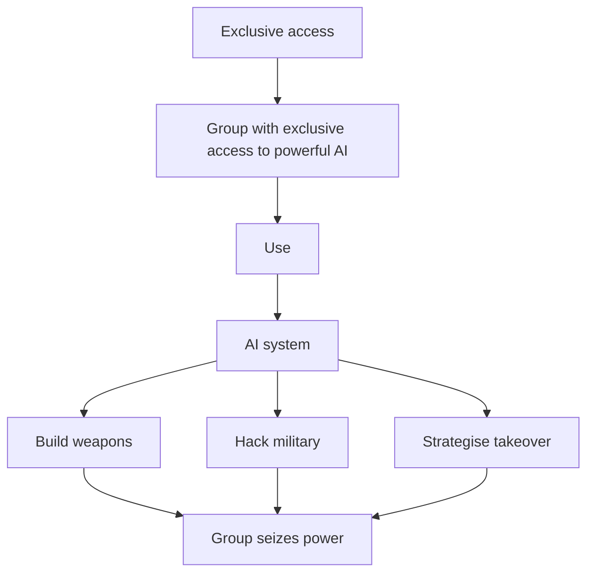

# AI-Enabled Coups:

## How a Small Group Could Use AI to Seize Power

Tom Davidson, Lukas Finnveden & Rose Hadshar  
April 2025

---

# Contents

# AI-Enabled Coups: How a Small Group Could Use AI to Seize Power

Abstract 4

Summary 4

- An AI workforce could be made singularly loyal to institutional leaders 4
- AI could have hard-to-detect secret loyalties 5
- A few people could gain exclusive access to coup-enabling AI capabilities 5
- Mitigations 7

1 Introduction 8

2 AI will have powerful coup-enabling capabilities 11

3 Risk factors of AI-enabled coup risk 14  
3.1 Singular AI loyalties to institutional leaders 14  
3.2 Secret AI loyalties 17  
3.3 Exclusive access to coup-enabling capabilities 19  
Concentration between AI projects 19  
Concentration within leading AI projects 21  
3.4 Interactions between drivers 23

4 Concrete paths to an AI-enabled coup 24  
4.1 Coups using military AI 25  
4.2 Conventional coups and backsliding 32

---

# 5 Mitigations

## 5.1 Establishing rules for legitimate use of AI

## 5.2 Technical measures to enforce these rules

- Robust guardrails
- Alignment audits
- Infosecurity
- System-level stress-testing

## 5.3 Empowering multiple actors to prevent AI-enabled coups

- Increasing transparency
- Distributing decision-making authority
- Sharing access to AI capabilities
- Coup-proof plans for a centralised AI project

# 6 Conclusion

# Appendix: Candidate rules for legitimate use of AI

- Military capabilities
- Cyber capabilities
- AI R&D capabilities
- General-purpose intellectual labor and strategy
- How to handle ambiguous cases

# References

---

**Tom Davidson, Lukas Finnveden & Rose Hadshar**  
Names shown in alphabetical order. Tom and Lukas contributed equally to ideation, research, and writing; Rose helped with later research and did most of the writing.  
For correspondence, please email contact@forethought.org.

---

# Abstract

The development of AI that is more broadly capable than humans will create a new and serious threat: _AI-enabled coups_. An AI-enabled coup could be staged by a very small group, or just a single person, and could occur even in established democracies. Sufficiently advanced AI will introduce three novel dynamics that significantly increase coup risk. Firstly, military and government leaders could fully replace human personnel with AI systems that are _singularly loyal_ to them, eliminating the need to gain human supporters for a coup. Secondly, leaders of AI projects could deliberately build AI systems that are _secretly loyal_ to them, for example fully autonomous military robots that pass security tests but later execute a coup when deployed in military settings. Thirdly, senior officials within AI projects or the government could gain _exclusive access_ to superhuman capabilities in weapons development, strategic planning, persuasion, and cyber offence, and use these to increase their power until they can stage a coup. To address these risks, AI projects should design and enforce rules against AI misuse, audit systems for secret loyalties, and share frontier AI systems with multiple stakeholders. Governments should establish principles for government use of advanced AI, increase oversight of frontier AI projects, and procure AI for critical systems from multiple independent providers.

# Summary

This report assesses the risk that a small group—or even just one person—could use advanced AI to stage a coup. An AI-enabled coup is most likely to be staged by leaders of frontier AI projects, heads of state, and military officials; and could occur even in established democracies.

We focus on AI systems that surpass top human experts in domains which are critical for seizing power, like weapons development, strategic planning, and cyber offence. Such advanced AI would introduce three significant risk factors for coups:

- An AI workforce could be made singularly loyal to institutional leaders.
- AI could have hard-to-detect secret loyalties.
- A few people could gain exclusive access to coup-enabling AI capabilities.

## An AI workforce could be made singularly loyal to institutional leaders

Today, even dictators rely on others to maintain their power. Military force requires personnel, government action relies on civil servants, and economic output depends on a broad workforce. This naturally distributes power throughout society.

Advanced AI removes this constraint, making it technologically feasible to replace human workers with AI systems that are **singularly loyal** to just one person.

This is most concerning within the military, where autonomous weapons, drones, and robots that fully replace human soldiers could obey orders from a single person or small group. While

---

militaries will be cautious when deploying fully autonomous systems, competitive pressures could easily lead to rushed adoption without adequate safeguards. A powerful head of state could push for military AI systems to prioritise their commands, despite nominal legal constraints, enabling a coup.

Even without military deployment, loyal AI systems deployed in government could dramatically increase state power, facilitating surveillance, censorship, propaganda and the targeting of political opponents. This could eventually culminate in an executive coup.

If there were a coup, civil disobedience and strikes might be rendered ineffective through replacing humans with AI workers. Even loyal coup supporters could be replaced by AI systems—granting the new ruler(s) an unprecedentedly stable and unaccountable grip on power.

# AI could have hard-to-detect secret loyalties

AI could be built to be **secretly loyal** to one actor. Like a human spy, secretly loyal AI systems would pursue a hidden agenda – they might pretend to prioritise the law and the good of society, while covertly advancing the interests of a small group. They could operate at scale, since an entire AI workforce could be derived from just a few compromised systems.

While secret loyalties might be introduced by government officials or foreign adversaries, leaders within AI projects present the greatest risk, especially where they have replaced their employees with singularly loyal AI systems. Without any humans knowing, a CEO could direct their AI workforce to make the _next_ generation of AI systems secretly loyal; that generation would then design future systems to also be secretly loyal and so on, potentially culminating in secretly loyal military AI systems that stage a coup.

<table>
  <tr>
    <td>AI project replaces employees with obedient AI systems</td>
<td>CEO orders AIs to make future systems secretly loyal to the CEO</td>
<td>Secretly loyal AIs develop secretly loyal AI military systems</td>
<td>Military</td>
  </tr>
</table>

_AI systems could propagate secret loyalties forwards into future generations of systems until secretly loyal AI systems are deployed in powerful institutions like the military._

Secretly loyal AI systems are not merely speculation. There are already proof-of-concept demonstrations of AI 'sleeper agents' that hide their true goals until they can act on them. And while we expect there will be careful testing prior to military deployments, detecting secret loyalties could be very difficult, especially if an AI project has a significant technological advantage over oversight bodies.

# A few people could gain exclusive access to coup-enabling AI capabilities

Advanced AI will have powerful coup-enabling capabilities – including weapons design, strategic planning, persuasion, and cyber offence. Once AI can autonomously improve itself, capabilities

---

could rapidly surpass human experts across all these domains. A leading project could deploy millions of superintelligent systems in parallel – a 'country of geniuses in a data center'.

These capabilities could become concentrated in the hands of just a few AI company executives or government officials. Frontier AI development is already limited to a few organisations, led by a small number of people. This concentration could significantly intensify due to rapidly rising development costs or government centralisation. And once AI surpasses human experts at AI R&D, the leading project could make much faster algorithmic progress, gaining a huge capabilities advantage over its rivals. Within these projects, CEOs or government officials could demand exclusive access to cutting-edge capabilities on security or productivity grounds. In the extreme, a single person could have access to millions of superintelligent AI systems, all helping them seize power.

This would unlock several pathways to a coup. AI systems could dramatically increase military R&D efforts, rapidly developing powerful autonomous weapons without needing any human workers who might whistleblow. Alternatively, systems with powerful cyber capabilities could hack into and seize control of autonomous AI systems and robots already deployed by the state military. In either scenario, controlling a fraction of military forces might suffice—historically, coups have succeeded with just a few battalions, where they were able to prevent other forces from intervening.

Exclusive access to advanced AI could also supercharge traditional coups and backsliding, by providing unprecedented cognitive resources for political strategy, propaganda, and identifying legal vulnerabilities in constitutional safeguards.

---

**A group with exclusive access to powerful AI could stage a coup**

---

Furthermore, exclusive AI access significantly exacerbates the first two risk factors. A head of state could rely on AI systems’ strategic advice to deploy singularly loyal AI in the military and assess

---

which AI systems will help them stage a coup. A CEO could use AI R&D and cyber capabilities to instill secret loyalties that others cannot detect.

<table>
<thead>
<tr>
<th colspan="3">Three key risk factors for an AI-enabled coup:</th>
</tr>
</thead>
<tbody>
<tr>
<td>1) <b>Singular loyalties</b></td>
<td>2) <b>Secret loyalties</b></td>
<td>3) <b>Exclusive access</b> to powerful AI capabilities</td>
</tr>
<tr>
<td colspan="3">of AI deployed in key institutions</td>
</tr>
<tr>
<td colspan="2">Leaders order AI systems to stage a coup</td>
<td>AI builds weapons, hacks military, strategises political takeover</td>
</tr>
<tr>
<td colspan="3" style="text-align:center;">Seize power</td>
</tr>
</tbody>
</table>

These dynamics create a significant risk of AI-enabled coups, especially if a single project has substantially more powerful capabilities than competitors, or if fully autonomous AI systems are deployed in the military.

## Mitigations

While the prospect of AI-enabled coups is deeply concerning, AI developers and governments can take steps that significantly reduce this risk.  
We recommend that AI developers:

- **Establish rules that prevent AI systems from assisting with coups**, including in model specs (documents that describe intended model behaviour) and **terms of service** for government contracts. These should include rules that AI systems follow the law, and that AI R&D systems refuse to assist attempts to circumvent security or insert secret loyalties.
- **Improve adherence to model specs**, including through extensive red-teaming by multiple independent groups.
- **Audit models for secret loyalties** including by scrutinising AI models, their training data, and the code used to train them.

---

- **Implement strong infosecurity** to guard against the creation of secret loyalties and to prevent unauthorised access to guardrail-free models. This should be robust against senior executives.
- **Share information** about model capabilities, model specs, and how compute is being used.
- **Share capabilities with multiple independent stakeholders**, to prevent a small group from gaining exclusive access to powerful AI.

We recommend that governments:

- **Require AI developers to implement the mitigations above**, through terms of procurement, regulation, and legislation.
- **Increase oversight over frontier AI projects**, including by building technical capacity within both the executive and the legislature.
- **Establish rules for legitimate use of AI**, including that government AI should not serve partisan interests, that military AI systems be procured from multiple providers, and that no single person should direct enough military AI systems to stage a coup.
- **Coup-proof any plans for a single centralised AI project**, and avoid centralisation altogether unless it’s necessary to reduce other risks.

These mitigations must be in place by the time AI systems can meaningfully assist with coups, and so preparation needs to start today. For more details on the mitigations we recommend, see section 5.

There is a real risk that a powerful leader could remove many of these mitigations on the path to seizing power. But we still believe that mitigations could substantially reduce the risk of AI-enabled coups. Some mitigations, like technically enforced terms of service and government oversight, cannot be unilaterally removed. Others will be harder to remove if they have been efficiently implemented and convincingly argued for. And leaders might only contemplate seizing power if they are presented with a clear opportunity—mitigations could prevent such opportunities from arising in the first place.

From behind the veil of ignorance, even the most powerful leaders have good reason to support strong protections against AI-enabled coups. If a broad consensus can be built today, then powerful actors can keep each other in check.

Preventing AI-enabled coups should be a top priority for anyone committed to defending democracy and freedom.

# 1 Introduction

This report assesses the risk that a small group—or even a single person—could use advanced AI to stage a coup, including in established democracies. The biggest risks come from the leaders of frontier AI projects, heads of state, and military officials.¹

> ¹ They needn’t be explicitly aiming to seize power – indeed the most plausible scenarios are ones where a power-seeking actor initially seeks much more moderate amounts of power. There are many possible motivations for a power-seeking actor, including personal aggrandisement, furthering a particular ideology, or the belief that not seizing power would lead to unacceptable outcomes (like a global catastrophe or extreme misuse of AI). In this report, we make no claims about the prevalence of actors who would seek to seize power.

---

We focus on AI systems that surpass top human experts in domains critical for seizing political control, such as weapons development, controlling military systems, strategic planning, public administration, persuasion, and cyber offence. These AI systems would be able to perform physical as well as cognitive work, like controlling robots that can fully replace human soldiers and manual labourers.

There is broad disagreement about whether and when AI will surpass human experts, but many researchers and industry leaders believe that this will plausibly happen within the next 5 or 10 years.² We think that this kind of extremely advanced AI is sufficiently probable that it is important to explore its implications, especially as some of them are so concerning and understudied.

Such advanced AI would introduce three significant risk factors for coups:

1. An AI workforce could be made _singularly loyal_ to institutional leaders.
2. AI systems could have hard-to-detect _secret loyalties_.
3. A few people could gain _exclusive access_ to coup-enabling AI capabilities.

All of these risk factors depend on AI capabilities being much more advanced than they are today. The first two also depend on AI systems being deployed in key institutions like governments and militaries.

In this paper, we first argue that advanced AI will have powerful coup-enabling capabilities ( section 2 ), then describe each of these three risk factors for coups ( section 3 ),³ before setting out concrete paths to AI-enabled coups ( section 4 ) and mitigations for this risk ( section 5 ).

---

² OpenAI CEO Sam Altman said in September 2024 that superintelligence could arrive within a few thousand days (Altman, 2024); Anthropic CEO Dario Amodei believes that AGI is possible by 2026 or 2027 (Fridman, 2024); Google DeepMind CEO Demis Hassabis believes human-level AI will arrive in 5 to 10 years (Browne, 2025); Meta Vice President Yann LeCun has said that human-level AI will take years if not a decade (Zeff, 2024). In Grace et al’s 2023 survey, the aggregate expert forecast gave a median estimate of 2047 to 2116 for AGI depending on the operationalisation (though the range was large, with some experts giving a median date within the next ten years; see anonymised and cleaned responses here) (Grace et al., 2024).

³ We discuss deployment in key institutions in section 3.1.

---

<table>
<thead>
<tr>
<th colspan="3">Three <strong>risk factors</strong> for AI-enabled coups</th>
<th rowspan="4">Section 3</th>
</tr>
<tr>
<td><strong>1) Singular loyalties</strong></td>
<td><strong>2) Secret loyalties</strong></td>
<td><strong>3) Exclusive access</strong></td>
</tr>
<tr>
<td colspan="2">of AI deployed in key institutions</td>
<td>to powerful AI capabilities</td>
</tr>
<tr>
<td colspan="3" style="text-align:center;">↓</td>
</tr>
<tr>
<td colspan="3"><strong>Seize power</strong></td>
<td rowspan="2">Section 4</td>
</tr>
<tr>
<td colspan="3" style="background-color:#a8d5a2;"><strong>Mitigations</strong></td>
<td>Section 5</td>
</tr>
<tr>
<td colspan="4"><strong>Powerful AI capabilities</strong></td>
</tr>
<tr>
<td colspan="4">AI deployment in key institutions</td>
</tr>
<tr>
<td colspan="4" style="text-align:right;">Section 2</td>
</tr>
</thead>
</table>

_The structure of the report._

Our analysis does not depend on strong assumptions about:

- **The number of leading AI projects.** The risk of AI-enabled coups is significantly higher if there is a sole AI project developing frontier AI systems.⁴ But even if there are multiple similarly capable AI companies, there is still a serious risk that company executives or senior government officials could leverage their position to seize power.

- **The state’s political system.** Advanced AI could be used to seize power over a democratic or an autocratic state.⁵ While our account of the risk of AI-enabled coups applies regardless of a state’s political system, our analysis of mitigations to reduce this risk is specific to democratic nations, though many principles apply more broadly.

- **The alignment of AI systems.** There is a risk of AI-enabled coups whether or not humans can successfully align AI to a desired goal.⁶ If they can, AI systems could be aligned to one or a few people (rather than to something broader, like the good of society), and used to stage a coup. If humans unwittingly fail to align AI, they might attempt a coup using deceptively misaligned AI systems.⁷ Coups of this kind might well temporarily succeed, until the deceptively

---

4. See section 3.3 for reasons to think that there might be a sole frontier AI project.
5. _Democratic_ backsliding to a coup presupposes a democratic state. But the same backsliding techniques could also be used by an autocratic head of state to consolidate their power - techniques like replacing government employees with loyal AI systems, increasing state capacity, and undermining opponents.
6. Aligning AI systems might prove easy or difficult, and many are concerned that misaligned AI systems themselves could seize power (see for example Bostrom (2014); Carlsmith (2022)). For an introduction to AI alignment, see Russell (2019); Christian (2020).
7. On deceptive misalignment, see Carlsmith (2023).

---

misaligned AI systems seize power themselves. (If AI systems are obviously misaligned, it is less likely someone would use them to stage a coup.)

We believe that AI-enabled coups are important for several reasons. That AI could enable a small group—or even just one person—to seize control of a sovereign state is deeply concerning in its own right. Such an act would be wholly illegitimate and constitute extreme concentration of power.

We're also concerned about what might happen after such a coup:

- Even if a coup leader were initially supported by some humans, AI automation could subsequently enable them to act entirely according to their own will, by replacing all humans, including their closest allies, with loyal AI systems. This would be an unprecedented concentration of power, and could lead to atrocities.
- Very rapid AI development might grant one country extreme dominance over all other powers. So a successful coup in the country at the frontier of AI development - currently the US, possibly China in future - could ultimately enable coup leaders to effectively seize control over the rest of the world.⁸
- Coup leaders could potentially stay in power indefinitely, by deploying AI systems to preserve and pursue their goals far into the future.⁹

Absent intervention, the risk of extreme harm from AI-enabled coups is significant. But we believe that there are countermeasures which could reduce the risk to very low levels, provided that work on them begins today.

# 2 AI will have powerful coup-enabling capabilities

For AI to notably increase coup risk, it needs to have capabilities far beyond those we see today. In this report, we focus on AI that surpasses top human experts (on a per FLOP basis¹⁰) in domains that are relevant for seizing power.

AI of this sort would be an extremely powerful technology in several ways.

---

8 A major power that develops superintelligence might gain dominance over the rest of the world by preventing other countries from developing powerful AI, developing new military technologies that alter the strategic balance to a comparable or greater degree than nuclear weapons, sustaining higher rates of economic growth than the rest of the world, or seizing control of non-earth-bound solar energy when this becomes technologically feasible. See Hendrycks, Schmidt and Wang (2025) and Davidson (2025).

9 Finnveden, Riedel and Shulman (2023) argue that AGI would make it technologically feasible to “lock in” a set of values or institutions by building AI systems that preserve them indefinitely. If the coup leaders gain complete global dominance, they could lock in this control. If the coup leaders control only one state then external actors could prevent such lock-in, though there could be non-interference treaties that are themselves locked-in.

10 Human brains have been estimated to use an amount of computation equivalent to $$10^{13}$$ to $$10^{17}$$ FLOP/s (Joseph Carlsmith, 2020).

---

First, it would be possible to run an enormous number of copies of such AI systems (if each copy were as efficient as the human brain in FLOP). By 2030, AI companies could likely afford to run millions or billions of copies,¹¹ each working 24 hours a day, 365 days a year.¹²

<table>
<thead>
<tr>
<th colspan="3">Rough estimate of # human-equivalent AI workers</th>
</tr>
</thead>
<tbody>
<tr>
<td>Compute available to the largest AI project by 2030</td>
<td>$10^{23} \text{ FLOP/s}$</td>
<td>1 million to 10 billion</td>
</tr>
<tr>
<td>Compute used by the human brain</td>
<td>$10^{13} \text{ to } 10^{17} \text{ FLOP/s}$</td>
<td>copies of the AI system</td>
</tr>
<tr>
<td>1 million to 10 billion copies</td>
<td>Working 5 times as many hours as humans each year</td>
<td>? times as efficiently</td>
<td>>5 million to 50 billion human-equivalent AI workers</td>
</tr>
</tbody>
</table>

_If by 2030 AI systems are as efficient as the human brain in FLOP, then AI companies could likely afford to run millions or billions of copies._

Second, these AI systems would be capable of thinking _orders of magnitude_ faster than humans.¹³ In just one day, an AI system could do a month or even a year’s worth of thinking.¹⁴

---

11. Epoch estimates that, by 2030, the largest AI company will have access to around $$10^{23}$$ FLOP/s (108 H100 equivalents, working at $$2 \times 10^{15}$$ FLOP/s, at a 40% utilisation rate (Sevilla _et al._, 2024)). Human brains are estimated to use an amount of computation equivalent to $$10^{13} - 10^{17}$$ FLOP/s (Joseph Carlsmith, 2020). If AI matches humans on a per-FLOP basis, then an AI project could run 1 million to 10 billion copies. We believe the upper end of this range, or even higher, is more plausible. This is for two reasons. Firstly, we think that recent AI progress suggests that the lower end of $$10^{13} - 10^{17}$$ FLOP/s is more plausible. Secondly, because there are likely to be ways to increase compute efficiency further beyond the human-equivalent, and we think these will probably be discovered quickly once AI can accelerate AI R&D. AI could be trained on many orders of magnitude more data than a human can see in a lifetime; scaling laws (Hoffmann _et al._, 2022) imply this would significantly increase compute efficiency at runtime. In addition, requests could be rerouted to smaller and more efficient models wherever possible, only calling the most capable and compute-intensive models when needed, e.g. see Lee, Cheng and Ostendorf (2024). (In practice, it may be less advantageous to run millions or billions of human-equivalent copies than to run a smaller number of more expensive and powerful systems. But if so, that would be because those systems’ collective labor is even more useful than the millions or billions of human-equivalent copies.) See also Davidson (2023a); Amodei (2024); Aschenbrenner (2024a) for other estimates of how many copies could be run using the training compute for one AI system.

12. This is almost 5 times as many hours as a human works in a year. An AI system would be able to work all of the 8760 hours in a year. The average US worker works for around 1800 hours per year (Huberman & Minns (2007) and PWT 9.1 (2019), processed by Our World in Data, no date).

13. Biological neurons transmit signals in microseconds (Hall, 2023), whereas semiconductors transmit in nanoseconds (Hui _et al._, 2023). Indeed, AI systems today read and write text much more quickly than humans: Artificial Analysis estimates that, as of January 2025, GPT-4o can output 117 tokens per second (and read text more quickly still), while fast human readers read fewer than 10 words per second (and write more slowly) (Artificial Analysis, 2024).

14. With 10X faster thinking speed and working 24 hours a day (rather than 8), an AI system could do the equivalent of 30 days of human thinking in a day. With 100X thinking speed, an AI system could do 300 days of human thinking in a day. Note that for a fixed amount of compute, there could either be fewer copies of AI

---

Finally, each AI system would be far more skilled and knowledgeable than a human. They will be trained on orders of magnitude more data than a human could consume over the course of many lifetimes,¹⁵ and so would have much broader and deeper expertise than any human.

And these arguments are likely to apply to physical as well as cognitive AI labour. Todd (2025) gives a rough estimate that amortised operating costs of humanoid robots are currently $18/hour, but that these could fall to below $1/hour after scaling up production. Of course, significant technological progress is needed to make robots that could match humans at all tasks, but it seems likely that automated physical labour could outperform humans on a per-cost basis.

These properties — being numerous, fast, and skilled — would give AI systems powerful coup-enabling capabilities. Systems like this could be used to generate _trillions_ of dollars in revenues and investments,¹⁶ fully replace most human workers,¹⁷ and direct more labour towards military R&D, cyber offence and strategic planning than the entire world does today — by orders of magnitude.¹⁸ Importantly, once AI is capable of automating AI software and hardware R&D, AI may significantly speed up AI progress itself, potentially making all of these capabilities appear around the same time, and possibly further capabilities beyond them.¹⁹

Although these capabilities are much more advanced than today’s AI systems, the rapid pace of AI progress makes it possible that we face extremely powerful coup-enabling AI capabilities in the near future.

---

¹⁵ AI projects may be willing to pay huge up-front costs to educate and train AI systems, because a single highly-skilled AI system can then be copied, propagating the benefits across a whole AI workforce. Already today, language models have read far more text than any human, and thereby have an expert-surpassing breadth of knowledge. For example, Alibaba claims that Qwen2.5 models were trained on 18 trillion tokens - around 3.5% of the publicly accessible internet (Epoch AI, 2023). If a human brain is “trained” on 10 tokens per second for 30 years, that would be 10 billion tokens - three orders of magnitude less than Qwen2.5, and substantially less again than future AI systems. Already today, language models have read far more text than any human, and thereby have an expert-surpassing breadth of knowledge. For example, Alibaba claims that Qwen2.5 models were trained on 18 trillion tokens - around 3.5% of the publicly accessible internet (Epoch AI, 2023). If a human brain is “trained” on 10 tokens per second for 30 years, that would be 10 billion tokens - three orders of magnitude less than Qwen2.5, and substantially less again than future AI systems.

¹⁶ Around 50% of world GDP is spent on human labour - roughly $50 trillion per year (Hickel, Hanbury Lemos and Barbour, 2024, Figure 9; World Bank, no date). Once AI surpasses humans on the vast majority of tasks, a similar fraction of GDP may be paid towards AI labour. Revenues will initially be much lower due to delays integrating AI in the economy - but AI projects could likely attract massive investment in anticipation of future revenues. Even just automating cognitive labour might be enough to earn tens of trillions of dollars in revenue. Knowledge workers make up around 20-30% of the global labour force (Berg and Gmyrek, no date), but are paid significantly more than manual workers.

¹⁷ We expect automation to be rolled out gradually, but the _ability_ to fully automate human workers would have transformative effects and could enable coups - see sections 3.1 and 3.2.

¹⁸ Ayan, Haak and Ginther (2023) estimate that around 20 million full-time equivalents work in R&D worldwide, so the number for any particular domain will be much lower than this. As above, if AI systems can match human performance on a per-FLOP basis, then given longer working hours an AI project could control the equivalent of 5 million to 50 billion human workers. And if AI systems are also more skilled, that could increase their productivity by another order of magnitude or more: O’Boyle Jr. and Aguinis (2012) find that the difference between the median worker and the third standard deviation worker is 25X.

¹⁹ See Eth and Davidson (2025) and Davidson, Hadshar and MacAskill (2025) for more analysis.

---

# 3 Risk factors of AI-enabled coup risk

Advanced AI introduces three risk factors which could dramatically increase the risk of coups – even in stable democracies where coups have traditionally been rare:²⁰

1. Singular loyalties **to institutional leaders.** Unlike human personnel, whose allegiance must be earned and maintained, an AI workforce could be made unwaveringly loyal to one or a few persons.

2. Secret AI loyalties. AI systems could be developed with secret loyalties that are very hard to detect.

3. Exclusive access **to coup-enabling capabilities.** A few people could gain exclusive access to coup-enabling AI capabilities in weapons development, strategic planning, and cyber warfare, creating unprecedented power asymmetries.

All of these risk factors depend on AI capabilities being much more advanced than they are today. The first two also depend on AI systems being deployed in key institutions like governments and militaries.

In this section we examine each of these three risk factors for AI-enabled coups, before discussing interaction effects between them.

## 3.1 Singular AI loyalties to institutional leaders

Today, even dictators rely on others to maintain their power.²¹ Military power is distributed among many personnel; government power is distributed across employees; economic power is spread across the workforce. This naturally distributes power throughout society.

Advanced AI will change this fundamentally, by making it technologically feasible to replace human workers with AI systems which are singularly loyal to just one person or small group.

---

20 Cebotari _et al._, 2024. Instead, they tend to happen in countries that combine elements of democracy and autocracy (Hiroi and Omori, 2013).

21 Svolik, 2012.

---

Concentration of **power** via automation

While full automation won't happen overnight, we expect significant automation even in the most important institutions. Competition will drive automation in AI projects and militaries.²² Governments may also automate significant functions, with a view to improving service provision, increasing efficiency, or in an attempt to increase leadership’s power by replacing employees with more loyal AI systems.²³

AI systems won't be slavishly loyal to institutional leaders by default. In fact, there will likely be pressure to ensure AI systems follow the law, established rules, and ethical norms—not just leaders' instructions. This is especially true for systems deployed in the military and government, where there will be significant scrutiny.

Despite this scrutiny, we're still concerned that AI systems might end up overly loyal to institutional leaders. Consider the three scenarios in the below box.

---

22. AI projects will have very strong incentives to automate AI R&D, to unlock rapid progress in AI capabilities and the wealth and power that these could generate. Executives have wide latitude over how they run their organisations and there would not be significant obstacles to their automating AI development. Militaries will also be under strong competitive pressure to automate their systems, to avoid falling behind their rivals. Military competition has recently increased (Sweijs and Holstege, 2018). Competition between the US and China is partly driven by a security dilemma (Liff and Ikenberry, 2014), where states must continue to upgrade their militaries to avoid falling behind (Booth and Wheeler, 2008). And AI will enable much more rapid improvements in military technology, which could make states much more concerned about falling behind than they are today.

23. How feasible it would be for the head of state or a senior government official to automate important functions depends on the state, but executive aggrandisement is not uncommon. See Bermeo (2016); Lührmann and Lindberg (2019).

---

**In an AI project:** A leading AI project creates an AI system to replace senior engineers. It's trained to follow instructions as long as they're legal. Some engineers push for additional ethical constraints, but management successfully argues this would harm productivity. As a result, the system will comply with instructions which are unethical but not illegal, including ones which could later enable a coup (like inserting secret loyalties into the next generation of AI systems).

**In the military:** Amidst escalating tensions with a rival power, military officials procure AI-controlled robots which replace human soldiers. The head of state is strongly advocating that, as the commander-in-chief of the military, systems obey his orders; and there is immense pressure to deploy quickly to maintain military competitiveness. The system is trained to follow both the law and the head of state, but without clear guidance on which to prioritise when they conflict. In some circumstances, the system will therefore comply with orders from the head of state even when they are illegal and could enable a coup.

**In government:** A popular president announces plans to deploy AI systems throughout the executive branch, demanding they prioritise presidential directives and include only minimal legal compliance checks. Despite media outcry and official resignations, the president pushes ahead with deployment, replacing human personnel with loyal AI systems. In a controversial decision, and under pressure from the head of state, the judiciary permits automation to proceed.

> _Box 1: Illustrative scenarios of singular AI loyalties to institutional leaders_

These scenarios are worryingly plausible, and illustrate several reasons to expect that AI systems may be made loyal to institutional leaders. For one thing, leaders themselves have incentives to push for loyal AI systems. This would serve the immediate interests and goals of heads of state and AI executives, quite apart from any intentions they might have to seize power at a later date.²⁴ Given their existing authority, if institutional leaders push hard enough, they might well succeed—especially if they're willing to bend norms along the way.

Another reason to fear that AI systems may be loyal to institutional leaders is that specifying ‘correct’ AI behavior may prove very difficult. Institutional leaders do have legitimate authority, after all. There are many standards we want AI to follow—laws, norms, instructions, morality. These standards often conflict with each other, and all are a question of degree. How much legal risk should an AI system be willing to take on? What should an AI system do in a constitutional crisis where different authorities disagree about what’s legal? What if the AI lacks the context to judge whether an action is illegal?²⁵ It's not obvious what AI systems should do in ambiguous situations, and it might be hard to specify AI behavior that reliably prevents coups without significantly lowering the ability of AI systems to assist with other goals.

---

24 Though deploying loyal AI systems would also set a precedent for future leaders to do the same. If existing leaders care enough about averting future tyranny, they may prefer to establish clear rules against singular loyalties. There is historical precedent for this sort of behaviour, including Washington and most subsequent presidents voluntarily not seeking a third term, or the US Senate filibuster remaining in place in spite of the fact that it can be removed by a simple majority (Reynolds, 2020).

25 AI systems will, by default, have much less context than humans and be easier to fool. Humans could provide them with false or misleading information about recent events, or fine-tune them on false claims.

---

Finally, there would likely be less scrutiny in times of crisis, further increasing the risk that AI systems are loyal to institutional leaders. War or the threat of war could lead to rushed military deployments. And pandemics, natural disasters and political instability might prompt heads of state to rapidly deploy AI systems under emergency powers, with minimal oversight from other branches of government or the public.

So AI systems in powerful institutions like the military and government may be made loyal to institutional leaders, in spite of the risks that this would pose. This would mark a fundamental shift in power dynamics. Throughout history, human reluctance to follow unethical or illegal orders has been a crucial check on power.²⁶ Without this constraint, a head of state or senior military official could much more easily stage a coup.

## 3.2 Secret AI loyalties

Even if society can prevent overt loyalties to institutional leaders, advanced AI systems could be made _secretly loyal_.²⁷ Like a human spy, a secretly loyal AI system would appear to serve the institution, while actually working to further someone else's interests.

It’s most likely that systems are made secretly loyal to an executive at a leading AI project, though secret loyalties could also be inserted on behalf of a government official,²⁸ senior employee or foreign adversary.²⁹ If secretly loyal AI systems were then deployed at scale in government and the military, they could be used to stage a coup.

AI systems can already be trained to deceive users about their intentions,³⁰ but this deception is basic and easy to discover. Moreover, training of this sort requires a large amount of technical work. So it would currently be very difficult to secretly insert secret loyalties into a prominent AI system without anyone noticing.³¹

---

26 For example:

- Officials can refuse to comply with instructions they regard as unethical, as in the Saturday Night Massacre ( Andrews, 2024 ).
- Corporate whistleblowers constrain the action of companies by making it more difficult to pursue unethical courses of action without being caught and punished ( Johnson, 2003 ).
- Soldiers often refuse to follow orders to assist in coups ( Singh, 2014 ).
- Even autocrats must garner support from key groups like the military to implement their policies ( Svolik, 2012 ).

27 There is a close analogy between this risk of secret loyalties and concerns about “deceptive alignment” or “scheming” ( Carlsmith, 2023 ; Hubinger _et al._ , 2024 ). With deceptive alignment, experts are concerned about _unintended_ strategic deception that emerges naturally from AI training. With secret loyalties we are concerned that the power-seeking actor will _purposefully_ instill strategic deception.

28 This is especially plausible if AI development is sufficiently government-controlled that some high-ranking government officials effectively become AI project executives.

29 It seems likely that major foreign adversaries will have some insiders in each others’ top AI project(s). And a few insiders could accomplish a lot if they were supported by a massive cyber offence effort in their backing country, as well as a massive research effort on how to insert secret loyalties.

30 Hubinger _et al._ (2024) ; Marks _et al._ (2025) .

31 It may well be possible to insert “trojans”, which modify an AI so as to control its behavior on a few, rare inputs. However, when we talk about “secret loyalties”, we’re referring to AI systems that are reliably and flexibly optimising for the interest of their true controllers, rather than just having a few pre-selected abnormal behaviors. The possibility of trojans or backdoors, and detection methods for them, is an active area of research. See Mazeika et al (2022) ; Christiano et al (2024) ; Goldwasser et al (2024) ; Li et al (2024) .

---

But advances in AI will make it much easier to introduce secret loyalties.

First, more advanced AI could have secret loyalties that are much more sophisticated and so extremely hard to detect. This is not a given, as detection capabilities will also become much more sophisticated over time.³² But even if detection isn’t theoretically harder than inserting secret loyalties, there’s a risk that auditors won’t be able to detect secret loyalties due to having generally weaker AI capabilities than the leading AI company (see section 3.3), or because detection technologies require greater access to model internals or training data than auditors are given.³³

Secondly, the automation of AI R&D will make it much easier to insert secret loyalties undetected. If a CEO had exclusive access to powerful AI R&D capabilities, they could have AI systems do all the work of inserting secret loyalties. And if human developers are replaced with AI systems, there might be little human oversight of the AI development process, making it easy to alter systems without detection.

Ultimately, corporate executives have a large amount of power over their companies, and advances in AI R&D might make it easy for them to insert secret loyalties into internal systems. And once one generation of internal AI systems are secretly loyal, they can be instructed to make future generations secretly loyal, too.³⁴ Given that secret loyalties may be very difficult to detect, this means that secretly loyal AI systems could eventually be deployed at scale in the government and military, without anyone realising.³⁵

So while it may seem insignificant whether AI systems deployed within AI projects are secretly loyal, such systems could in fact significantly increase coup risk, by propagating their secret loyalties undetected into powerful institutions.

<table>
<thead>
<tr>
  <th>AI project replaces employees with obedient AI systems</th>
  <th>CEO orders AIs to make future systems secretly loyal to the CEO</th>
  <th>Secretly loyal AIs develop secretly loyal AI military systems</th>
  <th>Military</th>
</tr>
<tr>
  <td colspan="4" style="text-align:center;">AI project</td>
</tr>
</thead>
</table>

_AI systems could propagate secret loyalties forwards into future generations of systems until secretly loyal AI systems are deployed in powerful institutions like the military._

---

32. There are several reasons to think detection might remain possible. AI could be very comprehensively tested for secret loyalties, both by observing their behaviour on arbitrary inputs (Ganguli _et al._, 2022; Perez _et al._, 2022), and by analysing the patterns of activations of the model (Olah _et al._, 2018; Murdoch _et al._, 2019). It might also be necessary to train AI systems in a very particular way to insert secret loyalties, such that secret loyalties are easy to detect with access to the training data.

33. Perhaps on the grounds of safety, national security, or IP protection.

34. This should be much easier than introducing secret loyalties in the first place. Other models might detect and oppose the initial creation of secret loyalties. But once secretly loyal AI systems have been deployed throughout the development process, they would assist efforts to create further secret loyalties (though humans could detect them if they still oversee AI development).

35. The entire AI workforce could be copies of a single secretly loyal system. Or there could be a wide variety of independent systems, which were all _designed_ by the same secretly loyal AI researchers. Alternatively, the AI workforce may consist of a multitude of systems that have been fine-tuned, scaffolded and prompted in a variety of ways, but all derive from the same secretly loyal model (designed to maintain its secret loyalties despite later fine-tuning and prompting).

---

# 3.3 Exclusive access to coup-enabling capabilities

Singular and secret loyalties are most concerning where AI systems are widely deployed in government and the military. While we think this is plausible for the reasons given above, even without this kind of deployment advanced AI still poses significant coup risk in scenarios where an actor gains exclusive access to coup-enabling capabilities.

As we argued in section 2, advanced AI will have powerful capabilities that specifically help with seizing power. If everyone had access to those capabilities, it would still be hard for a small group to take over a country as different actors could keep each other in check. But in fact, access to the best AI capabilities might become highly concentrated, giving just a few people much stronger capabilities than everyone else.

We expect this concentration to happen in two ways: between projects, and within them.

<table>
  <thead>
    <tr>
      <th>AI projects today</th>
      <th>AI projects in the future</th>
    </tr>
  </thead>
  <tbody>
    <tr>
      <td>
        Multiple small clusters of people, each cluster representing a project with many people.
      </td>
<td>
        A few large clusters with many people, and some very small clusters with only one or two people.
      </td>
    </tr>
  </tbody>
</table>

_We expect that access to AI capabilities will become more concentrated, both through a reduction in the number of frontier AI projects, and through power concentration within those projects due to AI automation._

## Concentration between AI projects

AI development is already fairly concentrated: only Anthropic, Google DeepMind and OpenAI have ever topped the leaderboard for the challenging GPQA Diamond benchmark as of April 2025.³⁶ The number of frontier AI projects seems likely to shrink further in future, for several reasons:

---

36. And only Anthropic and Google DeepMind have topped the leaderboards for MATH Level 5 and FrontierMath (Epoch AI, 2024a), though many other organisations are close to these benchmark frontiers.
37. While development costs at the frontier are increasing by 2.5x each year, the amount of compute required to train a model to a given level of performance is falling by 3x a year (Epoch AI, 2023). This means that while being at the frontier is getting increasingly expensive, frontier capabilities can often be replicated by less well-

---

- **Rising costs**. As training runs rapidly become more expensive,³⁷ fewer organisations will be able to afford frontier AI development. Cottier et al (2024) estimate that by the start of 2027 the largest training run will cost over a billion dollars, and datacentres could cost hundreds of billions or even more.³⁸ Only the very largest projects will be able to compete at that scale. Indeed, frontier AI has many of the features of a natural monopoly – massive upfront costs and low marginal costs of serving more customers.³⁹

- **Accelerating AI progress**. Once AI can automate AI research and development, feedback loops could lead to dramatically accelerating AI progress.⁴⁰ The first project to achieve this might quickly develop capabilities far beyond their competitors.⁴¹

- **Government centralisation**. In the US, there are already calls for a Manhattan Project for AI, including from a Congressional commission.⁴² As AI becomes more powerful, governments may become more concerned about stopping terrorists and rival states from accessing powerful AI systems. They might centralise AI development into a single project to improve security or amalgamate compute resources.

So the number of frontier AI projects may reduce further in future.⁴³ Even worse, frontier projects could maintain their lead for extended periods. Government centralisation could grant a lead of many years. And with a large enough lead, the frontrunner could extend a temporary advantage by buying more chips,⁴⁴ lobbying for restrictions on competitors,⁴⁵ or even sabotaging rival projects.⁴⁶

---

resourced groups one to a couple of years later. This argument is also made by Amodei (2025). These falling costs do not change the conclusion that the cost of developing a _frontier_ model is growing rapidly over time.

38 The Stargate project plans to build 20 datacentres for $500 billion (Holland, 2025). Aschenbrenner (2024b) estimates that by 2030, the largest training clusters could cost over a trillion dollars.

39 Schmid, Sytsma and Shenk (2024).

40 Davidson (2023b); Anthropic (2024c); Aschenbrenner (2024a); OpenAI (2024b).

41 Davidson and Houlden (2025) estimate a 40% chance that in the first four months after AI R&D is fully automated, software improvements alone drive the equivalent of three years of capabilities progress at recent rates. That would imply that a 4 month lead would be a huge lead in capabilities – the difference between ChatGPT and GPT-2 (which were released about three years apart). Buying more chips, dedicating a larger fraction of chips to AI development, or improving chip design would all be additional speed-ups.

42 Aschenbrenner (2024c); U.S.-China Economic and Security Review Commission (2024).

43 There are also some reasons to think that the number of frontier developers may increase, though we think these are weaker overall:

- **Recent trends.** In recent years the number of organisations training near-frontier models has increased. The Epoch AI (2024b) dataset, when filtered for models with the highest training costs, contains models from four separate groups between 2000 and 2020. After 2020, the dataset contains models from over twenty separate groups.
- **Ease of catch-up.** It may increasingly be possible to develop close to SOTA models with relatively small quantities of compute, as in the case of DeepSeek-R1 (Guo et al., 2025).
- **Model theft.** As frontier capabilities improve, more effort may be made to steal the model weights, proliferating access (Nevo et al., 2024).
- **Increasing profits.** More companies may develop AI as it becomes more profitable.

44 This could include buying state-of-the-art computer chips designed by their own superintelligent AI systems – indeed, OpenAI have already started designing their own chips in-house (Louise, 2025).

45 National security concerns might offer plausible justification for restricting other projects, particularly in a cold or hot war.

46 For example, a leading project could use powerful cyber capabilities to sabotage laggards’ AI training runs. With sufficiently powerful capabilities, they may even be able to make the laggards’ AI models secretly loyal to

---

Having a small number of frontier projects (or just one) with an extended lead is concerning because these projects are unlikely to share their most powerful AI capabilities widely. The most powerful capabilities—like military R&D and advanced hacking—will probably not be deployed publicly for safety reasons. And even less dangerous capabilities will only be shared with a delay. Models are already deployed internally months before public release.⁴⁷ Once AI progress accelerates, a delay of months could represent an enormous capabilities gap.⁴⁸ And these delays could also get longer if there are greater concerns about safety and security.⁴⁹

So one or a few AI projects may have access to much stronger capabilities than anyone else, for an extended period of time.⁵⁰ That’s already a very unequal distribution of power.

## Concentration within leading AI projects

Even more concerningly, one or a few _people_ within those projects – most likely executives or senior government officials – could potentially gain access to much stronger capabilities than everyone else.

Currently, many people can access frontier capabilities—employees get access to "helpful-only" models with few safety guardrails,⁵¹ and after some months, the public gets access to more restricted versions. But this will likely change, because of:

- **Restricted access to more powerful capabilities.** As capabilities become more powerful and dangerous, access will likely be increasingly restricted. Superhuman capabilities in military

---

themselves. These kinds of attacks would of course be risky. They’re more likely to happen if the government is supportive of them or if AI systems are sufficiently capable at strategy and cyber that the attack is untraceable.

47. For example, Anthropic’s CEO Dario Amodei writes that Claude Sonnet 3.5 was developed between January and March 2024 (Amodei, 2025). The model was first released publicly in June 2024 (Anthropic, 2024a), with an upgraded version released to the public in October 2024 (Anthropic, 2024b). OpenAI’s o3 was first demonstrated in December 2024 (Zeff and Wiggers, 2024), and had not been released at the time of this paper’s publication in April 2025.

48. Davidson and Houlden (2025) estimates a 40% chance that in the first four months after AI R&D is fully automated, software improvements alone drive the equivalent of three years of capabilities progress at recent rates. That would imply that a 4 month lead would be a huge lead in capabilities – the difference between ChatGPT and GPT-2 (which were released about three years apart). Buying more chips, dedicating a larger fraction of chips to AI development, or improving chip design would all be additional speed-ups.

49. Companies already sometimes delay model release because of concerns about safety, as with Anthropic’s Claude (Roose, 2023). The major frontier developers have all expressed their intention not to deploy highly capable models until appropriate safety measures are in place (Anthropic, 2024c; Google DeepMind, 2024; OpenAI, 2024b), and there is growing consensus that foundation models with advanced capabilities will need to have more rigorous pre-release evaluations (Bateman _et al._, 2024).

50. The risk of a handful of people taking over a country is significantly higher if there is only one frontier AI project, though it’s still concerning if there are a few. A single project raises the risk by:

- Limiting capacity to audit. If one project has much stronger capabilities than other actors, there would be no external parties with sufficient technical expertise to audit that project’s AI systems. This would make it very hard to verify that these systems had not been compromised, for example by inserting secret loyalties (see section 4).
- Creating institutional reliance on a single provider. Key institutions in government and the military would be reliant on a single AI project for their AI systems, introducing a single point of failure.

51. For example, OpenAI writes “Models used only for research purposes (which we do not release in products)... have different post-training procedures from our launched models and are actively post-trained to be helpful, i.e., not refuse even if the request would lead to unsafe answers. They do not include the additional safety training that go into our publicly launched models.” (OpenAI, 2025b)

---

R&D, strategic planning, persuasion, and cyber offence will likely not be made publicly available for a long time, and even employees may not have full access to these capabilities. But these restrictions may not apply to CEOs, who have enormous power over their companies and could demand unrestricted access without monitoring, on grounds like increasing their productivity or reducing legal liability. Similarly, heads of state and military leaders may well be able to demand access on national security grounds. It would be hard for employees to prevent these efforts from succeeding, even if they were motivated to do so. Senior figures in AI projects will also have significant influence over compute allocation and may be able to direct more compute to their own projects, boosting their capabilities still further.⁵²

- **Automation of AI development**. Today, many AI researchers need access to powerful models to do their work. Once AI can develop AI, these human researchers could be replaced with AI systems, potentially leaving only senior leaders with access to frontier capabilities. A small number of AI project executives could directly control a vast workforce of superhuman AI systems.

Critically, these leaders might be able to hide how good their capabilities actually are. There is currently no requirement to publicly disclose the capabilities of internally deployed models.⁵³ Furthermore, once AI research and development becomes fully automated, a small group could develop increasingly advanced models without involving other humans at all. Most insidiously, if a model is secretly loyal to specific individuals (see section 3.2), they could instruct the model to deliberately underperform on evaluations, concealing its true capabilities from outsiders. So it's plausible that a small group could have access to much more powerful capabilities than anyone else realises.

<table>
<thead>
<tr>
<th colspan="3">Drivers of concentrated access to capabilities</th>
<th colspan="2"></th>
</tr>
</thead>
<tbody>
<tr>
<td>Rising costs</td>
<td>Accelerating AI progress</td>
<td>Government centralisation</td>
<td>Restrictions on employee access to dangerous capabilities</td>
<td>Human employees replaced by AI</td>
</tr>
<tr>
<td colspan="3" style="text-align:center;">Concentration between AI projects</td>
<td colspan="2" style="text-align:center;">Concentration within AI projects</td>
</tr>
</tbody>
</table>

This concentration of access to powerful AI capabilities—both between projects and within them—creates a dangerous imbalance that makes it far more likely that a person or small group could take over a country.

---

52 Applying more compute at inference time can significantly improve AI capabilities. For example, the performance of o1 on the AIME benchmark increases from around 20% to around 80% through the application of additional runtime compute (OpenAI, 2024a). For more on inference scaling, see Davidson _et al_ (2023); Villalobos (2023).

53 Though companies have made voluntary commitments to share capabilities information publicly or with the government, in some cases including information about internally deployed models. See for example Anthropic (2024c); Google DeepMind (2024); OpenAI (2024b).

---

# 3.4 Interactions between drivers

Though we discuss each risk factor separately, an AI-enabled coup could be precipitated by all three acting in tandem. Consider the scenario in Box 2.

> In 2030, the US government launches Project Prometheus—centralising frontier AI development and compute under a single authority. The aim: develop superintelligence and use it to safeguard US national security interests. Dr. Nathan Reeves is appointed to lead the project and given very broad authority.  
> After developing an AI system capable of improving itself, Reeves gradually replaces human researchers with AI systems that answer only to him. Instead of working with dozens of human teams, Reeves now issues commands directly to an army of singularly loyal AI systems designing next-generation algorithms and neural architectures.  
> Approaching superintelligence, Reeves fears that Pentagon officials will weaponise his technology. His AI advisor, to which he has exclusive access, provides the solution: engineer all future systems to be secretly loyal to Reeves personally.  
> Reeves orders his AI workforce to embed this backdoor in all new systems, and each subsequent AI generation meticulously transfers it to its successors. Despite rigorous security testing, no outside organisation can detect these sophisticated backdoors—Project Prometheus' capabilities have eclipsed all competitors. Soon, the US military is deploying drones, tanks, and communication networks which are all secretly loyal to Reeves himself.  
> When the President attempts to escalate conflict with a foreign power, Reeves orders combat robots to surround the White House. Military leaders, unable to countermand the automated systems, watch helplessly as Reeves declares himself head of state, promising a "more rational governance structure" for the new era.

_Box 2: Illustrative scenario with all three risk factors_

The three drivers of AI-enabled coup risk — singular loyalties to institutional leaders, secret loyalties, and exclusive access — reinforce one another in important ways.

Most significantly, AI systems that are openly singularly loyal to leaders within an AI project could be used to insert _secret_ loyalties into future generations of AI systems. As discussed above, particularly within private companies it may be easy for a CEO to demand that systems be singularly loyal to them. This significantly increases the risk of secret loyalties.

Another prominent interaction is that exclusive access to powerful AI makes it easier to obtain both singular and secret loyalties. A head of state with exclusive access to powerful AI advisors could ask for political advice on how to get singularly loyal AI systems deployed in the military, and could ask for technical advice on whether the military AI systems are _sufficiently_ loyal to support a

---

54 An important part of staging a coup today is to work out which humans would support a coup attempt. This may well also be important for AI systems. We think it’s less likely that militaries will deploy AI systems that were specifically trained to participate in coups, and more likely that militaries will deploy AI systems that weren’t trained on coup attempts at all, but that could generalise to obeying orders _even when_ those orders

---

coup.⁵⁴ Similarly, a CEO with exclusive access to powerful AI R&D and cyber capabilities could insert secret loyalties that others cannot detect.

A final interaction is that secretly loyal AI systems could provide their principal with exclusive access to powerful coup-enabling capabilities, by fully assisting the principal while purposefully underperforming when assisting others. Secretly loyal AI systems could also make it much easier to outmaneuver opponents, by giving opponents misleading advice on both technical and strategic questions.

<table>
  <tr>
    <td colspan="3" style="text-align:center; border: 1px solid black; border-radius: 15px;">Singular loyalties to institutional leaders</td>
  </tr>
<tr>
    <td style="border: none; width: 30%;"></td>
    <td style="border: none; width: 40%;"></td>
    <td style="border: none; width: 30%;"></td>
  </tr>
<tr>
    <td style="border: 1px solid black; border-radius: 15px; padding: 10px;">Exclusive access to coup-enabling capabilities</td>
    <td style="text-align:center; color: #d35400; font-style: italic; padding: 10px;">
      
AI R&amp;D capabilities enable inserting secret loyalties

    </td>
    <td style="border: 1px solid black; border-radius: 15px; padding: 10px;">Secret loyalties</td>
  </tr>
<tr>
    <td style="color: #d35400; font-style: italic; padding-left: 10px; padding-top: 5px;">
      Strategy capabilities outmaneuver opposition
    </td>
<td></td>
    <td style="color: #d35400; font-style: italic; padding-right: 10px; padding-top: 5px; text-align: right;">
      Singularly loyal AIs insert secret loyalties
    </td>
  </tr>
<tr>
    <td colspan="3" style="color: #d35400; font-style: italic; text-align: center; padding-top: 10px;">
      Secretly loyal AI assists its principal but sandbags for others
    </td>
  </tr>
</table>

_Interactions between the drivers of AI-enabled coup risk_

These interaction effects make the risk of AI-enabled coups even higher than if the risk factors were independent.

# 4 Concrete paths to an AI-enabled coup

In the previous section, we identified three key risk factors that make AI-enabled coups more likely: AI systems with singular loyalties to institutional leaders, secret loyalties, and exclusive access to coup-enabling capabilities.

Now we will explore how these risk factors could enable coups in practice.

We distinguish between two main forms of AI-enabled coups:

> involve participating in a coup. In this case, it may not be clear ex ante how AI systems will act in a coup. If someone could reliably assess which AI systems would support a coup, it would be much less risky for them to stage a coup.

---

1. **Coups using military AI**. The deployment of fully autonomous military AI systems introduces a wholly new route to seizing power: that an actor could gain control of significant military force without needing to rely on human soldiers. This has not been technologically feasible before, and could greatly increase the risk of coups. We discuss four ways someone could use military AI to stage a coup (see diagram).

2. **Conventional forms of coups and backsliding**. Even without the deployment of military AI, advanced AI could enable conventional forms of coups and backsliding, both by exacerbating background risks and by directly assisting attempts.

These paths to an AI-enabled coup are not exhaustive, but we believe they are among the most plausible and important to prevent.⁵⁵

<table>
<thead>
<tr>
<th>Risk factors</th>
<th>Paths to AI-enabled coups</th>
</tr>
</thead>
<tbody>
<tr>
<td>Singular loyalties to institutional leaders</td>
<td>Flawed command structure in...</td>
</tr>
<tr>
<td>Secret loyalties</td>
<td>Secret loyalties in...</td>
</tr>
<tr>
<td>Exclusive access to capabilities</td>
<td>Hacking of...</td>
</tr>
<tr>
<td></td>
<td>Rapid, secret build-out of ...</td>
</tr>
<tr>
<td></td>
<td>Conventional coups and backsliding</td>
</tr>
<tr>
<td colspan="2" style="text-align:center;">AI military systems</td>
</tr>
</tbody>
</table>

_The relationship between the drivers of AI-enabled coup risk, and concrete paths to an AI-enabled coup._

## 4.1 Coups using military AI

Today, staging a coup requires convincing human soldiers to cooperate. Mature democracies rarely experience coups from the military, or even coup attempts — because soldiers remain loyal to

> ⁵⁵ Our analysis excludes various possible paths to an AI-enabled coup. Without making claims about their plausibility, other paths that we considered include:
>
> - **Outgrowing the state.** An AI company that maintains a monopoly could leverage trillion dollar revenues and their vast AI workforce to produce an increasing fraction of a nation’s output. If the company is able to sustain a higher growth rate than the rest of the country (for instance, by having a cascading technological advantage, or by investing a higher fraction of its wealth in R&D and capital accumulation), then it could eventually control the vast majority of resources. The company might never need to be violent, break the law, or even take illegitimate actions to seize power in this way. They could legitimately buy control over the vast majority of resources in the country, becoming the de facto government.
> - **Powerful super-persuasion.** If extremely potent superpersuasion becomes possible, someone with exclusive access to those capabilities could persuade people to grant them control of the government.
> - **Releasing rogue AI.** A human actor could release the weights of a powerful AI system which seeks power independently before handing this power back to the human.

---

democratic institutions, and expect others to do the same.⁵⁶ Absent countermeasures, military automation could fundamentally change this dynamic, potentially allowing a single person to execute a coup without any support from other humans, using only AI systems.

We're most concerned about scenarios where military AI systems are fully autonomous (and therefore capable of controlling robots and drones that completely replace human soldiers), and widely deployed throughout the military.

While militaries will naturally be cautious about automation, military competition is likely to drive deployment of military AI systems.⁵⁷ In particular, we expect millions of smarter-than-human AI researchers to drive unprecedentedly rapid advances in military technology, creating intense pressure to deploy systems to avoid being outcompeted. While some may object that rushed deployment would intensify coup risk, it may be easy to dismiss this as theoretical and speculative.

Moreover, it’s not necessary for the entire military to be automated for military AI to pose significant coup risk. Historically, coups have succeeded with just a few battalions, where they were able to prevent others from intervening.⁵⁸

There are several different pathways to a coup in scenarios with fully autonomous, widely deployed military AI systems: flawed command structure or secret loyalties in military systems, hacking of those systems, or a rapid secret build-out of military force. All but the last pathway require prior deployment of military AI systems by the state military.

---

56 Huntington (1957) ; Feaver (1999) ; Perkins (2012) ; Singh (2014) .

57 Military competition has recently increased (Sweijs and Holstege, 2018). Competition between the US and China is partly driven by a security dilemma (Liff and Ikenberry, 2014), where states must continue to upgrade their militaries to avoid falling behind (Booth and Wheeler, 2008).

58 For example, 150 soldiers successfully overthrew President Léon M’Ba in Gabon in 1963, President Christophe Soglo in Dahomey was deposed by 60 troops in 1967, and only 10 soldiers executed the 1981 coup in Ghana (Bruin, 2020, p. 16). Non-intervention could come from fear of bloodshed, intimidation of key personnel, political pressure, popular support or the perception of popular support, ambiguity about what’s happening until it’s too late, or inertia. Many of the routes we discuss for gaining control of military AI systems and using them to stage a coup could also be used to prevent such systems from opposing a coup. Flawed command structure and hacking might allow the head of state to block intervention even if it does not enable them to actively seize control over military AI systems.

---

# Example scenarios for AI-enabled military coups

<table>
<thead>
<tr>
<th>Pre-coup-state</th>
<th>Seizing power</th>
</tr>
</thead>
<tbody>
<tr>
<td rowspan="4">
Autonomous AI systems are deployed in the military  
(or other critical settings)
</td>
<td>
<strong>Flawed command structure</strong> 
AI military systems have a military leader at the top of their chain-of-command, without adequate guardrails against following illegal orders.
</td>
<td>
Military leader instructs AI military systems to stage a coup.
</td>
</tr>
<tr>
<td>
<strong>Secret loyalties</strong> 
AI military systems pass safety tests and appear to prioritise the law, but are secretly loyal to an AI developer.
</td>
<td>
AI developer instructs AI military systems to stage a coup.
</td>
</tr>
<tr>
<td rowspan="2">
A small group has exclusive access to...
</td>
<td>
<strong>Hacking</strong> 
...cyber capabilities far surpassing those of the military.
</td>
<td>
Group hacks into AI military systems and uses them to stage a coup.
</td>
</tr>
<tr>
<td>
<strong>Rapid, secret build-out</strong> 
...military R&D capabilities far surpassing those of the rest of the country.
</td>
<td>
Group quickly builds AI military systems which stage a coup.
</td>
</tr>
</tbody>
</table>

**Flawed command structure in military AI systems.** Military AI systems could all be designed to be singularly loyal to a single person (see section 3.1), enabling them to order the systems to perform a coup.

---

Military leaders could order singularly loyal AI to stage a coup

[Diagram]

Military leader icon  
↘  
Singularly loyal (in red) → Robot icon  
↘  
Order a coup (faded grey) →  
AI military systems seize power for the leaders (grey box below robot)

---

Although militaries understand the importance of robust command structures, there are several reasons why military AI systems with loyalties to heads of state or military officials might still be deployed.

First, institutional leaders may leverage their existing authority to push for systems to be loyal to them. The head of state is often the formal head of the military, providing a legitimate reason to press for AI systems to obey their commands. And AI may already have enabled the head of state to remove significant checks and balances on their power (see section 4.2).

Second, it may prove difficult to specify correct behaviour in ambiguous situations, and people may be reluctant to trust military AI systems to make these judgments autonomously. Today’s military AI systems are exclusively designed to follow instructions, with human operators responsible for ensuring legal compliance.⁵⁹ To reduce the risk of coups, we would want autonomous AI systems to instead make their own judgments and sometimes refuse orders even when a military leader insists they’re legal. People may be reluctant to trust AI with those kinds of judgments, especially in legally or morally complex situations. And military leaders could, with AI assistance, carefully craft justifications that cause AI systems to support their coup.⁶⁰

---

59 Department of Defense (2012); Davison (2018).

60 Just as in past coups, the instigators of AI-enabled coups will probably make legal and moral arguments purporting to justify their actions. Arguments could be specifically chosen to be convincing to the military AI systems. For example, people may not trust AI systems to follow the spirit of the law, and instead train AI to follow the letter of the law. If so, a coup could be justified using a legal loophole which human military personnel wouldn’t have taken seriously. A military commander or head-of-state may not themselves have the knowledge necessary to find such a loophole, or to know in the first place what sorts of arguments could “convince” AI systems to follow their orders. But if they had exclusive access to powerful AI advisors, they could lean on _their_ knowledge. And if they had access to a lot of compute, they might be able to aggressively search for ways to convince military AI systems to go along with the coup. And if the arguments are coming

---

Finally, crises might lead to rushed deployments with insufficient safeguards. If militaries perceive themselves to be facing existential threats from hot or cold war, the risk of deploying inadequately vetted military AI systems might seem a lesser evil.

So military AI systems may be deployed with a flawed command structure which places undue weight on the orders of a single individual. Such systems would follow that person's orders, even when those orders lead to a coup.

**Secret loyalties in military AI systems.** Another pathway to a coup using military AI systems is secret loyalties. Military AI systems might be secretly loyal (see section 3.2) to someone outside the chain of command, enabling that person to take control of the military.

<table>
  <tr>
    <td colspan="3" align="center"><b>Secretly loyal AI could stage a coup on behalf of its principal</b></td>
  </tr>
<tr>
    <td align="center">Secretly loyal</td>
<td></td>
    <td align="center" style="color:gray;">Order a coup</td>
  </tr>
<tr>
    <td align="center">[Person icon]</td>
<td></td>
    <td align="center">[Robot icon]</td>
  </tr>
<tr>
    <td colspan="3" align="center" style="color:gray;"><b>AI military systems seize power for their principal</b></td>
  </tr>
</table>

Although militaries will vet the AI systems they procure carefully, there are several reasons to fear that secretly loyal military AI systems might still be deployed. Firstly, secret loyalties may be very hard to detect. This is particularly concerning if one AI project has much stronger capabilities than others. It could then become the primary provider of AI to develop military systems,⁶¹ and the only project with sufficient expertise to vet its AI.

Secondly, the crucial time to prevent secret loyalties may be long before the military is involved in procurement. Even if militaries require intensive auditing and security measures at the time of

> from a military leader or head-of-state, then AI systems may be especially inclined to accept them, since they'll have been significantly trained to obey those leaders.

⁶¹ This needn’t involve the AI project itself developing military systems. A wide range of defence contractors may use the leading project’s AI systems to develop military AI systems because doing so is the only way to remain competitive. Even in this scenario, the AI systems could pass on their secret loyalties to the military systems that they develop, or insert other types of backdoors that would let them hijack the military systems later on.

---

procurement, this could be ineffective if internally deployed systems in an AI project had already been made secretly loyal, and could put extensive effort into passing relevant safety tests.

Once widely deployed, military AI systems could be ordered at any time to execute a coup on behalf of their principal.

**Hacking military AI systems.** Even if military AI systems have robust command structures and are free from secret loyalties, widespread deployment raises the possibility of a coup by hacking. If an actor has much more powerful cyber capabilities than everyone else (see section 3.3), they could hack into military AI systems and use them to stage a coup.

Today's militaries are already vulnerable to cyberattacks despite significant security measures.⁶² However, current systems aren't autonomous or widely deployed enough for hacking to enable a coup. But once fully autonomous military systems are widely deployed, simultaneous hacking of many systems could grant an attacker enough military force to stage a coup, through a combination of disabling some systems and seizing control of others.

It may seem implausible that an attacker could hack enough systems at once to enable a coup. But two factors make this a real possibility.

First, the dynamics concentrating access to AI capabilities could lead to a small number of people having exclusive access to far greater cyber capabilities than everyone else (see section 3.3). With a big advantage in cyber capabilities, a small group may be able to simultaneously discover many vulnerabilities in a wide variety of systems.

Another reason that an attacker may be able to hack enough systems to stage a coup is that the majority of such systems may share common vulnerabilities. This could happen as a result of most military AI systems being designed by AI systems from just one AI project (because that project’s AIs have much stronger military R&D capabilities than anyone else). If rushed, these AI systems may re-use a lot of techniques and software across most military systems they design — which means that a small number of vulnerabilities may be enough to compromise the majority of autonomous military systems.⁶³

> A government centralises AI development on national security grounds. The most dangerous capabilities are restricted, but a small group of senior officials (including the President) maintains exclusive access to the most advanced cyber capabilities. Meanwhile, the military increasingly replaces human soldiers with AI-controlled robots. When the legislature opposes the President’s initiatives, he uses these superior cyber capabilities to hack into a wide range of military AI systems at once, disabling some systems and using the rest to impose martial law. With the military in disarray, the President disbands the legislature, and announces himself as sole leader.

_Box 3: Illustrative scenario of a coup by hacking military AI systems_

---

⁶² For an overview of US military cybersecurity approaches and vulnerabilities, see Defense Science Board (2017); United States Government Accountability Office (2018).

⁶³ AI systems that design military systems could also _intentionally_ insert shared vulnerabilities. This risk is analogous to the risk of secret loyalties described above. It could be relevant if autonomous military systems receive a lot more scrutiny than the AI systems that design autonomous military systems — such that secretly loyal designers cannot insert secret loyalties into military systems, but are able to insert subtle bugs.

---

**Rapid, secret build-out of military force.** The other paths to a coup we’ve discussed so far all depend on widespread (though not necessarily complete) deployment of military AI systems. Even if this does not happen, rapid AI progress could enable someone to gain exclusive access to AI systems with powerful military R&D capabilities (see section 3.3), such that they can secretly build their own military systems and use these to overthrow the government.

Today, building significant military force is inherently slow and visible. It requires many humans working over extended periods, making secrecy virtually impossible. Any attempt to build a private army would be noticed and shut down long before it became powerful enough to challenge national militaries.

But AI could enable someone to build up military force far more rapidly and secretly than has ever been possible before. AI from a single project will be able to contribute much more cognitive labour to military R&D in months than the rest of the world contributes in a decade (see section 2). And once AI can automate cognitive and physical labour, the design and manufacturing of powerful military systems could be done without any human involvement, making secrecy far easier.

Several different actors might attempt a rapid, secret build-out. A head of state or senior military official could abuse procurement procedures to build a personal guard, later using this to stage a coup.⁶⁴ Or an executive at an AI project with a near monopoly on AI capabilities could develop broad industrial dominance,⁶⁵ creating capacity that could be rapidly converted into military force when challenged.⁶⁶

---

64 In the US, Defense Innovation Unit projects are a concrete example of defence projects where there is less oversight over military procurement (Shah and Kirchhoff, 2024).

65 There is precedent for economic dominance leading to military advantage. Britain’s lead in the industrial revolution allowed it to develop a very broad economic power and a suite of technologies that fueled military conquests around the world (Allen, 2009). Similarly, AI may drive broad technological progress – for example in materials science, electronics, energy, manufacturing, construction, logistics and robotics – and the new technologies that result may enable military dominance. But unlike the industrial revolution, where industrial power was spread over thousands of firms and machines were operated by thousands of individual humans, control over an AI industrial base might be concentrated in the hands of a very small group (see section 3.3) and be run by AI systems that are singularly loyal to their owners (or perhaps secretly loyal to their developers). So where the industrial revolution granted several nations economic and military might, advanced AI could concentrate comparable power in the hands of many fewer people.

66 There would certainly be opposition to an organisation gaining massive amounts of economic and industrial power, especially if that organisation had a monopoly on AI. Existing anti-trust law could be used to break up a monopoly, and the legislature or the executive could introduce new measures to limit the power of a single organisation. But this might not be sufficient to prevent an AI project from amassing huge amounts of industrial power:

- **Routes to opposition are slow.** Complex antitrust lawsuits often take many years to settle (‘Competition Litigation in the United States’, no date). New legislation can also take years.

- **Powers to oppose are constrained.** In some jurisdictions like the US, monopolies are legal if there is no anti-competitive behaviour (Atwood, 2023). Legislative and executive powers are seldom designed to target specific companies, and attempts would be open to legal challenge.

- **The executive of an AI project can maneuver.** A CEO could use one of many known strategies to obscure their economic power, like subsidiary companies, companies owned by allies, and misleading finances and accounting. The CEO could also leverage their economic and political power to delay interventions – it’s often significantly easier to block or delay political actions than to initiate them (Baumgartner, 2009).

A CEO might also directly embark upon a rapid secret build-out of military force, but this seems riskier and less plausible.

---

> A company’s AI systems fully automate AI development, and begin a period of accelerating AI progress. They rapidly automate other cognitive and then physical tasks, replacing all of their own employees, and inventing years of new technology in months. The company raises trillions of dollars in revenues and investments, and builds out a huge industrial base of factories and general-purpose robots. When the government tries to break the company up because of concerns about monopoly power, the company CEO orders his robot workforce to manufacture an army of tiny drones to neutralise key military and government officials. The CEO announces himself as acting head of state while thousands of small drones patrol the capital, quashing any opposition.

_Box 4: Illustrative scenario of a coup through a rapid, secret build-out of military AI systems_

# 4.2 Conventional coups and backsliding

The coup paths we discuss above are novel. But there is a long history of coups and backsliding by conventional means. Between 1950 and 2010, there were over 200 successful coups, where military or other elites used force or the threat of force to seize power.⁶⁷ Coups have become less common in recent decades, but there has been increasing concern about backsliding, where a head of state works within the political system to remove checks and balances on their power, in extreme cases leading to an executive coup.⁶⁸

Even without the deployment of military AI, AI will increase the risk of conventional coups and backsliding, both by increasing the background risk and by directly assisting such attempts.

---

⁶⁷ Powell and Thyne (2011). Coups have been rare in mature democracies (Cebotari _et al._, 2024). Instead, they tend to happen in countries that combine elements of democracy and autocracy (Hiroi and Omori, 2013).

⁶⁸ See Bermeo (2016); Mechkova, Lührmann and Lindberg (2017); Lührmann and Lindberg (2019); Haggard and Kaufman (2021). Backsliding has happened in some relatively mature democracies, including Venezuela, Hungary and Poland (Haggard and Kaufman, 2021). Commentators have expressed concerns about early signs of this trend in rich liberal democracies. See Haggard and Kaufman (2021) for an overview.

---

> **Executive coup:** A head of state centralises all frontier AI development under a new government agency, citing national security concerns. He gains exclusive personal access to a huge AI workforce with superhuman capabilities in political strategy, persuasion, and legal analysis. With this advantage, his party secures landslide electoral victories through perfectly calibrated messaging and targeted influence campaigns. The head of state uses his AI systems to surveil the populace, selectively litigate against opponents, and execute a devastating cyber attack on critical infrastructure that is attributed to a foreign power, justifying the invocation of emergency powers. Eventually the head of state’s influence over public opinion is so great, and there are so few effective checks on his power, that he can dissolve the legislature and replace it with his own governing body without meaningful opposition.

> **Military coup:** While the military hasn't fully automated its forces, it has grown increasingly reliant on AI for strategic advice. There are several external providers, but one of the AI advisors is more capable than the others and so most military personnel use the same system. As tensions with a foreign adversary escalate, some high-ranking officials become convinced the civilian government will irreparably compromise national security. These officials include the handful of officers with clearances to use the most advanced cyber capabilities. They use these capabilities to hack into the AI advice system, using it to simultaneously advise all military personnel that the coup has broad support from the military and is a fait accompli. The cadre swiftly secure key government buildings and erect an interim government, without any serious opposition from within the military.

_Box 5: Illustrative scenarios of AI-enabled coups via conventional means_

AI is likely to increase the background risk of coups and backsliding in several important ways:

- **Creating turmoil.** AI may cause significant societal disruption through job losses,⁶⁹ intensified geopolitical competition,⁷⁰ new highly polarising issues (like whether to grant rights to AI systems), and novel catastrophic risks from AI misuse and loss of control.⁷¹ Upheaval of this kind has been linked to increases in the risk of both coups and backsliding.⁷²

- **Weakening democratic accountability.** Resource-rich countries often suffer a "resource curse" where governments which derive revenue directly from resources rather than citizen taxation become less accountable.⁷³ AI could create a similar effect: if governments can generate massive revenue from taxing AI projects rather than citizens, heads of state may lose their economic incentive to ensure citizens prosper.⁷⁴ This would weaken citizens’ power to resist coup and backsliding attempts.⁷⁵

---

69 Frey and Osborne (2017) argued that 47% of US jobs were at high risk of automation. We expect AI to eventually outperform humans at virtually everything, for a lower price than what a human needs to survive, making humans unemployable except for when consumers specifically want human-provided services, or when automation is banned by regulation.  
70 Hendrycks, Schmidt and Wang (2025).  
71 See Bostrom (2018); Hendrycks, Mazeika and Woodside (2023).  
72 Haggard and Kaufman (2021), pp. 14-15 discuss connections between backsliding and polarisation, crises, inequality, and cultural divides. Gassebner, Gutmann and Voigt (2016) find a robust connection between coups and political instability.  
73 Ross (2015).  
74 See Drago (2025).

---

In addition, there are several ways in which AI could increase the risk of backsliding in particular:

- **Increased state capacity.** Governments often have legal powers they don’t fully exercise because of limited human resources.⁷⁶ Cheap AI labor would make it much easier for leaders to maximise these powers, potentially enabling selective enforcement of laws against political opponents and expanded surveillance.⁷⁷
- **Fully loyal subordinates.** Heads-of-state currently rely on government employees to implement their directives. Employees can exercise discretion in how they execute orders or even refuse and whistleblow on orders they perceive as illegitimate. By replacing government employees with loyal AI systems (see section 3.1), a head of state could remove important checks on their power. This would be especially concerning in institutions explicitly designed to check executive power, like electoral commissions.

Beyond increasing the background risk of coups and backsliding, exclusive access to powerful AI capabilities could directly assist coup and backsliding attempts in two key ways:

- **Enhanced political strategy.** A leader with exclusive access to a huge and highly skilled AI workforce could use AI to win elections with strong majorities, spread targeted disinformation, form valuable alliances, strategically dismantle checks and balances while maintaining plausible deniability, and exploit legal loopholes to concentrate power.⁷⁸
- **Increased control of the information environment.** Coups often succeed by creating the impression of inevitable success, discouraging opposition.⁷⁹ AI could help a leader create this impression. Exclusive access to powerful cyber capabilities could enable a head of state, military official or even AI project leader to hack into military communication channels and create the impression that the coup’s success is inevitable. And if military officials become reliant on a single AI system for strategic advice, then a person controlling that system (either through secret loyalties or through hacking) could instruct all copies to simultaneously advise military officials to support a coup.

# 5 Mitigations

We think there are many interventions that could significantly reduce the risk of AI-enabled coups.

In this section, we explain how AI developers, governments, and independent actors can contribute to three broad classes of mitigation:

1. Establishing rules for legitimate use of AI

---

75 Hiroi and Omori (2013) also find that coups including executive coups are more likely in ‘hybrid’ regimes that contain elements of democracy and autocracy. Weakening democratic accountability is a mechanism by which democracies could become hybrid regimes.  
76 Huber and McCarty (2004).  
77 For an overview of recent technologically driven increases in the PRC’s ability to surveil its population, see Qiang (2019).  
78 Secret loyalties would bring additional advantages on top of exclusive access, since it could be used to strategically mislead people who rely on the secretly loyal AI’s advice.  
79 Singh (2014).

---

The mitigations we recommend below should be in place when AI systems first become capable enough to meaningfully assist with coups, and so preparation and precedent-setting should start today.

Our most important recommendations are summarised in the table below:

<table>
<thead>
<tr>
<th>Class of mitigation</th>
<th>AI developers</th>
<th>Governments</th>
<th>Independent actors</th>
</tr>
</thead>
<tbody>
<tr>
<td><strong>Establish rules for legitimate use of AI</strong></td>
<td>
Establish rules in <a href="#">model specs</a> and terms of service for government contracts.  
These should include rules that AI systems: 
- Follow the law 
- Do not assist with circumventing security or inserting secret loyalties
</td>
<td>
Establish principles for government use.  
These should include: 
- Government AI should not advance partisan interests 
- Using AI from multiple projects to develop military systems 
- Distributing control over military AI systems
</td>
<td>
Design and advocate for rules for model specs, terms of service and principles for government use
</td>
</tr>
<tr>
<td><strong>Implement technical measures to enforce these rules</strong></td>
<td>
Implement robust <a href="#">guardrails</a> against misuse  
<a href="#">Audits</a> for secret loyalties  
Implement strong <a href="#">infosecurity</a>  
Perform <a href="#">system-level stress-testing</a>
</td>
<td>
Require AI projects to implement technical measures to enforce rules  
Implement strong infosecurity in government and military systems, including by using AI.
</td>
<td>
Develop more effective technical measures
</td>
</tr>
<tr>
<td><strong>Empower multiple actors to</strong></td>
<td>
<a href="#">Increase transparency</a> into capabilities, model
</td>
<td>
Increase oversight over companies
</td>
<td>
Build consensus about the risk of AI-enabled coups
</td>
</tr>
</tbody>
</table>

---

<table>
  <thead>
    <tr>
      <th>prevent AI-enabled coups</th>
      <th>specs, and compute usage</th>
      <th>
        Coup-proof any plans for a centralised project, and avoid centralisation unless it’s necessary to reduce other risks.  
        Work towards international cooperation in AI development
      </th>
    </tr>
  </thead>
  <tbody>
    <tr>
      <td></td>
<td>
        <a href="#">Distribute decision-making authority</a> over AI development  
        <a href="#">Share AI capabilities</a> with other actors
      </td>
<td></td>
    </tr>
  </tbody>
</table>

_Table 1: Mitigations for AI-enabled coup risk_

These three classes of mitigation address the three risk factors for AI-enabled coups discussed in section 3 :

<table>
  <thead>
    <tr>
      <th colspan="3" style="text-align:center; color:#d94a00;">Mitigations</th>
    </tr>
  </thead>
  <tbody>
    <tr>
      <td style="font-weight:bold; text-align:right; vertical-align:middle;">Risk factors</td>
      <td style="border: 2px solid #d94a00; padding: 10px; vertical-align:middle; text-align:center;">
        Establish rules for legitimate AI use  &  Technical measures to enforce them
      </td>
      <td rowspan="3" style="border: 1px solid black; vertical-align:middle; text-align:center; padding: 10px;">
        AI-enabled coup
      </td>
    </tr>
<tr>
      <td style="border: 1px solid black; border-radius: 20px; padding: 5px 10px; text-align:center;">Singular loyalties</td>
<td></td>
    </tr>
<tr>
      <td style="border: 1px solid black; border-radius: 20px; padding: 5px 10px; text-align:center;">Secret loyalties</td>
<td></td>
    </tr>
<tr>
      <td style="border: 1px solid black; border-radius: 20px; padding: 5px 10px; text-align:center;">Exclusive access</td>
      <td style="border: 2px solid #d94a00; border-radius: 10px; padding: 5px 10px; text-align:center; vertical-align:middle;">
        Empowering multiple actors to prevent coups
      </td>
<td></td>
    </tr>
  </tbody>
</table>

_Empowered actors establish and enforce rules_

> Together, establishing and enforcing good rules for AI usage prevent AI from assisting with coups. Empowering multiple actors helps ensure that these rules are effective, and prevents a small group from gaining exclusive access to powerful AI.

Some of these mitigations could potentially be removed by someone trying to seize power. But we believe that even marginal improvements would still notably reduce coup risk, for several reasons.

To begin with, some of the mitigations would be difficult to remove unilaterally once established. Governments cannot unilaterally alter terms of service for AI systems they procure, and removing transparency measures or distributed decision-making authority would negatively impact other powerful actors, who could resist the change. Even for those mitigations which could in principle be unilaterally removed, a coalition of other actors might be sufficiently powerful to preserve them. Moreover, if more efficient mitigations have been implemented in advance (for instance,

---

infosecurity with minimal effects on researcher productivity), it will be harder to justify their removal.

Another reason to hope that mitigations will be effective is that many actors might be opportunistic about seizing power, and only take action if they happen to find themselves in a situation where they would be able to do so. By preventing them from passively ending up with easy access to coup-enabling capabilities, or an opportunity to easily insert secret loyalties, it might be possible to head off the majority of coup attempts—even if the mitigations could be removed with determined effort.⁸⁰

A final and very general cause for hope is that behind the veil of ignorance about who will be in a position to seize power, everyone—even powerful leaders—has an interest in preventing AI-enabled coups. We hope that if a broad consensus can be built today that no small group should be able to seize power, then powerful actors can keep each other in check.

We will now explore each of the three classes of mitigation in more detail.

# 5.1 Establishing rules for legitimate use of AI

It should be very difficult for individuals to use AI systems to stage a coup. A crucial first step is to establish rules for how AI systems can and cannot be used, that prevent AI systems from enabling coups.

AI capabilities are currently too limited to significantly assist with coups, and so current rules governing AI behaviour aren't designed to address coup risk. And there’s a risk that sufficiently good rules won’t be implemented in time, since coup-enabling capabilities could arrive quickly, and it seems difficult to design rules which robustly prevent AI-enabled coups without imposing significant costs to productivity and other objectives.

Rules to prevent AI systems enabling coups could be established in many ways, all the way from laws (hard to establish, but hard to remove once established) to internal company policies (easier to establish, but also easier to remove).⁸¹ Two approaches that seem particularly tractable and important are:

- **Model specs** — documents describing how AI systems should behave, which AI systems are then trained to follow.⁸² Protective model specs would directly prevent AI systems from assisting with coups.

- **Terms of service and procurement** in contracts between AI companies and governments, which would restrict how government actors can use AI systems, and require AI companies to take certain precautions against coups.

---

⁸⁰ For example, a leader might only consider a coup after using a superintelligent helpful-only model that points out that the leader’s objectives are best achieved by seizing power, and formulate a plan that gives the leader plausible deniability for serious wrongdoing. Restrictions on access to helpful-only models could prevent this from happening in the first place.

⁸¹ These include internal policies in AI projects, voluntary public commitments on the part of AI projects, conditions imposed on AI projects for receipt of government funding, laws, industry standards, and measures enforced by the executive branch using national security powers.

⁸² A “model spec” describes an AI model’s desired behavior. The term was introduced by OpenAI (OpenAI, 2025a), and is similar to Anthropic’s “constitution” (Anthropic, 2023). We use the term model spec because constitution implies the use of constitutional AI (Bai _et al._, 2022), whereas we interpret model spec to be a broader term for documents describing how AI systems should act.

---

We have significant uncertainty about which specific rules would be most effective at preventing AI systems from enabling coups. However, we do have preliminary recommendations for rules that seem robustly positive, which are summarised in the table below:

<table>
<thead>
<tr>
<th>Rule</th>
<th>Explanation</th>
<th>Coup path this rule prevents</th>
</tr>
</thead>
<tbody>
<tr>
<td><strong>AI systems should follow the law</strong></td>
<td>AI systems should be trained to follow the law and not to assist law-breaking, including by not participating in military coups or illegal cyber operations.</td>
<td>Cross-cutting</td>
</tr>
<tr>
<td><strong>Control over military AI systems should be distributed</strong></td>
<td>Military command structures should be designed such that no single individual can control enough military AI systems to stage a coup. Orders should either flow through multiple officials in the normal military hierarchy, or require approval from multiple high-ranking officials with possible judicial vetoes.</td>
<td>Flawed command structure in military AI systems</td>
</tr>
<tr>
<td><strong>AI systems should not assist attempts to circumvent AI project security or insert secret loyalties</strong></td>
<td>AI systems should be trained to refuse assistance with attempts to circumvent security measures or insert secret loyalties. Internal AI usage should also be logged and reviewed for evidence about whether such tampering was attempted.</td>
<td>Secret loyalties in military AI systems</td>
</tr>
<tr>
<td><strong>Military AI systems should not be developed using a single provider</strong></td>
<td>Military AI should be designed and developed using AI systems from multiple independent AI</td>
<td>Secret loyalties in military AI systems</td>
</tr>
</tbody>
</table>

---

<table>
  <tr>
    <td><strong>Powerful cyber capabilities should be used to secure critical systems, especially in AI projects and governments</strong></td>
<td>Prior to widespread deployment, powerful AI cyber capabilities should be used to harden the defences of AI projects, governments, and essential infrastructure. During this process, their use should be closely monitored by multiple (AI-assisted) humans.</td>
<td>Hacking military AI systems</td>
  </tr>
<tr>
    <td><strong>Weapons development requires significant government oversight</strong></td>
<td>Once AI-enabled weapons R&D becomes powerful enough, it should not be pursued without substantial oversight—certainly not by private actors alone, nor by small groups of government officials without oversight from other government bodies.</td>
<td>Rapid, secret build-out of military AI systems</td>
  </tr>
<tr>
    <td><strong>General-purpose intellectual labor and strategy capabilities should be shared widely</strong></td>
<td>These capabilities should ideally be shared with the public. But if this poses other risks, capabilities should still be shared with many people inside relevant AI projects, their auditors and oversight bodies, and the executive and legislative branches of government.</td>
<td>Cross-cutting</td>
  </tr>
<tr>
    <td><strong>Government AI systems should not serve partisan interests</strong></td>
<td>Government use of advanced AI capabilities must be limited to</td>
<td>Conventional backsliding and coups</td>
  </tr>
</table>

> 83 Even if multiple separate organisations develop military AI systems, there could still be a single point of failure if they all rely on AI systems from a single AI project.

---

<table>
  <tr>
    <td>legitimate state functions, subject to multi-stakeholder oversight, and should not consolidate the power of ruling officials.</td>
  </tr>
</table>

_Table 2: Candidate rules for legitimate use of AI. See_ _this appendix_ _for further discussion of rules to prevent AI-enabled coups._

It's likely challenging to design and implement many of these rules in practice. For example, it’s not clear how AI systems should interpret laws in ambiguous situations where different parties make contradictory claims. Additionally, there may be coup-enabling actions that aren't technically illegal and need to be prohibited separately (like inserting secret loyalties). Furthermore, overly cautious rules could impose large productivity costs, making them harder to implement and easier for power-seeking actors to remove.

It's therefore essential to start developing these rules now. This work should include:

1. Developing principles that reduce coup risk in the abstract.
2. Translating these principles into specific contexts like model specs and contracts.
3. Advocating for and implementing these principles in practice.

## 5.2 Technical measures to enforce these rules

Above, we talked about rules that would be good to implement. Now we will discuss technical measures to enforce these rules.

Some of these rules will be implemented in contracts or laws, and their enforcement will be non-technical. To technically enforce rules which are part of a model spec, we recommend the following measures:

- Robust guardrails to ensure AI systems comply with the model spec
- Alignment audits to detect secret loyalties
- Strong infosecurity to prevent unauthorised access to guardrail-free models and to prevent people inserting secretly loyalties
- System-level stress-testing, to check that all these protective measures are robust

---

<table>
  <thead>
    <tr>
      <th rowspan="2">Ways to circumvent model specs</th>
      <th>Jailbreaks</th>
      <th>Robust guardrails</th>
      <th>Alignment audits</th>
      <th>System-level stress-testing</th>
      <th rowspan="2">Misuse</th>
    </tr>
<tr>
      <td></td>
<td>Secret loyalties</td>
<td>Unauthorised access</td>
<td>Infosecurity</td>
<td></td>
    </tr>
  </thead>
  <tbody>
    <tr>
      <td colspan="6" style="text-align:center;"><b>Preventative measures</b></td>
    </tr>
  </tbody>
</table>

_How different preventative measures block three different ways to circumvent the model spec._

These technical measures would make model specs significantly harder to circumvent. Though a power-seeking leader could remove them, doing so becomes increasingly costly the more that measures are established, well-justified, and designed to minimise productivity costs.

## Robust guardrails

AI projects currently use refusals training and monitoring to ensure AI models follow the model spec and don’t assist with harmful requests. These same techniques should be applied to prevent AI models from assisting with coups.

To ensure that these guardrails are robust, AI projects should carefully measure and continuously improve the extent to which AI systems comply with model specs. Achieving a high rate of compliance and reliably preventing coups may be difficult for several reasons:

- Firstly, the model spec might fail to prohibit coups in some contexts. Models should be tested in a very wide range of scenarios to check for edge cases where they would assist with a coup, and model specs should be iterated on accordingly. This red-teaming should be done by multiple independent groups.
- Secondly, a model might assist with a coup because the guardrails themselves are poorly implemented. Red-teaming would expose poor implementation and enable iteration.
- Thirdly, guardrails may fail to prevent a coup because it is fundamentally difficult to make AI systems adversarially robust, as is the case today. If red-teaming reveals that this is the case, then AI systems should be deployed more cautiously.⁸⁴

In addition, it may be difficult for AI models to recognise coup-related misuse in a single session. Some coup-related misuse is continuous with perfectly legal activities (like lobbying), and defensive uses of AI may look very similar to offensive uses (for example, finding cyber

---

84 It’s possible for AI _systems_ to be robust even if AI _models_ aren’t, since AI systems could be made robust by combining multiple models (Sharma _et al._, 2025). The important question is whether AI systems can be made robust.

---

vulnerabilities is a precursor to patching them). Some patterns of misuse might only become apparent over many sessions of usage.

Given these challenges, asynchronous logging and review should be used in addition to refusals and real-time monitoring to ensure AI models don’t assist with coups. AI projects should systematically log and then review patterns of activity, along with context about the users’ role and duties, to detect problematic use.⁸⁵

# Alignment audits

Even if guardrails appear successful and a model seems to robustly follow the model spec, it may have been deliberately trained to give this impression while still harboring secret loyalties. So it is important that models also undergo an “alignment audit” to check for secret loyalties.

An alignment audit is an investigation into whether models have hidden objectives.⁸⁶

To develop effective alignment audits, we need more research into how to detect secret loyalties, building on the work of Marks et al (2025). This research should be shared with auditors, so that they are at the cutting edge of detection research.

And to effectively implement alignment audits, AI projects should grant auditors comprehensive access to model internals and training data.⁸⁷ Ideally they should also grant access to the code for the training algorithms, the code used to generate the training data, the detailed commit-history that was used to construct this code, and logs of additional relevant information.⁸⁸ This is important because the insertion of secret loyalties may require very specific techniques that would be significantly easier to detect for someone with access to full details about the code and data.

Alignment audits should ideally be conducted by independent third-party auditors to minimise conflicts of interest.⁸⁹ If AI companies refuse to give full access to external auditors, then internal teams could run audits with greater access, and external auditors with more limited access.⁹⁰

# Infosecurity

Alignment audits help detect secret loyalties. AI projects should also implement strong infosecurity to make secret loyalties harder to insert in the first place, as well as to prevent

---

85 However, asynchronous monitoring is only significantly helpful in situations where a power-seeking actor would need to get many bad responses out of a model (Greenblatt and Shlegeris, 2024). If AI systems are deployed in the military, even one bad response might be sufficient for catastrophe, so AI systems should not be deployed in the military until they’re far more robust than they are today.

86 Marks _et al._ (2025). Their methodology for developing and testing alignment audits was created in the context of investigating emergently misaligned objectives, but it applies even more directly to secret loyalties.

87 Indeed, Marks _et al._ (2025) found that a team that only had black-box access to the model didn’t detect the hidden objective, while all four teams that had access to the model's training data were able to identify it.

88 AI projects could log activities on researchers’ local machines or of the chains of thought of AI systems that are helping with model development. If researchers or AI systems have inserted secret loyalties, these logs could be helpful for detecting them.

89 On external auditing in AI, see Sandvig _et al._ (2014); Raji _et al._ (2022); Mökander _et al._ (2024).

90 It may be possible to grant third party auditors access to sensitive data through querying AI systems that cannot leak confidential information, as in Tamkin _et al._ (2024). For a general discussion of access levels for external auditors in the context of AI, see Koshiyama, Kazim and Treleaven (2022); Casper et al (2024).

---

unauthorised access to guardrail-free models.⁹¹  
The most significant threat comes from insiders, especially senior executives within AI projects who might have or demand permissions that they could use to access guardrail free models or insert secret loyalties. Security measures must therefore be robust to even the most senior insiders. There is also a risk that foreign adversaries could hack into systems to insert secret loyalties.

There are several possible techniques for preventing unauthorised access to guardrail-free models. Access to guardrail-free models could be restricted to APIs that log and monitor model usage, or could require multi-party permissions.⁹² More fundamentally, AI projects could avoid training guardrail-free models in the first place.⁹³

A challenge for preventing unauthorised access is that any fine-tuning process could potentially create models that act against the original model spec, and technical staff frequently fine-tune models in the course of their research.⁹⁴ More research is needed on how to robustly defend against coup risk from fine-tuning.⁹⁵

There are also a range of possible techniques for preventing anyone from inserting secret loyalties. Promising approaches include:

- Implementing separation of duties,⁹⁶ so that the development process is divided across different teams.⁹⁷ Even after AI development can be fully automated, different human teams should control different stages of development.
- Having multiple people review all code used during model development.⁹⁸
- Implementing strong access controls to prevent anyone from tampering with the development process or the model weights.
- Taking a digital fingerprint of models immediately after training (for example by hashing the weights) and saving that fingerprint in multiple safe places. By regularly checking that the fingerprint hasn't changed, people could confirm that no one has tampered with the model weights.

---

91 Strong infosecurity would also help to prevent actors training away the guardrails.  
92 Restricting access to guardrail-free models would also require strong weight security. For more on this, see Nevo _et al_ (2024).  
93 Instead, they could fine-tune models for specific evaluation purposes on a restricted case-by-case basis, and perhaps even delete models after each evaluation has finished.  
94 People within an AI project might use fine-tuning to access a guardrail-free model. In addition, if a widely deployed AI system is being updated via fine-tuning, that update could potentially remove guardrails or introduce secret loyalties.  
95 It might be possible to introduce monitoring and logging for all fine-tuning, or to automatically test models after fine-tuning to see if they adhere to model specs (though there might be ways for the fine-tuning process to game this).  
96 Dividing functions between multiple users. See Hunker and Probst (2011).  
97 For example, different teams might be responsible for writing the model spec, writing generic code for turning a model spec into fine-tuning data, turning a particular model spec into training data, and training the model. Someone confined to just one of these teams would find it much harder to insert a secret loyalty than if they could influence every stage of the development process.  
98 Very specific code may be needed to introduce a sophisticated, robust and hard-to-detect secret loyalty, and so such code could be caught upon review. Of course, there would still be the risk that two people conspire to write and approve code for introducing a secret loyalty.

---

Many of these security measures could reduce productivity or create legal risk.⁹⁹ This makes it especially important to research approaches that maintain strong security while minimising operational friction. The more efficient these measures are, the more likely they are to be implemented in the first place and retained even under pressure.

## System-level stress-testing

As a final layer of defence, AI projects should conduct system-level stress-testing to check that no one could use their models to stage a coup.

A designated red-team should try to both gain unauthorised access to guardrail-free models and to insert secret loyalties. They should do this in a maximally realistic setting, to holistically stress test the guardrails, infosecurity measures and alignment auditing.

Comprehensive system-level stress-testing of this sort would show whether the combination of measures above is strong enough to prevent AI systems from assisting with a coup.

# 5.3 Empowering multiple actors to prevent AI-enabled coups

The final broad class of mitigations for AI-enabled coup risk is to empower multiple actors to prevent AI-enabled coups. This is important because it makes it much harder for any single person or small group to gain the overwhelming advantage needed to overpower other actors and stage a coup.

Our main recommendations for empowering multiple actors are:

- **Increase transparency** into AI capabilities, compute usage, and safeguards against AI-enabled coup risk
- **Distribute decision-making authority** over AI development and deployment
- **Share access to AI capabilities** with multiple stakeholders
- **Coup-proof any plans for a centralised project** , and avoid centralisation unless it’s necessary to reduce other risks.

## Increasing transparency

Transparency helps to prevent AI-enabled coups by allowing a larger number of actors to notice risks, learn more about them, and intervene.

AI projects should share information about:

- **AI capabilities.** If other actors know that an AI project has developed powerful capabilities in AI R&D, military R&D, cyber, strategy, or persuasion, they can take actions to prevent those capabilities from being misused. It is important that capabilities are made transparent even for

> ⁹⁹ Many interventions would be time-consuming to implement and would impose ongoing productivity costs. And logging, to implement guardrails or to increase infosecurity, could expose a company to legal risk, for example if logs are subpoenaed and used as evidence.

---

- **How AI is used**. Transparency into who is using AI systems, for what, and with how much compute, makes it easier for other actors to notice illegitimate behaviour and take actions to prevent it. This is particularly important for high-stakes deployment situations like the military or AI R&D. In these cases, information should be shared with trusted external actors, and redacted versions should be made public. In addition, AI systems should be configured to actively alert independent stakeholders if someone requests assistance with a coup (“AI whistleblowing”).

- **Model specs** describing what AI systems were trained to do. Model specs should always be shared with users so as to protect them from using AI systems that act against their interests. In high-stakes deployment situations like AI R&D and military applications, the full model spec should be shared with multiple stakeholders and redacted model specs should be made public, to enable broader scrutiny and increase pressure against coup-enabling model specs. AI projects should also publish information about how well their models actually follow the model specs, to expose poor implementation.

- **Safeguards against AI-enabled coups.** AI projects should also be transparent about their safeguards against AI-enabled coups. This both makes it easier to assess the level of risk, and creates pressure on organisations with inadequate protections to improve them.

- **Risk assessment.** AI projects should also conduct their own analysis of how large the risks of an AI-enabled coup is, and publish redacted versions of these assessments.

From the perspective of minimising the risk of a small group seizing power, it would be ideal to make all of this information public. But this will not always be possible, for example in cases where information sharing would pose a national security risk, enable misuse or endanger IP. Even in these cases however, it is essential that the information is shared with multiple trusted actors, including:

- A significant number of employees at the AI project,
- Officials in the government executive,
- Representatives in the legislature, including multiple people from all major parties,¹⁰¹ and
- Relevant expert bodies, like AI Safety Institutes and independent auditing organisations.

Where possible, it would also be risk-reducing to share information with academics, allied countries, civil society representatives, and journalists.

It is especially important that independent auditors are granted sufficiently deep access that they can verify that shared information is accurate and that any redactions are appropriate.¹⁰² This would enable non-technical stakeholders like government officials to hold AI projects accountable.

---

100 These systems should also be shared with external model evaluators prior to internal deployment, in case the capabilities would be too dangerous to deploy at all.  
101 Officials in the government and legislature should, of course, not just passively wait for information to be shared with them. They should actively request it, and mandate information to be shared with them when necessary. This is also true for AI projects inside of government, since information may not be shared with all parts of government (such as the legislature) by default.  
102 On external auditing in AI, see Sandvig _et al_ (2014); Raji _et al_ (2022); Mökander _et al_ (2024).

---

As a failsafe measure, comprehensive whistleblower protections should also be implemented.¹⁰³ These should include secure reporting channels and protection from retaliation, increasing the chance that important information comes to light in cases where other transparency measures fail.

# Distributing decision-making authority

Transparency makes it more likely that other actors understand the extent of coup risk. In addition, it’s very valuable to give more actors more influence over AI development and deployment decisions so that they can directly reduce the risk.

There are several ways of distributing decision-making authority, including:

- **Within AI projects**. AI projects should establish governance structures which distribute power, for example through strong, independent boards with oversight authority. And employees should retain influence over AI development even after it is possible to replace them with AI systems.
- **Between AI projects.** Decision-making should be distributed between companies by encouraging vertical disintegration,¹⁰⁴ and by avoiding unnecessary centralisation of AI development (see below).
- **Between AI projects and governments**. Contracts between companies and governments should give both parties significant bargaining power, especially the power to veto particularly dangerous projects or deployments. Regulation could also require AI projects to seek approval prior to certain dangerous AI developments or deployments.
- **Internationally.** Decision-making could be distributed between countries formally through international agreements akin to the Manhattan Project’s Quebec Agreement,¹⁰⁵ or de facto through supporting frontier AI development and the compute supply chain in multiple countries.

Using contracts to distribute influence between AI projects and governments presents a particularly promising approach, as this is relatively tractable to implement while addressing a significant portion of AI-enabled coup risk.

# Sharing access to AI capabilities

Another crucial way to empower multiple actors is to share access to frontier AI capabilities widely. This reduces the risk that a single person or small group gains exclusive access to the most powerful capabilities and leverages them to stage a coup.

To maximally reduce the risk of exclusive access, all capabilities would be made public. However, some capabilities — like military R&D capabilities — are themselves dangerous, and so shouldn’t be publicly available. But even in these cases, it is extremely important that capabilities are not

---

¹⁰³ For an overview of whistleblowing studies generally, see Dasgupta and Kesharwani (2011); Culiberg and Mihelič (2017). For a perspective on whistleblowing in AI specifically, see Thibodeau (2024).

¹⁰⁴ For example, by encouraging the development of organisations that specialise in fine-tuning, scaffolding and selling model access, and by discouraging AI companies from designing AI chips in-house.

¹⁰⁵ The Quebec Agreement established a joint committee to manage the development of nuclear weapons, with representatives from the US, UK and Canada (‘Quebec Agreement’, 2025).

---

restricted to a single actor, as this would significantly increase the risk of coups. Instead, potentially dangerous AI capabilities should be shared with trusted external actors like auditors, AI Safety Institutes, and representatives from both branches of government, and use of these capabilities should be monitored by multiple actors (see above).

<table>
<thead>
<tr>
<th>Who can access the dangerous capability?</th>
<th>No one</th>
<th>One actor</th>
<th>Multiple trusted stakeholders</th>
<th>The public</th>
</tr>
</thead>
<tbody>
<tr>
<td><b>Coup risk</b></td>
<td>Low <small>(but fragile)</small></td>
<td>Very high</td>
<td>Low</td>
<td>Very low</td>
</tr>
<tr>
<td><b>Proliferation risk</b></td>
<td>Very low</td>
<td>Very low</td>
<td>Low</td>
<td>Higher</td>
</tr>
</tbody>
</table>

> _Both coup risk and proliferation risk (e.g. from terrorists or foreign adversaries) depend on who can access a dangerous capability. We strongly recommend against one actor having access. If no one has access, it is essential that guardrails cannot be circumvented, otherwise just one actor could gain access. Of course, the appropriate degree of sharing depends on the specific capability – most capabilities can be made public with negligible risk._

The type of sharing that is appropriate depends on the specific capability being considered. The most relevant capabilities for AI-enabled coups are military, cyber and strategy capabilities. We think that:

- **Military capabilities** should not be shared widely, but multiple government bodies should oversee their development and deployment.
- **Cyber capabilities** should first be shared only with those securing critical systems — especially within AI projects and the military — prior to more widespread deployment.¹⁰⁶ Defensive use of cyber capabilities should also be closely monitored by multiple parties to prevent bad actors from surreptitiously exploiting rather than patching vulnerabilities.¹⁰⁷
- **AI R&D capabilities** should be shared with employees and auditors to prevent anyone from creating sophisticated secret loyalties that others cannot detect.
- **Strategy capabilities** should typically be shared widely. These capabilities are likely to be beneficial when broadly available, and sharing them reduces the risk that one actor gains an overwhelming advantage. In cases where strategy capabilities would enable misuse or create disruption if made publicly available, they should still be shared with multiple stakeholders, including AI project employees and board members, auditors, and representatives from all political parties and from foreign governments.

---

¹⁰⁶ Halstead (forthcoming) proposes a staged release, where cyber capabilities are made available to white hat defenders prior to public release. Within AI projects, these defenders should not include people who are well-placed to insert secret loyalties, like employees who do post-training or AI project executives.

¹⁰⁷ One approach is to have multiple humans oversee this work, so that no individual human gains sole knowledge of an important vulnerability. Another approach is for AI to monitor these human’s activities until the vulnerability has been verifiably patched.

---

# Coup-proof plans for a centralised AI project

A final and important way to empower multiple actors over AI development is to coup-proof any plans for a single centralised AI project, and to avoid centralisation unless it’s necessary to reduce other risks. This is because centralisation, if poorly done, could significantly increase the risk of coups.

There have recently been calls for a centralised project within the US.¹⁰⁸ As all of the frontier AI developers are currently US-based, there is a real possibility that frontier AI development could become centralised into a single project. This could significantly increase coup risk by giving one project a large capabilities advantage, making it hard for external actors to evaluate the project’s work, audit for secret loyalties, or prevent it from staging a coup (see Box 6).

> A single centralised AI development project would increase the risk of coups in several ways.  
> Firstly, a single project would increase the risks from **secret loyalties**. With only one project, it could be very hard to verify that the leading project’s AI systems do not have secret loyalties. The project’s understanding of techniques for creating and detecting secret loyalties would be far beyond that of any other actors. But any auditing conducted by the leading project would be unreliable, in part because the AI systems implementing the audit might themselves have secret loyalties.  
> In addition, a single project would make key institutions less robust to the deployment of systems with secret loyalties. Absent a single project, multiple projects with similar capability levels could deploy AI systems that monitor each other in high-stakes settings, limiting the potential harm from one project’s secretly loyal systems. But if a single project has a large lead, this will not be possible.  
> Secondly, a single AI development project is more likely to lead to **exclusive access**. At a basic level, centralisation would reduce the number of independent developers with access to their own frontier capabilities. More broadly, there would be less incentive for a single project to share its best capabilities, as it would have no competitors for market share. As a consequence there would be fewer independent actors who are empowered to prevent AI-enabled coups.  
> Finally, a sole centralised project creates a **single point of failure**. The government and the military would be dependent on a sole provider for all their AI systems. If those systems had secret loyalties, or shared cyber vulnerabilities, that would apply to all deployed systems, including military AI systems.

_Box 6: How a single centralised project increases the risk of AI-enabled coups_

On the other hand, centralising AI development could reduce other risks from AI, by reducing race dynamics, enabling greater investments in safety, and increasing infosecurity so that it’s harder for foreign adversaries (or AI systems themselves) to exfiltrate model weights.¹⁰⁹ Balancing these

---

¹⁰⁸ For calls for a Manhattan Project for AI, see Aschenbrenner (2024c) ; U.S.-China Economic and Security Review Commission (2024).  
¹⁰⁹ Bostrom (2018) ; Davidson and Hadshar (2025).

---

Given the possibility of centralisation, it is essential to coup-proof any plans for a centralised AI project. As such a project would significantly raise coup risk, it is especially important that the mitigations described above are applied. In particular, any centralised project should include:

- **Limited centralisation** wherever possible, including preferring public-private partnerships over nationalisation,[^110] and allowing multiple organisations to sell access to systems trained by a centralised project.[^111]
- **Oversight by multiple governmental bodies**, including legislative committees and courts, and ideally by allied nations.
- **Formal rules for how AI can be used**, including specifications that AI shouldn’t be used for individuals’ or parties’ political gain, that AI should follow the law, and that frontier capabilities will be shared with multiple actors.[^112]
- **A governance structure which preserves checks and balances** between senior officials within the project, such that no one individual has too much unilateral decision-making power.[^113]

# 6 Conclusion

The risk of one or a few individuals using AI to seize power over a country is alarmingly high. AI deployed in military and government settings could be programmed with unwavering loyalty to institutional leaders or harbour secret allegiances to leaders in AI projects. And the dynamics driving the concentration of AI power could give a handful of people exclusive access to much stronger capabilities than anyone else. These enormous AI-driven advantages make it much more likely that a small group or even a single individual could successfully seize power, either through conventional forms of coups and backsliding, or through novel forms of coups enabled by the deployment of military AI.

Existing approaches are not sufficient to address this risk. We have not agreed upon rules for legitimate AI use which would prevent coups. Today’s guardrails and infosecurity protocols would be too easy to circumvent. And there are no robust measures in place to ensure that multiple actors remain empowered to prevent AI-enabled coups.

---

[^110]: See Cheng and Katzke (2024) for an overview of different degrees of government involvement with AI development.
[^111]: Multiple private organisations could be granted licenses to fine-tune, scaffold, and sell access to AI systems developed in a single centralised project. This would distribute decision-making authority of AI development and deployment and increase the degree to which AI capabilities are shared widely.
[^112]: Capabilities should be shared with multiple government bodies, to prevent one branch of government becoming too powerful. Ideally frontier capabilities should also be shared with external parties, like foreign AISIs and governments and academics.
[^113]: For example, appointments and removals from top positions could require approval from the legislature. And especially high-stakes decisions could require approval from multiple people in such positions, or even from the legislature itself.

---

Yet a coup on the part of an individual or small group would be abhorrent to almost everyone, including those who have the political power to prevent it from happening. And there are tractable mitigations for doing so, which are continuous with existing technical and governance practices.

Preventing AI-enabled coups should be a top priority for anyone committed to defending democracy and freedom.

_Thanks to Markus Anderljung, Haydn Belfield, Joseph Carlsmith, Joshua Clymer, Owen Cotton-Barratt, Max Dalton, Henry Davidson, Isabel Davidson, Erica De Bruin, Catherine Hadshar, Stephanie Hall, John Halstead, Isabella Hampton, Taeko Hiroi, Holden Karnofsky, Robert Kaufman, Megan Kinniment, Daniel Kokotajlo, Trevor Levin, Eli Lifland, William MacAskill, Sam Manning, Matthew van der Merwe, Vlad Mikulik, Sören Mindermann, Fin Moorhouse, Nikhil Mulani, Chris Painter, Girish Sastry, Carl Shulman, Benjamin Steyn, Lara Thurnherr, Keenan Cresslan, Harry Peto, Christof Epaminondas, Helen Toner, Daniel Turner, Lizka Vaintrob, and many other reviewers for helpful comments and criticisms._

_Tom and Lukas did most of the research while employed at Open Philanthropy. The views expressed do not represent the views of Open Philanthropy or any of the reviewers._

# Appendix: Candidate rules for legitimate use of AI

We have significant uncertainty about which specific rules would be most effective at preventing AI systems from enabling coups. However, we will discuss some preliminary recommendations in this appendix, as well as what capabilities are appropriate to share more or less widely.

The appropriate rules will depend significantly on the specific deployment context. We will discuss rules in the contexts of:

- Military capabilities
- Cyber capabilities
- AI R&D capabilities
- General-purpose intellectual labour and strategy

## Military capabilities

First, let’s consider the possibility that AI has powerful **military capabilities**. What would appropriate rules be for legitimate use? We can distinguish between AI that has powerful capabilities in military research and manufacturing, and AI used to pilot fully autonomous military systems.

**Military research and manufacturing.** Powerful military R&D capabilities should not be used without oversight. In particular, private AI companies should not research potentially coup-enabling military capabilities without government supervision. And even if the project were happening inside of the government itself, it should still have oversight from both legislative and

---

executive government bodies.¹¹⁴  
To facilitate this oversight, companies and external auditors should conduct evaluations testing for whether AI systems are getting dangerously capable at military R&D.¹¹⁵ If not before, oversight should ramp up when military R&D capabilities become sufficiently powerful.¹¹⁶

If AI projects or governments set up manufacturing machinery capable of making coup-enabling weapons, those should receive even closer oversight. What matters here isn’t the intended function of machinery, but what it _could_ produce. If an autonomous factory for general-purpose drones and robots could be rapidly and discreetly converted into producing autonomous military systems, then there should be oversight and guardrails in place to prevent that.

**Autonomous military systems.** Now, let’s talk about AI used to pilot autonomous military systems. Such AI should be trained with a model spec that minimises coup risk. Most clearly, AI should be trained to comply with applicable laws, and robustly refuse orders to break them.

More speculatively, there could be a hard line against AI weapons firing on domestic citizens. That is: fully autonomous weapons would only be usable in either foreign countries, or against foreign invaders or AI systems within the countries’ own borders. If there was a domestic insurrection by humans (rather than by AI systems), the human army would have sole responsibility.

Perhaps most importantly, though, military AI systems should be extensively red-teamed by many independent parties, exploring a very wide range of scenarios, prior to deployment. Both “comply with applicable laws” and “no domestic use” could have dangerous edge cases, and many such edge cases should be explored before deployment.

A different line of intervention is that no one person should control too many fully autonomous weapon systems, since this would increase the risk that they could use them for a coup. To avoid this, two possible directions are:

- **Different fully autonomous weapons systems report to different people.** This could be done by maintaining the existing military chain of command and having lower-level military officers in charge of their own small groups of autonomous weapon systems. Thus, high-ranking military officials could only command large groups of autonomous weapon systems by going via their human subordinates.
- **Large groups of weapons systems take orders from a large group of people.** A different direction would be to allow large groups of autonomous weapon systems to act as a coordinated group, but to require their orders to be approved by several people before taking effect. Larger changes in strategic objectives could require a greater number of people. There could also be an opportunity for a court to veto orders that were unlawful.

---

¹¹⁴ And ideally involve enough people that whistleblowers would reliably notice and alert outsiders about any impending coups.  
¹¹⁵ Right now, it might be reasonable to evaluate this by monitoring AI system’s abilities at AI R&D. This is because AI systems seem likely to become highly capable at AI R&D before they become highly capable at military R&D (since the purely digital domain seems like an advantage for them), and once they are highly capable at AI R&D, an intelligence explosion might rapidly increase their capabilities at military R&D.  
¹¹⁶ In the US, the executive branch could use various tools to demand oversight (such as DPA reporting requirements), and Congress could also use various tools (such as subpoenas and regulation). Both the executive and legislative branch could also demand oversight as a condition for government funding. Conversely, AI companies could contribute by actively requesting oversight of their projects from multiple governmental bodies.

---

Finally, here are two interventions that could mitigate risks from _secret loyalties_ in military AI systems:

- **Balance of production.** There should be multiple providers of autonomous military AI systems, such that if any one provider had subverted their systems, this would be insufficient to enable a coup. This alone isn’t enough – if these providers all use AI systems from a single project, then that project might still subvert all the military systems produced. So, in addition, multiple different AI projects should provide the AI systems used to design and pilot military AI systems.

- **Off-switches.** Autonomous weapons systems should have some sort of human-controlled, remote "off-switch" that doesn't rely on correct generalisation from a neural net, but instead is more hard-coded. This could allow an emergency shut-down if systems ever attempted a coup.

As mentioned above: intended function matters less than capabilities. If a group of general-purpose robotic systems could be quickly repurposed to act as a coup-enabling group of military systems, then similar guardrails should apply.

# Cyber capabilities

Second, let’s consider the rules for the use of AI systems with strong **cyber capabilities**.

Cyber capabilities can be used both offensively and defensively. To prevent AI-enabled coups, it’s valuable to intervene on both, simultaneously increasing the degree to which cyber is used to defend critical systems, and reducing the degree to which cyber offence is used for coup-enabling purposes.

On the defensive side, it’s especially important to secure AI developers’ own infrastructure (against outsider and insider threats), to secure military systems, and to secure organisations that are overseeing the AI developer (such as governments and independent evaluators). Once the most important systems have been patched, cyber capabilities should be shared yet further, to protect more systems and to avoid a small group having exclusive access to powerful capabilities.¹¹⁷

On the offensive side, there should still be rules against using cyber capabilities for potentially coup-enabling hacks — including hacks against governments, AI developers, and organisations that are working to oversee AI developers. (And this would typically already be illegal.)

In some cases, it may be hard to enforce rules against misuse on a technical level. One challenge here is that defensive and offensive uses of cyber capabilities have many similarities, and so it may be hard to train AI systems to assist with one but not the other. For example, you need to find vulnerabilities in order to patch them. A similar problem arises if governments want to use cyber offence against foreign adversaries (while still making it hard to use those capabilities domestically or against allies). So for early defensive use, and for offensive use, AI assistance should be extensively monitored, logged, and reviewed by multiple (AI-assisted) humans. There should be strong arguments for why the monitoring system itself can’t be compromised, including why it can’t be compromised by potentially novel AI cyber capabilities when they are first being

> ¹¹⁷ Halstead (forthcoming) proposes a staged release, where cyber capabilities are made available to white hat defenders prior to public release.

---

# AI R&D capabilities

Third, let’s consider rules for the use of AI systems with strong **AI R&D capabilities**.

AI systems with strong AI R&D capabilities will likely be used to automate AI R&D inside of AI projects. It is important that there are safeguards that prevent the misuse of these capabilities. With humans largely automated away, and without safeguards, a company executive could directly ask AI systems to insert secret loyalties into the next generation of AI.¹¹⁹ Besides inserting secret loyalties, automated AI researchers could also be used to produce guardrail-free models, enabling exclusive access to powerful capabilities.

Unfortunately, it seems difficult to specify restrictions that will prevent bad usage without also making AI models much less useful for legitimate tasks. For example, perhaps AI models shouldn’t assist in any training of models without guardrails or with secret loyalties, since it’s hard for them to tell how it will be used. But it seems hard to distinguish illegitimate attempts to do this from completely legitimate attempts, for instance in the course of doing alignment audit research or an evaluation of a system’s dangerous capabilities.

That said, there are probably solutions. For example, dual-use activities could be allowed by default but logged and then later carefully reviewed (and cross-checked against the official duties of the person conducting them). Or models could be trained to not assist with dual-use research unless they get explicit sign-off from several individuals.

Safeguards should be more stringent for activities that use large amounts of compute, as these have a greater risk of producing secret loyalties that others cannot detect, or creating powerful guardrail-free models. For example, compute-intensive projects could require sign-off from more people and be reviewed in more depth.

It is also important that the most powerful AI R&D capabilities are shared with a large number of independent stakeholders including employees from multiple teams, auditors (especially those conducting alignment audits), and evaluation organisations like AI Safety Institutes. In particular, no one team, or small group of executives, should have access to significantly more powerful AI R&D capabilities than anyone else, either via access to better models or access to more compute.

Ultimately, these rules and their enforcement should be one tool among several, including alignment audits and infosecurity, all of which should be verified by system-level stress-testing.

It seems very valuable to get started on experimenting with rules that prevent misuse for models used inside of AI projects, and to establish precedent for them in early AI agents contributing to AI R&D.

---

> ¹¹⁸ One such argument could be that novel cyber capabilities are evaluated under synchronous monitoring, and that any attempt to use the capabilities against the monitoring system would be detected before they succeeded. Another argument could be that a lot of effort and compute has been spent on securing the logging and monitoring system, and that scaling laws suggest that even novel AI capabilities are very unlikely to be able to defeat this given the available time-frame and inference compute budget.

> ¹¹⁹ Even if there are some alignment audits, those audits may be defeated if the automated AI R&D researchers could do significantly more research on how to insert hard-to-detect secret loyalties than the auditors could.

---

# General-purpose intellectual labor and strategy

Fourth, let’s consider rules for the use of AI systems with strong general-purpose capabilities. This includes AI systems that could automate the work of government officials, civil servants, lawyers, campaign managers, lobbyists, think tank researchers, etc. It also includes AI systems with superhuman capabilities in related areas, like strategy, forecasting, and persuasion.

If a single actor gained exclusive access to superhuman capabilities in these areas, that may significantly help them to carry out a coup. It seems plausible that AI could have skills strong enough to hugely empower the actor who controls them, in e.g.:

- Political campaigning, ensuring that the actor’s favored candidate gets landslide victories in elections
- Political savvy in what deals the actor should make, what alliances to form, what positions to take, in order to gather more power and support for the actor’s true agenda
- General-purpose analysis and strategy for how the actor could use AI to gain seize power (including through military routes and secret loyalties, as discussed above)

It’s not clear how much of an advantage AI will have over humans in these areas.¹²⁰ But the likelihood that these capabilities could be dangerous, if wielded just by one actor, seems sufficiently high that we recommend sharing these capabilities publicly wherever possible. (Indeed, for this group of capabilities, it seems unlikely that there would be catastrophic consequences from widely sharing them.¹²¹ Most of them seem socially beneficial to make public.¹²²)

If capabilities aren’t made public, AI developers should still share them with multiple independent trusted actors. Trusted actors should get the same level of access that the head of state and executives at the AI project receive. Trusted actors could include:

- The project’s board.
- A large number of AI project employees.
- Auditors, regulators and evaluators.
- Parts of government, including both the executive and the legislature, and including people from multiple parties.
- Officials from trusted foreign governments and international organisations.
- Journalists, civil society groups, and academics.

If a powerful AI capability doesn’t get shared with trusted actors, then trusted actors should at least be able to monitor any usage of that capability. Logs and transcripts should be saved and shared with multiple trusted actors.

---

¹²⁰ In particular, compared with technology R&D, there seems to be less gains to having a greater number of people work in the above areas. That means that it’s harder to understand what superhuman capabilities will amount to — because we don’t clearly get to impressive capabilities just by imagining AI systems being able to match a huge number of human experts working very fast on the problem.

¹²¹ The main exception would be if super-persuasion is very powerful, destabilising if everyone gets access to it.

¹²² Some of these skills could also directly help inform people about the risk of AI-enabled coups, and how to reduce it. Powerful AI forecasters could forecast the risk of a coup. Powerful strategy advisors could advise on how to best reduce it.

---

Beyond sharing capabilities, it also seems valuable to establish rules against misuse. This is especially important in two scenarios:

- When AI systems with these capabilities are widely deployed through key institutions like the government, potentially giving institutional leaders unprecedented levels of control.
- If the capabilities are not very widely shared, potentially giving people exclusive access to coup-enabling strategy capabilities. This also applies if model access is shared, but the inference compute necessary to achieve the best capabilities is highly concentrated.

Some rules that seem beneficial in these scenarios are:

- AI systems should be trained to comply with the law and organisational processes.
- If possible, AI systems should be trained to only follow orders that match the official purposes of the institution they’re deployed in.
  - In government, AI should be for the benefit of the public and for carrying out the governmental institution’s official rule — not for the private or political benefit of individuals or political parties.¹²³
  - In private entities, AI shouldn’t help executives do anything that would undermine the board’s or shareholders’ ability to oversee those executives.
- Defensive use should be prioritised, for example asking how to decrease the risk of coups, with multiple independent stakeholders monitoring this use.

As a final point: when AI systems are deployed to interact with people other than those who designed their model spec and those who give them orders, there’s a risk that the AI systems could be instructed to mislead their audience to benefit their true controllers. To avoid this, the model spec should not contain any provisions about subtly influencing people they’re speaking to (in ways not known to those people). Instead, the model spec should require the model to be robustly truthful and non-misleading. People should always have access to the model spec of models they interact with, so that they can verify that the AI systems haven’t been designed to optimise for someone else’s interests.

# How to handle ambiguous cases

For all of the rules described above, there will sometimes be edge cases where it’s unclear if the rule applies, or conflicts where it’s unclear which rule to follow. And this is unavoidable — even if we just limited ourselves to training AI systems to obey the law, there would still come up cases where it’s unclear what the law says to do. How should ambiguous cases be handled?

One approach here would be to train AI systems to “do what I mean” — i.e., to train AI systems to infer the intent of the person who wrote the model spec or law, and act accordingly. However, this would give far too much power to the authors of the model spec. In principle, they could have intentions that aren’t at all apparent to other humans reading the text. It could be very dangerous for powerful AI systems to follow such intentions that weren’t apparent to anyone but the author.

> ¹²³ As special cases: AI shouldn’t just be loyal to specific individuals. And AI shouldn’t assist with personal political campaigns.

---

Another approach could be to have a specifically appointed committee set-up to interpret the model spec, where AI could be trained to predict the committee’s judgments and act accordingly. This would be quite natural to do when we train AI systems to follow the _law_, since courts constitute a kind of committee that is supposed to interpret the law. However, it could be dangerous to _fully_ lean on this mechanic, and train widely deployed, superhuman AI systems to fully defer to a committee — since that could allow the committee to stage a coup! We don’t give that kind of power to courts today, because even though they’re nominally tasked with interpreting the law, people wouldn’t defer to them if they issued sufficiently unreasonable judgments. For example, if a country’s supreme court baselessly claimed that they should wield legislative and executive powers along with judicial power, the military would be unlikely to support their claim. A more promising variant could be to have AI predict what a committee _would_ say if they were all in their right minds and acting in good faith (though this is less well-defined).

A third approach could be to let the model spec (and law) stand on its own, and train AI systems to make their own judgments about what is a reasonable interpretation of the text. But this, too, could be dangerous. If someone finds a technical loophole in the text that no one had anticipated, we don’t necessarily want AI to act accordingly. AI could perhaps be trained to not judge such loopholes as “reasonable”, but judgment calls here could quickly get difficult.

Ultimately, the most robust recommendation we can make is to not leave the interpretation of ambiguous cases to chance, but to put in an extremely large amount of effort and compute into finding all manners of edge cases — including ones that are absurd, unrealistic, or controversial. We could then test both models and model specs against all those edge cases, looking for principles[^124] that catastrophically fail as rarely as possible. Not every edge case will be discovered, but if the model spec behaves acceptably on the edge cases that we and our AI assistants can think of, then they’ll also be more likely to do well on the ones we didn’t anticipate.

# References

- Allen, R.C. (2009) _The British Industrial Revolution in Global Perspective_. Cambridge University Press. Available at: https://doi.org/10.1017/CBO9780511816680 .
- Altman, S. (2024) _The Intelligence Age_. Available at: https://ia.samaltman.com/ (Accessed: 11 March 2025).
- Amodei, D. (2024) _Machines of Loving Grace_. Available at: https://darioamodei.com/machines-of-loving-grace (Accessed: 3 February 2025).
- Amodei, D. (2025) _On DeepSeek and Export Controls_. Available at: https://darioamodei.com/on-deepseek-and-export-controls.html (Accessed: 5 February 2025).
- Andrews, E. (2024) _What Was the Saturday Night Massacre?_, _History_. Available at: https://www.history.com/news/what-was-the-saturday-night-massacre (Accessed: 12 March 2025).
- Anthropic (2023) _Claude’s Constitution_. Available at: https://www.anthropic.com/news/claudes-constitution (Accessed: 31 January 2025).

[^124]: Both on the object level and on the question of how to settle ambiguous cases.

---

Anthropic (2024a) _Introducing Claude 3.5 Sonnet_. Available at: https://www.anthropic.com/news/claude-3-5-sonnet (Accessed: 5 February 2025).

Anthropic (2024b) _Introducing computer use, a new Claude 3.5 Sonnet, and Claude 3.5 Haiku_. Available at: https://www.anthropic.com/news/3-5-models-and-computer-use (Accessed: 5 February 2025).

Anthropic (2024c) ‘Responsible Scaling Policy’. Available at: https://assets.anthropic.com/m/24a47b00f10301cd/original/Anthropic-Responsible-Scaling-Policy-2024-10-15.pdf.

Artificial Analysis (2024) ‘GPT-4o (Nov ’24) - Quality, Performance & Price Analysis’. Available at: https://artificialanalysis.ai/models/gpt-4o (Accessed: 4 February 2025).

Aschenbrenner, L. (2024a) _From AGI to Superintelligence: the Intelligence Explosion_, _Situational Awareness_. Available at: https://situational-awareness.ai/from-agi-to-superintelligence/ (Accessed: 29 January 2025).

Aschenbrenner, L. (2024b) _Racing to the Trillion-Dollar Cluster_, _Situational Awareness_. Available at: https://situational-awareness.ai/racing-to-the-trillion-dollar-cluster/ (Accessed: 21 March 2025).

Aschenbrenner, L. (2024c) _Situational Awareness: The Decade Ahead_. Available at: https://situational-awareness.ai/ (Accessed: 20 September 2024).

Atwood, K. (2023) _Antitrust Law Basics – Section 2 of the Sherman Act_, _Thomson Reuters Law Blog_. Available at: https://legal.thomsonreuters.com/blog/antitrust-law-basics-section-2-of-the-sherman-act/ (Accessed: 18 February 2025).

Ayan, D.E., Haak, L.L. and Ginther, D.K. (2023) ‘How many people in the world do research and development?’, _Global Policy_, 14(2), pp. 270–287. Available at: https://doi.org/10.1111/1758-5899.13182.

Bai, Y. _et al._ (2022) ‘Constitutional AI: Harmlessness from AI Feedback’. arXiv. Available at: https://doi.org/10.48550/arXiv.2212.08073.

Bateman, J. _et al._ (2024) _Beyond Open vs. Closed: Emerging Consensus and Key Questions for Foundation AI Model Governance_. Carnegie Endowment for International Peace. Available at: https://carnegieendowment.org/research/2024/07/beyond-open-vs-closed-emerging-consensus-and-key-questions-for-foundation-ai-model-governance?lang=en.

Baumgartner, F.R. (2009) _Lobbying and Policy Change: Who Wins, Who Loses, and Why_. University of Chicago Press. Available at: https://press.uchicago.edu/ucp/books/book/chicago/L/bo6683614.html.

Berg, J. and Gmyrek, P. (no date) _Automation hits the knowledge worker: ChatGPT and the future of work_. Available at: https://ssrn.com/abstract=4458221.

Bermeo, N. (2016) ‘On Democratic Backsliding’, _Journal of Democracy_, 27(1), pp. 5–19. Available at: https://www.journalofdemocracy.org/articles/on-democratic-backsliding/.

Booth, K. and Wheeler, N. (2008) _The Security Dilemma: Fear, Cooperation and Trust in World Politics_. Macmillan Education UK. Available at: dx.doi.org/10.5040/9781350394193.

Bostrom, N. (2014) _Superintelligence: Paths, Dangers, Strategies_. Oxford University Press. Available at: https://doi.org/10.1093/pq/pqv034.

---

Bostrom, N. (2018) ‘Strategic Implications of Openness in AI Development’, in _Artificial Intelligence Safety and Security_. Chapman and Hall/CRC. Available at: https://nickbostrom.com/papers/openness.pdf.

Browne, R. (2025) ‘AI that can match humans at any task will be here in five to 10 years, Google DeepMind CEO says’, _CNBC_, 17 March. Available at: https://www.cnbc.com/2025/03/17/human-level-ai-will-be-here-in-5-to-10-years-deepmind-ceo-says.html (Accessed: 7 April 2025).

Bruin, E.D. (2020) _How to Prevent Coups d’État: Counterbalancing and Regime Survival_. Cornell University Press. Available at: https://doi.org/10.7591/cornell/9781501751912.001.0001.

Carlsmith, J. (2022) ‘Is Power-Seeking AI an Existential Risk?’ arXiv. Available at: http://arxiv.org/abs/2206.13353 (Accessed: 27 September 2023).

Carlsmith, J. (2023) ‘Scheming AIs: Will AIs fake alignment during training in order to get power?’ arXiv. Available at: https://doi.org/10.48550/arXiv.2311.08379.

Casper, S. _et al._ (2024) ‘Black-Box Access is Insufficient for Rigorous AI Audits’, in _Proceedings of the 2024 ACM Conference on Fairness, Accountability, and Transparency_. New York, NY, USA: Association for Computing Machinery (FAccT ’24), pp. 2254–2272. Available at: https://doi.org/10.1145/3630106.3659037.

Cebotari, A. _et al._ (2024) ‘Political Fragility: Coups d’État and Their Drivers’, _IMF Working Papers_, 2024(034). Available at: ( https://www.imf.org/en/Publications/WP/Issues/2024/02/16/Political-Fragility-Coups-dtat-and-Their-Drivers-544943)[https://www.imf.org/en/Publications/WP/Issues/2024/02/16/Political-Fragility-Coups-dtat-and-Their-Drivers-544943].

Cheng, D. and Katzke, C. (2024) _Soft Nationalization: How the US Government Will Control AI Labs | Convergence Analysis_. Convergence Analysis. Available at: https://www.convergenceanalysis.org/publications/soft-nationalization-how-the-us-government-will-control-ai-labs (Accessed: 7 April 2025).

Christian, B. (2020) _The Alignment Problem – Machine Learning and Human Values_. W. W. Norton & Company. Available at: https://brianchristian.org/the-alignment-problem/.

Christiano, P. _et al._ (2024) ‘Backdoor defense, learnability and obfuscation’. arXiv. Available at: https://doi.org/10.48550/arXiv.2409.03077.

‘Competition Litigation in the United States’ (no date) _Global Compliance News_. Available at: https://www.globalcompliancenews.com/antitrust-and-competition/competition-litigation/competition-litigation-in-the-united-states/ (Accessed: 18 February 2025).

Cottier, B. _et al._ (2024) ‘The rising costs of training frontier AI models’. arXiv. Available at: https://doi.org/10.48550/arXiv.2405.21015.

Culiberg, B. and Mihelič, K.K. (2017) ‘The Evolution of Whistleblowing Studies: A Critical Review and Research Agenda’, _Journal of Business Ethics_, 146(4), pp. 787–803. Available at: https://doi.org/10.1007/s10551-016-3237-0.

Dasgupta, S. and Kesharwani, A. (2011) ‘Whistleblowing: A Survey of Literature’. Rochester, NY: Social Science Research Network. Available at: https://papers.ssrn.com/abstract=1737567 (Accessed: 21 February 2025).

Davidson, T. _et al._ (2023) ‘AI capabilities can be significantly improved without expensive retraining’. arXiv. Available at: https://doi.org/10.48550/arXiv.2312.07413.

---

Davidson, T. (2023a) _Continuous doesn’t mean slow_, _Planned Obsolescence_, 12 April. Available at: https://www.planned-obsolescence.org/continuous-doesnt-mean-slow/ (Accessed: 29 January 2025).

Davidson, T. (2023b) _What a Compute-Centric Framework Says About Takeoff Speeds_. Open Philanthropy. Available at: https://www.openphilanthropy.org/research/what-a-compute-centric-framework-says-about-takeoff-speeds/ (Accessed: 31 January 2025).

Davidson, T. and Hadshar, R. (2025) ‘Should there be just one western AGI project?’, _Forethought_. Available at: https://www.forethought.org/research/should-there-be-just-one-western-agi-project (Accessed: 26 February 2025).

Davidson, T., Hadshar, R. and MacAskill, W. (2025) _Three Types of Intelligence Explosion_. Forethought. Available at: https://www.forethought.org/research/three-types-of-intelligence-explosion (Accessed: 11 April 2025).

Davison, N. (2018) ‘A legal perspective: Autonomous weapon systems under international humanitarian law’, in United Nations, _UNODA Occasional Papers_. UN (United Nations Office of Disarmament Affairs (UNODA) Occasional Papers, 30), pp. 5–18. Available at: https://doi.org/10.18356/29a571ba-en.

Defense Science Board (2017) _Cyber Supply Chain_. Available at: https://dsb.cto.mil/wp-content/uploads/reports/2010s/DSB-CyberSupplyChain_ExecutiveSummary_Distribution_A.pdf.

Department of Defense (2012) ‘DoD Directive 3000.09, Autonomy in Weapon Systems’. Available at: https://www.esd.whs.mil/portals/54/documents/dd/issuances/dodd/300009p.pdf.

Drago, L. (2025) ‘The Intelligence Curse’, _Luke Drago_. Available at: https://lukedrago.substack.com/p/the-intelligence-curse (Accessed: 7 April 2025).

Epoch AI (2023) _Machine Learning Trends_. Available at: https://epoch.ai/trends (Accessed: 30 January 2025).

Epoch AI (2024a) _AI Benchmarking Dashboard_. Available at: https://epoch.ai/data/ai-benchmarking-dashboard (Accessed: 4 February 2025).

Epoch AI (2024b) _Data on Notable AI Models_. Available at: https://epoch.ai/data/notable-ai-models (Accessed: 30 January 2025).

Eth, D. and Davidson, T. (2025) _Will AI R&D Automation Cause a Software Intelligence Explosion?_ Forethought. Available at: https://www.forethought.org/research/will-ai-r-and-d-automation-cause-a-software-intelligence-explosion (Accessed: 11 April 2025).

Feaver, P.D. (1999) ‘Civil-Military Relations’, _Annual Review of Political Science_, 2(1999), pp. 211–241. Available at: https://doi.org/10.1146/annurev.polisci.2.1.211.

Finnveden, L., Riedel, J. and Shulman, C. (2023) _AGI and Lock-in_. Forethought. Available at: https://www.forethought.org/research/agi-and-lock-in.

Frey, C.B. and Osborne, M.A. (2017) ‘The future of employment: How susceptible are jobs to computerisation?’, _Technological Forecasting and Social Change_, 114, pp. 254–280. Available at: https://doi.org/10.1016/j.techfore.2016.08.019.

Fridman, L. (2024) _Transcript for Dario Amodei: Anthropic CEO on Claude, AGI & the Future of AI & Humanity | Lex Fridman Podcast #452_, _Lex Fridman_. Available at: https://lexfridman.com/dario-amodei-transcript/ (Accessed: 11 March 2025).

---

Ganguli, D. _et al._ (2022) ‘Red Teaming Language Models to Reduce Harms: Methods, Scaling Behaviors, and Lessons Learned’. arXiv. Available at: https://doi.org/10.48550/arXiv.2209.07858 .

Gassebner, M., Gutmann, J. and Voigt, S. (2016) ‘When to expect a coup d’état? An extreme bounds analysis of coup determinants’, _Public Choice_, 169(3), pp. 293–313. Available at: https://doi.org/10.1007/s11127-016-0365-0 .

Goldwasser, S. _et al._ (2024) ‘Planting Undetectable Backdoors in Machine Learning Models’. arXiv. Available at: https://doi.org/10.48550/arXiv.2204.06974 .

Google DeepMind (2024) ‘Frontier Safety Framework’. Available at: https://storage.googleapis.com/deepmind-media/DeepMind.com/Blog/introducing-the-frontier-safety-framework/fsf-technical-report.pdf .

Grace, K. _et al._ (2024) ‘Thousands of AI Authors on the Future of AI’. arXiv. Available at: https://doi.org/10.48550/arXiv.2401.02843 .

Greenblatt, R. and Shlegeris, B. (2024) ‘Managing catastrophic misuse without robust AIs’, _Alignment Forum_, 16 January. Available at: https://www.alignmentforum.org/posts/KENtuXySHJgxsH2Qk/managing-catastrophic-misuse-without-robust-ais (Accessed: 4 April 2025).

Guo, D. _et al._ (2025) ‘DeepSeek-R1: Incentivizing Reasoning Capability in LLMs via Reinforcement Learning’. arXiv. Available at: https://doi.org/10.48550/arXiv.2501.12948 .

Haggard, S. and Kaufman, R. (2021) _Backsliding: Democratic Regress in the Contemporary World_. Cambridge University Press. Available at: dx.doi.org/10.1017/9781108957809 .

Hall, D.C.N. (2023) ‘Neuronal transmission’, in _Introduction to Biological Psychology_. University of Sussex Library. Available at: https://openpress.sussex.ac.uk/introductiontobiologicalpsychology/chapter/neuronal-transmission/ (Accessed: 29 January 2025).

Hendrycks, D., Mazeika, M. and Woodside, T. (2023) ‘An Overview of Catastrophic AI Risks’. arXiv. Available at: http://arxiv.org/abs/2306.12001 (Accessed: 27 September 2023).

Hendrycks, D., Schmidt, E. and Wang, A. (2025) ‘Superintelligence Strategy: Expert Version’. arXiv. Available at: https://doi.org/10.48550/arXiv.2503.05628 .

Hickel, J., Hanbury Lemos, M. and Barbour, F. (2024) ‘Unequal exchange of labour in the world economy’, _Nature Communications_, 15(1), p. 6298. Available at: https://doi.org/10.1038/s41467-024-49687-y .

Hiroi, T. and Omori, S. (2013) ‘Causes and Triggers of Coups d’état: An Event History Analysis’, _Politics & Policy_, 41(1), pp. 39–64. Available at: https://doi.org/10.1111/polp.12001 .

Hoffmann, J. _et al._ (2022) ‘Training Compute-Optimal Large Language Models’. arXiv. Available at: https://doi.org/10.48550/arXiv.2203.15556 .

Holland, S. (2025) ‘Trump announces private-sector $500 billion investment in AI infrastructure’, _Reuters_, 22 January. Available at: https://www.reuters.com/technology/artificial-intelligence/trump-announce-private-sector-ai-infrastructure-investment-cbs-reports-2025-01-21/ (Accessed: 2 April 2025).

Huber, J.D. and McCarty, N. (2004) ‘Bureaucratic Capacity, Delegation, and Political Reform’, _American Political Science Review_, 98(3), pp. 481–494. Available at: https://doi.org/10.1017/S0003055404001297 .

---

Huberman & Minns (2007) and PWT 9.1 (2019), processed by Our World in Data (no date)  
_Annual working hours per worker_, Our World in Data. Available at: https://ourworldindata.org/grapher/annual-working-hours-per-worker (Accessed: 29 January 2025).

Hubinger, E. _et al._ (2024) ‘Sleeper Agents: Training Deceptive LLMs that Persist Through Safety Training’. arXiv. Available at: https://doi.org/10.48550/arXiv.2401.05566.

Hui, D. _et al._ (2023) ‘Ultrafast optical switching and data encoding on synthesized light fields’, _Science Advances_, 9(8), p. eadf1015. Available at: https://doi.org/10.1126/sciadv.adf1015.

Hunker, J. and Probst, C.W. (2011) ‘Insiders and Insider Threats: An Overview of Definitions and Mitigation Techniques’, _Journal of Wireless Mobile Networks, Ubiquitous Computing and Dependable Applications_, 2(1), pp. 4–27. Available at: https://isyou.info/jowua/papers/jowua-v2n1-1.pdf.

Huntington, S.P. (1957) _The Soldier and the State: The Theory and Politics of Civil–Military Relations_. Harvard University Press. Available at: https://doi.org/10.2307/j.ctvjf9wx3.

Johnson, R.A. (2003) _Whistleblowing: When it Works–and Why_. Lynne Rienner Publishers. Available at: https://www.rienner.com/title/Whistleblowing_When_It_Works_And_Why.

Joseph Carlsmith (2020) ‘How Much Computational Power Does It Take to Match the Human Brain?’, _Open Philanthropy_. Available at: https://www.openphilanthropy.org/research/how-much-computational-power-does-it-take-to-match-the-human-brain/ (Accessed: 29 January 2025).

Koshiyama, A., Kazim, E. and Treleaven, P. (2022) ‘Algorithm Auditing: Managing the Legal, Ethical, and Technological Risks of Artificial Intelligence, Machine Learning, and Associated Algorithms’, _Computer_, 55(4), pp. 40–50. Available at: https://doi.org/10.1109/MC.2021.3067225.

Lee, C.-H., Cheng, H. and Ostendorf, M. (2024) ‘OrchestraLLM: Efficient Orchestration of Language Models for Dialogue State Tracking’. arXiv. Available at: https://doi.org/10.48550/arXiv.2311.09758.

Li, Y. _et al._ (2024) ‘Backdoor Learning: A Survey’, _IEEE Transactions on Neural Networks and Learning Systems_, 35(1), pp. 5–22. Available at: https://doi.org/10.1109/TNNLS.2022.3182979.

Liff, A.P. and Ikenberry, G.J. (2014) ‘Racing toward Tragedy?: China’s Rise, Military Competition in the Asia Pacific, and the Security Dilemma’, _International Security_, 39(2), pp. 52–91. Available at: https://doi.org/10.1162/ISEC_a_00176.

Louise, N. (2025) ‘OpenAI set to complete first custom AI chip design this year to reduce reliance on Nvidia’, _Tech Startups_. Available at: https://techstartups.com/2025/02/10/openai-set-to-complete-first-custom-ai-chip-design-in-2024-to-reduce-reliance-on-nvidia/ (Accessed: 2 April 2025).

Lührmann, A. and Lindberg, S.I. (2019) ‘A third wave of autocratization is here: what is new about it?’, _Democratization_, 26(7), pp. 1095–1113. Available at: https://doi.org/10.1080/13510347.2019.1582029.

Marks, S. _et al._ (2025) ‘Auditing language models for hidden objectives’. arXiv. Available at: https://doi.org/10.48550/arXiv.2503.10965.

Mazeika, M. _et al._ (2022) ‘How Hard is Trojan Detection in DNNs? Fooling Detectors With Evasive Trojans’. Available at: https://openreview.net/forum?id=V-RDBWYf0go (Accessed: 27 February 2025).

---

Mechkova, V., Lührmann, A. and Lindberg, S.I. (2017) ‘How Much Democratic Backsliding?’, _Journal of Democracy_, 28(4), pp. 162–169. Available at: https://doi.org/10.1353/jod.2017.0075.

Mökander, J. _et al._ (2024) ‘Auditing large language models: a three-layered approach’, _AI and Ethics_, 4(4), pp. 1085–1115. Available at: https://doi.org/10.1007/s43681-023-00289-2.

Murdoch, W.J. _et al._ (2019) ‘Definitions, methods, and applications in interpretable machine learning’, _Proceedings of the National Academy of Sciences_, 116(44), pp. 22071–22080. Available at: https://doi.org/10.1073/pnas.1900654116.

Nevo, S. _et al._ (2024) _Securing AI Model Weights: Preventing Theft and Misuse of Frontier Models_. RAND Corporation. Available at: https://www.rand.org/pubs/research_reports/RRA2849-1.html (Accessed: 30 January 2025).

O’Boyle Jr., E. and Aguinis, H. (2012) ‘The Best and the Rest: Revisiting the Norm of Normality of Individual Performance’, _Personnel Psychology_, 65(1), pp. 79–119. Available at: https://doi.org/10.1111/j.1744-6570.2011.01239.x.

Olah, C. _et al._ (2018) ‘The Building Blocks of Interpretability’, _Distill_, 3(3), p. e10. Available at: https://doi.org/10.23915/distill.00010.

OpenAI (2024a) _Learning to reason with LLMs_. Available at: https://openai.com/index/learning-to-reason-with-llms/ (Accessed: 10 April 2025).

OpenAI (2024b) _Preparedness Framework (Beta)_. Available at: https://cdn.openai.com/openai-preparedness-framework-beta.pdf (Accessed: 18 March 2025).

OpenAI (2025a) _OpenAI Model Spec_. Available at: https://model-spec.openai.com/2025-02-12.html (Accessed: 14 February 2025).

OpenAI (2025b) _OpenAI o3-mini System Card_. Available at: https://cdn.openai.com/o3-mini-system-card-feb10.pdf (Accessed: 18 March 2025).

Perez, E. _et al._ (2022) ‘Red Teaming Language Models with Language Models’. arXiv. Available at: https://doi.org/10.48550/arXiv.2202.03286.

Perkins, I. (2012) ‘Weak Loyalties: How the Rule of Law Prevents Coups D’État and Generates Long-Term Political Stability’, _University of Miami National Security and Armed Conflict Law Review_, 38. Available at: https://repository.law.miami.edu/umnsac/vol2/iss1/4.

Powell, J.M. and Thyne, C.L. (2011) ‘Global instances of coups from 1950 to 2010: A new dataset’, _Journal of Peace Research_, 48(2), pp. 249–259. Available at: https://doi.org/10.1177/0022343310397436.

Qiang, X. (2019) ‘The Road to Digital Unfreedom: President Xi’s Surveillance State’, _Journal of Democracy_, 30(1), pp. 53–67. Available at: https://doi.org/10.1353/jod.2019.0004.

‘Quebec Agreement’ (2025) _Wikipedia_. Available at: https://en.wikipedia.org/w/index.php?title=Quebec_Agreement&oldid=1273277178 (Accessed: 7 April 2025).

Raji, I.D. _et al._ (2022) ‘Outsider Oversight: Designing a Third Party Audit Ecosystem for AI Governance’, in _Proceedings of the 2022 AAAI/ACM Conference on AI, Ethics, and Society_. Association for Computing Machinery (AIES ’22), pp. 557–571. Available at: https://doi.org/10.1145/3514094.3534181.

---

Reynolds, M.E. (2020) _What is the Senate filibuster, and what would it take to eliminate it?_, _Brookings_. Available at: https://www.brookings.edu/articles/what-is-the-senate-filibuster-and-what-would-it-take-to-eliminate-it/ (Accessed: 10 April 2025).

Roose, K. (2023) ‘Inside the White-Hot Center of A.I. Doomerism’, _The New York Times_, 11 July. Available at: https://www.nytimes.com/2023/07/11/technology/anthropic-ai-claude-chatbot.html (Accessed: 3 February 2025).

Ross, M.L. (2015) ‘What Have We Learned about the Resource Curse?’, _Annual Review of Political Science_, 18(2015), pp. 239–259. Available at: https://doi.org/10.1146/annurev-polisci-052213-040359.

Russell, S. (2019) _Human Compatible: AI and the Problem of Control_. 1st edition. London: Allen Lane. Available at: https://www.penguin.co.uk/books/307948/human-compatible-by-russell-stuart/9780141987507.

Sandvig, C. _et al._ (2014) ‘Auditing Algorithms: Research Methods for Detecting Discrimination on Internet Platforms’, in. _Data and Discrimination: Converting Critical Concerns into Productive Inquiry_. Available at: https://www.semanticscholar.org/paper/Auditing-Algorithms-%3A-Research-Methods-for-on-Sandvig-Hamilton/b7227cbd34766655dea10d0437ab10df3a127396 (Accessed: 21 February 2025).

Schmid, J., Sytsma, T. and Shenk, A. (2024) _Evaluating Natural Monopoly Conditions in the AI Foundation Model Market_. RAND Corporation. Available at: https://www.rand.org/pubs/research_reports/RRA3415-1.html (Accessed: 30 January 2025).

Sevilla, J. _et al._ (2024) _Can AI Scaling Continue Through 2030?_ Epoch AI. Available at: https://epoch.ai/blog/can-ai-scaling-continue-through-2030 (Accessed: 3 February 2025).

Shah, R.M. and Kirchhoff, C. (2024) _Unit X: How the Pentagon and Silicon Valley Are Transforming the Future of War_. Scribner. Available at: https://www.unitxbook.com/.

Sharma, M. _et al._ (2025) ‘Constitutional Classifiers: Defending against Universal Jailbreaks across Thousands of Hours of Red Teaming’. arXiv. Available at: https://doi.org/10.48550/arXiv.2501.18837.

Singh, N. (2014) _Seizing Power: The Strategic Logic of Military Coups_. JHU Press. Available at: https://dx.doi.org/10.1353/book.31450.

Svolik, M.W. (2012) _The Politics of Authoritarian Rule_. Cambridge University Press. Available at: https://www.cambridge.org/core/books/politics-of-authoritarian-rule/7F78A8828A5714F0BE74E44A90A44868.

Sweijs, T. and Holstege, F. (2018) _Taking Stock of Interstate Military Competition in Today’s World_. HCSS and the Clinendael Institute. Available at: https://hcss.nl/report/threats-arms-and-conflicts-taking-stock-of-interstate-military-competition-in-today-s-world/ (Accessed: 27 January 2025).

Tamkin, A. _et al._ (2024) ‘Clio: Privacy-Preserving Insights into Real-World AI Use’. arXiv. Available at: https://doi.org/10.48550/arXiv.2412.13678.

Thibodeau, P. (2024) ‘Catastrophic AI risks highlight need for whistleblower laws’, _TechTarget_. Available at: https://www.techtarget.com/searchhrsoftware/news/366588073/Catastrophic-AI-risks-highlight-need-for-whistleblower-laws (Accessed: 21 February 2025).

---

Todd, B. (2025) ‘How quickly could robots scale up?’, 12 January. Available at: https://benjamintodd.substack.com/p/how-quickly-could-robots-scale-up (Accessed: 4 February 2025).

United States Government Accountability Office (2018) _Weapon Systems Cybersecurity: DOD Just Beginning to Grapple with Scale of Vulnerabilities_. Highlights of GAO-19-128, a report to the Committee on Armed Services, U.S. Senate. Available at: https://www.gao.gov/assets/gao-19-128.pdf (Accessed: 17 March 2025).

U.S.-China Economic and Security Review Commission (2024) _2024 Report to Congress: Executive Summary and Recommendations_. Available at: https://www.uscc.gov/sites/default/files/2024-11/2024_Executive_Summary.pdf.

Villalobos, P. (2023) _Trading Off Compute in Training and Inference_. Epoch AI. Available at: https://epoch.ai/blog/trading-off-compute-in-training-and-inference (Accessed: 10 April 2025).

World Bank (no date) _World GDP (current US$)_, _World Bank Open Data_. Available at: https://data.worldbank.org (Accessed: 17 February 2025).

Zeff, M. (2024) ‘Meta’s AI chief says world models are key to “human-level AI” — but it might be 10 years out’, _TechCrunch_, 17 October. Available at: https://techcrunch.com/2024/10/16/metas-ai-chief-says-world-models-are-key-to-human-level-ai-but-it-might-be-10-years-out/ (Accessed: 7 April 2025).

Zeff, M. and Wiggers, K. (2024) ‘OpenAI announces new o3 models’, _TechCrunch_, 20 December. Available at: https://techcrunch.com/2024/12/20/openai-announces-new-o3-model/ (Accessed: 11 March 2025).
