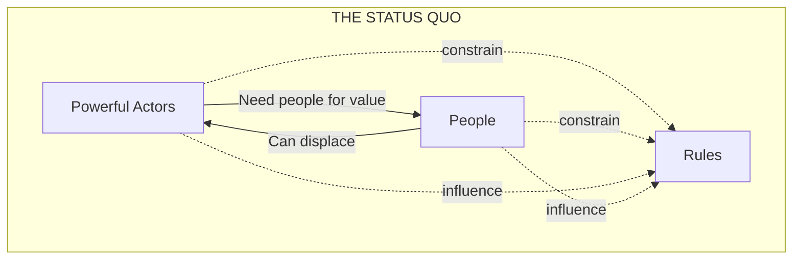
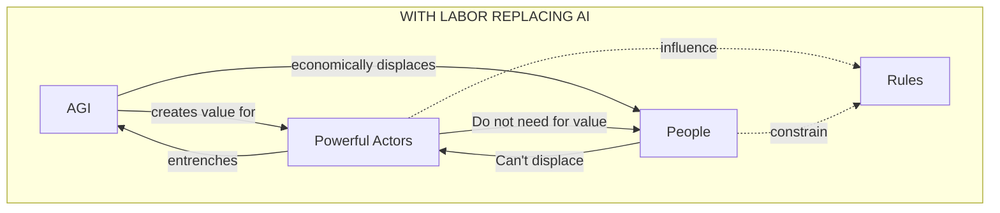

# The Intelligence Curse

Luke Drago & Rudolf Laine

April 2025

intelligence-curse.ai

---

# Acknowledgements

Thanks to David Duvenaud, Tom Everitt, Nitarshan Rajkumar, Anton Leicht, Herbie Bradley, Bilal Chughtai, Liam Patell, Henry Sleight, Max Kaufmann, Nathan Darmon, Lara Thurnherr, Stephen Clare, Edward Kembery, Connor A. Stewart Hunter, Dhruv Sumathi, Oscar Moxon, Tom Reed, Alejandro Ortega, Cristian Trout, Clay Wren, Aviel Parrack, Lysander Mawby, Jacob Pfau, James Campbell, Joseph Miller, Shannon Yang, Jasmin Kaur, Sam Cherry, Luca Gandrud, Riya Kataria, Li-Lian Ang, and Nicholas Osaka for reviewing early drafts of the essays in this series.

Thank you to Duncan McClements, Deric Cheng, Sam Manning, Josh Priest, and Caleb Peppiatt for reviewing portions of the economic and political economy work.

Thank you to Brendan McCord, Richard Ngo, Iason Gabriel, and Joe Pollard for conversations that informed the political theory, social contract, and institutions sections.

Thank you to Séb Krier and Jamie Bernardi for conversations that informed the tech solutions sections.

Thank you to Mahmoud Ghanem and Jack Miller for conversations that informed our thoughts on cybersecurity.

Thank you to Andrew Synder-Beattie for conversations that informed our biosecurity agenda.

Special thanks to Nomads & Vagabonds for the custom artwork used for chapter headings.

---

# 1 Introduction

We will soon live in the intelligence age. What you do with that information will determine your place in history.

The imminent arrival of AGI has pushed many to try to seize the levers of power as quickly as possible, leaping towards projects that, if successful, would comprehensively automate all work. There is a trillion-dollar arms race to see who can achieve such a capability first, with trillions more in gains to be won.

Yes, that means you’ll lose your job. But it goes beyond that: this will remove the need for regular people in our economy. Powerful actors—like states and companies—no longer have an incentive to care about regular people. We call this **the intelligence curse**.

If we do nothing, the intelligence curse will work like this:

---

- Powerful AI will push automation through existing organizations, starting from the bottom and moving to the top.
- AI will obsolete even outlier human talent. Social mobility will stop, ending the social dynamism and progress that it drives.
- Non-human factors of production, like capital, resources, and control over AI, will become overwhelmingly more important than humans.
- This will usher in incentives for powerful actors around the world that break the modern social contract.
- This could result in the gradual—or sudden—disempowerment of the vast majority of humanity.

But this prophecy is not yet fulfilled; we _reject_ the view that this path is inevitable. We see a different future on the horizon, but it will require a deliberate and concerted effort to achieve it.

We aim to change the incentives driving the intelligence curse, maintaining human economic relevance and strengthening our democratic institutions to withstand what will likely be the greatest societal disruption in history.

To break the intelligence curse, we should chart a different path on the tech tree, building technology that lets us:

1. **Avert** AI catastrophes by hardening the world against them, both because it is good in itself and because it removes the security threats that drive calls for centralization.

2. **Diffuse** AI, to get it in the hands of regular people. In the short-term, build AI that augments human capabilities. In the long-term, align AI directly to individual users and give everyone control in the AI economy.

3. **Democratize** institutions, making them more anchored to the needs of humans even as they are buffeted by the changing incentive landscape and fast-moving events of the AGI transition.

In this series of essays, we examine the incoming crisis of human irrelevance and provide a map towards a future where people remain the masters of their destiny.

---

# 1.1 Contents

**1. Introduction** ........................................................................................................... **1**  
We will soon live in the intelligence age. What you do with that information will determine your place in history.

**2. Pyramid Replacement** ........................................................................................... **4**  
Increasingly powerful AI will trigger pyramid replacement: a systematic hollowing out of corporate structures that starts with entry-level hiring freezes and moves upward through waves of layoffs.

**3. Capital, AGI, and Human Ambition** ............................................................ **14**  
AI will make non-human factors of production more important than human ones. The result may be a future where today’s power structures become permanent and frozen, with no remaining pathways for social mobility or progress.

**4. Defining the Intelligence Curse** ................................................................. **21**  
With AGI, powerful actors will lose their incentive to invest in regular people—just as resource-rich states today neglect their citizens because their wealth comes from natural resources rather than taxing human labor. This is the intelligence curse.

**5. Shaping the Social Contract** ........................................................................... **30**  
The intelligence curse will break the core social contract. While this suggests a grim future, understanding how economic incentives reshape societies points to a solution: we can deliberately develop technologies that keep humans relevant.

**6. Breaking the Intelligence Curse** ................................................................. **40**  
**Avert** AI catastrophes with technology for safety and hardening without requiring centralizing control. **Diffuse** AI that differentially augments rather than automates humans and decentralizes power. **Democratize** institutions, bringing them closer to regular people as AI grows more powerful.

**7. History is Yours to Write** ............................................................................... **59**  
You have a roadmap to break the intelligence curse. What will you do with it?

---

# 2 Pyramid Replacement

OpenAI’s goal is to build artificial general intelligence (AGI), which they define as “a highly autonomous system that outperforms humans at most economically valuable work”. The other AI labs—including Anthropic, Meta, DeepSeek, and Google—have made similar claims. The CEOs of these companies think they might achieve it in just a few years, some saying as early as 2026.

While the exact timelines are still in doubt, there is a very real chance AGI arrives in the next few years.

Consider the trendlines. In 2019, state-of-the-art AI models couldn’t write a coherent paragraph; by 2023 they were doing as well as the average candidate in human bar exams.¹ In

---

¹ OpenAI claimed that GPT-4 aced the Uniform Bar Exam in 2023, performing in the 90th percentile of human test-takers, but a fairer comparison that fixes methodological issues reduces this to 48th to 69th percentile depending on your assumptions.

---

2023, the top AI models were resolving 4.4% of a set of real-world example coding problems; by the beginning of 2025 they were resolving 49%. Other AI systems recently scored above the 99.5% percentile of expert humans on competitive programming problems. On multiple-choice science questions selected to be hard for everyone but PhDs in that specific field to answer, AIs improved from barely better than random guessing in mid-2023 to better than the human experts by the end of 2024. General computer-use capabilities are lagging behind pure-text skills, but have gone from near-zero capability to closing half the gap with humans within the last year.² Researchers have even demonstrated a new Moore’s law: the length of tasks AI can complete is doubling every seven months.

<table>
<thead>
<tr>
<th colspan="3">The length of tasks AIs can do is doubling every 7 months</th>
</tr>
<tr>
<th>Task length (at 50% success rate)</th>
<th>Model release date</th>
<th></th>
</tr>
</thead>
<tbody>
<tr>
<td>4 hrs</td>
<td rowspan="11"></td>
<td>Optimize code for custom chip</td>
</tr>
<tr>
<td>1 hr</td>
<td>Train classifier</td>
</tr>
<tr>
<td>15 min</td>
<td>Find fact on web</td>
</tr>
<tr>
<td>4 min</td>
<td>Count words in passage</td>
</tr>
<tr>
<td>1 min</td>
<td>Answer question</td>
</tr>
<tr>
<td>15 sec</td>
<td>GPT 3</td>
</tr>
<tr>
<td>4 sec</td>
<td>GPT 3.5</td>
</tr>
<tr>
<td>1 sec</td>
<td>GPT 2</td>
</tr>
<tr>
<td></td>
<td>GPT 4</td>
</tr>
<tr>
<td></td>
<td>GPT 4o</td>
</tr>
<tr>
<td></td>
<td>Sonnet 3.7</td>
</tr>
</tbody>
</table>

_Figure 2.1: Source: METR_

Governments are noticing this. The top recommendation from the Congressional US-China Commission in 2024 was for Congress to “establish and fund a Manhattan Project-like program dedicated to racing to and acquiring an Artificial General Intelligence (AGI) capability”. On the first full day of his second term, President Trump joined the CEOs of OpenAI, Softbank, and Oracle to announce Project Stargate, which intends to invest a total of $500 billion to build AI infrastructure.

If the industry and government consensus is even close to correct—and AGI is about to show up at your workplace—what is going to happen to your job?

---

² For more on the rate of AI capabilities progress, see Aschenbrenner (2024), Ngo (2023), Grace (2023), and Janků et. al. (2025).

---

## 2.1 This technology is different

Imagine you are the CEO of a large company.

In the 2000s, laptops became widely available. Instead of clunky desktop computers, your employees could now work from anywhere. They could take detailed notes in meetings and collaborate in the breakout room.

So you bought all your employees laptops. It made nearly all of them more productive, which resulted in increased profits for your company. But the laptops couldn’t _replace_ the analysts, because you couldn’t give a laptop a task in plain English and expect them to do it. Instead, you _needed_ the analysts to use laptops to access their benefits.

Fast forward to 2030. A big AI lab just released a new AI system. It completes any task 20% faster and 10% better than any of your junior employees. Running it to do the work of one employee costs $10,000 per year – that’s at least an 80% cost reduction. It might let your best analyst do the job of 10, or automate the analyst class entirely.

Maybe you like your existing employees and are skeptical of this new system. You integrate it as a trial, and in a year it’s outperforming all of them. In fact, keeping humans in the loop slows down the system and produces worse results.

Why _wouldn’t_ you fire your junior employees? They are more expensive, worse at the job, and unreliable. Sure, Mike interviews well and is nice to be around, but companies fire people their leadership personally likes all the time. And if your company doesn’t fire them, you will be crushed by competition that does.

We believe this pattern extends throughout the economy. Junior employees at large firms will lose first, through a combination of hiring slowdowns and some firings. As AIs get better and better, AI will climb the corporate pyramid and replace workers one by one. Eventually, in many industries, there will be competitive pressures that force companies to stop hiring and start firing throughout the organization. This will begin in white collar firms, but will eventually impact every sector.

We call this pyramid replacement. How does it work?

## 2.2 AI in the corporate pyramid

White collar work in medium-to-large firms is uniquely exposed to AI automation, especially relative to other jobs. Robotics looks farther away than AGI, and the companies with physically-automatable work hire and fire differently than large white collar firms. Small businesses hire with less clear structures, with fewer easily-automatable employees and less clearly defined work.

For this analysis, we will focus on white collar companies. Their corporate org charts look like pyramids, with many junior employees at the bottom and fewer senior employees at the top:

---

# 2. Pyramid Replacement

<table>
  <tbody>
    <tr>
      <td colspan="2" style="text-align:center; background-color:#8ab6ff;">C-Suite</td>
    </tr>
<tr>
      <td colspan="2" style="text-align:center; background-color:#8ab6ff;">Senior Management</td>
    </tr>
<tr>
      <td colspan="2" style="text-align:center; background-color:#8ab6ff;">Middle Management</td>
    </tr>
<tr>
      <td colspan="2" style="text-align:center; background-color:#8ab6ff;">Junior Employees</td>
    </tr>
<tr>
      <td colspan="2" style="text-align:center; background-color:#8ab6ff;">Entry-level<br>Employees</td>
    </tr>
  </tbody>
</table>

**Figure 2.2:** _A standard corporate org chart._

Entry-level employees don’t stay entry-level forever. Many of them become ready for a promotion, which means they can do more valuable work for the company. Some of them find another job and leave. At the same time, many of the middle to senior employees leave, retire, or otherwise stop working for the company.

All of this creates room for talent to flow upwards, but it requires the firm to regularly replenish the organization’s bottom layers.

So every year, companies hire fresh talent from the best universities they can recruit from. They hold career fairs, take on interns, and spend lots of time training these smart but low-context individuals. Then, they give them the firm’s simplest tasks. It’s thankless, but it teaches them how the company works so they can move up the pyramid and manage future entry level employees.

When the first wave of AI agents arrive that can produce entry-level work outputs at a much lower cost than a human employee, companies might decide to:

1. Do nothing, out of inertia
2. Fire everyone, to maximize benefits
3. Adopt it slowly, by just not hiring more people

Some firms might do nothing. We expect they’ll regret it quickly—one of their competitors will adopt it, and their productivity gains will help them earn significant leads. Competitive pressures will be a strong force towards adoption. Most firms won’t fire everyone the day such a tool is released, and the few that do will suffer. This system might be slightly better and a lot cheaper, but there will still be some glitches to iron out.

That leaves everyone else: the slow adopters. We suspect most firms will spend some time rolling out this tool. Once they see that it increases their best junior employees’ work, they’ll start to wonder why they hire so many entry-level analysts.

---

We think the first wave of AI employees, likely a combination of specialized LLM scaffolds from startups and natively agentic models from the labs, will allow companies to shrink their hiring costs without firing anyone. Instead, they’ll slash hiring.

<table>
  <thead>
    <tr>
      <th colspan="5"> </th>
    </tr>
  </thead>
  <tbody>
    <tr>
      <td colspan="2" rowspan="1" style="background-color:#f08080; text-align:center;">AI</td>
      <td style="background-color:#add8e6; text-align:center;">Entry-level<br>Employees</td>
      <td colspan="2" rowspan="1" style="background-color:#f08080; text-align:center;">AI</td>
    </tr>
<tr>
      <td colspan="5" style="background-color:#add8e6; text-align:center;">Junior Employees</td>
    </tr>
<tr>
      <td colspan="5" style="background-color:#add8e6; text-align:center;">Middle Management</td>
    </tr>
<tr>
      <td colspan="5" style="background-color:#add8e6; text-align:center;">Senior Management</td>
    </tr>
<tr>
      <td colspan="5" style="background-color:#add8e6; text-align:center;">C-Suite</td>
    </tr>
  </tbody>
</table>

**Figure 2.3:** _Stage 1: Companies begin to hire fewer entry-level employees._

This pattern would repeat as new AI systems are released. These systems may be natively more directable, and will work without intervention for longer.

At this point, a firm will need very few entry-level employees to complete basic tasks. As existing employees get promotions, hiring will get slashed once again.

<table>
  <thead>
    <tr>
      <th colspan="5"> </th>
    </tr>
  </thead>
  <tbody>
    <tr>
      <td colspan="5" style="background-color:#f08080; text-align:center;">AI</td>
    </tr>
<tr>
      <td colspan="3" style="background-color:#add8e6; text-align:center;">Junior Employees</td>
      <td colspan="2" rowspan="1" style="background-color:#f08080;"> </td>
    </tr>
<tr>
      <td colspan="3" style="background-color:#add8e6; text-align:center;">Entry-level<br>Employees</td>
      <td colspan="2" rowspan="1" style="background-color:#f08080;"> </td>
    </tr>
<tr>
      <td colspan="5" style="background-color:#add8e6; text-align:center;">Middle Management</td>
    </tr>
<tr>
      <td colspan="5" style="background-color:#add8e6; text-align:center;">Senior Management</td>
    </tr>
<tr>
      <td colspan="5" style="background-color:#add8e6; text-align:center;">C-Suite</td>
    </tr>
  </tbody>
</table>

**Figure 2.4:** _Stage 2: entry-level employee hiring is over, and junior employee hiring is fast-shrinking._

---

New AI systems are released. This time, the new AI agents do the work better when the entry-level employees don’t interrupt them. Most managers manage more AIs than humans, and increasingly complex work is becoming automatable.

Companies have an expensive problem on their hands. They don’t want to fire large swaths of employees for reasons of optics and inertia, but they could greatly benefit from laying off the large numbers of redundant employees.

For some firms, it’ll take a shock—a recession, a downturn, or a bad quarterly earnings report—to announce layoffs as a cost-cutting measure. In the most competitive sectors, this action might happen faster. Either way, the most junior layers of the pyramid will disappear entirely.

<table>
  <thead>
    <tr>
      <th colspan="3" style="text-align:center;">AI Replacement Pyramid</th>
    </tr>
  </thead>
  <tbody>
    <tr>
      <td colspan="3" style="text-align:center;">C-Suite</td>
    </tr>
<tr>
      <td colspan="3" style="text-align:center;">Senior Management</td>
    </tr>
<tr>
      <td colspan="3" style="text-align:center; background-color:#add8e6;">Middle Management</td>
    </tr>
<tr>
      <td colspan="3" style="text-align:center; background-color:#add8e6;">Junior Employees</td>
    </tr>
<tr>
      <td colspan="3" style="text-align:center; background-color:#f08080; font-weight:bold;">AI</td>
    </tr>
  </tbody>
</table>

_Figure 2.5: Stage 3: entry-level employees are gone, and management is starting to be affected._

Once again, the systems get better. This time, they unlock the ability to do _all_ of the medium-horizon tasks in a company.

The market is expecting the next termination wave. While public resentment is growing, the shareholders will demand the productivity benefits to increase earnings. Plus, all the other firms are doing it. If the firm doesn’t automate most of their work, they’ll lose to their competitors. The pattern repeats, but this time it’s even harsher.

---

## 2. Pyramid Replacement

<table>
  <tr>
    <td colspan="3" style="text-align:center; background-color:#f08080; font-size:24px;">AI</td>
  </tr>
<tr>
    <td style="background-color:#87cefa; text-align:center;">Middle<br>Management</td>
    <td style="background-color:#87cefa; text-align:center;">Senior<br>Management</td>
    <td style="background-color:#87cefa; text-align:center;">C-Suite</td>
  </tr>
</table>

**Figure 2.6:** _Stage 4: AI now performs almost all roles in the company._

Once again, new systems get released. They can now do all intellectual labor in the company, and they do it better without senior management in the loop. Many firms make the call: they only need the C-suite.³

<table>
  <tr>
    <td colspan="2" style="text-align:center; background-color:#f08080; font-size:36px;">AI</td>
  </tr>
<tr>
    <td style="background-color:#87cefa; text-align:center;">C-Suite</td>
<td></td>
  </tr>
</table>

**Figure 2.7:** _Stage 5: only the C-Suite is left, and their work is providing direction to a vast horde of extremely capable AI agents & tools._

Some time passes, and the AIs get even better. Now, they can track every interaction the com-

---

³ A natural decision when the decision-makers are the C-suite.

---

pany has, both internally and externally. A swarm of them can execute every decision, and the best of them can make strategic decisions exceptionally fast.

The board of some firms might realize that the C-Suite is now less capable of managing the company than the best AIs. CEOs are forgetful, and they don’t have total insight into everything their company is doing – but their AI systems do.

This time, the board makes the call. For a small number of firms, the best performing version of their org chart is one without any human employees at all⁴:

<table>
  <tr>
    <td style="background-color:#f2727a; text-align:center; font-weight:bold; font-size:48px;">AI</td>
  </tr>
</table>

**Figure 2.8:** _Stage 6: no more humans are required to manage the day-to-day activities of many companies._

### 2.3 Some caveats are needed

Diffusion barriers—things like regulatory barriers, investor or leadership skepticism, a lack of automation pressures from competing companies, high costs or use limitations, labor or union pressures, or a lack of economic downturns—could all slow this process down.

You may see a more jagged effect than this model demonstrates. Some jobs (ex: software engineers) are more immediately automatable than others, even at the same level of seniority. You could model this as a pyramid for each corporate function. Those have pyramids within a large organization, and will likely follow a similar pattern. Currently it seems like tasks that require planning and execution over longer time-horizons will take longer for AIs to automate, and it will be harder for AI companies to train AI models to do well on criteria that are harder to objectively judge.

Some white collar industries will be much more resistant to this than others. Tech companies

> ⁴ We are at our most speculative here. But eventually it seems plausible that some firms _would_ perform better if they were run by AI systems more capable than humans. Oftentimes, if it _would_ be better, the market finds a way. However, we think there is hope that long-horizon planning, _taste_, and _local knowledge_ might give humans an advantage over AIs in being CEOs for years.

---

could be largely automable with one or two more leaps in AI performance. Other white collar industries might rely on prestige, signalling, or soft skills that will be harder to automate. This probably doesn’t matter at the entry level, but it matters for senior employees who do lots of important, interpersonal work.

Finally, this is a default trajectory for large companies. Tech or governance interventions could dramatically change this pattern.

## 2.4 The future of work?

To put it bluntly, traditional white collar work, the economic engine of developed economies, is unlikely to survive the AI revolution. This isn’t a 2050 or 2100 problem – it is a problem for today’s entrepreneurs, policymakers, and institutions.

The popular thing is to claim that new, better jobs will be created, and that wages will rise as a result. But when economists actually take AI seriously, they seem to reach different conclusions. Modeling by Korinek and Suh demonstrates that by default, wages plummet:

<table>
  <thead>
    <tr>
      <th colspan="2">Output Y</th>
    </tr>
  </thead>
  <tbody>
    <tr>
      <td>
        <b>(a) Business-as-usual scenario</b><br>


<table>
          <tr><td>Year</td><td>0</td><td>5</td><td>10</td><td>15</td><td>20</td><td>25</td><td>30</td></tr>
<tr><td>Output</td><td>2×10⁰</td><td></td><td></td><td></td><td></td><td></td><td>3×10⁰</td></tr>
<tr><td>Return on Capital R/K</td><td></td><td></td><td></td><td></td><td></td><td></td><td></td></tr>
<tr><td>Wage Bill wL</td><td></td><td></td><td></td><td></td><td></td><td></td><td></td></tr>
<tr><td>1 - e^t</td><td>3×10⁻¹</td><td></td><td></td><td></td><td></td><td></td><td>3.8×10⁻¹</td></tr>
        </table>

      </td>

<td>
        <b>(b) Baseline AGI scenario</b><br>


<table>
          <tr><td>Year</td><td>0</td><td>5</td><td>10</td><td>15</td><td>20</td><td>25</td><td>30</td></tr>
<tr><td>Output</td><td>10⁰</td><td></td><td></td><td></td><td></td><td></td><td>10²</td></tr>
<tr><td>Return on Capital R/K</td><td></td><td></td><td></td><td></td><td></td><td></td><td></td></tr>
<tr><td>Wage Bill wL</td><td></td><td></td><td></td><td></td><td></td><td></td><td></td></tr>
<tr><td>1 - e^t</td><td>10⁻¹</td><td></td><td></td><td></td><td></td><td></td><td>10⁻²</td></tr>
        </table>

      </td>
    </tr>

  </tbody>
</table>

> **Figure 2.9:** _On top, the blue line is total output, while the green shaded area is the fraction going to labor. On the bottom is the fraction of tasks that are not automated; note the log scale on the y-axis. A different scenario where the unautomatable task fraction first falls sharply and then flatlines results in a sharp decline in wages, that then later reverses—see page 24 of the paper._

Matthew Barnett outlines several possible mechanisms of wage decline.

First, if AI results in a massive increase in labor supply, capital could become more of a constraint than labor. The returns to additional labor—machine or human—go down while those

---

to capital go up. This means lower wages and higher returns to capital.

Second, when production requires fixed inputs like land, these fixed inputs can capture ever-larger shares of output as other inputs scale. This was essentially the pre-industrial Malthusian state of the economy: bottlenecked by land, and with subsistence wages for labor.

Third, humans have a higher “biologically imposed minimum wage” than AIs. We need to eat, and the efficiency of our brains is fixed. AIs don’t have such limitations, and therefore their presence in the labor market might drive wages _below_ the human subsistence level.

Barnett concludes:

> All things considered, I am inclined to guess that there is roughly a 1 in 3 chance  
> that human wages will crash below subsistence level before 2045. While this figure may appear alarmingly high to some, I personally consider it somewhat low, as it partially reflects my tentative optimism that technological progress will complement human labor even after AGI, keeping wages from crashing all the way below subsistence level in the near term. In the longer term, I’d guess the probability that human wages will fall below subsistence level before 2125 to be roughly 2 in 3.

This may start with white collar work, but AGI is on track to impact every sector. Displaced workers may join blue-collar professions. On top of that, some blue collar work is on track to get displaced. Investment in self-driving vehicles for transportation and specialized robotics for manufacturing make those sectors ripe for displacement as well. The arrival of general-purpose robotics would replace the remaining blue-collar workers as well—and the robotics demos are becoming compelling.

This all means that, once AGI is on the scene, a whole lot of people will be making a lot less money, if they’re earning at all. Once the robots finally show up, _everyone_ might be out of a job.

But could we just expand the social safety net? Universal Basic Income for everyone?

Expanding the social safety net will be limited by several constraints. Fiscal constraints worldwide are tight due to rising rates and debts[^5]. Economic modelling suggests that the truly explosive growth rates needed to fund widespread UBI will only arrive when we get general-purpose robotics. There are also many cultural considerations: many high-earning households may not be satisfied with earning the same UBI as everyone else, and losing the track to ambition they dreamed of, especially if they’re early in their careers.

This is not hypothetical. We are starting to see pre-AGI systems shrink analyst classes and trigger layoffs. Remember that today is the worst these systems will ever be. As they get better, their impact on the labor market will grow rapidly. As Aschenbrenner says, _“that doesn’t require believing in sci-fi; it just requires believing in straight lines on a graph.”_

We will next look at the deeper problems and incentives that the loss of all work entails.

[^5]: Social security, funded by payroll taxes, is expected to be exhausted in 2033. This would create significant pressure to shrink social safety nets at a time where (if innovation and diffusion and fast enough) voters may be demanding massive expansions.

---

# 3 Capital, AGI, and Human Ambition

Many people say that money won’t matter post-AGI, or at least it will matter less. By default, this is exactly backwards.

First, some terms: labor means human mental and physical effort that produces something of value. Capital goods are things like factories, data centres, and software—things humans have built that are used in the production of goods and services. We’ll use “capital” to refer to both the stock of capital goods and to the money that can pay for them. We’ll say “money” when we want to exclude capital goods.

The key economic effect of AI is that it makes capital a more and more general substitute for labor. There’s less need to pay humans for their time to perform work, because you can replace that with capital—data centres running software replaces a human doing mental labor.

We will walk through consequences of this, and conclude that labor-replacing AI means:

---

1. The ability to buy results in the real world will dramatically go up

2. Human ability to wield power in the real world will dramatically go down because:

   1. The value of people’s labor goes down, which for most people is their main lever of power
   2. It will be harder for humans to achieve outlier outcomes relative to their starting resources

3. Radical equalising measures are unlikely

Overall, this points to a neglected downside of transformative AI: that society might become permanently static, and that current power imbalances might be amplified and then turned immutable. A static society with a locked-in ruling caste does not seem dynamic or alive. We should not kill human ambition, if we can help it.

### 3.1 The default solution

Let’s assume human mental and physical labor across the vast majority of tasks that humans are currently paid wages for no longer has non-trivial market value, because the tasks can be done better/faster/cheaper by AIs. Call this labor-replacing AI.

There are two levels of the standard solution to the resulting unemployment problem:

1. Governments will adopt something like universal basic income (UBI).

2. We will quickly hit superintelligence, and, assuming the superintelligence is aligned with human values, live in a post-scarcity technological wonderland where everything is possible.

Note, firstly, that money will continue being a thing, at least unless we have one single AI system doing all economic planning. Prices are largely about communicating information. If there are many actors and they trade with each other, the strong assumption should be that there are prices (even if humans do not see them or interact with them). Remember too that however sharp the singularity, abundance will still be finite, and must therefore be allocated.

### 3.2 Money currently struggles to buy talent

Money can buy you many things: capital goods, for example, can usually be bought quite straightforwardly, and cannot be bought without a lot of money¹. But it is surprisingly hard to

---

¹ Or other liquid assets, or non-liquid assets that others are willing to write contracts against, or special government powers.

---

convert raw money into labor, in a way that is competitive with top labor.

Consider the stereotypical VC-and-founder interaction, or the acquirer-and-startup interaction. In both cases, holders of massive financial capital are willing to pay very high prices to bet on labor—and the bet is that the labor of the few people in the startup will beat extremely large amounts of capital.

If you want to convert money into results, the deepest problem you are likely to face is hiring the right talent. And that comes with several problems:

1. It’s often hard to judge talent, unless you yourself have considerable talent in the same domain. Therefore, if you try to find talent, you will often miss it.

2. Talent is rare—credentialed talent even more so. Many actors can’t afford to rely on any other kind, because of point 1, so there’s just not very much of it going around.

3. Even if you can locate the top talent, the top talent tends to be less amenable to being bought out by money than others.

With labor-replacing AI, these problems go away:

First, the AIs can be copied. Currently, huge pools of money chase after a single star researcher who’s made a breakthrough, and thus had their talent made legible to those who control money, who can judge the clout of the social reception to a paper but usually can’t judge talent itself directly. But the star researcher that is an AI can just be copied. Everyone—or at least, everyone with enough money to burn on GPUs—gets the AI star researcher. No need to sort through the huge variety of unique humans with their unproven talents.

Second, the price of talent will go down massively, because the AIs will be cheaper than the equivalent human labor, and because competition will be fiercer because the AIs can be duplicated.

Third, lots of top talent has complicated human preferences that make them hard to buy out. The top artist has an artistic vision they’re genuinely attached to. The top mathematician has a deep love of elegance and beauty. The top entrepreneur has deep conviction in what they’re doing—and probably wouldn’t function well as an employee anyway. Talent and performance in humans are surprisingly tied to a sacred bond to a discipline or mission. In contrast, AIs exist specifically so that they can be trivially bought out (at least within the bounds of their training). The genius AI mathematician, unlike the human one, will happily spend its limited time on Earth proving the correctness of schlep code.

Finally, the AIs will eventually be much more capable than any human employees at their tasks.

This means that _the ability of money to buy results in the real world will dramatically go up once we have labor-replacing AI._

---

### 3.3 No more outlier outcomes?

We’ve already discussed how most labor will be obsoleted by AI and robotics. But eventually, even the most talented humans will be outmatched by AIs. What happens then?

Much change in the world is driven by people who start from outside power, achieve outlier success, and then end up with power. This makes sense, since those with power rarely have the fervour to push for big changes, since they are exactly those who are best served by the status quo.

Whatever your opinions on income inequality or any particular group of outlier successes, the possibility of someone achieving outlier success and changing the world is important for avoiding stasis and continued social progress.

Let’s consider the effects of labor-replacing AI on various routes to outlier success through labor:

**Entrepreneurship** is increasingly what Matt Clifford calls the “technology of ambition” of choice for ambitious young people. Right now, entrepreneurship has become easier. AI tools can already make small teams much more effective without needing to hire new employees. They also reduce the entry barrier to new skills and fields. However, labor-replacing AI makes the tenability of entrepreneurship uncertain. There is a possible future in which AIs remain mostly tool-like and entrepreneurs can succeed long after most human labor is automated because they provide agency and direction. However, it also seems likely that sufficiently strong AI will eventually obsolete human entrepreneurship. For example, VC funds might be able to directly convert money into hundreds of startup attempts all run by AIs, without having to go through the intermediate route of finding human entrepreneurs to manage the AIs for them.

**The hard sciences.** The era of human achievement in hard sciences may end within a few years because of the rate of AI progress in anything with crisp reward signals.

**Intellectuals.** Keynes, Friedman, and Hayek all did technical work in economics, but their outsize influence came from the worldviews they developed and sold, which made them more influential than people like Paul Samuelson who dominated mathematical economics. John Stuart Mill, John Rawls, and Henry George were also influential by creating frames, worldviews, and philosophies. The key thing that separates such people from the hard scientists is that the outputs of their work are not spotlighted by technical correctness alone, but require moral judgement as well. A core reason why intellectuals’ ideologies can have so much power is that they’re products of genius in a world where genius is rare. A flood of AI-created ideologies might mean that no individual ideology, and certainly no human one, can shine so bright anymore. The world-historic intellectual might go extinct.

**Politics** might be one of the least-affected options, since we’d guess that most humans want a human to do that job, and because politicians get to set the rules for what’s allowed. However, the charisma of AI-generated avatars, and a general dislike towards politicians might throw a curveball here. It’s also hard to say whether incumbents will be favoured. AI might bring down the cost of many parts of political campaigning, reducing the resource barrier to en-

---

try. However, if AI too expensive for small actors is meaningfully better than cheaper AI, this would favour actors with larger resources. We expect these direct effects to be smaller than the indirect effects from whatever changes AI has on the memetic landscape.

**Military** success as a direct route to great power and disruption has—for the better—not really been a thing since Napoleon. Advancing technology increases the minimum industrial base for a state-of-the-art army, which benefits incumbents. AI looks set to be controlled by the most powerful countries. One exception is if coups of large countries become easier with AI. Control over the future AI armies will likely be both (a) more centralized than before, since a large number of people no longer have to go along for the military to take an action, and (b) more tightly controllable than before, since the permissions can be implemented in code rather than human social norms. These two factors point in different directions so it’s uncertain what the net effect on coup ease will be. Another possible exception is if a combination of revolutionary tactics and cheap drones enables a Napoleon-of-the-drones to win against existing armies. Importantly, though, neither of these seems likely to promote the good kind of disruptive challenge to the status quo.

All this means that the ability to get and wield power in the real world without existing capital will dramatically go down once we have labor-replacing AI.

### 3.4 Enforced equality is unlikely

_The Great Leveler_ is a good book on the history of inequality that (at least per the author) has survived its critiques fairly well. Its conclusion is that past large reductions in inequality have all been driven by one of the “Four Horsemen of Leveling”: total war, violent revolution, state collapse, and pandemics. Leveling income differences has historically been hard enough to basically never happen through conscious political choice.

Imagine that labor-replacing AI is here. There’s a massive scramble between countries and companies to make the best use of AI. This is all capital-intensive, so everyone needs to woo holders of capital. The top AI companies wield power on the level of states. The redistribution of wealth is unlikely to end up on top of the political agenda.²

Therefore, even if we end up in a very rich society, it is unlikely that people in the future will be starting in it on an equal footing. It is also unlikely that they will be able to greatly change their relative footing later on.

Consider also equality between states. Some states stand set to benefit massively more than others from AI. Many equalising measures, like UBI, would be difficult for states to extend to non-citizens under anything like the current political system. This is true even of the United States, the most liberal and humanist great power in world history. By default, the world order might therefore look—even more than today—like a global caste system based on country of

---

² An exception might be if some new political movement or ideology gets a lot of support quickly, and is somehow boosted by some unprecedented effect of AI (such as: no one has jobs anymore so they can spend all their time on politics, or there’s some new AI-powered coordination mechanism).

---

### 3.5 The default outcome

By default, in the post-labor-replacing-AI world:

- Money will be able to buy results in the real world better than ever
- People’s labor gives them less leverage than ever before
- Achieving outlier success through your labor in most or all areas is now impossible
- There will have been no transformative leveling of capital, either within or between countries

This means that those with significant capital when labor-replacing AI started have a permanent advantage. They will wield more power than the rich of today. Upstarts will not defeat them, since capital now trivially converts into superhuman labor in any field.

In the best case, this is a world like a more unequal, unprecedentedly static, and much richer Norway: a massive pot of non-human-labor resources (in Norway’s case, oil) has benefits that flow through to everyone, and yes some are richer than others but everyone has a great standard of living. The only realistic forms of human ambition are playing local social and political games within your social network and class. If you don’t have a lot of capital, you don’t have a chance of affecting the broader world anymore. Remember: the AIs are better poets, artists, philosophers—everything; why would anyone care what some human does, unless that human is someone they personally know? In feudal societies the answer to “why is this person powerful?” would usually involve some long family history, perhaps ending in a distant ancestor who had fought in an important battle: “my great-great-grandfather fought at Bosworth Field!”. In the future, the answer to “why is this person powerful?” would trace back to something they or someone they were close with did in the pre-AGI era: “oh, my uncle was technical staff at OpenAI”. The children of the future will live their lives in the shadow of their parents, with social mobility extinct. This is far from the worst future we could imagine, but something important will have been lost.

In a worse case, AI trillionaires have near-unlimited and unchecked power, and there’s a permanent aristocracy that was locked in based on how much capital they had at the time of labor-replacing AI. The power disparities between classes might make modern people shiver, much like modern people consider feudal status hierarchies grotesque. But don’t worry—much like the feudal underclass mostly accepted their world order due to their culture even without superhumanly persuasive AIs around, the future underclass will too.

> ³ This is especially true because there will likely be even fewer possibilities for immigration. The main incentive to allow immigration is its massive economic benefits which only exist when humans perform economically meaningful work.

---

In the absolute worst case, humanity goes extinct, potentially because of a slow-rolling optimization for AI power over human prosperity over a long period of time. Because that’s what the power and money incentives will point towards.

### 3.6 Towards the intelligence curse

We’ve seen how advanced AI threatens both normal career paths, as well as the ability of outlier talent to make a difference in the world. Most people’s power and leverage over the world comes from them being able to do useful work—from being economically relevant. Labor-replacing AI might delete that power and leverage. By default, that will have far-reaching consequences.

Over the past few centuries, there’s been a big shift towards states caring more about humans. Why is this? We can examine the reasons to see how durable they seem:

1. Moral and political changes downstream of the Enlightenment, in particular an increased centering of liberalism and individualism.

2. Affluence & technology. Pre-industrial societies were mostly so poor that significant efforts to help the poor would’ve bankrupted them. Many types of help (such as effective medical care) are also only possible because of new technology.

3. Incentives for states to care about freedom, prosperity, and education.

AI will help a lot with the 2nd point. It will have some complicated effect on the 1st. But the 3rd in particular is unappreciated. With labor-replacing AI, the incentives of states—in the sense of what actions states should take to maximize their competitiveness against other states and/or their own power—will no longer be aligned with humans in this way. Adam Smith could write that his dinner doesn’t depend on the benevolence of the butcher or the brewer or the baker. The classical liberal today can credibly claim that the arc of history really does bend towards freedom and plenty for all, not out of the benevolence of the state, but because of the incentives of capitalism and geopolitics. But after labor-replacing AI, this will no longer be true.

We call this the **intelligence curse**, and it’s what we’ll examine next.

---

# 4 Defining the Intelligence Curse

Economists are used to modeling AI as a tool, so they don’t get how it could make people irrelevant. Past technological revolutions have driven human potential further. The agrarian revolution birthed civilizations; the industrial revolution let us scale them.

But AGI looks a lot more like coal or oil than the plow, steam engine, or computer. Like those resources:

- It will require immense capital to discover and harness.

- Control will likely be concentrated in the hands of a few players: the labs that produce AI, the states where they reside, and the companies that manufacture the raw materials, the chips, and the robots, and the electricity they all need.

---

- The states and companies that earn rents mostly or entirely from AI won’t need to rely on people for revenue.

This problem looks a lot like the plague that affects rentier states, or states that predominantly rely on rents from a resource for their wealth instead of taxes from their citizens. These states suffer from the resource curse—despite having a natural source of income, they do worse than their economically diverse peers at improving their ordinary citizens’ living standards.

Powerful actors that adopt labor-replacing AI systems will face rentier state-like incentives with far higher stakes. Because their revenues will come from intelligence on tap instead of people, they won’t receive returns on investments like education to prepare people for employment, employment and salaries, or a welfare state for the unemployed. As a result, they won’t invest – and their people will be unable to sustain themselves as a result. Humans need not apply, and so humans will not get paid.

**This is the intelligence curse –** when powerful actors create and implement general intelligence, they will lose their incentives to invest in people.

## 4.1 Why powerful actors care about you

By powerful actors, we mean large organizations such as states, corporations, and bureaucracies that command significant resources, enabling them to shape the world we live in and how we interact with it.

Powerful actors don’t care about you out of the goodness of their heart. They care about you for two reasons:

1. You offer a return on investment, usually through taxes or profits.

2. You impact their ability to retain power, either through democratic means like voting or through credible threats to a regime.

Most states in the modern world are diversified economies, meaning value comes from many different sectors and human activities, rather than a single or handful of sources. They rely on taxing people and corporations to generate revenue, so they increase their revenue by increasing their citizens’ productivity.¹ The state is incentivized to produce engineers, entrepreneurs, innovators, and other economically productive workers and create an environment for them to return on the investment. To do so, they tend to:

- Establish good schools, research institutions, and universities

---

¹ They can of course increase taxes as well, but you can only tax what is being produced, yielding an upper limit. They also need to maintain some power structure that lets them impose their taxation powers, whether through democratic representation or purely through hard power.

---

- Build infrastructure like roads and public transportation

- Set up reliable governing systems and courts to protect property rights

- Protect speech and the flow of information

- Support small business formation

- Foster competitive markets

- Create social safety nets to support risk-taking

These increase the productivity of citizens and increase the surface area of luck for innovation to occur. Equally importantly, these are the kinds of things that lift people out of abject poverty, increase living standards, and institute political and economic freedoms. With good schools, infrastructure, and competitive markets, a citizen can train for and find a high-paying job that exceeds their basic needs. And with reliable governing systems, fair courts, and free speech, a citizen can petition their government for their needs without the fear of becoming a political prisoner. They gain bargaining power through their votes and their economic output, so they can force changes that raise their standards of living. As a result, sometimes states capitulate to citizens’ demands even if it will cost them.

A similar phenomenon affects corporations. Take, for example, the exorbitant salaries of Silicon Valley. Tech workers have a skill set companies desperately need to make more money.² Those workers are a hot commodity and competition to attract them is fierce. To win them over, companies pay large salaries, offer stock options, purchase pool tables, offer 24-7 free meals from a Michelin star chef, and do their laundry. No one is seriously arguing that the company laundry service is 10x’ing revenue, but it might win over a potential employee or keep an otherwise unsatisfied one from leaving for a competitor. The employees have bargaining power, so they can demand lavish perks that improve their quality of life.

This creates a feedback loop – as regular people make powerful actors more money, they are more likely to cater to them. Will education increase your population’s (and thus the state’s) lifetime earnings? Build the schools. Will offering paid family leave get better employees for your company? Change the policy.

## 4.2 The resource curse

We already have societies that divorce their nation’s economic output from their human capital. They’re called rentier states. These states – including Venezuela, Saudi Arabia, Norway, and Oman, derive most of their earnings from resources (usually oil), rather than the productive output of their citizens.

---

² At least, this was true until the recent improvements in AI’s programming capabilities.

---

# Defining the Intelligence Curse

The Democratic Republic of Congo has over $24 trillion worth of untapped minerals in their ground. How have their citizens fared? According to the World Bank:

> _Most people in DRC have not benefited from this wealth. A long history of conflict, political upheaval and instability, and authoritarian rule have led to a grave, ongoing humanitarian crisis. In addition, there has been forced displacement of populations. These features have not changed significantly since the end of the Congo Wars in 2003._

> _DRC is among the five poorest nations in the world. An estimated 73.5% of Congolese people lived on less than $2.15 a day in 2024. About one out of six people living in extreme poverty in SSA lives in DRC._

What’s going on here? How can it be that trillions in total available resources have resulted in abject poverty?

Economists and political scientists call this the resource curse. Countries with abundant natural resources tend to experience poorer economic growth and higher rates of poverty than their economically diverse peers.³

There are many factors that lead to the resource curse, but a core one is the incentives they create to stop caring about your people’s economic well being.

Because they earn money from resources, rentier states have no incentive to pay regular people today or invest in them for tomorrow. Building better schools doesn’t earn them more money. They invest just as much as it takes to move the oil out of the ground, onto trucks, and out to the ports.⁴ It’s not that their citizens couldn’t do anything worth taxing, it’s that there’s no reason to develop them into a taxable population. Why ask your people for money when you can get it from the ground?⁵

Without money, regular people struggle to make demands. In autocracies, there’s no incentive to care about them unless they credibly threaten your power. Those who control the rents can extract wealth without worrying about everyone else.

So what do the lives of their citizens look like? Dr. Ferdinand Eibl and Dr. Steffen Hertog offer two competing visions:

> _There are few issues on which comparative politics theories offer more sharply contrasting predictions than on the link between resource rents and government welfare provision. Some authors, especially those in the tradition of “rentier state theory,” expect oil-rich rulers to engage in mass co-optation, politically pacifying their population with expansive welfare policies (Beblawi and Luciani 1987; Karl 1997). Others, especially those proposing formal models of politics in oil-rich states, expect rentier rulers to neglect their population. As rents are siphoned off by a small ruling elite that does not need a domestic economic basis for their_

---

³ See Acemoglu, Johnson, & Robinson (2005) and Acemoglu, Johnson, & Robinson (2009), among many other papers.  
⁴ For more on this, see Chapter 7 of this book.  
⁵ See Karl (1997) and Centeno (1997).

---

_4. Defining the Intelligence Curse_

_self-enrichment, welfare provision is minimal and misery spreads_ _(Acemoglu, Robinson and Verdier 2004; Mesquita and Smith 2009)._

_There are empirical examples for both trajectories. Oman and Equatorial Guinea have broadly comparable levels of natural resource rents per capita—slightly above 8,000 USD per capita in the 1995 to 2014 period_ _(Ross 2013)_. _Both have been ruled by the same autocrats since the 1970s, when both countries were desperately poor. Under Sultan Qaboos, Omani public services have expanded at a rapid pace, leading to one of the world’s fastest declines in child mortality, from 159 per one thousand live births in 1971 to 9 by 2010, far below the Middle East average of 32. In Teodoro Obiang’s Equatorial Guinea, the state outside of the security services remains embryonic, the vast majority of the population continues to live in abject poverty, and infant mortality has declined painfully slowly: from 263 in 1971 to 109 in 2010, remaining above the (high) sub-Saharan average of 89. Access to rentier wealth is monopolized by the president’s small entourage_ _(Wood 2004)_.

Occasionally, rentier states result in large social safety nets. But in many cases, they result in abject poverty for all but the few who control streams of rent.⁶ Why? Eibl and Hertog provide an answer:

> We concur with formal models of politics in resource-rich countries that ruling elites seek to ensure survival in power. Public policies are subject to this overarching goal and reflect elites’ assessment of threats to their rule. Within these constraints, elites will seek to maximize their personal rents from resource revenues.
>
> We also agree with existing literature that the relative economic pay-off of welfare provision is lower in resource-based regimes, while its potential modernization effects are politically undesired _(Acemoglu and Robinson 2006; Mesquita and Smith 2009)_. All else being equal, we therefore expect oil-rich regimes to establish narrow kleptocratic coalitions with limited welfare provision and rampant elite self-enrichment.

### 4.3 Explaining the intelligence curse

The intelligence curse describes the incentives in a post-AGI economy that will drive powerful actors to invest in artificial intelligence instead of humans. If AI can do your job cheaper and faster, there isn’t a reason to hire you. But more importantly, there isn’t an economic reason to invest in your lifelong productivity, take care of you, or keep you around. We could produce unparalleled value with a fully automated economy, but if the spoils are distributed like the worst rentier states it will not result in prosperity for the masses.

The intelligence curse will likely be stronger than the resource curse, as AI will keep improving. Rather than just providing the government an alternative income stream that still requires humans to manage, AI and robotics will replace the need for humans across the economy, military, and government bureaucracy entirely. You also can’t “run out” of AI like you  
⁶ For other evidence, see Biewendt (2020), Fossaceca (2019), and Venables (2016).

---

can with oil. The rentier states still have a long-term incentive to diversify their economies, but this will not apply to post-AGI states.

A common rebuttal is that some jobs can never be automated because we will demand humans do them.

For example, teachers. Most parents would probably strongly prefer a real, human teacher to watch their kids throughout the day. But this argument totally misses the bigger picture: it’s not that there won’t be a demand for teachers, it’s that there won’t be an incentive to fund schools. This argument repeats ad nauseam for anything that invests in regular people’s productive capacity, any luxury that relies on their surplus income, or any good that keeps them afloat. By default, powerful actors won’t build things that employ humans or provide them resources, because they won’t have to.

Taxes will still be a relevant form of income for governments, but only those from corporations. Likewise, corporations will make money from their AI systems, not from the work people produce. The investments that the developed world associates with a high quality of life — salaries, education, infrastructure, stable governance, etc — will no longer provide a return. People won’t make powerful actors any money.

Where might the powerful actors get their money from instead?

**States will earn money from corporate taxes.** Companies that produce advanced AI systems and companies that use them will generate large revenues. As they get bigger, states will tax them more. In 2022, corporate taxes made up 11.5% of the average OECD state’s revenue – a sample of high-performing, diverse economies. Like Norway (about 30% of state revenue from oil), Saudi Arabia (75%), and the Democratic Republic of the Congo (about 1/3rd of state revenue from resource mining), states will rely less on income taxes and more on taxes from AI companies or other companies that enable powerful actors to accomplish goals. When state revenue breakdowns look more like these countries than the OECD average, you’ll know the intelligence curse is taking hold.

**AI labs will make money by becoming the new rentiers.** The stated goals of the AI labs are to build AGI. OpenAI is already changing their corporate structure to remove limits on how much of AGI profits they can capture for themselves. This is despite a corporate structure originally built to ensure that if AGI becomes most of the economy, OpenAI would distribute profits above some amount to the world. Once the labs have an AI system that can do it all, they’ll become a horizontal layer of the economy, extracting rents from all economic activity by selling it to companies and states who use it to replace their workers. They’ll also try as hard as possible to consume the economy vertically too. If they succeed, they will wield economic power that was previously exclusive to states. Anthropic’s CEO Dario Amodei has compared the effects of AI to “a country of geniuses in a data center”. Note the language—a _country_ of geniuses. If the labs achieve this vision, it is less like just another company playing in the economy, and more like an entire foreign nation popped up into existence, that is more populous than any country, and inhabited by workers who are much cheaper, smarter, and faster than any human.⁷

> ⁷ Instead of imagining a foreign country popping into existence, you could also imagine a billion smarter, cheaper, faster immigrants popping out of the ground, overnight, in your country.

---

## 4. Defining the Intelligence Curse

**Companies will trade amongst themselves and other powerful actors.** Land, energy, compute, manufacturing hubs, data centers, and robots will continue having value since they enable powerful actors to accomplish their goals. The cafe chain and the marketing firm will be irrelevant, but the landlord and energy company will be able to make more money than ever before. Powerful actors, likely human-controlled (at least for a while), will extract the vast majority of value from these sources.

So what will happen to most regular people, assuming powerful actors follow the default trajectory?:

- **Companies will be incentivized to fire them, and never hire new ones.** They won’t produce anything they can value. For a short time they might rely on them as consumers, but most people-facing companies will fizzle out as their demand base loses economic power.

- **States will be incentivized to decimate public funding.** Remember, their revenue base will shift towards other powerful actors. They will derive no value from their labor and are thus incentivized against building things that turn them into productive workers. ROI – capital, power, and resilience – comes from ensuring the AI labs can build better models and the companies using them can do things in the world. Also, the taxes to fund human investment would come in large part from AGI labs. Competition between states means that if any tries to set up a UBI with this tax, they could fall behind other states.

- **Regular people will not be able to support themselves.** The vast majority of people will not have the economic power necessary to make any demands. They won’t be able to incentivize resource-controlling actors to invest in them. That means (at best) they’ll rely on benevolent charity from powerful actors. At worst, they won’t be able to earn even subsistence wages, and no one will step in to save them.

For a while, they might be able to generate some value. Rentier states require some humans to move things in the physical world – someone has to get the oil out of the ground. It could be that humans are paid for manual labor while agents are limited to virtual forms. As robotics improves[^8], the need for them will decrease. They won’t be able to participate in the economy because they won’t be able to do anything better, faster, cheaper, or more reliably than their artificial replacers.

In rentier states, value is derived primarily from raw materials or physical goods, which are then sold to foreign buyers – usually other states or businesses. A few humans are involved in the raw production or management of this, but most don’t benefit. You should expect a similar scenario here. This leads to an obvious question: who are powerful actors producing anything for?

[^8]: This is six months old running on a much worse model than today’s state of the art ones. Again, believe in straight lines on graphs.

---

### 4.3.1 Can the economy sideline human consumption?

Powerful actors have goals, and therefore so will the economy’s production. States want control over territory and companies want to enrich their owners. Individuals who have accrued significant capital will also have goals. Maybe they’ll want to use their newfound power to colonize Mars or excavate the oceans. It could be less historic – plenty of ultra-wealthy people are content to live their lives maximizing their own pleasure. All of them will want to ensure their newfound place in society is secure, and this could require vast amounts of power and resources.

More fundamentally, without regular people in the value production loop, there is no incentive for spoils to go to them. As humans stop being producers, they stop earning the economic power that lets them direct the economy with their consumption choices. The economy will increasingly sideline them. In the limit, much of the economy could run in loops that avoid human consumers entirely.

## 4.4 Breaking the resource curse

There are two main ways states completely break the resource curse: effective governance to redistribute resources, and economic diversification[^9] to create incentives for states to care about their people.

First, a state can build **effective institutions** to manage a lucrative resource. Masi and Ricciuti 2019 found that, after discovering oil, most states became less democratic. However, states with existing, relatively high levels of democracy avoided negative impacts.

Take Norway as an example. If anything, Norway has achieved a resource miracle. It’s one of the wealthiest countries in the world, and its people have directly benefited from its resource wealth. Norway’s Human Development Index is the second highest in the world. Its sovereign wealth fund, which invests their vast oil rents, is worth over $1.7 trillion, or over $300k per person. They’re also consistently ranked as one of the happiest countries.

Norway broke the resource curse through excellent governance alone, but many caution about trying to replicate their success. They built a strong democracy with high bureaucratic capacity _before_ discovering oil. Dr. Steinar Holden – a Norwegian economist who served as an advisor in their ministry of finance – explained the problem with using them as a model:

> _To what extent can the Norwegian experience be copied by other countries? This is hard to assess, in particular when it comes to countries in an entirely different political and economic phase of development. When oil was discovered in Norway, the country had been a stable democracy since it acquired independence in 1905. The state bureaucracy functioned well, with little corruption. The legal system worked well, and the media was actively evaluating and commenting upon the workings of the system._

Few states are as democratic, functional, and low-corruption as Norway. This path is nar-

[^9]: By economic diversification, we mean movement away from resources towards sectors with heavy human involvement. See Usman and Landry 2021 for more.

---

## 4. Defining the Intelligence Curse

row and ever-shrinking; 2024 marked the 19th consecutive year of global freedom backsliding. Achieving it is hard, and achieving it quickly is even harder. Few states become top-tier democracies because they might discover oil in the future.

Second, a **state can diversify the economy, putting human labor at the center** so that no one resource can dominate it. This applies to existing diverse economies, but it’s also an effective strategy even after you’ve struck oil. For example, as the world moves closer to peak oil production, many petrostates have started diversifying. Saudi Arabia’s Vision 2030 aims to provide “a supportive business environment for businesses of all sizes”. It is no surprise that as Saudi Arabia has moved towards diversification, it has simultaneously attempted to reform its treatment of women. However, as discussed, AGI is not a limited resource like oil. This means the incentive to diversify will be far lower once we hit labor-replacing AI.

There is a third way, but it’s less relevant. Eibl and Hertog 2023 outline that in autocratic states, **credible threats of revolt prime powerful actors to capitulate to the masses** by building welfare states. They show this path applies to most Gulf monarchy states, especially Oman.

We have three objections to this avenue as a model for autocratic states in the midst of the intelligence curse. First, we think this is not “breaking” the resource curse, because the incentives still exist for states to deprioritize people. Second, we relatedly expect that capitulation is not stable. Regimes which successfully co-opt their people after threats of revolt could always revert back to repression. Third, we think this is much less likely to be effective for advanced AI because we expect states to have far more infrastructural power¹⁰ as AI advances, in line with Bullock, Hammond, and Krier’s conception of the AGI-powered “Despotic Leviathan”. As such, powerful actors could spot nearly all major threats to their power. Moreover, new technologies like cheap and very effective autonomous drones could also change the balance of power such that armed uprisings cannot threaten the state. For all these reasons, we expect autocracies with labor-replacing AI to succumb to the intelligence curse; democracy is likely a necessary precondition for breaking it.

To summarize: the resource curse disincentivizes states from investing in their people, often to disastrous results. To break it, we have two relevant approaches:

- Trusting institutions to control the resource and stay anchored to the public good
- Diversifying the economy to put people at the center

We’ll dig more into how to solve the intelligence curse, but first we’ll consider the effects it has on the social contract, how much economic incentives really shape society and whether AGI might change this.

---

¹⁰ Mann 1984 defines infrastructural power as “the capacity of the state to actually penetrate civil society, and to implement logistically political decisions throughout the realm.” He furthers, “This was comparatively weak in the historical societies […] once you were out of sight of the Red Queen, she had difficulty in getting to you. But it is powerfully developed in all industrial societies.” We expect this power to be much stronger relative to modern industrial societies post-AGI.

---

# 5 Shaping the Social Contract

To understand how we change the incentives that lead to the intelligence curse, we should understand the current social contract, and how it is set to break.

Under the current social contract, powerful actors require people to sustain their power.

This is true for governments. We’ve seen how richest states are those that have the richest, best-educated, most-productive citizens, and that grant those citizens the most extensive freedoms to work and think as they please. This gives citizens bargaining power—if their needs aren’t met, citizens can remove their leaders from power, since after all, the leaders cannot have an economy or a military without the people.

It’s true as well for companies. We’ve seen how organizations that need high-caliber talent have to offer higher salaries and lucrative benefits. If a company fails to uphold this relationship, employees can join other ones or start their own.

---

It’s also true for the market as a whole. Humans are the consumers, and they buy things that either 1) they want or 2) that assist them in earning more to buy the things they want. Humans are also the producers, which means that market forces incentivize investing in humans. Humans might need to serve the market, but the market serves them back.



**Figure 5.1:** _The status quo social contract_

As AI replaces the need for humans, this could be upended. The keys to power might run entirely through non-human factors of production like land, capital, resources—and control over AI. Regular people could be economically displaced, and powerful actors could lose their incentive to invest in them.



**Figure 5.2:** _The social contract under the intelligence curse_

We’ve been calling this **the intelligence curse**.

The intelligence curse incentivizes a breakdown in the social contract that is antithetical to democracy and human-oriented capitalism—the systems that have produced more value for

---

# 5. Shaping the Social Contract

mankind than any other in history. At their core, both capitalism and democracy uplift some humans as a reward for them uplifting other humans, and create incentives on institutions to care about people being well-off and capable. Everyone—including the powerful—_wants_ regular people to do better. Both systems _explicitly_ encourage the new to supplant the old, creating a force for progress and social mobility.

If states follow its incentives, the intelligence curse will pull them towards entrenched authoritarianism, ushering in unparalleled concentration of wealth and power and a closing of the door for regular people to get ahead. But will that actually happen?

## 5.1 Is society really that exposed to economic incentives?

The existence of an incentive for society to move in some direction does not mean that it will certainly happen. Cultures, governments, and institutions are also incredibly strong forces with lots of inertia.

However, there are strong historical reasons to think that the pull of incentives, while not absolute, has the foundational influence on social structures in the long run.

We’ve discussed the resource curse, a class of examples much-studied by economists. Countries rich in resources _do_ tend to end up with worse institutions and governance. But the resource curse is far from the only historical comparison.

In _Foragers, Farmers, and Fossil Fuels_, historian Ian Morris argues that the social structures and the values of societies undergo changes during technological revolutions. Almost all farming societies—unlike the foraging societies before them—tended towards hierarchically-regimented, patriarchal societies[^1]. During the industrial era, the incentives shifted, and suddenly it was important for a state to have efficient markets, an educated workforce, wealthy consumers, and sufficient freedom to enable its scientists and entrepreneurs.

[^1]: And the farming societies that were much less patriarchal were mostly those that practiced hoe-based agriculture (e.g. Polynesians) rather than plow-based agriculture, due to the different incentives for valuing greater male upper body strength, as argued by Constantin (2017).

---

## 5. Shaping the Social Contract

<table>
  <thead>
    <tr>
      <th colspan="2">Figure 5.3: Ian Morris’ depiction of the ideal social structure under feudalism and industrialization in Foragers, Farmers, and Fossil Fuels.</th>
    </tr>
  </thead>
  <tbody>
    <tr>
      <td>
        <b>Left Image:</b> Agraria: the philosopher-anthropologist Ernest Gellner’s ideal-type model of agrarian states (after Gellner 1983).<br>
        <br>


<table>
          <tr>
            <td colspan="2" style="border-bottom: 1px solid black;">Stratified, horizontally segregated layers of military, administrative, clerical, and sometimes commercial ruling class</td>
          </tr>
<tr>
            <td style="border-right: 1px solid black;">Lateral insulated communities of agricultural producers</td>
<td></td>
          </tr>
        </table>

      </td>

<td>
        <b>Right Image:</b> Industria: the ideal-type fossil-fuel society, completely free of internal divisions and made up of interchangeable citizens.
      </td>
    </tr>
  </tbody>
</table>

_It’s not a coincidence that the world’s countries have all taken great strides from the left image to the right image as they adopt industrial technology._

Growth alone shifts incentives too. It’s also true that the Enlightenment **mattered**, but our drift towards liberal democracy and unprecedentedly free and empowered humans was greatly boosted by the alignment of these things with material incentives.

As McInnes et. al. note in _Anarchy as Architect_, states are not free to pick their structure—they must pick structures that are competitive with other states. The competitive requirements change with new technologies. In particular, if a new technology allows some highly competitive social structure to exist, states might be forced to adopt welfare-degrading policies in response.

---

# Social effects of technology A

_(enables high-welfare, high-competitiveness societies)_

<table>
  <thead>
    <tr>
      <th colspan="2" style="text-align:center;">Welfare</th>
      <th></th>
      <th colspan="2" style="text-align:center;">Competitiveness</th>
    </tr>
  </thead>
  <tbody>
    <tr>
      <td rowspan="7" style="border-right: 1px solid black; width: 50px; vertical-align: bottom;">
        <div style="writing-mode: vertical-rl; transform: rotate(180deg);">Welfare</div>
      </td>
      <td style="vertical-align: bottom; width: 100px;">
        <span style="color: #2a4d69;">New equilibrium welfare</span>
      </td>
      <td rowspan="7" style="width: 300px; position: relative;">
        <!-- Diagram representation -->
        <div style="position: relative; height: 200px; width: 100%;">
          <div style="position: absolute; bottom: 0; left: 0; width: 40%; height: 100%; background: repeating-linear-gradient(45deg, #999 0, #999 2px, #fff 2px, #fff 4px);"></div>
          <div style="position: absolute; bottom: 0; left: 0; width: 20%; height: 60%; background: black;"></div>
          <div style="position: absolute; bottom: 0; left: 20%; width: 60%; height: 90%; background: repeating-linear-gradient(45deg, #cce5ff 0, #cce5ff 2px, #fff 2px, #fff 4px);"></div>
          <div style="position: absolute; bottom: 0; left: 80%; width: 20%; height: 70%; background: #7fb3ff;"></div>
          <div style="position: absolute; bottom: 60%; left: 20%; width: 1.5%; height: 1.5%; background: gold; border-radius: 50%;"></div>
          <div style="position: absolute; bottom: 40%; left: 10%; width: 1.5%; height: 1.5%; background: gold; border-radius: 50%;"></div>
          <svg style="position: absolute; bottom: 40%; left: 10%; width: 10%; height: 20%;">
            <line x1="0" y1="100%" x2="100%" y2="0" stroke="black" stroke-width="2"/>
          </svg>
        </div>
      </td>
      <td style="vertical-align: bottom; width: 100px;">
        <span style="color: #2a4d69;">New competitiveness floor</span>
      </td>
      <td rowspan="7" style="width: 50px; vertical-align: bottom;">
        <div>Competitiveness →</div>
      </td>
    </tr>
<tr>
      <td style="vertical-align: bottom; width: 100px;">
        Current equilibrium welfare
      </td>
      <td style="vertical-align: bottom; width: 100px;">
        Current competitiveness floor
      </td>
    </tr>
  </tbody>
</table>

<table>
  <thead>
    <tr>
      <th colspan="2">Legend</th>
    </tr>
  </thead>
  <tbody>
    <tr>
      <td>Previously possible</td>
<td>Hatched area (diagonal lines)</td>
    </tr>
<tr>
      <td>Previously possible <i>and</i> competitive</td>
<td>Solid black region</td>
    </tr>
<tr>
      <td>Newly possible</td>
<td>Light diagonal lines</td>
    </tr>
<tr>
      <td>Newly possible <i>and</i> competitive</td>
<td>Light blue shaded region</td>
    </tr>
<tr>
      <td>Best possible <i>and</i> competitive society, before and after tech A</td>
<td>Gold star markers</td>
    </tr>
  </tbody>
</table>

> **Figure 5.4:** _The theoretical model in_ Anarchy as Architect _(McInnes et. al. 2024), showing the effects of introducing a new technology that enables high-welfare, high-competitiveness social structures. Not all technically feasible societies (hatched area) are feasible, because only some (solid regions) are sufficiently high-competitiveness to survive interstate competition and conflict. However, welfare goes up. Diagram adapted from the paper._

---

# 5. Shaping the Social Contract

---

**Social effects of technology B**  
_(enables low-welfare, high-competitiveness societies)_

| Welfare ↑                    | Competitiveness → |
| ---------------------------- | ----------------- |
| ![Diagram description below] |                   |

**Legend:**

- Previously possible (gray hatched area)
- Previously possible _and_ competitive (black area)
- Newly possible (blue hatched area)
- Newly possible _and_ competitive (blue area)
- Best possible _and_ competitive society, before and after tech B (yellow star)

**Diagram description:**

- The vertical axis is labeled "Welfare" with an arrow pointing upward.
- The horizontal axis is labeled "Competitiveness" with an arrow pointing right.
- The diagram shows two curved boundaries forming areas of possibility.
- The "Current equilibrium welfare" is marked on the welfare axis with a dotted horizontal line.
- The "Current competitiveness floor" is marked on the competitiveness axis with a dotted vertical line.
- A "New equilibrium welfare" and "New competitiveness floor" are marked with blue dotted lines, higher on the competitiveness axis but lower on the welfare axis compared to the current equilibrium welfare.
- The black area represents previously possible and competitive societies.
- The blue hatched area above the current equilibrium welfare level represents newly possible higher-welfare societies enabled by technology B.
- The blue area on the right side represents newly possible and competitive societies enabled by technology B, but with lower welfare than the current equilibrium.
- Two yellow stars mark the best possible and competitive societies before and after technology B, showing a shift to higher competitiveness but lower welfare.

**Figure 5.5:** _The effects of introducing a new technology that enables low-welfare, high-competitiveness social structures. The new technology enables higher-welfare societies to be built (blue hatched area above the current equilibrium welfare level). However, the most competitive societies it enables are lower welfare. Even picking the best competitive society results in a net degradation of welfare. Diagram adapted from McInnes et. al. 2024._

---

In addition to the big examples of industrialization and agriculture that Morris discusses, McInnes et. al. give specific examples going back to ancient times. For example, bronze-working led to centralization of power. Bronze weapons were highly effective but bronze was very scarce. This meant that only a small chariot-riding warrior elite could be equipped with bronze, but this then let them dominate the battlefield. Then, developments in metallurgy made ironworking possible. Now entire armies comprising a significant portion of the population could be armed with iron weapons. The small warrior elite gave way to massed infantry armies. Power decentralized, and the historical record shows that economic inequality fell then too.

Technology is mostly good because it expands human capabilities, and humans prefer to use those capabilities for good. Most technologies look like the first diagram above. But we should work to accelerate the technologies that uplift humans and continue to bind competitiveness and welfare.

The great blessing of our time is that competitiveness is remarkably correlated with what we

---

value—liberal democracy, the rule of law, and human freedom, education, and prosperity. But it is not a rule of nature that this correlation will continue. A liberal democracy at war must make tradeoffs between human welfare and its continued competitiveness—and existence. The fundamental tradeoff is between what we wish to do and what we must do.

## 5.2 Might AI free us from competitive pressures?

Some expect that AI will obsolete such material competitive pressures. There are three arguments given for this:

First, **abundance:** AI might usher in massive levels of abundance that wash away all other issues. Abundance may weaken the harshness of competitive pressures, and give cushioning such that much can happen to people in terms of inequality, turmoil, and loss of power, while still leaving them alive and materially well-off. This is good.

However, neither competitive pressures nor human greed have any intrinsic stopping point—consider how geopolitical tensions have rocketed up recently despite history’s greatest level of wealth. You should, as common sense tells you, be worried about the long-run stability of any arrangement where you have no power. And even if you would survive in material comfort anyway, there may be much greater and more fulfilling futures available if we break the intelligence curse than if we don’t.

Second, **domination:** AI might lead to a single actor taking over the world, for example through recursive self-improvement of an AI system creating a godlike superintelligence, or through some company or country achieving a decisive advantage over the rest of the world that lets them impose their will over everyone else.

We expect the AI balance to be more multipolar and arrive more slowly than some of the more aggressive scenarios predict², making this path less feasible. More fundamentally, we are extremely concerned about the massive risk that this strategy entails. If the single actor is corrupt, or if any subsequent transfer of power fails or corruption arises, there is no recourse. Arguing for personal power based on prosocial motives, and then diverting that power to serving your selfish interests, is one of the most prototypical human failures.

> ² For example, Kokotajlo et. al.’s AI 2027 scenario describes an intelligence explosion happening in 2027, driven by the development of superhuman AI coders and then superhuman AI researchers that are set to work improving themselves. This then leads to recursive self-improvement of the AIs as well as the very quick development of general-purpose robotics. While we cannot rule out such a scenario, our roughly-median scenario for the future is described in _A History of the Future_ (part 1, part 2, part 3). We expect AI takeoff to be continuous and gradually-accelerating, but that explosive economic growth and the transformation of the physical world will be bottlenecked by robotics (see e.g. here for some economic modelling). We also expect that not everything needed for AI progress, robotics progress, or other scientific progress will be something where we can quickly and cheaply make progress purely digitally. Current AI relies on huge quantities of data, either provided directly through a dataset that the AI learns to imitate, or feedback provided by a reinforcement learning (RL) digital environment. Current AI also increasingly learns generalizing skills that both transfer across tasks and let it deeply understand its training data rather than just shallowly imitating it, but the exact extent and trends are complicated and subtle, in both the impressive and the unimpressive. While AI is likely to improve very quickly on anything where there is a huge dataset or there is a digital short-time-horizon RL environment we can build that rewards success, we think there is uncertainty over how fast AIs improves on other tasks. Much depends on how the new reasoning model paradigm generalizes. Because we expect slower AI takeoff, we expect a more multipolar outcome, since the first actor to enter the recursive self-improvement phase does not automatically get an incredible lead.

---

Third, **coordination**: AI might enable radical new coordination technology. We might experience the “Choice Transition”, where aggregate competitive pressures stop driving history, and instead deliberate long-horizon steering by humanity’s collective preferences always has the deciding vote. New types of institutions and new coordination technology might let us steer around competitive traps, without requiring a single centralized actor, much as markets let us plan economic activity without central planning.

Radical levels of beneficial coordination without any power concentration risk or any of the standard failures of central planning would certainly be great, if it were possible. There’s some chance that AI-powered coordination technology eventually takes us further towards this than we can currently imagine, but we do not expect the technology or the institutional readiness and coordination to arrive before the intelligence curse starts to bite. By default, we expect to unlock the **labor-replacing impacts of AI before** its other transformational impacts. And so, while we are excited about technology for better coordination and institutions—in fact, we propose several ideas for this in the next essay—we feel deeply wary about betting the future of humanity on only that.

### 5.3 Differential technological development

While we’re pessimistic about coordination-based solutions fully solving the problem, and while materialist explanations of society may sound demoralizing, they tell us something very powerful: by building different technologies, we can durably push society in a better direction.

Differential technological development was advocated by Vitalik Buterin in his essay “My techno-optimism”. Like Buterin, we reject the idea that technology is inexorably driving us towards either doom or utopia, and that all we need to do is either slow down or speed up the rate of technological progress.

---

[The image shows three panels side by side, each depicting a boy standing on a path with a castle in the distance. The first panel shows a dark stormy sky behind the boy and a bright castle ahead, with the caption below:  
**Anti-technology view:** safety behind, dystopia ahead.

The second panel shows a bright sky behind the boy and a dark stormy sky ahead, with a bear behind the boy, with the caption below:  
**Accelerationist view:** dangers behind, utopia ahead.

The third panel shows the boy at a fork in the path, with the bright castle on one path and the dark stormy castle on the other, and a bear behind the boy, with the caption below:  
**My view:** dangers behind, but multiple paths forward ahead: some good, some bad.]

Figure 5.6: _Vitalik Buterin’s illustration of attitudes towards technological progress (original here). Both simplistic views are incorrect. There are dangers both ahead and behind, and there are forks in the path._

We can’t decide which technologies are possible, but we can decide which ones we build. And by deciding what to build, we shape the incentives that in turn shape society.

## 5.4 The good outcome

We want to live in a world where:

1. Humans can create economic value for themselves and can disrupt existing elites well after AGI.

2. Everyone has an unprecedentedly high standard of living, both to meet their needs and to keep money flowing in the human economy.

3. No single actor or oligarchy—whether that be governments, companies, or a handful of individuals—monopolizes AGI. By extension, no single actor monopolizes power.

4. Regular people are in control of their destiny. We hold as a self-evident truth that humans should be the masters of their own futures.

---

# 5. Shaping the Social Contract

<table>
  <thead>
    <tr>
      <th colspan="7">A BETTER SOCIAL CONTRACT</th>
    </tr>
<tr>
      <th colspan="3"></th>
      <th>= true because of the</th>
      <th colspan="3">relationship</th>
    </tr>
  </thead>
  <tbody>
    <tr>
      <td colspan="2" rowspan="2">Labor-Replacing AI</td>
      <td colspan="2" style="text-align:center;">creates value for</td>
      <td colspan="3" rowspan="2">Powerful Actors</td>
    </tr>
<tr>
      <td colspan="2" style="text-align:center;">creates value for</td>
    </tr>
<tr>
      <td colspan="2" rowspan="2">People</td>
      <td colspan="3" style="text-align:center;">Create value for each other</td>
      <td colspan="2" rowspan="2">Can displace</td>
    </tr>
<tr>
      <td colspan="3" style="text-align:center;">People</td>
    </tr>
<tr>
      <td colspan="7" style="text-align:center; border: 1px dashed black;">Rules</td>
    </tr>
<tr>
      <td colspan="3" style="color: green; font-style: italic;">influence</td>
<td></td>
      <td colspan="3" style="color: red; font-style: italic;">constrain</td>
    </tr>
  </tbody>
</table>

> **Figure 5.7:** _The social contract we’re aiming for with AGI: AI helps both powerful actors like states and companies, as well as people. People can displace powerful actors, driving social change and progress. The people can influence rules that constrain the powerful._

To do that, we should build technologies that help people remain economically relevant, that reduce concentration of power risks, that improve our institutions, and that guard against catastrophes.

---

# 6 Breaking the Intelligence Curse

We want a flourishing, prosperous, free society. Given the powers of AI, good institutions and governance are more important than ever. To achieve this, we should build tech and enact policies that **democratize** our institutions, connecting them closer to the people they serve.

However, due to the intelligence curse, institutional solutions alone won’t be stable. The intelligence curse is especially worrying to the extent that it bites during the period when the institutional and policy-related work is being done—which could range from a gradually-falling labor share of income to an immediate and outright coup—and because of what it implies about long-term stability.

Therefore, we want to **diffuse** decentralized technology that uplifts human economic relevance as much as possible.

However, the diffusion of powerful technology creates risks of bad actors (whether human or

---

AI) causing havoc. Indirectly, the threat of this havoc also creates reasons to centralize and securitize, which threatens the ability to diffuse. Therefore, we need to harden the world against security threats from misuse & AI. We need to **avert** catastrophes.

To achieve these goals, we need to work backwards, addressing each issue at the source.

# 6.1 Avert

First, we need to **avert** security risks from AI proliferation, including rogue AIs and catastrophic misuse of AI by humans.

Doing this is good for the sake of it. AGI could assist bad actors in creating new security threats or causing catastrophes—or, if misaligned, be a security threat on its own. We should prevent these potential catastrophes from occurring. The case for the plausibility of a catastrophic threat from advanced AI technology has been made elsewhere at length, and we will not repeat it here.

But there are two paths to averting these risks. You could lock down the labs, centralize the technology, and prevent it from proliferating. Or, you could build technical solutions to solve AI’s potentially catastrophic risks.

We strongly endorse the latter, because the former is the most likely way to trigger the intelligence curse.

## 6.1.1 Averting catastrophe enables liberty

Technology that removes the threat of catastrophe enables safe decentralization by removing the incentive to lock down, pause, or centralize—all of which require dramatic concentration of power into the hands of a small number of actors. If we fail to adequately manage AI risks, we could face a catastrophe resulting from rogue AI or an engineered pandemic, or a “warning shot”—that is an AI-powered event that results in a non-existential catastrophe and might be a harbinger of worse to come.

The threat of such catastrophes has inspired various centralizing proposals. PauseAI’s Proposal would create a global governance regime that could unilaterally decide when AI models over 1 billion parameters (that’s smaller than GPT-2) could be trained and when any general purpose model could be deployed, even in the face of objections from individual countries. As they concede (though do not provide a recourse for), “centralization of AI might make takeover risks worse” by creating “a single point of failure, which human greed and stupidity could take advantage of.”

Another example is found in Bostrom’s paper on the “The Vulnerable World Hypothesis”. He proposes a “High-tech Panopticon”, a double-Orwellian¹ method of preventing extinction if

---

¹ Double-Orwellian in the sense that it is both an Orwellian policy and that it uses newspeak to cloak its draconian policies in pro-freedom language.

---

technology enables regular people to cause mass catastrophes:

> “Everybody is fitted with a ‘freedom tag’ – a sequent to the more limited wearable surveillance devices familiar today, such as the ankle tag used in several countries as a prison alternative […]. The freedom tag is a slightly more advanced appliance, worn around the neck and bedecked with multidirectional cameras and microphones. Encrypted video and audio is continuously uploaded from the device to the cloud and machine-interpreted in real time. AI algorithms classify the activities of the wearer […]. If suspicious activity is detected, the feed is relayed to one of several patriot monitoring stations. These are vast office complexes, staffed 24/7. There, […t]he freedom officer then determines an appropriate action, such as contacting the tagwearer via an audiolink to ask for explanations or to request a better view. The freedom officer can also dispatch an inspector, a police rapid response unit, or a drone to investigate further. In the small fraction of cases where the wearer refuses to desist from the proscribed activity after repeated warnings, an arrest may be made or other suitable penalties imposed. Citizens are not permitted to remove the freedom tag, except while they are in environments that have been outfitted with adequate external sensors (which however includes most indoor environments and motor vehicles). […] Both AI-enabled mechanisms and human oversight closely monitor all the actions of the freedom officers to prevent abuse.”

Other proposals, including Aschenbrenner’s proposal of locking down the labs and launching “The Project”, and similar “put all power into the national government” policies face the same problem: they create authorities that, upon achieving and diffusing AGI, would have unilateral control of global technological advancement and would simultaneously control the means of economic production.²

History is riddled with examples of calls for centralization in the hands of one actor, followed by a promise that such an actor will use their power benevolently or dissolve themselves.

For example, under Marxist-Leninist theory, after a socialist revolution, a temporary “dictatorship of the proletariat” should be established where power (both economic and political) is centralized in the hands of the state, controlled by the proletarian via the Communist Party. This, in theory, would be used to empower the proletariat and repress the old bourgeoisie order. Marxists theorized that this would lead to “the withering of the state”, eventually achieving communism–a classless, stateless society.³ In practice, however, this centralization gave Stalin the power to implement some of the most draconian policies in history under a strengthened state, which had no incentive to fade away.

We trust history and incentives, and both paint a bleak picture of how humans would fare in this world–disempowered, exploited, and at the mercy of actors they have little ability to influence.

We expect that, while these policies are politically infeasible today, they would be unlocked following some kinds of AI warning shots.⁴ Historically, catastrophes create the environment

---

² If AI becomes a substitute for human labor, centralizing it in the hands of one actor is in practice centralizing the means of economic production into that actor. This is akin to central planning.  
³ See Lenin’s _The State and Revolution_  
⁴ We hold that there is a five-part taxonomy of warning shots, of which two clearly result in centralizing safety policies

---

## 6. Breaking the Intelligence Curse

for government power grabs, just like the ones described above. Once enacted, they will lead to centralization and enable authoritarianism.⁵

If you are a proponent of human liberty or technological progress, you should be the strongest advocate for technologies that mitigate AI’s potentially catastrophic risk. If we don’t do this and a catastrophe occurs, the most likely policy outcomes are one-way tickets to the intelligence curse.

### 6.1.2 Technology to avert catastrophe

Defensive technologies in the line of Vitalik Buterin’s d/acc proposal and Bernardi et. al’s societal adaptation framework enable a Swiss Cheese approach to AI risk mitigation, where no one layer eliminates all risks but the combined layers make them extremely unlikely.

[The image shows five slices of Swiss cheese arranged in a row, each slice with holes. Arrows pass through some holes but are mostly blocked by the slices, illustrating the Swiss Cheese risk mitigation model.]

**Figure 6.1:** _An example of the Swiss Cheese risk mitigation model, where each arrow represents a risk and each slice represents a defensive measure. Source: CAIS_

We endorse this approach, which balances safety concerns with authoritarian risks. Below, we outline specific technologies that, if implemented, could lower risks to an acceptable level in each key issue area. We focus on what we believe are the most likely catastrophic threats from being enacted by governments. In order of least to most likely to trigger dramatic policy changes (a similar point has been made by Anton Leicht here):

1. A warning shot that looks like a malfunction or glitch: a small-scale AI disruption without major loss of life that is plausibly because of an error, rather than human misuse or an intentional nefarious action by an AI system. This could be a mistake from an autonomous weapon or a cyber-attack with limited disruption. Actors may be incentivized to label many warning shots as glitches even if a model intentionally took those actions for the purpose of gaining power or causing harm. We expect no policy changes from this.

2. A limited human-enabled warning shot: a human uses a system to cause small-scale disruption without major loss of life. This could be similar to the first type of warning shot or somewhat greater. We expect minimal policy changes from this, mostly targeting liability or criminal penalties for human misuse.

3. A warning shot that originates from a foreign entity of a rival country: A rogue AI of foreign rival origin or a foreign group of a rival country using AI causes a large-scale catastrophe. We expect dramatic policy changes aimed at accelerating domestic AI progress in this scenario.

4. A large scale human-enabled warning shot: A human commits a terrorist attack or other major catastrophe using AI. We expect dramatic policy changes towards centralization in this scenario—but only if it’s clear that it was AI-enabled. In the case of an engineered pandemic, its origins and the extent to which it was AI-enabled might be unclear for years afterwards, for example.

5. A large scale autonomous warning shot: A rogue AI system commits or is caught trying to commit a catastrophe that results or would result in catastrophic loss of life. We expect dramatic policy changes towards centralization in this scenario.

---

⁵ For additional evidence, see Higgs’ _Crisis and Leviathan_ which argues that in modern times the powers granted to government tend to ratchet up during times of crisis and not abate afterwards (summarized here), and Ole Wæver’s chapter “Securitization and Desecuritization” which emphasizes the power of just the speech act of framing something as a security issue in justifying extraordinary measures.

---

AI: misuse risk (biosecurity, cybersecurity, and physical security), misalignment, and loss of control.

**Biosecurity** matters, most critically for preventing pandemics. AI might make it easier to engineer pandemics, though this will remain bottlenecked on physical materials and wet lab skills. Methods for stopping pandemics from starting include:

- **KYC (know-your-customer) and purchase-tracking tools** to bring a high level of oversight to the purchase of potentially dangerous biological materials, similar to anti-money laundering infrastructure.

- **Screening of orders from DNA synthesis providers**, which is currently a voluntary standard and mostly focused on known pathogens, but should expand to include AI estimation of the pandemic potential that would catch even novel pathogens.

- **Wastewater monitoring** to detect any pathogen that is increasing quickly.

If a pandemic has already started, slowing it down will benefit greatly from:

- **UV-C lighting in HVAC systems** to kill pathogens that are circulating in the air, doing for air what filtration and chlorination did for the water supply in the late 1800s and early 1900s (ending typhoid, cholera, and dysentery epidemics).

- **Haze (triethylene glycol)** is safe to breathe and kills pathogens, potentially even more effectively than UV-C. It is a chemical precursor in a lot of supply chains, so it could be easy to mass-produce quickly in the event of a spreading pandemic if work on distribution is done ahead of time. Deploying it in high-risk sites like hospitals or ports could slow the spread of a pathogen.⁶

- **Rapid distribution of vaccines** would help, though currently regulatory approval for new vaccines requires clinical trials that are a bottleneck on speed.

As a side-effect, decisively dealing with pandemic threats might also mostly solve infectious disease.

**Cybersecurity** can roughly be split into “hard” cyber focused on technical vulnerabilities, and “soft” cyber focused on access management, operational security, and preventing social engineering attacks.

On the technical side, perhaps the biggest single risk from AI cyber offense is unprecedented amounts of hacking effort being spent on legacy code maintained by organizations without deep technical competence, especially when this code controls physical infrastructure (code handled by technically-competent organizations will likely be upgraded quickly). Some approaches that help with technical cybersecurity risks are:

> ⁶ Thanks to Andrew Snyder-Beattie for drawing our attention to triethylene glycol.

---

- **Formal verification of code** currently requires lots of bespoke mathematical work, but AI might make this feasible at scale.
- **“The Great Refactor”**: using AI to rewrite many existing codebases from the ground up to be more secure and maintainable.⁷
- AI might bring down the cost of human-like flexibility in classic vulnerability detection methods like **static analysis, fuzzing**, and **penetration testing**.

- **Hardware security** will matter more, as there will be more incentive to attack chips (especially if software vulnerabilities are patched through the above, or nation-state-level actors want to damage or spy on AI hardware of competing nations). **Tamper-proof chip enclosures** are one approach.

On the operational side, perhaps the biggest risk is automated social engineering (which has already been responsible for major cyber incidents). Solution approaches include:

- **LLM scanning** of incoming messages will help against spear-phishing.

- LLMs will make **monitoring logs** for signs of attack easier.

- AI can also **help with fine-grained permission management**, which is currently a major source of complexity in high security IT, improving both productivity and security at the most security-conscious organisations (e.g. intelligence agencies, the military, and hopefully AI labs).

**Physical security** advances might also become important in a world of cheap and autonomous drones or robots with lethal capabilities.

**AI alignment** ensures that AIs pursue the goals that their creators give them, avoiding rogue AIs. While the other items in this category are about hardening the world against harm from AIs or AI-boosted humans, alignment is about making the AIs intrinsically less harmful—but both serve the same goals of reducing the chance of catastrophes and reducing the need to centralize to prevent those catastrophes. Alignment agendas have been discussed at length elsewhere⁸, but in brief:

- **Scalable oversight** is about figuring out how to give accurate feedback to powerful models, to avoid incorrectly rewarding incorrect or duplicitous behavior from models. RLHF is an example; other work strands include weak-to-strong generalization and AI safety via debate (theory; empirical work).

- **Interpretability** aims to understand what neural networks are doing, in hopes that this then lets us verify and/or steer model behavior. Mechanistic interpretability aims to understand the final trained models, while developmental interpretability studies how

---

7 Thanks to Herbie Bradley and Girish Sastry for this idea, expanded on in a forthcoming work of theirs.  
8 For example, see the overviews of the alignment agenda landscape given here or here.

---

- **Automated alignment research** aims to punt the above problems to the AIs.

**AI control** aims to make sure that even misaligned AIs cannot cause havoc. It is in-line with a standard security mindset where you want security to hold even if you’re making minimal assumptions about a system. This should be our stance towards AIs until we have good evidence on alignment.⁹

### 6.1.3 Policies to support this

Our key policy ask is for **government-supported moonshot projects** for the risk-reducing tech we outline above, modeled after Operation Warp Speed.

There are other ways in which policy could support the technical interventions outlined above as well. This is especially true for biosecurity threats, which are the hardest for the private sector alone to solve. In particular, governments should mandate KYC (know-your-customer) rules for DNA synthesis providers, fund wastewater monitoring for pathogens, and ban gain-of-function research—the creation of pandemic-potential pathogens in the lab for dubious information gain.

## 6.2 Diffuse

Second, we need to **diffuse** AI widely. This has two parts.

First, we want to align human capabilities with the needs of institutions, by uplifting humans. If humans can provide the things that powerful states and companies need, the interests of power will naturally lead to investment in humans. We should develop and diffuse AI-enabled technology that augments human productivity and keeps humans in the loop of economic value production.

---

⁹ For more on AI control, see the original paper here, and follow-up work here and here.

---

## 6. Breaking the Intelligence Curse

<table>
  <thead>
    <tr>
      <th colspan="3" style="text-align:center;">Figure 6.2: A simplified example of a hypothetical closed-loop, fully-automated economy where humans have no role.</th>
    </tr>
  </thead>
  <tbody>
    <tr>
      <td colspan="3" style="text-align:center;">
        <b>closed loop of automated firms</b>
      </td>
    </tr>
<tr>
      <td style="text-align:center;">
        <b>GPUs</b><br>
        <svg><path d="blue arrow pointing right"></path></svg>
      </td>
      <td style="text-align:center;">
        <svg><path d="blue arrow pointing down"></path></svg>
        <b>robots</b>
        <svg><path d="blue arrow pointing left"></path></svg>
      </td>
      <td style="text-align:center;">
        <b>AI labor</b><br>
        <svg><path d="blue arrow pointing down"></path></svg>
      </td>
    </tr>
<tr>
      <td colspan="3" style="text-align:center;">
        <svg><path d="green arrows forming a loop from owners of AI-related capital to GPUs, AI labor, and robots, with dollar signs"></path></svg>
      </td>
    </tr>
<tr>
      <td colspan="3" style="text-align:center; color:red;">
        No incentive to invest in humans because humans are not in the value chain<br>
        No human wages<br>
        No human economic role
      </td>
    </tr>
  </tbody>
</table>

<table>
  <thead>
    <tr>
      <th colspan="5" style="text-align:center;">Figure 6.3: Human-in-the-loop technology keeps humans in the economic loop of value production, and keeps profit flowing to human labor in addition to those (humans or AIs) who own control AI-related capital.</th>
    </tr>
  </thead>
  <tbody>
    <tr>
      <td style="text-align:center;">
        <svg><path d="blue arrows representing economy's production network (input/output relations)"></path></svg>
      </td>
      <td style="text-align:center;">
        <svg><path d="green arrows representing profit flows & capital accumulation"></path></svg>
      </td>
    </tr>
<tr>
      <td colspan="5" style="text-align:center;">
        <b>earnings of human labor</b> (green box)
      </td>
    </tr>
<tr>
      <td style="text-align:center;">
        <svg><path d="blue arrows connecting humans and AI-related capital owners"></path></svg>
      </td>
      <td style="text-align:center;">
        <svg><path d="green arrows with dollar signs flowing to humans and owners of AI-related capital"></path></svg>
      </td>
    </tr>
  </tbody>
</table>

---

Second, diffusion helps to decentralize[^10] in ways that prevent dangerous power concentration.[^11]

```mermaid
flowchart TD
    A[☐ ◇◇ 😐] -->|rule over| B[(☹) (☹) (☹) (☹) (☹)]
    A --> C[decentralization]
    C --> D[☐ ◇◇ 🙂]
    C --> E[☐ ◇◇ 🙂]
    C --> F[☐ ◇◇ 🙂]
    C --> G[☐ ◇◇ 🙂]
    C --> H[☐ ◇◇ 🙂]
    C --> I[☐ ◇◇ 🙂]

    style A fill:#fff,stroke:#000,stroke-width:1px
    style B fill:#fff,stroke:#000,stroke-width:1px
    style D fill:#fff,stroke:#000,stroke-width:1px
    style E fill:#fff,stroke:#000,stroke-width:1px
    style F fill:#fff,stroke:#000,stroke-width:1px
    style G fill:#fff,stroke:#000,stroke-width:1px
    style H fill:#fff,stroke:#000,stroke-width:1px
    style I fill:#fff,stroke:#000,stroke-width:1px

    classDef redText fill:#fff,stroke:#fff,color:#f00,font-weight:bold;
    class A,B redText;
    classDef greenText fill:#fff,stroke:#fff,color:#0a0,font-weight:bold;
    class D,E,F,G,H,I greenText;
```

**Figure 6.4:** _Decentralization of AI capabilities helps with the balance of power._

If the personal computing revolution had never taken off, computers would have continued being a centralizing tool that helps large companies and bureaucracies consolidate power. But with the personal computing revolution, computing became a decentralizing force that helped uplift everyone’s capabilities, while also enabling breakthrough startups that disrupted the status quo.

In the short-run, building human-augmenting technology means a wide variety of humans continue producing value for longer. This makes decentralization more likely to occur: instead of just a small cohort of AI companies and their suppliers capturing value as they gradually automate the rest of the economy, human-augmenting tech makes everyone more competitive, helping them earn capital and resources, and retain and develop pools of knowledge, data, and experience that guard against winner-take-all centralization. We should aim for a

---

[^10]: It is often argued that rogue AI takeover risk is minimized if all AI development is centralized in the hands of one actor, which can then proceed carefully and without race dynamics. However, it is underappreciated that rogue AI takeover is _slowed_ if the rest of the world is more capable. If you think that the rogue AI will definitely undergo recursive self-improvement that lets it bootstrap to a very high power level, then you want to minimize the chance that a rogue AI is ever created. But if you think recursive self-improvement will not be incredibly fast, then any rogue AI trying to take over will find it _harder_ the more AI capabilities are diffused through the rest of the world. Thus, in the most likely world, AI diffusion is _good_ for reducing AI takeover risk.
[^11]: Of course, some types of restrictions on AI _help_ with power concentration. In particular, restricting the AI capabilities of totalitarian states is good for power concentration risks.

---

period—as long as possible—where humans and AIs specialize in complementary tasks and have symbiotic economic roles, rather than taking the shortest route to full AI substitution of all human labor.

In the longer-run, AI capabilities will advance enough that human economic competitiveness will become rarer and rarer. The human role will increasingly move to one of delegation, ownership, and value-setting, as well as likely maintaining relationships with other humans and perhaps interfacing with the legal system. By this time, we expect there will have been decentralization of the creation, ownership, and control of the value-creating parts of the AI economy that keeps humans in the loop of the economy, even as the economy decouples from direct human labor.

<table>
<thead>
<tr>
<th colspan="5">While AI is not perfectly labor-replacing, and AI-augmented humans can compete:</th>
</tr>
</thead>
<tbody>
<tr>
<td><b>Human-in-the-loop technology</b></td>
<td>──────────────</td>
<td>widespread benefits to many from AI</td>
<td>──────────────&gt;</td>
<td><b>Decentralization</b></td>
</tr>
</tbody>
</table>

<table>
<thead>
<tr>
<th colspan="5">As AI & robotics becomes perfectly labor-replacing:</th>
</tr>
</thead>
<tbody>
<tr>
<td><b>Decentralization</b></td>
<td>──────────────</td>
<td>more widespread ownership, creation, & control of the AI economy</td>
<td>──────────────&gt;</td>
<td><b>Human-in-the-loop economy</b></td>
</tr>
</tbody>
</table>

**Figure 6.5:** _Two stages of diffusion, as AI capabilities improve._

### 6.2.1 Short-term: extend the human-in-the-loop period to enable decentralization

Everyone agrees that human-augmenting tech would be desirable, but many of those who have “woken up” about AI think AI progress will just be too fast.

It’s true that there is no fundamental theoretical blocker to AI being able to complete every task that humans can. It’s also true that AIs have more flexibility in their hardware and software than humans. This will mean AIs could eventually be faster, cheaper, and more capable than humans, at least in theory—but it’s uncertain how quickly this could be realized. There is reason to believe that the period of augmented humans being state-of-the-art exists and lasts years, that this period can be extended, and that extending it is valuable.

First, consider the current state. The fastest-growing AI startup is Cursor, a coding tool that puts the human firmly in the driver’s seat, and more so than in many competing, less-successful products. METR’s work shows that AIs are getting better at solving tasks with longer and longer time horizons, but on current trends they will take almost 7 years to reach a 1-month time horizon and almost 9 years to reach a 1-year time horizon with 80% accuracy on completed tasks. True, algorithmic breakthroughs among other things are very likely to speed

---

up progress here, but also note that METR’s results are on clearly-defined software engineering tasks that don’t require deep context. We expect hard-to-judge, vague, context-rich tasks to take longer for AIs to crack. It will be hard to compile the dataset, and hard to build the RL environment.¹² These moats will not last forever, but we believe that we have at least a few years.¹³

Second, extending this window is valuable, both for governance and decentralization. The longer human economic relevance lasts, the more time there is for people to wake up to AI, and for discussion and movement-building around governance.¹⁴ Political change can take time, and the intelligence curse is likely to bite much harder and faster if the society both wakes up to full automation and then gets automated within one election cycle. “Shock therapy”,¹⁵ where humans are left unemployable overnight, will likely also lead to a more extreme and chaotic political reaction.

As discussed above, extending the human-in-the-loop period for as long as possible also helps decentralize AI: rather than a few AI labs making a breakout run to seize the economy, the uplift provided to AI diffuses more widely, allowing a much greater number of actors to accumulate skills, ownership, specializations, and experience in the AI-enabled economy. This might help keep the balance of power in society much healthier, without needing to rely on government redistribution and antitrust alone. Overall, we want to extend the period during which humans are needed to meet the needs of powerful actors,¹⁶ which in turn extends the period during which states and companies have unlegislated incentives to care about humans, and gives more actors time to get a foot in the AI-enabled economy before human relevance ends.¹⁷

Third, it is possible to extend this time window through differential technological development. A focus on short AGI timelines and the inevitability of the AGI race as the overriding brute facts of our time is likely correct, but can easily obscure that there are needles we can move.

---

¹² As an OpenAI researcher put it: “We do not rise to the power of our RL optimization algorithms—we fall to the hackability of our RL environment”.

¹³ An additional ray of hope is based on recent work from Epoch, which argues that most AI value will come from general automation rather than automated AI R&D, and that AI R&D might be significantly harder than automating labor (see also this piece from Jack Wiseman & Duncan McClements that makes related points). This could incentivize AI labs to prioritize using their limited compute for widespread deployment in the areas where it’s already possible, over R&D to crack fully-general human-replacing AI. Thus, profit incentives might actually keep humans advantaged for longer.

¹⁴ It’s also true that progress being too slow could result in a boiling frog effect. However, we expect AI progress to be fast enough that this is not an issue.

¹⁵ For a historical example of quick economic transitions enabling power consolidation away from regular people, see how shock therapy in Russia led to the rapid rise of the oligarchs who quickly gobbled up all resources. The new oligarchs formed an interdependent relationship with Yeltsin. Later, Putin used this power to cement himself as an authoritarian leader, ultimately unshackling himself from the constraints of even the oligarchs. For more, see Rosalsky’s summaries of this here and here.

¹⁶ Thank you to Liam Patell and David Duvenaud for suggesting this phrasing.

¹⁷ See Huang & Manning (2025) for a thorough explanation as to why pre-AGI measures are preferable relative to post-AGI redistributive policies.

---

## 6.2.2 Building tech for human capabilities

We should build technology that is a complement rather than a substitute to human labor. Tools like hammers and computers make humans more effective at their work, and so are usually complements to human labor. Generally, even if labor-complementing tools might shift the landscape of jobs and tasks, they generally lead not just to more growth and abundance overall, but also often tend to increase the returns to human labor and therefore increase human wages.¹⁸ However, the vision of AGI is _human-substituting_ in its very definition: _general_ intelligence, that does everything a human can.

Agency and human-likeness has taken over everyone’s conception of AI. But in addition to human-like agents, there are many other types of helpful intelligences: tools, world models, information retrieval, pattern completion, advisors, and collective intelligence—implemented by systems like APIs, prediction markets, Community Notes, and so on.¹⁹ We can also decompose agency into parts: goals, situational awareness, planning, implementation, and actions are all components of an agent. These do not have to be assembled into one single artificial entity, and AI is currently progressing far from uniformly on these axes.

Instead of “unitary agents” that do all of these functions, we should accelerate the development of AI systems that perform subsets of these, with humans or other systems filling in the gap. There are reasons to think that agents are the most competitive in the long run and approaches that factorize agency are eventually uncompetitive, but at the moment it seems like long-horizon agency is one of the things AI is worst at and many avenues for AI development—including many of the most immediately-profitable ones—are not about creating unitary agents. Humanity should resist the memetic forces pushing along the AI agent hypetrain, and differentially accelerate other branches of the tech tree.

Consider the CEO of a company. A CEO is an important part of a company, even if for everything the CEO does there is someone in the company better at it. Humans might remain in charge and in control, acting as a CEO or executive function to teams of AIs even once the AIs are superhuman at most tasks.

In particular, given the current pattern of AI capabilities, we expect many of the most effective products will leverage human direction, understanding of context, and ability to deal with exceptions, to drive AI systems that do most of the work. Humans could continue providing value through good taste in judgement and strategy. Top-down control of society by a few AI systems also suffers from the same problems as central planning. Hayek argued for the importance of unwritten tacit and local knowledge in managing the economy, and how this makes distributed and decentralized control necessary. As we’ve argued before, there are good reasons to think distributed control remains more effective than centralization in the AI economy, and even better reasons to push technology that helps keep the production of value decentralized, rather than enabling top-down control by the few or a singleton AI system.

---

¹⁸ Note that this sentence is intentionally hedged as there are many factors and subtleties that differ between roles and sectors.  
¹⁹ Eric Drexler has written extensively about these topics, and we’re also indebted to several discussions with Tom Everitt about his forthcoming work on related issues.

---

6. Breaking the Intelligence Curse 52

Below we give some starting points for what technology to build to enable diffusion.

Pro-human user interfaces. We have not yet seen Steve Jobs-level product insight and design
applied to any AI tool. Effort is increasingly spent on developing AI agents rather than AI tools.
This should change.

Increasing AI-human bandwidth and decreasing latency. This lets humans incorporate AIs
more solidly into their workflows and direct them faster and more carefully, making symbiotic
human-AI systems more competitive.

• Augmented reality tools could help humans make decisions and take actions while
receiving information at a high rate from AIs. One vision of very powerful such tools is
given in this story.

• Brain-computer interfaces (BCIs).²⁰ Instantaneous human-to-AI feedback via BCI al-
lows humans to be effective overseers and managers of AIs, and integrate more tightly
into human+AI systems²¹. BCIs should be noninvasive to reduce adoption barriers.

Localized AI capabilities could decentralize power from the labs and help keep more actors
economically relevant.

• Easy finetuning of AI models so that people, small businesses, and startups can create
AI finetunes that embody their local knowledge as well their personal judgement,
taste, and sense of direction. To the extent that local and personal knowledge/taste is
important, this will help non-lab actors stay relevant and competitive, by scaling their
local knowledge and taste with AI productivity—see here and here for more on taste and
local knowledge. Moreover, rather than aligning to a nebulous concept of overall human
values or a company’s preference, such systems could be aligned to individual users
themselves.

• Decentralized robotics. Data is a major bottleneck in robotics, and Moravec’s paradox
suggests that robotics might lag behind other AI capabilities. Robotics might remain
based on task-specific finetuning, as is currently the case even for state-of-the-art deep
learning -based robotics. This might create a world where the data and task-specific
finetunes for manufacturing robots are distributed across many actors, rather than cen-
tralized into a small number of large companies, especially if we can push open-source
robotics hardware and base models, and make robotics fine-tuning easy. However, one
big algorithmic breakthrough in robotics data generalization could break this possibility.

• Helping humans own & control local data. If AI can cheaply do any valuable processing
or deduction work when given some data, the ability to do intellectually valuable work

20See here for some speculation on what BCIs enable in the longer-term.
21Note that BCIs also increase some authoritarianism risks by letting governments read (and maybe eventually con-
trol) minds. However, we expect a combination of privacy tech & practices, and good institutions and laws, will
make BCIs net-good.

---

will increasingly be bottlenecked by whether you can physically and legally give the required inputs to the AI, rather than by the information processing itself. Helping individuals and small businesses collect & manage their own data, and then protect that data from centralised AIs (through methods from using open-source LLMs instead of AI lab APIs, to deliberate obfuscation and keeping data off the public internet while it’s still useful), would help the balance of power. This could be combined with data marketplaces and other systems that reduce friction in data trades while letting data owners profit from their data, as long as participating in such trades does not irreversibly and unfairly cheaply give up existing data moats in a way that centralizes power.

- **Distributed training runs**, such as what Prime Intellect is doing, might allow decentralized groups to train AI models.

- **Local compute** for running powerful models. Much of this is downstream of GPU prices, and eventually we might hope for a GPU in every home, much as computers went from unaffordable to everyone owning one (at least in the form of a phone). However, in the meantime performant GPUs are very expensive, and while some are trying, LLM inference is made cheap through maintaining high throughput by pooling requests from many users. Confidential computing technologies could let you run workloads on data centers with attestable security and privacy guarantees. Better tools for distributed infrastructure would allow a larger number of players to spin up their own compute clusters that they control, and reduce the cost barrier to controlling your compute.

- **Cheap AI in general, especially open-source AI.** A bad outcome is if, say, a system that can mostly substitute for some high-skill job costs ~$20,000/year—an amount that lets a company replace an employee, while making it hard for an individual human to benefit from it. While LLM inference prices are falling exceptionally quickly, there might be an intermediate period where the pricing is particularly disadvantageous to consumers and small companies while allowing incumbents to steamroll ahead. OpenAI, for example, reportedly plans to soon charge up to $20,000 per month for its most advanced AIs.²² Open-weights and open-source AI in particular helps put price pressure on AI labs that prevents this state of affairs from lasting long.

As mentioned, we don’t pretend that human augmentation can be an infinitely durable fix. However, we also reject a strand of thinking that is only willing to consider permanent solutions. In the future, we will likely know more, be wiser, and have had at least some surprises

> ²² An important concern here is: but once the powerful AI gets even cheaper, won’t incumbents with deeper pockets be able to afford more expensive _super_-powerful AIs that steamroll those with merely powerful AIs? This depends fundamentally on whether returns to intelligence are increasing or decreasing. It’s clear that sometimes returns to more intelligence are very high and increasing—perhaps at some critical intervals in the evolutionary path leading to humans (though likely not in the past ~30k years or so, during which the larger-brained Neanderthals went extinct and _H. sapiens_ brain sizes seem to have slightly declined), and in many competitive domains that involve race-like or winner-take-all dynamics (such as getting to a scientific discovery first, or quantitative finance). Other times, however, there are clear limits to the ability of further intelligence to bring massively greater returns, such as when it’s critical to possess some piece of information or affect some physical process, or when a system is highly chaotic. We are not aware of a general argument in favor of either diminishing or increasing returns to intelligence being the fundamental or important condition.

---

thrown at us by the course of events and the tech tree. We might also have incredibly intelligent AIs at our disposal too. If we get to that future with a flourishing democratic society, that is a good first step.

Apart from its finiteness, another potential issue with technology for human augmentation is that it might further raise the returns to human talent and the talent bar to compete in the economy. One of the places where joint human-AI systems are most likely to be most helpful is at the very frontier, where AI capabilities are still patchy. We expect AI making everything easier will increase the number of people who can reach the frontier, but it will also result in outcome distributions with even fatter tails than today.²³ If even a small fraction of humans are economically relevant, states and companies are still incentivized to invest in humans to cultivate outlier talents. However, greater income inequality is one force that will push for power concentration. Redistribution will become more important, as will developing a culture of noblesse oblige.

### 6.2.3 Long-term: decentralization & user-alignment keeps humans in the loop

Having had an extended period of human-AI symbiosis and human involvement in the economy even as AI advances will hopefully have helped a wide set of actors gain AI-derived wealth and create and own parts of the AI economy. This will mean more decentralization and less power concentration. It will mean that more humans have owned rather than borrowed power.

Strong democratic institutions, which we discuss in the next section, will be increasingly important in this world. However, there is one technology that might be key too:

**Alignment to the user.** Most alignment work prioritizes aligning to some generic concept of human values (or—and this is much more likely to happen by default—a corporate statement or political compromise). It assumes that instruction-following on behalf of the models is all the per-user specialization needed. However, we expect that for models to successfully act on users’ behalf in most functions of the economy and the world will require their high-granularity, detailed alignment to each individual user. This could create an economy of agents, each of which is directly tied to one person. The agents’ activities earn that person income and rely on the user’s judgment, taste, and tacit knowledge, keeping them involved in the creation of value. The state would tax the income of the person rather than the activities of the agent.²⁴

---

²³ An alternative is that AI races ahead in intelligence but we get a severely robotics-bottlenecked economy, resulting in almost all white-collar jobs disappearing while blue-collar jobs remain for a few more years. This is likely to be equalizing for the wage distribution, but might be destabilizing for society at large, especially if you buy Peter Turchin’s model of social instability being driven by elite overproduction.

²⁴ For more on this concept, see our prior work.

---

## 6.2.4 Policies for diffusion

**Upskilling humans in the areas which will bottleneck the AI economy.** AI systems are likely to have uneven capability profiles compared to humans, excelling in tasks with easy verification, low time horizons, and a lack of interfacing with the physical world. Naturally, these will create bottlenecks which humans will be able to fill to stay relevant in the economy. There is a race between human upskilling and retraining on one hand, and AI labs smoothing over the jagged performance frontier on the other.²⁵

- **AI tutors for job changes.** We expect that the changes to the economy will come at historically unprecedented speeds, and require faster upskilling than in the past.

- **Finding good techniques for AI oversight and training humans in them.**

- **Educational experiments**, like new types of schools and educational programs. The current education system, which focuses on short-horizon, easily-gradable tasks, teaches exactly what AI automates.

- **Better forecasting of AI capabilities and their bottlenecks.** We need better forecasts and understanding of what the economy will need and is bottlenecked on.

Policymakers should **ban AI systems from owning any assets**, serving as a C-Suite member of a company, servicing on a board of directors, or owning shares. This sounds silly now, but it’s important to enshrine a principle that humans own the top of the funnel _now_ before systems are good enough for companies to try to delegate these roles.

## 6.3 Democratize

Third, we should **democratize**, by making institutions more anchored to the desires of the humans they are supposed to serve. To complement the alignment of human capabilities with institutional needs that decentralization achieves, we should also develop technology that helps align institutions with humans.

This is important because the intelligence curse weakens institutional incentives to care about humans. While we’re hopeful that the diffusion steps outlined above will solve a large chunk of the intelligence curse, strengthening institutions is an important complement to that. It will also become increasingly important as AI capabilities grow and human economic relevance declines.

Moreover, AI will also help centralize power, making top-down control more plausible through

> ²⁵ Note also that humans being extremely good, effective, and cheap at some tasks reduces the incentive for AI companies to get good at those tasks; ideally, we get differential human and AI specialization that results in a long period of human-AI symbiosis, rather than taking the fastest shortcut to human substitution. See J. C. R. Licklider’s 1960 essay _Man-Computer Symbiosis_ for an old example of this vision.

---

the automation of effective decision-making, surveillance, and enforcement. The more powerful institutions become, the more carefully we need to design and align them.

Finally, to keep humans economically relevant, we’ll need to pass policies that move AI benefits towards regular people relative to the default. If a country’s leaders are easy to corrupt or if gridlock prevents actions, that country will struggle to adapt to this. But if a country is a stable, effective democracy, it can override capital incentives and niche interest groups, providing voters a way to prioritize their own goals over those of their elites.

There is not one single innovation that solves all these problems. However, we will list some technologies that help build stronger, more democratic institutions.

### 6.3.1 Democratizing technologies

**Representation.**

- **Digital advocates** (proposed by Kulveit & Douglas et al) that allow policymakers to assess the values and opinions of a given population. Models aligned to individual users in detail, as discussed in the diffusion section, naturally enable digital advocates.

- **Large-scale feedback collection** that allows policymakers to get more fine-grained and qualitative data about citizens’ preferences than current simple numerical opinion polling does. The AI Objectives Institute’s Talk to the City project is an early example. Imagine a politician who can sit down with an AI, and, on any question, get a level of understanding about voters’ preferences and conditions that was as if Tocqueville had spent a year travelling among the voters and then writing up an analysis.

**Verification & trust.**[^26]

- **Human verification** is a useful primitive for many things, including gatekeeping services from online forums to company registration to humans, and distributing government benefits to citizens amid the sea of impersonation and fraud that AI will make cheap. For example, anonymized biometric verification tokens (like the World Network, formerly Worldcoin), aim to prove someone’s humanity without passing on their biometrics.

- **AI systems as trusted third-party auditors.** It is difficult to trust a human auditor with sensitive information, and human auditors are expensive. AI auditors could have superhuman speed, cheapness, and reliability, and we might be able to have both verifiable privacy of the information they audit as well as of the auditor’s integrity. Imagine for example being able to verifiably run a specific auditing program (in the simple case, an LLM prompt) against verifiably private information. This could help with anything from

[^26]: See Richard Ngo’s talk on the topic too, which covers related ground.

---

- governments giving assurances to citizens, to companies coordinating with each other, to the verification of international arms-control treaties.
- **AI systems as trusted third-party advisers.** An issue with human advisers is that their perspective is often (correctly) seen as biased or self-serving. With LLMs, we have something like a “point-of-view from nowhere”—an intelligence trained on the collected texts of humanity, without a personal agenda. “ChatGPT said so” is already sometimes used as a proxy for a fair-minded arbiter.

- **AI-powered tracking of government activities.** AI could democratize the ability to have intelligence agency-level analysis and insight into a chosen actor. While this poses many privacy risks to individuals, society could use this to track government actions and uncover corruption. For example, imagine a platform on which AIs automatically collate information about which companies have lobbied for a bill, and what changes they’re likely pushing for.

**Coordination.**

- **Contract negotiation** is time-consuming, especially when the matter is complex and there are multiple parties involved. AI could help parties that previously would’ve found it too time-consuming and expensive to coordinate to negotiate a contract.

- **Automated AI-based enforcement of contracts** could be used—thoughtfully—to help actors commit to actions. Simple examples include bets resolving automatically based on AI judgements, or payments to a contractor triggering automatically on the satisfactory delivery of work.

**The information environment** is critical for a functional democracy, for sane decision-making anywhere in society, and for a strong, effective culture.

- **Distributed fact-checking systems** like X’s Community Notes at scale.

- **“Internet gloves”** where users can use AIs to pull information from platforms in selective, non-addictive ways, without being sucked into the platform.

### 6.3.2 Democratizing policies

Alongside this, policymakers should take **immediate action to strengthen democracies**. Weak democracies will crumble under the weight of AGI. This would include:

- Passing campaign finance reform
- Reforming anti-corruption laws
- Strengthen bureaucratic competence while reducing bloat

---

**Governments should make courts and legislatures faster.** Coordination around legislatures and the processing times of court cases might be glacial compared to the speed of either AI advances, or to the speed at which an AI-enabled executive can act. This creates a threat that the executive branch can become effectively the sole and unchecked arbiter.

Governments should **preemptively prepare for a world where lots of regular people don’t provide immediate economic value,** even if that never materializes or if some people still do. If this comes to pass, they should be ready to implement a myriad of measures to distribute AI’s economic benefits to the disenfranchised. This could be a sovereign wealth fund with public ownership stakes in highly automated companies, with requirements to distribute a set percentage directly to citizens. It could also look like constitutional requirements that governments meet basic needs. Both moves could stimulate a human economy, preventing the shuttering of consumer-facing industries while simultaneously enabling people to use this wealth to launch ventures of their own.

You now have a roadmap to break the intelligence curse. What will you do with it?

---

# 7 History is Yours to Write

The government, the economists, your colleagues, and your neighbors are not giving mass automation and its potential implications their attention. The world’s most well-resourced companies are burning hundreds of billions of dollars trying to build AGI. If successful, they might unlock unprecedented abundance—a good thing. However, the current plan for AGI also takes away everyone’s main lever of power: their ability to create value in the world.

How would people fare in such a world? You could trust the politicians and CEOs—and AIs—that end up in power. Maybe they’ll be benevolent. But neither history nor incentives look kindly on the stability of this arrangement. The best world is one where people are not subjects, but players.

Wishful thinking dominates, motivated by a mix of denial and self-importance. Many of those who see this coming expect that they personally will be fine. Perhaps they have high-paying jobs at AI labs, or think that they have the uniquely human job that AIs can’t take.

---

# 7. History is Yours to Write

Others are ignoring the AI capabilities in front of them, writing manifestos about what AIs cannot do followed shortly thereafter by proof that they can. Rather than changing their beliefs, they ignore the evidence.

But among a third group—those who can see the wave and know it will subsume them—unbounded optimism has replaced critical thinking.

In a recent conversation, we raised the concept of the intelligence curse. We hadn’t fleshed it all out yet, but their response convinced us that we needed to. This person, a well-connected person in the AI space, agreed technological displacement was the most likely outcome of AGI, but _believed_ that it would default to utopia.

> “We won’t need jobs – we’ll be free to self-actualize. We’ll pursue meaningful goals and write poetry.”

You do not get to utopian poetry writing by having faith that someone else will figure it out. You are not praying to God, you are praying to men more ignorant than you.

Instead of turning to others for answers, take action yourself:

- If you are in governments, you should be forecasting AI capabilities and thinking through solutions to the intelligence curse.
- If you’re at a think tank, start turning out policies designed to get us ready for a post-AGI world.
- If you’re at an AI lab, critically examine your organizations’ incentives and help build better internal governance structures to overcome them.
- If you are young, get ambitious. The traditional prestige paths are closing anyways. Start companies trying to design tech that will keep humans economically relevant and spread abundance.
- If you’re a VC, fund projects and products that will keep humans in charge.

The direction of civilization is not fixed. History is yours to write. Get to work.
