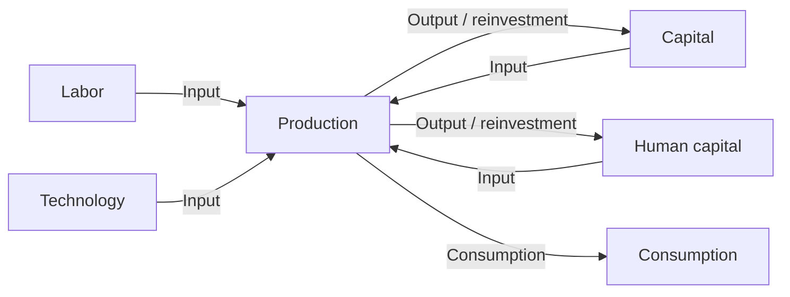
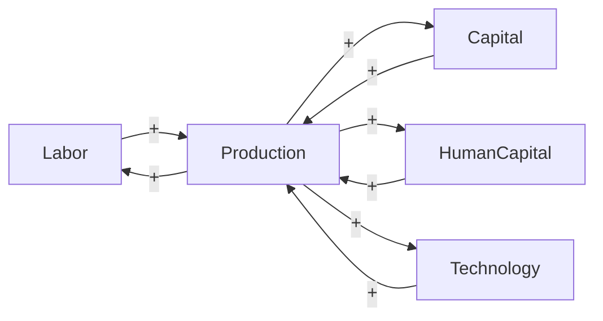
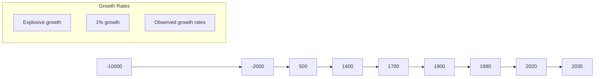

Published on _Open Philanthropy_ (https://archive.openphilanthropy.org)

# Could Advanced AI Drive Explosive Economic Growth?

_Author: Tom Davidson_  
_Published June 25, 2021_

This report evaluates the likelihood of ‘explosive growth’, meaning > 30% annual growth of gross world product (GWP), occurring by 2100. Although frontier GDP/capita growth has been constant for 150 years, over the last 10,000 years GWP growth has accelerated significantly. Endogenous growth theory, together with the empirical fact of the demographic transition, can explain both trends. Labor, capital and technology were accumulable over the last 10,000 years, meaning that their stocks all increased as a result of rising output. Increasing returns to these accumulable factors accelerated GWP growth. But in the late 19th century, the demographic transition broke the causal link from output to the quantity of labor. There were not increasing returns to capital and technology alone and so growth did not accelerate; instead frontier economies settled into an equilibrium growth path defined by a balance between a growing number of researchers and diminishing returns to research.

This theory implies that explosive growth could occur by 2100. If automation proceeded sufficiently rapidly (e.g. due to progress in AI) there _would_ be increasing returns to capital and technology alone. I assess this theory and consider counter-arguments stemming from alternative theories; expert opinion; the fact that 30% annual growth is wholly unprecedented; evidence of diminishing returns to R&D; the possibility that a few non-automated tasks bottleneck growth; and others. Ultimately, I find that explosive growth by 2100 is plausible but far from certain.

## How to read this report

Read the summary (~1 page). Then read the main report (~30 pages).

The rest of the report contains extended appendices to the main report. Each appendix expands upon specific parts of the main report. Read an appendix if you’re interested in exploring its contents in greater depth.

I describe the contents of each appendix here. The best appendix to read is probably the first, Objections to explosive growth. Readers may also be interested to read reviews of the report.

Though the report is intended to be accessible to non-economists, readers without an economics background may prefer to read the accompanying blog post [1].

## Why we are interested in explosive growth

Open Philanthropy wants to understand how far away we are from developing transformative artificial intelligence [2] (TAI). Difficult as it is, a working timeline for TAI helps us prioritize between our cause areas, including potential risks from advanced AI [3].

In her draft report [4], my colleague Ajeya Cotra [5] uses TAI to mean ‘AI which drives Gross World Product (GWP) to grow at ~20-30% per year’ – roughly ten times faster than it is growing currently. She estimates a high probability of TAI by 2100 (~80%), and a substantial probability of TAI by 2050 (~50%). These probabilities are broadly consistent with the results from expert surveys,[1] and with plausible priors for when TAI might be developed.[2]

Nonetheless, intuitively speaking these are high probabilities to assign to an ‘extraordinary claim’. Are there strong reasons to dismiss these estimates as too high? One possibility is economic forecasting. If economic extrapolations gave us strong reasons to think GWP will grow at ~3% a year until 2100, this would rule out explosive growth and so rule out TAI being developed this century.

I find that economic considerations don’t provide a good reason to dismiss the possibility of TAI being developed in this century. In fact, there is a plausible economic perspective from which sufficiently advanced AI systems are _expected_ to cause explosive growth.

## Summary

_If you’re not familiar with growth economics, I recommend you start by reading this glossary or my blog post about the report [6]._

Since 1900, frontier GDP/capita has grown at about 2% annually.[3] There is no sign that growth is speeding up; if anything recent data suggests that growth is slowing down. So why think that > 30% annual growth of GWP (‘explosive growth’) is plausible this century?

I identify three arguments to think that sufficiently advanced AI could drive explosive growth:

1. **Idea-based models of very long-run growth imply AI could drive explosive growth.**  
   _Growth rates have significantly increased (super-exponential growth) over the past 10,000 years, and even over the past 300 years. This is true both for GWP growth, and frontier GDP/capita growth._

---

https://archive.openphilanthropy.org/print/could-advanced-ai-drive-explosive-economic-growth

---

- Idea-based models explain increasing growth with an ideas feedback loop: more ideas → more output → more people → more ideas…  
  Idea-based models seem to have a good fit to the long-run GWP data, and offer a plausible explanation for increasing growth.  
  After the demographic transition [7] in ~1880, more output **did not** lead to more people; instead people had fewer children as output increased. This broke the ideas feedback loop, and so idea-based theories expect growth to stop increasing shortly after the time. Indeed, this is what happened. Since ~1900 growth has not increased but has been roughly constant.  
  Suppose we develop AI systems that can substitute very effectively for human labor in producing output and in R&D. The following ideas feedback loop could occur: **more ideas → more output → more AI systems → more ideas…** Before 1880, the ideas feedback loop led to super-exponential growth. So our default expectation should be that this new ideas feedback loop will again lead to super-exponential growth.

2. **A wide range of growth models predict explosive growth if capital can substitute for labor.** Here I draw on models designed to study the recent period of exponential growth. If you alter these models with the assumption that capital can substitute very effectively for labor, e.g. due to the development of advanced AI systems, they typically predict explosive growth. The mechanism is similar to that discussed above. Capital accumulation produces a powerful feedback loop that drives faster growth: **more capital → more output → more capital …**. These first two arguments both reflect an insight of endogenous growth theory: increasing returns to accumulable inputs can drive accelerating growth.

3. **An ignorance perspective assigns some probability to explosive growth.** We may not trust highly-specific models that attempt to explain why growth has increased over the long-term, or why it has been roughly constant since 1900. But we do know that the pace of growth has increased significantly over the course of history. Absent deeper understanding of the mechanics driving growth, it would be strange to rule out growth increasing again. 120 years of steady growth is not enough evidence to rule out a future increase.

I discuss a number of objections to explosive growth:

- 30% growth is very far out of the observed range.
- Models predicting explosive growth have implausible implications - like output going to infinity in finite time.
- There’s no evidence of explosive growth in any subsector of the economy.
- Limits to automation are likely to prevent explosive growth.
- Won’t diminishing marginal returns to R&D prevent explosive growth?
- And many others.

Although some of these objections are partially convincing, I ultimately conclude that explosive growth driven by advanced AI is a plausible scenario.

In addition, the report covers themes relating to the possibility of _stagnating_ growth; I find that it is a highly plausible scenario. Exponential growth in the number of researchers has been accompanied by merely constant GDP/capita growth over the last 80 years. This trend is well explained by semi-endogenous growth models in which ideas are getting harder to find.⁴ As population growth slows over the century, number of researchers will likely grow more slowly; semi-endogenous growth models predict that GDP/capita growth will slow as a result.

Thus I conclude that the possibilities for long-run growth are wide open. Both explosive growth and stagnation are plausible.

**Acknowledgements:** My thanks to Holden Karnofsky for prompting this investigation; to Ajeya Cotra for extensive guidance and support throughout; to Ben Jones, Dietrich Vollrath, Paul Gaggl, and Chad Jones for helpful comments on the report; to Anton Korinek, Jakub Growiec, Phil Trammel, Ben Garfinkel, David Roodman, and Carl Shulman for reviewing drafts of the report in depth; to Harry Mallinson for reviewing code I wrote for this report and helpful discussion; to Joseph Carlsmith, Nick Beckstead, Alexander Berger, Peter Favaloro, Jacob Trefethen, Zachary Robinson, Luke Muehlhauser, and Luisa Rodriguez for valuable comments and suggestions; to Guilhermo Costa for proving mathematical results and other helpful contributions; and to Eli Nathan for extensive help with citations and the website.

# Main report

_If you’re not familiar with growth economics, I recommend you start by reading this glossary or my blog post about the report [6]._

How might we assess the plausibility of explosive growth (>30% annual GWP) occurring by 2100? First, I consider the raw empirical data; then I address a number of additional considerations.

- What do experts think (here)?
- How does economic growth theory affect the case of explosive growth (here and here)?
- How strong are the objections to explosive growth (here)?
- Conclusion (here).

## Empirical data without theoretical interpretation

When looking at the raw data, two conflicting trends jump out.

The first trend is the **constancy of frontier GDP/capita growth over the last 150 years**.⁵ The US is typically used to represent this frontier. The following graph from Our World in Data [8] shows US GDP/capita since 1870.

[The page ends here with a placeholder for a graph.]

---

# GDP per capita, 1870 to 2016

GDP per capita adjusted for price changes over time (inflation) and price differences between countries – it is measured in international-$ in 2011 prices.

[Linear] [Log] + Add country  
United States

<table>
<thead>
<tr>
<th>Year</th>
<th>1870</th>
<th>1880</th>
<th>1900</th>
<th>1920</th>
<th>1940</th>
<th>1960</th>
<th>1980</th>
<th>2000</th>
<th>2016</th>
</tr>
</thead>
<tbody>
<tr>
<td>GDP per capita (approx.)</td>
<td></td>
<td></td>
<td></td>
<td></td>
<td></td>
<td></td>
<td></td>
<td></td>
<td></td>
</tr>
</tbody>
</table>

The y-axis is logarithmic, so the straight line indicates that growth has happened at a constant exponential rate - ~2% per year on average.  
Extrapolating the trend, frontier GDP/capita will grow at ~2% per year until 2100. GWP growth will be slightly larger, also including a small boost from population growth and catch-up growth. Explosive growth would be a _very large_ break from this trend.

I refer to forecasts along these lines as the _standard story_. Note, I intend the _standard story_ to encompass a wide range of views, including the view that growth will slow down significantly by 2100 and the view that it will rise to (e.g.) 4% per year.

The second trend is the **super-exponential growth of GWP over the last 10,000 years.** (Super-exponential means the growth rate increases over time.) Another graph from Our World in Data shows GWP over the last 2,000 years:

# World GDP over the last two millennia

Total output of the world economy; adjusted for inflation and expressed in international-$ in 2011 prices.

[Linear] [Log]

<table>
<thead>
<tr>
<th>Year (approx.)</th>
<th>1</th>
<th>500</th>
<th>1000</th>
<th>1500</th>
<th>2015</th>
</tr>
</thead>
<tbody>
<tr>
<td>GDP (approx.)</td>
<td>$200 billion</td>
<td></td>
<td></td>
<td></td>
<td>$100 trillion</td>
</tr>
<tr>
<td></td>
<td></td>
<td></td>
<td></td>
<td></td>
<td></td>
</tr>
<tr>
<td>Scale</td>
<td></td>
<td></td>
<td></td>
<td></td>
<td></td>
</tr>
<tr>
<td>Other values</td>
<td></td>
<td></td>
<td></td>
<td></td>
<td></td>
</tr>
</tbody>
</table>

Again, the y-axis is logarithmic, so the increasing steepness of the slope indicates that the growth rate has increased.

It’s not just GWP - there’s a similar super-exponential trend in long-run GDP/capita in many developed countries - see the graphs of US, English, and French GDP/capita in [this appendix]. (Later I discuss whether we can trust these pre-modern data points.)

It turns out that a simple equation called a ‘power law’ is a good fit to GWP data going all the way back to 10,000 BCE. The following graph (from my colleague David Roodman) shows the fit of a power law (and of exponential growth) to the data. The axes of the graph are chosen so that the power law appears as a straight line.

---

# Could Advanced AI Drive Explosive Economic Growth?

## Gross world product, 10,000 BCE—2019 CE

<table>
<thead>
<tr>
  <th colspan="2">Gross world product, 10,000 BCE—2019 CE</th>
  <th>billion $</th>
</tr>
</thead>
<tbody>
<tr>
  <td>Power law fit</td>
<td></td>
<td>- 100,000</td>
</tr>
<tr>
  <td>Exponential fit</td>
<td></td>
<td>- 10,000</td>
</tr>
<tr>
  <td></td>
<td></td>
<td>- 1,000</td>
</tr>
<tr>
  <td></td>
<td></td>
<td>- 100</td>
</tr>
<tr>
  <td></td>
<td></td>
<td>- 10</td>
</tr>
<tr>
  <td></td>
<td></td>
<td>- 1</td>
</tr>
<tr>
  <td>10000</td>
<td>1000 Years till 2047</td>
<td>100</td>
<td>10</td>
</tr>
</tbody>
</table>

If you extrapolate this power law trend into the future, it implies that the growth rate will continue to increase into the future and that GWP will approach infinity by 2047![^10]

Many other simple curves fit to this data also predict explosive (>30%) growth will occur in the next few decades. Why is this? The core reason is that the data shows the growth rate increasing more and more quickly over time. It took thousands of years for growth to increase from 0.03% to 0.3%, but only a few hundred years for it to increase from 0.3% to 3%.[^11] If you naively extrapolate this trend, you predict that growth will increase again from 3% to 30% within a few decades.

We can see this pattern more clearly by looking at a graph of how GWP _growth_ has changed over time.[^12]

---

## GWP growth over time

<table>
<thead>
<tr>
  <th colspan="2">GWP growth over time</th>
</tr>
</thead>
<tbody>
<tr>
  <td>Growth rate (%)</td>
<td>Year</td>
</tr>
<tr>
  <td>102</td>
<td></td>
</tr>
<tr>
  <td>101</td>
<td></td>
</tr>
<tr>
  <td>100</td>
<td></td>
</tr>
<tr>
  <td>10-1</td>
<td></td>
</tr>
<tr>
  <td>10-2</td>
<td></td>
</tr>
<tr>
  <td>0</td>
<td></td>
</tr>
<tr>
  <td>-10-3</td>
<td></td>
</tr>
<tr>
  <td>-10-2</td>
<td></td>
</tr>
<tr>
  <td>-10-1</td>
<td></td>
</tr>
<tr>
  <td>-100</td>
<td></td>
</tr>
<tr>
  <td></td>
<td>-10000</td>
</tr>
<tr>
  <td></td>
<td>-2000</td>
</tr>
<tr>
  <td></td>
<td>500</td>
</tr>
<tr>
  <td></td>
<td>1400</td>
</tr>
<tr>
  <td></td>
<td>1750</td>
</tr>
<tr>
  <td></td>
<td>1900</td>
</tr>
<tr>
  <td></td>
<td>1980</td>
</tr>
<tr>
  <td></td>
<td>2020</td>
</tr>
<tr>
  <td></td>
<td>2035</td>
</tr>
</tbody>
</table>

Legend:

- Explosive growth
- 1% growth
- Observed growth rates

The graph shows that the time needed for the growth rate to double has fallen over time. (Later I discuss whether this data can be trusted.) Naively extrapolating the trend, you’d predict explosive growth within a few decades.

I refer to forecasts along these lines, that predict explosive growth by 2100, as the _explosive growth story_.

[^10]: Reference 10
[^11]: Reference 11
[^12]: Reference 12
[^13]: Reference 13

---

So we have two conflicting stories. The _standard story_ points to the steady ~2% growth in frontier GDP/capita over the last 150 years, and expects growth to follow a similar pattern out to 2100. The _explosive growth story_ points to the super-exponential growth in GWP over the last 10,000 years and expects growth to increase further to 30% per year by 2100.

Which story should we trust? Before taking into account further considerations, I think we should put some weight on both. For predictions about the near future I would put more weight on the _standard story_ because its data is more recent and higher quality. But for predictions over longer timescales I would place increasing weight on the _explosive growth story_ as it draws on a longer data series.

Based on the two empirical trends alone, I would neither confidently rule out explosive growth by 2100 nor confidently expect it to happen. My attitude would be something like:

> ‘_Historically, there have been significant increases in growth. Absent a deeper understanding of the mechanisms driving these increases, I shouldn’t rule out growth increasing again in the future._’

I call this attitude the _ignorance story_.[13] The rest of the main report raises considerations that can move us away from this attitude (either towards the _standard story_ or towards the _explosive growth story_).

## Expert opinion

In the most recent and comprehensive expert survey[14] on growth out to 2100 that I could find, all the experts assigned low probabilities to explosive growth.

All experts thought it 90% likely that the average annual GDP/capita growth out to 2100 would be below 5%.[14] Strictly speaking, the survey data is compatible with experts thinking there is a 9% probability of explosive growth this century, but this seems unlikely in practice. The experts’ quantiles, both individually and in aggregate, were a good fit for normal distributions which would assign ≪ 1% probability to explosive growth.[15]

Experts’ mean estimate of annual GWP/capita growth was 2.1%, with standard deviation 1.1%.[16] So their views support the _standard story_ and are in tension with the _explosive growth story_.

There are three important caveats:

1. **Lack of specialization.** My impression is that long-run GWP forecasts are not a major area of specialization, and that the experts surveyed weren’t experts specifically in this activity. Consonant with this, survey participants did not consider themselves to be particularly expert, self-reporting their level of expertise as 6 out of 10 on average.[17]

2. **Lack of appropriate prompts.** Experts were provided with the data about the growth rates for the period 1900-2000, and primed with a ‘warm up question’ about the recent growth of US GDP/capita. But no information was provided about the longer-run super-exponential trend, or about possible mechanisms for producing explosive growth (like advanced AI). The respondents may have assigned higher probabilities to explosive growth by 2100 if they’d been presented with this information.

3. **No focus on tail outcomes.** Experts were not asked explicitly about explosive growth, and were not given an opportunity to comment on outcomes they thought were <10% likely to occur.

## Theoretical models used to extrapolate GWP out to 2100

Perhaps economic growth theory can shed light on whether to extrapolate the exponential trend (_standard story_) or the super-exponential trend (_explosive growth story_).

In this section I ask:

- Do the growth models of the _standard story_ give us reason beyond the empirical data to think 21st century growth will be exponential or sub-exponential?

  - They could do this if they point to a mechanism explaining recent exponential growth, and this mechanism will continue to operate in the future.

- Do the growth models of the _explosive growth story_ give us reason beyond the empirical data to think 21st century growth will be super-exponential?
  - They could do this if they point to a mechanism explaining the long-run super-exponential growth, and this mechanism will continue to operate in the future.

My starting point is the models actually used to extrapolate GWP to 2100, although I draw upon economic growth theory more widely in making my final assessment. First, I give a brief explanation of how growth models work.

### How do growth models work?

In economic growth models, a number of _inputs_ are combined to produce _output_. Output is interpreted as GDP (or GWP). Typical inputs include capital (e.g. equipment, factories), labor (human workers), human capital (e.g. skills, work experience), and the current level of technology.[18]

<table>
  <tr>
    <td>Labor</td>
  </tr>
<tr>
    <td>Capital</td>
  </tr>
<tr>
    <td>Human capital</td>
  </tr>
<tr>
    <td>Technology</td>
  </tr>
<tr>
    <td colspan="2">Production →</td>
  </tr>
<tr>
    <td>- Input</td>
<td>- Output</td>
  </tr>
</table>

[15]

---

Some of these inputs are _endogenous_,[^19] meaning that the model explains how the input changes over time. Capital is typically endogenous; output is invested to sustain or increase the amount of capital.[^20] In the following diagram, capital and human capital are endogenous:

Other inputs may be _exogenous_. This means their values are determined using methods external to the growth model. For example, you might make labor exogenous and choose its future values using UN population projections. The growth model does not (attempt to) explain how the exogenous inputs change over time.

When a growth model makes more inputs endogenous, it models more of the world. It becomes more ambitious, and so more debatable, but it also gains the potential to have greater explanatory power.

### Growth models extrapolating the exponential trend to 2100

I looked at a number of papers in line with the _standard story_ that extrapolate GWP out to 2100. Most of them treated technology as exogenous, typically assuming that technology will advance at a constant exponential rate.[^21] In addition, they all treated labor as exogenous, often using UN projections. These growth models can be represented as follows:

The blue ‘+’ signs represent that the increases to labor and technology each year are exogenous, determined outside of the model.

In these models, the positive feedback loop between output and capital is not strong enough to produce sustained growth. This is due to _diminishing marginal returns_ to capital. This means that each new machine adds less and less value to the economy, holding the other inputs fixed.[^22] Even the

[^19]: Reference note 19
[^20]: Reference note 20
[^21]: Reference note 21
[^22]: Reference note 22

---

feedback loop between output and (capital + human capital) is not strong enough to sustain growth in these models, again due to diminishing returns.

Instead, long-run growth is driven by the growth of the exogenous inputs, labor and technology. For this reason, these models are called _exogenous growth models_: the ultimate source of growth lies outside of the model. (This is contrasted with _endogenous growth models_, which try to explain the ultimate source of growth.)

It turns out that long run growth of GDP/capita is determined solely by the growth of technology.[^23] These models do not (try to) explain the pattern of technology growth, and so they don’t ultimately explain the pattern of GDP/capita growth.

### Evaluating models extrapolating the exponential trend

The key question of this section is: **Do the growth models of the standard story give us reason beyond the empirical data to think 21st century growth of frontier GDP/capita will be exponential or sub-exponential?**

My answer is ‘yes’. Although the exogenous models used to extrapolate GWP to 2100 don’t ultimately explain why GDP/capita has grown exponentially, there are endogenous growth models that address this issue. Plausible endogenous models explain this pattern and imply that 21st century growth will be sub-exponential. This is consistent with the standard story. Interestingly, I wasn’t convinced by models implying that 21st century growth will be exponential.

The rest of this section explains my reasoning in more detail.

Endogenous growth theorists have for many decades sought theories where long-run growth is robustly exponential. However, they have found it strikingly difficult. In endogenous growth models, long-run growth is typically only exponential if some _knife-edge_ condition holds. A parameter of the model must be _exactly_ equal to some specific value; the smallest disturbance in this parameter leads to completely different long-run behavior, with growth either approaching infinity or falling to 0. Further, these knife-edges are typically _problematic_: there’s no particular reason to expect the parameter to have the precise value needed for exponential growth. This problem is often called the ‘linearity critique’ of endogenous growth models.

Appendix B argues that many endogenous growth models contain problematic knife-edges, drawing on discussions in Jones (1999) [18], Jones (2005) [19], Cesaratto (2008) [20], and Bond-Smith (2019) [21].

Growiec (2007) [22] proves that a wide class of endogenous growth models require a knife-edge condition to achieve constant exponential growth, generalizing the proof of Christiaans (2004) [23]. The proof doesn’t show that all such conditions are _problematic_, as there could be mechanisms explaining why knife-edges hold. However, combined with the observation that many popular models contain problematic knife-edges, the proof suggests that it may be generically difficult to explain exponential growth without invoking problematic knife-edge conditions.

Two attempts to address this problem stand out:

1. Claim that **exponential population growth has driven exponential GDP/capita growth**. This is an implication of semi-endogenous growth models (Jones 1995 [24]). These models are consistent with 20th century data: exponentially growing R&D effort has been accompanied by exponential GDP/capita growth. Appendix B argues that semi-endogenous growth models offer the best framework for explaining the recent period of exponential growth.[24]

   However, I do not think their ‘knife-edge’ assumption that population will grow at a constant exponential rate is likely to be accurate until 2100. In fact, the UN projects [25] that population growth will slow significantly over the 21st century. With this projection, semi-endogenous growth models imply that GDP/capita growth will slow.[25]

   So these models imply 21st century growth will be sub-exponential rather than exponential.[26]

2. Claim that **market equilibrium leads to exponential growth without knife-edge conditions**.
   - In a 2020 paper _Robust Endogenous Growth_ [26], Peretto outlines a fully endogenous growth model that achieves constant exponential growth of GDP/capita without knife-edge conditions. The model displays increasing returns to R&D investment, which would normally lead to super-exponential growth. However, these increasing returns are ‘soaked up’ by the creation of new firms which dilute R&D investment. Market incentives ensure that new firms are created at _exactly_ the rate needed to sustain exponential growth.
   - The model seems to have some implausible implications. Firstly, it implies that there should be a huge amount of market fragmentation, with the number of firms growing more quickly than the population. This contrasts with the striking pattern of market _concentration_ we see in many areas.[27] Secondly, it implies that if no new firms were introduced - e.g. because this was made illegal - then output would reach infinity in finite time. This seems to imply that there is a huge market failure [27]: private incentives to create new firms massively reduce long-run social welfare.
   - Despite these problems, the model does raise the possibility that an apparent knife-edge holds in reality due to certain equilibrating pressures. Even if this model isn’t quite right, there may still be equilibrating pressures of some sort.[28]
   - Overall, this model slightly raises my expectation that long-run growth will be exponential.[29]

This research shifted my beliefs in a few ways:

- I put more probability (~75%) on semi-endogenous growth models explaining the recent period of exponential growth.[30]
  - So I put more weight on 21st century growth being sub-exponential.
  - We’ll see later that these models imply that sufficiently advanced AI could drive explosive growth. So I put more weight on this possibility as well.
- It was harder than I expected to for growth theories to adequately explain why income growth should be exponential in a steady state (rather than sub- or super-exponential). So I put more probability on the recent period of exponential growth being transitory, rather than part of a steady state.
  - For example, the recent period could be a transition between past super-exponential growth and future sub-exponential growth, or a temporary break in a longer pattern of super-exponential growth.
  - This widens the range of future trajectories that I regard as being plausible.

### Growth models extrapolating the super-exponential trend

Some growth models extrapolate the long-run super-exponential trend to predict explosive growth in the future.[31] Let’s call them _long-run explosive models_. The ones I’m aware of are ‘fully endogenous’, meaning _all_ inputs are endogenous.[32]

---

Crucially, _long-run explosive_ models claim that **more output → more people**. This makes sense (for example) when food is scarce: more output means more food, allowing the population to grow. This assumption is important, so it deserves a name. Let’s say these models make population _accumulable_. More generally, an input is accumulable just if **more output → more input**.³³

The term ‘accumulable’ is from the growth literature; the intuition behind it is that the input can be accumulated by increasing output.

It’s significant for an input to be accumulable as it allows a feedback loop to occur: **more output → more input → more output → …** Population being accumulable is the most distinctive feature of _long-run explosive_ models.

_Long-run explosive models_ also make technology accumulable: **more output → more people → more ideas (technological progress).**

All growth models, even exogenous ones, imply that capital is accumulable: **more output → more reinvestment → more capital.**³⁴ In this sense, _long-run explosive_ models are a natural extension of the exogenous growth models discussed above: a similar mechanism typically used to explain capital accumulation is used to explain the accumulation of technology and labor.

We can roughly represent _long-run explosive_ models as follows:³⁵

The orange arrows show that all the inputs are accumulable: a marginal increase in output leads to an increase in the input. Fully endogenous growth models like these attempt to model more of the world than exogenous growth models, and so are more ambitious and debatable; but they potentially have greater explanatory power.

Why do these models predict super-exponential growth? The intuitive reason is that, with so many accumulable inputs, the feedback loop between the inputs and output is powerful enough that growth becomes faster and faster over time.

More precisely, the key is **increasing returns to scale in accumulable inputs**: when we double the level of every accumulable input, output _more_ than doubles.³⁶

Why are there increasing returns to scale? The key is the insight, from Romer (1990) [²⁹], that technology is non-rival. If you use a new solar panel design in your factory, that doesn’t prevent me from using that same design in my factory; whereas if you use a particular machine/worker, that _does_ prevent me from using that same machine/worker.

Imagine doubling the quantity of labor and capital, holding technology fixed. You could literally replicate every factory and worker inside it, and make everything you currently make a second time. Output would double. Crucially, you wouldn’t need to double the level of technology because ideas are non-rival: twice as many factories could use the same stock of ideas without them ‘running out’.

Now imagine also doubling the level of technology. We’d still have twice as many factories and twice as many workers, but now each factory would now be more productive. Output would _more_ than double. This is increasing returns to scale: double the inputs, _more than_ double the output.³⁷

_Long-run explosive models_ assume that capital, labor and technology are all accumulable. Even if they include a fixed input like land, there are typically increasing returns to accumulable inputs. This leads to super-exponential growth as long unless the diminishing returns to technology R&D are very steep.³⁸ For a wide range of plausible parameter values, these models predict super-exponential growth.³⁹

The key feedback loop driving increasing returns and super-exponential growth in these models can be summarized as **more ideas (technological progress) → more output → more people → more ideas → …**

---

These models seem to be a good fit to the long-run GWP data. The model in Roodman (2020) [30] implies that GWP follows a ‘power-law’, which seems to fit the data well.

<table>
<thead>
<tr>
<th colspan="7">Gross world product, 10,000 BCE—2019 CE</th>
<th>billion $</th>
</tr>
</thead>
<tbody>
<tr>
<td colspan="6"></td>
<td>Power law fit</td>
<td rowspan="8" style="text-align:right;">
- 100,000 
- 10,000 
- 1,000 
- 100 
- 10 
- 1
</td>
</tr>
<tr>
<td colspan="6"></td>
<td>Exponential fit</td>
</tr>
<tr>
<td>10000</td>
<td colspan="2"></td>
<td>1000</td>
<td colspan="2"></td>
<td>100</td>
</tr>
<tr>
<td colspan="7" style="text-align:center;">Years till 2047</td>
</tr>
</tbody>
</table>

[12]

Long-run explosive models fitted to the long-run GWP data typically predict that explosive growth (>30% per year) is _a few decades away_. For example, you can ask the model in Roodman (2020) ‘_When will be the first year of explosive growth?_’ Its median prediction is 2043 and the 80% confidence range is [2034, 2065].

### Evaluating models extrapolating the super-exponential trend

The key question of this section is: **Do the growth models of the explosive growth story give us reason to think 21st century growth will be super-exponential?** My answer in this section is ‘no’, because the models are not well suited to describing post-1900 growth. In addition, it’s unclear how much we should trust their description of pre-1900 growth. (However, the next section argues these models can be trusted if we develop sufficiently powerful AI systems.)

#### Problem 1: _Long-run explosive models_ are not suitable for describing post-1900 growth

The central problem is that long-run explosive models assume population is accumulable. [40] While it is plausible than in pre-modern times **more output → more people**, this hasn’t been true in developed countries over the last ~140 years. In particular, since ~1880 fertility rates have _declined_ despite increasing GDP/capita. [41] This is known as the demographic transition [7]. Since then, more output has not led to more people, but to richer and better educated people: **more output → more richer people**. Population is no longer accumulable (in the sense that I’ve defined the term). [42] The feedback loop driving super-exponential growth is broken: **more ideas → more output → more richer people** ~~→ more ideas~~.

How would this problem affect the models’ predictions? If population is not accumulable, then the returns to accumulable inputs are lower, and so growth is slower. We’d expect _long-run explosive models_ to predict faster growth than we in fact observe after ~1880; in addition we wouldn’t expect to see super-exponential growth after ~1880. [43]

Indeed, this is what the data shows. _Long-run explosive models_ are surprised at how slow GWP growth is since 1960 (more), and surprised at how slow frontier GDP/capita growth is since 1900 (more). It is not surprising that a structural change means a growth model is no longer predictively accurate: growth models are typically designed to work in bounded contexts, rather than being universal theories of growth.

A natural hypothesis is that **the reason why long-run explosive models are a poor fit to the post-1900 data is that they make an assumption about population that has been inaccurate since ~1880**. The recent data is not evidence against _long-run explosive models_ per se, but confirmation that their predictions can only be trusted when population is accumulable.

This explanation is consistent with some prominent idea-based theories of very long-run growth. [44] These theories use the same mechanism as _long-run explosive models_ to explain pre-1900 super-exponential growth: labor and technology are accumulable, so there are increasing returns to accumulable inputs, [45] so there’s super-exponential growth. They feature the same ideas feedback loop: **more ideas → more output → more people → more ideas → …** [46]

These idea-based theories are made consistent with recent exponential growth by adding an additional mechanism that makes the fertility rate drop once the economy reaches a mature stage of development, [47] mimicking the effect of the demographic transition. After this point, population isn’t accumulable and the models predict exponential growth by approximating some standard endogenous or semi-endogenous model. [48]

These idea-based models provide a good explanation of very long-run growth and modern growth. They increase my confidence in the main claim of this section: _long-run explosive models_ are a poor fit to the post-1900 data because they (unrealistically) assume population is accumulable. However, idea-based models are fairly complex and were _designed_ to explain long-run patterns in GDP/capita and population; this should make us wary to trust them too much. [49]

#### Problem 2: It is unclear how much we should trust _long-run explosive models’_ explanation of pre-1900 growth

None of the problems discussed above dispute the _explosive growth story_’s explanation of pre-1900 growth. How much weight should we put on its account?

It emphasizes the non-rivalry of ideas and the mechanism of increasing returns to accumulable factors. This mechanism implies growth increased fairly smoothly over hundreds and thousands of years. [50] We saw that the increasing-returns mechanism plays a central role in several prominent models of long-run growth. [51]

https://archive.openphilanthropy.org/print/could-advanced-ai-drive-explosive-economic-growth

---

However, most papers on very long run growth emphasize a different explanation, where a structural transition occurs around the industrial revolution.[52]  
Rather than a smooth increase, this suggests a single step-change in growth occurred around the industrial revolution, without growth increasing before or after the step-change.[53]

Though a ‘step-change’ view of long-run growth rates will have a lesser tendency to predict explosive growth by 2100, it would not rule it out. For this, you would have to explain why step change increases have occurred in the past, but no more will occur in the future.[54]

How much weight should we place in the increasing-returns mechanism versus the step-change view? The ancient data points are highly uncertain, making it difficult to adjudicate empirically.[55] Though GWP growth seems to have increased across the whole period 1500 - 1900, this is compatible with there being one slow step-change.[56]

There is some informative evidence:

- Kremer (1993) gives evidence for the increasing-returns mechanism. He looks at the development of 5 isolated regions and finds that the technology levels of the regions in 1500 are perfectly rank-correlated with their initial populations in 10,000 BCE. This is just what the increasing returns mechanism would predict.[57]

- Roodman (2020) gives evidence for the step-change view. Roodman finds that his own model, which uses the _increasing-returns_ mechanism, is surprised by the speed of growth around the industrial revolution (see more).

Overall, I think it’s likely that the increasing-returns mechanism plays an important role in explaining very long-run growth. As such I think we should take _long-run explosive models_ seriously (if population is accumulable). That said, they are not the whole story; important structural changes happened around the industrial revolution.[58]

### Summary of theoretical models used to extrapolate GWP out to 2100

I repeat the questions asked at the start of this section, now with their answers:

- Do the growth models of the _standard story_ give us reason beyond the empirical data to think 21st century growth will be exponential or sub-exponential?

  - Yes, plausible models imply that growth will be sub-exponential. Interestingly, I didn’t find convincing reasons to expect exponential growth.

- Do the growth models of the _explosive growth story_ give us reason beyond the empirical data to think 21st century growth will be super-exponential?
  - No, _long-run explosive models_ assume population is accumulable, which isn’t accurate after ~1880.
  - However, the next section argues that advanced AI could make this assumption accurate once more. So I think these models do give us reason to expect explosive growth _if_ sufficiently advanced AI is developed.

<table>
<thead>
<tr>
<th></th>
<th>Standard story</th>
<th>Explosive growth story</th>
</tr>
</thead>
<tbody>
<tr>
<td>Preferred data set</td>
<td>Frontier GDP/capita since 1900</td>
<td>GWP since 10,000 BCE</td>
</tr>
<tr>
<td>Predicted shape of long-run growth</td>
<td>Exponential or sub-exponential</td>
<td>Super-exponential (for a while, and then eventually sub-exponential)</td>
</tr>
<tr>
<td>Models used to extrapolate GWP to 2100</td>
<td>Exogenous growth models</td>
<td>Endogenous growth model, where population and technology are accumulable.</td>
</tr>
<tr>
<td>Evaluation</td>
<td>Semi-endogenous growth models are plausible and predict 21st century growth will be sub-exponential. Theories predicting exponential growth rely on problematic knife-edge conditions.</td>
<td>Population is no longer accumulable, so we should not trust these models by default. However, advanced AI systems could make this assumption realistic again, in which case the prediction of super-exponential can be trusted.</td>
</tr>
</tbody>
</table>

## Advanced AI could drive explosive growth

It is possible that significant advances in AI could allow capital to much more effectively substitute for labor.[59] Capital is accumulable, so this could lead to increasing returns to accumulable inputs, and so to super-exponential growth.[60] I’ll illustrate this point from two complementary perspectives.

### AI robots as a form of labor

First, consider a toy scenario in which Google announces tomorrow that it’s developed AI robots that can perform _any_ task that a human laborer can do for a smaller cost. In this (extreme!) fiction, AI robots can _perfectly_ substitute for all human labor. We can write (total labor) = (human labor) + (AI labor). We can invest output to build more AI robots,[61] and so increase the labor supply: **more output → more labor (AI robots)**. In other words, **labor is accumulable again**. When this last happened there was super-exponential growth, so our default expectation should be that this scenario will lead to super-exponential growth.

To look at it another way, AI robots would reverse the effect of the demographic transition. Before that transition, the following feedback loop drove increasing returns to accumulable inputs and super-exponential growth:

> More ideas → more output → more labor (people) → more ideas →…

With AI robots there would be a closely analogous feedback loop:

> More ideas → more output → more labor (AI robots) → more ideas →…

---

<table>
<thead>
<tr>
<th>Period</th>
<th>Feedback loop?</th>
<th>Is total labor accumulable?</th>
<th>Pattern of growth</th>
</tr>
</thead>
<tbody>
<tr>
<td>Pre-1880</td>
<td>Yes: More ideas → more output → more people → more ideas →…</td>
<td>Yes</td>
<td>GWP grows at an increasing rate.</td>
</tr>
<tr>
<td>1880 - present</td>
<td>No: More ideas → more output → more richer people → ~~more ideas →…~~</td>
<td>No</td>
<td>GWP grows at a ~constant rate.</td>
</tr>
<tr>
<td>AI robot scenario</td>
<td>Yes: More ideas → more output → more AI systems → more ideas →…</td>
<td>Yes</td>
<td>GWP grows at an increasing rate.</td>
</tr>
</tbody>
</table>

Indeed, plugging the AI robot scenario into a wide variety of growth models, including exogenous growth models, you find that increased returns to accumulable inputs drives super-exponential growth for plausible parameter values. [62]

This first perspective, analysing advanced AI as a form of labor, emphasizes the similarity of pre-1900 growth dynamics to those of a possible future world with advanced AI. If you think that the increasing-returns mechanism increased growth in the past, it’s natural to think that the AI robot scenario would increase growth again. [63]

## AI as a form of capital

There are currently diminishing returns to accumulating more capital, holding the amount of labor fixed. For example, imagine creating more and more high-quality laptops and distributing them around the world. At first, economic output would plausibly increase as the laptops made people more productive at work. But eventually additional laptops would make no difference as there’d be no one to use them. The feedback loop ‘more output → more capital → more output →…’ peters out.

Advances in AI could potentially change this. By automating wide-ranging cognitive tasks, they could allow capital to substitute more effectively for labor. As a result, there may no longer be diminishing returns to capital accumulation. AI systems could replace both the laptops _and_ the human workers, allowing capital accumulation to drive faster growth. [64]

Economic growth models used to explain growth since 1900 back up this point. In particular, if you adjust these models by assuming that capital substitutes more effectively for labor, they predict increases in growth.

The basic story is: capital substitutes more effectively for labor → capital’s share of output increases → larger returns to accumulable inputs → faster growth. In essence, the feedback loop ‘more output → more capital → more output → …’ becomes more powerful and drives faster growth.

What level of AI is required for explosive (>30%) growth in these models? The answer varies depending on the particular model: [65]

- Often the crucial condition is that the elasticity of substitution between capital and labor rises above 1. This means that some (perhaps very large) amount of capital can completely replace any human worker, though it is a weaker condition than perfect substitutability. [66]

- In the task-based model of Aghion et al. (2017), automating a fixed set of tasks leads to only a temporary boost in growth. A constant stream of automation (or full automation) is needed to maintain faster growth. [67]

- Appendix C discusses the conditions for super-exponential growth in a variety of such models (see here).

Overall, what level of AI would be sufficient for explosive growth? Based on a number of models, I think that explosive growth would require AI that substantially accelerates the automation of a very wide range of tasks in the production of goods and services, R&D, and the implementation of new technologies. The more rapid the automation, and the wider the range of tasks, the faster growth could become. [68]

It is worth emphasizing that these models are simple extensions of standard growth models; the only change is to assume that capital can substitute more effectively for labor. With this assumption, semi-endogenous models with reasonable parameter values predict explosive growth, as do exogenous growth models with constant returns to labor and capital. [69]

A draft literature review [31] on the possible growth effects of advanced AI includes many models in which AI increases growth via this mechanism (capital substituting more effectively for labor). In addition, it discusses several other mechanisms by which AI could increase growth, e.g. changing the mechanics of idea discovery and changing the savings rate. [70]

## Combining the two perspectives

Both the ‘AI robots’ perspective and the ‘AI as a form of capital’ perspective make a similar point: if advanced AI can substitute very effectively for human workers, it could precipitate explosive growth by increasing the returns to accumulable inputs. In many growth models with plausible parameter values this scenario leads to explosive growth.

Previously, we said we should not trust _long-run explosive models_ as they unrealistically assume population is accumulable. We can now qualify this claim. We should not trust these models _unless_ AI systems are developed that can replace human workers.

### Could sufficiently advanced AI be developed in time for explosive growth to occur this century?

This is not a focus of this report, but other evidence suggests that this scenario is plausible:

- A survey of AI practitioners asked them about the probability of developing AI that would enable full automation. [71] Averaging their responses, they assigned ~30% or ~60% probability to this possibility by 2080, depending on how the question is framed. [72]

- My colleague Joe Carlsmith’s [32]report [33] estimates the computational power needed to match the human brain. Based on this and other evidence, my colleague Ajeya Cotra [5]’s draft [4] report [4] estimates when we’ll develop human-level AI; she finds we’re ~70% likely to do so by 2080.

- In a previous report [34] I estimated the probability of developing human-level AI based on analogous historical developments. My framework finds a ~15% probability of human-level AI by 2080.

## Objections to explosive growth

---

My responses are brief, and I encourage interested readers to read Appendix A, which discusses these and other objections in more detail.

## What about diminishing returns to technological R&D?

**Objection:** There is good evidence that ideas are getting harder to find [35]. In particular, it seems that exponential growth in the number of researchers is needed to sustain constant exponential growth in technology (TFP).

**Response:** The models I have been discussing take this dynamic into account. They find that, with realistic parameter values, increasing returns to accumulable inputs is powerful enough to overcome diminishing returns to technological progress if AI systems can replace human workers. This is because the feedback loop _‘more output → more labor (AI systems) → more output’_ allows research effort to grow _super-exponentially_, leading to super-exponential TFP growth despite ideas becoming harder to find (see more).

**Related objection:** You claimed above that the demographic transition caused super-exponential growth to stop. This is why you think advanced AI could restart super-exponential growth. But perhaps the real cause was that we hit more sharply diminishing returns to R&D in the 20th century.

**Response:** This could be true. Even if true, though, this wouldn’t rule out explosive growth occurring this century: it would still be possible that returns to R&D will become less steep in the future and the historical pattern of super-exponential growth will resume. [73]

However, I investigated this possibility and came away thinking that diminishing returns probably didn’t explain the end of super-exponential growth.

- Various endogenous growth models suggest that, had population remained accumulable throughout the 20th century, growth would have been super-exponential _despite_ the sharply diminishing returns to R&D that we have observed.
- Conversely, these models suggest that the demographic transition would have ended super-exponential growth even if diminishing returns to R&D had been much less steep.
- This all suggests that the demographic transition, not diminishing returns, is the crucial factor in explaining the end of super-exponential growth (see more).

That said, I do think it’s reasonable to be uncertain about why super-exponential growth came to an end. The following diagram summarizes some possible explanations for the end of super-exponential growth in the 20th century, and their implications for the plausibility of explosive growth this century.

---

Why did the period of super-exponential growth come to an end?

The demographic transition meant that labour was not longer accumulable.

We hit sharply diminishing returns to R&D in the 20th century.

We don't know.

Super-exponential growth may resume again if labour becomes accumulable again, or if capital can substitute very effectively for labour – e.g. due to powerful AI systems.

Super-exponential growth will resume if the pattern of diminishing returns goes back to pre-20th century levels.

I investigated this idea and found it wasn’t supported by endogenous growth models featuring diminishing returns.

We should be uncertain about whether super-exponential growth will resume. How likely you think this is depends on how much weight you assign to pre-modern data points.

---

**30% growth is very far out of the observed range**

**Objection:** Explosive growth is so far out of the observed range! Even when China was charging through catch-up growth it never sustained more than 10% growth. So 30% is out of the question.

**Response:** Ultimately, this is not a convincing objection. If you had applied this reasoning in the past, you would have been repeatedly led into error. The 0.3% GWP growth of 1400 was higher than the previously observed range, and the 3% GWP growth of 1900 was higher than the previously observed range. There is historical precedent for growth increasing to levels far outside of the previously observed range (see more).

---

**Models predicting explosive growth have implausible implications**

**Objection:** Endogenous growth models imply output becomes infinite in a finite time. This is impossible and we shouldn’t trust such unrealistic models.

**Response:** First, models are always intended to apply only within bounded regimes; this doesn’t mean they are bad models. Clearly these endogenous growth models will stop applying before we reach infinite output (e.g. when we reach physical limits); they might still be informative before we reach this.

---

## There’s no evidence of explosive growth in any economic sub-sector

**Objection:** If GWP growth rates were soon going to rise to 30%, we’d see signs of this in the current economy. But we don’t - Nordhaus (2021) looks for such signs and doesn’t find them.

**Response:** The absence of these signs in macroeconomic data is reason to doubt explosive growth will occur within the next couple of decades. Beyond this time frame, it is hard to draw conclusions. Further, it’s possible that the recent fast growth of machine learning is an early sign of explosive growth (see more).

## Why think AI automation will be different to past automation?

**Objection:** We have been automating parts of our production processes and our R&D processes for many decades, without growth increasing. Why think AI automation will be different?

**Response:** To cause explosive growth, AI would have to drive much faster and widespread automation than we have seen over the previous century. If AI ultimately enabled _full_ automation, models of automation suggest that the consequences for growth would be much more radical than those from the partial automation we have had in the past (see more).

## Automation limits

**Objection:** Aghion et al. (2017) considers a model where growth is bottlenecked by tasks that are essential but hard to improve. If we’re unable to automate just one essential task, this would prevent explosive growth.

**Response:** This correctly highlights that AI may lead to very widespread automation without explosive growth occurring. One possibility is that an essential task isn’t automated because we care intrinsically about having a human perform the task, e.g. a carer.

I don’t think this provides a decisive reason to rule out explosive growth. Firstly, it’s possible that we will ultimately automate all essential tasks, or restructure work-flows to do without them. Secondly, there could be a significant boost in growth rates, at least temporarily, even without full automation (see more).[^74]

## Limits to how fast a human economy can grow

**Objection:** The economic models predicting explosive growth ignore many possible bottlenecks that might slow growth. Examples include regulation of the use of AI systems, extracting and transporting important materials, conducting physical experiments on the world needed to make social and technological progress, delays for humans to adjust to new technological and social innovations, fundamental limits to how advanced technology can become, fundamental limits of how quickly complex systems can grow, and other unanticipated bottlenecks.[^75]

**Response:** I do think that there is some chance that one of these bottlenecks will prevent explosive growth. On the other hand, no individual bottleneck is certain to apply and there are some reasons to think we could grow at 30% per year:

- There will be huge incentives to remove bottlenecks to growth, and if there’s just one country that does this it would be sufficient.[^76]
- Large human economies have already grown at 10% per year (admittedly via catch up growth), explosive growth would only be 3X as fast.
- Humans oversee businesses growing at 30% per year, and individual humans can adjust to 30% annual increases in wealth and want more.
- AI workers could run much faster than human workers.[^77]
- Biological populations can grow faster than 30% a year, suggesting that it is physically possible for complex systems to grow this quickly.[^78]

The arguments on both sides are inconclusive and inevitably speculative. I feel deeply uncertain about how fast growth could become before some bottleneck comes into play, but personally place less than 50% probability on a bottleneck preventing 30% GWP growth. That said, I have spent very little time thinking about this issue, which would be a fascinating research project in its own right.

## How strong are these objections overall?

I find some of the objections unconvincing:

- **Diminishing returns.** The models implying that full automation would lead to explosive growth take diminishing returns into account.
- **30% is far from the observed range.** Ruling out 30% on this basis would have led us astray in the past by ruling out historical increases in growth.
- **Models predicting explosive growth have implausible implications.** We need not literally believe that output will go to infinity to trust these models, and there are models that predict explosive growth without this implication.

I find other objections partially convincing:

- **No evidence of explosive growth in any economic sub-sector.** Trends in macroeconomic variables suggest there won’t be explosive growth in the next 20 years.
- **Automation limits.** A few essential but unautomated tasks might bottleneck growth, even if AI drives widespread automation.
- **Limits to how fast a human economy can grow.** There are many possible bottlenecks on the growth of a human economy; we have limited evidence on whether any of these would prevent 30% growth in practice.

Personally, I assign substantial probability (> 1/3) that the AI robot scenario would lead to explosive growth despite these objections.

## Conclusion

The _standard story_ points to the constant exponential growth of frontier GDP/capita over the last 150 years. Theoretical considerations suggest 21st century growth is more likely to be sub-exponential than exponential, as slowing population growth leads to slowing technological progress. I find this version of the standard story highly plausible.

[^74]: See more
[^75]: See more
[^76]: See more
[^77]: See more
[^78]: See more

---

# Could Advanced AI Drive Explosive Economic Growth?

The **explosive growth story** points to the significant increases in GWP growth over the last 10,000 years. It identifies an important mechanism explaining super-exponential growth before 1900: increasing returns to accumulable inputs. If AI allows capital to substitute much more effectively for human labor, a wide variety of models predict that increasing returns to accumulable inputs will again drive super-exponential growth. On this basis, I think that ‘advanced AI drives explosive growth’ is a plausible scenario from the perspective of economics.

It is reasonable to be skeptical of all the growth models discussed in the report. It is hard to get high quality evidence for or against different growth models, and empirical efforts to adjudicate between them often give conflicting results.79 It is possible that we do not understand key drivers of growth. Someone with this view should probably adopt the _ignorance story_: growth has increased significantly in the past, we don’t understand why, and so we should not rule out significant increases in growth occurring in the future. If someone wishes to rule out explosive growth, they must positively reject any theory that implies it is plausible; this is hard to do from a position of ignorance.

Overall, I assign > 10% probability to explosive growth occurring this century. This is based on > 30% that we develop sufficiently advanced AI in time, and > 1/3 that explosive growth actually occurs conditional on this level of AI being developed.80 Barring this kind of progress in AI, I’m most inclined to expect sub-exponential growth. In this case, projecting GWP is closely entangled with forecasting the development of advanced AI.

## Are we claiming ‘this time is different’?

If you extrapolate the returns from R&D efforts over the last century, you will not predict that sustaining these efforts might lead to explosive growth this century. Achieving 3% growth in GDP/capita, let alone 30%, seems like it will be very difficult. When we forecast non-trivial probability of explosive growth, are we essentially claiming ‘this time will be different because AI is special’?

In a certain sense, the answer is ‘yes’. We’re claiming that economic returns to AI R&D will ultimately be much greater than the average R&D returns over the past century.

In another sense, the answer is ‘no’. We’re suggesting that sufficiently powerful AI would, by allowing capital to replace human labor, lead to a return to a dynamic present throughout much of human history where labor was accumulable. With this dynamic reestablished, we’re saying that ‘this time will be the same’: this time, as before, the economic consequence of an accumulable labor force will be super-exponential growth.

## Further research

- **Why do experts rule out explosive growth?** This report argues that one should not confidently rule out explosive growth. In particular, I suggest assigning > 10% to explosive growth this century. Experts seem to assign much lower probabilities to explosive growth. Why is this? What do they make of the arguments of the report?
- **Investigate evidence on endogenous growth theory.**
  - Assess _Kremer’s rank-correlation argument_. Does the ‘more people → more innovation’ story actually explain the rank correlation, or are there other better explanations?
  - _Investigate theories of long-run growth._ How important is the increasing returns mechanism compared to other mechanisms in explaining the increase in long-run growth?
  - _Empirical evidence on different growth theories._ What can 20th century empirical evidence tell us about the plausibility of various growth theories? I looked into this briefly and it seemed as if the evidence did not paint a clear picture.
- **Are we currently seeing the early signs of explosive GDP growth?**
  - How long before explosive growth of GDP would we see signs of it in some sector of the economy?
  - What exactly would these signs look like? What can we learn from the economic signs present in the UK before the onset of the industrial revolution?
  - Does the fast growth of current machine learning resemble these signs?
- **Do returns to technological R&D change over time?** How uneven has the technological landscape been in the past? Is it common to have long periods where R&D progress is difficult punctuated by periods where it is easier? More technically, how much does the ‘fishing out’ parameter change over time?
- **Are there plausible theories that predict exponential growth?** Is there a satisfactory explanation for the constancy of frontier per capita growth in the 20th century that implies that this trend will continue even if population growth slows? Does this explanation avoid problematic knife-edge conditions?
- **Is there evidence of super-exponential growth before the industrial revolution?** My sensitivity analysis suggested that there is, but Ben Garfinkel did a longer analysis [39] and reached a different conclusion. Dig into this apparent disagreement.
  - _Length of data series:_ How long must the data series be for there to be clear evidence of super-exponential growth?
  - _Type of data:_ How much difference does it make if you use population vs GWP data?
- **How likely is a bottleneck to prevent an AI-driven growth explosion?**

## Structure of the rest of the report

The rest of the report is **not designed to be read end to end**. It consists of extended appendices that expand upon specific claims made in the main report. Each appendix is designed so that it can be read end to end.

The appendices are as follows:

- **Objections to explosive growth** (see [here]).
  - This is a long section, which contains many of the novel contributions of this report.
  - It’s probably the most important section to read after the main report, expanding upon objections to explosive growth in detail.
- **Exponential growth is a knife-edge condition in many growth models** (see [here]).
  - I investigate one reason to think long-run growth _won’t_ be exponential: exponential growth is a knife-edge condition in many economic growth models.
  - This is not a core part of my argument for explosive growth.
  - The section has three key takeaways:
    1. Sub-exponential is more plausible than exponential growth, out to 2100.
    2. There don’t seem to be especially strong reasons to expect exponential growth, raising the theoretical plausibility of stagnation and of explosive growth.
    3. Semi-endogenous models offer the best explanation of the exponential trend. When you add to these models the assumption that capital and substitute effectively for human labor, they predict explosive growth. This raises my probability that advanced AI could drive explosive growth.
- **Conditions for super-exponential growth** (see [here]).
  - I report the conditions for super-exponential growth (and thus for explosive growth) in a variety of economic models.

[here]: https://archive.openphilanthropy.org/print/could-advanced-ai-drive-explosive-economic-growth

---

- These include models of very long-run historical growth, and models designed to explain modern growth altered by the assumption that capital can substitute for labor.
- I draw some tentative conclusions about what kinds of AI systems may be necessary for explosive growth to occur.
- This section is math-heavy.
- **Ignorance story** (see here).
  - I briefly explain what I call the ‘ignorance story’, how it might relate to the view that there was a step-change in growth around the industrial revolution, and how much weight I put on this story.
- **Standard story** (see here).
  - I explain some of the models used to project long-run GWP by the _standard story_.
  - These models forecast GWP/capita to grow at about 1-2% annually out to 2100.
  - I find that the models typically only use post-1900 data and assume that technology will grow exponentially. However, the models provide no more support for this claim than is found in the uninterpreted empirical data.
    1. Other endogenous models do provide support for this claim. I explore such models in Appendix B.
  - I conclude that these models are suitable for projecting growth to 2100 on the _assumption_ that 21st growth resembles 20th century growth. They are not well equipped to assess the probability of a structural break occurring, after which the pattern of 20th growth no longer applies.
- **Explosive growth before 2100 is robust to accounting for today’s slow GWP growth** (see here)
  - _Long-run explosive models_ predict explosive growth within a few decades. From an outside view perspective[^81], it is reasonable to put some weight on such models. But these models typically imply growth should _already_ be at ~7%, which we know is false.
  - I adjust for this problem, developing a ‘growth multiplier’ model. It maintains the core mechanism driving increases in growth in the _explosive growth story_, but anchors its predictions to the fact that GWP growth over the last 20 years has been about 3.5%. As a result, its prediction of explosive growth is delayed by about 40 years.
  - From an outside view perspective, I personally put more weight on the ‘growth multiplier model’ than Roodman’s _long-run explosive model_.
  - In this section, I explain the growth multiplier model and conduct a sensitivity analysis on its results.
- **How I decide my probability of explosive growth** (see here).
  - Currently I put ~30% on explosive growth occurring by 2100. This section explains my reasoning.
- **Links to reviews of the report** (see here).
- **Technical appendices** (see here).
  - These contain a number of short technical analyses that support specific claims in the report.
  - I only expect people to read these if they follow a link from another section.

# Appendix A: Objections to explosive growth

Currently, I don’t find any of these objections entirely convincing. Nonetheless, taken together, the objections shift my confidence away from the _explosive growth_ story and towards the _ignorance story_ instead.

I initially discuss general objections to explosive growth, then objections targeted specifically at using long-run growth data to argue for explosive growth.

Here are the objections, in the order in which I address them:

## General objections to explosive growth

### Partially convincing objections

- No evidence of explosive growth in any subsector of the economy
- Growth models predicting explosive growth are unconfirmed
- Why think AI automation will be different to past automation?
- Automation limits
- Diminishing returns to R&D (+ ‘search limits’)
- Baumol tasks

### Ultimately unconvincing objections

- Explosive growth is so far out of the observed range
- Models predicting explosive growth have unrealistic implications

## Objections to using long-run growth to argue for explosive growth

### Partially convincing objections

- The ancient data points are unreliable
- Recent data shows that super-exponential growth in GWP has come to an end
- Frontier growth shows a clear slowdown

### Slightly convincing objections

- Long-run explosive models don’t anchor predictions to current growth levels
- Long-run explosive models don’t discount pre-modern data
- Long-run explosive models don’t seem to apply to time before the agricultural revolution; why expect them to apply to a new future growth regime?

## General objections to explosive growth

### No evidence of explosive growth in any sub sector of the economy

**Summary of objection:**  
If GWP growth rates were soon going to rise to 30%, we’d see signs of this in the current economy. We’d see 30% growth in sectors of the economy that have the potential to account for the majority of economic activity. For example, before the industrial revolution noticeably impacted GDP, the manufacturing sector was growing much faster than the rest of the economy. But no sector of the economy shows growth anywhere near 30%; so GWP won’t be growing at 30% any time soon.

**Response:**  
I think this objection might rule out explosive growth in the next few decades, but I’d need to see further investigation to be fully convinced of this.

[^81]: Reference note from original document.

---

I agree that there should be signs of explosive growth before it registers on any country’s GDP statistics. Currently, this makes me somewhat skeptical that there will be explosive growth in the next two decades. However, I’m very uncertain about this due to being ignorant about several key questions.

- How long before explosive growth of GDP would we see signs of it in some sector of the economy?
- What exactly would these signs look like?
- Are there early signs of explosive growth in the economy?

I’m currently very unsure about all three questions above, and so am unsure how far into the future this objection rules out explosive growth. The next two sections say a little more about the third question.

### Does the fast growth of machine learning resemble the early signs of explosive growth?

With regards the penultimate question, Open Philanthropy believes that there is a non-negligible chance (> 15%) of very powerful AI systems being developed in the next three decades. The economic impact of machine learning is already growing fast with use in Google’s search algorithm, targeted ads, product recommendations, translation, and voice recognition. One recent report [40] forecasts an average of 42% annual growth of the deep learning market between 2017 and 2023.

Of course, many small sectors show fast growth for a time and do not end up affecting the overall rate of GWP growth! It is the further fact that machine learning seems to be a general purpose technology, whose progress could ultimately lead to the automation of large amounts of cognitive labor, that raises the possibility that its fast growth might be a precursor of explosive growth.

### Are there signs of explosive growth in US macroeconomic variables?

Nordhaus (2021) [37] considers the hypothesis that explosive growth will be driven by fast productivity growth in the IT sector. He proposes seven empirical tests of this hypothesis. The tests make predictions about patterns in macroeconomic variables like TFP, real wages, capital’s share of total income, and the price and total amount of capital. He runs these tests with US data. Five of the tests suggest that we’re not moving towards explosive growth; the other two suggest we’re moving towards it only very slowly, such that a naive extrapolation implies explosive growth will happen around 2100.82

Nordhaus runs three of his tests with data specific to the IT sector.83 This data is more fine-grained than macroeconomic variables, but it’s still much broader than machine learning as a whole. The IT data is slightly more optimistic about explosive growth, but still suggests that it won’t happen within the next few decades.84

These empirical tests suggest that, as of 2014, the patterns in US macroeconomic variables are not what you’d expect if explosive growth driven by AI R&D was happening soon. But how much warning should we expect these tests to give? I’m not sure. Nordhaus himself says that his ‘conclusion is tentative and is based on economic trends to date’. I would expect patterns in macroeconomic variables to give more warning than trends in GWP or GDP, but less warning than trends in the economic value of machine learning. Similarly, I’d expect IT-specific data to give more warning than macroeconomic variables, but less than data specific to machine learning.

Brynjolfsson (2017) [41]85 suggests economic effects will lag decades behind the potential of the technology’s cutting edge, and that national statistics could underestimate the longer term economic impact of technologies. As a consequence, disappointing historical data should not preclude forward-looking technological optimism.86

Overall, Nordhaus’ analysis reduces my probability that we will see explosive growth by 2040 (three decades after his latest data point) but it doesn’t significantly change my probability that we see it in 2050 - 2100. His analysis leaves open the possibility that we are seeing the early signs of explosive growth in data relating to machine learning specifically.

## The evidence for endogenous growth theories is weak

**Summary of objection:** Explosive growth from sufficiently advanced AI is predicted by certain endogenous growth models, both theories of very long-run growth and semi-endogenous growth models augmented with the assumption that capital can substitute for labor.

The mechanism posited by these models is increasing returns to accumulable inputs.

But these endogenous growth models, and the mechanisms behind them, have not been confirmed. So we shouldn’t pay particular attention to their predictions. In fact, these models falsely predict that larger economies should grow faster.

**Response summary**:

- There is some evidence for endogenous growth models.
- Endogenous growth models do _not_ imply that larger economies should grow faster than smaller ones.
- As well as endogenous growth models, some _exogenous_ growth models predict that AI could bring about explosive growth by increasing the importance of capital accumulation: **more output → more capital → more output →…** (see more).

The rest of this section goes into the first two points in more detail.

### Evidence for endogenous growth theories

#### Semi-endogenous growth models

These are simply standard semi-endogenous growth theories. Under realistic parameter values, they predict explosive growth when you add the assumption that capital can substitute for labor (elasticity of substitution > 1).

What evidence is there for these theories?

- Semi-endogenous growth theories are inherently plausible. They extend standard exogenous theories with the claim that directed human effort can lead to technological progress.
- Appendix B argues that semi-endogenous growth theories offer a good explanation of the recent period of exponential growth.
- However, there have not been increasing returns to accumulable inputs in the recent period of exponential growth because labor has not been accumulable. This might make us doubt the predictions of semi-endogenous models in a situation in which there _are_ increasing returns to accumulable inputs, and thus doubt their prediction of explosive growth.

---

# Theories of very long-run growth featuring increasing returns

Some theories of very long-run growth feature increasing returns to accumulable inputs, as they make technology accumulable and labor accumulable (in the sense that **more output → more people**). If AI makes labor accumulable again, these theories predict there will be explosive growth under realistic parameter values.

## What evidence is there for these theories?

- These ‘increasing returns’ models seem to correctly describe the historical pattern of accelerating growth.[^87] However, the data is highly uncertain and it is possible that growth did not accelerate between 5000 BCE and 1500. If so, this would undermine the empirical evidence for these theories.

- Other evidence comes from Kremer (1993) [42]. He looks at five regions - Flinders Island, Tasmania, Australia, the Americas and the Eurasian continent - that were isolated from one another 10,000 years ago and had significantly varying populations. Initially all regions contained hunter-gatherers, but by 1500 CE the technology levels of these regions had significantly diverged. Kremer shows that the 1500 technology levels of these regions were perfectly rank-correlated with their initial populations, as predicted by endogenous growth models.

**Endogenous growth models are not falsified by the faster growth of smaller economies.**

Different countries share their technological innovations. Smaller economies can grow using the innovations of larger economies, and so the story motivating endogenous growth models does **not** predict that countries with larger economies should grow faster. As explained by Jones (1997) [43]:

> The Belgian economy does not grow solely or even primarily because of ideas invented by Belgians… this fact makes it difficult… to test the model with cross-section evidence [of different countries across the same period of time]. Ideally one needs a cross-section of economies that cannot share ideas.

In other words, the standard practice of separating technological progress into catch-up growth and frontier growth is fully consistent with applying endogenous growth theories to the _world_ economy. Endogenous growth models are not falsified by the faster growth of smaller economies.

## Why think AI automation will be different to past automation?

**Objection:** Automation is nothing new. Since 1900, there’s been massive automation in both production and R&D (e.g. no more calculations by hand). But growth rates haven’t increased. Why should future automation have a different effect?

**Response:** If AI merely continues the previous pace of automation, then indeed there’s no particular reason to think it would cause explosive growth. However, if AI allows us to approach _full automation_, then it may well do so.

A plausible explanation for why previous automation hasn’t caused explosive growth is that growth ends up being bottlenecked by non-automated tasks. For example, suppose there are three stages in the production process for making a cheese sandwich: make the bread, make the cheese, combine the two together. If the first two stages are automated and can proceed much more quickly, the third stage can still bottleneck the speed of sandwich production if it isn’t automated. Sandwich production as a whole ends up proceeding at the same pace as the third stage, despite the automation of the first two stages.

Note, whether this dynamic occurs depends on people’s preferences, as well as on the production possibilities. If people were happy to just consume bread by itself and cheese by itself, all the necessary steps would have been automated and output could have grown more quickly.

The same dynamic as with sandwich production can happen on the scale of the overall economy. For example, hundreds of years ago agriculture was a very large share of GDP. Total GDP growth was closely related to productivity growth in agriculture. But over the last few hundred years, the sector has been increasingly automated and its productivity has risen significantly. People in developed countries now generally have plenty of food. But as a result, GDP in developed countries is now more bottlenecked by things other than agriculture. Agriculture is now only a small share of GDP, and so productivity gains in agriculture have little effect on overall GDP growth.

Again this relates to people’s preferences. Once people have plenty of food, they value further food much less. This reduces the price of food, and reduces agriculture’s share of GDP. If people had wanted to consume more and more food without limit, agriculture’s share of the economy would not have fallen so much.[^88]

So, on this account, the reason why automation doesn’t lead to growth increases is because the non-automated sectors bottleneck growth.

Clearly, this dynamic won’t apply if there is full automation, for example if we develop AI systems that can replace human workers in any task. There would be no non-automated sectors left to bottleneck growth. This insight is consistent with models of automation, for example Growiec (2020) [44] and Aghion et al. (2017) [38] - they find that the effect of full automation is qualitatively different from that of partial automation and leads to larger increases in growth.

The next section discusses whether full automation is plausible, and whether we could have explosive growth without it.

## Automation limits

**Objection:** Aghion et al. [38] (2017) [38] considers a growth model that does a good job in explaining the past trends in automation and growth. In particular, their model is consistent with the above explanation for why automation has not increased growth in the past: growth ends up being bottlenecked by non-automated tasks.

In their model, output is produced by a large number of tasks that are _gross complements_. Intuitively, this means that each task is essential. More precisely, if we hold performance on one task fixed, there is a limit to how large output can be no matter how well we perform other tasks.[^89] As a result, ‘output and growth end up being determined not by what we are good at, but by what is essential but hard to improve’.

The model highlights that if there is one essential task that we cannot automate, this will ultimately bottleneck growth. Growth will proceed at the rate at which we can improve performance at this non-automated task.

**Response:** There are two questions in assessing this objection:

1. Will there be an essential task that we cannot automate?
2. If there is such a task, would this preclude explosive growth?

---

[^87]: Reference to data on accelerating growth.
[^88]: Reference to preferences affecting agriculture’s share of GDP.
[^89]: Reference to limits on output given fixed performance on one task.

---

# Will there be an essential task that we cannot automate?

The first question cannot be answered without speculation.

It does seem possible that we make very impressive progress in AI, automating wide-ranging cognitive abilities, but that there are some essential tasks that we still cannot automate. It is unclear how stable this situation would be: with many cognitive abilities automated, a huge cognitive effort could be made to automate the remaining tasks. Further, if we can restructure workflows to remove the necessity of an un-automated task, the bottleneck will disappear.

One reason to think full automation is plausible is that humans may ultimately have a finite set of capabilities (including the capability to learn certain types of new tasks quickly). Once we’ve developed machines with the same capabilities across the board, there will be nothing more to automate. When new tasks are created, machines will learn them just as quickly as humans.

One possibility is that tasks that will not be automated because we care intrinsically about having a biological human perform the task (e.g. carers, athletes, priests). I don’t expect this to be the _sole_ factor preventing explosive growth:

- In this scenario, if just _one_ group didn’t have this intrinsic preference for human workers, it could grow explosively and ultimately drive explosive growth of GWP. So this scenario seems undermined by the heterogeneity of human preferences.
- In this scenario the growth model of Aghion et al. (2017) [38] implies that the percentage of GDP spent on tasks where we prefer human workers approaches 100%.[^90] But this seems unlikely to happen. Tasks crucial for gaining relative power in society, e.g. control of resources and military technology, can in principle be automated in this scenario. It seems unlikely that all actors would allow their spending on these tasks to approach 0%, essentially giving up relative power and influence.

  - If instead a constant fraction of output is spent on automated tasks, we could model this with a task-based Cobb Douglas production function. With this model, explosive growth then occurs if a sufficiently large fraction of output is spent on the automated tasks (see this model).

## If there’s an essential task we cannot automate, does this preclude explosive growth?

Slightly more can be said about the second question.

Firstly, there can be super-exponential growth without full automation _ever_ occurring. If we automate an increasing fraction of non-automated tasks each year, there can be super-exponential growth.

For example, the total fraction of automated tasks goes 0%, 50%, 80%, 95%,… We automate 1/2 the non-automated tasks in the first year, 2/3 in the second year, 3/4 in the third year, and so on. In this scenario, the economy is _asymptotically_ automated, but never fully automated.

- This situation implies that for any task _i_, that task is eventually automated. But this is also implied by the scenario favored in Aghion et al. (2017), in which a _constant_ fraction of non-automated tasks are automated each year.
- I am not claiming here that we _will_ automate an increasing fraction of tasks each year, but just that such a situation is plausible (and perhaps similarly plausible to automating a constant fraction each year).[^91]
- Note, super-exponential growth can only be sustained if there is some capital-augmenting technological progress happening in the background.

What about if there’s some fixed fraction of tasks that we cannot automate?

This does rule out growth increasing without limit.[^92] However, it doesn’t rule out a significant but temporary increase in growth. There may be a long time before non-automated tasks become a bottleneck in practice, and growth may rise considerably during this time. For example, suppose that the number of human carers ultimately bottlenecks growth. In the long-run, most of GDP is spent on humans carers and productivity improvements elsewhere will make little difference to GDP growth. Nonetheless, there can be an interim period where human carers are still only a small share of GDP but the quantities of other goods and services are growing extremely rapidly, driving explosive growth of GDP. This explosive growth would end once spending on human carers is a large fraction of GDP.

Indeed, the authors of Aghion et al. (2017) acknowledge that even if there’s a limit to automation, ‘growth rates may still be larger with more automation and capital intensity’. Whether growth gets as high as 30% depends on how quickly the other tasks are automated,[^93] how quickly we increase the stock of capital,[^94] how important the non-automated task is to the economy,[^95] and how well we initially perform the non-automated task.[^96]

### A drawback of the model

The model does not seem well suited for thinking about the introduction of new tasks. In their model, introducing a new task can only ever decrease output.[^97]

## Conclusion

This objection correctly highlights the possibility that very impressive progress in AI doesn’t lead to explosive growth due a few non-automatable tasks. This is a plausible scenario. Nonetheless, explosive growth could occur if we will eventually automate all tasks, or if we automate an increasing fraction of tasks each year, or if growth increases significantly before bottlenecks kick in.

## Baumol tasks

**Objection:** Even if we automate both goods and ideas production, Aghion et al. (2017) [38] raises the possibility that physical limits could constrain growth.[^98] In particular, they consider a model where each task has its own productivity. If there’s an absolute limit on the productivity of any essential task, then this ultimately limits overall TFP and can prevent explosive growth.

**Response:** This objection is correct: ultimately the growth process will come up against physical limits and TFP will reach an absolute ceiling. However, this doesn’t give us much reason to rule out explosive growth.

Firstly, even once TFP reaches its ceiling we could have fast exponential growth. If we automate all tasks

$$
Y = A_{max} K;
$$

reinvestment is

$$
\Delta K = sY - \delta K;
$$

$$
A_{max}
$$

is the ceiling for TFP fixed by physical limits. The growth rate of the system is

$$
A_{max} s - \delta,
$$

which could be very high indeed.

Secondly, we may be a long way from achieving the maximum possible TFP. Before we reach this point, there could be super-exponential growth. The model raises the possibility that we may be closer to the ceiling than we think: if just one essential task hits a limit then this will limit total TFP. However,

https://archive.openphilanthropy.org/print/could-advanced-ai-drive-explosive-economic-growth

---

we should be wary of placing too much weight on this perspective. TFP has not yet been permanently limited by an essential but hard to improve task, despite the economy containing a huge array of tasks and experiencing lots of TFP growth. This is somewhat surprising to an advocate for Baumol tasks: surely just one of the _many_ essential tasks should have hit a limit by now? The evidence to the contrary speaks to our ability to increase productivity in essential tasks despite physical limits, or to replace them with new tasks that avoid these limits.

### What about diminishing returns to technological R&D?

**Objection:** There is good evidence that ideas are getting harder to find [35], at least when these ideas are weighted by their effects on economic growth.

Economists often understand ‘ideas’ in units such that a constant flow of ideas leads to constant exponential growth in \( A \); each idea raises income by a constant percentage.

It is common to represent this effect using the parameter \(\varphi\) in the equation
$$ \dot{A} = A^{\varphi} X, $$
where \(X\) measures the amount of research effort (e.g. number of scientists) and \(A\) represents TFP. If ideas are getting harder to find, this means that \(\varphi < 1\). This condition is important; it implies that \(X\) must increase exponentially to sustain exponential growth in \(A\).

Bloom et al. (2020) observes steeply diminishing returns in 20th century R&D; they estimate \(\varphi = -2.1\). Such steeply diminishing returns will surely prevent explosive growth. Perhaps they also explain the end of super-exponential growth in the 20th century.

**Response:** The feedback loop between output and inputs can be powerful enough to overcome these diminishing returns, especially if there are increasing returns to accumulable inputs. This is because the feedback loop can be strong enough for \(X\) to grow _super-exponentially_, leading to super-exponential growth in \(A\).

This happens if increasing returns to accumulable inputs are powerful enough to overcome the diminishing returns to R&D. [99] If labor is accumulable, or capital is substitutable with labor (elasticity of substitution > 1), models with plausible parameter values suggest there will be super-exponential growth despite the sharply diminishing to R&D observed by Bloom et al. More on the conditions for super-exponential growth in these models.

Consistent with this, various endogenous growth models suggest that the period of super-exponential growth did not end because the diminishing returns to R&D became too steep. Rather, they suggest that the demographic transition, which meant labor was no longer accumulable (in the sense that more output → more labor), was the key factor (see more).

Lastly, even if 20th century diminishing returns did rule out explosive growth, it is possible that returns will diminish less steeply in the future (the value of \(\varphi\) could increase). [100] There could be an uneven technological landscape, where progress is slow for a time and then quicker again.

### Further objection:

Aghion et al. [38] (2017) [38] consider a model in which ideas production is fully automated,
$$ \dot{A} = A^{\varphi} K, $$
but growth still does not increase due to ‘search limits’. Importantly, in their model goods production is bottlenecked by labor, 
$$ Y = A L. $$
[101] If \(\varphi > 0\), the growth rate increases without limit, but if \(\varphi < 0\), the growth rate decreases over time. \(\varphi < 0\) is plausible. Theoretically, it could be explained by a fishing-out process, in which fewer and fewer good ideas remain to be discovered over time. Empirically, Bloom et al. (2020) estimates \(\varphi = -2.1\) based on 80 years of US data.

**Response:** This correctly highlights the possibility that we fully automate R&D without seeing explosive growth. However, I still expect that full R&D automation would lead to explosive growth.

Firstly, in this model there would still be a temporary boost in growth while the ideas production was being automated. The automation process would cause research effort \(X\) to increase, perhaps very rapidly, leading to much faster growth temporarily.

Secondly, full automation of ideas production might facilitate full automation of the _goods_ production (e.g. if it allows us to automate the process of automating tasks),
$$ Y = A K. $$
Automating tasks is naturally thought of as a research activity. Full automation of goods production would lead to super-exponential growth, no matter what the value of \(\varphi\). [102] This is the response I find most convincing.

Thirdly, even if \(\varphi < 0\) in the economy on _aggregate_, it may be that \(\varphi > 0\) in certain important subsectors of the economy and this is sufficient for explosive growth. Of particular importance may be subsectors relating to how efficiently output can be reinvested to create more AI systems. If \(\varphi > 0\) in these subsectors then, even if \(\varphi < 0\) on aggregate, the number of AI systems can grow super-exponentially. This could in turn drive super-exponential growth technology _all_ sectors, and thus drive explosive growth of output. I describe a toy model along these lines in this technical appendix.

Is \(\varphi > 0\) in the relevant subsectors? The subsectors relating to how efficiently output can be reinvested to make AI systems are likely to be computer hardware and AI software. Bloom et al. (2020) find \(\varphi = 0.8\) for a measure of computer hardware performance, and data from Besiroglu (2020) [45] finds \(\varphi = 0.85\) for a measure machine learning software performance. Of course this doesn’t show that this scenario is likely to happen, but reinforces the point that there is no easy inference from ‘\(\varphi < 0\) in the aggregate’ to ‘AI automation of R&D wouldn’t drive explosive growth’.

Lastly, some papers find \(\varphi > 0\). Even if it is currently below 0, it may change over time, and rise above 0.

### Explosive growth is so far out of the observed range

**Summary of objection:** No country has ever grown at _anywhere near_ 30%. Even when China was at its peak rate of catch-up growth, benefitting significantly from adopting advanced western technology, it grew at 8%. Never in history has a country grown faster than 10%. Explosive growth is so far out of the observed range that it should be regarded as highly improbable.

**Response:** This is a very natural objection, but ultimately I find it unconvincing.

The same kind of reasoning would have led people in 1750, when growth had never been higher than 0.3%, to rule out growth of 3%. And the same reasoning again would have led hypothetical economists alive in 5000 BCE, when the rate of growth had never been higher than 0.03%, to rule out growth of 0.3%. Growth rates have increased by two orders of magnitude throughout history, and so the reasoning 'growth rates will stay within the historically observed ranges' would have repeatedly led to false predictions.

It is true that a 30% growth _by 2100_ would involve a ten-fold increase in growth happening more quickly than any comparable increase in history. The increase from 0.3% to 3% took more than 150 years to occur and there are only 80 years left until 2100. But historically, increases in the growth rate have happened over progressively shorter time periods. For example, the increase from 0.03% to 0.3% took 6000 years. In 1700 it would have been a mistake to say 'it took thousands of years for growth rates to increase ten-fold from 0.03% to 0.3%, so it will be thousands of years before growth increases ten-fold again to 3%'. This reasoning would ignore the historical pattern whereby growth increases more quickly over time. Similarly, it would be a mistake now to reason 'it took hundreds of years for growth rates to increase from 0.3% to 3%, so it will be hundreds of years before growth could reach 30%'. [103]

https://archive.openphilanthropy.org/print/could-advanced-ai-drive-explosive-economic-growth

---

So the fact that growth has never previously been anywhere near as high as 30% is not by itself a good reason to rule out explosive growth.

Relatedly, it would be unreasonable to assign an extremely low prior to 30% growth occurring.[^104] Priors assigning tiny probabilities to GWP growth increasing well above its observed range would have been hugely surprised by the historical GWP trend. They should be updated to assign more probability to extreme outcomes.

### Models predicting explosive growth have implausible implications

**Summary of objection:** The very same endogenous growth models that predict explosive growth by 2100 also predict that GWP will go to infinity in finite time. This prediction is absurd, and so the models shouldn’t be trusted.

This objection is in the spirit of a comment from economist Robert Solow:

> It is one thing to say that a quantity will eventually exceed any bound. It is quite another to say that it will exceed any stated bound before Christmas.[^105]

**Response:** Ultimately, I find this objection unconvincing.

Clearly, the economy cannot produce infinite output from a finite input of resources. And indeed this is exactly what certain endogenous growth models predict. But there are two ways to interpret this result.

1. These models’ description of super-exponential growth is not realistic in any circumstances.
2. Endogenous growth models’ description of super-exponential growth is only realistic up to a certain point, after which it ceases to be realistic.

I favor the second explanation for two reasons.

Firstly, it is very common for scientific theories to be accurate only in certain bounded regimes. This is true of both the hard sciences[^106] and the social sciences.[^107] As such, pointing out that a theory breaks down _eventually_ only provides a very weak reason to think that it isn’t realistic in any circumstances. So the first explanation seems like an overreaction to the fact that theory breaks down eventually.

Secondly, it is independently plausible that the mechanism for super-exponential growth will break down eventually in the face of physical limits.

The mechanism is more output → more capital → better technology → more output →... But this cycle will eventually run up against physical limits. Eventually, we will be using the fixed input of physical resources in the best possible way to produce output, and further increases in output will be capped. At this stage, it won’t be possible to reinvest output in such a way as to significantly increase future output and the cycle will fizzle out.

In other words, we have a specific explanation for why we will never produce infinite output that leaves open the possibility that explosive growth occurs in the medium term.

So the fact that super-exponential growth must approach limits _eventually_ - this particular objection - is itself only weak evidence that we have already reached those limits.

In addition to the above, many models predict explosive growth without implying output rises to infinity in finite time. For example, Nordhaus (2021) and Aghion et al. (2017) consider a model in which good production is fully automated but technological progress is still exogenous. This leads to a 'type 1 singularity' in which the growth rate increases without limit but never goes to infinity. Similarly, the models in Lee (1993) and Growiec (2020)[^46] both predict significant increases in growth but again the growth rate remains finite.

### Objections to using the long-run growth to argue for explosive growth

#### The ancient data points used to estimate long-run explosive models are highly unreliable

**Objection:** We have terrible data on GWP before ~1500, so the results of models trained on this ‘data’ are meaningless.

**Response:** Data uncertainties don’t significantly affect the predictions of the long-run explosive models. However, they do undermine the empirical support for these models, and the degree of trust we should have in their conclusions.

**Data uncertainties don’t significantly alter the predictions of long-run explosive models**

Despite very large uncertainties in the long-run GWP data, it is clearly true that growth rates used to be much lower than they are today. This alone implies that, if you fit endogenous growth models to the data, you’ll predict super-exponential growth. Indeed, Roodman fit his model to several different data sets, and did a robustness test where he pushed all the data points to the tops and bottoms of their uncertainty ranges; in all cases the median predicted date of explosive growth was altered by <5 years. This all suggests that data uncertainties, while significant, don’t drive significant variation in the predictions of long-run explosive models.

Using alternative data series, like GWP/capita and frontier GDP/capita, change the expected year of explosive growth by a few decades, but they still expect it before 2100.[^108]

I did a sensitivity analysis, fitting Roodman’s univariate model to shortened GWP data sets starting in 10,000 BCE, 2000 BCE, 1 CE, 1000 CE, 1300 CE, 1600 CE, and 1800 CE. In every case, the fitted model expects explosive growth to happen eventually. (This is no surprise: as long as growth increases on average across the data set, long-run explosive models will predict explosive growth eventually.) The median predicted date for explosive growth is increasingly delayed for the shorter data sets;[^109] the model still assigns > 50% probability to explosive growth by 2100 if the data starts in 1300 CE or earlier. Sensitivity analysis on shortened data sets.

So the predictions of explosive growth can be significantly delayed by completely removing old data points; the obvious drawback is that by removing these old data points you lose information. Apart from this, the predictions of long-run explosive models do not seem to be sensitive to reasonable alterations in the data.

**Data uncertainties undermine the empirical support for long-run explosive models**

The long-run explosive models I’ve seen explain very long-run growth using the increasing returns mechanism. This mechanism implies growth should increase smoothly over hundreds and thousands of years.[^110]

[^104]: Reference note 104
[^105]: Reference note 105
[^106]: Reference note 106
[^107]: Reference note 107
[^108]: Reference note 108
[^109]: Reference note 109
[^110]: Reference note 110
[^46]: Reference note 46

---

The data seems to show growth increasing fairly smoothly across the entire period 10,000 BCE to 1950 CE; this is a good fit for the increasing returns mechanism. However, I think the uncertainty of pre-modern data is great enough that the true data may show the growth in the period 5000 BCE to 1600 CE growth to be roughly constant. This would undermine the empirical support for the long-run explosive models, even if it wouldn’t substantially change their predictions.

Doubts about the goodness of fit are reinforced by the fact that alternative data series, like GWP/capita and frontier GDP/capita are less of a good fit to the increasing returns mechanism than the GWP series.

As an alternative to the increasing returns mechanism, you might instead place weight on a theory where there’s a single slow step-change in growth rates that happens between 1500 and 1900 (Ben Garfinkel proposes such a view [here][47]). Though a ‘slow step-change’ view of long-run growth rates will have a lesser tendency to predict explosive growth by 2100, it would not rule it out. For this, it would have to explain why step change increases in growth rate have occurred in the past, but more could not occur in the future.

- More on the slow step-change view.
- Adjudicating between the slow step-change view and the increasing returns mechanism.

Despite these concerns, it still seems likely to me that the increasing return mechanism offers an important role in explaining the long-run growth data. This suggests we should place weight on long-run explosive models, as long as population is accumulable.

**Recent GWP growth shows that super-exponential growth has come to an end**

**Objection:** Recently, GWP growth has been much lower than long-run explosive models have predicted. This shows that these models are no longer useful for extrapolating GWP.

**Response:** Roodman (2020) does a careful analysis of how 'surprised' his model is by the recent data. His model is somewhat surprised at how slow GWP growth has been since 1970. But the data are not in very sharp conflict with the model and only provide a moderate reason to distrust the model going forward.

We can assess the size of the conflict between the model and the recent data in three ways: eyeballing the data, quantifying the conflict using Roodman’s model, and comparing the recent slowdown to historical slowdowns.

(Note, by 'slowdown' I mean 'period where growth either remains at the same level or decreases'. This is a ‘slowdown’ compared to the possibility of super-exponential growth, even if growth remains constant.)

### Eyeballing how much the recent data conflicts with Roodman’s model

First, here’s the graph we saw earlier of GWP against time. Though the recent points deviate slightly from Roodman’s trend, the difference is not significant. It looks smaller than previous historical deviations after which the trend resumed again.

<table>
<thead>
<tr>
<th colspan="7">Gross world product, 10,000 BCE—2019 CE</th>
<th>billion $</th>
</tr>
</thead>
<tbody>
<tr>
<td colspan="2"></td>
<td>Exponential fit</td>
<td colspan="2"></td>
<td>Power law fit</td>
<td colspan="2"></td>
<td></td>
</tr>
<tr>
<td>10000</td>
<td></td>
<td>1000</td>
<td></td>
<td>100</td>
<td></td>
<td>10</td>
<td></td>
<td>1</td>
</tr>
<tr>
<td colspan="9" style="text-align:center;">[Graph showing GWP over time with exponential and power law fits]</td>
</tr>
<tr>
<td></td>
<td></td>
<td></td>
<td></td>
<td></td>
<td></td>
<td></td>
<td></td>
<td>- 1</td>
</tr>
<tr>
<td></td>
<td></td>
<td></td>
<td></td>
<td></td>
<td></td>
<td></td>
<td></td>
<td>- 10</td>
</tr>
<tr>
<td></td>
<td></td>
<td></td>
<td></td>
<td></td>
<td></td>
<td></td>
<td></td>
<td>- 100</td>
</tr>
<tr>
<td></td>
<td></td>
<td></td>
<td></td>
<td></td>
<td></td>
<td></td>
<td></td>
<td>- 1,000</td>
</tr>
<tr>
<td></td>
<td></td>
<td></td>
<td></td>
<td></td>
<td></td>
<td></td>
<td></td>
<td>- 10,000</td>
</tr>
<tr>
<td></td>
<td></td>
<td></td>
<td></td>
<td></td>
<td></td>
<td></td>
<td></td>
<td>- 100,000</td>
</tr>
</tbody>
</table>

A representation that highlights the deviation from the expected trend more clearly is to plot GWP against its average growth in the following period:

<table>
<thead>
<tr>
<th colspan="7">GWP vs growth</th>
</tr>
</thead>
<tbody>
<tr>
<td>6</td>
<td></td>
<td></td>
<td></td>
<td></td>
<td></td>
<td></td>
</tr>
<tr>
<td>5</td>
<td></td>
<td></td>
<td></td>
<td></td>
<td></td>
<td>×</td>
</tr>
<tr>
<td>4</td>
<td></td>
<td></td>
<td></td>
<td></td>
<td></td>
<td>x ×</td>
</tr>
<tr>
<td>3</td>
<td></td>
<td>Roodman fit</td>
<td></td>
<td></td>
<td></td>
<td>xx ×</td>
</tr>
<tr>
<td>2</td>
<td></td>
<td>GWP 1960</td>
<td></td>
<td></td>
<td></td>
<td></td>
</tr>
<tr>
<td>1</td>
<td></td>
<td>growth 1960 - 1970</td>
<td></td>
<td></td>
<td></td>
<td></td>
</tr>
<tr>
<td>0</td>
<td></td>
<td>observed growth</td>
<td></td>
<td></td>
<td></td>
<td></td>
</tr>
<tr>
<td>100</td>
<td>101</td>
<td>102</td>
<td>GWP</td>
<td>103</td>
<td>104</td>
<td></td>
</tr>
</tbody>
</table>

https://archive.openphilanthropy.org/print/could-advanced-ai-drive-explosive-economic-growth

---

# Could Advanced AI Drive Explosive Economic Growth?

The last five data points indicate the growth after 1970 is surprisingly low. But again they do not seem to be in very sharp conflict with the trend.

## Quantifying how much the recent data conflicts with Roodman’s model

It’s possible to quantify how surprised Roodman’s model is by a data point, given the previous data points (more). The results are that:

- 1980 GWP is between the 40th and 50th percentiles, so isn’t surprising.
- 1990, 2000, 2010, and 2019 GWP are between the 20th and 30th percentiles, so are surprising but not hugely surprising. If Roodman’s model incorporated serial correlation between random deviations from the underlying trend, the surprise would be smaller still.

## The recent slowdown is large compared to other slowdowns in GWP growth

Growth in the period 1970 - 2020 has been slower than previously. During this time the economy has increased in size by a factor of 5.4. We can compare this to previous slowdowns after which the long-run super-exponential trend reasserted itself. If the recent growth slowdown is similar in size or smaller, this weakly suggests that the super-exponential trend will reassert itself once again, by analogy with previous slowdowns.

There are a couple of other slowdowns in GWP growth in the historical data:

- Growth in the period 200 BCE - 1000 CE was consistently slower than in the previous thousand years. In this time the economy increased in size by a factor of 1.7.
- Growth in the period 1200 CE - 1400 CE was slower than the previous period. In this time the economy did not increase in size.

So it seems the recent slowdown is shorter than previous slowdowns in terms of calendar years but _longer_ when measured by the fractional increase of GWP.[^111] This weakly suggests the slowdown is not just random, but rather the result of some systematic factor. The return to super-exponential growth after past slowdowns is not a strong indicator that we’ll return to super-exponential growth after the current one.

The next section aims to strengthen this evidence further, by focusing on the growth of frontier economies (e.g. US, UK, France), rather than just merely GWP growth.

## So what?

If we think the demographic transition explains the recent slowdown, we may not be moved by this objection. I argued in the main report that we can think of highly substitutable AI as reversing the demographic transition, after which we would expect super-exponential growth to resume. The report’s basic thesis that sufficiently advanced AI could lead to explosive growth is consistent with the recent data.

Alternatively, we might have a more agnostic approach to the causes of long-run growth and the recent slowdown (i.e. the _ignorance story_). In this case, the recent data provides a stronger reason to reduce the probability we assign to explosive growth. However, it doesn’t provide a decisive reason: the recent data is not _hugely_ improbable according to Roodman’s model.

## Frontier growth shows a clear slowdown

### Summary of objection

The prolonged lack of super-exponential growth of GDP per capita in frontier countries is striking. US per capita income has grown steadily at 1.8% for 150 years (since 1870[^8]), and other frontier countries show similar trends. The only reason GWP data doesn’t show the same pattern is catch-up growth. The lack of super-exponential growth over such a long period is strong evidence against long-run explosive models.

Even the trend in frontier GDP/capita may be overly generous to long-run explosive models. Frontier GDP/capita has recently been boosted from a number of one-off changes: e.g. the reallocation of people of color from low wage professions to high wage professions, the entry of women into the workforce, and improved educational achievement. Hsieh et al. (2013) [49] estimates that improvements in the allocation of talent may explain a significant part of U.S. economic growth over the last 60 years.[^112] If we adjusted for these factors, the trend in frontier GDP/capita would likely be even more at odds with the predictions of long-run explosive models.

This strengthens the objection of the previous section.

### Elaboration of objection

This objection is hard to spell out in a conceptually clean way because _endogenous growth models like Roodman’s are only meant to be applied to the global economy as a whole, and so don’t necessarily make explicit predictions about frontier growth_. The reason for this is that the growth of any part of the global economy will be influenced by the other parts, and so modeling only a part will necessarily omit dynamics relevant to its growth. For example, if you only model the US you ignore R&D efforts in other countries that are relevant to US growth.

Nonetheless, I do feel that there is something to this objection. GWP cannot grow super-exponentially for long without the frontier growing super-exponentially.

In the rest of this section I:

- Suggest the size of the ‘frontier growth slowdown’ is about twice as big as the already-discussed GWP slowdown.
- Suggest that the most natural application of Roodman’s univariate model to frontier growth allows the objection to go through.

(Again, I use 'slowdown' to refer to a period of merely exponential growth, which is 'slower' than the alternative to super-exponential growth.)

### How much bigger is the frontier growth slowdown than the GWP slowdown?

I have briefly _investigated_ the timescales over which frontier growth has been exponential, rather than super-exponential, by eyeballing GDP and GDP/capita data for the US, England, and France. My current opinion is that the frontier shows clear super-exponential growth if you look at data from 1700, and still shows super-exponential growth in data from 1800. However data from about 1900 shows very little sign of super-exponential growth and looks exponential. So the slowdown in frontier growth is indeed more marked than that for GWP growth. Rather than just 50 years of slowdown during which GWP increased by a factor of 5.4, there’s more like 120 years of slowdown during which GDP increased by about 10-15X.[^113]

---

[^8]: Reference to data since 1870.
[^49]: Hsieh et al. (2013) study on talent allocation and economic growth.
[^111]: Citation for fractional increase of GWP.
[^112]: Citation for adjustment factors in frontier GDP/capita.
[^113]: Citation for slowdown duration and GDP increase factor.

---

# Could Advanced AI Drive Explosive Economic Growth?

My current view is that considering frontier GDP/capita data increases the size of the deviation from the super-exponential trend by a factor of 2-3 compared to just using GWP data. This is because the deviation’s length in calendar time is 2-3 times bigger (120 years rather than 50 years) and the GDP increase associated with the deviation is 2-3 times bigger (GDP increases 10-15X rather than 5X). Recent frontier growth poses a bigger challenge to the explosive growth theory than recent GWP growth.

This is consistent with the results Roodman got when fitting his model to French per capita GDP. Every observation after 1870 was below the model’s predicted median, and most lay between the 20th and 35th percentiles. The model was consistently surprised at the slow pace of progress.

### The simplest way of extending Roodman’s model to frontier countries implies they should grow super-exponentially

Roodman’s model implies that GWP should grow super-exponentially but does not say how the extent to which this growth results from frontier vs catch-up growth should change over time.

The simplest answer seems to be that both frontier and catch-up growth is super-exponential. The same story that explains the possibility of super-exponential growth for the total world economy - namely increasing returns to endogenous factors including technology - could also be applied to those countries at the frontier. If frontier countries invested their resources in helping others catch up we might expect something different. But on the realistic assumption that they invest in their own growth, it seems to me like the story motivating Roodman’s model would predict super-exponential growth at the frontier.

The lack of frontier super-exponential growth is especially surprising given that frontier countries have been significantly increasing their proportional spend on R&D. [114] Roodman’s model assumes that a constant fraction of resources are invested and predicts super-exponential growth. How much more surprising that we see only constant growth at the frontier when the fraction of resources spent on R&D is increasing! The expansion of the size of the frontier (e.g. to include Japan), increasing the resources spent on frontier R&D even further, strengthens this point.

### Response: deny the frontier should experience smooth super-exponential growth

A natural response is to posit a more complex relationship between frontier and catch-up growth. You could suggest that while GWP as a whole grows at a fairly smooth super-exponential rate, progress at the frontier comes in spurts. The cause of GWP’s smooth increase alternates between spurts of progress at the frontier and catch-up growth. The cause of this uneven progress on the frontier might be an uneven technological landscape, where some advances unlock many others in quick succession but there are periods where progress temporarily slows.

I think that accepting this response should increase our skepticism about the precise predictions of Roodman’s model, moving us from the _explosive-growth story_ towards the _ignorance story_. It would be a surprising coincidence if GWP follows a predictable super-exponential curve despite frontier growth being the result of a hard-to-anticipate and uneven technological landscape.[115] So, for all we know, the next spurt of frontier progress may not happen for a long time, or perhaps ever.

### So what?

Again, this objection may not move you much if you explain the slowdown via the demographic transition. The recent data would not undermine the belief that super-exponential growth will occur _if_ we get sufficiently substitutable AI.

If you are more agnostic, this will provide a stronger reason to doubt whether explosive growth will occur. The length of the slowdown suggests a structural break has occurred, and the super-exponential trend has finished (at least temporarily). Still, without an explanation for why growth increased in the past, we should not rule out more increases in the future. 120 years of exponential growth, after centuries of increasing growth rates, suggests agnosticism about whether growth will increase again in the next 80 years.

### Long-run explosive models don’t anchor predictions to current growth levels

**Objection:** The models predicting explosive growth within a few decades typically expect growth to _already_ be very high. For example, the median prediction of Roodman’s model for 2020 growth is 7%. Its predictions aren’t anchored sufficiently closely to recent growth. I analyze this problem in more detail in an appendix.

**Response:** I developed a variant of Roodman’s model that is less theoretically principled but models a correlation between growth in adjacent periods. This ‘growth differences’ model anchors its predictions about future growth to the current GWP growth rate of 3%.

The model’s median predicted year for explosive growth is 2082 (Roodman: 2043), a delay of about 40 years; its 80% confidence interval is [2035, 2870] (Roodman: [2034, 2065]). This suggests that adjusting for this problem delays explosive growth but still leaves a significant probability of explosive growth by 2100. Explanation of the model I developed.

I find this model most useful as an ‘outside-view’ that projects GWP based solely off past data, without taking into account specific hypotheses like ‘the demographic transition ended the period of super-exponential growth’, or ‘we’d only expect to see super-exponential growth again once advanced AI is developed’. If we embrace specific inside-view stories like these, we’d want to make adjustments to the model’s predictions. (For the examples given, we’d want to further delay the predicted dates of explosive growth based on how far we are from AI that’s sufficiently advanced to boost the growth rate.)

How might we adjust the model’s predictions further based on our beliefs about AI timelines?

Suppose you think it will be (e.g.) three decades before we have AI systems that allow us to increase the rate of growth (systems before this point might have ‘level effects’ but not noticeably impact growth). You could make a further adjustment by assuming we’ll continue on our current growth trajectory for three decades, and then growth will change as shown in the graph. In other words, you’d delay your median predicted year for explosive growth by another 30 years to about 2110. However, you’ll still assign some probability to explosive growth occurring by the end of the century.

I plotted the 10th, 50th, and 90th percentiles over GWP from three methods:[116]

- Surveying economists about GWP/capita and combining their answers with UN population projections to forecast GWP (‘ ’).
- Fitting David Roodman’s growth model [50] to long-run historical GWP data (‘ ’).
- Fitting my variant on Roodman’s model to long-run GWP data (‘ ’).

---

# Could Advanced AI Drive Explosive Economic Growth?

### GWP rollouts from each big picture GWP story

<table>
<thead>
<tr>
<th>Year</th>
<th>2020</th>
<th>2030</th>
<th>2040</th>
<th>2050</th>
<th>2060</th>
<th>2070</th>
<th>2080</th>
<th>2090</th>
<th>2100</th>
</tr>
</thead>
<tbody>
<tr>
<td>GWP ($ billion)</td>
<td>103</td>
<td></td>
<td></td>
<td></td>
<td></td>
<td></td>
<td></td>
<td></td>
<td></td>
</tr>
<tr>
<td></td>
<td></td>
<td></td>
<td></td>
<td></td>
<td></td>
<td></td>
<td></td>
<td></td>
<td></td>
</tr>
<tr>
<td></td>
<td></td>
<td></td>
<td></td>
<td></td>
<td></td>
<td></td>
<td></td>
<td></td>
<td></td>
</tr>
<tr>
<td></td>
<td></td>
<td></td>
<td></td>
<td></td>
<td></td>
<td></td>
<td></td>
<td></td>
<td></td>
</tr>
<tr>
<td></td>
<td></td>
<td></td>
<td></td>
<td></td>
<td></td>
<td></td>
<td></td>
<td></td>
<td></td>
</tr>
<tr>
<td></td>
<td></td>
<td></td>
<td></td>
<td></td>
<td></td>
<td></td>
<td></td>
<td></td>
<td></td>
</tr>
<tr>
<td></td>
<td></td>
<td></td>
<td></td>
<td></td>
<td></td>
<td></td>
<td></td>
<td></td>
<td></td>
</tr>
<tr>
<td></td>
<td></td>
<td></td>
<td></td>
<td></td>
<td></td>
<td></td>
<td></td>
<td></td>
<td></td>
</tr>
<tr>
<td></td>
<td></td>
<td></td>
<td></td>
<td></td>
<td></td>
<td></td>
<td></td>
<td></td>
<td></td>
</tr>
</tbody>
</table>

Legend:

- 10th percentile - standard story
- 50th percentile - standard story
- 90th percentile - standard story
- 10th percentile - growth differences
- 50th percentile - growth differences
- 90th percentile - growth differences
- 10th percentile - Roodman
- 50th percentile - Roodman
- 90th percentile - Roodman

---

I am currently inclined to trust the projections somewhere in between growth differences and Roodman’s model if we develop highly substitutable[^117] AI systems (though I don’t think any model is a reliable guide to growth in this scenario), and the projections of the standard story if we don’t.

See code producing these plots at the bottom of _this notebook_[^52]. (If the link doesn’t work, the colab file can be found in _this_[^53] folder.)

### Long-run explosive models don’t discount pre-modern data

**Objection:** For example, Roodman’s model downweights ancient data points for their uncertainty, but does not additionally downweight them on the basis that they are less relevant to our current growth regime. But more recent data _is_ more likely to be relevant because the underlying dynamics of growth may have changed.

**Response:** My ‘growth-differences’ model allows the user to specify the rate at which ancient data points are discounted.[^118] For my preferred discount rate,[^119] this delays explosive growth by another 15 years to ~2090; it still assigns a 10% chance of explosive growth by 2040. Adjusting for this problem delays explosive growth further but leaves a significant probability of explosive growth by 2100.[^120] Again, if you think AI won’t start to affect growth for several decades, you would need to delay your median projection further (see _more_).

I also perform a sensitivity analysis on the effects of removing pre-modern data points. I find that the prediction of explosive growth by 2100 is robust to removing data points before 1300, but not to removing data points before 1600 (see _more_).

### Long-run explosive models don’t seem to apply to the time before the agricultural revolution; why expect them to apply to a growth regime in the future?

**Summary of objection:** Roodman (2020) does the most sophisticated analysis on the fit of his model to data before 10,000 BCE. He finds that if he fits his model to data from 1 million years ago to the modern day, the estimated model is not a good fit to the data series. It confidently predicts that civilization will collapse within the first few 100,000 years, with a 98% chance of eventual collapse. Given that Roodman’s model did not describe a previous era - that of hunter gatherers - we should not trust its predictions about a future era of supposed explosive growth.

**Response:** I think this objection might potentially justify agnosticism about explosive growth, but it doesn’t confidence that it will not occur.

Let’s distinguish between three attitudes towards explosive growth:

1. Confidence that explosive growth will occur (_explosive growth story_).
2. Ignorance about whether explosive growth will occur (_ignorance story_).
3. Confidence that explosive growth _won’t_ occur (_standard story_).

I think that, at most, this objection might move you from Attitude 1 towards Attitude 2. It’s not an argument for Attitude 3. The objection provides a reason to doubt the predictions of Roodman’s model, but doesn’t provide any specific reason to rule out explosive growth.

I personally regard this objection as only a weak argument against Attitude 1. This is because a key part of technological progress, the driver to super-exponential growth, is the ability for new ideas to spread throughout society. But human societies with natural language only developed 50,000 - 150,000 years ago.[^121] So we wouldn’t expect Roodman’s model to be accurate before this point. As Roodman points out:

> Through language, humans could share ideas more efficiently and flexibly than any organism before. Arguably, it was then that technology took on its modern, alchemical character as a force in economic development. Before, hominins had developed important technologies such as handaxes. But it is not obvious that those intellectual mutations spread or evolved any faster than the descendants of those who wrought them. After, innovations could diffuse through natural language, the first new medium of arbitrary expressiveness on Earth since DNA.

In addition, humans couldn’t accumulate capital until we became sedentary. This happened around the neolithic era, giving another reason to think growth dynamics would be different before 10,000 BCE.

---

## Appendix B: Constant exponential growth is a knife-edge condition in many growth models

The growth literature has found it very difficult to find a satisfactory theoretical explanation for why long-term growth would be exponential, despite decades of effort. In many endogenous growth models, long-run growth is only exponential under knife-edge conditions. This means that constant exponential growth only occurs when some parameter is _exactly_ equal to some value; the smallest disturbance in this parameter leads to a completely different long-run behavior, with growth either going to infinity or to 0. Further, it seems that these knife-edge conditions are problematic: there’s no particular reason to expect the parameter to have the precise value that leads to constant exponential growth.

I argue the best candidates for addressing this problem are semi-endogenous models. Here the ‘knife-edge condition’ is merely that the population grows exponentially.[^122] For this and other reasons discussed in this section, I place more weight on semi-endogenous models (~75%) than on any other models in explaining the recent trend of exponential growth.

---

[^117]: Reference note 117
[^118]: Reference note 118
[^119]: Reference note 119
[^120]: Reference note 120
[^121]: Reference note 121
[^122]: Reference note 122
[^52]: Reference note 52
[^53]: Reference note 53

---

The UN forecast that population growth will slow over the 21st century. When you plug this assumption into semi-endogenous growth models, they predict that GDP/capita growth will slow. This raises my probability that 21st century growth will be sub-exponential. The difficulty of finding a non-knife edge explanation of exponential growth also raises my credence that the pattern of exponential growth is a transitional rather than the beginning of a steady state regime.123 Nonetheless, I still assign substantial probability (~20%) that there is some mechanism generating exponential growth that will continue to function until 2100, although I’m not sure what it would be.

The rest of this section is as follows:

- I explain my intuitive understanding of the claim that constant exponential growth is an unmotivated knife-edge condition (here).
- I review the knife-edge conditions in a number of endogenous growth models (here).
  - This section also makes some other objections to certain models, explaining my preference for semi-endogenous models.
- I briefly review the sub literature that claims that a very large class of models have knife-edge conditions for exponential growth (here).
- I discuss a recent model that claims to produce exponential growth without knife-edge condition (here).

## An intuitive explanation for why exponential growth might be a knife-edge condition in endogenous growth models

Let’s focus on the endogenous factor of technology. Assume that we invest a constant fraction of output into technology R&D. This investment causes the level of technology to improve by a certain percentage each year. We’re interested in how this percentage changes over time, as technology advances. In other words, we’re interested in how the rate of technological progress changes over time, with this progress measured as a percentage.

As technology improves, there are (at least) two things that might affect the rate of future progress. Firstly, in the future there may be less low hanging fruit as we have made all the easy technological discoveries and only difficult ones remain. Call this the _fishing out_ effect. Secondly, we can use the new technology in our future research, increasing the effectiveness of future R&D efforts (e.g. use of the internet). Call this the _standing on shoulders_ effect.

These two effects point in opposite directions but there is no reason to expect them to cancel out exactly. The _fishing out_ effect relates to the landscape of technological discoveries, and how quickly the easy discoveries dry up; the _standing on shoulders_ effect relates to the extent to which we can harness new technologies to improve the process of R&D. The two effects relate to very different things. So by default, we should expect these factors _not_ to cancel out exactly. And so we should expect the rate of technological progress to either speed up or to slow, depending on which effect is more powerful. But there’s no reason to think that the rate of progress should stay exactly constant over time. This would be like giving one tennis player a broken arm and their opponent a broken leg, and expecting the two effects to cancel out exactly.

More nuanced models add additional factors that influence the rate of technological progress (e.g. the ‘stepping on toes effect’). But these additional factors don’t make it any more plausible that everything should cancel out and growth should be exponential.

The conclusion of this line of thinking is that, theoretically speaking, we shouldn’t expect technology to grow exponentially.

A similar argument can be applied to output as a whole, rather than just technology. Consider a growth model where all inputs are endogenous. The intuition behind the argument is that some factors suggest growth should increase over time, other factors suggest growth should slow over time; further, there’s no particular reason to expect these factors to cancel out exactly. So we should expect growth to either slow down, or speed up over time.

More precisely, we’re interested in the percentage increase in the total output each year. We want to know how this percentage changes over time as total output increases. There are again (at least) two effects relevant to this question.

The first effect is that, as the endogenous inputs to production increase over time, they become harder to increase by a fixed percentage. This is true because i) a fixed percentage is an increasingly large absolute amount, ii) there may be diminishing marginal returns to efforts to improve the factor, and iii) because of other complex factors.124 If inputs are harder to increase by a fixed percentage, then output as a whole is also harder to increase by a fixed percentage. Let’s call this effect _percentage improvements become harder_; it roughly corresponds to the _fishing out_ effect in the previous section.

The second effect is that, as the endogenous inputs increase, we have more resources to invest in increasing the inputs. This increased investment allows greater absolute increases to be made to the inputs, and so to output as a whole. Call this effect _greater investment_; it corresponds to the _standing on shoulders_ effect from the previous section.

Again, these two effects point in opposite directions. The _percentage improvements become harder_ effect suggests growth will slow over time, the _greater investment_ effect suggests that growth will increase. Again, I know of no reason to think these effects should _exactly_ cancel out.125 If they don’t cancel, growth won’t be exponential.

To be clear, I do not think that this intuitive argument is itself sufficient to establish that exponential growth is a knife-edge condition and highly surprising. I include because it generalizes the specific argument I make below in the context of specific models.

## Knife-edges in popular endogenous growth models

Most endogenous growth models can be broadly divided into two camps: accumulation based models and idea-based models.126 In the former, the ultimate source of growth in GDP/capita is the accumulation of physical or human capital. In the latter, the ultimate source of growth is targeted R&D leading to technological progress; although there is capital accumulation, it isn’t the ultimate source of growth.127

I will discuss the knife-edge conditions in popular growth models of both types. I think the knife-edge conditions are more problematic in the idea-based models; although accumulation based models face further objections.

Very little of the content here is original; knife-edge critiques of endogenous models are discussed in Cesaratto (2008) [20], Jones (1999) [18], and Jones (2005) [19]. The problem is often discussed with different terminology, referring to the difficulty of avoiding ‘scale effects’ or the ‘linearity critique’ of endogenous growth models. I expect all economists familiar with endogenous growth models will be aware that knife-edge assumptions are typically needed for constant exponential growth. I expect most of them won’t draw my conclusion: that the best account that avoids knife-edge conditions implies that 21st century growth will be sub-exponential.

One strong objection to accumulation based models that I don’t discuss in this report on is their tension with growth accounting exercises, e.g. Fernald and Jones (2014) [54]. These empirical exercises decompose growth into its constituent parts, and typically find that TFP growth accounts for the majority of growth rather than the accumulation of physical or human capital. I think this gives us a good reason to prefer idea-based models.

### Accumulation based models

Perhaps the most standard mechanism for growth here is the accumulation of physical capital. This is the strategy of the AK model, and variants thereof. I’ll start by discussing the model of Frankel (1962) and the variant proposed by Arrow (1962). Then I’ll briefly comment on some other capital

---

accumulation models.

**Frankel (1962)**

The production function in Frankel (1962) starts out as:

$$
Y = AK^{\alpha}(BL)^{1-\alpha}
$$

where _B_ is labor augmenting technology. Technological progress is endogenous and happens as a by-product of capital accumulation. The equation for _B_ is:

$$
B = \left(\frac{K}{L}\right)^{\gamma}
$$

Frankel assumes \(\gamma = 1\). In other words, labor augmenting technology is the capital per worker. Twice as much capital per worker makes workers twice as productive. With this assumption production is simply:

$$
Y = AK
$$

Here and in all other models in this section, I assume the standard reinvestment equation for capital: \(\dot{K} = sY - \delta K\). This implies that growth is exponential.

The knife-edge condition is \(\gamma = 1\). To simplify the analysis, assume _L_ is constant. If \(\gamma > 1\), there are increasing returns to _K_ and _Y_ goes to infinity in finite time. If \(\gamma < 1\), there are diminishing returns to _K_ and growth tends to 0.

Is this knife-edge condition problematic? I think so. It claims that doubling the amount of capital per worker _exactly_ doubles the productivity per worker. But why not think it would increase productivity by a factor of 1.9, or 2.1?

The problem becomes more acute when we realize that there are two distinct mechanisms by which capital accumulation increases labor productivity. The first is that each worker has more machinery to work with, increasing their productivity. The second mechanism is that capital accumulation leads to new technologies via the process of ‘learning by doing’. These improvements have spillover effects as new technologies can be adopted by all firms. But it is mysterious why these two very different mechanisms should combine such that \(\gamma = 1\) exactly. If the spillover effects were ever so slightly bigger or smaller, or if the benefits of having more machinery were ever so slightly bigger or smaller, growth would go to 0 or infinity rather than being constant.

Robert Solow comments, on this topic, ‘This version of the endogenous-growth model is very unrobust. It can not survive without exactly constant returns to capital. But you would have to believe in the tooth fairy to expect that kind of luck.’ In support of this comment, I argue in this technical appendix that even the constancy of 20th century growth wouldn’t convince us that long-run growth would be constant if we believed that Frankel’s growth model was literally correct.

There is another problem with Frankel’s _AK_ model. In order to get constant returns to capital accumulation, but avoid increasing returns to capital and labor in combination, the model removes the effect of labor on output entirely. The seemingly absurd implication is that adding more workers won’t increase output. A defense might be that the model is intended for a simplified setting where labor is constant. If so, then the model doesn’t seem to be appropriate for explaining the recent period of growth, during which there has been significant population growth.

One last thing to note about this _AK_ model is that if there is any capital augmenting technological progress (e.g. an increase in _A_), this will increase growth.

**Arrow (1962)**

Arrow (1962) develops a similar _AK_ model. His definition of labor augmenting technology depends on the total capital accumulated rather than the capital accumulated _per person_.

$$
B = K^{\gamma}
$$

with \(\gamma < 1\). This leads to:

$$
Y = AK^{\alpha}(BL)^{1-\alpha} = AK^{\mu}L^{1-\alpha}
$$

with \(\mu = \gamma(1 - \alpha) < 1\).

This model does not, in my view, have a problematic knife-edge. However, it does imply that growth will be sub-exponential over the 21st century.

The growth rate of \(y = Y/L\) turns out to be:

$$
g_y = g_L \frac{\gamma}{(1 - \gamma)}
$$

If the labor force doesn’t grow, then neither will GDP/capita. This prediction is not actually falsified by observation, as the population _has_ grown continuously since the industrial revolution. In fact, I think that exponential population growth is the most plausible root explanation for the historical observed pattern of exponential growth.

This model is structurally very similar to the semi-endogenous model developed by Jones that I discuss later. In both models, the ultimate driver of exponential income growth is exponential growth in labor. Both models imply that growth over the 21st century will be sub-exponential, as population growth is expected to slow.

(A quick aside: if capital were perfectly substitutable with labor - the AI robot scenario - then this model predicts explosive growth. In this scenario, capital can play the same role as labor in production and so, if AI robots are cheaper than human labor, the model will ultimately approximate: \(Y = AK^{1 + \gamma(1-\alpha)}\). There are increasing returns to capital accumulation and so super-exponential growth. This is just to demonstrate that some accumulation models do imply that this scenario would lead to explosive growth.)

---

# Other capital accumulation stories

**Jones and Manuelli (1990)** [55] develop a model in which returns to capital fall, but rather than falling to 0 as in most models, falls to a constant and then stays at that constant. This means that capital accumulation is sufficient for sustained growth. Growth from capital accumulation will be sub-exponential as the returns to capital diminish towards the constant, and afterwards it will be exponential.

For this model to explain the recent period of exponential growth, then, it must claim that returns to capital have long ago diminished to their lowest possible value, and are now constant. Intuitively, this claim doesn’t seem plausible: returns to capital would diminish further if we equipped every worker with the highest quality equipment possible. Putting that aside though, the model in essence behaves the same way as AK in the regime where returns to capital are constant. So the same problems we saw above will apply.

Indeed, the knife-edge analogous to the one considered above applies. In the limit where returns to capital are constant we have:

$$
\frac{dY}{dK} = K^{\phi}
$$

with \(\phi = 0\). If \(\phi > 0\), growth from capital accumulation is super-exponential; if \(\phi < 0\), growth goes to 0. We can ask why \(\phi = 0\). The value of \(\phi\) is again plausibly the product of two mechanisms: additional capital can be used directly to produce more output; accumulating capital involves some ‘learning by doing’ and produces new technologies that can be copied by others. I can see no reason for these two mechanisms to lead to exactly constant returns. Ultimately, I think **Jones and Manuelli (1990)** [55] faces the same objections as the AK model; its main advantage is that it formally acknowledges diminishing returns to capital (though not during the regime where exponential growth is occurring).

Another way capital accumulation can lead to sustained growth is by using a **CES production function** [56] where the elasticity of substitution between capital and labor is above 1. In this case, as with Jones and Manuelli, the returns to capital diminish initially and then approach some constant. While the returns are diminishing, growth from capital accumulation is sub-exponential; in the limit where these returns are constant, growth from capital accumulation is exponential. In the limit the model faces the same ‘knife-edge objection’ as **Jones and Manuelli (1990)** [55]: why would the direct and spillover effects of capital accumulation net out at exactly constant returns? [134]

There is another problem for the CES production function approach. In the limit where growth is exponential, the capital share is 1. The capital share has been around 0.3 for the last 50 years (although it has recently increased somewhat), so this model wouldn’t offer a good explanation of the recent period of exponential growth.

## Human capital accumulation

**Lucas (1988)** [57] suggests the ultimate driver of growth is not physical but _human_ capital. The model is as follows:

$$
Y = A K^{\alpha} (l h L)^{1-\alpha}
$$

$$
\dot{h} = \phi h (1 - l)
$$

where \(h\) is human capital per person, \(l\) is the proportion of time spent working, \(1 - l\) is the proportion of time spent increasing \(h\), \(\phi\) is a constant, and \(A\) is a constant.

The knife-edge here is that \(\dot{h} = \text{constant} \times h^{\phi}\) with \(\phi = 1\) exactly. If \(\phi < 1\), there would be diminishing returns to human capital accumulation and growth would fizzle out; if \(\phi > 1\) growth would go to infinity in finite time.

Is this knife-edge problematic? Again, I think so. There are two possible interpretations of \(h\); [135] I think the condition is problematic in both cases.

The first interpretation is that \(h\) is the knowledge and skills of an individual agent; \(1 - l\) is the proportion of their time they spend studying. [136] Here, the knife-edge \(\phi = 1\) means that if you know twice as much, you can learn and teach exactly twice as quickly. But why not think it allows me to learn only 1.9 times as quickly, or 2.1 times as quickly? Why is my learning speed exactly proportional to my knowledge? As with physical capital, there are both direct and spillover benefits of increasing \(h\). The direct benefit is that I leverage my knowledge and skills to learn more effectively in the future. The spillover effect is that others may copy my discoveries and knowledge; this can help their future learning. It is again problematic that these two distinct effects combine to give \(\phi = 1\) exactly.

There’s another problem with this first interpretation. In addition, our minds and capabilities are limited by our finite minds and lifespans. Our knowledge and skills can’t grow exponentially without limit, but ultimately hit diminishing returns.

The second interpretation is that \(h\) represents all the accumulated technical and scientific knowledge of humanity; \(1 - l\) is the proportion of people who are scientists. [137] \(\phi = 0\) would mean that each absolute increase in knowledge was equally difficult. \(\phi = 1\) means that if humanity knows twice as much, an absolute increase in our knowledge becomes exactly twice as easy to achieve. This is a very particular degree of increasing returns. [138] There are (at least) two relevant effects. If we know more, then perhaps we’ve made all the easy discoveries and new ideas will be harder to find (‘fishing out’). Or perhaps our knowledge will make our future learning more effective (‘standing on shoulders’). I see no reason to think these forces should net out so that \(\phi = 1\) exactly.

The second interpretation faces another severe problem: the rate of knowledge discovery \(\dot{h}\) depends on the fraction of people who are scientists but not the absolute number. If we alter this so that \(\dot{h}\) increases with \(L\), then (still assuming \(\phi = 1\)), an exponentially growing population would lead to an exponentially increasing growth rate.

(A quick aside: if capital were perfectly substitutable with labor - the AI robot scenario - then this model would display constant returns to accumulable inputs \(L\) and \(K\). If \(h\) – which would then be interpreted as ‘AI robot capital’ rather than ‘human capital’ – continues to increase, then output will grow super-exponentially. This is again to demonstrate that some accumulation models do imply that this scenario would lead to explosive growth. However, if the model was adjusted to include a fixed factor so that there were slightly diminishing returns to capital and labor, then AI robots would not lead to explosive growth. Instead it would lead to a one-off step-change in growth rates, assuming that \(h\) continued to grow exponentially.)

## Idea-based models

I’ve argued that some central capital accumulation and human accumulation models don’t provide compelling explanations of the observed pattern of exponential growth, partly because they make problematic knife-edge assumptions.

---

# Could Advanced AI Drive Explosive Economic Growth?

One general drawback of accumulation-based models is that they don’t directly engage with what seems to be an important part of the rise in living standards over the last 100 years: discovery of new ideas through targeted R&D. Private and public bodies spend trillions of dollars each year on developing and implementing new technologies and designs that are non-rival and can eventually be adopted by others.

Idea-based models represent this process explicitly, and see it as the ultimate source of growth. Whereas accumulation models emphasize that growth involves increasing the number of physical machines and gadgets per person (perhaps with technological progress as a side-effect), Idea-based models emphasize that it involves purposely developing new (non-rival) designs for machines, gadgets, and other technologies.

This section is heavily based on Jones (1999). I simply pull out of relevant points.

Jones groups idea-based models into three camps based on important structural similarities between them:

1. **R / GH / AH**

   - These are from Romer (1990), Grossman and Helpman (1991) and Aghion and Howitt (1992).
   - The knife-edge condition here is to assume a particular degree of increasing returns to R&D effort. This is equivalent to the assumption that φ = 1 in the Lucas (1988) model discussed just above.

2. **Y/P/AH/DT**

   - These are from Young (1998), Peretto (1998), Aghion and Howitt (1998 Chapter 12), and Dinopoulos and Thompson (1998).
   - There are two knife-edge conditions. First, assuming a particular degree of increasing returns to R&D effort exactly as R / GH / AH do.
   - Secondly, assuming that the number of product lines grows in proportion to the population.

3. **J / K / S**
   - These are from Jones (1995), Kortum (1997) and Segerstrom (1998). These are known as semi-endogenous growth models.
   - The knife-edge condition is that there’s exactly exponential growth in the number of workers.

I think the knife-edge conditions for exponential growth for _R / GH / AH_ and _Y / P / AH / DT_ models are just as problematic, if not more problematic, than those for accumulation based models discussed above.

For semi-endogenous models (_J / K / S_), the knife-edge condition is much less problematic. Indeed we know empirically population growth has been roughly exponential over the last 100 years.[139] However, this will not continue until 2100. The UN projects that population growth will slow; _J / K / S_ semi-endogenous models imply GDP/capita growth will slow as a result.

---

## R / GH / AH models

Output is given by:

$$
Y = A^{\sigma} K^{\alpha} L_Y^{1-\alpha}
$$

$L_Y$ is the number of workers in goods production. There are constant returns to $K$ and $L_Y$, and increasing returns to $K$, $L_Y$ and $A$.

New ideas are produced via:

$$
\dot{A} = \delta A^{\phi} L_A
$$

for some constant $\delta$. $L_A$ is the number of workers in knowledge production. A constant fraction of people do research: $L_A = fL$, $L_A + L_Y = L$.

The knife-edge assumption is $\phi = 1$. If $\phi \neq 1$, then growth over time either goes to 0 or infinity, as in the above examples. To repeat my comments on Lucas (1988): there are (at least) two relevant mechanisms affecting $\phi$. If $A$ is larger, then perhaps we’ve made all the easy discoveries and new ideas will be harder to find (‘fishing out’). This suggests lower value of $\phi$. Conversely, perhaps we can leverage our knowledge to make our future learning more effective (‘standing on shoulders’). I see no reason to think these forces should net out so that $\phi = 1$ exactly.

---

## Y / GH / AH models

$$
Y = N Z^{\sigma} K^{\alpha} L_Y^{1-\alpha}
$$

where $N$ is the number of product lines and $Z$ is the _average_ level of technology per product line.

The number of products increases with the size of the total population:

$$
N = L^{\beta}
$$

The rate of technological progress depends on the number of researchers per product line:

$$
\dot{Z} = \frac{\delta Z^{\phi} L}{N} = \delta Z^{\phi} L_A^{1-\beta}
$$

It turns out that exponential growth relies on two knife-edge conditions in this model: $\beta = 1$ and $\phi = 1$.

If $\phi \neq 1$, then growth over time either goes to 0 or infinity, as above. And again, the assumption that $\phi = 1$ involves a very specific degree of increasing returns to knowledge accumulation despite plausible mechanisms pointing in different directions (‘fishing out’ and ‘standing on shoulders’).

If $\beta \neq 1$, the number of researchers per firm changes over time, and this changes the growth rate.

---

## J / K / S models

We can represent these models as:

$$
Y = A^{\sigma} K^{\alpha} L_Y^{1-\alpha}
$$

---

# Could Advanced AI Drive Explosive Economic Growth?

$$\dot{A} = \delta L_A^\lambda A^\phi$$

$$\dot{L} = nL$$

with \(n > 1\), \(\phi < 1\) and \(\lambda < 1\). As before, we assume that a constant fraction of people do research: \(L_A = fL\), \(L_A + L_Y = L\).

The exponential growth in \(L\) drives exponential growth in \(A\): \(\phi < 1\) implies each new % increase in \(A\) requires more effort than the last, but exponentially growing labor is able to meet this requirement. Exponential growth in \(A\) then drives exponential growth in \(Y\) and \(K\) and thus of GDP/capita.

Often \(L\) is made exogenous, but Jones (1997) makes it endogenous, using fertility equations such that population growth tends to a positive constant in the long-run.

The knife-edge condition here is the exponential growth of labor: \(\dot{L} = nL\) and \(\phi = 1\) _exactly_.

Jones (1997) justifies this by appealing to biology: _‘it is a biological fact of nature that people reproduce in proportion to their number’_. Indeed, population growth was positive throughout the 20th century for the _world as a whole_ or for the US. So it does seem that the model matches the rough pattern of 20th century growth.

Population growth fell over the 20th century. If there was no lag between research effort and productivity improvements, perhaps this theory implies we should have seen a more noticeable slowdown in frontier GDP/capita growth as a result. However, some lag is realistic, and there does seem to have been such a growth slowdown since 2000. In addition, numerous factors may have offset slowing population growth: increases in the fraction of people doing R&D, more countries on the economic frontier (and so a higher fraction of scientists doing R&D pushing forward that frontier), increased job access for women and people of color (reduced misallocation), increased educational attainment, and possibly random fluctuations in the economic returns to R&D (e.g. the IT boom).

Growth accounting exercises suggest that these other factors are significant. Fernald and Jones (2014) suggest that the growing fraction of people doing R&D accounts for 58% of the growth since 1950, and education improvements account for 20%. Hsieh et al. (2013) estimates that improvement in talent allocation can account for more than 20% of income increases since 1950.

Given these other factors, the juxtaposition of slowing population growth and steady income growth during the 20th century is only weak evidence against semi-endogenous growth theories. (Indeed, high quality empirical evidence on growth theories is very hard to come by.)

Overall, it seems that semi-endogenous growth theory does a good job of explaining the general pattern of 20th century growth and that it’s hard to adjudicate beyond this point due to the effects of numerous other important factors.

What does semi-endogenous growth theory imply about 21st century growth? It’s The UN population projections - which have a fairly good track record - over the 21st century imply that population growth will slow significantly. In addition, the historical growth of the fraction of people doing R&D cannot be maintained indefinitely, as it is bounded below 1. Both these trends, the slowing of population growth and the slowing growth of the fraction of researchers, imply that the growth of the number of researchers will slow. When you plug this into semi-endogenous growth theory, it predicts that the GDP/capita growth rate will also slow.

Where does this prediction come from? Semi-endogenous models imply each % increase in GDP/capita requires more research than the last. If the number of researchers is constant, each % increase in GDP/capita will take longer to achieve and growth will slow. If the number of researchers does grow, but at an ever slower rate, the model still predicts that GDP/capita growth will slow.

Jones draws just this implication himself in Jones (2020); Fernald and Jones (2014) discuss how slowing growth in educational achievement and the fraction of workers doing R&D, as well as population, might slow future GDP/capita growth. Kruse-Andersen (2017) projects growth out to 2100 with a semi-endogenous model and predicts average GDP/capita growth of 0.45%, without even taking into account slowing population growth.

So _J / K / S_ theories offer plausible explanations of 20th century exponential growth and ultimately suggest that 21st century growth will be sub-exponential.

---

## Additional knife-edges in _J / K / S_ models?

_J / K / S_ models make use of the ‘knife-edge’ claim that the number of researchers has grown exponentially. I argued that this is not problematic for explaining the past as the empirical evidence shows that the assumption is approximately true.

But it could be argued that the power-law structure of _J / K / S_ models is an additional knife-edge. Consider the knowledge production:

$$\dot{A} = \delta L_A^\lambda A^\phi$$

The model assumes that \(\phi\) is constant over time. If \(\phi\) rose as \(A\) increased, then exponential growth in researchers would lead to _super_-exponential growth. If \(\phi\) fell as \(A\) increased, then exponential growth in researchers would lead to _sub_-exponential growth.

To explain sustained exponential growth, _J / K / S_ must assume that \(\phi\) is constant over time, or at least asymptotes towards some value.

In my mind, this knife-edge is considerably less problematic than those of other models considered.

Firstly, a small deviation from the assumption does not cause growth to tend to 0 or infinity. If \(\phi\) changes slightly over time, the rate of exponential growth will vary but it will not tend to 0 or infinity. For this to happen, \(\phi\) would have to increase enough to exceed 1 (growth then tends to infinity) or decrease without bound (growth then tends to 0). But both these trajectories for \(\phi\) are extreme, and so there is a vast region of possibilities where growth remains positive but bounded. I.e. a less idealized model might claim that \(\phi\) varies over time but typically stays within some region (e.g. -3 < \(\phi\) < 1). This broad assumption avoids extreme growth outcomes.

Secondly, _all_ the endogenous models considered in this section use some sort of power-law structure like the _J / K / S_ model. They are all guilty of some ‘knife-edge’ assumption equivalent to assuming that \(\phi\) is constant over time. However, the other models in the section _additionally_ assume that the power takes a particular value. In addition to assuming that \(\phi\) is constant over time, they assume that \(\phi\) takes a particular value. And I’ve argued that the particular value chosen is without good justification, and that changing that value ever so slightly would cause growth to go to 0 or infinity.

---

# An economic sub-literature claims constant exponential growth is a knife-edge condition in a wide class of growth models

**Growiec (2007)** [22] proves[^144] that:

> Steady-state growth… necessarily requires some knife-edge condition which is not satisfied by typical parameter values. Hence, balanced growth paths are fragile and sensitive to the smallest disturbances in parameter values. Adding higher order differential/difference equations to a model does not change the knife-edge character of steady-state growth.

It generalizes the proof of **Christiaans (2004)** [22], which applies to a more restricted setting.

My own view is that these proofs suggest that knife-edge problems are generic and hard to avoid, but do _not_ establish that the knife-edge conditions of all models are problematic. Growiec has agreed with me on this point in private discussions, and in fact helped me understand why.

The reason is that not all knife-edges are problematic. Here are a few examples:

- It’s plausible that there are constant returns to labor, capital, and land taken together, holding technology constant. This is supported by a thought experiment. Double the number of factories, the equipment inside them, and the workers in them; this should double output as you can make twice as much of each item. If this was the same knife-edge that was required for exponential growth, it would be less problematic than the knife-edges considered above (which roughly speaking requires constant returns to capital and technology holding labor constant).
- Galor and Weil (2000) use a negative feedback loop to explain exponential growth. The more people there are, the more R&D effort there is and the faster the economy grows. In addition, when growth is faster people have fewer kids, instead focusing on education. This leads to the following dynamic:  
  `higher growth → lower fertility → lower growth.`  
  And conversely:  
  `lower growth → higher fertility → higher growth.`  
  This negative feedback loop stabilizes growth. It doesn’t involve any problematic knife-edge conditions, even though the theory satisfies the axioms of Growiec (2007). I don’t find this particular story convincing, as I trust the UN forecast that fertility will indeed fall over the century. Nonetheless, it is an existence proof of a theory without a problematic knife-edge condition.
- There may be an alternative framework in which the ‘knife-edge’ case occurs for a thick set of parameter values. Indeed I discuss an attempt to do this for Y / GH / AH models in the next section, though I know of no other explicit attempts to do this. [^145]
- The knife-edge may not be problematic at all if it involves the introduction of a completed new unwarranted term to the equations.[^145] Some of the knife-edges discussed above involved introduced a new exponent $\varphi$ that was implicitly set to 1 in the original model. How problematic the knife-edge is depends on whether the new class of theories introduced is a natural extension of the original. In other words, are other values of $\varphi$ plausible, or is $\varphi = 1$ a privileged case that we can expect to hold exactly? I argued that other values are plausible on a case by case basis above. But this is a matter of judgement; more of an art than a science.[^146]

## Might market dynamics eliminate the need for a knife-edge condition?

In the ambitious 2020 paper **Robust Endogenous Growth** [71], Peretto outlines a fully endogenous growth model that (he claims) achieves constant growth in equilibrium without knife-edge conditions. I consider the paper to be a significant technical contribution, and a very impressive attempt to meet the knife-edge challenge. However, I doubt that is ultimately successful.

The mechanism for achieving stable growth is somewhat complex - indeed the model as a whole is extremely complex (though well-explained). Very briefly, the economy is split into $N$ firms, and the average quality of technology at a firm is denoted by $Z$. $N$ increases when individuals decide to invest in creating new firms, $Z$ increases when individuals decide to invest in improving their firm’s technological level. These decisions are all made to maximize individual profit.

There are increasing returns to investment in $Z$. This means that if $N$ were held fixed and a constant share of output were invested in increasing $Z$ then growth would explode (going to infinity in finite time). In this sense, the system has explosive potential.

However, this explosive potential is curbed by the creation of new firms. Once new firms are created, subsequent investment in $Z$ is diluted, spread out over a greater number of firms, and $Z$ grows more slowly. Creating new firms raises output in the short-term but actually reduces the growth of the economy in the long run.[^147]

There are diminishing returns to $N$, so creation of new firms does not lead to explosive growth. We can think of the diminishing returns of $N$ as ‘soaking up’ the excess produced from the increasing returns to $Z$.

I believe that if the growth rate of $N$ was slightly faster or slower then long-run growth would diverge (either be explosive or tend to 0). If so, there should be a robust explanation for why $N$ grows at exactly the rate that it does.

So the key question from the perspective of the knife-edge critique is:

> Why does $N$ grow just fast enough to curb the explosive growth potential of $Z$, but not fast enough to make long-run growth sub-exponential (tending to 0 in the long run)?

Despite studying the paper fairly closely, and it being well explained, I don’t have a fully satisfactory answer to this question. I discuss my best answer in this appendix.

Does the model fulfill its promise of avoiding knife-edge conditions? A recent review article [21] answers with an emphatic ‘yes’, and I couldn’t see any papers disputing this result. However, the paper was only published in 2020, so there has not been much time for scrutiny. Although there seem to be no knife-edge conditions in the production function, it is possible that they are located elsewhere, e.g. in the equations governing firms’ profits. Indeed, in private correspondence Growiec has indicated that he believes there must be a knife-edge condition somewhere that Peretto does not explicitly discuss and may not even be aware of.

My own guess is that a knife-edge is present in the expression for the fixed cost a firm must pay to produce goods. This fixed cost is assumed to be proportional to $Z$. I believe that if it were proportional to $Z^\varphi$ with $\varphi \neq 1$, then growth would either tend to infinity or to 0. If so, $\varphi = 1$ would be a knife-edge condition. Indeed, Peretto confirmed in private correspondence that if instead the fixed cost were proportional to $Z^{0.9}$, the model would not produce exponential growth, and he thought the same was likely true if they were proportional to $Z^{1.1}$. Growiec also thought this seemed like a plausible candidate for such a knife-edge condition. However, no-one has worked through the maths to confirm this hypothesis with a high degree of confidence. Further, this ‘knife-edge’ may not be problematic: $\varphi = 1$ may be the only assumption that prevents fixed costs from tending to 0% or 100% of the total costs of production.

Putting the knife-edge issue aside, the model seems to have two implausible problems:

---

[^144]: Growiec (2007) reference
[^145]: Footnote reference in original text
[^146]: Footnote reference in original text
[^147]: Footnote reference in original text

---

1. Problem 1. Though the model avoids knife-edge conditions, it has a perplexing implication. In particular, like all Schumpeterian growth models,[148]  
   it implies that if no new products were introduced - e.g. because this was made illegal - and we invested a constant fraction of output in improving  
   technology then there would be explosive growth and output would approach infinity in finite time. This means that there is a huge **market failure**  
   [72]: private incentives to create new companies _massively_ reduce long-run social welfare.

2. Problem 2. In addition, it is not clear that market fragmentation happens as much as the model implies. A small number of organizations have  
   large market shares of industries like mass media, pharmaceuticals, meat packing, search engines, chip production, AI research, and social  
   networks.[149] Indeed, in some areas **market concentration has been increasing** [73],[150] and market concentration is one of the stylized facts of the  
   digital era.[151]

Overall, this impressive paper seems to offer a fully endogenous growth model in which constant growth is not knife-edged. Though I doubt it is  
ultimately successful, it does identify a mechanism (individual incentives) which can cause an apparent knife-edge to hold in practice. The paper slightly  
raises my expectation that long-run growth is exponential.

## Conclusion

It seems that many, and perhaps all, endogenous growth models only display constant exponential growth only under problematic knife-edge conditions  
that we have little reason to suppose hold _exactly_. The main exception is semi-endogenous growth models _J / K / S_, but these imply that 21st century  
growth will be sub-exponential given the projected slowing population growth.

There are a few important takeaways from the perspective of this report:

- Theoretical considerations, combined with the empirical prediction that population growth will slow, implies 21st century growth will not be  
  exponential, but rather sub-exponential.
- The semi-endogenous models that I argue give better explanations for 20th century growth also imply that full automation of goods and knowledge  
  production would lead to explosive growth. In particular, when you add to these models the assumption that capital can substitute for labor, they  
  predict explosive growth. (See the endogenous models discussed [here].)
- It’s surprisingly hard to find a robust theoretical explanation of the empirical trend of exponential growth that implies it will continue until 2100. This  
  suggests that exponential may be transitory, rather than a steady state. This in turn should raise our probability that future growth is sub- or super-  
  exponential.

There are three caveats to these conclusions.

Firstly, a very recent endogenous growth model seems to allow for constant growth that does not depend on knife-edge conditions. Although I’m not  
convinced by the model, it highlights possible mechanisms that could justify a seemingly problematic knife-edge condition in practice.

Secondly, I have not done a review of all growth models. Perhaps an existing endogenous growth model avoids problematic knife-edge conditions and  
delivers exponential growth. I would be surprised if this is the case as there is a sub-literature on this topic that I’ve read many papers from (linked  
during this section), and they don’t mention any such model. For example, this [review article][21] on knife-edge problems doesn’t mention any such  
model, and argues that only Peretto’s 2020 paper solves the knife-edge problem.

Thirdly, perhaps there is a mechanism producing exponential growth that growth theorists aren’t aware of. The process of economic growth is extremely  
complex, and it’s hard to develop and test growth theories. If there is such a mechanism, it may well continue to produce exponential growth until 2100.

Based on these caveats, I still assign ~25% probability to ~2% exponential growth in frontier GDP/capita continuing until 2100, even if there’s sub-  
exponential growth in population.

## Appendix C: Conditions for super-exponential growth

This section lays out the equation for various growth models, and the conditions under which super-exponential growth occurs. I don’t make derivations  
or explain the results. Its purpose is to support some key claims made in the main report.

There are two high-level sections, each of which support a key claim in the main report:

- **Long-run explosive models**:
  - Key claim: _Long-run explosive models assume that capital, labor and technology are all accumulable. Even if they include a fixed factor like  
    land, there are increasing returns to accumulable inputs. This leads to super-exponential growth as long unless the diminishing returns to  
    technology R&D are very steep. For a wide range of plausible parameter values, these models predict super-exponential growth._
- **Standard growth models adjusted to study the effects of AI**:
  - Key claim: _The basic story is: capital substitutes more effectively for labor → capital becomes more important → larger returns to  
    accumulable inputs → faster growth. In essence, the feedback loop ‘more output → more capital → more output → …’ becomes more  
    powerful and drives faster growth._

I also use this section to evidence my claims about the AI robot scenario, in which AI substitutes perfectly for human labor (the AI robot scenario):

> Indeed, plugging this [AI robot] scenario into a range of growth models, you find that super-exponential growth occurs for plausible parameter  
> values, driven by the increased returns to accumulable inputs.

This third claim is evidenced at the bottom of both the high-level sections, [here] and [here].

Lastly, I use this section to evidence one further claim:

> This suggests that the demographic transition, not diminishing returns, explains the end of super-exponential growth.

I evidence this final claim [here].

### Long-run explosive models

Long-run explosive models are endogenous growth models fit to long-run GWP that predict explosive growth will occur in a few decades.

In the main report I claim:

---

Long-run explosive models assume that capital, labor and technology are all accumulable. Even if they include a fixed factor like land, there are increasing returns to accumulable inputs. This leads to super-exponential growth as long unless the diminishing returns to technology R&D are very steep. For a wide range of plausible parameter values, these models predict super-exponential growth.

I support these claims by analysing some long-run explosive models.

**Roodman (2020)**

I analyze a simplified version of the model.[152]

The equations for the model:

$$
Y = A K^{\alpha} L^{\beta} W^{1-\alpha-\beta}
$$

$$
\dot{K} = s_K Y - \delta_K K
$$

$$
\dot{L} = s_L Y - \delta_L L
$$

$$
\dot{A} = s_A A^{\phi_A} Y - \delta_A A
$$

_A_ is technology, _K_ is capital, _L_ is labor; all three of these inputs are accumulable. _W_ is the constant stock of land (**fixed factor**), $\phi_A$ controls the diminishing return to technology R&D, and $\delta_i$ controls the depreciation of the inputs.[153]

There are increasing returns to accumulable inputs. If you double _A_, _K_ and _L_ then _Y_ more than doubles. (In Cobb Douglas models like this, there are increasing returns to some inputs just when the sum of the exponents of those inputs exceeds 1. In this case $1 + \alpha + \beta > 1$.)

A sufficient condition for super-exponential growth (deduced [here]) is:[154]

$$
\alpha + \beta > \frac{-\phi_A}{1 - \phi_A}
$$

This inequality reflects the claim ‘there’s super-exponential growth if the increasing returns to accumulable factors [α + β] is strong enough to overcome diminishing returns to technological R&D’.

If $\alpha + \beta = 0.9$ (the fixed factor has exponent 0.1) then the condition on $\phi_A$ is $\phi_A > -9$. Even the cautionary data of Bloom et al. (2020) suggests $\phi_A = -3$. [155] So there is super-exponential growth for a wide range of plausible parameter values.

**Kremer (1993)**

I analyze the version of the model in Section 2:[156]

$$
Y = A p^{\alpha} W^{1-\alpha}
$$

$$
\dot{A} = \delta A^{\phi} p^{\lambda}
$$

_A_ is technology, _p_ is population, _W_ is the fixed factor land. $\delta$ is constant, $\phi$ and $\lambda$ control the diminishing return to technology R&D.

Kremer assumes GDP/capita is fixed at some Malthusian level $\bar{y}$:

$$
p = \frac{Y}{\bar{y}}
$$

So larger _Y_ → larger _p_: population is accumulable. Further, larger _Y_ → larger _p_ → larger $\dot{A}$: technology is also accumulable. There are increasing returns to accumulable factors: $1 + \alpha > 1$.

A sufficient condition for super-exponential growth (deduced [here]):

$$
\alpha > \frac{-\lambda}{1 - \phi} + 1
$$

Again it depends on whether increasing returns to accumulable factors can overcome diminishing returns to technology R&D.

Bloom et al. (2020) derive $\phi = -2.1$, on the assumption that $\lambda = 1$. This estimate of $\phi$ is conservative compared to others. The condition then reduces to $\alpha > 2/3$. This is plausible given that $1 - \alpha$ is the exponent on the fixed factor land.[157] (To look at it another way, if we added capital to the model – $Y = A p^{\alpha} K^{\beta} W^{1-\alpha-\beta}$ – the condition would become something like $\alpha + \beta > 2/3$.)

**Lee (1988)**

$$
Y = A p^{\alpha} W^{1-\alpha}
$$

---

# Could Advanced AI Drive Explosive Economic Growth?

$$\frac{\dot{A}}{A} = \delta \log(p), \quad A_0 \text{ given}$$

$$\frac{\dot{p}}{p} = \left[\log\left(\frac{Y}{p}\right) - \log(\bar{y})\right] \times \text{constant}, \quad p_0 \text{ given}$$

Constants have the same meaning as in Kremer (1993). Both population and technology are accumulable, and there are increasing returns to both in combination (1 + α > 1). The system grows super-exponentially. [158] There is no parameter describing diminishing returns to R&D efforts, so no inequality.

## Jones (2001)

$$Y = A^\sigma L_Y^\alpha W^{1-\alpha}$$

$$\dot{A} = \delta A^\phi L_A^\lambda$$

$L_Y$ is the amount of labor spent on producing output, $L_A$ is the amount of labor spent on research. [159] Other symbols are as in Kremer (1993).

Changes in total labor $L$ depend on GDP/capita, $Y/L$. The exact relationship is complex, but $\dot{L}/L$ is an upside-down U-shaped function of income $Y/L$. (Initially $\dot{L}/L$ increases with income, then it decreases.) In the initial period, $L$ is output bottlenecked: higher $Y \to$ higher income $\to$ higher $\dot{L}/L$.

$A$ is also accumulable: higher $Y \to$ higher $L \to$ higher $\dot{A}$.

The system cannot be solved analytically, but the system grows super-exponentially if the following condition holds (as explained [here]): [160]

$$\alpha > \frac{-\lambda \sigma}{1 - \phi} + 1$$

This is very similar to the condition in Kremer. Again, we have super-exponential growth as long as increasing returns to accumulable factors (α, σ) are sufficiently powerful enough to overcome diminishing returns.

Bloom et al. (2020) derive $\phi = -2.1$, on the assumption that $\lambda = 1$ and $\sigma = 1$. The condition then reduces to $\alpha > 2/3$. This is plausible given that $1 - \alpha$ is the exponent on the fixed factor land.

### How does the case of perfect substitution (‘AI robots’) relate to these models?

AI is naturally thought of as a form of capital, and most of the above models do not contain capital. However, I **suggest** above that we can also think of AI as making the labor accumulable (the ‘AI robot’ scenario). With this assumption, all the above models predict super-exponential growth under a range of plausible parameter values.

### Can diminishing returns to innovative effort explain the end of super-exponential growth?

Perhaps the diminishing returns to innovative effort have become steeper over time. Jones (2001) estimates $\phi = 0.5$ from population and GDP/capita from the last 10,000 years. [161] Bloom et al. (2020) estimate $\phi = -2$ from 20th century data on US R&D efforts and TFP growth. Could increasingly steep returns to innovative effort explain the end of super-exponential growth?

---

### Summary

The models considered above suggest that the answer is ‘no’. When labor _is_ accumulable, they predict super-exponential growth even with the conservative estimate of $\phi$ from Bloom et al. (2020). By contrast, when labor is _not_ accumulable (it grows exponentially) they predict exponential growth for a wide range of $\phi$ values. In other words, changing $\phi$ from 0.5 to -2 doesn’t change whether growth is super-exponential; for any $\phi$ in this range (and indeed a larger range), growth is super-exponential just if labor is accumulable.

In these models, the key factor determining whether growth is super-exponential is not the value of $\phi$, but whether labor is accumulable. While diminishing returns to innovative effort may be part of the story, it does not seem to be the key factor.

### Analysis

We’ve seen above that when labor **is** accumulable, these models comfortably predict super-exponential growth even with the conservative estimate of $\phi = -2$ from Bloom et al. (2020); they also predict super-exponential growth higher larger values of $\phi$. Growth is super-exponential under a wide range of values for $\phi$.

By contrast, when labor is **not** accumulable, but instead grows exponentially regardless of output, these models predict _exponential_ growth for a wide range of $\phi$ values.

- Jones (2001) and Kremer (1993) Part 3 make exactly this assumption. They specify fertility dynamics leading to exponential population growth, and GDP/capita growth is exponential as long as $\phi < 1$. Growth is exponential for a wide range of $\phi$.
- We can also see this in the case of Roodman (2020). When labor grows exogenously, there’s exponential growth if:

$$\alpha < \frac{-\phi_A}{1 - \phi_A}$$

where $\alpha$ is the exponent on capital. The capital share suggests $\alpha = 0.4$. This implies there’s exponential growth as long as $\phi_A < -0.67$. (This threshold is much higher than the estimate $\phi_A = -3$ derived from Bloom et al. (2020) data.) Again, for a wide range of $\phi_A$ values, growth is

---

exponential when labor isn’t accumulable. You can get a similar result for the endogenous growth model inspired by Aghion et al. (2017) discussed below.

- Roodman (2020) estimates \(\varphi_A = 0.2\) based on data going back to 10,000 BCE. This implies super-exponential growth, even with exogenous labor.
- However, the absence of super-exponential growth over the last 120 seems like strong evidence against such high values of \(\varphi_A\) being accurate in the modern regime. Indeed, if you restrict the data set to start in 1000 AD, Roodman’s methodology implies \(\varphi_A = -1.3\). With this value we again predict exponential growth when exogenous labor.
- It is possible Roodman’s estimate unintentionally includes the effect of one-off changes like improved institutions for R&D and business innovation, rather than just estimating the diminishing returns to R&D.

## Standard growth models adjusted to study the effects of AI

This section looks at standard growth models adjusted to study the possible growth effects of AI. These models treat AI as a form of capital. Some have their roots in the automation literature.

In the main report I claim that in many such models:

> The basic story is: capital substitutes more effectively for labor → capital becomes more important → larger returns to accumulable inputs → faster growth. In essence, the feedback loop ‘more output → more capital → more output → …’ becomes more powerful and drives faster growth.

Here I look at a series of models. First I consider endogenous growth models, then exogenous ones, then a task-based model. Within each class, I consider a few different possible models.

### Endogenous growth models

#### Explosive growth with partial automation, Cobb-Douglas

First consider a Cobb-Douglas model where both goods production and knowledge production are produced by a mixture of capital and labor:

$$
Y = A^{\eta} K^{\alpha} L_Y^{\gamma} W^{1-\alpha-\gamma}
$$

$$
\dot{A} = A^{\phi} K^{\beta} L_A^{\lambda} W^{1-\beta-\lambda}
$$

$$
\dot{K} = sY - \delta K
$$

\(A\) is technology and \(K\) is capital - both of these factors are accumulable. \(L_A\) and \(L_Y\) are the human labor assigned to goods and knowledge production respectively - they are either constant or growing exponentially (it doesn’t affect the result either way). \(W\) is a fixed factor that can be interpreted as land or natural resources (e.g. a constant annual supply of energy from the sun).

The model is from Aghion et al. (2017), but I have added the fixed factor of land to make the model more conservative.

It is essentially a simple extension of the standard semi-endogenous model from Jones (1995), recognizing the roles of capital and natural resources as well as labor.

There is super-exponential growth, with growth rising without bound, if:

$$
\frac{\eta \beta}{1 - \alpha} > 1 - \phi
$$

(This claim is proved in this technical appendix.)

Intuitively, the condition holds if the increasing returns to accumulable factors (represented by \(\alpha, \beta, \eta\)) are stronger than the diminishing returns to technology R&D (represented by \(1 - \phi\)).

How far is this condition from being satisfied? Bloom et al. (2020) estimates \(\phi = -2\) on the assumption that \(\eta = 1\) (which can be seen as a choice about the definition of \(A\)).[^162] This estimate of \(\phi\) is more conservative than other estimates. The condition becomes:

$$
\frac{\beta}{1 - \alpha} > 3
$$

Recent data puts the capital share at 40%, suggesting \(\alpha = \beta = 0.4\):

$$
\frac{0.4}{0.6} > 3
$$

The condition is not satisfied. It would be satisfied, however, if the capital share rose above 0.75 in both goods and knowledge production.[^163] At current trends, this is unlikely to happen in the next couple of decades,[^164] but could happen by the end of the century. (This condition can be thought of as an empirical test for whether explosive growth is near, like these discussed in Nordhaus (2021).[^37] It lowers my probability that TAI will happen in the next 20 years, but not far beyond that.)

(Note: Arrow (1962) is another Cobb Douglas endogenous model which implies advanced AI can drive explosive growth - see here.)

#### Explosive growth with full automation, CES production function.

---

Cobbs Douglas models assume that the elasticity of substitution = 1. Constant Elasticity of Substitution (CES) production functions [56] provide a more general setting in which the elasticity of substitution can take on any value. The expression \( K^{\alpha} L^{1-\alpha} \) is replaced by:

$$
F_{\sigma}(K, L) = \left(\alpha K^{\rho} + (1-\alpha) L^{\rho}\right)^{\frac{1}{\rho}}, \quad \text{with} \quad \rho = \frac{\sigma - 1}{\sigma}
$$

We can use this to generalize the above model as follows:

$$
Y = A^{\eta} F_{\sigma_Y}(K, L)^{\alpha} W^{1-\alpha}
$$

$$
\dot{A} = A^{\phi} F_{\sigma_A}(K, L)^{\beta} W^{1-\beta}
$$

$$
\dot{K} = sY - \delta K
$$

where \(\sigma_Y\) and \(\sigma_A\) are the elasticities of substitution between capital and labor in goods and knowledge production respectively. When \(\sigma_Y = \sigma_A = 1\), this reduces to the Cobb-Douglas system above. \(\alpha\) and \(\beta\) now represent the returns to doubling both labor and capital. It is standard to assume \(\alpha = \beta = 1\) but I continue to include \(W\) so that the model is conservative.

(Again this model is a generalization of the endogenous growth model in Aghion et al. (2017). A similar model is analyzed very carefully in Trammell and Korinek (2021) Section 5.2 [74].)

In this setting, \(\sigma*Y\) and \(\sigma_A\) are the crucial determinants of whether there is explosive growth. The tipping point is when these parameters rise above 1. This has an intuitive explanation. When \(\sigma < 1\), \(F*{\sigma}(K, L)\) is bottlenecked by its smallest argument. If \(L\) is held fixed, there is limit to how large \(F*{\sigma}(K, L)\) can be, no matter how large \(K\) becomes. But when \(\sigma > 1\), there is no such bottleneck: capital accumulation alone can cause \(F*{\sigma}(K, L)\) to rise without limit, even with fixed \(L\).

The conditions for sustained super-exponential growth depend on whether \(\phi\) and are above or below 0. I discuss four possibilities.

- When \(\sigma_Y < 1\), \(\sigma_A < 1\), there is not super-exponential growth unless \(\phi > 1\), as shown here.

- When \(\sigma_Y > 1\), \(\sigma_A < 1\) the condition is \(\phi > 1\) or \(\alpha \geq 1\), as shown here. In other words, if there are constant returns to labor and capital in combination, a standard assumption, then increasing \(\sigma_Y\) above 1 leads to super-exponential growth. (Note: even if \(\alpha < 1\), there may be an increase in growth when \(\sigma_Y\) rises above 1. I discuss this dynamic more in the task-based model below.)

- When \(\sigma_Y < 1\), \(\sigma_A > 1\), a sufficient condition is (as deduced here):

$$
\eta \beta > 1 - \phi
$$

Super-exponential growth occurs if increasing returns are sufficient to overpower diminishing returns to technology R&D. Aghion et al. (2017) analyze the standard case where \(\eta = 1\) and \(\beta = 1\). The condition becomes:

$$
\phi > 0
$$

(I discuss the related ‘search limits’ objection to explosive growth in a previous section.)

- When \(\sigma_Y > 1\), \(\sigma_A > 1\), a sufficient condition is (as deduced here):

$$
\frac{\eta \beta}{1 - \alpha} > 1 - \phi
$$

Remember, \(\alpha\) and \(\beta\) now represent the returns to doubling both labor _and_ capital, so values close to 1 are reasonable. Let’s take \(\alpha + \beta = 0.9\). Bloom et al. (2020) estimate \(\phi = -2\) on the assumption that \(\eta = 1\); let’s use these values. The condition is satisfied:

$$
9 > 3
$$

(The latter two conditions can be derived from the from Cobb-Douglas condition using the following substitutions:

$$
F_{\sigma < 1}(K, L) \to L
$$

$$
F_{\sigma > 1}(K, L) \to K
$$

These substitutions can also be used to derive super-exponential growth conditions when \(\sigma_A = 1\), \(\sigma_Y \neq 1\), or when \(\sigma_A \neq 1\), \(\sigma_Y = 1\).)

The takeaway is that if AI increases the substitutability between labor and capital in either goods or knowledge production, this could lead to super-exponential growth. Reasonable parameter values suggest doing it in both would lead to super-exponential growth, but doing so in just one may not be sufficient.

Trammell and Korinek (2021) Section 5.1 [75] discusses an endogenous ‘learning by doing’ model where a similar mechanism can lead to super-exponential growth.

**Exogenous growth models**

_No fixed factor_

---

Nordhaus (2021) considers the following model:

$$
Y = F_{\sigma}(AK, L)
$$

$$
\dot{K} = sY - \delta K
$$

$$
A = A_0 e^{gt}
$$

The key differences with the endogenous growth model considered above are:

- No ideas production function: technology is exogenous.
- No fixed factor _W_ in the goods production. We add this later.
- Technology only augments capital. This doesn’t affect the result.

If $\sigma > 1$ then the capital share rises to unity and the model approximates the following:

$$
Y = AK
$$

$$
\dot{K} = sAK - \delta K
$$

$$
A = A_0 e^{g_A t}
$$

(This approximation, as well as the case $\sigma < 1$, is discussed in detail in this technical appendix.)

Now the growth rate of capital _itself_ grows exponentially:

$$
g_K = sA - \delta = sA_0 e^{g_A t} - \delta \simeq sA_0 e^{g_A t}
$$

The growth rate of output follows suit:

$$
g_Y = g_K + g_A = sA_0 e^{g t} - \delta + g_A \simeq sA_0 e^{g_A t}
$$

Growth is super-exponential. (Note: although growth increases without bound, output does not go to infinity in finite time.) Again the pattern of explanation is: capital becomes more substitutable with labor → capital becomes more important → growth increases.

Even if technological progress halts altogether, growth is still:

$$
g_Y = g_K = sA_f - \delta
$$

where $A_f$ is the final level of technology. This growth could be very fast.

How robust is this result to our initial assumptions?

- We would have the same result if the model had been $Y = AF_{\sigma}(K, L)$ rather than $Y = F_{\sigma}(AK, L)$. If the model was $Y = F_{\sigma}(AK, L)$, we would not have unbounded growth.[^165]
- You get the same result in the human-capital accumulation model of Lucas (1988) - see here.
- The result really depends on constant returns to $K$ and $L$, combined with some form of capital augmenting technological progress.
- The next section relaxes the assumption of constant returns to $K$ and $L$.

### With a fixed factor

Let’s consider a more conservative case, where there are diminishing returns to labor and capital in combination due to some fixed factor and where full automation doesn’t occur. This model is inspired by Hanson (2001):[^166]

$$
Y = (AK)^{\alpha} L^{\beta} W^{1-\alpha-\beta}
$$

The equations for $A$ and $K$ are as above. We assume $L$ is constant.

The steady state growth rate is (proof here):

$$
g_y = \frac{\alpha g_A}{1 - \alpha}
$$

If there is an increase in the capital share due to AI, growth will increase.

Suppose AI increases the capital share from $\alpha$ to $\alpha + f \beta$. (In a task-based model this corresponds to automating fraction $f$ of tasks.) Production becomes:

$$
Y = (AK)^{\alpha + f \beta} L^{(1-f)\beta} W^{1-\alpha-\beta}
$$

Growth increases to (proof here):

$$
g_Y = \frac{(\alpha + f \beta) g_A}{1 - \alpha - f \beta}
$$

[^165]: Reference note from original document.
[^166]: Reference note from original document.

---

Again, the basic story is that the importance of (accumulable) capital increases, and growth increases as a result.[167]

If \(\alpha + \beta\) is close to 1, and \(f = 1\) (full automation) the new growth rate could be very high. If \(\alpha + \beta = 0.9\) then:

$$
g_Y = 9 g_A
$$

Hanson uses a more realistic model of AI automation. He separates out standard capital from computer capital, and assumes the productivity of computer capital doubles every two years, in line with Moore’s law. He finds that fully automating labor with computer capital can cause growth to rise from 4.3% a year to 45%.

Trammell and Korinek (2021) [Section 3.4][76] discusses other exogenous growth models where a similar mechanism causes growth to increase.

## Task-based models

So far all the models have treated the economy as a homogenous mass, and talked about how well AI substitutes for human labor in general. Really though, there are many distinct tasks in the economy, and AI might substitute better in some tasks than others. Aghion et al. (2017) develops a model along these lines. In the model tasks are _gross complements_. Technically, this means that the elasticity of substitution between tasks is below one. Intuitively, it means that each task is essential: total output is bottlenecked by the task we perform least well.

I will not describe the mathematics of the model (interested readers can read the paper), but rather its implications for growth.

Firstly, it no longer makes sense to talk about the substitutability of capital and labor in general. Rather the substitutability varies between tasks. This is sensible.

Secondly, we can permanently increase growth in the model by automating a constant fraction of non-automated tasks each year. Automating a task requires the elasticity of substitution to exceed 1 for that task. Presumably we are already automating some tasks each year and this is contributing to growth. But if advanced AI unleashes a process by which the rate of task automation itself increases, this would increase growth.[168] The quicker the pace of automation, the higher the growth rate. If we automate an increasing fraction of tasks each year we can maintain super-exponential growth.[169] However, this prediction assumes we can seamlessly reallocate human labor to the remaining tasks. If this isn’t possible (which seems likely!), then the actual boost to growth would be lower than that predicted by the model.

This path to higher growth is consistent with the basic story discussed in the main report: AI increases the substitutability of capital → capital is increasingly important (it performs an increasingly large fraction of tasks) → super-exponential growth.

Thirdly, if some fixed set of essential tasks remain unautomated, they will eventually bottleneck growth. Growth will fall back down to the background growth rate (that doesn’t depend on automation). I discuss whether this undermines the prospect of explosive growth here.

## How does the case perfect substitution (‘AI robots’) relate to these models?

The case of perfect substitution corresponds to \(\sigma = \infty\). So it corresponds to \(\sigma > 1\) in the CES models. In the Cobb-Douglas models it corresponds to the share of capital rising to what was previously the joint share of capital and labor. This case leads to faster growth in all the above models with plausible parameter values, and to super-exponential growth in all the models except the conservative exogenous model.

## What level of AI would be sufficient for explosive growth?

Given all of the above growth models, what’s our best guess about the level of AI that would likely be sufficient for explosive growth? Here I ignore the possibility that growth is bottlenecked by a factor ignored in these models, e.g. regulation. A better statement of the question is: if any level of AI would drive explosive growth, would level would be sufficient?

Answering this question inevitably involves a large amount of speculation. I will list the main possibilities suggested by the models above, and comment on how plausible I see them. It goes without saying that these predictions are all highly speculative; they may be ‘the best we have to go on’ but they’re not very ‘good’ in an absolute sense.

Here are three main answers to the question: ‘What level of AI is sufficient for explosive growth?’:

1. **AI that allows us to pass a ‘tipping point’ in the capital share**. The Cobb-Douglas models typically suggest that as the capital share in goods production and knowledge production rises, growth will be exponential until a ‘tipping point’ is passed. (We imagine holding the diminishing returns to R&D fixed.) After this point, growth is super-exponential and there will be explosive growth within a few decades.

I put limited weight on this view as the ‘tipping points’ are not reproduced in the CES setting, which generalizes Cobb-Douglas. Nonetheless, Cobb-Douglas provides a fairly accurate description of the last 100 years of growth and shouldn’t be dismissed.

2. **AI that raises the elasticity of substitution \(\sigma\) between capital and labor above 1**. When \(\sigma < 1\) there is a limit to how large output can be, no matter much capital accumulated. Intuitively, in this regime only useful when there’s labor combine it with. But \(\sigma > 1\), capital accumulation alone can cause output to rise without limit, even with a fixed labor supply. Intuitively, in this regime capital doesn’t _have_ to be combined with labor to be useful (although labor may still be very helpful). When this condition is satisfied in goods or knowledge production, explosive growth is plausible. When it’s satisfied in both, explosive growth looks likely to happen.

I put more weight on this view. However, these models have their limits. They assume that the degree of substitutability between labor and capital is homogenous across the economy, rather than depending on the task being performed.

3. **AI that allows us to automate tasks very quickly**. (This could either be because an AI system itself replaces humans in many tasks, or because the AI quickly finds ways to automate un-automated tasks.) In the task-based model of Aghion et al. (2017), automating a task provides a temporary boost to growth (a ‘level effect’). If we automate a constant fraction of un-automated tasks each year, this provides a constant boost to growth. If we automate a large enough fraction of non-automated tasks sufficiently quickly, growth could be boosted all the way to 30%.[170] A special case of this story is of course full-automation.

I put the most weight on this third view. Nonetheless, it has some drawbacks.

- It doesn’t address the process by which tasks are automated and how this might feed back into the growth process.
- It doesn’t seem to be well-positioned to consider the possible introduction of novel tasks. In their model, introducing a new task can only ever decrease output.

---

- Like any model, it makes unrealistic assumptions. Most striking is the assumption that human workers are seamlessly reallocated from automated tasks to un-automated tasks. Friction in this process could slow down growth if we haven’t achieved full automation.
- It emphasizes the possibility of growth being bottlenecked by tasks that are hard to automate but essential. But it may be possible to restructure workflows to remove tasks that cannot be automated. This should reduce the weight we place on the model.

One common theme that I’m inclined to accept is that explosive growth would not require perfectly substitutable AI. Some weaker condition is likely sufficient if explosive growth is possible at all. Overall, my view is that explosive growth would require AI that substantially accelerates the automation of a very wide range of tasks in production, R&D, and the implementation of new technologies.

# Appendix D: Ignorance story

According to the _ignorance story_, we’re simply not in a position to know what growth will look like over the long-term. Both the _standard story_ (predicting roughly exponential growth) and the _explosive growth_ stories are suspect, and we shouldn’t be confident in either. Rather we should place some weight in both, and also some weight in the possibility that the pattern of long-run growth will be different to the predictions of either story.

The _ignorance story_ is primarily motivated by distrusting the _standard story_ and the _explosive growth story_. This leaves us in a position where we don’t have a good explanation for the historical pattern of growth. We don’t know why growth has increased so much over the last 10,000 years, so we don’t know if growth will increase again. And we don’t know why frontier per-capita growth has been exponential for the last 150 years, so we don’t know how long this trend will continue for.

We shouldn’t confidently expect explosive growth - this would require us to trust the _explosive growth story_. But nor can we confidently rule it out - we’d either have to rule out sufficient AI progress happening by the end of the century, or rule out _all_ of the growth models that predict explosive growth under the assumption that capital substitutes for labor. I discuss some of these here, and Trammell and Korinek (2021) [75] discusses many more.

## The step-change story of growth

This report focuses on the possibility that GWP grew super-exponentially from 10,000 BCE to 1950, with some random fluctuations. The increasing returns mechanism, important in some other prominent theories of long-run growth, provides a plausible explanation for historical increases in growth.

However, the pre-modern GWP data is poor quality and it is possible that GWP followed a different trajectory. More precisely, GWP may have grown at a slow exponential rate from 10,000 BCE to 1500, and then there may have been a one-off transition to a faster rate of exponential growth. If this transition is allowed to last many centuries, from 1500 to 1900, this ‘step change’ story is consistent with the data.

Let a ‘step-change’ model be any that doesn’t use the mechanism of increasing returns to explain very long-run growth, but instead focuses on a one-off structural transition around the industrial revolution.[171]

Step-change models are typically complex, using many parameters to describe the different regimes and the transition between them. This isn’t necessarily a drawback: perhaps we should not expect economic history to be simple. Further, the step-change model is more consistent with the academic consensus that the industrial revolution was a pivotal period, breaking from previous trends.

### The step-change story of growth lends itself to the ignorance story

What should you think about explosive growth, if you accept the step-change story?

Hanson (2000) [77] is an example of the step-change story. Hanson models historical GWP as a sequence of exponential growth modes. The Neolithic revolution in 10,000 BCE was the first step-change, increasing growth from hunter-gatherer levels to agricultural society levels. Then the industrial revolution in 1700, the second step-change, increased growth from agricultural levels to modern levels. (In some of Hanson’s models, there are two step-changes around the industrial revolution.)

If we were in the final growth mode, Hanson’s model would predict a constant rate of exponential growth going forward.[172] However, Hanson uses the pattern of past step-changes to make predictions about the next one. He tentatively predicts that the next step-change will occur by 2100 and lead to GWP doubling every two weeks or less (growth of ≫ 100%).[173]

But we should not be confident in our ability to predict the timing of future step-changes in growth from past examples. Plausibly there is no pattern in such structural breaks, and it seems unlikely any pattern could be discerned from the limited examples we have seen. Someone embracing Hanson’s view of long-run GWP should see his predictions about future step-changes as highly uncertain. They may be correct, but may not be. In other words, they should accept the ignorance story of long-run GWP.

Could you accept the step-change theory and rule out explosive growth? You would need to believe that no more step changes will occur, despite some having occurred in the past. What could justify having confidence in this view? A natural answer is ‘I just cannot see how there could be another significant increase in growth’. However, this answer has two problems. Firstly, it may not be possible to anticipate what the step-changes will be before they happen. People in 1600 may not have been able to imagine the industrial processes that allowed growth to increase so significantly, but they’d have been wrong to rule out step-changes on this basis. Secondly, mechanisms for a faster growth regime have been suggested. Hanson (2016) [78] describes a digital economy that doubles every month and various economic models suggest that significant automation could lead to super-exponential growth (more).

## How ignorant are we?

I think the ignorance story is a reasonable view, and put some weight on it.

Ultimately though, I put more weight on a specific view of the long-run growth. This is the view offered by models of very long run growth like Jones (2001): increasing returns (to accumulable inputs) led to super-exponential growth of population and technology from ancient times until about 1900. Then, as a result of the demographic transition, population grew exponentially, driving exponential growth of technology and GDP/capita.

Of course, this view omits many details and specific factors affecting growth. But I think it highlights some crucial dynamics driving long-run growth.

This view implies that 21st century growth will be sub-exponential by default: population growth is expected to fall, and so GDP/capita growth should also fall. However, if we develop AI that is highly substitutable with labor, then models of this sort suggest that increasing returns (to accumulable inputs) will once again lead to super-exponential growth (more).

---

# Appendix E: Standard story

This is not one story, but a collection of the methods used by contemporary economists to make long-run projections of GWP, along with the justifications for these methodologies.

In this section I:

- Briefly describe three methods that economists use to project GWP, with a focus on why they judge explosive growth to be highly unlikely (here).
- Show a probability distribution over future GWP that, from my very brief survey, is representative of the views of contemporary economists (here).
- Summarize the strengths and potential limitations of this collection of methods (here).

> _Note: this section focuses solely on the papers I found projecting GWP out to 2100. It does not cover the endogenous growth literature which contains various explanations of the recent period of exponential growth. I discuss these explanations in Appendix B._

## Methods used to project GWP

I have only done an extremely brief review of the literature on long-term GWP extrapolations. I have come across three methods for extrapolating GWP:

1. Low frequency forecasts - use econometric methods to extrapolate trends in GDP per capita, usually starting 1900 or later (more).
2. Growth models - calculate future growth from projected inputs of labor, capital and total factor productivity (more).
3. Expert elicitation - experts report their subjective probabilities of various levels of growth (more).

I’m primarily concerned with what these views say about the prospect of explosive growth. In summary, all three methods assign very low probabilities to explosive growth by 2100. My understanding is that the primary reason for this is that they use relatively modern data, typically from after 1900, and this data shows no evidence of accelerating growth - during this time the rate of frontier GDP per capita growth has remained remarkably constant (source [79], graphs).

### Low frequency forecasts of GDP per capita data since 1900

**How does it work?**

Low-frequency forecasting[^174] is an econometrics method designed to filter out short-horizon fluctuations caused by things like business cycles and pick up on longer-term trends.

I’ve seen two applications of low-frequency forecasting to project GWP until 2100[^175]. The first[^176] simply takes a single data series, historical GWP per capita since 1900, and projects it forward in time. The second[^177] fits a more complex model to multiple data series, the historical GDP per capita of various countries. It can model complex relationships between these series, for example the tendency for certain groups of countries to cluster together and for low-income countries to approach frontier countries over time. Both models essentially project low-frequency trends in GDP per capita forward in time, without much reference to inside-view considerations[^178].

Econometric models of this kind have the benefit of providing explicit probability distributions. E.g. these projections of US and Chinese GDP/capita from Muller (2019):

<table>
<thead>
  <tr>
    <th colspan="6">(b) United States</th>
  </tr>
</thead>
<tbody>
  <tr>
    <td>107</td>
<td></td>
  </tr>
<tr>
    <td>105</td>
<td></td>
  </tr>
<tr>
    <td>103</td>
<td></td>
  </tr>
<tr>
    <td>1900</td>
<td>1950</td>
<td>2000</td>
<td>2050</td>
<td>2100</td>
  </tr>
</tbody>
</table>

<table>
<thead>
  <tr>
    <th colspan="6">(g) China</th>
  </tr>
</thead>
<tbody>
  <tr>
    <td>107</td>
<td></td>
  </tr>
<tr>
    <td>105</td>
<td></td>
  </tr>
<tr>
    <td>103</td>
<td></td>
  </tr>
<tr>
    <td>1900</td>
<td>1950</td>
<td>2000</td>
<td>2050</td>
<td>2100</td>
  </tr>
</tbody>
</table>

#### Relation to the possibility of explosive growth

The structure of the model leads it to assign very low probabilities to the growth rate increasing significantly. So it assigns very low probabilities to explosive growth. In particular, the model assumes that the long-run growth rate oscillates around some constant.

More precisely, the models I’ve studied assume that per capita GWP growth[^179] is given by:

$$
\text{(equation not provided on this page)}
$$

---

[^174]: Reference to low-frequency forecasting method
[^175]: Reference to two applications of low-frequency forecasting
[^176]: Reference to first application using single data series
[^177]: Reference to second application using multiple data series
[^178]: Reference to inside-view considerations
[^179]: Reference to per capita GWP growth model

---

# Could Advanced AI Drive Explosive Economic Growth?

$$g_t = \mu + u_t$$

\(\mu\) is a constant and \(u_t\) is a (possibly random) component whose expected long-run average is 0. \(g_t\) either follows a random walk centered on \(\mu\), or oscillates around \(\mu\) deterministically. Either way, \(\mu\) is the long-run average growth rate. Growth in successive periods is correlated and can differ from \(\mu\) for some time, but in the long run average growth will definitely tend towards \(\mu\). These models assume that long-run growth rate is constant; they assume that long-run growth is exponential.

The only way that these models represent the possibility of explosive growth is through the hypothesis that the long-run growth rate \(\mu\) is very large but, by a large coincidence, the random component \(u_t\) has always canceled this out and caused us to observe low growth. The resultant probability of explosive growth is extremely small. In both the papers the estimate of average GWP growth until 2100 was about 2% with a standard deviation of 1%. Explosive growth would be > 25 standard deviations from the mean!

Models with this structure essentially rule out the possibility of an increasing growth rate _a priori_. This could be a valid modeling decision given that post-1900 GWP data, and certainly the frontier GDP data, shows no pattern of increasing per capita growth, and it is in general reasonable for a model’s assumptions to foreclose possibilities that have no support in the data. The problem, as we shall discuss later, is that pre-1900 data _does_ show a pattern of super-exponential growth. Either way, it is fair to say that the low-frequency models are not designed to assess the probability of explosive growth, but rather to model the probability of hypotheses that are plausible given post-1900 data.

Could we use the low-frequency methodology to get a more accurate idea of the probability of explosive growth? It should in principle be possible to fit a low-frequency model that, like Roodman’s, contains a parameter that controls whether long-run growth is sub- or super-exponential. The possibility of explosive growth would then be represented by our uncertainty over the value of this parameter (as in Roodman’s model). I suspect that this model, trained on post-1900 data, would conclude that growth was very probably sub-exponential, but assign some small probability to it being slightly super-exponential. Explosive growth would eventually follow if growth were super-exponential. So I suspect that this methodology would conclude that the probability of explosive growth was small, but not as small as in the low-frequency models I have seen.

## Growth models

### How do they work?

Growth models describe how inputs like labor, capital and total factor productivity (TFP) combine together to make output (GDP). They also describe how these inputs change over time.

Here I’ll just describe how an **extremely simple growth model** could be used to generate GWP projections. Then I’ll list some ways in which it could be made more realistic.

Output \(Y\) in a year is given by the following Cobb-Douglas equation:

$$Y = A K^\alpha L^\beta$$

where

- \(A\) is TFP.
- \(K\) is the capital, a measure of all the equipment, buildings and other assets.
- \(L\) is labor, a measure of the person-hours worked during the timestep.
- \(\alpha\) and \(\beta\) give the degree of diminishing returns to capital and labor; it’s often assumed that \(\alpha + \beta = 1\), meaning that a doubling the number of workers, buildings and equipment would double the amount of output.

The inputs change over time as follows:

- \(A\) grows at a constant exponential rate - the average rate observed in the post-1900 data.
- \(L\) in each year is given by UN projections of population growth.
- The change in \(K\) between successive years is \(\Delta K = sY - \delta K\), where \(s\) is the constant rate of capital investment and \(\delta\) is the constant rate of capital depreciation.
  - The value of \(K\) in year \(n\) can be calculated from the values of \(K\) and \(Y\) in the year \(n - 1\).

You generate GWP projections as follows:

- Identify \(Y\) with GWP.
- Get starting values of \(Y\), \(A\), \(K\) and \(L\) from data.
- Project \(A\) and \(L\) for future years as described above.
- Project \(K\) and \(Y\) for future years as follows:
  1. Predict next year’s \(K\) using the current values of \(K\) and \(Y\).
  2. Predict next year’s \(Y\) using your projections for \(A\), \(K\), and \(L\) next year. Now you have \(K\) and \(Y\) for next year.
  3. Repeat the above two steps for later and later years.

The above model is very basic; there are many ways of making it more sophisticated. Perhaps the most common is to project each country’s growth separately and model catch-up effects. You could also use a different production function from Cobb-Douglas, introduce additional input factors like human capital and natural resources, use sophisticated theory and econometrics to inform the values for the factors and constants at each timestep, control for outlier events like the financial crisis, and model additional factors like changing exchange rates. These choices can significantly affect the predictions, and may embody significant disagreements between economists. Nonetheless, many long-run extrapolations of GWP that I’ve seen use a growth model that is, at its core, similar to my simple example.

My impression is that these models are regarded as being the most respected. They can incorporate wide-ranging relevant data sources and theoretical insights.

One down-side of these models is that the ones I’ve seen only provide point estimates of GWP in each year, not probability distributions. Uncertainty is typically represented by considering multiple _scenarios_ with different input assumptions, and looking at how the projections differ between the scenarios. For example, scenarios might differ about the rate at which the TFP of lower-income countries approaches the global frontier. The point estimates from such models typically find that average per capita GWP growth will be in the range 1 - 3%.

## Relation to the possibility of explosive growth

[Content continues on next page]

---

Most of the long-run growth models I’ve seen set frontier TFP exogenously, stipulating that it grows at a constant rate similar to its recent historical average.[188] While individual countries can temporarily grow somewhat faster than this due to catch-up growth, the long-run GDP growth of all countries is capped by this exogenous frontier TFP growth (source [86]).

The structure of most of these models, in particular their assumption of constant frontier TFP growth, rules out explosive growth _a priori_.[189] This is supported by the relative constancy of frontier TFP growth since 1900, but is undermined by earlier data points.

A few models do allow TFP to vary in principle, but still do not predict explosive growth because they only use post-1900 data. For example, Foure (2012) [87] allows frontier TFP growth to depend on the amount of tertiary education and finds only moderate and bounded increases of TFP growth with tertiary education.[190]

The more fundamental reason these models don’t predict explosive growth is not their structure but their exclusive use of post-1900 data, which shows remarkable constancy in growth in frontier countries. This data typically motivates a choice of model that rules out explosive growth and ensures that more flexible models won’t predict explosive growth either.

## Expert elicitation

### How does it work?

GWP forecasts are made by a collection of experts and then aggregated. These experts can draw upon the formal methods discussed above and also incorporate further sources of information and the possibility of trend-breaking events. This seems particularly appropriate to the present study, as explosive growth would break trends going back to 1900.

I focus exclusively on Christensen (2018) [14], the most systematic application of this methodology to long-run GWP forecasts I have seen.

In this study, experts were chosen by ‘a process of nomination by a panel of peers’ and the resultant experts varied in both ‘field and methodological orientation’.[191] Experts gave their median and other percentile estimates (10th, 25th, 50th, 75th, 90th percentiles) of the average annual per-capita growth of GWP until 2100. For each percentile, the trimmed mean [88][192] was calculated and then these means were used as the corresponding percentile of the aggregated distribution.

As well as providing aggregated quantile estimates, Christensen (2018) fits these estimates to a normal distribution. The mean per capita growth rate is 2.06% with a standard deviation of 1.12%. This provides a full probability distribution over GWP per capita for each year.

### Relation to the possibility of explosive growth

If any expert believed there was > 10% chance of explosive growth, this would have shown up on the survey results in their 90th percentile estimate. However, Figure 7 of their appendix [89] shows that no expert’s 90th percentile exceeds 6%. Strictly speaking, this is compatible with the possibility that some experts think there is a ~9% probability of explosive growth this century, but practically speaking this seems unlikely. The experts’ quantiles, both individually and in aggregate, were a good fit for a normal distribution (see Figure 7) which would assign ≪ 1% probability to explosive growth.

Nonetheless, there are some reasons to think that the extremely high and extremely low growth is somewhat more likely than these the surveys suggest:

- There is a large literature on biases in probabilistic reasoning in expert judgement. It suggests that people’s 10 - 90% confidence intervals are typically much too narrow, containing the true value much less than 80% of the time. Further, people tend to anchor their uncertainty estimates to an initial point estimate. These effects are especially pronounced for highly uncertain questions. The survey tried to adjust for these effects[193], but the same literature suggests that these biases are very hard to eliminate.

- The experts self-reported their level of expertise as 6 out of 10, where 5 indicates having studied the topic but not being an expert and 10 indicates being a leading expert.[194] The authors ‘take this as suggestive that experts do not express a high level of confidence in their ability to forecast long-run growth outcomes’. It also seems to suggest that there is no clear body of experts that specialize in answering this question and has thought deeply about it. This increases the chance that there are legitimate ways of approaching the problem that the experts have not fully considered.

## Probability distribution over GWP

I want an all-things-considered probability distribution over GWP that is representative of the different views and methodologies of the standard story. This is so I can compare it with distributions from the other big pictures stories, and (at a later time) compare it to the economic growth that we think would result from TAI. If you’re not interested in this, skip to the next section.

I’ve decided to use the probability distribution constructed from above-discussed expert elicitation in Christensen (2018) [14]. It has a mean of 2.06% and a standard deviation of 1.12%. I chose it for a few reasons:

- The experts can use the results of the other two methods I’ve discussed (econometric modeling and growth models) to inform their projections.
- Experts can take into account the possibility of trend-breaking events and other factors that are hard to incorporate into a formal model.
- The experts in Christensen (2018) [14] were selected to represent a wide-range of fields and methodologies.
- The central aim of Christensen’s paper was to get accurate estimates of our uncertainty, and its methodology and survey structure was designed to achieve this goal.
- The expert elicitation distribution is consistent with point estimates from growth models.[195] This is important because I believe these growth models incorporate the most data and theoretical insight and are consequently held in the highest regard.
- One possible drawback of this choice is that the distribution may overestimate uncertainty about future growth and assign more probability to > 3% than is representative.[196]
  - The 90th percentile of the distribution is higher than any point estimates I’ve seen.[196]
  - The 10 - 90th percentile range is wider than the equivalent range from econometric methods.
  - This may be because the expert elicitation methodology can incorporate more sources of uncertainty than the other models.

The expert elicitation probability distribution is over GWP _per capita_. To get a distribution over GWP I used the UN’s median population projections (which have been accurate to date).[197]

---

# Strengths and limitations

Advocates of _standard story_ use a range of statistical techniques and theoretical models to extrapolate GWP, that are able to incorporate wide-ranging relevant data sources. If we were confident that the 21st century would resemble the 20th, these methods would plausibly be adequate for forecasting GWP until 2100.

However, I do believe that the methodologies of the _standard story_ are ill-equipped to estimate the probability of a regime-change leading to explosive growth. This is due to a couple of features:

- The papers I’ve seen exclusively use post-1900 data, and often only post-1950 data. [198] While reasonable for short-term growth forecasts, this becomes more questionable when you forecast over longer horizons. The post-1900 data is silent on the question of whether 21st century growth will follow a similar pattern to 20th century growth and of what it might look like if it does not.

- Its models typically foreclose the possibility of explosive growth by assuming that the long-run frontier growth rate is constant. This assumption is supported by the post-1900 data but not, we shall see, by endogenous growth theory or by data sets that go back further in time. As a result of this assumption, its models do not assess the probability that 21st century GWP growth is super-exponential, a critical question when assessing the plausibility of explosive growth.

- An important caveat is that expert elicitation does seem well placed to anticipate a regime-change, but experts assign <10% to explosive growth and probably <1%. I find this the most compelling evidence against explosive growth from the _standard story_. It is hard to fully assess the strength of this evidence without knowing the reasons for experts’ projections. If they have relied heavily on the other methods I’ve discussed, their projections will suffer from drawbacks discussed in the last two bullet points.

These limitations are not particularly surprising. The methods I’ve surveyed in this section were originally developed for the purposes of making forecasts over a few decades, and we saw above that even the most expert people in this area do not consider themselves to have deep expertise.

## Appendix F: Significant probability of explosive growth by 2100 seems robust to modeling serial correlation and discounting early data points

The model in Roodman (2020) assigns 50% probability to explosive growth happening by 2044, 10% by 2033, and 90% by 2063. However, there are reasons to think that Roodman’s _model_ may predict explosive growth too soon, and its confidence intervals may be too narrow.

An appendix discusses two such reasons:

- The growth rates in nearby periods are correlated, but Roodman’s model implies that they are independent.
- Recent data is more relevant to predicting 21st century growth than ancient data points, but Roodman’s model doesn’t take this into account.

> (Note: there are other reasons to think explosive growth will happen later than Roodman predicts. In particular, population is no longer accumulable, where accumulable means **more output → more people**. This section does _not_ adjust Roodman’s model for this objection, but only for the two reasons listed.)

How much would accounting for these two factors change the predictions of Roodman’s model? Would they delay explosive growth by a decade, a century, or even longer? To get a rough sense of the quantitative size of these adjustments, I built a simple model for projecting GWP forward in time. I call it the _growth multiplier model_. (At other places in the report I call it the ‘growth differences’ model.)

The _growth multiplier model_ retains some key features of Roodman’s univariate endogenous growth model. In particular, it retains the property of Roodman’s model that leads it to predict sub- or super-exponential growth, depending on the data it is fit to. The justification for these features is the same as that for Roodman’s model: long-run GDP data displays super-exponential growth and endogenous growth models predict such growth.

At the same time, the _growth multiplier model_ aims to address some of the drawbacks of Roodman’s model. Most significantly, it incorporates serial correlation between growth at nearby periods into its core. In addition, the user can flexibly specify how much extra weight to give to more recent data points. The model also incorporates randomness in a simple and transparent way. The cost of these advantages is that the model is considerably less theoretically principled than the endogenous growth models.

With my preferred parameters, the model assigns a 50% chance of explosive growth by 2093 and a 70% chance by 2200. [199] There is still a 10% chance of explosive growth by 2036, but also a 15% chance that explosion never happens. [200] While I don’t take these precise numbers seriously at all, I do find the general lesson instructive: when we adjust for serial correlation and the increased relevance of more recent data points we find that i) the median date by which we expect explosion is delayed by several decades, ii) there’s a non-negligible chance that explosive growth _will not_ have occurred within the next century, and iii) there is a non-negligible chance that explosive growth _will_ occur by 2050. In my sensitivity analysis, I find that these three results are resilient to wide-ranging inputs.

The rest of this section explains how the model works (here), discusses how it represents serial correlation (here), compares its predictions to the other big-picture stories about GWP (here), does a sensitivity analysis on how its predictions change for different inputs (here), and discusses its strengths.

---

### Normal economist GWP trajectories

<table>
<thead>
<tr>
<th>Percentile</th>
<th>2020</th>
<th>2030</th>
<th>2040</th>
<th>2050</th>
<th>2060</th>
<th>2070</th>
<th>2080</th>
<th>2090</th>
<th>2100</th>
</tr>
</thead>
<tbody>
<tr><td>10th percentile</td><td>~10³</td><td>~2×10³</td><td>~3×10³</td><td>~4×10³</td><td>~5×10³</td><td>~6×10³</td><td>~7×10³</td><td>~8×10³</td><td>~9×10³</td></tr>
<tr><td>25th percentile</td><td>~10³</td><td>~3×10³</td><td>~5×10³</td><td>~7×10³</td><td>~9×10³</td><td>~1.1×10⁴</td><td>~1.3×10⁴</td><td>~1.5×10⁴</td><td>~1.7×10⁴</td></tr>
<tr><td>50th percentile</td><td>~10³</td><td>~5×10³</td><td>~8×10³</td><td>~1.1×10⁴</td><td>~1.4×10⁴</td><td>~1.7×10⁴</td><td>~2.0×10⁴</td><td>~2.3×10⁴</td><td>~2.6×10⁴</td></tr>
<tr><td>75th percentile</td><td>~10³</td><td>~7×10³</td><td>~1.1×10⁴</td><td>~1.5×10⁴</td><td>~1.9×10⁴</td><td>~2.3×10⁴</td><td>~2.7×10⁴</td><td>~3.1×10⁴</td><td>~3.5×10⁴</td></tr>
<tr><td>90th percentile</td><td>~10³</td><td>~9×10³</td><td>~1.4×10⁴</td><td>~1.9×10⁴</td><td>~2.4×10⁴</td><td>~2.9×10⁴</td><td>~3.4×10⁴</td><td>~3.9×10⁴</td><td>~4.5×10⁴</td></tr>
</tbody>
</table>

_GWP ($ billions) on a logarithmic scale from 10³ to 10⁶, years 2020 to 2100._

---

https://archive.openphilanthropy.org/print/could-advanced-ai-drive-explosive-economic-growth

---

and weaknesses (here).

The code behind the growth multiplier model, Roodman’s model, and this expert survey [14] is here [52]. _(If the link doesn’t work, the colab file can be found in this [53] folder.)_

## How does the growth multiplier model work?

_Put simply, the model asks the question ‘How will the growth rate change by the time GWP has doubled?’, and answers it by saying ‘Let’s look at how it’s changed historically when GWP has doubled, and sample randomly from these historically observed changes’. Historically, when GWP has doubled the growth rate has increased by about 40% on average, and so the model’s median prediction is that the growth rate will increase by another 40% in the future each time GWP doubles._

_The model divides time into periods and assumes that the growth rate within each period is constant. The length of each period is the time for GWP to increase by a factor r - this choice is inspired by the properties of Roodman’s univariate model._

_So we divide the historical GWP data into periods of this kind and calculate the average growth rate within each period. Then we calculate the change in average growth rate between successive periods. Again inspired by Roodman’s univariate model, we measure this change as the ratio between successive growth rates:_  
$$ \text{growth multiplier} = \frac{\text{new_growth_rate}}{\text{old_growth_rate}} $$  
_Call these ratios growth multipliers. The growth multiplier of a period tells you how much the average growth rate increases (or decreases) in the following period. For example, if 1800-1850 had 2% growth and 1850-1900 had 3% growth, then the growth multiplier for the period 1800-1850 would be 1.5._

_Here’s an example with **dummy data**, in which_ \( r = 2 \).

<table>
<thead>
<tr>
<th>Date</th>
<th>1700</th>
<th>1840</th>
<th>1910</th>
<th>1945</th>
<th>1980</th>
<th>2025</th>
<th>YYYY</th>
</tr>
</thead>
<tbody>
<tr>
<td><b>GWP ($billion)</b></td>
<td>400</td>
<td>800</td>
<td>1600</td>
<td>3200</td>
<td>6400</td>
<td>12,800</td>
<td>25,600</td>
</tr>
<tr>
<td><b>Growth rate</b></td>
<td></td>
<td>0.5%</td>
<td>1%</td>
<td>2%</td>
<td>3%</td>
<td>1.5%</td>
<td>g%</td>
</tr>
<tr>
<td><b>Growth multiplier</b></td>
<td></td>
<td>2</td>
<td>2</td>
<td>1.5</td>
<td>0.5</td>
<td><i>gm</i></td>
<td></td>
</tr>
</tbody>
</table>

_[91]_

To extrapolate GWP forward in time, we must calculate the growth rate \( g \) of the period starting in 2025. We do this in two steps:

- **Randomly sample a value for the previous period’s growth multiplier.** In this example, \( gm \) is the growth multiplier of the period finishing in 2025. \( gm \) is randomly sampled from the list \([2, 2, 1.5, 0.5]\).[202] All items on the list need not be equally likely; we can specify a discount rate to favor the sampling of more recent growth multipliers. This discount rate crudely models the extra weight given to more recent data points.

- **Multiply together the growth rate and growth multiplier from the previous period.** In this example,  
  $$ g = 1.5 \times gm. $$
- **Calculate the duration of the next period from its growth rate.** In this example, we calculate YYYY from \( g \).[203] Notice that we already know the GWP at the end of the next period (in this example $25,600b) as we defined periods as the time taken for GWP to increase by a factor of \( r \).

We’ve now calculated the growth rate and end date of the next period. We can repeat this process indefinitely to extrapolate GWP for further periods.

The two seemingly arbitrary assumptions of this model - defining each period as the time for GWP to increase by a factor of \( r \), and calculating the next growth rate by multiplying the previous growth rate by some growth multiplier - are both justified by comparison to Roodman’s univariate model. The former assumption in particular corresponds to a core element of Roodman’s model that drives its prediction of super-exponential growth. I discuss this in greater detail in this appendix.

## How does the growth multiplier model represent serial correlation?

In Roodman’s model, the median predicted growth for 2020-40 is higher than the observed growth in 2000-20 for two reasons:

1. The model believes, based on historical data, that when GWP increases growth tends to increase.
2. Growth in 2000-20 was below the model’s median prediction; it treats this as a random and temporary fluctuation, uncorrelated with that of 2020-40; it expects growth to return to the median in 2020-40.

_It is Factor 2 that causes the model to go astray, failing to capture the serial correlation between growth in the two periods. Factor 2 alone raises the model’s median prediction for 2019 growth to 7.1%._[204]

The growth multiplier model addresses this problem by predicting growth increases solely on the basis of Factor 1; Factor 2 has no role. Unlike Roodman’s model, it does not track a ‘median’ growth rate as distinct from the actual growth rate; rather, it interprets the current growth rate (whatever it is) as ‘the new normal’ and predicts future growth by adjusting this ‘new normal’ for increases in GWP (Factor 1).

As a result, the growth multiplier model builds in serial correlation between the growth in different periods. If the current growth rate is ‘surprisingly low’ (from the perspective of Roodman’s model) then this will directly affect the next period’s growth rate via the formula  
$$ \text{new_growth_rate} = \text{old_growth_rate} \times \text{growth_multiplier}. $$  
In this formula, the role of ‘\(\times\) growth_multiplier’ is to adjust the growth rate for the increase in GWP (Factor 1). The role of old_growth_rate is to link the next period’s growth directly to that of the previous period, encoding serial correlation. A single period of low growth affects all subsequent periods of growth in this way. A single period of low growth affects all subsequent periods of growth in this way. Further, this effect does not diminish over time, as the growth of period \( i + n \) is proportional to the growth of period \( i \) for all \( n \).

There are possible models that display degrees of serial correlation intermediate between Roodman’s model and the growth multiplier model. I think such models would be more realistic than either extreme, but I have not attempted to construct one. I discuss this possibility more in this appendix.

---

while I regard Roodman’s predictions as overly aggressive, I regard those of the growth multiplier model as adjusting too much for serial correlation and in this sense being overly conservative. We should expect some return to the longer-run trend.

## What are the model’s predictions for my preferred parameters?

The following table describes the two inputs to the growth difference model and what my preferred values for these inputs are:

<table>
<thead>
<tr>
<th>Input</th>
<th>Meaning</th>
<th>Preferred value</th>
<th>Considerations that informed my choice of r</th>
</tr>
</thead>
<tbody>
<tr>
<td rowspan="6"><code>r</code></td>
<td>
<code>r</code> controls the lengths of the periods that the model divides GWP into. A smaller value for <code>r</code> means we look at how growth has changed over shorter periods of time, and extrapolate smaller changes into the future.  
Its value is fairly arbitrary; the division into discrete periods is done to make the model analytically tractable. My sensitivity analysis suggests the results are not very sensitive to the value of <code>r</code> - predicted dates for explosive growth change by &lt;10 years.
</td>
<td>1.6</td>
<td>
If <code>r</code> is too small, the GWP data is too coarse-grained to contain successive data points where GWP only differs by a factor of <code>r</code>. For example, GWP increases by a factor of 1.5 between some successive ancient data points.  
If <code>r</code> is too large the assumption that growth is constant within each period is less plausible, and we lose information about how growth changes over shorter periods. For example, if <code>r &gt; 1.6</code> we lose the information that growth was slower from 2010-19 than from 2000 to 2010.
</td>
</tr>
<tr>
<td rowspan="4"><code>Discount rate</code></td>
<td>
How much we discount older data points. A discount of <code>0.9</code> means that when GWP was half as big we discount observations by a factor of 0.9, when GWP was 1/4 the size the discount is 0.92, when it was 1/8 the size the discount is 0.93, and so on.
</td>
<td>0.9</td>
<td>
This discount means that, compared to a 2000 observation, the 1940 observation has 73% of the weight, the 1820 observation has 53% of the weight, and the 3000 BCE observation has 23% of the weight.
</td>
</tr>
</tbody>
</table>

With these inputs the model’s percentile estimates of the first year of explosive growth (sustained &gt; 30% growth) are as follows:

<table>
<thead>
<tr>
<th>Percentile</th>
<th>Explosive growth date</th>
</tr>
</thead>
<tbody>
<tr><td>10</td><td>2036</td></tr>
<tr><td>30</td><td>2058</td></tr>
<tr><td>50</td><td>2093</td></tr>
<tr><td>70</td><td>2197</td></tr>
<tr><td>90</td><td>Never</td></tr>
</tbody>
</table>

[92]

These probabilistic GWP projections can be shown alongside those of Roodman’s model and the standard story.

<table>
<thead>
<tr>
<th colspan="10">GWP rollouts from each big picture GWP story</th>
</tr>
</thead>
<tbody>
<tr>
<td>103</td>
<td></td>
<td></td>
<td></td>
<td></td>
<td></td>
<td></td>
<td></td>
<td></td>
<td></td>
</tr>
<tr>
<td>106</td>
<td></td>
<td></td>
<td></td>
<td></td>
<td></td>
<td></td>
<td></td>
<td></td>
<td></td>
</tr>
<tr>
<td>107</td>
<td></td>
<td></td>
<td></td>
<td></td>
<td></td>
<td></td>
<td></td>
<td></td>
<td></td>
</tr>
<tr>
<td>108</td>
<td></td>
<td></td>
<td></td>
<td></td>
<td></td>
<td></td>
<td></td>
<td></td>
<td></td>
</tr>
<tr>
<td>109</td>
<td></td>
<td></td>
<td></td>
<td></td>
<td></td>
<td></td>
<td></td>
<td></td>
<td></td>
</tr>
<tr>
<td>1010</td>
<td></td>
<td></td>
<td></td>
<td></td>
<td></td>
<td></td>
<td></td>
<td></td>
<td></td>
</tr>
<tr>
<td>1011</td>
<td></td>
<td></td>
<td></td>
<td></td>
<td></td>
<td></td>
<td></td>
<td></td>
<td></td>
</tr>
<tr>
<td>Year</td>
<td>2020</td>
<td>2030</td>
<td>2040</td>
<td>2050</td>
<td>2060</td>
<td>2070</td>
<td>2080</td>
<td>2090</td>
<td>2100</td>
</tr>
</tbody>
</table>

Legend:

- 10th percentile - standard story
- 50th percentile - standard story
- 90th percentile - standard story
- 10th percentile - growth differences
- 50th percentile - growth differences
- 90th percentile - growth differences
- 10th percentile - Roodman
- 50th percentile - Roodman
- 90th percentile - Roodman

[51]

See code producing this plot at the bottom of this [notebook][52]. (If the link doesn’t work, the colab file can be found in this [folder][53].)

I believe the probabilities from the growth multiplier model are closer than Roodman’s to what it’s reasonable to believe, from an outside-view perspective, conditional on the basic ideas of the explosive growth story being correct.206

If we trust the standard story’s view that growth will continue at roughly its current level (1 - 3%) over the next decade or so, then we should decrease the probability of explosive growth by 2100 relative to these plots.

## Sensitivity analysis: how do the growth difference model’s predictions change for different inputs?

I investigated how changing both inputs affects the model’s projections. Full details are in this appendix, but I summarize the key takeaways in this section. For reference, Roodman’s percentile predictions about the first year of explosive growth are as follows:

<table>
<thead>
<tr>
<th>Percentile</th>
<th>Explosive growth date</th>
</tr>
</thead>
<tbody>
<tr><td>10</td><td>2034</td></tr>
</tbody>
</table>

---

# Could Advanced AI Drive Explosive Economic Growth?

<table>
<thead>
<tr>
<th>Percentile</th>
<th>Explosive growth date</th>
</tr>
</thead>
<tbody>
<tr>
<td>30</td>
<td>2039</td>
</tr>
<tr>
<td>50</td>
<td>2043</td>
</tr>
<tr>
<td>70</td>
<td>2050</td>
</tr>
<tr>
<td>90</td>
<td>2065</td>
</tr>
</tbody>
</table>

_When I used my preferred inputs, the growth multiplier model differs from Roodman’s in two ways:_

- It models serial correlation. This is implicit in the model’s structure.
- It places a larger discount on older data points. This is via my choice of discount rate.

We’ll now investigate the effect of each factor in turn, including how sensitive these are to the choice of _r_.

## Serial correlation alone could delay explosive growth by 30-50 years

We can isolate the impact of the first factor by choosing not to discount older data points (discount rate = 1). In this case, still using _r_ = 1.6, the percentiles of the growth multiplier model are as follows:

<table>
<thead>
<tr>
<th>Percentile</th>
<th>Explosive growth date</th>
</tr>
</thead>
<tbody>
<tr>
<td>10</td>
<td>2035</td>
</tr>
<tr>
<td>30</td>
<td>2054</td>
</tr>
<tr>
<td>50</td>
<td>2082</td>
</tr>
<tr>
<td>70</td>
<td>2152</td>
</tr>
<tr>
<td>90</td>
<td>2869</td>
</tr>
</tbody>
</table>

[93]

_A further_ sensitivity analysis _on_ r _shows that using different values of_ r _between 1.05 and 3 could change the median date by ± 10 years in either direction, change the 10th percentile by ± 5 years in either direction, and change the 90th percentile by ± 100s of years._

## A reasonable discount can delay explosive growth by 20 years

The following table shows information about different discount rates. It shows how severely each discount downweights older data points, and how many years it delays the median predicted date of explosive growth.

<table>
<thead>
<tr>
<th rowspan="2">Discount rate</th>
<th colspan="3">Weight of older data points (a 2000 data point has weight 100%)</th>
<th colspan="2">Delay to median date of explosive growth (years)</th>
</tr>
<tr>
<th>1940</th>
<th>1820</th>
<th>3000 BCE</th>
<th><code>r = 1.6</code></th>
<th><code>r = 2</code></th>
</tr>
</thead>
<tbody>
<tr>
<td>0.95</td>
<td>86%</td>
<td>74%</td>
<td>49%</td>
<td>4</td>
<td>1</td>
</tr>
<tr>
<td>0.9</td>
<td>73%</td>
<td>53%</td>
<td>23%</td>
<td>10</td>
<td>4</td>
</tr>
<tr>
<td>0.85</td>
<td>61%</td>
<td>38%</td>
<td>10%</td>
<td>21</td>
<td>10</td>
</tr>
<tr>
<td>0.8</td>
<td>51%</td>
<td>26%</td>
<td>4%</td>
<td>46</td>
<td>19</td>
</tr>
<tr>
<td>0.75</td>
<td>34%</td>
<td>12%</td>
<td>0.6%</td>
<td>89</td>
<td>29</td>
</tr>
<tr>
<td>0.7</td>
<td>22%</td>
<td>5%</td>
<td>0.1%</td>
<td>190</td>
<td>34</td>
</tr>
</tbody>
</table>

_I consider values of discount rate equal or lower than 0.8 to be unreasonable. They place overwhelming importance on the last 50 years of data when forecasting GWP over much longer periods of time than this. For long-range forecasts like in this report, I favor 0.9 or 0.95. For reasonable discounts, explosive growth is delayed by up to 20 years._

_The effect on the 10th percentile is much smaller (<10 years), and the effect on 70th 90th percentiles is much larger. see_ this appendix _for more details._

_Even with very steep discounts, long term growth is still super-exponential. The recent data, even when significantly upweighted, don’t show a strong enough trend of slowing GWP growth to overwhelm the longer term trend of super-exponential growth._

_Smaller values of_ r _are slightly more affected by introducing a discount rate. I believe that this is because with smaller values of_ r _the can model is fine-grained enough to detect the slowdown of GWP growth in the last ~10 years and a discount heightens the effect of this slowdown on the predictions. See more details about the interaction between_ r _and the discount rate in_ this appendix.

## Strengths and limitations of the growth multiplier model

_The growth multiplier model is really just an adjustment to Roodman’s model. Its key strength is that it addresses limitations of Roodman’s model while keeping the core elements that drive its prediction of super-exponential growth._

---

# Appendix G: How I decide my overall probability of explosive growth by 2100

The process involves vague concepts and difficult judgement calls; others may not find it useful for deciding their own probabilities. I do not intend for the reasoning to be water-tight, but rather a pragmatic guide to forming probabilities.

Here are my current tentative probabilities for the annual growth of GWP/capita _g_ over the rest of this century:

- **Explosive growth,** _g_ > 30%: There’s a period, lasting > 10 years and beginning before 2100, in which _g_ > 30%: **~30%**.
- **Significant growth increase,** 5% < _g_ < 30%: There’s no explosive growth but there’s a period, lasting > 20 years and beginning before 2100, in which _g_ > 5%: **~8%**.
- **Exponential growth,** 1.5% < _g_ < 5%: There’s no significant growth increase and average growth stays within its recent range of values: **~25%**.
- **Sub-exponential growth,** _g_ < 1.5%: We never have a significant growth increase, and average annual growth is near the bottom or below its recent range: **~40%**. [208]

I’ve rounded probabilities to 1 significant figure, or to the nearest 5%, to avoid any pretence at precision. As a result, the probabilities do not add up to 100%.

Note, the specific probabilities are not at all robust. On a different day my probability of explosive growth by 2100 might be as low as 15% or as high as 60%. What is robust is that I assign non-negligible probability (>10%) to explosive growth, exponential growth, and sub-exponential growth.

The diagram below summarizes the process I used to determine my probabilities. I use the _toy scenario_ of ‘AI robots’ discussed in the main report to help me develop my probabilities. Each AI robot can replace one human worker, and do the work more cheaply than a human worker. I use this scenario because it is concrete and easy to represent in economic models: AI robots allow capital to substitute perfectly for labour in goods production and knowledge production.

---

Will we develop AI robots (or AIs with a similar impact on growth) in time for explosive growth to occur by 2100?

I split this into two sub-questions:

1. What level of AI is sufficient for explosive growth (assuming AI robots would drive explosive growth)?
2. Will we develop this level of AI in time for explosive growth to occur by 2100?

What level of AI is sufficient for explosive growth (assuming AI robots would drive explosive growth)?

What’s the lowest level of AI that would be sufficient for explosive growth, assuming AI robots would be sufficient?

<table>
  <thead>
    <tr>
      <th colspan="5">Will we develop AI robots (or AIs with a similar impact on growth) in time for explosive growth to occur by 2100?</th>
    </tr>
  </thead>
  <tbody>
    <tr>
      <td colspan="2">Y, ~45%</td>
      <td colspan="3">N, ~55%</td>
    </tr>
<tr>
      <td colspan="2">Would AI robots cause explosive growth, putting aside any unanticipated bottlenecks? (~45%)</td>
      <td colspan="3">Is there explosive growth anyway? (~55%)</td>
    </tr>
<tr>
      <td>Y, ~80%</td>
<td>N, ~20%</td>
<td>N, ~98%</td>
      <td colspan="2">Y, ~2%</td>
    </tr>
<tr>
      <td>Will there be unanticipated bottlenecks? (~35%)</td>
<td>Will growth slow down? (~10%)</td>
<td>Will growth slow down? (~55%)</td>
      <td colspan="2">Explosive growth not driven by AI, g > 30% ~1%</td>
    </tr>
<tr>
      <td>N, ~75%</td>
<td>Y, ~25%</td>
<td>N, ~50%</td>
<td>Y, ~50%</td>
<td>N, ~35% Y, ~65%</td>
    </tr>
<tr>
      <td colspan="2">Explosive growth driven by AI, g > 30% ~25%</td>
      <td colspan="3">Does the bottleneck apply before g > 5%? (~10%)</td>
    </tr>
<tr>
      <td colspan="2">Significant growth increase 5% < g < 30% ~8%</td>
      <td colspan="3">N, ~80% Y, ~20% Exponential growth, 1.5% < g < 5% ~25% Subexponential growth, g < 1.5% ~40%</td>
    </tr>
  </tbody>
</table>

_The following sections go through the diagram, explaining my decisions at each node. I recommend readers keep the diagram open in a tab to help them follow the logic. At several points, I feel I’ve been somewhat conservative about the probability of explosive growth; I indicate these as I go._

https://archive.openphilanthropy.org/print/could-advanced-ai-drive-explosive-economic-growth

---

My view on this question is mostly informed by studying the growth models that imply AI robots would drive explosive growth. I analyze models one by one here, and draw my conclusions here. My (rough) conclusion is that ‘explosive growth would require AI that substantially accelerates the automation of a very wide range of tasks in production, R&D, and the implementation of new technologies.’ This would require very rapid progress in both disembodied AI and in robotics.

Consider a ‘virtual worker’ - AI that can do any task a top quality human worker could do working remotely (it could be one AI system, or multiple working together). I believe, for reasons not discussed in this report, that a virtual worker would probably enable us to quickly develop the level of robotics required for explosive growth.

I use a ‘virtual worker’ as my extremely rough-and-ready answer to ‘what’s the lowest level of AI that would drive explosive growth?’. Of course, it is possible that a virtual worker wouldn’t be sufficient, and also possible that a lower level of AI would be sufficient for explosive growth.

**Will we develop a ‘virtual worker’ in time for explosive growth to occur by 2100?**

There are two sub-questions here.

1. By when must we develop a virtual worker for there to be explosive growth by 2100?
2. How likely are we to develop a virtual worker by this time?

_I have not investigated the first sub-question in depth. In the growth models I’ve studied for this report, it seems that even in the ‘AI robot’ scenario it could take a few decades for growth to increase to 30%._[^209] So I provisionally treat 2080 as the answer to the first sub-question. For reasons not discussed in this report, I believe this is conservative and that developing a virtual worker would drive explosive growth within years rather than decades.

The second sub-question is then ‘How likely are we to develop a virtual worker by 2080?’.

My view on this is informed by evidence external to this report:

- **Expert forecasts**[^95] about when high-level machine intelligence will be developed.[^210]
  - If this was my only source of evidence I would assign ~45% by 2080.[^211]
- A **framework**[^96] by my colleague Ajeya Cotra[^5] analyzing when the computation required to develop TAI will be affordable.
  - Her high-end estimate assigns ~90% probability by 2080.
  - Her best-guess estimate assigns ~70% probability by 2080.
  - Her low-end estimate assigns ~40% probability by 2080.
- My **own report**[^34] on what prior we should have about when Artificial General Intelligence is developed.[^212]
  - My high-end estimate assigns ~30% probability by 2080.
  - My best-guess estimate assigns ~15% probability by 2080.
  - My low-end estimate assigns ~4% probability by 2080.

Personally, I put most weight on Ajeya’s framework (0.7), and roughly similar weight to the other two sources of evidence (~0.15 each). Conditional on Ajeya’s framework, I am closer to her low-end estimate than her best guess, at around 50% probability by 2080.[^213] Overall, I’m currently at around **~45% that we will develop a virtual worker by 2080.**[^214]

This explains my reasoning about the top-level node of the diagram. The next section looks at the nodes on the left hand side of the diagram, assuming we do develop a ‘virtual worker’, the section after looks at the right hand side of the diagram.

### Assuming we do develop AI with a similar impact on growth to AI robots (left fork)

**Would AI robots drive explosive growth, absent any unintended bottlenecks?**

Another way to understand this question is: Do AI robots have a strong tendency to drive explosive growth?

My opinion here is influenced by the history of economic growth and the choice between different growth models:

- There are broadly speaking two classes of theories: accumulation models and idea-based models. In accumulation models, the ultimate source of growth in GDP/capita is the accumulation of physical or human capital. In idea-based models, the ultimate source of growth is targeted R&D leading to technological progress.
- Idea-based models imply that AI robots would lead to explosive growth, when you use realistic parameter values.
  - These models have increasing returns to inputs as a central feature, but do not predict super-exponential growth as labour is not accumulable. With AI robots there are increasing returns to accumulable inputs which can drive super-exponential growth.
  - I analyze many of idea-based models in Appendix C,[^215] subbing in the AI robot scenario. I find that the increasing returns to accumulable inputs drives super-exponential growth when you use realistic parameter values.[^216]
  - Idea-based models offer a simple and plausible account of very long-run growth, according to which increasing returns to accumulable inputs has caused growth to increase over time.
    - They are compatible with the importance of one-off structural transitions occurring around the industrial revolution.
    - Appendix B argues that some idea-based theories (semi-endogenous growth models) offer the best explanation of the recent period of exponential growth.
- For accumulation-based models, the link between AI and growth is less clear but it’s still plausible that AI robots would drive explosive growth conditional on these models.
  - Many of these models imply that the AI robot scenario would lead to explosive growth.[^217]
    - For example, the learning by doing model of Arrow (1962) (more) or the human capital accumulation model of Lucas (1988) (more).
    - It’s possible to dismiss this prediction as an unintended artifact of the model, as the primary mechanism generating sustained growth in these models (capital accumulation) has no strong intuitive link with AI. This is in contrast to idea-based models, where there is an obvious intuitive way in which human-level AI would speed up technological progress.
  - Some accumulation theories don’t imply that the AI robot scenario would cause explosive growth.
    - For example, see Frankel (1962) (more), or simply a CES production function with the elasticity of substitution between labour and capital greater than 1 (more).
    - I suggest these models face serious problems.
  - Appendix B argues that accumulation theories require problematic knife-edge conditions for exponential growth.

[^209]: Reference 209
[^210]: Reference 210
[^211]: Reference 211
[^212]: Reference 212
[^213]: Reference 213
[^214]: Reference 214
[^215]: Reference 215
[^216]: Reference 216
[^217]: Reference 217

---

_Growth accounting exercises, e.g. Fernald and Jones (2014) [54], find that TFP growth accounts for the majority of growth rather than the accumulation of physical or human capital. This gives us reason to prefer idea-based models._

- Overall, I put ~80% weight on idea-based theories.
- Exogenous growth models can be understood as expressing uncertainty about the ultimate driver of growth. Even in a **conservative exogenous growth model**, where a fixed factor places diminishing returns on labour and capital in combination, capital substituting for labour in goods production can cause a significant one-time increase in growth (although this may not be sufficient for > 30% annual growth).

So, overall, would AI robots this century drive explosive growth, assuming there are no unanticipated bottlenecks? My starting point is the 80% weight I put on idea-based models, based on their explanation of very long-run growth and the recent period of constant growth. I bump this up to 90% as various exogenous models and accumulation-based models also imply that AI robots would drive explosive growth. Lastly, I cut this back to 80% based on the possibility that we can’t trust the predictions of these models in the new regime where capital can entirely replace human labour.

Most of the 20% where AI robots don’t have a tendency to drive explosive growth corresponds to none of our theories being well suited for describing this situation, rather than to any particular alternative model.

So I put **~80% on AI robots driving explosive growth, absent unanticipated bottlenecks.**

### Will there be unanticipated bottlenecks?

I have done very little research on this question. Above, I briefly listed some possible bottlenecks along with reasons to think none of them are likely to prevent explosive growth. I put **~25% on a bottleneck of this kind preventing explosive growth.**

This means my

$$
\text{pr(explosive growth | AI robots this century)} = 0.8 \times 0.75 = \sim 60\%.
$$

If I had chosen this probability directly, rather than decomposing it as above, I’d have picked a higher number, more like 75%. So the ‘60%’ may be too low.

### If there is an unanticipated bottleneck, when will it apply?

This corresponds to the node ‘Does the bottleneck apply before g > 5%?’.

Suppose we develop AI that has a strong tendency to drive explosive growth, but it doesn’t due to some bottleneck. How fast is the economy growing when the bottleneck kicks in?

Large countries have grown much faster than 5% before,[218] suggesting the bottleneck probably kicks in when g > 5%. In addition, there’s a smaller gap between the current frontier growth (~2%) and 5% than between 5% and 30%.

On the other hand, it’s possible that the unknown bottleneck is already slowing down frontier growth, suggesting it would limit growth to below 5%.

Somewhat arbitrarily, I assign **80%** to the bottleneck kicking in when g > 5%, and **20%** to it kicking in when g < 5%.

### If we develop a ‘virtual worker’ but it has no tendency to drive explosive growth, will growth slow down?

This corresponds to the left-hand node ‘Will growth slow down?’.

My first pass is to fall back on the scenario where we don’t make impressive advances in AI at all (I discuss this scenario below). This implies **~65%** to sub-exponential growth and **~35%** to exponential growth.[219] I give **50%** to each because highly advanced AI might help us to sustain exponential growth even if it has no tendency to produce explosive growth.

---

### Assuming we don’t develop AI robots, or AI with similar impacts on growth (right fork)

#### Is there explosive growth anyway?

If we are skeptical of the explanations of why growth increased in the past, and why it has recently grown exponentially, we may be open to growth increasing significantly without this increase being driven by AI. Growth has increased in the past, perhaps it will increase again.

Even if we can’t imagine what could cause such an increase, this is not decisive evidence against there being some unknown cause. After all, hypothetical economists in 1600 would have been unlikely to imagine that the events surrounding the industrial revolution would increase growth so significantly. Perhaps we are just as much in the dark as they would have been.

Further, **brain emulation technology** [97] could have similar effects on growth to advanced AI, allowing us to run human minds on a computer and thus making population accumulable. Perhaps radical biotechnology could also boost the stock of human capital and thus the rate of biotechnological progress.

I currently assign **2%** to this possibility, though this feels more unstable than my other probabilities. It’s low because I put quite a lot of weight in the specific growth theories that imply that super-exponential growth was fueled by super-exponential growth in the human population (or the research population) and so wouldn’t be possible again without advanced AI or some tech that expanded the number or capability of minds in an analogous way; I’m conservatively assigning low probabilities to these other technologies. I think values as high as 5-10% could be reasonable here.

#### If there isn’t explosive growth anyway, does growth slow down?

This corresponds to the right-hand node ‘Will growth slow down?’.

I put **~75%** weight in semi-endogenous growth theories, which is my first-pass estimate for the probability of sub-exponential growth in this scenario.

You could try to account for further considerations. Even if semi-endogenous growth theory is correct, g could still exceed 1.5% if the fraction of people working in R&D increases fast enough, or if other factors boost growth. On the other hand, even if semi-endogenous growth theory is wrong, growth could slow for some reason other than slowing population growth (e.g. resource limitations). I assume these considerations are a wash.

I do make one more adjustment for the effect of AI. Even if we don’t develop AIs with comparable growth effects to AI robots, AI might still increase the pace of economic growth. Aghion et al. (2017) focus on scenarios in which AI automation boosts the exponential growth rate. I assign **10%** to this possibility, and so give **65%** to sub-exponential growth in this scenario.

---

# Appendix H: Reviews of the report

We had numerous people with relevant expertise review earlier drafts of the report. Here we link to the reviews of those who give us permission to do so.  
Note: the report has been updated significantly since some of these reviews were written.

- _Ben Jones_ [98] (reviewed final version of the report)
- _Dietrich Vollrath_ [99] (reviewed final version of the report)
- _Paul Gaggl_ [100] (reviewed final version of the report)
- _Leopold Aschenbrenner_ [101] (reviewed final version of the report)
- _Anton Korinek_ [102]
- _Jakub Growiec_ [103]
- _Phillip Trammell_ [104]
- _Ben Garfinkel_ [105]

# Technical appendices

## Glossary

### GDP

- _Total stuff produced within a region, with each thing weighted by its price._

### GWP

- _Total amount of stuff produced in the whole world, with each thing weighted by its price._

### GDP per capita

- _GDP of a region divided by the region’s total population._
- _So GWP/capita is GWP divided by the world population._

### Frontier GDP

- _GDP of developed countries on the frontier of technological development. These countries have the highest levels of technology and largest GDP/capita._
- _Often operationalized as OECD countries, or just the USA._

### Physical capital

- _Machinery, computers, buildings, intellectual property, branding - any durable asset that helps you produce output._
- _I often refer to this as merely ‘capital’._
- _Doesn’t include land or natural resources._

### Human capital

- _Human skills, knowledge and experience, viewed in terms of its tendency to make workers more productive._

### Total factor productivity (TFP) growth

- _Increase in output that can’t be explained by increases in inputs like labor and capital._
- _If TFP doubles, but all inputs remain the same, output doubles._
- _TFP increases correspond to better ways of combining inputs to produce output, including technological progress, improvements in workflows, and any other unmeasured effects._
- _In the report I often don’t distinguish between TFP growth and technological progress._

### Exponential growth

- _Example 1: the number of cells doubling every hour._
- _Example 2: the number people infected by Covid doubling every month._
- _Example 3: GWP doubling every 20 years (as it does in some projections)._
- _Definition 1: when ‘doubling time’ stays constant._
- _Definition 2: when a quantity increases by a constant fraction each time period._
- $$y_{t+1} = y_t (1 + g), \text{ where } g \text{ is the constant growth rate.}$$
  - _US GDP / capita has grown exponentially with \(g = 1.8\%\) for the last 150 years. The doubling time is ~40 years._

### Super-exponential growth

- _When the growth rate of a quantity increases without bound (e.g 1% one year, 2% the next year, 3% the next year…)._
- _One example would be_  
  $$y_{t+1} = y_t (1 + k y_t).$$
- _The time taken for the quantity to double falls over time._
- _Examples:_
  - _In ancient times it took 1000s of years for GWP to double, but today GWP doubles much faster. GWP doubled between 2000 and 2019._
  - _Some solutions to endogenous growth models imply GWP will increase super-exponentially._
  - _When univariate endogenous growth models are fit to historical GWP data from 10,000 BCE, they typically imply growth is super-exponential and that GWP will go to infinity in finite time._

### Sub-exponential growth

- _When the growth rate of a quantity decreases over time (e.g 1% one year, 0.5% the next year, 0.2% the next year…)._
- _One example would be_  
  $$y_{t+1} = y_t (1 + \frac{k}{y_t}).$$
- _Another example is simply linear growth_  
  $$y_{t+1} = y_t + k.$$

---

_The time taken for the quantity to double increases over time._  
_Examples:_

- _The world’s population has doubled since 1973, but UN projections imply it will not double again this century._
- _Some solutions to endogenous growth models that imply GWP will increase sub-exponentially. In these models growth ultimately plateaus._
- _When univariate endogenous growth models are fit to historical GWP data from 1950, they typically imply growth is sub-exponential and that GWP will plateau._

**Constant returns to scale**

- If the inputs to production all double, the output doubles.
- For example, suppose output is created by labor and capital. Mathematically, we write this as* \( Y = F(L, K) \) *. Constant returns to scale means that* \( F(2L, 2K) = 2Y \) *.\*

**Increasing returns to scale**

- If the inputs to production all double, the output more than doubles.
- For example, suppose output is created by labor, capital and technology. Mathematically, we write this as* \( Y = F(L, K, A) \) *. Increasing returns to scale means that* \( F(2L, 2K, 2A) > 2Y \) *.\*

**Exogenous growth model**

- Growth model where the ultimate driver of growth lies outside of the model.
- E.g. in the _Solow-Swan model_ [106] growth is ultimately driven by the growth of inputs that are assumed to grow exponentially. The growth of these inputs is the ultimate source of growth, but it isn’t explained by the model.
- Technological progress is not explained by exogenous growth models.

**Endogenous growth model**

- Growth model that explains the ultimate driver of growth.
- E.g. Jones (2001) describes dynamics governing the increase in population and of technology, and the growth of these inputs is the ultimate source of growth.
- Typically endogenous growth models explain the growth of technology.

**Classifications of growth models**

_I introduce some of my own terminology to describe different types of growth models._

**Long-run explosive models** predict explosive growth by extrapolating the super-exponential trend in very long-run growth. I argue they should only be trusted if population is accumulable (in the sense that more output → more people).

**Idea-based models** explain very long-run super-exponential growth by increasing returns to accumulable inputs, including non-rival technology. They include long-run explosive models and models that have a demographic transition dynamic such as Jones (2001) [107] and Galor and Weil (2000) [108].

**Step-change models.** These models of very long-run growth emphasize a structural transition occurring around the industrial revolution that increases growth. They stand in contrast to models, like long-run explosive models, that emphasize the increasing return mechanism and predict growth to increase more smoothly over hundreds and thousands of years.

**Explosive growth models** predict that perfect substitution between labor and capital would lead to explosive growth.

---

### Models of very long-run growth that involve increasing returns

_The purpose of the literature on very long run growth is to understand both the long period of slow growth before the industrial revolution and the subsequent take-off from stagnation and increase in growth._

I focus on two models on very long-run growth - Jones (2001) [107] and Galor and Weil (2000) [108]. They are both characterized by increasing returns to accumulable inputs until a demographic transition occurs. Both these models predict super-exponential growth before the demographic transition, and exponential growth after it.

For both models I:

- _Discuss the mechanisms by which they initially produce super-exponential growth, comparing them to the mechanisms of long-run explosive models._
- _Explain how these models later produce exponential growth._
- _Analyze the mechanisms why these models preclude explosive growth, and suggest that highly substitutable AI could prevent these mechanisms from applying._

---

### Jones (2001)

#### The model

There are two accumulable factors in this model: technology \( A \) and labor \( L \). There is also a fixed supply of land, \( T \). They are combined together to create output in the following equation:

$$
Y = A^{\sigma} L_Y^{\beta} T^{1-\beta}
$$

where \( L_Y \) is the amount of labor spent on producing output (people choose to divide their time between three activities: producing output, doing research, and having children).

Improvements in technology are determined by:

$$
\dot{A} = \delta A^{\phi} L_A^{\lambda}
$$

---

where \( L_A \) is the amount of labor spent on doing research, and \( \delta > 0 \) is a constant. \( \phi \) describes whether the productivity of research increases (\( \phi > 0 \)) or decreases (\( \phi < 0 \)) with the level of technology; Jones assumes \( \phi < 1 \). \( \lambda \) allows for diminishing returns to additional researchers: \( 0 < \lambda < 1 \). In equilibrium, the growth rate of \( A \) is proportional to the growth rate of \( L \):

$$
g_A = constant \times g_L
$$

Increases in \( L \) depend on income per capita, via its effects on the death rate and the birth rate. For a very low level of income per capita, \( g_L = 0 \). As income rises above this level, \( g_L \) increases, mostly because as the death rate decreases; as income rises further \( g_L \) starts decreasing again as the demographic transition reduces the birth rate. So \( g_L \) as a function of income per capita is an upside-down U.

The general pattern of growth is then as follows:

- Initially per capita incomes are just high enough for the population to increase very slowly. The rate of technological innovation is very slow at this stage.
- Eventually, the population increases to a stage where technological innovation is happening somewhat quickly. There is then a powerful positive feedback loop: faster technological progress → larger per capita income → larger population → even faster technological progress →…
- This feedback loop leads to fast growth of population, technology, and of per capita income.
- Once per capita income is high enough, the demographic transition sets in, reducing population growth. This stabilizes the growth of technology and per capita incomes, and there is steady exponential growth.

### Generating super-exponential growth

Jones places a restriction on \( \lambda \), \( \phi \), \( \beta \), and \( \sigma \) so that the model is characterized by increasing returns to accumulable factors (see p. 9 [107]). For example, suppose that \( \phi + \lambda = 1 \), so that there are constant returns in the technology production function to accumulable factors. Then Jones’ restriction simplifies to \( \sigma + \beta > 1 \) - increasing returns in production to the accumulable factors \( A \) and \( L \).

These increasing returns allow the model to generate super-exponential growth. In this sense, the model’s mechanism for generating super-exponential growth is very similar to that of Roodman’s model. Both models produce super-exponential growth via increasing returns to accumulable factors.

However, the details of exactly how labor is accumulated differs between Jones’ and Roodman’s models. In Roodman’s model, a constant fraction of output is reinvested to increase the labor supply:

$$
\dot{L} = sY
$$

This implies that the growth rate of labor is proportional to per capita income.

$$
g_L \equiv \frac{\dot{L}}{L} = s \frac{Y}{L}
$$

By contrast, in Jones’ model labor accumulation is more complex. \( g_L \) is the birth rate minus the death rate. The death rate falls with per capita income. The birth rate initially rises with per capita income because people can achieve subsistence with less work and so have more time to raise children. These combined effects mean that \( g_L \) initially increases with per capita income.

Although Jones does not have direct proportionality between \( g_L \) and per capita income, the initial behavior is similar to that of Roodman’s model. In both cases, higher per capita income drives a higher \( g_L \) which drives increases to \( g_A \) and \( g_Y \). The following super-exponential feedback loop is present in both models:

Higher per capita income → higher \( g_L \) → higher \( g_A \) and \( g_Y \) → even higher per capita income…

### Generating exponential growth

In Roodman’s model, the above dynamic continues without limit, and growth becomes ever faster. In Jones’s model, by contrast, \( g_L \) only increases up to a point (see Figure 2 on p. 12). As per capita income increases further, the birth rate falls because wages are high enough that people choose to work over having children. Moreover, the birth rate falls faster than the death rate, which by now is fairly low. This means that \( g_L \) decreases. This fall in \( g_L \) is the model’s way of representing the demographic transition.

As a result of the fall in \( g_L \), \( g_A \) and \( g_Y \) also fall. The model exogenously specifies a minimum for \( g_L \) (via specifying a minimum death rate and birth rate), which determines the long-run values of \( g_A \) and \( g_Y \). The ultimate source of the exponential growth is this exogenous assumption that in the long-run \( g_L \) tends to a constant.

### Precluding explosive growth

Explosive growth in this system requires \( g_L \) to keep rising until it pushes up \( g_A \) and \( g_Y \) to the point where \( g_L > 30\% \). The model has two mechanisms that prevent this from happening.

The first we’ve already seen. \( g_L \) only increases with per capita income up to a point; beyond this point \( g_L \) falls. This represents the demographic transition.

However, even without this mechanism, there is a limit to how long super-exponential growth could proceed in this model. This limit is the maximum number of children a person can have. People have a finite supply of time, and in the model they must use a fixed amount of time on each of their children. This limits birth rate, and so places another (higher) cap on \( g_L \).

It seems unlikely that either of these limits would apply if AI systems were developed that were perfectly substitutable with human labor. In this case, we could increase the effective size of the labor force by creating more AI systems. Roodman’s equation for the increase in the labor supply (\( \dot{L} = sY \)), in which the increase in the stock of generalized labor (generalized labor = human labor + AI labor) is proportional to output, then seems more reasonable. For this is the reinvestment equation commonly used for capital, and AI systems would be a form of capital.

### Institutions

---

Jones gets a better fit to the long-run historical data on GDP/capita and population when he models institutions that encourage innovation, like property rights and patents. He crudely represents these with a parameter \( \pi \) that controls the proportional of income paid to researchers. \( \pi \) influences how much effort is made to improve technology. He finds that adding shocks that boost \( \pi \) allows the model to better imitate the sudden rise in living standards around the time of the industrial revolution. Indeed, Roodman’s model is surprised at the speed of growth at this time.

## Galor and Weil (2000)

The general model here is very similar to _Jones (2001)_ in several respects.

- It has accumulable factors technology and labor, and land as a fixed factor.
- Improvements in technology are caused by people having new ideas. As a consequence, larger populations lead to faster technological progress.
- Increases in labor are determined by people’s decisions about how to split their time between work and having children. [221]

One significant addition is that parents can invest in educating their children. The more education, the more human capital per person and the faster the pace of technological progress. There are diminishing returns to education on the pace of technological progress.

The general pattern of growth is as follows:

- Initially per capita income is low. People must spend most of their time working to achieve subsistence income, so have few children. The supply of labor, level of technology, and per capita income all grow slowly.
- As per capita income rises, parents can achieve subsistence with less time working, and spend more time having children. The population rises more quickly. This leads to faster technological growth, which in turns leads to faster growth in per capita income.
- There is a positive feedback loop: higher per capita income → more people → faster technological progress → even higher per capita income →…
- Once technological progress is fast enough, parents are incentivized to have fewer children. This is because they’re instead incentivized to invest time in their children’s education.
  - This causes growth to increase more quickly for a while with the following feedback loop: faster technological progress income → better educated people → faster technological progress →…
  - Eventually this leads population growth to decline: the demographic transition. When population growth declines to 0, the amount of human capital and rate of technological progress are also constant. [222]

### Generating super-exponential growth

_Galor and Weil (2000)_ generates super-exponential growth in an analogous fashion to _Jones (2001)_. As in _Jones (2001)_, the equations by which the factors are accumulated are characterized by increasing returns. Once both endogenous inputs (technology and population) have doubled, the growth rates of both these inputs increase.

The super-exponential feedback loop is roughly as follows:

Higher per capita income → higher \( L \) → higher \( g_A \) and \( g_Y \) → even higher per capita income…

Around the industrial revolution, educational investment raises human capital per person and leads to faster increases in growth:

Higher \( g_A \) → more educational investment → higher human capital per person → higher \( g_A \)

### Generating exponential growth

We’ve touched upon the mechanism that generates constant exponential growth. There is a negative feedback loop that returns the growth rate of technology to a fixed point. In brief, the feedback loop is:

Faster growth → smaller population → lower growth

Slower growth → larger population → faster growth

Why the link from growth to population? Parents have to decide whether to spend time on having more children or on educating them; between having fewer better-educated children versus more worse-educated children. They make this choice to maximize the total income of their children (but not their children’s children). A higher growth rate of technology increases the value of education in the market, and so shifts incentives towards fewer better-educated children. Fewer children then reduces the rate of technological growth. The same negative feedback loop happens in reverse if technological growth is too low.

Faster growth → incentive to have fewer children → population falls → slower growth

Slower growth → incentive to have more children → population rises → faster growth

In equilibrium we have:

Equilibrium growth → fixed incentives to have children → population constant → constant growth

This negative feedback loop returns the growth rate of technology to a fixed point and then keeps it there. [223]

### Precluding explosive growth

The same negative feedback loop as discussed in the last section explains why super-exponential growth is avoided. If growth ever became too high, the population would decrease until growth settled back down again.

As with _Jones (2001)_, it doesn’t seem like this mechanism would apply if AI systems were developed that were perfectly substitutable with human labor. In this case, we could increase the effective size of the labor force by creating more AI systems, and then increases in labor wouldn’t be limited by the finite amount of time that parents’ can give to childbearing.

Again, Roodman’s equation for the increase in the labor supply (\( \dot{L} = sY \)), in which the increase in the stock of generalized labor (= human labor + AI labor) is proportional to output, seems more reasonable in this hypothetical.

---

# Graphs showing frontier GDP growth

## Summary

There isn’t good quality long-run data on the economic frontier because the frontier changes over time, and old data points are highly uncertain. Here I eyeball data for the USA, England, and France.

The data looks as if growth is super-exponential if you look at data going back to 1700 or earlier. However, when you remove data before 1900 the trend looks roughly exponential.

## Graphs of super-exponential growth in frontier GDP/capita

### United States (source [109])

<table>
  <thead>
    <tr>
      <th colspan="7">GDP per capita, 1650 to 2016</th>
    </tr>
<tr>
      <th colspan="7">GDP per capita adjusted for price changes over time (inflation) and price differences between countries – it is measured in international-$ in 2011 prices.</th>
    </tr>
<tr>
      <th colspan="7">LOG scale</th>
    </tr>
  </thead>
  <tbody>
    <tr>
      <td></td>
      <td colspan="6" style="text-align:right;">Our World in Data</td>
    </tr>
<tr>
      <td colspan="7" style="text-align:right;">+ Add country (United States)</td>
    </tr>
<tr>
      <td></td>
      <td colspan="6" style="text-align:center;">$10,000</td>
    </tr>
<tr>
      <td></td>
      <td colspan="6" style="text-align:center;">(Graph line rising steeply from $1,000 in 1650 to near $10,000 in 2016)</td>
    </tr>
<tr>
      <td></td>
      <td colspan="6" style="text-align:center;">$1,000</td>
    </tr>
<tr>
      <td>1650</td>
<td>1700</td>
<td>1750</td>
<td>1800</td>
<td>1850</td>
<td>1900</td>
<td>1950</td>
<td>2016</td>
    </tr>
  </tbody>
  <tfoot>
    <tr>
      <td colspan="8" style="font-size:small;">
        Source: Maddison Project Database (2018)  
         Note: These series are adjusted for price differences between countries using multiple benchmark years, and are therefore suitable for cross-country comparisons of income levels at different points in time.
      </td>
    </tr>
  </tfoot>
</table>

[ ] Relative change [ ] CHART [ ] MAP [ ] DATA [ ] SOURCES [ ] $ &lt; E3

[110]

### England (source [111])

[No data or graph shown]

---

# Total economic output in England since 1270, England, 1270 to 2016

Output is adjusted for inflation and measured in British Pounds in 2013 prices  
LOG scale

<table>
  <thead>
    <tr>
      <th>Year</th>
      <th>Economic Output (British Pounds, 2013 prices)</th>
    </tr>
  </thead>
  <tbody>
    <tr><td>1270</td><td>~£2 billion (approximate, inferred from graph)</td></tr>
<tr><td>1400</td><td>~£3 billion</td></tr>
<tr><td>1500</td><td>~£4 billion</td></tr>
<tr><td>1600</td><td>~£7 billion</td></tr>
<tr><td>1700</td><td>~£15 billion</td></tr>
<tr><td>1800</td><td>~£50 billion</td></tr>
<tr><td>1900</td><td>~£200 billion</td></tr>
<tr><td>2016</td><td>~£1 trillion</td></tr>
  </tbody>
</table>

Source: GDP in England (using BoE (2017))  
Note: Data refers to England until 1700 and the UK from then onwards  
OurWorldInData.org/economic-growth ● CC BY

---

_Page reference:_ [112]

---

_France_[^224]

---

# French GDP/capita growth over time

Growth rates shown on a logarithmic scale from approximately -10^-4 to 10^2, with years spanning from -10000 to 2035.

Mermaid diagram representing growth rates over time:

---

[End of page content]

---

# French GDP/capita growth over time

<table>
<thead>
<tr>
<th>Year</th>
<th>-10000</th>
<th>-2000</th>
<th>500</th>
<th>1400</th>
<th>1700</th>
<th>1900</th>
<th>1980</th>
<th>2020</th>
<th>2035</th>
</tr>
</thead>
<tbody>
<tr>
<td>Growth rate (%)</td>
<td>~10-4</td>
<td>~10-2</td>
<td>~10-2</td>
<td>~ -10-1</td>
<td>~ -10-1</td>
<td>~100</td>
<td>~101</td>
<td>~100</td>
<td>~100</td>
</tr>
</tbody>
</table>

- **Legend:**
  - Orange dashed line: Explosive growth
  - Green dashed line: 1% growth
  - Blue dots: Observed growth rates

---

> _[113]_  
> The next two sections analyze the US and English data in a little more detail.

## US per capita GDP growth

US per capita growth from 1650 looks super-exponential (source 8). Constant exponential growth would look like a straight line as the y-axis is logarithmic.

---

# GDP per capita, 1650 to 2016

GDP per capita adjusted for price changes over time (inflation) and price differences between countries — it is measured in international-$ in 2011 prices.

| Year                       | 1650             | 1700 | 1750 | 1800 | 1850 | 1900 | 1950 | 2016              |
| -------------------------- | ---------------- | ---- | ---- | ---- | ---- | ---- | ---- | ----------------- |
| GDP per capita (log scale) | $1,000 (approx.) |      |      |      |      |      |      | $10,000 (approx.) |

- Source: Maddison Project Database (2018)
- Note: These series are adjusted for price differences between countries using multiple benchmark years, and are therefore suitable for cross-country comparisons of income levels at different points in time.

---

| 1650            | 2016 |
| --------------- | ---- |
| Relative change |      |

---

Our World in Data  
Add country: United States

---

https://archive.openphilanthropy.org/print/could-advanced-ai-drive-explosive-economic-growth

---

# GDP per capita, 1650 to 2016

GDP per capita adjusted for price changes over time (inflation) and price differences between countries – it is measured in international-$ in 2011 prices.

| Year | GDP per capita (log scale) |
| ---- | -------------------------- |
| 1650 | ~$1,000                    |
| 1700 | (increasing trend)         |
| 1750 |                            |
| 1800 |                            |
| 1850 |                            |
| 1900 |                            |
| 1950 |                            |
| 2016 | >$10,000                   |

Source: Maddison Project Database (2018)  
Note: These series are adjusted for price differences between countries using multiple benchmark years, and are therefore suitable for cross-country comparisons of income levels at different points in time.

---

> _Even from 1800, there is a trend of super-exponential growth. The red line shows the average growth rate from 1800 - 1890; the blue line shows the average growth rate since then. It looks like growth sped up throughout the 19th century and then maintained at a constant rate._

---

# GDP per capita, 1800 to 2016

GDP per capita adjusted for price changes over time (inflation) and price differences between countries – it is measured in international-$ in 2011 prices.

| Year | GDP per capita (log scale) |
| ---- | -------------------------- |
| 1800 | <$10,000                   |
| 1850 |                            |
| 1900 |                            |
| 1950 |                            |
| 2000 |                            |
| 2016 | >$10,000                   |

---

> _However, if you restrict the data set to data from 1870 it looks exponential. You can see the slowing growth from 2000._

---

# GDP per capita, 1870 to 2016

GDP per capita adjusted for price changes over time (inflation) and price differences between countries – it is measured in international-$ in 2011 prices.

| Year | GDP per capita (log scale) |
| ---- | -------------------------- |
| 1870 |                            |
| 1880 |                            |
| 1900 |                            |
| 1920 |                            |
| 1940 |                            |
| 1960 |                            |
| 1980 |                            |
| 2000 |                            |
| 2016 | >$10,000                   |

---

_Source: Our World in Data_  
_United States data shown_  
_Data adjusted for inflation and price differences_  
_Logarithmic scale used in charts_

---

# GDP per capita, 1870 to 2016

GDP per capita adjusted for price changes over time (inflation) and price differences between countries – it is measured in international-$ in 2011 prices.

[Linear] [Log]

- Add country

<table>
<thead>
<tr>
<th>Year</th>
<th>GDP per capita (United States)</th>
</tr>
</thead>
<tbody>
<tr><td>1870</td><td>~$2,000</td></tr>
<tr><td>1880</td><td>~$3,000</td></tr>
<tr><td>1900</td><td>~$4,000</td></tr>
<tr><td>1920</td><td>~$6,000</td></tr>
<tr><td>1940</td><td>~$8,000</td></tr>
<tr><td>1960</td><td>~$12,000</td></tr>
<tr><td>1980</td><td>~$20,000</td></tr>
<tr><td>2000</td><td>~$40,000</td></tr>
<tr><td>2016</td><td>~$55,000</td></tr>
</tbody>
</table>

> _This pattern of slowing growth since 2000 is confirmed by the data in Vollrath’s recent book,_ _Fully Grown_ [79], _and by the following data from the world bank_ ([source][115]).

---

# GDP per capita growth (annual %) - United States

World Bank national accounts data, and OECD National Accounts data files.  
License: CC BY-4.0

| Year | Growth % (approximate) |
| ---- | ---------------------- |
| 1965 | 1.0%                   |
| 1970 | 4.5%                   |
| 1975 | -1.5%                  |
| 1980 | 4.0%                   |
| 1985 | 6.2%                   |
| 1990 | 2.0%                   |
| 1995 | 3.0%                   |
| 2000 | 2.5%                   |
| 2005 | 1.0%                   |
| 2010 | -3.5%                  |
| 2015 | 2.0%                   |

> Note: Data refers to England until 1700 and the UK from then onwards.

---

# England total GDP growth - sensitivity analysis

Long-run English GDP since 1300 looks super-exponential ([source][111]):

---

[9]  
[79]  
[115]  
[116]  
[111]

---

Source: GDP in England (using BoE (2017))  
OurWorldInData.org/economic-growth ● CC BY

---

Link to original source

---

# Could Advanced AI Drive Explosive Economic Growth?

## Total economic output in England since 1270, England, 1270 to 2016

Output is adjusted for inflation and measured in British Pounds in 2013 prices  
LOG scale

<table>
<thead>
<tr>
<th>Year</th>
<th>1270</th>
<th>1400</th>
<th>1500</th>
<th>1600</th>
<th>1700</th>
<th>1800</th>
<th>1900</th>
<th>2016</th>
</tr>
</thead>
<tbody>
<tr>
<td>Output (approximate)</td>
<td>~£5 billion</td>
<td>~£4 billion</td>
<td>~£4 billion</td>
<td>~£6 billion</td>
<td>~£8 billion</td>
<td>~£20 billion</td>
<td>~£100 billion</td>
<td>~£200 billion</td>
</tr>
</tbody>
</table>

- Source: GDP in England (using BoE (2017))
- Note: Data refers to England until 1700 and the UK from then onwards
- Source link: OurWorldInData.org/economic-growth ● CC BY

> _It’s still super-exponential if you exclude data before 1700:_

## Total economic output in England since 1700, England, 1700 to 2016

Output is adjusted for inflation and measured in British Pounds in 2013 prices  
LOG scale

<table>
<thead>
<tr>
<th>Year</th>
<th>1700</th>
<th>1750</th>
<th>1800</th>
<th>1850</th>
<th>1900</th>
<th>1950</th>
<th>2000</th>
<th>2016</th>
</tr>
</thead>
<tbody>
<tr>
<td>Output (approximate)</td>
<td>~£8 billion</td>
<td>~£12 billion</td>
<td>~£20 billion</td>
<td>~£40 billion</td>
<td>~£100 billion</td>
<td>~£300 billion</td>
<td>~£700 billion</td>
<td>~£1 trillion</td>
</tr>
</tbody>
</table>

- Source: GDP in England (using BoE (2017))
- Note: Data refers to England until 1700 and the UK from then onwards
- Source link: OurWorldInData.org/economic-growth ● CC BY

---

# Total economic output in England since 1270, England, 1700 to 2016

Output is adjusted for inflation and measured in British Pounds in 2013 prices  
LOG scale

<table>
<thead>
<tr>
<th>Year</th>
<th>1700</th>
<th>1750</th>
<th>1800</th>
<th>1850</th>
<th>1900</th>
<th>1950</th>
<th>2000</th>
<th>2016</th>
</tr>
</thead>
<tbody>
<tr>
<td>Output (£)</td>
<td>~£10 billion</td>
<td></td>
<td></td>
<td></td>
<td></td>
<td></td>
<td></td>
<td>~£1 trillion</td>
</tr>
</tbody>
</table>

Source: GDP in England (using BoE (2017))  
Note: Data refers to England until 1700 and the UK from then onwards.  
OurWorldInData.org/economic-growth ● CC BY

---

> _However, if you restrict the data to post-1800, the super-exponential trend disappears. The trend is well approximated by exponential growth - see the red line. Notice, though, that the average growth rate after WW1 (blue line) is faster than that before it (red line):_

---

# Total economic output in England since 1270, England, 1800 to 2016

Output is adjusted for inflation and measured in British Pounds in 2013 prices  
LINEAR and LOG scale options shown

<table>
<thead>
<tr>
<th>Year</th>
<th>1800</th>
<th>1850</th>
<th>1900</th>
<th>1950</th>
<th>2000</th>
<th>2016</th>
</tr>
</thead>
<tbody>
<tr>
<td>Output (£)</td>
<td>~£10 billion</td>
<td></td>
<td></td>
<td></td>
<td></td>
<td>~£1 trillion</td>
</tr>
<tr>
<td>Trend lines</td>
<td colspan="6">
Red line: exponential growth before WW1  
Blue line: faster growth rate after WW1
</td>
</tr>
</tbody>
</table>

---

### Graph of GWP per capita

Data is from Roodman (2020) [30] - see Table 2.

---

### Additional graph data (log scale growth rates over time)

| Growth Rate (log scale) | Approximate Year Range |
| ----------------------- | ---------------------- |
| 10^2                    |                        |
| 10^1                    |                        |
| 10^0                    |                        |
| 10^-1                   |                        |
| 10^-2                   |                        |
| 10^-3                   |                        |
| 10^-4                   | Explosive growth       |
| 0                       | 1% growth              |
| -10^-4                  | Observed growth rates  |
| -10^-3                  |                        |
| -10^-2                  |                        |
| -10^-1                  |                        |
| -10                     |                        |

| Year markers |
| ------------ |
| -10000       |
| -2000        |
| 500          |
| 1400         |
| 1700         |
| 1900         |
| 1980         |
| 2020         |
| 2035         |

---

https://archive.openphilanthropy.org/print/could-advanced-ai-drive-explosive-economic-growth

---

<table>
<thead>
<tr>
<th colspan="11" style="text-align:center;">GWP/capita growth over time</th>
</tr>
</thead>
<tbody>
<tr>
<td>102</td>
<td></td>
<td></td>
<td></td>
<td></td>
<td></td>
<td></td>
<td></td>
<td></td>
<td></td>
<td></td>
</tr>
<tr>
<td>101</td>
<td></td>
<td></td>
<td></td>
<td></td>
<td></td>
<td></td>
<td></td>
<td></td>
<td></td>
<td></td>
</tr>
<tr>
<td>100</td>
<td></td>
<td></td>
<td></td>
<td></td>
<td></td>
<td></td>
<td></td>
<td></td>
<td></td>
<td></td>
</tr>
<tr>
<td>10-1</td>
<td></td>
<td></td>
<td></td>
<td></td>
<td></td>
<td></td>
<td></td>
<td></td>
<td></td>
<td></td>
</tr>
<tr>
<td>10-2</td>
<td></td>
<td></td>
<td></td>
<td></td>
<td></td>
<td></td>
<td></td>
<td></td>
<td></td>
<td></td>
</tr>
<tr>
<td>10-3</td>
<td></td>
<td></td>
<td></td>
<td></td>
<td></td>
<td></td>
<td></td>
<td></td>
<td></td>
<td></td>
</tr>
<tr>
<td>10-4</td>
<td></td>
<td></td>
<td></td>
<td></td>
<td></td>
<td></td>
<td></td>
<td></td>
<td></td>
<td></td>
</tr>
<tr>
<td>0</td>
<td></td>
<td></td>
<td></td>
<td></td>
<td></td>
<td></td>
<td></td>
<td></td>
<td></td>
<td></td>
</tr>
<tr>
<td>-10-4</td>
<td></td>
<td></td>
<td></td>
<td></td>
<td></td>
<td></td>
<td></td>
<td></td>
<td></td>
<td></td>
</tr>
<tr>
<td>-10-3</td>
<td></td>
<td></td>
<td></td>
<td></td>
<td></td>
<td></td>
<td></td>
<td></td>
<td></td>
<td></td>
</tr>
<tr>
<td>-10-2</td>
<td></td>
<td></td>
<td></td>
<td></td>
<td></td>
<td></td>
<td></td>
<td></td>
<td></td>
<td></td>
</tr>
<tr>
<td>-10-1</td>
<td></td>
<td></td>
<td></td>
<td></td>
<td></td>
<td></td>
<td></td>
<td></td>
<td></td>
<td></td>
</tr>
<tr>
<td>-100</td>
<td></td>
<td></td>
<td></td>
<td></td>
<td></td>
<td></td>
<td></td>
<td></td>
<td></td>
<td></td>
</tr>
<tr>
<td></td>
<td>-10000</td>
<td></td>
<td></td>
<td>-2000</td>
<td></td>
<td>500</td>
<td></td>
<td>1400</td>
<td>1700</td>
<td></td>
<td>1900</td>
<td></td>
<td>1980</td>
</tr>
</tbody>
</table>

- Legend:
  - Explosive growth (orange dashed line)
  - 1% growth (green dashed line)
  - Observed growth rates (blue dots)

---

> **Graphs of population growth**

### Frontier population

US and UK data shows a slight slowing of population growth.[225] This may be offset by more countries joining the economic frontier.

US and UK separately:

<table>
<thead>
<tr>
<th>Year</th>
<th>1820</th>
<th>1840</th>
<th>1860</th>
<th>1880</th>
<th>1900</th>
<th>1920</th>
<th>1940</th>
<th>1960</th>
<th>1980</th>
<th>2000</th>
</tr>
</thead>
<tbody>
<tr>
<td>Growth Rate (%)</td>
<td>3%</td>
<td></td>
<td>2%</td>
<td></td>
<td>1%</td>
<td></td>
<td>0%</td>
<td></td>
<td>-1%</td>
<td></td>
</tr>
<tr>
<td>Country</td>
<td colspan="5">GBR</td>
<td colspan="5">USA</td>
</tr>
</tbody>
</table>

---

3%  
2%  
1%  
0%  
-1%

<table>
  <thead>
    <tr>
      <th></th>
      <th>1820</th>
      <th>1840</th>
      <th>1860</th>
      <th>1880</th>
      <th>1900</th>
      <th>1920</th>
      <th>1940</th>
      <th>1960</th>
      <th>1980</th>
      <th>2000</th>
    </tr>
  </thead>
  <tbody>
    <tr>
      <td>GBR</td>
<td>~1.2%</td>
<td>~0.0%</td>
<td>~0.8%</td>
<td>~0.9%</td>
<td>~0.9%</td>
<td>~0.8%</td>
<td>~0.8%</td>
<td>~0.9%</td>
<td>~0.7%</td>
<td>~0.0%</td>
    </tr>
<tr>
      <td>USA</td>
<td>~2.8%</td>
<td>~3.0%</td>
<td>~3.0%</td>
<td>~2.5%</td>
<td>~2.3%</td>
<td>~2.3%</td>
<td>~2.0%</td>
<td>~1.5%</td>
<td>~1.7%</td>
<td>~1.2%</td>
    </tr>
  </tbody>
</table>

_US and UK combined:_

> [120]

---

GBR + USA

<table>
<thead>
<tr>
<th></th>
<th>1820</th>
<th>1840</th>
<th>1860</th>
<th>1880</th>
<th>1900</th>
<th>1920</th>
<th>1940</th>
<th>1960</th>
<th>1980</th>
<th>2000</th>
</tr>
</thead>
<tbody>
<tr>
<td>Population Growth Rate</td>
<td>~1.7%</td>
<td>~1.4%</td>
<td>~0.8%</td>
<td>~1.9%</td>
<td>~1.4%</td>
<td>~1.5%</td>
<td>~1.5%</td>
<td>~1.4%</td>
<td>~1.2%</td>
<td>~0.9%</td>
</tr>
</tbody>
</table>

_World population_

Population growth is slightly faster in the second half of the 20th century than the first half (_source_ [122]):

[121]

World Population over the last 12,000 years and UN projection until 2100

- LINEAR LOG

- 8 billion
- 7 billion
- 6 billion
- 5 billion
- 4 billion
- 3 billion
- 2 billion

1900 1920 1940 1960 1980 2000 2020 2029

---

# World Population over the last 12,000 years and UN projection until 2100

[Our World in Data]

| Population (billions) | Year                                    |
| --------------------- | --------------------------------------- |
| 8                     |                                         |
| 7                     |                                         |
| 6                     |                                         |
| 5                     |                                         |
| 4                     |                                         |
| 3                     |                                         |
| 2                     |                                         |
|                       | 1900 1920 1940 1960 1980 2000 2020 2029 |

---

## Uncertainty about global population vs uncertainty about per capita GWP

This section argues that, for the standard story, uncertainty about GWP/capita is a much bigger source of uncertainty about 2100 GWP than uncertainty about population.

The following plot shows the GWP projections for various assumptions about GWP per capita growth and future population. In particular, I compare projections for the 10th and 90th percentiles of GWP per capita growth and the 5th and 95th percentiles of population. Uncertainty about population affects the GWP projections much less than uncertainty about per capita GWP growth.

### Normal economist GWP trajectories

| GWP ($ billions) | Year | Growth 10%, population 5% | Growth 10%, population 95% | Growth 90%, population 5% | Growth 90%, population 95% |
| ---------------- | ---- | ------------------------- | -------------------------- | ------------------------- | -------------------------- |
| 10^1 (10)        | 2020 | ●                         | ●                          | ●                         | ●                          |
| 10^2 (100)       | 2030 |                           |                            |                           |                            |
| 10^3 (1000)      | 2040 |                           |                            |                           |                            |
|                  | 2050 |                           |                            |                           |                            |
|                  | 2060 |                           |                            |                           |                            |
|                  | 2070 |                           |                            |                           |                            |
|                  | 2080 |                           |                            |                           |                            |
|                  | 2090 |                           |                            |                           |                            |
|                  | 2100 |                           |                            |                           |                            |

---

## Endogenous and exogenous growth models

### What’s the difference between endogenous and exogenous growth models?

In brief, exogenous growth models stipulate the rate at which technology \( A \) changes over time and the growth of technology is the ultimate source of growth in these models. By contrast, endogenous growth explains the ultimate source of growth, often by explaining the increase of technology.

I’ll illustrate this difference between endogenous and exogenous growth models by comparing the standard exogenous _Solow-Swan model_ [106] with the endogenous ‘learning by doing’ model of _Frankel (1962)_ [125].

Both models use the same Cobb-Douglas production function (though with different parameter values):

$$
Y = A^{\sigma} K^{\alpha} L^{1-\alpha} \quad (0)
$$

where:

- \( Y \) is the total output.
- \( A \) is technology.
- \( L \) is the labor input.
- \( K \) is the capital input.

Both models treat \( K \) as endogenous: production \( Y \) is invested into increasing \( K \):

$$
\dot{K} = s_K Y - \delta_K K \quad (1)
$$

---

where \( s_K \) jointly represents both the proportion of \( Y \) that is invested into capital and how much capital that amount of investment is able to produce, and \( \delta_K \) is the rate at which capital loses value due to **depreciation** [126]. There is a feedback loop between \( Y \) and \( K \) where \( Y \) is invested to increase \( K \) (Equation 1), which in turn increases \( Y \) (equation 0), which further increases investment in \( K \), and so on.

Let’s consider the two growth models in turn.

In the exogenous **Solow-Swan model** [106], \( \sigma = 1 - \alpha \) so the production function is:

$$
Y = K^{\alpha} (AL)^{1-\alpha}
$$

Both \( A \) and \( L \) are assumed to grow at a constant exponential rate:

$$
\dot{L} = L_0 e^{nt}
$$

$$
\dot{A} = A_0 e^{gt}
$$

The feedback loop between \( Y \) and the endogenous factors - in this case just \( K \) - fizzles out due to the diminishing returns to \( Y \) from increases in the endogenous factors. In this model, these diminishing returns correspond mathematically to .226

As a result, the long-run growth rate of \( Y \) is \( n + g \) and the long-run growth rate of per capita income \( Y / L \) is \( g \). Long-run growth is constant because \( n \) and \( g \) are constant. The constancy of the long-run growth rate is not explained by exogenous growth models, but is rather assumed via their stipulations about \( A \) and \( L \).

Endogenous growth models allow the rate of technological progress to be determined within the model, e.g. by investment in R&D. There are many endogenous growth models, but I’ll use just one example to demonstrate.

In the endogenous growth model of **Frankel (1962)** [125][227], \( \sigma = 1 \) and so the production function is:

$$
Y = A K^{\alpha} L^{1-\alpha}
$$

Crucially, technological progress is endogenous and happens through a process of ‘learning by doing’. As capital is accumulated, technology improves as a by-product. The current level of technology \( A \) depends on the total amount of capital \( K \) that has been accumulated:

$$
A = A_0 K^{\eta}
$$

Technological progress happens (indirectly) as a result of the investment of output, rather than being exogenous to the model. The constant \( \eta \) controls the marginal returns to technology from accumulation of capital. If \( \eta > 1 \), each successive increment to \( K \) increases \( A \) by a larger and larger amount. If \( \eta < 1 \), there’s diminishing returns. Subbing in the expression for \( A \) into the production function, we get:

$$
Y = A_0 K^{\alpha + \eta} L^{1-\alpha}
$$

Labor is treated as exogenous. It turns out that in this model, in contrast to the Solow-Swan model, the long-run growth rate can depend on the actions on the rate of investment in capital \( s_K \) [228].

### The conditions for super-exponential growth in Frankel’s simple endogenous growth model

We saw that in Frankel’s model the production function is

$$
Y = A_0 K^{\alpha + \eta} L^{1-\alpha} \quad (3)
$$

where \( \alpha < 1 \) gives the diminishing marginal returns of \( K \) to output, and \( \eta \) controls the marginal returns of \( K \) to technology, \( A = A_0 K^{\eta} \). \( K \) can increase due to the investment of output:

$$
\dot{K} = s_K Y - \delta_K K \quad (4)
$$

It turns out that \( Y \) and \( K \) grow super-exponentially if \( \alpha + \eta > 1 \). To understand why, substitute (3) into (4) and then divide both sides of (4) by \( K \) to get \( K \)’s growth rate, \( \dot{K}/K \):

$$
\frac{\dot{K}}{K} = A_0 K^{\alpha + \eta - 1} L^{1-\alpha} - \delta_k
$$

$$
\frac{\dot{K}}{K} = A' K^{\alpha + \eta - 1} - \delta_k \quad (5)
$$

Here I have defined \( A' = A_0 L^{1-\alpha} \) to make the dependence on \( K \) clearer.

From (5), we see that if \( \alpha + \eta > 1 \), \( K \)’s growth rate increases whenever \( K \) increases. This is what is meant by super-exponential growth. Intuitively, we have a strong feedback loop between \( K \) and \( Y \). \( Y \) is invested to increase \( K \), which in turn increases \( Y \), which in turn increases investment into \( K \), and so on. This feedback loop doesn’t peter out but gets more and more powerful as there are increasing returns to \( Y \) from increments in \( K \). This is due to \( K \)’s dual role as a direct input to production and in increasing the level of technology.

### If we believed Frankel’s model, the striking constancy of 20th century growth wouldn’t convince us that long-run growth was constant

In Frankel’s model we have:

$$
Y = A K^{\alpha} (B L)^{1-\alpha}
$$

---

Technology progress from ‘learning by doing’ is given by:

$$
B = \left(\frac{K}{L}\right)^\gamma
$$

For simplicity, let’s assume \(L = 1\). This implies:

$$
Y = A K^{\alpha + \gamma}
$$

Exponential growth requires the knife-edge condition \(\alpha + \gamma = 1\).

If we truly believed in Frankel’s endogenous growth model and fitted it to data on 20th century US growth, we would conclude that the equality was very nearly satisfied. But we couldn’t use the data to distinguish the possibilities that i) growth is exactly exponential, ii) growth is slightly super-exponential, iii) growth is slightly sub-exponential. With any natural prior over the values of \(\alpha\) and \(\eta\) our posterior would assign much less probability to option (i) than to (ii) or (iii).[^229] If we then extrapolated growth into the future then our probability in (ii) and (iii) would lead us to attach significant weight to explosive growth eventually occurring and significant weight to growth eventually reaching a plateau.

## Roodman’s endogenous growth model

### Description of Roodman’s univariate stochastic model

The starting point for Roodman’s univariate endogenous growth model is:

$$
\dot{Y} = s Y^{1+B} + \delta Y \quad (6)
$$

where:

- _Y_ is output, in this case GWP.
- _s_ jointly describes the proportion of output invested into increasing future output and the effectiveness of this investment.
- \(\delta\) is the depreciation rate of output.
- _B_ controls whether growth is sub- or super-exponential. Growth is super-exponential if \(B > 0\), sub-exponential if \(B < 0\) and exponential if \(B = 0\).

Roodman augments (6) through the use of [stochastic calculus][127], which models the randomness in the change of _Y_. This introduces an additional term \(W(t)\), a [random walk][82] whose cumulative variance at \(t\) units of time equals \(t\) (see Roodman’s paper for more details):

$$
\dot{Y} = s Y^{1+B} + \delta Y + \sigma \sqrt{Y^{1+B} \dot{W}}
\quad (7)
$$

Notice that if \(B = 0\), the amount of randomness in _Y_’s evolution is proportional to _Y_.[^230]

So there is an element of randomness in determining \(\dot{Y}\). This randomness has a persistent effect on the subsequent trajectory. For example, if GWP is boosted by chance in 1800, we would not expect it to regress back to its previous trendline in 1850, but rather to continue to rise at the normal rate from its 1800 value. To put this another way, GWP is modeled as a Markov process[^128] where the next GWP value depends only on the current value.

### How to quantify how surprised the model is by each data point

One of the advantages of Roodman’s model is that we can quantify how surprised the model is by each data point, conditional on the previous data points. Suppose we wanted to test how surprised the model is by GWP in 1700. First, we estimate the model parameters using only previous data points, up to 1600. Second, we calculate the probability distribution over GWP in 1700 conditional on the observed GWP in 1600. This probability distribution represents the model’s prediction for GWP in 1700 given all the previous data points. Lastly, we compare the actual GWP in 1700 to this probability distribution. If the actual GWP is higher than the 90th percentile of the probability distribution, the model is surprised at how high GWP was in 1700. If it’s lower than the 10th percentile, the model is surprised at how low it is. If the actual GWP is close to the distribution’s median, it isn’t surprisingly high or surprisingly low.

### Graph of how surprised Roodman’s model is by French GDP/capita data

<table>
<thead>
<tr>
<th>Year</th>
<th>1600</th>
<th>1700</th>
<th>1820</th>
<th>1870</th>
<th>1900</th>
<th>1913</th>
<th>1920</th>
<th>1940</th>
<th>1950</th>
<th>1960</th>
<th>1970</th>
<th>1981</th>
<th>1990</th>
<th>2000</th>
<th>2010</th>
<th>2019</th>
</tr>
</thead>
<tbody>
<tr>
<td>Surprise Level</td>
<td>0.3</td>
<td>0.5</td>
<td>0.4</td>
<td>0.6</td>
<td>0.3</td>
<td>0.3</td>
<td>0.215</td>
<td>0.3</td>
<td>0.5</td>
<td>0.6</td>
<td>0.7</td>
<td>0.8</td>
<td>0.8</td>
<td>0.7</td>
<td>0.7</td>
<td>0.7</td>
</tr>
</tbody>
</table>

_Note: The graph shows the probability percentile of the actual French GDP per capita relative to the model’s predicted distribution for each year. Values closer to 0.5 indicate the model was not surprised; values near 0 or 1 indicate surprising low or high GDP respectively._

[^127]: Reference to stochastic calculus.
[^128]: Reference to Markov process.
[^229]: Reference to probability assignment in Frankel’s model.
[^230]: Reference to proportional randomness when \(B=0\).

---

# Could Advanced AI Drive Explosive Economic Growth?

<table>
  <thead>
    <tr>
      <th>Year</th>
      <th>Value (approx.)</th>
    </tr>
  </thead>
  <tbody>
    <tr><td>1500</td><td>0.18</td></tr>
<tr><td>1600</td><td>0.29</td></tr>
<tr><td>1700</td><td>0.46</td></tr>
<tr><td>1820</td><td>0.42</td></tr>
<tr><td>1870</td><td>0.61</td></tr>
<tr><td>1900</td><td>0.30</td></tr>
<tr><td>1913</td><td>0.22</td></tr>
<tr><td>1920</td><td>0.21</td></tr>
<tr><td>1940</td><td>0.34</td></tr>
<tr><td>1950</td><td>0.47</td></tr>
<tr><td>1960</td><td>0.44</td></tr>
<tr><td>1970</td><td>0.35</td></tr>
<tr><td>1981</td><td>0.30</td></tr>
<tr><td>1990</td><td>0.34</td></tr>
<tr><td>2000</td><td>0.46</td></tr>
<tr><td>2010</td><td>0.48</td></tr>
<tr><td>2019</td><td>0.50</td></tr>
  </tbody>
</table>

_The model is surprised by how slow growth is in all the data points after 1870._

## Some reasons Roodman’s model’s may underestimate the time until explosive growth occurs

In this section I discuss some technical features of Roodman’s model that lead it to predict explosive growth in just a few decades. These objections motivate the analysis _above_ that explores the robustness of this prediction to changing these features.

**Roodman’s model is overly surprised by the industrial revolution and by slow modern day growth because it assumes that random influences on growth at nearby points in time are uncorrelated**

One of the advantages of Roodman’s model is that we can quantify how surprised the model is by each data point.^[231] Suppose we wanted to quantify how surprised the model is by the value of GWP observed in 1700. We would use the model to generate a probability distribution over 1700 GWP, conditional on all the previous data points. If the actual GWP in 1700 is higher than the 90th percentile of this probability distribution, the model is

---

_surprised at how high GWP was in 1700. If actual GWP is lower than the 10th percentile, the model is surprised at how low it is. If the actual GWP is close to the distribution’s median, it isn’t surprisingly high or surprisingly low._

Figure 13 of Roodman’s paper shows the percentile of each observation from 1600, each conditioning on the previous ones:

<table>
<thead>
<tr>
  <th>Percentile</th>
  <th>Year</th>
</tr>
</thead>
<tbody>
<tr><td>0.9</td><td>1600</td></tr>
<tr><td>0.7</td><td>1700</td></tr>
<tr><td>1.0</td><td>1820, 1870</td></tr>
<tr><td>1.0</td><td>1913</td></tr>
<tr><td>0.8</td><td>1940</td></tr>
<tr><td>0.3</td><td>1950</td></tr>
<tr><td>1.0</td><td>1960</td></tr>
<tr><td>0.9</td><td>1970</td></tr>
<tr><td>0.4</td><td>1980</td></tr>
<tr><td>0.3</td><td>1990</td></tr>
<tr><td>0.2</td><td>2000</td></tr>
<tr><td>0.25</td><td>2010</td></tr>
<tr><td>0.2</td><td>2019</td></tr>
</tbody>
</table>

_The observations in 1820, 1870 and 1913 are all above the 90th percentile, so the model is consistently surprised by how large growth is in this period. The observations in 1990, 2000, 2010 and 2019 are all below the 30th percentile, indicating that the model is consistently surprised by how low growth is in this period. The correlation between the model’s surprise in successive data points in time is striking._

Part of the reason for this surprise is that the random component of the model does not account for the serial correlation in the random fluctuations affecting successive data points. For example, after the model sees surprisingly high growth in 1820 and 1870 it does not think ‘whatever caused this recent surprisingly high growth might affect the next observation in the same way’; instead it recalculates the random component for the next observation from scratch. This leads it to be consistently surprised by successive observations, rather than adjusting its expectations. The low-frequency econometric methods discussed _above_ can model this kind of serially-correlated deviation from an underlying trend.

Not modeling serial correlation has an impact on the model’s projections of GWP into the future. There are two effects on its GWP projections.

Firstly, the model will not infer from the surprising slowdown in growth observed in the last 50 years that ‘whatever caused this recent slowdown’[^232] might affect the next observation in the same way. Rather, the model will treat these recent deviations from its predictions as unrelated to future values of GWP. As a result, it will predict explosive growth sooner than if it had taken serial correlation into account in some way. This problem is highlighted by the model’s median prediction for the 2020 growth rate: **7.1%**.

One way to think about this problem is that Roodman’s model expects growth to increase for two reasons:

1. Recent growth is surprisingly low, as judged by the other data points to which the model has been fitted.
2. Growth tends to increase as GWP increases.

Factor 1 causes the median projected growth to jump immediately up to 7.1%, Factor 2 then causes it to increase to 30% by 2044. The _next section_ explores another model in which only Factor 2 plays a role.

The second consequence of not modeling serial correlation is that the model’s uncertainty intervals around future values of GWP are too narrow. Assuming that randomness is uncorrelated between two successive periods reduces your probability that the same extreme outcome will occur in both periods. As a result, you’ll underestimate the probability of these extreme outcomes. To correct for this mistake, you should widen your uncertainty intervals so that they include more extreme outcomes in both directions. Indeed, the model’s confidence intervals do seem too narrow. Its 80% confidence interval for the first year of explosive growth is **[2033, 2063]**.

**Roodman’s model doesn’t account for the fact that recent data points are more relevant to future growth than ancient data points**

When Roodman estimates his model parameters, he downweights ancient data points to account for our uncertainty about their true values. However, he does not further discount them on the basis that patterns of growth in ancient times are less likely to be relevant to 21st century growth than patterns of growth in modern times. But this additional downweighting seems reasonable. For example, it is possible that in ancient times growth was super-exponential but that we’ve recently moved into a region of sub-exponential growth. To correct for this we could weigh more modern data more heavily when estimating the model parameters, or find some other way for the model to put more weight on recent data points.

# Growth multiplier model

### Detailed explanation of how the growth multiplier model works

The model takes as its starting point an insight from Roodman’s univariate endogenous growth models: each time GWP increases by a factor of \(r\), the growth rate should be multiplied by some number.

To see this, consider Roodman’s univariate endogenous growth (before he adds in randomness):

$$
\dot{Y} = sY^{1+B} + \delta Y
$$

Rearrange this to find the growth rate \(\dot{Y}/Y\) as a function of GWP \(Y\):

$$
\frac{\dot{Y}}{Y} = sY^{B} + \delta \quad (8)
$$

[^232]: Reference number from original text.

---

When Roodman estimates the parameters for this model he finds that \( B > 0 > 0 \) and the value of \(\delta\) is extremely small\textsuperscript{233}. As a result, the contribution of \(\delta\) to the growth rate for modern day values of \(Y\) is negligible (see previous footnote). We can simplify the equation:

$$
\frac{\dot{Y}}{Y} = s Y^B \quad (9)
$$

If \(Y\) increases by a factor of \(r\), the growth rate is multiplied by \(r^B\). Using Roodman’s estimated parameters, and letting \(r = 2\), growth increases by a factor of \(2^{0.55} = 1.46\). So Roodman’s model predicts that when GWP doubles the growth rate will on average increase by about 46%\textsuperscript{234}, although the randomness in his model means the exact amount will vary. In the terminology introduced above, the average value of the growth multiplier is 1.46. This is the basic driver of super-exponential growth in Roodman’s model.

This is the basis for the growth multiplier model splitting up time into periods in which GWP changes\textsuperscript{235} by a factor \(r\), and calculating the difference of growth rates between successive periods as the ratio between their growth rates. Roodman’s model suggests that the growth rates should increase by some multiple between periods so-defined.\textsuperscript{236}

The growth multiplier model departs from Roodman’s model in how it models randomness. Rather than calculating new and independent random contributions each infinitesimal timestep, it models randomness crudely by sampling growth multipliers from the historical data. In essence it asks the question ‘What will the ratio be between this period’s growth rate and that of the next period?’ and answers ‘Let’s sample randomly from the values of that ratio for analogous periods throughout history’.

Here is a step by step description of how to implement this model for the case of \(r = 2\).

- Create a shortened version of Roodman’s full GWP dataset where each data point’s GWP is twice that of the preceding data point, and the last data point is 2019.
  - Here is a picture of the final three rows of the resultant dataset:

<table>
<thead>
<tr>
<th>Year</th>
<th>GWP (billion 1990 $)</th>
</tr>
</thead>
<tbody>
<tr>
<td>13 1977</td>
<td>18153.94</td>
</tr>
<tr>
<td>14 2000</td>
<td>36806.16</td>
</tr>
<tr>
<td>15 2019</td>
<td>73639.63</td>
</tr>
</tbody>
</table>

[131]

- The full dataset has 16 rows and goes back until 5000 BCE; GWP halves each time until its 5000 BCE value of 2.02.

* Calculate the average annualized growth rate between each pair of rows:

<table>
<thead>
<tr>
<th>Year</th>
<th>GWP (billion 1990 $)</th>
<th>GWP growth rate</th>
</tr>
</thead>
<tbody>
<tr>
<td>13 1977</td>
<td>18153.94</td>
<td>0.03</td>
</tr>
<tr>
<td>14 2000</td>
<td>36806.16</td>
<td>0.04</td>
</tr>
<tr>
<td>15 2019</td>
<td>73639.63</td>
<td>NaN</td>
</tr>
</tbody>
</table>

[132]

- The last row reads ‘NaN’ because we don’t know what the average growth rate will be between 2019 and when GWP is twice its 2019 value.

* Calculate the ratio between each pair of successive growth rates. Each ratio is essentially a sampled value for the multiplier on growth rates \(2^B\) when GWP doubles:

<table>
<thead>
<tr>
<th>Year</th>
<th>GWP (billion 1990 $)</th>
<th>GWP growth rate</th>
<th>Growth multiplier</th>
</tr>
</thead>
<tbody>
<tr>
<td>13 1977</td>
<td>18153.94</td>
<td>0.03</td>
<td>1.19</td>
</tr>
<tr>
<td>14 2000</td>
<td>36806.16</td>
<td>0.04</td>
<td>NaN</td>
</tr>
<tr>
<td>15 2019</td>
<td>73639.63</td>
<td>NaN</td>
<td>NaN</td>
</tr>
</tbody>
</table>

[133]

- The average growth rate for 2000-2019 was **1.19** times higher than for 1977-2000. So the growth multiplier for the period starting in 1997 is 1.19.

- The growth rate and growth multiplier of each row combine to give the growth rate of the next row.

- Extrapolate GWP for the period starting in 2019.

  - First calculate the growth rate of the period starting in 2019. Take the previous period’s growth rate (0.04), randomly select a growth multiplier (using your discount rate to increase the probability of selecting more recently observed multipliers), and multiply them together. Suppose we selected a growth multiplier of 1.25, then the new growth rate is \(0.04 \times 1.25 = 0.05\).\textsuperscript{237}
  - Then calculate the length of the period starting in 2019. This can be calculated using the formula \(\frac{\ln(r)}{\ln(1 + g)}\), in our case \(\frac{\ln(2)}{\ln(1 + 0.05)}\).
  - The GWP at the end of the next period is \(2 \times\) (GWP in 2019).

- Repeat the above bullet for the next period (the one following the period starting in 2019). Repeat for as many periods as you wish.

### Models that display a degree of serial correlation intermediate between Roodman’s model and the growth multiplier model

While in Roodman’s model the growth of successive periods are completely unrelated (leaving aside the effect of changing GWP\textsuperscript{238}), in the growth multiplier model a period’s growth affects growth in all subsequent periods in equal measure. These two models can be seen as occupying opposite ends of a spectrum; an intermediate case would be that a period’s growth has a diminishing influence on the growth of future periods.

---

One concrete example of such an intermediate model would be a version of Roodman’s model with a different random component. We can think of Roodman’s model as sampling the random contribution to the growth rate from a Normal distribution in each timestep (this is how the randomness is implemented in practice). So  
$$R_t = N(0, \sigma)$$.  
Instead, the random contribution in time step t could in part depend in part on the random contribution of the previous timestep:  
$$R_t = \epsilon R_{t-1} + N(0, \sigma),$$  
with \(0 < \epsilon < 1\). The constant \(\epsilon\) can be adjusted to control the size of serial correlation, the larger it is the larger the degree of serial correlation. The techniques of low frequency forecasting, discussed in the main body, might be appropriate for constructing a model of this kind.

In this terminology, the growth multiplier model is conceptually similar to having  
$$R_t = R_{t-1} + N(0, \sigma).$$  
This is because in the growth multiplier model, and in this equation, the following hold:

- The growth rate in period i has a persistent effect on the growth of all subsequent periods that does not decay over time.
- As a result, the expected size of the deviation of the non-random element of Roodman’s model increases over time. This deviation behaves as a random walk with no tendency to return to 0.

### Adding sampled growth multipliers to the list of historically observed growth multipliers

One interesting, and I suspect controversial, feature of the model is that each time a growth multiplier is sampled it is added to the list of historically observed growth multipliers. It is then more likely to be resampled when calculating future periods’ growth rates. In the example in the text, if we sampled \(gm = 1.5\), then the next time we sampled it would be from the list \([2, 2, 1.5, 0.5, 1.5]\).

The intuitive reason for this is that if we observe (for example) slowing growth during the next period, this should increase our probability that the period afterwards will again contain slowing growth. And if we observe slowing growth for the next five periods, our confidence in growth continuing to slow in the sixth period should be higher still. And if we ask the model now ‘what is it reasonable to believe about GWP, conditional upon five periods of slow growth’ its predictions for the sixth period should take into account those five periods even though they have not actually happened. By adding observed growth multipliers to the list, I ensure that the five periods of slowing growth are taken into account in this scenario.

More formally, I want the model to satisfy the following desideratum. The model’s current prediction, conditionalized on growth of X in the next period, is the same as what the model would predict if X growth actually happened and the model was retrained with the extra data from X. I’ll motivate this desideratum with the same example as above. Suppose we observed five periods of slowing growth and tried to extrapolate GWP with this model. We would of course include the data of the most recent five periods, and this would influence the model’s predictions. If we then ask our current model ‘What should we believe about future GWP conditional on the next five periods containing slowing growth’ our model should give the same answer.

The strongest case for the desideratum comes from an extreme case. Roodman’s model assigns a very tiny probability to GWP staying roughly constant over the next million years. But if you condition on this extreme case and then extrapolate GWP further into the future, the model predicts that GWP would almost certainly start growing quickly again afterwards. In fact, its predictions are identical to if you had simply conditioned on the historical data. Its conditional predictions are only based on historically observed data, not on the data we’ve asked the model to conditionalize on. This makes the model’s conditional predictions unreasonable in this extreme case. But even in non-extreme cases I think it makes the model’s uncertainty intervals too narrow. I believe my desideratum prevents the growth multiplier model from making unreasonable conditional predictions and appropriately increases the uncertainty of its predictions.

If I remove this controversial feature, and only sample from the actual historical data, the main result is to narrow the model’s confidence intervals. With my other preferred inputs, the date by which there’s a 10% chance of explosive growth goes back two years from 2036 to 2038; the date by which there’s a 70% chance of explosive growth moves forward 30 years from 2200 to 2147; the probability that explosion never happens goes from ~15% to 0%. The median date of explosive growth comes forward by only three years from 2093 to 2090.

### Sensitivity analysis

#### How does r affect predictions without a discount rate?

<table>
<thead>
<tr>
<th rowspan="2">r</th>
<th colspan="5">Explosive growth date Percentile</th>
</tr>
<tr>
<th>10.00</th>
<th>30.00</th>
<th>50.00</th>
<th>70.00</th>
<th>90.00</th>
</tr>
</thead>
<tbody>
<tr><td><b>1.05</b></td><td>2030.00</td><td>2047.00</td><td>2083.00</td><td>2237.00</td><td>16336.00</td></tr>
<tr><td><b>1.10</b></td><td>2030.00</td><td>2046.00</td><td>2073.00</td><td>2158.00</td><td>3573.00</td></tr>
<tr><td><b>1.20</b></td><td>2032.00</td><td>2050.00</td><td>2077.00</td><td>2148.00</td><td>2817.00</td></tr>
<tr><td><b>1.30</b></td><td>2034.00</td><td>2055.00</td><td>2090.00</td><td>2183.00</td><td>4039.00</td></tr>
<tr><td><b>1.40</b></td><td>2035.00</td><td>2054.00</td><td>2082.00</td><td>2157.00</td><td>3141.00</td></tr>
<tr><td><b>1.50</b></td><td>2032.00</td><td>2052.00</td><td>2084.00</td><td>2157.00</td><td>2817.00</td></tr>
<tr><td><b>1.60</b></td><td>2035.00</td><td>2055.00</td><td>2083.00</td><td>2148.00</td><td>2807.00</td></tr>
<tr><td><b>1.70</b></td><td>2031.00</td><td>2046.00</td><td>2067.00</td><td>2108.00</td><td>2311.00</td></tr>
<tr><td><b>1.80</b></td><td>2030.00</td><td>2045.00</td><td>2064.00</td><td>2104.00</td><td>2329.00</td></tr>
<tr><td><b>1.90</b></td><td>2032.00</td><td>2050.00</td><td>2073.00</td><td>2127.00</td><td>2516.00</td></tr>
<tr><td><b>2.00</b></td><td>2034.00</td><td>2049.00</td><td>2069.00</td><td>2110.00</td><td>2327.00</td></tr>
<tr><td><b>2.50</b></td><td>2034.00</td><td>2050.00</td><td>2069.00</td><td>2107.00</td><td>2272.00</td></tr>
<tr><td><b>3.00</b></td><td>2034.00</td><td>2052.00</td><td>2072.00</td><td>2102.00</td><td>2188.00</td></tr>
</tbody>
</table>

---

**How does** _r_ **affect predictions with a discount rate of 0.95?**

<table>
<thead>
<tr>
<th rowspan="2">r</th>
<th colspan="5">Explosive growth date Percentile</th>
</tr>
<tr>
<th>10.00</th>
<th>30.00</th>
<th>50.00</th>
<th>70.00</th>
<th>90.00</th>
</tr>
</thead>
<tbody>
<tr><td><b>1.05</b></td><td>2030</td><td>2049</td><td>2095</td><td>2370</td><td>Never</td></tr>
<tr><td><b>1.10</b></td><td>2031</td><td>2049</td><td>2084</td><td>2217</td><td>Never</td></tr>
<tr><td><b>1.20</b></td><td>2033</td><td>2054</td><td>2088</td><td>2194</td><td>Never</td></tr>
<tr><td><b>1.30</b></td><td>2035</td><td>2058</td><td>2096</td><td>2220</td><td>Never</td></tr>
<tr><td><b>1.40</b></td><td>2037</td><td>2056</td><td>2086</td><td>2175</td><td>Never</td></tr>
<tr><td><b>1.50</b></td><td>2035</td><td>2056</td><td>2090</td><td>2182</td><td>Never</td></tr>
<tr><td><b>1.60</b></td><td>2036</td><td>2057</td><td>2088</td><td>2166</td><td>Never</td></tr>
<tr><td><b>1.70</b></td><td>2033.00</td><td>2050.00</td><td>2073.00</td><td>2121.00</td><td>2539.00</td></tr>
<tr><td><b>1.80</b></td><td>2032.00</td><td>2048.00</td><td>2070.00</td><td>2117.00</td><td>2536.00</td></tr>
<tr><td><b>1.90</b></td><td>2034.00</td><td>2051.00</td><td>2076.00</td><td>2132.00</td><td>3578.00</td></tr>
<tr><td><b>2.00</b></td><td>2036.00</td><td>2051.00</td><td>2072.00</td><td>2118.00</td><td>2543.00</td></tr>
<tr><td><b>2.50</b></td><td>2036.00</td><td>2052.00</td><td>2072.00</td><td>2107.00</td><td>2297.00</td></tr>
<tr><td><b>3.00</b></td><td>2035.00</td><td>2054.00</td><td>2074.00</td><td>2109.00</td><td>2234.00</td></tr>
</tbody>
</table>

**How does** _r_ **affect predictions with a discount rate of 0.9?**

<table>
<thead>
<tr>
<th rowspan="2">r</th>
<th colspan="5">Explosive growth date Percentile</th>
</tr>
<tr>
<th>10.00</th>
<th>30.00</th>
<th>50.00</th>
<th>70.00</th>
<th>90.00</th>
</tr>
</thead>
<tbody>
<tr><td><b>1.05</b></td><td>2031</td><td>2052</td><td>2110</td><td>2727</td><td>Never</td></tr>
<tr><td><b>1.10</b></td><td>2032</td><td>2052</td><td>2098</td><td>2368</td><td>Never</td></tr>
<tr><td><b>1.20</b></td><td>2035</td><td>2058</td><td>2101</td><td>2282</td><td>Never</td></tr>
<tr><td><b>1.30</b></td><td>2035</td><td>2060</td><td>2108</td><td>2319</td><td>Never</td></tr>
<tr><td><b>1.40</b></td><td>2037</td><td>2059</td><td>2094</td><td>2212</td><td>Never</td></tr>
<tr><td><b>1.50</b></td><td>2036</td><td>2060</td><td>2101</td><td>2246</td><td>Never</td></tr>
<tr><td><b>1.60</b></td><td>2037</td><td>2059</td><td>2094</td><td>2205</td><td>Never</td></tr>
<tr><td><b>1.70</b></td><td>2035</td><td>2053</td><td>2080</td><td>2143</td><td>Never</td></tr>
<tr><td><b>1.80</b></td><td>2033</td><td>2051</td><td>2077</td><td>2139</td><td>Never</td></tr>
<tr><td><b>1.90</b></td><td>2034</td><td>2052</td><td>2081</td><td>2153</td><td>Never</td></tr>
<tr><td><b>2.00</b></td><td>2036</td><td>2052</td><td>2075</td><td>2128</td><td>Never</td></tr>
<tr><td><b>2.50</b></td><td>2037</td><td>2054</td><td>2074</td><td>2113</td><td>2383</td></tr>
<tr><td><b>3.00</b></td><td>2036</td><td>2056</td><td>2077</td><td>2119</td><td>2605</td></tr>
</tbody>
</table>

**How does** _r_ **affect predictions with a discount rate of 0.85?**

[No data provided on this page.]

---

<table>
<thead>
<tr>
<th colspan="7" style="text-align:center;">Explosive growth date</th>
</tr>
<tr>
<th>Percentile</th>
<th>10.00</th>
<th>30.00</th>
<th>50.00</th>
<th>70.00</th>
<th>90.00</th>
<th></th>
</tr>
<tr>
<th>r</th>
<th colspan="6"></th>
</tr>
</thead>
<tbody>
<tr><td><b>1.05</b></td><td>2031</td><td>2055</td><td>2136</td><td>5012</td><td>Never</td><td></td></tr>
<tr><td><b>1.10</b></td><td>2033</td><td>2055</td><td>2116</td><td>2952</td><td>Never</td><td></td></tr>
<tr><td><b>1.20</b></td><td>2036</td><td>2063</td><td>2124</td><td>2765</td><td>Never</td><td></td></tr>
<tr><td><b>1.30</b></td><td>2036</td><td>2065</td><td>2130</td><td>2862</td><td>Never</td><td></td></tr>
<tr><td><b>1.40</b></td><td>2039</td><td>2064</td><td>2107</td><td>2323</td><td>Never</td><td></td></tr>
<tr><td><b>1.50</b></td><td>2038</td><td>2065</td><td>2120</td><td>2493</td><td>Never</td><td></td></tr>
<tr><td><b>1.60</b></td><td>2038</td><td>2063</td><td>2105</td><td>2298</td><td>Never</td><td></td></tr>
<tr><td><b>1.70</b></td><td>2037</td><td>2058</td><td>2090</td><td>2190</td><td>Never</td><td></td></tr>
<tr><td><b>1.80</b></td><td>2034</td><td>2055</td><td>2088</td><td>2184</td><td>Never</td><td></td></tr>
<tr><td><b>1.90</b></td><td>2034</td><td>2055</td><td>2090</td><td>2209</td><td>Never</td><td></td></tr>
<tr><td><b>2.00</b></td><td>2037</td><td>2054</td><td>2081</td><td>2150</td><td>Never</td><td></td></tr>
<tr><td><b>2.50</b></td><td>2038</td><td>2058</td><td>2080</td><td>2124</td><td>Never</td><td></td></tr>
<tr><td><b>3.00</b></td><td>2037</td><td>2058</td><td>2082</td><td>2142</td><td>Never</td><td></td></tr>
</tbody>
</table>

_Median singularity date by r and discount rate_

I’ve highlighted my preferred inputs and preferred output in **bold**.

<table>
<thead>
<tr>
<th>Discount rate</th>
<th><b>r = 2</b></th>
<th><b>r = 1.6</b></th>
<th><b>r = 1.3</b></th>
<th><b>r = 1.1</b></th>
</tr>
</thead>
<tbody>
<tr><td>1</td><td>2071</td><td>2084</td><td>2087</td><td>2073</td></tr>
<tr><td>0.95</td><td>2072</td><td>2088</td><td>2096</td><td>2084</td></tr>
<tr><td><b>0.9</b></td><td>2075</td><td><b>2093</b></td><td>2108</td><td>2098</td></tr>
<tr><td>0.85</td><td>2081</td><td>2105</td><td>2130</td><td>2116</td></tr>
<tr><td>0.8</td><td>2090</td><td>2130</td><td>2170</td><td>2141</td></tr>
<tr><td>0.75</td><td>2100</td><td>2173</td><td>2282</td><td>2182</td></tr>
<tr><td>0.7</td><td>2105</td><td>2274</td><td>3756</td><td>2228</td></tr>
</tbody>
</table>

I don’t trust values of r < 1.5 for two reasons.

1. _We would need to know how the average growth rate changed when GWP increased by a factor of (e.g.) 1.3. But the historical GWP data is often too coarse-grained to contain data about this for some periods. For example, within some periods each GWP data point is 1.5X as large as the previous data point; within such periods there’s no information on how growth changed when r increased by less than a factor of 1.5. We have to interpolate the GWP data, assuming that the growth rate didn’t change in these periods._

2. _As r becomes smaller, we’re more likely to pick up the effects of business cycles that aren’t relevant to the economy’s potential for long-term growth. Such cycles involve growth increasing and then immediately decreasing again; these changes are negatively correlated such that they cancel out of the medium term. But the growth difference model will treat these changes as uncorrelated (it samples randomly from the growth multipliers), and will subsequently overestimate the propensity for the growth rate to significantly change._

### Elaborations on objections to long-run explosive models

**How do the predictions of the explosive growth story change if we omit old data points?**

I did a sensitivity analysis on the effect of removing ancient data points. The following table summarizes the predictions of Roodman’s model and the growth multiplier model for data sets that begin at various different times.

<table>
<thead>
<tr>
<th></th>
<th>-10,000 BCE</th>
<th>-2000 BCE</th>
<th>1 CE</th>
<th>1000 CE</th>
<th>1300 CE</th>
<th>1600 CE</th>
<th>1800 CE</th>
</tr>
</thead>
<tbody>
<tr>
<td>Roodman (2020) 50%</td>
<td><b>2043</b></td>
<td><b>2046</b></td>
<td>2051</td>
<td>2091</td>
<td>2098</td>
<td>2171</td>
<td>2213</td>
</tr>
<tr>
<td>Growth differences model 10%</td>
<td>2036</td>
<td>2035</td>
<td>2038</td>
<td>2037</td>
<td>2037</td>
<td>2043</td>
<td>2059</td>
</tr>
</tbody>
</table>

---

<table>
<thead>
<tr>
<th colspan="8" style="text-align:center;">Could Advanced AI Drive Explosive Economic Growth?</th>
</tr>
<tr>
<th colspan="2" style="text-align:center;">Earliest data point</th>
<th>-10,000 BCE</th>
<th>-2000 BCE</th>
<th>1 CE</th>
<th>1000 CE</th>
<th>1300 CE</th>
<th>1600 CE</th>
<th>1800 CE</th>
</tr>
<tr>
<td colspan="2" style="text-align:center;">50%</td>
<td>2093</td>
<td>2090</td>
<td>2092</td>
<td>2082</td>
<td>2089</td>
<td>2117</td>
<td>2302</td>
</tr>
<tr>
<td colspan="2" style="text-align:center;">90%</td>
<td>Never</td>
<td>Never</td>
<td>Never</td>
<td>Never</td>
<td>Never</td>
<td>Never</td>
<td>Never</td>
</tr>
</thead>
</table>

> _[Note: Roodman’s model is not a good fit to the data sets starting in 1300, 1600 and 1800239; small changes in the model, data or optimization methods might change its predictions by several decades (see most recent footnote for an example). Similarly, using a different value of_ `r` _in the growth multiplier model can change the result by several decades.]_
>
> The prediction of super-exponential growth is robust to removing data points until 1800; the prediction of explosive growth by 2100 is robust to removing the data points until 1300. Again, if you made further adjustments based on thinking AI won’t increase growth for several decades, this would cause a further delay to the predicted date of explosive growth.

### You’re only predicting explosive growth because of the industrial revolution

#### The step-change hypothesis vs the increasing-returns mechanism

**Summary of objection:** Yes, in ancient times growth rates were very low. And yes, in modern times growth rates are much higher. But this is just because the industrial revolution caused a step-change in growth rates. There’s no persistent trend of super-exponential growth beyond the one-off change caused by the industrial revolution. So the explosive growth story is wrong.

**Response:** I find this objection plausible but indecisive.

We can compare two hypotheses.

1. Growth increased gradually - ‘smooth increase’ hypothesis.
   - _This is implied by the increasing-returns mechanism in long-run explosive models._
2. There was a one-off discrete increase around the industrial revolution - ‘step change’ hypothesis.

_If you eyeball the long-run GWP data, it doesn’t look like there is a step change in growth. I calculated the annualized growth rate between successive GWP data points, and looked at how this changed over time.240_

<table>
<thead>
<tr>
<th colspan="8" style="text-align:center;">GWP growth over time</th>
</tr>
</thead>
<tbody>
<tr>
<td style="text-align:right;">102</td>
<td></td>
<td></td>
<td></td>
<td></td>
<td></td>
<td></td>
<td></td>
</tr>
<tr>
<td style="text-align:right;">101</td>
<td></td>
<td></td>
<td></td>
<td></td>
<td></td>
<td></td>
<td></td>
</tr>
<tr>
<td style="text-align:right;">100</td>
<td></td>
<td></td>
<td></td>
<td></td>
<td></td>
<td></td>
<td></td>
</tr>
<tr>
<td style="text-align:right;">10-1</td>
<td></td>
<td></td>
<td></td>
<td></td>
<td></td>
<td></td>
<td></td>
</tr>
<tr>
<td style="text-align:right;">10-2</td>
<td></td>
<td></td>
<td></td>
<td></td>
<td></td>
<td></td>
<td></td>
</tr>
<tr>
<td style="text-align:right;">10-3</td>
<td></td>
<td></td>
<td></td>
<td></td>
<td></td>
<td></td>
<td></td>
</tr>
<tr>
<td style="text-align:right;">0</td>
<td></td>
<td></td>
<td></td>
<td></td>
<td></td>
<td></td>
<td></td>
</tr>
<tr>
<td style="text-align:right;">-10-3</td>
<td></td>
<td></td>
<td></td>
<td></td>
<td></td>
<td></td>
<td></td>
</tr>
<tr>
<td style="text-align:right;">-10-2</td>
<td></td>
<td></td>
<td></td>
<td></td>
<td></td>
<td></td>
<td></td>
</tr>
<tr>
<td style="text-align:right;">-10-1</td>
<td></td>
<td></td>
<td></td>
<td></td>
<td></td>
<td></td>
<td></td>
</tr>
<tr>
<td style="text-align:right;">-100</td>
<td></td>
<td></td>
<td></td>
<td></td>
<td></td>
<td></td>
<td></td>
</tr>
<tr>
<td colspan="8" style="text-align:center;">
-10000    -2000    500    1400    1750    1900    1980    2020    2035
</td>
</tr>
<tr>
<td colspan="8" style="text-align:center;">
Legend: Explosive growth (orange dashed line), 1% growth (green dashed line), Observed growth rates (blue dots)
</td>
</tr>
</tbody>
</table>

_It looks as if growth increased fairly steadily until the second half of the 20th century. That said, the data is highly uncertain, and it’s definitely possible that the true data would show a step-change pattern. Especially if the step-change is understood as having occurred over a few centuries._

---

A similar story seems to be true of GWP per capita and frontier GDP per capita, although this is much harder to discern due to the lack of long-run data.  
Here’s GWP per capita.

<table>
<thead>
  <tr>
    <th colspan="11">GWP/capita growth over time</th>
  </tr>
</thead>
<tbody>
  <tr>
    <td>102</td>
    <td colspan="10"></td>
  </tr>
<tr>
    <td>101</td>
    <td colspan="10"></td>
  </tr>
<tr>
    <td>100</td>
    <td colspan="10"></td>
  </tr>
<tr>
    <td>10-1</td>
    <td colspan="10"></td>
  </tr>
<tr>
    <td>10-2</td>
    <td colspan="10"></td>
  </tr>
<tr>
    <td>10-3</td>
    <td colspan="10"></td>
  </tr>
<tr>
    <td>10-4</td>
    <td colspan="10"></td>
  </tr>
<tr>
    <td>0</td>
    <td colspan="10"></td>
  </tr>
<tr>
    <td>-10-4</td>
    <td colspan="10"></td>
  </tr>
<tr>
    <td>-10-3</td>
    <td colspan="10"></td>
  </tr>
<tr>
    <td>-10-2</td>
    <td colspan="10"></td>
  </tr>
<tr>
    <td>-10-1</td>
    <td colspan="10"></td>
  </tr>
<tr>
    <td>-10</td>
    <td colspan="2">-10000</td>
    <td colspan="2">-2000</td>
<td>500</td>
    <td colspan="2">1400</td>
<td>1700</td>
<td>1900</td>
<td>1980</td>
  </tr>
</tbody>
</table>

- Explosive growth (orange dashed line)
- 1% growth (green dashed line)
- Observed growth rates (blue dots)

> _[119]_  
> This data is even more uncertain, and so again the true data could show a clearer step-change pattern.  
> Here’s French GDP per capita - a (flawed) proxy for GDP per capita on the economic frontier.[241]

<table>
<thead>
  <tr>
    <th colspan="11">French GDP/capita growth over time</th>
  </tr>
</thead>
<tbody>
  <tr>
    <td>102</td>
    <td colspan="10"></td>
  </tr>
<tr>
    <td>101</td>
    <td colspan="10"></td>
  </tr>
<tr>
    <td>100</td>
    <td colspan="10"></td>
  </tr>
<tr>
    <td>10-1</td>
    <td colspan="10"></td>
  </tr>
<tr>
    <td>10-2</td>
    <td colspan="10"></td>
  </tr>
<tr>
    <td>10-3</td>
    <td colspan="10"></td>
  </tr>
<tr>
    <td>10-4</td>
    <td colspan="10"></td>
  </tr>
<tr>
    <td>0</td>
    <td colspan="10"></td>
  </tr>
<tr>
    <td>-10-4</td>
    <td colspan="10"></td>
  </tr>
<tr>
    <td>-10-3</td>
    <td colspan="10"></td>
  </tr>
<tr>
    <td>-10-2</td>
    <td colspan="10"></td>
  </tr>
<tr>
    <td>-10-1</td>
    <td colspan="10"></td>
  </tr>
<tr>
    <td>-10</td>
    <td colspan="2">-10000</td>
    <td colspan="2">-2000</td>
<td>500</td>
    <td colspan="2">1400</td>
<td>1700</td>
<td>1900</td>
<td>1980</td>
  </tr>
</tbody>
</table>

- Explosive growth (orange dashed line)
- 1% growth (green dashed line)
- Observed growth rates (blue dots)

---

# French GDP/capita growth over time

<table>
<thead>
<tr>
<th colspan="2">Year</th>
<th>Growth rate (%)</th>
</tr>
</thead>
<tbody>
<tr><td>-10000</td><td></td><td>~10-4</td></tr>
<tr><td>-2000</td><td></td><td>~2×10-2</td></tr>
<tr><td>500</td><td></td><td>~10-2</td></tr>
<tr><td>1400</td><td></td><td>~ -10-1</td></tr>
<tr><td>1700</td><td></td><td>~ -10-1</td></tr>
<tr><td>1900</td><td></td><td>~1</td></tr>
<tr><td>1980</td><td></td><td>~10</td></tr>
<tr><td>2020</td><td></td><td>~1</td></tr>
<tr><td>2035</td><td></td><td>~1</td></tr>
</tbody>
</table>

- **Explosive growth** (orange line) is shown near the top of the chart.
- **1% growth** (green line) is shown near the middle.
- Blue dots represent **Observed growth rates** over time.

---

This data shows something like a step-change around 1800.

Overall, while it looks to me that the data fits better with the ‘smooth increase’ hypothesis, **the data are highly uncertain and provide very little evidence between the two hypotheses**.

Note, there may be other reasons to prefer the ‘smooth change’ theory. It’s implied by the plausible-seeming increasing-returns mechanism that features in idea-based theories. Further, even if you accept the step-change hypothesis, I suggest you should still not rule out explosive growth (see _more_).

The following section provides a little further evidence that the data supports the smooth change theory. Even excluding data before/after the industrial revolution, there seems to be evidence of increasing growth.

---

## Investigation: Is super-exponential growth only due to the industrial revolution?

I investigated whether the prediction of explosive growth was robust to omitting data before and after the industrial revolution. In particular, I fit Roodman’s model and the growth multiplier model on pre-1600 data and post-1800 data. The following table summarizes the predictions of both models about these two data sets.

<table>
<thead>
<tr>
<th rowspan="2">When is there an x% change of explosive growth?</th>
<th colspan="3">Data set</th>
</tr>
<tr>
<th>10,000 BCE - 2020</th>
<th>10,000 BCE - 1600</th>
<th>1800 - 2020</th>
</tr>
</thead>
<tbody>
<tr>
<td><b>50%</b></td>
<td>2043</td>
<td>2951</td>
<td>2213</td>
</tr>
<tr>
<td>Roodman (2020)</td>
<td><i>B243</i></td>
<td>0.55</td>
<td>0.18</td>
<td>0.03</td>
</tr>
<tr>
<td>10%</td>
<td>2036</td>
<td>2054</td>
<td>2059</td>
</tr>
<tr>
<td><b>Growth differences model</b></td>
<td><b>50%</b></td>
<td><b>2093</b></td>
<td><b>2166</b></td>
<td><b>2302</b></td>
</tr>
<tr>
<td>90%</td>
<td>Never</td>
<td>Never</td>
<td>Never</td>
</tr>
</tbody>
</table>

The data shows growth increasing either side of the industrial revolution, but not fast enough for Roodman’s model to predict explosive growth by 2100.

(Note: it is not surprising that Roodman’s model predicts explosive growth happening eventually. As long as growth has increased on average across the data set, the model will find super-exponential growth and predict an eventual singularity (growth going to infinity).)

The plot below shows pre-1600 GWP vs growth data. It does not look like an exponential model would be a good fit to this data (it would be a horizontal line) and indeed Roodman’s model assigns virtually no weight to values of B close to 0.2. To me, it seems that a super-exponential curve is a natural fit. If we treat the cluster at the bottom right as anomalous, it looks as if Roodman’s model might be a better visual fit when it’s estimated with the full data.

---

https://archive.openphilanthropy.org/print/could-advanced-ai-drive-explosive-economic-growth

---

dataset (orange line) than with just pre-1600 data (blue line).

<table>
<thead>
<tr>
  <th></th>
  <th>estimated params</th>
  <th>Roodman params</th>
  <th>observed growth</th>
</tr>
</thead>
<tbody>
<tr>
  <td>0.3</td>
<td></td>
<td>x</td>
<td></td>
</tr>
<tr>
  <td>0.2</td>
<td></td>
<td></td>
<td>x</td>
</tr>
<tr>
  <td>0.1</td>
<td></td>
<td>x</td>
<td>x</td>
</tr>
<tr>
  <td>0.0</td>
<td></td>
<td>x</td>
<td>x</td>
</tr>
<tr>
  <td></td>
<td>10¹</td>
<td></td>
<td>10²</td>
</tr>
<tr>
  <td colspan="4" style="text-align:center;">GWP</td>
</tr>
</tbody>
</table>

_If you do not trust the GWP data (see earlier objection) you should be particularly hesitant to accept the suggestion that super-exponential growth is present in the pre-1600 data. See this [write up][39] by Ben Garfinkel for a more detailed investigation into whether the pre-industrial era contains evidence of super-exponential growth. He finds very little evidence of smooth super-exponential growth and he views the pre-industrial data he used as highly unreliable._

### Possible explanation for exponential growth in Perretto’s model

The key question about this model from the perspective of this report is:

> Why does N grow just fast enough to curb the explosive growth potential of Z, but not fast enough to make long-run growth sub-exponential (tending to 0 in the long run)?

My best attempt is the following argument that by the time Z has doubled, the technology investment per firm also doubles, and so $\dot{Z}$ doubles. This implies exponential growth.

Here’s the argument:

> In the model the cost of creating a new firm must always be equal to the firm’s total revenue (more precisely, the discounted revenue stream that a firm provides). If the costs are lower than this, more firms will be created, lowering the per-firm revenue. (Although having more firms increases total output, it decreases output per firm and so decreases revenue per firm.) So in market equilibrium, the costs equal the revenue.

> The cost of creating a firm is assumed to be proportional to Z. So we can argue as follows: Z doubles → the cost of creating a firm doubles → the revenue from each firm doubles.

> Now, further assume that each firm invests a constant fraction of its revenue in technology investment (this only happens if this investment maximizes their profits; for now we just assume it). Then we can argue: the revenue from each firm doubles → per firm investment in technology doubles → $\dot{Z}$ doubles.

Putting these arguments together we get: Z doubles → the cost of creating a firm doubles → the revenue from each firm doubles → per firm investment in technology doubles → $\dot{Z}$ doubles. In other words Z doubles → $\dot{Z}$ doubles. This implies that Z grows exponentially.[245]

### Toy model where favourable R&D returns in an important subsector drives explosive growth in GWP

There are two types of technology, standard technology $A$ and investment technology $A_{inv}$. $A$ plays the normal role in goods production, while $A_{inv}$ governs the efficiency of capital investment. Capital is divided equally between developing both types of technology.

$$
Y = AL
$$

---

$$
\dot{A} = A^{\phi} \left(\frac{K}{2}\right)
$$

$$
\dot{A}_{inv} = A^{\phi_{inv}} \left(\frac{K}{2}\right)
$$

$$
\dot{K} = s A^{\phi_{inv}} L
$$

_If_ $\phi_{inv} > 0$, _the latter two equations are sufficient to generate super-exponential growth in_ $A_{inv}$ _and_ $K$. _This then drives super-exponential growth in_ $A$ _and_ $Y$ _via the first two equations, no matter what the value of_ $\phi$.

Informally, we can think of $K$ as representing the number of AI systems and $A_{inv}$ as the efficiency with which these systems can be created. Concretely, $A_{inv}$ might relate to the level of hardware (‘how much memory and how many calculations per computer chip?’) and the level of software (‘how much memory and how many calculations do you need to run your AI?’). Then the story behind these equations is as follows. Investment in hardware and software ($A_{inv}$) causes explosive growth in the number of AIs ($K$). This drives explosive growth in all areas of technology ($A$) and so in GWP ($Y$).

## Mathematical derivations of conditions for super-exponential growth

_Section written by Guilhermo Costa._

Note that the derivations below specify the conditions for some of the models discussed in _Appendix C_ to present sustained super-exponential growth; a couple of these models might possibly have short periods of super-exponential growth if the conditions below are not met. Throughout we also assume sufficient saving.

Additionally, some of the following proofs only hold if the ‘fishing out’ effect dominates the ‘standing on shoulders’ effect, so that, as the stock of technology increases, technological progress gets harder on the margin. Mathematically, this is represented by the parameter $\phi$ being smaller than 1.

**Kremer (1993)**

$$
Y = A L^{\alpha} W^{1-\alpha}
$$

$$
\dot{A} = \delta A^{\phi} L^{\lambda}
$$

$$
\bar{y} = \frac{Y}{L} = \text{constant}
$$

Let us analyze the growth rate of output $g_Y$:

$$
g_Y = g_A + \alpha g_L = \frac{\delta L^{\lambda}}{A^{1-\phi}} + \alpha g_L
$$

In order for output per capita to remain constant, $g_Y = g_L$ and thus:

$$
(1-\alpha) g_Y = \frac{\delta L^{\lambda}}{(Y / L^{\alpha} W^{1-\alpha})^{1-\phi}}
$$

Since $\bar{y}$ is constant, $Y \propto L$, and so $g_Y \propto Y^{\lambda \cdot (1-\alpha)(1-\phi)}$.

Therefore, the condition for super-exponential growth is:

$$
\lambda > (1-\alpha)(1-\phi)
$$

In the case in which we are usually interested, $\phi < 1$, we can rewrite the above condition as:

$$
\alpha > \frac{1-\lambda}{1-\phi}
$$

**Roodman (2020)**

$$
Y = A K^{\alpha} L^{\beta} W^{1-\alpha-\beta}
$$

$$
\dot{K} = s_K Y - \delta_K K
$$

---

$$
\dot{L} = s_L Y - \delta_L L
$$

$$
\dot{A} = s_A A^{\phi_A} Y - \delta_A A
$$

_We set_ $W = 1$ _for simplicity. Roodman (2020) expresses this model using vectors_ $\vec{v} = (A, K, L)$, $\vec{v} = (1, \alpha, \beta)$ _and_ $\vec{\phi} = (\varphi_A, 0, 0)$ _and finds the following sufficient condition for growth to be super-exponential:_[^246]

$$
\vec{\alpha} \cdot \vec{\phi} + (1 - \phi_0)(\vec{\alpha} \cdot \vec{u} - 1) > 0
$$

_where_ $\vec{u} = (1, 1, 1)$ _and the vectors are zero-indexed. Evaluating the dot products, we obtain:_

$$
\phi_A + (1 - \phi_A)(\alpha + \beta) > 0
$$

_Taking_ $\varphi_A < 1$, _we can rewrite the above condition as:_

$$
\alpha + \beta > \frac{-\phi_A}{1 - \phi_A}
$$

**Hanson (2001)**

$$
Y = (A K)^\alpha L^\beta W^{1-\alpha-\beta}
$$

$$
\dot{K} = s Y - \delta K
$$

$$
A = A_0 e^{g_A t}
$$

_This model eventually settles into a balanced growth path, so we analyze how that path changes as the level of automation increases._[^247]

_Balanced growth requires:_

$$
g_K = \frac{s K}{Y} - \delta = \text{constant} \implies g_Y = g_K
$$

_Substituting the above into the expression for the growth rate of output:_

$$
g_Y = \alpha (g_A + g_K) + \beta g_L \implies g_Y = \frac{\alpha g_A + \beta g_L}{1 - \alpha}
$$

_We now take_ $g_L = 0$ _for simplicity. The paper models automation as increasing the capital share and reducing the labor share correspondingly:_

$$
\alpha \to \alpha' = \alpha + f \beta, \quad \beta \to \beta' = (1 - f) \beta
$$

_The long-run growth rate increases as follows:_

$$
g_K \to g_K' = \frac{\alpha' g_A}{1 - \alpha'} = \frac{(\alpha + f \beta) g_A}{1 - \alpha - f \beta}
$$

**Nordhaus (2021)**

$$
Y = F_\rho (A K, L) = \left[(A K)^\rho + L^\rho \right]^{\frac{1}{\rho}}
$$

$$
\dot{K} = s Y - \delta K
$$

$$
A = A_0 e^{g_A t}
$$

_In the case_ $\rho = 0$, _this model reduces to that found in Hanson (2001), so we focus on the cases_ $\rho < 0$ _and_ $\rho > 0$.

**Case #1 — $\rho < 0$**

_Let_ $\nu = |\rho| = -\rho$. _Writing the production function in terms of_ $\nu$, _we obtain:_

$$
Y = \left[\left(\frac{1}{A K}\right)^\nu + \left(\frac{1}{L}\right)^\nu \right]^{-\frac{1}{\nu}}
$$

_As labor is fixed but technology grows exponentially, eventually_ $A K \gg L$ _and thus:_

[The page ends here.]

[^246]: Reference to Roodman (2020)
[^247]: Reference to Hanson (2001)

---

$$
Y \approx \frac{1}{\left[L^{\nu}\right]^{\frac{1}{\nu}}} = L
$$

Therefore, growth is sub-exponential and output stagnates.

**Case #2 —** \(\rho > 0\)

Once again using the fact that \(AK \& Gt L\) eventually, we obtain:

$$
Y \approx \left[(AK)^{\rho}\right]^{\frac{1}{\rho}} = AK
$$

The growth rate of capital is given by:

$$
g_K = \frac{sY}{K} - \delta = sA - \delta = sA_0 e^{g_A t} - \delta
$$

and thus growth is super-exponential in the long-run, as the growth rate itself grows exponentially.

**Aghion et al. (2017)**

_Cobbs-Douglas model_

$$
Y = A^{\eta} K^{\alpha} L_Y^{\gamma} W^{1-\alpha-\gamma}
$$

$$
\dot{A} = A^{\phi} K^{\beta} L_A^{\lambda} W^{1-\beta-\lambda}
$$

$$
\dot{K} = sY - \delta K = s A^{\eta} K^{\alpha} L_Y^{\gamma} W^{1-\alpha-\gamma} - \delta K
$$

_Writing the model in terms of \(g_K\) and \(g_A\):_

$$
g_K = \frac{s A^{\eta} L_Y^{\gamma} W^{1-\alpha-\gamma}}{K^{1-\alpha}} - \delta
$$

$$
g_A = \frac{K^{\beta} L_A^{\lambda} W^{1-\beta-\lambda}}{A^{1-\phi}}
$$

Since the production function is Cobb-Douglas, growth is super-exponential if and only if either \(\dot{g}\_K > 0\) or \(\dot{g}\_A > 0\) or both.  
But, if one of these growth rates is increasing, then so is the other, as both \(\eta\) and \(\beta\) are positive. Therefore, the following inequalities hold just if growth is super-exponential:

$$
\dot{g}_K = g_K \left[\eta g_A + \gamma g_{L_Y} - (1 - \alpha) g_K \right] > 0
$$

$$
\dot{g}_A = g_A \left[\beta g_K + \lambda g_{L_A} - (1 - \phi) g_A \right] > 0
$$

Following the paper, we introduce the parameter \(\xi = \frac{\beta \eta}{(1 - \alpha)(1 - \phi)}\). We consider \(g*{L_Y} = g*{L_A} = 0\) for simplicity. We show that \(\xi > 1\) if and only if growth in the long-run is super-exponential.

First, we prove that \(\xi > 1\) is necessary for super-exponential growth. To do this, we prove the contrapositive; that is, we assume growth is super-exponential and deduce \(\xi > 1\). Rewriting the inequalities above, we obtain:

$$
\dot{g}_K > 0 \iff \eta g_A > (1 - \alpha) g_K
$$

$$
\dot{g}_A > 0 \iff \beta g_K > (1 - \phi) g_A
$$

Notice that \(g_A > \frac{(1 - \alpha) g_K}{\eta}\) and \(g_K > \frac{(1 - \phi) g_A}{\beta}\) together imply \(g_A > \frac{g_A}{\xi}\). Remembering that \(g_A > 0\), we obtain \(\xi > 1\), as desired.

Now we show that \(\xi > 1\) is sufficient for super-exponential growth. To do this, we’ll once more prove the contrapositive claim that, if growth is not super-exponential, then \(\xi \leq 1\). As mentioned above, output grows super-exponentially if either capital or technology do the same, and, if one of these factors grows super-exponentially, so does the other. Therefore, if growth is not super-exponential, then:

$$
\dot{g}_K \leq 0 \iff \eta g_A \leq (1 - \alpha) g_K
$$

$$
\dot{g}_A \leq 0 \iff \beta g_K \leq (1 - \phi) g_A
$$

But these inequalities yield:

---

$$
g_A \geq \frac{\beta g_K}{1-\phi} \geq \frac{\beta \eta g_A}{(1-\alpha)(1-\phi)} = \xi g_A \Rightarrow \xi \leq 1
$$

_as we wished to show, completing the proof._

_Under the assumption_ $\phi < 1$, _the condition_ $\xi > 1$ _can be written as:_

$$
\frac{\eta \beta}{1-\alpha} > 1 - \phi
$$

_as we do in the body of the report._

### CES model

$$
Y = A^\eta \left[F_Y(K, L)\right]^\alpha W^{1-\alpha}
$$

$$
\dot{A} = A^\phi \left[F_A(K, L)\right]^\beta W^{1-\beta}
$$

_We assume_ $\alpha, \beta, \eta > 0$, $\phi < 1$, _and we take labor to be fixed. We assume that_ $\dot{K} = sY - \delta K \geq 0$, _so that capital accumulates. Writing the model in terms of growth rates:_

$$
g_K = \frac{A^\eta (F_Y)^\alpha W^{1-\alpha}}{K} - \delta
$$

$$
g_A = \frac{(F_A)^\beta W^{1-\beta}}{A^{1-\phi}}
$$

_The general condition for super-exponential growth is that:_

$$
\dot{g}_Y = \eta \dot{g}_A + \alpha g_{F_Y} > 0
$$

_Note that the case_ $\phi > 1$ _always leads to super-exponential growth, as, in this case, the growth rate of technology goes towards infinity even holding all other factors constant, and hence the growth rate of output also explodes._

---

#### Case #1 — $\rho_Y < 0$, $\rho_A < 0$

_Notice that, as_ $L/K \to 0$, $F_Y \approx F_A \approx L$. _Consequently, eventually_

$$
g_A \approx \frac{L^\beta W^{1-\beta}}{A^{1-\phi}}
$$

_is decreasing with_ $A$ _(using the fact that_ $\phi \leq 1$_) and, therefore,_ $g_A \to 0$ _and_ $A$ _grows sub-exponentially (in particular,_ $A$ _roughly grows as_ $t^{1/(1-\phi)}$_). It turns out that this implies that both capital and output grow sub-exponentially._

---

#### Case #2 — $\rho_Y > 0$, $\rho_A < 0$

_Notice that, as_ $L/K \to 0$, $F_Y \approx K$ _and_ $F_A \approx L$. _The growth rates become:_

$$
g_K \approx s A^\eta K^{\alpha - 1} W^{1-\alpha} - \delta
$$

$$
g_A \approx \frac{L^\beta W^{1-\beta}}{A^{1-\phi}}
$$

_The dynamics of_ $A$ _can be solved independently from that of_ $K$. _Solving the differential equation for_ $A$, _we conclude that it grows sub-exponentially (in particular,_ $A$ _roughly grows as_ $t^{1/(1-\phi)}$_), just as in Case #1._

_Capital has more complex dynamics. If_ $\alpha > 1$, _then capital grows super-exponentially and, therefore, output also grows in that fashion. The case_ $\alpha = 1$ _implies super-exponential growth, as, in this case,_ $g_K \approx A^\eta - \delta$ _is an increasing function of time. The case_ $\alpha \in (0, 1)$ _leads to capital and output growing sub-exponentially. To see this, consider that, if capital was growing exponentially or faster, then the (super-)exponential increase in capital would outweigh the power-law increase in technology, and the growth rate of capital would decrease._

---

#### Case #3 — $\rho_Y < 0$, $\rho_A > 0$

_Notice that, as_ $L/K \to 0$, $F_Y \approx L$ _and_ $F_A \approx K$. _The growth rates become:_

$$
g_K \approx \frac{A^\eta L^\alpha W^{1-\alpha}}{K} - \delta
$$

$$
g_A \approx \frac{K^\beta W^{1-\beta}}{A^{1-\phi}}
$$

---

# The condition for super-exponential growth becomes:

$$
\dot{g}_Y = \eta \dot{g}_A + \alpha \dot{g}_L > 0 \Rightarrow \dot{g}_A > 0
$$

as labor is fixed and \(\eta\) is positive. But this occurs just if \(\dot{g}\_K\) is also positive, as evaluating these derivatives yields:

$$
\dot{g}_K \approx g_K (\eta g_A - g_K)
$$

$$
\dot{g}_A \approx g_A \left[ \beta g_K - (1 - \phi) g_A \right]
$$

and the above implies that sustained super-exponential growth of one of the variables implies in the sustained super-exponential growth of the other.

Therefore, growth is super-exponential if and only if \(\dot{g}\_A > 0\), or, equivalently, if:

$$
g_A > \frac{g_K}{\eta}
$$

$$
g_K > \frac{(1 - \phi) g_A}{\beta}
$$

as these inequalities hold just if \(\dot{g}\_A > 0\) and \(\dot{g}\_K > 0\). Combining these inequalities, we conclude that growth is super-exponential if and only if:

$$
g_A > \frac{g_K}{\eta} > \frac{(1 - \phi) g_A}{\beta \eta} \implies \beta \eta > 1 - \phi
$$

---

## Case #4 — \(\rho_Y > 0, \rho_A > 0\)

Notice that, as \(L/K \to 0\), \(F_Y \approx F_A \approx K\). The growth rates become:

$$
g_K \approx A^\eta K^{\alpha - 1} W^{1 - \alpha} - \delta
$$

$$
g_A \approx \frac{K^\beta W^{1 - \beta}}{A^{1 - \phi}}
$$

The condition for super-exponential growth is:

$$
\dot{g}_Y = \eta \dot{g}_A + \alpha \dot{g}_K > 0
$$

Evaluating the derivatives of the growth rates, we obtain:

$$
\dot{g}_K \approx g_K \left[ \eta g_A - (1 - \alpha) g_K \right]
$$

$$
\dot{g}_A \approx g_A \left[ \beta g_K - (1 - \phi) g_A \right]
$$

Once more, we notice that, if one of the variables exhibits sustained super-exponential growth, so must the other. Similarly, if one of the variables exhibits sustained sub-exponential growth, so must the other. Therefore, the derivatives of the growth rates always have the same sign and super-exponential growth occurs if and only if both \(\dot{g}\_K > 0\) and \(\dot{g}\_A > 0\).

A similar argument to that used in Case #3 yields:

$$
g_A > \frac{(1 - \alpha) g_K}{\eta} > \frac{(1 - \phi)(1 - \alpha) g_A}{\beta \eta} \implies \beta \eta > (1 - \phi)(1 - \alpha)
$$

---

## Jones (2001)

This model is somewhat more complicated than the others presented above, as it endogenizes labor, so it warrants some additional explanation.

People can choose to devote their time to labor or to having children. In the model, each person devotes a fraction \(l\) of their time to work and a fraction \(1 - l\) having children. The number \(b\) of births per capita is given by:

$$
b = \alpha (1 - l)
$$

where \(\alpha\) is a constant. The mortality rate is given by:

$$
d = f(c) + \bar{d}
$$

where \(f\) is a decreasing function and \(c = \frac{Y}{N}\) is consumption per capita. Population growth is described by:

$$
g_N = b - d
$$

---

as expected.

Labor can be devoted to research or to final good production; the resource constraint for labor is:

$$L_Y + L_A = L = l \cdot N$$

The production function for the final good is \(Y = A^\sigma L_Y^\beta W^{1-\beta}\), while the path of technological growth is given by \(\dot{A} = \delta A^\varphi L_A^\lambda\).

Following the paper, we define a parameter:

$$\theta = \frac{\lambda \sigma}{1 - \varphi} - (1 - \beta)$$

where, as usual, we assume \(\varphi < 1\). We show that growth is super-exponential if and only if \(\theta > 0\).

The condition for super-exponential growth is:

$$\dot{g}_Y = \sigma \dot{g}_A + \beta \dot{g}_{L_Y} = \sigma \dot{g}_A + \beta \dot{g}_N > 0$$

We first show that \(\dot{g}\_A > 0\) if and only if \(\dot{g}\_N > 0\); therefore, both growth rates have the same sign and hence super-exponential growth requires both to hold. Then, we show that \(\dot{g}\_A > 0\) and \(\dot{g}\_N > 0\) both hold just if the desired inequality holds.

First, we show that \(\dot{g}\_N > 0 \Rightarrow \dot{g}\_A > 0\). Observe that:

$$g_N = b - d = \alpha (1 - l) = \bar{d} - f(c)$$

and hence \(\dot{g}\_N > 0\) just if \(c = Y / N\) is increasing. But \(Y / N \propto Y / L_Y \propto A^\sigma L_Y^{\beta - 1}\), so \(\dot{g}\_N > 0\) just if:

$$\sigma g_A > (1 - \beta) g_N$$

We suppose that \(\beta < 1\), to ensure decreasing returns to labor. Therefore, sustained super-exponential growth in population requires sustained super-exponential growth in technology, as otherwise the inequality obtained above would be violated eventually.

Now we show that \(\dot{g}\_A > 0 \Rightarrow \dot{g}\_N > 0\). The growth rate of technology is:

$$g_A = \frac{\delta L_A^\lambda}{A^{1-\varphi}}$$

and thus its derivative is:

$$\dot{g}_A = g_A [\lambda g_{L_A} - (1 - \varphi) g_A] = g_A [\lambda g_N - (1 - \varphi) g_A]$$

Hence:

$$\dot{g}_A > 0 \iff \lambda g_N > (1 - \varphi) g_A$$

and thus sustained super-exponential growth in technology requires sustained super-exponential growth in population, as desired. Therefore, growth is super-exponential if and only if both \(\dot{g}\_A > 0\) and \(\dot{g}\_N > 0\).

Finally, we show that the conjunction of \(\dot{g}\_A > 0\) and \(\dot{g}\_N > 0\) holds if and only if \(\theta > 0\). For the first of these inequalities holds just if \(\dot{g}\_N > \frac{(1 - \varphi) g_A}{\lambda}\), while the second holds just if \(\dot{g}\_A > \frac{(1 - \beta) g_N}{\sigma}\). Therefore both \(\dot{g}\_A > 0\) and \(\dot{g}\_N > 0\) if and only if:

$$g_A > \frac{(1 - \beta) g_N}{\sigma} > \frac{(1 - \beta)(1 - \varphi) g_A}{\lambda \sigma}$$

$$\iff 1 > \frac{(1 - \beta)(1 - \varphi)}{\lambda \sigma}$$

$$\iff \frac{\lambda \sigma}{1 - \varphi} > 1 - \beta$$

$$\iff \theta > 0$$

where we use \(\dot{g}\_A > 0\). This completes the proof.

## Sources

<table>
<thead>
<tr>
<th>Document</th>
<th>Source</th>
</tr>
</thead>
<tbody>
<tr>
<td>Aghion and Howitt (1992)</td>
<td><a href="https://archive.openphilanthropy.org/print/could-advanced-ai-drive-explosive-economic-growth#ref59">Source [59]</a></td>
</tr>
<tr>
<td>Aghion and Howitt (1998)</td>
<td><a href="https://archive.openphilanthropy.org/print/could-advanced-ai-drive-explosive-economic-growth#ref62">Source [62]</a></td>
</tr>
</tbody>
</table>

---

# Could Advanced AI Drive Explosive Economic Growth?

<table>
  <thead>
    <tr>
      <th>Document</th>
      <th>Source</th>
    </tr>
  </thead>
  <tbody>
    <tr>
      <td>Aghion et al. (2017)</td>
<td><a href="https://archive.openphilanthropy.org/print/could-advanced-ai-drive-explosive-economic-growth#38">Source [38]</a></td>
    </tr>
<tr>
      <td>Agrawal et al. (2019)</td>
<td><a href="https://archive.openphilanthropy.org/print/could-advanced-ai-drive-explosive-economic-growth#139">Source [139]</a></td>
    </tr>
<tr>
      <td>Besl (2001)</td>
<td><a href="https://archive.openphilanthropy.org/print/could-advanced-ai-drive-explosive-economic-growth#68">Source [68]</a></td>
    </tr>
<tr>
      <td>Bloom et al. (2020)</td>
<td><a href="https://archive.openphilanthropy.org/print/could-advanced-ai-drive-explosive-economic-growth#35">Source [35]</a></td>
    </tr>
<tr>
      <td>Bond-Smith (2019)</td>
<td><a href="https://archive.openphilanthropy.org/print/could-advanced-ai-drive-explosive-economic-growth#21">Source [21]</a></td>
    </tr>
<tr>
      <td>Brynjolfsson (2017)</td>
<td><a href="https://archive.openphilanthropy.org/print/could-advanced-ai-drive-explosive-economic-growth#41">Source [41]</a></td>
    </tr>
<tr>
      <td>Caplan (2016)</td>
<td><a href="https://archive.openphilanthropy.org/print/could-advanced-ai-drive-explosive-economic-growth#140">Source [140]</a></td>
    </tr>
<tr>
      <td>Carlsmith (2020)</td>
<td><a href="https://archive.openphilanthropy.org/print/could-advanced-ai-drive-explosive-economic-growth#33">Source [33]</a></td>
    </tr>
<tr>
      <td>Cesaratto (2008)</td>
<td><a href="https://archive.openphilanthropy.org/print/could-advanced-ai-drive-explosive-economic-growth#20">Source [20]</a></td>
    </tr>
<tr>
      <td>Christensen (2018)</td>
<td><a href="https://archive.openphilanthropy.org/print/could-advanced-ai-drive-explosive-economic-growth#14">Source [14]</a></td>
    </tr>
<tr>
      <td>Christiaans (2004)</td>
<td><a href="https://archive.openphilanthropy.org/print/could-advanced-ai-drive-explosive-economic-growth#23">Source [23]</a></td>
    </tr>
<tr>
      <td>Cotra (2020)</td>
<td><a href="https://archive.openphilanthropy.org/print/could-advanced-ai-drive-explosive-economic-growth#4">Source [4]</a></td>
    </tr>
<tr>
      <td>Davidson (2020a)</td>
<td><a href="https://archive.openphilanthropy.org/print/could-advanced-ai-drive-explosive-economic-growth#34">Source [34]</a></td>
    </tr>
<tr>
      <td>Davidson (2020b)</td>
<td><a href="https://archive.openphilanthropy.org/print/could-advanced-ai-drive-explosive-economic-growth#141">Source [141]</a></td>
    </tr>
<tr>
      <td>Dinopoulos and Thompson (1998)</td>
<td><a href="https://archive.openphilanthropy.org/print/could-advanced-ai-drive-explosive-economic-growth#63">Source [63]</a></td>
    </tr>
<tr>
      <td>Fernald and Jones (2014)</td>
<td><a href="https://archive.openphilanthropy.org/print/could-advanced-ai-drive-explosive-economic-growth#54">Source [54]</a></td>
    </tr>
<tr>
      <td>Foure (2012)</td>
<td><a href="https://archive.openphilanthropy.org/print/could-advanced-ai-drive-explosive-economic-growth#87">Source [87]</a></td>
    </tr>
<tr>
      <td>Frankel (1962)</td>
<td><a href="https://archive.openphilanthropy.org/print/could-advanced-ai-drive-explosive-economic-growth#125">Source [125]</a></td>
    </tr>
<tr>
      <td>Galor and Weil (2000)</td>
<td><a href="https://archive.openphilanthropy.org/print/could-advanced-ai-drive-explosive-economic-growth#108">Source [108]</a></td>
    </tr>
<tr>
      <td>Garfinkel (2020)</td>
<td><a href="https://archive.openphilanthropy.org/print/could-advanced-ai-drive-explosive-economic-growth#39">Source [39]</a></td>
    </tr>
<tr>
      <td>Grace et al. (2017)</td>
<td><a href="https://archive.openphilanthropy.org/print/could-advanced-ai-drive-explosive-economic-growth#95">Source [95]</a></td>
    </tr>
<tr>
      <td>Grossman and Helpman (1991)</td>
<td><a href="https://archive.openphilanthropy.org/print/could-advanced-ai-drive-explosive-economic-growth#58">Source [58]</a></td>
    </tr>
<tr>
      <td>Growiec (2007)</td>
<td><a href="https://archive.openphilanthropy.org/print/could-advanced-ai-drive-explosive-economic-growth#22">Source [22]</a></td>
    </tr>
<tr>
      <td>Growiec (2019)</td>
<td><a href="https://archive.openphilanthropy.org/print/could-advanced-ai-drive-explosive-economic-growth#46">Source [46]</a></td>
    </tr>
<tr>
      <td>Growiec (2020)</td>
<td><a href="https://archive.openphilanthropy.org/print/could-advanced-ai-drive-explosive-economic-growth#44">Source [44]</a></td>
    </tr>
<tr>
      <td>Hanson (2000)</td>
<td><a href="https://archive.openphilanthropy.org/print/could-advanced-ai-drive-explosive-economic-growth#77">Source [77]</a></td>
    </tr>
<tr>
      <td>Hanson (2016)</td>
<td><a href="https://archive.openphilanthropy.org/print/could-advanced-ai-drive-explosive-economic-growth#142">Source [142]</a></td>
    </tr>
<tr>
      <td>Hsieh et al. (2013)</td>
<td><a href="https://archive.openphilanthropy.org/print/could-advanced-ai-drive-explosive-economic-growth#49">Source [49]</a></td>
    </tr>
<tr>
      <td>Investopedia, ‘Market failure’</td>
<td><a href="https://archive.openphilanthropy.org/print/could-advanced-ai-drive-explosive-economic-growth#143">Source [143]</a></td>
    </tr>
<tr>
      <td>Investopedia, ‘Trimmed mean’</td>
<td><a href="https://archive.openphilanthropy.org/print/could-advanced-ai-drive-explosive-economic-growth#88">Source [88]</a></td>
    </tr>
<tr>
      <td>Jones (1995)</td>
<td><a href="https://archive.openphilanthropy.org/print/could-advanced-ai-drive-explosive-economic-growth#64">Source [64]</a></td>
    </tr>
<tr>
      <td>Jones (1997)</td>
<td><a href="https://archive.openphilanthropy.org/print/could-advanced-ai-drive-explosive-economic-growth#43">Source [43]</a></td>
    </tr>
<tr>
      <td>Jones (1999)</td>
<td><a href="https://archive.openphilanthropy.org/print/could-advanced-ai-drive-explosive-economic-growth#18">Source [18]</a></td>
    </tr>
<tr>
      <td>Jones (2001)</td>
<td><a href="https://archive.openphilanthropy.org/print/could-advanced-ai-drive-explosive-economic-growth#107">Source [107]</a></td>
    </tr>
<tr>
      <td>Jones (2005)</td>
<td><a href="https://archive.openphilanthropy.org/print/could-advanced-ai-drive-explosive-economic-growth#19">Source [19]</a></td>
    </tr>
<tr>
      <td>Jones (2020)</td>
<td><a href="https://archive.openphilanthropy.org/print/could-advanced-ai-drive-explosive-economic-growth#69">Source [69]</a></td>
    </tr>
<tr>
      <td>Jones and Manuelli (1990)</td>
<td><a href="https://archive.openphilanthropy.org/print/could-advanced-ai-drive-explosive-economic-growth#55">Source [55]</a></td>
    </tr>
<tr>
      <td>Karnofsky (2016)</td>
<td><a href="https://archive.openphilanthropy.org/print/could-advanced-ai-drive-explosive-economic-growth#2">Source [2]</a></td>
    </tr>
<tr>
      <td>Kortum (1997)</td>
<td><a href="https://archive.openphilanthropy.org/print/could-advanced-ai-drive-explosive-economic-growth#65">Source [65]</a></td>
    </tr>
<tr>
      <td>Kremer (1993)</td>
<td><a href="https://archive.openphilanthropy.org/print/could-advanced-ai-drive-explosive-economic-growth#144">Source [144]</a></td>
    </tr>
<tr>
      <td>Kruse-Andersen (2017)</td>
<td><a href="https://archive.openphilanthropy.org/print/could-advanced-ai-drive-explosive-economic-growth#70">Source [70]</a></td>
    </tr>
<tr>
      <td>Lucas (1988)</td>
<td><a href="https://archive.openphilanthropy.org/print/could-advanced-ai-drive-explosive-economic-growth#57">Source [57]</a></td>
    </tr>
<tr>
      <td>Markets and Markets (2018)</td>
<td><a href="https://archive.openphilanthropy.org/print/could-advanced-ai-drive-explosive-economic-growth#40">Source [40]</a></td>
    </tr>
<tr>
      <td>Nordhaus (2021)</td>
<td><a href="https://archive.openphilanthropy.org/print/could-advanced-ai-drive-explosive-economic-growth#37">Source [37]</a></td>
    </tr>
<tr>
      <td>OECD, ‘Market concentration’</td>
<td><a href="https://archive.openphilanthropy.org/print/could-advanced-ai-drive-explosive-economic-growth#73">Source [73]</a></td>
    </tr>
<tr>
      <td>Open Philanthropy, ‘Ajeya Cotra’</td>
<td><a href="https://archive.openphilanthropy.org/print/could-advanced-ai-drive-explosive-economic-growth#5">Source [5]</a></td>
    </tr>
<tr>
      <td>Open Philanthropy, ‘David Roodman’</td>
<td><a href="https://archive.openphilanthropy.org/print/could-advanced-ai-drive-explosive-economic-growth#11">Source [11]</a></td>
    </tr>
<tr>
      <td>Open Philanthropy, ‘Joe Carlsmith’</td>
<td><a href="https://archive.openphilanthropy.org/print/could-advanced-ai-drive-explosive-economic-growth#32">Source [32]</a></td>
    </tr>
<tr>
      <td>Open Philanthropy, ‘Potential Risks from Advanced Artificial Intelligence’</td>
<td><a href="https://archive.openphilanthropy.org/print/could-advanced-ai-drive-explosive-economic-growth#3">Source [3]</a></td>
    </tr>
<tr>
      <td>Our World in Data, ‘Economic growth’</td>
<td><a href="https://archive.openphilanthropy.org/print/could-advanced-ai-drive-explosive-economic-growth#8">Source [8]</a></td>
    </tr>
<tr>
      <td>Our World in Data, ‘GDP per capita, 1650 to 2016’</td>
<td><a href="https://archive.openphilanthropy.org/print/could-advanced-ai-drive-explosive-economic-growth#109">Source [109]</a></td>
    </tr>
  </tbody>
</table>

---

# Document and Sources

| Document                                                                                      | Source       |
| --------------------------------------------------------------------------------------------- | ------------ |
| Our World in Data, ‘Total economic output in England since 1270’                              | [Source 111] |
| Our World in Data, ‘Two centuries of rapid global population growth will come to an end’      | [Source 67]  |
| Our World in Data, ‘World population over the last 12,000 years and UN projection until 2100’ | [Source 122] |
| Peretto (1998)                                                                                | [Source 61]  |
| Peretto (2017)                                                                                | [Source 71]  |
| Romer (1990)                                                                                  | [Source 29]  |
| Roodman (2020)                                                                                | [Source 30]  |
| Segerstrom (1998)                                                                             | [Source 66]  |
| The World Bank, ‘GDP growth (annual %) - United States’                                       | [Source 115] |
| Trammell and Korinek (2021)                                                                   | [Source 31]  |
| United Nations Department of Economic and Social Affairs, ‘World Population Prospects 2019’   | [Source 25]  |
| Vollrath (2020)                                                                               | [Source 79]  |
| Wikipedia, ‘Cobb-Douglas production function’                                                 | [Source 84]  |
| Wikipedia, ‘Constant elasticity of substitution’                                              | [Source 145] |
| Wikipedia, ‘Demographic transition’                                                           | [Source 7]   |
| Wikipedia, ‘Depreciation’                                                                     | [Source 126] |
| Wikipedia, ‘Market failure’                                                                   | [Source 27]  |
| Wikipedia, ‘Markov process’                                                                   | [Source 128] |
| Wikipedia, ‘Production function’                                                              | [Source 85]  |
| Wikipedia, ‘Random walk’                                                                      | [Source 146] |
| Wikipedia, ‘Solow-Swan model’                                                                 | [Source 106] |
| Wikipedia, ‘Stochastic calculus’                                                              | [Source 147] |
| Wikipedia, ‘Total factor productivity’                                                        | [Source 83]  |
| Young (1998)                                                                                  | [Source 60]  |

---

## Notes

1. Grace et al. (2017) ‘_When Will AI Exceed Human Performance? Evidence from AI Experts_ [148].’

2. Davidson (2020a) [34].

3. The ‘frontier’ refers to the country, or group of countries, with the highest levels of technology and GDP/capita.

4. More precisely, models in which each successive 1% increase in the level of technology requires more research effort than the last.

5. The ‘frontier’ refers to the country, or group of countries, with the highest levels of technology and GDP/capita. Why focus on frontier GDP/capita? Many economists separate GWP growth into three components: growth of frontier GDP/capita, catch-up growth and population growth. They forecast that frontier GDP/capita growth will be the main contributor to GWP growth out to 2100. This is because population growth is projected to slow down and perhaps stop altogether by 2100 (e.g. by the UN [25]) and the scope for catch-up growth is limited.

6. The trend of constant exponential growth is fairly striking for the US, with the only real exception being the Great Depression [149] of the 1930s. However, the trend is not as striking for other regions near the frontier. For example, in England (here [150]) and in Western Europe as a whole (here [151]), growth is noticeably higher in the second half of the 20th century than in the first half.

7. Why not focus on GWP per capita? Our focus on GWP, rather than GWP per capita, is natural because we are forecasting GWP, not GWP/capita. In addition, I find that the data series of GWP provides the strongest argument for explosive growth. Although GWP per capita displays clear super-exponential growth (here), the trend is a worse fit for the endogenous growth models discussed below.

8. Romer (1986) [152] discusses the super-exponential growth in GDP/capita for a number of developed countries.

9. The y-axis is logarithmic. On the x-axis, years are spaced according to the formula `-log(2050 - year)`. So the following data points are equally spaced: 2000, 1950, 1850, 1650, and 1250. (For each successive data point, 2047 - year doubles and log(2050 - year) increases by a fixed amount.) The power-law implies GWP will go to infinity in 2047; 2050, rather than 2047, is used for convenience.

10. See David Roodman’s [11] blog post [50] for a longer and more accessible explanation of these ideas.

11. The GWP data used in Roodman’s report [30] shows that GWP growth first exceeded 0.03% in 5000 BCE, 0.3% in 1400, and 3% shortly after 1900.

12. We again choose the axes so that a power law is a straight line. The y-axis is logarithmic. On the x-axis, years are spaced according to the formula `log(2050 - year)`. A straight line fit indicates that growth increased by the same proportion (e.g. doubling) during each of the following periods: 1250 → 1650, 1650 → 1850, 1850 → 1950, 1950 → 2000.

13. I discuss the ignorance story more in an appendix.

14. See Figure S7 in the appendix [89].

15. See Figure S7 in the appendix [89].

16. See more detail on the expert survey in this appendix.

17. From p. 13 of the appendix [89]:

> A rating of 1 indicates little expertise, a rating of 5 indicates the expertise of someone who has studied the subject but is not a specialist, and a rating of 10 indicates expertise that is among the leading experts. The mean self-reported level of expertise is 5.99 and the median is 6.

18. This graph, and the ones that follow, are taken from the blog post [153] of my colleague, David Roodman [11].

19. The term ‘endogenous’ can be used to describe individual inputs (as I use it here), or growth theories as a whole.

20. The standard reinvestment equation is

$$
\frac{dK}{dt} = s \times Y - \delta \times K
$$

In sophisticated models the fraction \( s \) of output that is reinvested may depend on numerous further factors.

---

https://archive.openphilanthropy.org/print/could-advanced-ai-drive-explosive-economic-growth

---

21. The most highly cited papers, and those used in climate change forecasts, tended to be exogenous. For example, the following papers all assume technology grows exponentially:  
    Foure (2012) [87], Johansson (2013) [154], Crespo (2017) [155], Leimbach (2016) [156], and Riahi (2017) [157]. The DICE climate change model of Nordhaus and Sztorc (2013) [158] assumes technology follows a logistic curve, growing ever more slowly over time. Kruse-Anderson (2017) [70] fits endogenous models to historical data and projects out to 2100 using endogenous growth models, predicting slowing growth.

22. Imagine adding more and more machines, holding fixed the number of workers and the level of technology. Eventually, all the workers would have their hands full running the machines that already exist, and more machines would increase output by very little.

23. The long-run growth rate of output (GDP) is the sum of the growth rates of the exogenous inputs, labor and technology. The long-run growth rate of GDP/capita is the growth rate of technology, because (in the long-run) growth of labor doesn’t affect GDP/capita. (This is because GDP/capita = (output / labor), and long-run growth of labor increases both the numerator and the denominator by the same amount.)

24. I discuss semi-endogenous models in **this subsection** of Appendix B.

25. Why do semi-endogenous growth models have this implication? They assume that ideas are getting harder to find, where each ‘idea’ is understood as increasing people’s incomes by a fixed %. This assumption is used to explain why exponentially growing research effort has led to a constant flow of ideas. But if research effort stops growing, and is instead constant, then this assumption implies that we will find fewer new ideas each year. As a result growth in GDP/capita will slow.

> The case for sub-exponential growth is strengthened by noting that the fraction of people doing R&D has grown rapidly over the past 100 years, and this growth cannot be maintained indefinitely. To sustain the historical rate of GDP/capita growth, semi-endogenous models imply we’d have to maintain the historical growth rates of both the population and the fraction of people doing R&D.

26. Slower future growth is also suggested by the slowing growth over the past ~20 years, some of the arguments in Vollrath’s recent book _Fully Grown_ [79], and of course the arguments in Robert Gordon’s book _The Rise and Fall of American Growth_ [159].

27. See examples of market concentration **here** [160] and an analysis **here** [161].

28. Galor and Weil (2000) suggest an alternative equilibration mechanism. In their model, faster growth reduces the fertility rate, which in turn slows growth. Conversely, slower growth boosts the fertility rate, which in turn speeds up growth. The model implies the population level (or growth rate) will remain constant, holding the growth rate of technology constant. However, I wouldn’t trust the predictions of this model out to 2100, as the UN forecasts population growth to slow.

29. I discuss this model in more detail **here**.

30. More precisely, I think it’s ~75% likely that the recent exponential growth of GDP/capita is ultimately explained by the exponential growth of human population. Semi-endogenous models embody this claim and highlight the importance of targeted R&D to growth, but **other models** embody the claim and highlight the importance of learning by doing.

31. See for example Lee (1988) [162], Kremer (1993) [163] and Roodman (2020) [30]. Roodman (2020) reviews other long-run explosive models.

32. They often have a ‘fixed factor’, land, that is exogenous. They’re called ‘fully endogenous’ because all the non-fixed factors are endogenous.

33. More precisely, let X be the amount of an input and Y be the quantity of output. X is accumulable just if \( \frac{dX}{dt} \) is an increasing function of Y. One way to think about this is that accumulable inputs are bottlenecked by the amount of output.

> A simple example is the equation for capital reinvestment:  
> $$ \frac{dK}{dt} = s \times Y - \delta \times K $$  
> Other examples can be found in Lee (1998):  
> $$ \frac{dL}{dt} = L \times \alpha \times [\log(Y/L) - \text{constant}] $$  
> $$ \frac{dA}{dt} = \text{constant} \times A \times \log((Y/A)^m) $$

34. Increases in capital are typically modeled as resulting from the direct investment of a fraction \( s_K \) of output:  
    $$ dK = s_K \times Y $$  
    In Roodman’s model, the mechanism for increasing population is identical:  
    $$ dP = s_P \times Y $$  
    In Lee (1988) the mechanism is slightly different; we can roughly represent it as  
    $$ dP = s_P \times \ln(Y) $$  
    In Kremer (1993) Section 1, all output is converted directly into population; we can roughly represent this as  
    $$ dP = (\text{conversion factor}) \times dY $$

35. Note: explosive models may contain many relationships not displayed in the diagram. The diagram is just designed to highlight some of the important features.

36. In Cobb-Douglas models, this assumption corresponds to the claim that the sum of the exponents of accumulable inputs exceeds 1.

37. For more on this, see the introduction of Jones (2005) [19] or Romer (1990) [29].

38. Why do increasing returns naturally lead to super-exponential growth? Let’s explain the intuition using a simple example where output Y is just produced by capital K.  
    $$ Y = K^\alpha, \quad \frac{dK}{dt} = s \times Y $$  
    Increasing returns means that \( \alpha > 1 \). If so, then by the time K doubles, Y more than doubles, so \( \frac{dX}{dt} \) more than doubles. This means the growth rate of K, \( \frac{dK/dt}{K} \), increases. In other words, the growth rate of K increases when K doubles. More generally, increasing returns make it possible for inputs’ growth rates to increase when the system doubles in size.

39. Appendix C supports this claim by analyzing the precise conditions for growth in many long-run explosive models - see **here**.

40. This statement is an oversimplification in relation to Roodman’s univariate model. That model does not model population explicitly at all - its sole variable refers to GWP. However, the model is the univariate analogue of a model in which all inputs are accumulable, including population.

> Technically, the univariate model can approximate a multivariate model where population isn’t accumulable if increasing returns to the other accumulable inputs are powerful enough to drive super-exponential growth. However, this doesn’t happen for realistic parameter values (**more**).

41. See data on UK, France, Netherlands and US in **this graph** [164] from Galor (2012) [165].

42. If population were accumulable then, holding all else constant, increasing GDP should increase future population. But since ~1880 increases in GDP, holding population constant, have decreased population growth.

43. When labor isn’t accumulable, the returns to accumulable inputs are not large enough to overcome diminishing returns to R&D, with realistic parameter values (see **more**).

44. For example, see Jones (2001) [107], Galor and Weil (2000) [108], and the Kremer (1993) [163] Part 3.

45. In Galor and Weil (2000), there are strictly speaking only constant returns to accumulable factors. The model, however, is still characterized by increasing returns because once the population has doubled, the growth rates of technology and labor both increase. In addition, increasing human capital driven by education investment plays an important part in generating super-exponential growth around the industrial revolution.

46. There is a slight difference in emphasis in Jones (2001) [107] and Galor and Weil (2000) [108]. Their feedback loop is more naturally described as: more ideas → more output/capita → more people → more ideas… They specify a relationship between output/capita and fertility directly, rather than between output and population increases. As mentioned above, Galor and Weil (2000) emphasizes educational investment boosting growth around the industrial revolution: more ideas → more output/capita → more and better educated people → more ideas…

47. What are these mechanisms? In Jones (2001), fertility decreases with GDP/capita and so the demographic transition occurs when people become sufficiently rich. In Galor and Weil (2000), fertility decreases with the growth rate of technology and so the demographic transition occurs once the growth rate becomes sufficiently high.

48. In particular, Galor and Weil (2000) approximates the Romer model and Jones (2001) approximates a semi-endogenous growth model. As discussed above, my view is that semi-endogenous models are more plausible and that they imply 21st century growth will be sub-exponential.

49. I explain the dynamics of Jones (2001) and Galor and Weil (2000) in **this technical appendix**.

50. Increasing returns leads to a smooth curve of super-exponential growth, where growth increases very slowly at first and then more and more quickly over time. There are no structural breaks. I say ‘fairly’ smooth because increasing return models may allow for random influences on growth, as in Roodman (2020).

51. Galor and Weil (2000), Jones (2001), Kremer (1993), and Lee (1988).

---

52. For example, Hansen and Prescott (2002) [166] discuss a model in which a phase transition increases growth. Initially the economy faces diminishing returns to labor due to the fixed factor land. But once exogenously growing technology is high enough, it becomes profitable for firms to use less land-intensive production processes; this phase transition increases growth. Other examples include Goodfriend and McDermott (1995) [167], Lucas (1998) [168], Stokey (2001) [169], Tamura (2002) [170] and Hanson (2000) [77].

53. Note, Galor and Weil (2000) and Jones (2001) feature both increasing returns to accumulable inputs and a structural change around the industrial revolution that speeds up technological progress. In Jones (2001) there’s an increase in the fraction of the population doing R&D; in Galor and Weil (2000) there’s a shift towards more education.

54. I discuss the step-change view in more detail here.

55. I discuss the uncertainty of the ancient data points more here.

56. Ben Garfinkel explicitly proposes a slow step-change view here [47]. Such a view should probably allow for another step-change increase in growth around 10,000 BCE; growth seems to have increased in this period, plausibly due to the Neolithic Revolution [171]. This strengthens the case for this view being open to another step-change occurring in the future.

57. There may be other plausible explanations for some of these rankings. For example, Eurasia seems to have started with a better supply of domesticable plants and animals than Australia; this factor alone may have been enough to cause Australia to discover farming later. Early population levels may also correlate with biodiversity, which could help with the early stages of technological development. Thanks to Ben Garfinkel for making the point.

58. I was not able to spend much time investigating the relative importance of increasing returns vs other mechanisms in explaining long run growth; we hope to do more work on this in the future. Ben Garfinkel argues [172] that new ideas were not the central driver of growth before the industrial revolution, and suggests [173] that population data doesn’t show much evidence of increasing growth rates in the period 5,000 BCE to 1500 CE. One possibility Ben mentions is that the increasing returns mechanism became the central driver of growth around the time of the industrial revolution, when the population and research effort became large enough for new ideas to become a dominant driver of growth.

59. Technological advances other than AI could potentially make population accumulable. Examples include whole-brain emulations, artificial wombs, and genetic engineering. behavioral changes could also make population accumulable, e.g. if everyone tried to have as many kids as biologically possible. This report focuses on advanced AI because we believe it is more likely to occur this century than these alternatives, and because it ties in with Open Philanthropy’s focus area of risks from advanced AI.

60. Again, if diminishing marginal returns to technology R&D are steep enough, this could prevent super-exponential growth. Plausible parameter values suggest this would not happen if capital can substitute for labor in all jobs.

61. AI robots are a form of capital, so it’s natural to use the same reinvestment equation as for capital:  
    $$\frac{dR}{dt} = s \times Y - \delta \times R.$$

62. I discuss these models in Appendix C - see here.

63. The hardware-software model in Growiec (2020) [46] offers a unified model for explaining pre-modern growth, the industrial revolution, and what he calls the ‘digital revolution’ that has only just started. Capital and labor are replaced by hardware (‘brawn’) and software (‘brains’) as the fundamental inputs to production. In the digital revolution advanced AI decouples overall software supply from the size of the human population; this makes software accumulable and leads to an increase in growth.

64. Intuitively, human workers are bottlenecking growth; advanced AI would release that bottleneck and increase growth. By analogy, the fixed supply of land may have bottlenecked growth in ancient times; the industrial revolution may have released that bottleneck and increased growth. (During the industrial revolution, we moved over to less land-intensive production processes.)

65. The papers I’ve studied most closely are Nordhaus (2021), Aghion et al. (2017), and Hanson (2001), and the AI growth literature review Trammell and Korinek (2021) [31].

66. What is the difference between this condition and that of perfect substitutability? The key parameter is the elasticity of substitution, σ. σ > 1 is a weaker claim than perfect substitution, which corresponds to σ = ∞. I like to think about the difference as follows. Imagine replacing human workers with capital one by one. When σ = ∞, the amount of capital needed to replace each worker is fixed. It’s like we replace each worker with an AI robot at fixed cost. But when 1 < σ < ∞, the amount of capital needed to replace each worker increases as fewer workers remain. For example, one unit of capital replaces the first worker, two units replace the second worker, three units replace the third, etc. It’s as if each worker does a different role, and the initial roles are cheaper to automate than the latter ones. For both 1 < σ < ∞ and σ = ∞, the growth rate of output ultimately approaches the growth rate of capital. What about σ < 1? In this case output cannot exceed a fixed ceiling no matter how much capital you have, holding labor constant. Intuitively, no amount of capital can fully replace a human worker.

67. Two clarifications. Firstly, the rate of task automation would have to increase from its current value to boost growth. Secondly, to increase the rate of exponential growth we must automate a constant fraction of non-automated tasks each year (e.g. the total fraction of automated tasks goes 0%, 50%, 75%, 87.5%,… - we automate half the non-automated tasks each year). Thirdly, super-exponential growth is possible if we automate an increasing fraction of non-automated tasks each year (e.g. the total fraction of automated tasks goes 0%, 50%, 80%, 95%,… - we automate 1/2 the tasks in the first year, 2/3 in the second year, 3/4 in the third year). For super-exponential growth there must also be some capital augmenting technological progress in the background.

68. I explain my thinking about what AI would be sufficient for explosive growth in more detail here.

69. I analyze the conditions for super-exponential growth in semi-endogenous models here, and the conditions in exogenous models here.

70. I personally find these mechanisms more speculative than the one I’ve focused on.

71. Grace, Katja (2017) [148].

72. I discuss the framing issues more in a footnote here.

73. Agrawal et al. (2019) [139] discuss a mechanism where AI assistance in research raises the returns to human research efforts.

74. Appendix A also discusses two other objections from Aghion et al. (2017): ‘search limits’ and ‘Baumol tasks’.

75. For an example of an objection in this vein, see Point 9 in this blog post [140] by Bryan Caplan.

76. Between 1979 and 2018, Chinese GDP grew by an average of 9.5% per year (source [174]).

77. In his review of this report, Anton Korinek raises the intriguing possibility that although the human economy does not grow at 30% per year, a virtual AI economy with which the human economy interacts does grow at 30%.

78. Bacteria populations can double in size once every 10 minutes under ideal conditions [175]; there’s evidence that phytoplankton populations can double once every day [176].

79. For example, see Section 4 of this review [21].

80. I explain my overall probabilities and how I reached them in Appendix G.

81. By this I mean ignoring theoretical considerations like ‘What explains the rise in growth rates?’ and ‘Is population accumulable?’, and only taking into account the historical growth data.

82. Upchurch (2018) [177] has a similar thesis to Nordhaus (2021), but I haven’t investigated its claims in depth.

83. One of these - Test 6 - specifically relates to the share of information capital as a proportional of total capital. Two of the other tests - Tests 3 and 4 - Norhaus primarily applies to capital stock as a whole, but he also tests with data specific to information capital.

84. Test 6 naively suggests that explosive growth will happen in > 100 years; Test 4 with IT-specific data suggests that explosive growth will happen but Nordhaus doesn’t calculate the expected date; Test 3 with IT-specific data suggests explosive growth won’t happen.

85. Niochoj (2018) [178] has a similar thesis.

86. > Namely, there is no inherent inconsistency between forward-looking technological optimism and backward-looking disappointment. Both can simultaneously exist. Indeed, there are good conceptual reasons to expect them to simultaneously exist when the economy undergoes the kind of restructuring associated with transformative technologies. In essence, the forecasters of future company wealth and the measurers of historical economic performance show the greatest disagreement during times

---

of technological change. In this paper we argue and present some evidence that the economy is in such a period now… _Implicit or explicit in the pessimistic view of the future is that the recent slowdown in productivity growth portends slower productivity growth in the future. We begin by establishing one of the most basic elements of the story: that slow productivity growth today does not rule out faster productivity growth in the future. In fact, the evidence is clear that it is barely predictive at all._

87. Indeed, Romer (1986), the first paper in the ‘endogenous growth’ wave, starts by looking at Maddison data over centuries.

88. This effect is closely related to **Baumol’s cost disease** [179]. Baumol found that sectors with high productivity growth often have a declining share of GDP. As a result, sectors with lower productivity growth are increasingly important to GDP and the GDP growth rate is dominated by these slow-growing sectors.

89. Technically, this means that the elasticity of substitution between tasks is below one.

90. As output of automated tasks increases, the percentage of GDP spent on completing them falls (as the % spend on agriculture has fallen).

91. In this scenario, the model implies that growth cannot exceed $$ s \times A - \delta $$ . The reinvestment rate _s_ is bounded below 1 and _δ_ is constant, and so super-exponential growth can only be sustained if _A_, the level of technology, grows.

92. For growth to permanently increase in this model, we must automate a constant fraction of non-automated tasks each year. If some fixed fraction of tasks can never be automated, this process cannot continue indefinitely.

93. If tasks are automated faster, peak growth will be higher.

94. The speed of capital accumulation depends on the following equation:  
    $$ \frac{dK}{dt} = s \times A \times F(K, L) - \delta \times K $$  
    where _s_ is the investment rate and _A_ is the level of technology. It’s not possible to sustain faster output growth than $$ s \times A - \delta $$.

95. In the language of the model, this corresponds to the fraction of tasks that we cannot automate.

96. If we are initially very productive at the non-automated task compared to the other tasks, it will be longer before it becomes a bottleneck.

97. Thanks to Trammell and Korinek (2021) for this insight.

98. See their ‘Baumol tasks’ objection.

99. In these models, there are two main factors determining whether growth is super-exponential. Firstly, the importance of accumulable inputs. By an input’s ‘importance’ I mean its output share; this is given by the input’s exponent in Cobb-Douglas models. This first factor depends on whether there is a fixed factor, and whether capital can substitute for labor. Secondly, the diminishing returns to R&D.

100.  Agrawal et al. (2019) [139] discuss a dynamic where AI assistance in research raises φ.

101.  You get the same qualitative result if _Y_ is a CES production function of labor and capital _F(L, K)_ with the elasticity of substitution less than 1:  
      $$ Y = A \times F(L, K) $$

102.  Aghion et al. (2017) considers a model where goods production is automated and technological progress is exogenous and finds that the growth rate increases without limit. Further, if both goods production and ideas production are fully automated –  
      $$ Y = AK $$ and $$ \frac{dA}{dt} = A^{\phi} \times K $$ – then the growth rate increases without limit regardless of the value of φ.

103.  It could be objected that long before 3% growth we had seen that after plagues or access to new lands human populations could grow rapidly given abundant resources. This could have enabled us to speculate that growth as high as 3% might be possible. But similarly, by looking at the growth of mice and bacteria we can say that growth of a system can in principle be much faster than 30% per year. By a similar token, we could use this observed growth to speculate that 30% growth might be possible.

104.  As Bryan Caplan seems to do [here][180].

105.  Solow (1994) [181] p. 50.

106.  For example, Newtonian mechanics is accurate only when objects are moving much slower than the speed of light, Newton’s theory of gravity is accurate only when objects’ masses are sufficiently small, and protons and neutrons are not predictively useful concepts in very high energy conditions (under such conditions particle-like objects of this sort do not emerge from quantum field theory).

107.  There is a large literature on circumstances in which actual human behavior differs from the predictions of economics’ rational agent model. Nonetheless, the rational agent model is fairly accurate in many situations.

108.  See Roodman (2020) [30] Table 4 - p. 42.

109.  Intuitively, this is because the post-1950 slowdown in GWP growth has more influence over the model’s predictions for the shorter data sets.

110.  The mechanism is also used by Jones (2001) and Galor and Weil (2000). These theories don’t predict explosive growth due as they model the demographic transition (see _more_).

111.  I feel that both the length of the slowdown in calendar time and the fractional increase in GWP during the slowdown are relevant. The first is relevant because slowdowns are caused by dynamics that play out over roughly fixed amounts of calendar time, like pandemics and human rulers. The second is relevant because (to oversimplify) the endogenous growth models we’ve focused on suggest that when GWP doubles, its growth should increase by some percentage (in Roodman’s model this is about 46%). So if growth stays constant (or decreases) during a period, the model is surprised to the extent that GWP increases over that period. To the extent that slowdowns are caused by unevenness in the technological landscape (see next section), we should measure their length by the amount of technological progress that is made during the slowdown. On this measure, the current slowdown is much longer than past slowdowns.

112.  It finds that 20 - 40% of growth in output per person can be explained by improved talent allocation.

113.  The ratio of **English GDP** [182] between 2016 and 1900 is roughly 10. The ratio of **per capita US GDP** [183] between 1870 and 2016 is about 14.

114.  See data [here][184].

115.  For GWP growth to be smooth, we would need the effect of catch-up growth on GWP to exactly cancel the non-smooth progress of the frontier.

116.  These plots are generated by the final section of this python notebook [52]. (If the link doesn’t work, the colab file can be found in this [53] folder.)

117.  See my best guess about what would count as ‘highly substitutable’ [here].

118.  A datapoint when GWP was $$ \frac{1}{2^n} $$ times its current value is discounted by a factor $$ d^n $$, _d_ < 1. So the discount is not applied at a fixed rate per unit time.

119.  My preferred discount implies that, compared to a 2000 data point, a 1940 data point has weight 0.73, a 1820 data point has weight 0.53, and a 3000 BCE data point has weight 0.23.

120.  This discount rate may be an unhappy compromise. If output cannot easily be reinvested to increase the size of labor supply (as will be true by default unless we develop highly substitutable AI), this approach may still put too much weight on pre-modern data points when labor was accumulable. On the other hand, if AI systems means that output can be easily reinvested to increase the generalized labor supply (= human labor + AI labor), then placing more weight on recent data points may be inappropriate as these are the data points for which labor isn’t accumulable.

121.  See [here][185].

122.  See data on frontier population growth [here].

123.  It would be transitional, for example, if it was a temporary deviation from the historical pattern of super-exponential growth, or a transitional period between pre-1900 super-exponential growth and post-2000 sub-exponential growth.

124.  For example, when output per capita becomes large people may choose to have fewer children. This would reduce the percentage increase of labor in subsequent years.

125.  One reason they might cancel exactly would be if the production function displayed constant returns to scale. If this were the case, and the difficulty of making absolute improvements to each factor did not change as the factor increased (a fairly natural assumption), then there would be exponential growth. But production functions only express constant returns to

---

126. Thanks to Phil Trammell for suggesting this distinction.

127. More precisely, if we held the level of technology constant then accumulation alone would not deliver sustained growth.

128. An alternative version of the AK model might be \( Y = F(K, BL) \), where the arguments of \( F \) are gross complements (elasticity of substitution less than one). If \( B = (K/L)^\gamma \), then \( \gamma > 1 \) would lead to super-exponential growth for a while, and then exponential growth. We’d reach exponential growth because the second argument would grow more quickly than the first, so the function would approximate \( Y = K \). At this point however, the capital share would be at 1, so this model is not realistic as a description of the modern regime of exponential growth.

129. This mechanism plausibly faces diminishing returns: if you keep doubling the number of machines overseen by each worker they must spend less time per machine and reduce their output per machine. If this weren’t the case, you could leave one worker in charge of all the machines in a factory (or indeed the world!).

130. _Perspectives on Growth Theory_ (Journal of Economic Perspectives, 1994).

131. This is because it will increase the reinvestment in K: \( g_K = sY/K = sA \).

132. Cesaratto (2008) [20] provides a useful discussion of various AK models and their interrelations.

133. If \( \gamma = 1 \), then population growth will lead the growth rate of output to increase without limit. \( \gamma = 1 \) implies \( Y = AKL^{(1-\alpha)} \). Therefore \( g_Y = g_K + (1 - \alpha) g_L \). The reinvestment equation implies that in a steady state \( g_Y = g_K \). Therefore in the steady state growth is infinite.

134. The assumption of constant returns to capital and labor in combination, embodied by the CES production function, is reasonable when we only consider direct effects. If you double the number of workers and the factories and machines at their disposal, you’ll produce twice as much. But once you account for spillover effects from capital accumulation, as a plausible theory without a distinct representation of technology must do, there is no particular reason to think there should be exactly constant returns.

135. I borrow these interpretations from Carroll (2020) [186].

136. This is probably the intended interpretation as Lucas \( l \) is chosen via an individual optimization decision.

137. This interpretation is argued for in Mankiw (1995) [187].

138. This mirrors the criticism of Romer (1990) [29] made in Jones (1995) [24].

139. Population growth has slowed somewhat, but I suggest that this isn’t strong evidence against semi-endogenous models.

140. In addition, the proportion of the workforce engaged in R&D increased exponentially during the 20th century. The number of researchers is what matters for knowledge production.

141. See data on frontier population growth here.

142. Some papers try to empirically distinguish between J / K / S models and Y / GH / AH models, but I think this is a very difficult task. Such attempts often give conflicting results (e.g. see Section 4 of this review [21]). This may be because a number of messy empirical factors make testing very difficult: unknown time lags between R&D and subsequent TFP growth, other significant factors influencing TFP growth other than targeted R&D, the possibility of a factor influencing both R&D effort and subsequent TFP growth, and somewhat arbitrary choices about how to define the inputs to R&D efforts (this is especially true for Y / GH / AH models where we must calculate R&D effort per product line).

143. There are of course possible mechanisms by which fertility could pick up again in the long run, which could lead to exponential growth once more.

144. The paper has 27 citations [188], none of which seem to dispute the proof. Growiec and his colleagues have published two further [189]papers [190] that generalize and reformulate these arguments.

145. For a striking example along these lines consider the thermostat equation \( \frac{dY}{dt} = k - Y \). This equation says that the value of \( Y \) will tend towards \( k \). Although it seems stable, it has a knife-edge according to Growiec’s theorem. We expand the initial equation to \( \frac{dY}{dt} = (k - Y) + \phi \times Y^2 \). The ‘knife-edge’ is that \( \phi \) is exactly equal to 0. If it differs at all from this value, then a large enough initial value of \( Y \) will cause the system to explode, with \( Y \) going to infinity in finite time. This may be a knife-edge in the sense defined by Growiec (2007), but it is not problematic: there’s no motivation for the introduction of a term that can have such large effects for large \( Y \), and even the altered system is robust if the initial value of \( Y \) is not too high. Perhaps there are theories predicting that long-run growth is exponential that have similarly unproblematic knife-edges.

146. A case that does seem knife-edge to me is Cobb-Douglas. It assumes that the elasticity of substitution is exactly 1; deviating from this assumption ever so slightly produces very different qualitative behavior. However, like the assumption of exponential growth, it has empirical support. So I still place weight on Cobb-Douglas models, just like I place weight on exponential GWP extrapolations.

147. This is a critical difference with standard growth models. Normally all endogenous factors positively reinforce each other, in that an increase in one factor would increase output and so increase investment in the other factors. But in this system there’s a negative feedback cycle: increases in \( N \) dampens returns to investment in \( Z \).

148. See Section III of Jones (1999) [191] for a brief introduction to Schumpeterian growth models and discussion of the knife-edge conditions they typically use to achieve constant exponential growth.

149. Examples from [https://en.wikipedia.org/wiki/Market_concentration#Real_World_Examples])(https://en.wikipedia.org/wiki/Market_concentration#Real_World_Examples) [160].

150. This objection interprets the ‘firms’ in the model as referring to organizations in the real world. Perhaps though they’re better interpreted as referring to distinct products. Even with this interpretation, it’s unclear to me whether the number of products is growing as fast as the model implies.

151. See Autor et al. (2017) [161].

152. I remove the input ‘human capital’, set the exponent on technology to 1, and set a number of constants to 0 - those controlling the effect of technological advance on reinvestment in non-technology inputs. (Roodman considers a similar simplification at the top of p. 12.)

153. Note: \( \phi_A \) has a different meaning to a similar parameter in semi-endogenous growth models. This is because Roodman assumes \( Y \) is the R&D input, whereas semi-endogenous growth models typically use \( L \) as the R&D input.

154. Technically, these are the conditions under which there’s either super exponential growth or the system decays towards 0. But if we assume positive growth then they are the conditions for super exponential growth. If we set the \( \delta \)s to 0, these would be conditions for super exponential growth. Derived from Equation 16 in Roodman (2020).

155. Roodman reruns their analysis with his model.

156. The version in Section 1 is more simple, so the conditions for explosion are less informative. The version in Section 3 doesn’t predict explosive growth due to an additional mechanism corresponding to the demographic transition.

157. Kremer (1993) uses 1/3 as a high-end estimate of land’s share of output, based on evidence from share-cropping contracts.

158. In this system, the work producing super-exponential growth is done more by the dynamical equations describing how the inputs change, which directly state that the growth rate of inputs increases with the size of the system. The increasing returns in the production function is less important. This reflects a general truth. Super-exponential growth is produced by the production function in combination with the dynamical equations. In some models more work is done by the former, in others by the latter.

159. People choose how to divide their time between three activities: producing output, doing research, and having children.

160. Jones writes that:

> In particular, under the crucial assumption of increasing returns to accumulable factors (\( \theta > 0 \)), the general pattern is for growth rates of both population and standards of living to first increase and then to decrease…

> My condition rearranges his condition \( \theta > 0 \).

---

161. He does not estimate φ from the data, but tries out different values and chooses the one that seems to give the best fit - see p. 22.

162. Note, Bloom et al. (2020) use a knowledge production function where only labor is an input. There is no role for capital, as in this model. This might change the estimate of φ somewhat.

163. Alternatively, if labor were automated it would be satisfied. The sum of exponents of capital and labor are typically taken to be close to 1 and so > 0.75.

164. The capital share has risen by 5% in the last 20 years (source [192]).

165. We’d approximate an AK model with constant A and growth driven by capital accumulation.

166. I found the presentation in Trammell and Korinek (2021) _Section 3.3_ [193] helpful here.

167. You get slightly more moderate growth increases if you treat A as labor and capital augmenting (TFP), rather than just capital augmenting. You can also replace (AK)^α × L^β with F(AK, L)^(α + β) and get a similar qualitative result. Raising the elasticity of substitution above 1 causes the growth rate to increase.

168. Growth only increases if capital accumulation is fast enough. This caps growth below s × A - δ. The reinvestment rate s is bounded below 1 and δ is constant; so super-exponential growth can only be sustained if A, the level of technology, grows.

169. This can only be sustained if there is technological progress in the background. See footnote two above.

170. This only leads to explosive growth if there’s capital augmenting technology, or if the savings rate is large enough.

171. For example, see Hanson (2000) [77], Hansen and Prescott (2002) [166], Goodfriend and McDermott (1995) [167], Lucas (1998) [168], Stokey (2001) [169] and Tamura (2002) [170].

172. In fact, Hanson’s preferred model from this paper predicts that, even without another growth mode, growth rates will continue to increase to ~12% (6 year doubling time). Why is this? In the model, we’re still transitioning into the current growth mode. The growth rate will increase while we finish this transition, settling on the new growth mode’s rate of 12%. Though this isn’t quite sufficient for our definition of ‘explosive growth’, it’s still very significant.

173. > In summary, if one takes seriously the model of economic growth as a series of exponential growth modes, and if relative change parameters of a new transition are likely to be similar to such parameters describing old transitions, then it seems hard to escape the conclusion that the world economy could see a very dramatic change within the next century, to a new economic growth mode with a doubling time of roughly two weeks or less.

174. See Muller (2008) [194], Muller (2015) [195], Muller (2016) [196] and for descriptions of this framework, and Christensen (2018) [14] and Muller (2019) [197] for applications to GWP.

175. I expect that there are others.

176. Christensen (2018) [14].

177. Muller (2019) [197].

178. One small caveat is that the model in Muller (2019) [197] gives a special role to frontier economies, which it operationalises as OECD countries [198], in determining long-run average per-capita GWP growth. This incorporates the view that growth of frontier countries is a leading indicator of growth in other countries and so of GWP; this is arguably an inside-view consideration.

179. In the case of Muller (2019) [197] g_t is the frontier GDP per capita. In the long run, the per capita GDPs of all other countries approach g_t, so g_t has a similar role to GWP per capita (which isn’t modeled directly).

180. In the models I’ve seen, the random walk is constrained such that it’s unlikely to wander far from its center.

181. Even if this model was trained on data showing clear signs of super-exponential growth, it would still conclude that the long-run average growth rate was constant (probably close to the average growth rate in the dataset).

182. The low-frequency approach focuses on modeling a stochastic component whose expectation is 0, but it can be combined with an arbitrary deterministic component. See p. 4 of Muller (2008) [194].

183. See Foure (2012) [87], Johansson (2013) [154], Crespo (2017) [155], Leimbach (2016) [156].

184. For example, Foure (2012) [87] introduces energy as an additional factor.

185. Foure (2012) [87] estimates the rate of change of A in each country using a catch-up model. This model implies that a country’s speed of catch-up is related to its level of secondary education and its ability to push forward the frontier is related to its level of tertiary education; the model is fitted using historical data. It also uses data on female labor force participation to inform its projection of L.

186. Foure (2012) [87] allows s to vary between countries and over time, using a theory of savings and investment.

187. For example, see Johansson (2013) [154] and the overview of the Shared Socioeconomic Pathways, Riahi (2017) [157].

188. For example, see Johansson (2013) [154], Crespo (2017) [155], Leimbach (2016) [156].

189. This suggestion might be strengthened by the fact that advocates of singularity stories believe it will be caused by technological change, and so by explosive growth in TFP.

190. Even models like these do not explain increases in TFP in the way that endogenous growth models, discussed below, aim to do. They simply calculate regression coefficients for TFP growth from education level, but this is different from providing a model that explains how TFP growth results from education (which is the sort of thing endogenous growth models try and do). In other words, the mathematics of these regressions is not designed to represent the process by which economic activity leads to increases in TFP, but rather to discern high-level correlations.

191. More details on the process:

> The criteria for nomination included contributions to the economic growth literature, familiarity with empirical research on medium-run and long-run growth, and diversity in regional expertise. Participants were selected on the basis of the frequency of nomination. Upon selection, the experts were contacted by email and provided with a link to the digital Qualtrics survey. Based on research papers in Economics (RePEc) factor rankings, the overall peer-selected sample includes: 3 of the top 10 economists in any field, 2 of the top 5 development economists, 2 of the top 5 growth economists, 1 of the top 5 macroeconomists, 1 of the top 5 economic historians, and 1 of the top 5 forecasting economists.

> In total, 13 experts completed the survey.

192. The results for each percentile vary by less than 0.1% per capita growth if we instead use the mean, and by less than 0.2% if we instead use the median. See Table S2 here [89].

193. Participants were reminded about the overconfidence bias and asked to give percentile estimates for three practice questions to help calibrate their judgements.

194. From p. 13 of the appendix [89]:

> A rating of 1 indicates little expertise, a rating of 5 indicates the expertise of someone who has studied the subject but is not a specialist, and a rating of 10 indicates expertise that is among the leading experts. The mean self-reported level of expertise is 5.99 and the median is 6.

195. The growth model point estimates I’ve seen are clustered around expert elicitation distribution’s mean of 2.06%, and they all lie within its 10 - 90th percentile range [0.60%, 3.47%].

196. Christensen’s paper explicitly compares its expert elicitation distribution with the growth model point estimates of the Shared Socioeconomic Pathways (SSPs), a large collection of scenario-based GWP projections constructed for use by the climate-change research community (see an overview [157]). They find that it’s median results are consistent with the

---

197. The UN does provide percentile projections, but I found that incorporating its uncertainty about the future population makes little difference to the GWP projections. Most of the standard story’s uncertainty about future GWP stems from uncertainty about GWP per capita, not about uncertainty about population.

198. My search was brief and it’s perfectly possible I’ve missed counter-examples, but I would be surprised to hear of a paper using pre-1800 data.

199. This compares with dates of 2044 and 2050 from Roodman’s model.

200. In these cases long-run growth is sub-exponential.

201. This choice is notable: we could instead have measured the change as new_growth_rate - old_growth_rate. Our preferred choice leads the model to predict explosive growth much sooner than under this alternative. The choice is motivated by analogy to Roodman’s fully endogenous growth model: in that model each time output doubles the growth rate increases by a constant factor. See more here.

202. One interesting, and I suspect controversial, feature of the model is that each time a growth multiplier is sampled it is added to the list of historically observed growth multipliers. Removing this feature doesn’t materially change the probability of explosion this century. I discuss this feature in this appendix.

203. Using this formula [199], the calculation is YYYY - 2025 = ln(2) / ln(1 + g/100).

204. I experimented with artificially removing Factor 2 from Roodman’s model. In particular, I evolved Roodman’s estimated model with one alteration: at each instant in time I halved the instantaneous growth rate that drives the incremental increase of GWP. With the alteration, the median growth rate for 2019 is 3.55% - more in line with the actual average growth of the last 20 years (3.65%). As a result, the median date of explosive growth is 2070, with 10% probability by 2056 and 90% by 2136. These results have an interesting relationship to those from the growth multiplier model when no discount is used - a version I discuss more here. The medians of both are very similar, but the growth multiplier model has wider confidence intervals. These wider confidence intervals are to be expected given that the growth multiplier model i) represents serial correlation between the growth rates at different points in time, and ii) has the feature described in the footnote starting ‘One interesting, and..’. Of these two factors, (i) plays a much more significant role.

205. In this formula, the role of ‘× growth_multiplier’ is to adjust the growth rate for the increase in GWP. The role of old_growth_rate is to link the next period’s growth directly to that of the previous period, encoding serial correlation. A single period of low growth affects all subsequent periods of growth in this way.

206. I consider objections to these ideas in a later section.

207. For example, the growth rate within each period is not really constant. And the growth multiplier (the ratio between the average growth of successive periods) is not confined to being exactly equal to some historically observed value, but in reality can vary continuously.

208. To (roughly) translate the condition for ‘sub-exponential growth’ into a condition for frontier growth, it corresponds in my mind to the annual growth of frontier GDP/capita being below 1%.

209. Even once capital is fully substitutable with labour, it takes time for enough capital to be accumulated to significantly augment the human labour supply. More technically, it takes a while before goods production approximates $$Y = AK$$ and knowledge production approximates $$\frac{dA}{dt} = (A^\phi)K$$.

210. High-level machine intelligence is achieved when unaided machines can accomplish every task better and more cheaply than human workers.

211. The survey found that answers differed significantly depending on how the question was asked. Some participants were asked about high-level machine intelligence (HLMI): when unaided machines can accomplish every task better and more cheaply than human workers. Others were asked about full automation: when for any occupation, machines could be built to carry out the task better and more cheaply than human workers. For HLMI, the probability by 2080 = ~60%, see figure 1 of the paper [148]. For full automation, the probability by 2075 = ~25%, see figure 2 box plot. Roughly extrapolating the rate of increase from this box plot, pr(AGI by 2080) = ~30%. Placing equal weight on HLMI and full automation estimates, we get pr(AGI by 2080) = ~45%.

> Note: the survey found another significant framing effect - see discussion here. The numbers from the paper aggregate across this framing effect in a complicated way. My understanding is that, roughly speaking, the numbers attempt to give the mean probability AI researchers assign to the milestone being reached by a particular year.

> The survey also included a third estimate of time of human-level based on the rate of recent progress. It gives similar results to the HLMI estimate - see here.

212. The report defines AGI as (collection of) computer program(s) that can perform virtually any cognitive task as well as any human, for no more money than it would cost for a human to do it. This is a slightly weaker definition than HLMI, given the restriction to ‘cognitive’ tasks and the phrase ‘virtually any’. It is closer than HLMI to the level of AI that I think would be sufficient for explosive growth.

213. I’m lower mostly because I assign less weight to ‘short horizon’ paths than Ajeya. Relatedly, I may think that the level of AI necessary to drive explosive growth is higher. E.g. I’m not confident a disembodied AI with human-level analytic and scientific skills would be sufficient; I think we’d also need human-level robotics.

214. $$0.7 \times 50\% + 0.15 \times 45\% + 0.15 \times 15\% = 44\%.$$

215. All the long-run explosive growth models in this section are idea-based, as are all the endogenous models.

216. The relevant parameter values describe the diminishing returns to R&D and the importance of fixed factors of production like land.

217. For example, this happens whenever there’s constant returns to labour and capital in combination, and some other source of productivity growth.

218. China’s GDP/capita growth has exceeded 5% every year since 1980 (source).

219. I assign 35%/55% = ~60% of the weight to the sub-exponential above.

220. For clarity, I am simplifying his model somewhat by assuming that technology doesn’t mediate the reinvestment.

221. Galor and Weil (2000) model differs from Jones (2001) in some subtle ways. Firstly, for Jones \(g_L\) depends on the birth rate and the death rate, both of which are affected by per capita income. But in Galor’s model, the death rate is fixed, so you can focus solely on the birth rate. Secondly, Galor distinguishes between the size of the labor force and its human capital. The level of human capital depends on the time parents spend educating their children. Thirdly, Galor’s equation for technological progress implies that a constant population can produce exponential increases in technology indefinitely. By contrast, Jones’ equation implies the population must be growing exponentially to sustain exponential growth of technology.

222. There is an alternative, and in some ways more plausible, version of the model where in equilibrium both the population and technological level grow exponentially. See Footnote 23. I’m not sure if the demographic transition - the falling of population growth - happens in this version.

223. The dynamic is slightly different in the version of the model where in equilibrium both the population and technological level grow exponentially (see previous footnote). In this alternate version, the negative feedback loop is:

> Faster growth → incentive to have fewer children → population growth falls → slower growth

> Slower growth → incentive to have more children → population growth rises → faster growth

224. The French data series is from Roodman (2020) [30]. See Table 2. As he explains, the first two data points - in 10,000 BCE and 5,000 BCE - are taken from Maddison’s GWP/capita data series rather than being specific to France.

225. Source: Maddison Project 2018 population data. To download, click here.

226. We can understand why the feedback loop peters out by looking at equation (1). When K increases, \(s \times Y\) increases due to Y’s dependence on K, but \(\delta \times K\) also increases. The latter increases by more because \(\alpha < 1\). Eventually K is big enough that \(s \times Y - \delta \times K = 0\). At this point, investment of Y exactly offsets depreciation and K remains at its current value.

227. See also Section 2 of chapter 2 of _The Economics of Growth_. Here I describe the model for the special case when technology doesn’t depend on labor - this corresponds to \(\varepsilon' = 0\) in this presentation.

---

228. Note, however, this only happens in the knife-edge case when \( \alpha + \eta = 1 \). If \( \alpha + \eta < 1 \), the long-run growth rate depends on the growth of \( L \); if \( \alpha + \eta > 1 \), output goes to infinity in finite time regardless if investment is larger than some threshold.

229. It’s somewhat hard to explain why mathematically. The basic intuition is that once you choose \( \alpha \), condition (i) imposes an exact requirement on \( \eta \) satisfied by only one value while conditions (ii) and (iii) only impose constraints that can be satisfied by a range of values. Our prior would have much more weight on these ranges than on the exact value corresponding to condition (i).  
     A more mathematical explanation is to imagine the two-dimensional space of possible values of \( \alpha \) and \( \eta \). Each point in this space corresponds to a value of \( \alpha \) and a value of \( \eta \). Condition (i) is satisfied by all the points on a line in this space: a one-dimensional subspace. Call this subspace S. By contrast, conditions (ii) and (iii) correspond to two-dimensional regions either side of S. Natural priors over the two-dimensional space will assign only infinitesimal probability to any one-dimensional subspace, and so will assign infinitesimal probability to S. The update from the 20th century data will concentrate our posterior on the region close to S, but we will still assign only an infinitesimal probability to S itself. So we will still assign only infinitesimal probability to (i). Most of the probability mass of our posterior will be just above or just below the line, corresponding to conditions (ii) or (iii).

230. The exact form of (4) is chosen so that a simple change of variables converts it into a Feller diffusion, see Section 3.1 of Roodman’s paper.

231. See this appendix for a slightly more detailed description of how the model does this.

232. There are many candidates for such a cause. To list a few: the demographic transition, end of low-hanging fruit for technological progress, the shift of spending from goods to slower-growing services, and resource limitations. I discuss the first two of these candidates in more detail later.

233. On his favored data set he finds \( s = 1.5 \times 10^{-4} \), \( B = 0.55 \), \( \delta = -3.4 \times 10^{-5} \). The small value of \( \delta \) is needed to predict positive growth rates in ancient times when \( Y \) was very low - in 10,000 BCE \( Y = 1.6 \) (the units of \( Y \) are billion dollars). The current value of \( Y \) is about 70,000 and so the contribution of \( \delta \) to the growth rate is negligible.

234. When \( Y \) is very small Roodman’s model predicts that the growth rate will increase by more than this, due to the effect of \( \delta \).

235. It is worth stressing that the model does not assume that growth is super-exponential. Just like Roodman’s model, it is perfectly compatible with growth being sub-exponential. If the observed growth multipliers were between 0 and 1 this would be its predictions.

236. The definition of period has the nice property that the assumption that growth rates are constant within each period is similarly plausible for each period. It has this property because Roodman’s model predicts that the growth rate will, in expectation, change by roughly the same amount within each period so defined (where that change is again measured as a ratio).

237. _This_ [199] is the formula when \( r = 2 \). The general formula can be calculated by rearranging the first equation [here][206].

238. In Roodman’s model, higher current growth leads to a bigger increase in GWP and this in turn increases future growth. But the current growth affects future growth through no other way except via GWP in this way. By contrast, in the growth multiplier model current growth affects future growth both via the increase in GWP and by the new_growth_rate being directly proportional to old_growth_rate.

239. I have a few reasons for thinking that the model is a bad fit to these shortened data sets. Firstly, the model parameters are very hard to estimate from these data sets; this often happens when the data aren’t a good fit to the model. Secondly, the plots of the solution don’t visually appear to fit the data points as well as for the longer data sets. Thirdly, and most importantly, the fits involve unrealistically large values of \( \delta \) – between -0.08 and -0.17. This is unrealistic because \(-\delta\) represents the rate of depreciation of GWP, and the economy does not lose > 8% of its value each year through depreciation. For contrast, when fit to the full data set \( \delta = -0.00003 \). When I stopped the optimization process early, while \( \delta \) was around -0.05, the median date of explosive growth was several decades earlier (or up to 6 decades for the 1800 data set). Note: Roodman defines \( \delta \) so that the parameter is expected to have a negative value, unlike in the Solow-Swan model [106].

240. On the x-axis, years are spaced according to the formula \( \log(2050 - \text{year}) \). This is why the distance between -10,000 BCE and 2000 BCE is similar to the distance between 1980 and 2020. With such a scaling of the x-axis, Roodman’s univariate endogenous growth model implies that the growth rates should follow the pattern of a straight line.

241. I’ve taken the French data series from Roodman’s paper [30]. He describes the data series on p. 24. As he explains, the first two data points - in 10,000 BCE and 5,000 BCE - are taken from Maddison’s GWP/capita data series rather than being specific to France.

242. I also tried starting the pre-1600 data series in 5,000 BCE to remove any effect of the Neolithic Revolution [207] on growth rates. Interestingly, this changed the fitted parameters quite significantly, with \( B \) moving from 0.18 to 0.50 and \( s \) decreasing by a factor of 10 to compensate. This suggests that the solutions of Roodman’s model are very sensitive to small changes in the data for data sets this small. With the 5,000 BCE - 1600 data series, Roodman’s median year of explosive growth is 2305, with 10% by 2041 and 30% of no explosion by 3000!

243. The parameter in Roodman’s model controlling whether growth is sub- or super-exponential. If \( B > 0 \), growth is super-exponential.

244. The estimated value of \( B \) was 0.18 with a standard error of 0.02 when estimated using maximum likelihood estimation (as Roodman does). I separately estimated \( B \) using a nonlinear least squares regression predicting the growth rate from the GWP level, the methodology of Kremer (1993) [208]. I found \( B \) was 0.34 with standard error 0.14.

245. The results of the paper stand even when the cost of creating a firm is 0, so I don’t think this argument is the whole story. But perhaps the fact that the fixed cost of production for firms is proportional to \( Z \) allows a more general version of the argument to go through. Indeed, Peretto confirmed in private correspondence that if instead the fixed cost were proportional to \( Z^{0.9} \), the model would not produce exponential growth, and he thought the same was likely true if they were proportional to \( Z^{1.1} \).

246. The fixed factor land does not correspond to any of the vector indices, as its exponent doesn’t affect whether growth explodes. Technically speaking, the condition is for instability: either super-exponential growth or collapse. Assuming positive growth, it is a condition for super-exponential growth. This condition appears as Equation 16 in Roodman (2020).

247. Notice, technology A only augments capital in this model, unlike in the models considered above.

248. Technically, if either technology or capital were falling, one of the derivatives of the growth rates could be positive and yet output might still not be growing super-exponentially. In this model, technological growth is always positive and capital can decay at most exponentially, so such scenarios do not occur. In general, we assume that the economy is not shrinking to avoid considering these cases.

---

_contact us_  
_jobs_  
_press kit_

_facebook_  
_twitter_  
_rss_

© Open Philanthropy. Except as otherwise noted, this work is licensed under a Creative Commons Attribution-Noncommercial-ShareAlike 3.0 United States License.  
Some images may be copyrighted by others and not licensed for re-use: see image captions or footnotes. Privacy policy

**Source URL:** https://archive.openphilanthropy.org/could-advanced-ai-drive-explosive-economic-growth

**Links**  
[1] https://archive.openphilanthropy.org/blog/report-advanced-ai-drive-explosive-economic-growth  
[2] https://www.openphilanthropy.org/blog/some-background-our-views-regarding-advanced-artificial-intelligence  
[3] https://www.openphilanthropy.org/focus/global-catastrophic-risks/potential-risks-advanced-artificial-intelligence  
[4] https://www.alignmentforum.org/posts/KrJfoZzpSDpnrv9va/draft-report-on-ai-timelines  
[5] https://www.openphilanthropy.org/about/team/ajeya-cotra  
[6] https://www.openphilanthropy.org/blog/report-advanced-ai-drive-explosive-economic-growth  
[7] https://en.wikipedia.org/wiki/Demographic_transition  
[8] https://ourworldindata.org/economic-growth  
[9] https://archive.openphilanthropy.org/files/Research/Economic_Growth/imageL.png  
[10] https://archive.openphilanthropy.org/files/Research/Economic_Growth/imageS.png  
[11] https://www.openphilanthropy.org/about/team/david-roodman  
[12] https://archive.openphilanthropy.org/files/Research/Economic_Growth/imageI.png

---

[13] https://archive.openphilanthropy.org/files/Research/Economic_Growth/imageR.png  
[14] https://www.pnas.org/content/115/21/5409  
[15] https://archive.openphilanthropy.org/files/Research/Economic_Growth/imageT.png  
[16] https://archive.openphilanthropy.org/files/Research/Economic_Growth/imageZ.png  
[17] https://archive.openphilanthropy.org/files/Research/Economic_Growth/imageY.png  
[18] https://web.stanford.edu/~chadj/scaleff10.pdf  
[19] https://web.stanford.edu/~chadj/JonesHandbook2005.pdf  
[20] https://www.boeckler.de/pdf/v_2008_10_31_cesaratto.pdf  
[21] https://bcec.edu.au/assets/2019/06/BCEC-Working-Papers-19_02-Steven-Bond-Smith-The-decades-long-dispute-over-scale-effects.pdf  
[22] https://www.researchgate.net/publication/24057379_Beyond_the_Linearity_Critique_The_Knife-edge_Assumption_of_Steady-state_Growth  
[23] https://www.sciencedirect.com/science/article/abs/pii/S0165176503003021  
[24] https://www.jstor.org/stable/2138581?seq=2#metadata_info_tab_contents  
[25] https://population.un.org/wpp/  
[26] http://public.e&lt;/em&gt;con.duke.edu/~peretto/Robust%20Endogenous%20Growth.pdf  
[27] https://en.wikipedia.org/wiki/Market_failure  
[28] https://archive.openphilanthropy.org/files/Research/Economic_Growth/imageU.png  
[29] http://web.stanford.edu/~klenow/Romer_1990.pdf  
[30] https://www.openphilanthropy.org/sites/default/files/Modeling-the-human-trajectory.pdf  
[31] https://docs.google.com/document/d/1XCn4Pk44evZEjbmPD-zKlj26Z_bhf0ABeWVID_4L5sg/edit  
[32] https://www.openphilanthropy.org/about/team/joseph-carlsmith  
[33] https://www.openphilanthropy.org/blog/new-report-brain-computation  
[34] https://www.openphilanthropy.org/blog/report-semi-informative-priors  
[35] https://web.stanford.edu/~chadj/IdeaPF.pdf  
[36] https://archive.openphilanthropy.org/files/Research/Economic_Growth/image400.png  
[37] https://www.aeaweb.org/articles?id=10.1257/mac.20170105&amp;&amp;from=f  
[38] https://web.stanford.edu/~chadj/AJJ-AIandGrowth.pdf  
[39] https://forum.effectivealtruism.org/posts/CWFn9qAKsRibpCGq8/does-economic-history-point-toward-a-singularity  
[40] https://www.marketsandmarkets.com/Market-Reports/deep-learning-market-107369271.html  
[41] https://www.nber.org/papers/w24001  
[42] https://www.ssc.wisc.edu/~walker/wp/wp-content/uploads/2012/01/kremer1993.pdf#page=31  
[43] https://www.nber.org/papers/w6285.pdf  
[44] https://ideas.repec.org/p/sgh/kaewps/2020048.html  
[45] https://static1.squarespace.com/static/5fb98ea9a787c521ab066091/t/5fba5c3ddb275d51d91825eb/1606048834827/AreModels.pdf  
[46] https://econpapers.repec.org/paper/sghkaewps/2019042.htm  
[47] https://forum.effectivealtruism.org/posts/CWFn9qAKsRibpCGq8/does-economic-history-point-toward-a-singularity?commentId=3D8hpEFbYmEGA8i5P  
[48] https://archive.openphilanthropy.org/files/Research/Economic_Growth/imageA.png  
[49] http://klenow.com/HHJK.pdf  
[50] https://www.openphilanthropy.org/blog/modeling-human-trajectory  
[51] https://archive.openphilanthropy.org/files/Research/Economic_Growth/imageH.png  
[52] https://colab.research.google.com/drive/11oAdADbcd6GCslV0P5ESubqghaQlpyh2?usp=sharing  
[53] https://drive.google.com/drive/folders/1dzO1eZ8xSeePOntXOGNhSK5qqsgteHSp  
[54] https://web.stanford.edu/~chadj/FernaldJones2014.pdf  
[55] https://www.jstor.org/stable/2937622?seq=1  
[56] https://en.wikipedia.org/wiki/Constant_elasticity_of_substitution#CES_production_function  
[57] https://www.parisschoolofeconomics.eu/docs/darcillon-thibault/lucasmechanicseconomicgrowth.pdf  
[58] https://mitpress.mit.edu/books/innovation-and-growth-global-economy  
[59] https://www.jstor.org/stable/2951599?seq=1  
[60] https://www.jstor.org/stable/10.1086/250002  
[61] https://link.springer.com/article/10.1023/A:1009799405456  
[62] https://mitpress.mit.edu/books/endogenous-growth-theory  
[63] https://link.springer.com/article/10.1007/s001910050079  
[64] https://www.jstor.org/stable/2138581?seq=1  
[65] https://www.jstor.org/stable/2171741?seq=1  
[66] https://www.jstor.org/stable/116872?seq=1  
[67] https://ourworldindata.org/world-population-growth-past-future  
[68] https://www.ibrc.indiana.edu/ibr/2001/spring01/03.pdf  
[69] https://web.stanford.edu/~chadj/emptyplanet.pdf  
[70] https://papers.ssrn.com/sol3/papers.cfm?abstract_id=2947528  
[71] http://public.econ.duke.edu/~peretto/Robust%20Endogenous%20Growth.pdf  
[72] https://www.investopedia.com/terms/m/marketfailure.asp#:~:text=Market%20failure%20is%20the%20economic,rational%20outcomes%20for%20the%20group.  
[73] https://www.oecd.org/daf/competition/market-concentration.htm  
[74] https://docs.google.com/document/d/1XCn4Pk44evZEjbmPD-zKlj26Z_bhf0ABeWVID_4L5sg/edit#heading=h.tjszzu4xeruo  
[75] https://docs.google.com/document/d/1XCn4Pk44evZEjbmPD-zKlj26Z_bhf0ABeWVID_4L5sg/edit#heading=h.8jc2k47bcoe9  
[76] https://docs.google.com/document/d/1XCn4Pk44evZEjbmPD-zKlj26Z_bhf0ABeWVID_4L5sg/edit#heading=h.pnqap1gk73f2  
[77] https://www.researchgate.net/profile/Robin_Hanson2/publication/228557195_Long-term_growth_as_a_sequence_of_exponential_modes/links/0046351fac48cd6ca3000000/Long-term-growth-as-a-sequence-of-exponential-modes.pdf  
[78] https://ageofem.com/  
[79] https://www.amazon.com/Fully-Grown-Stagnant-Economy-Success/dp/022666600X  
[80] https://archive.openphilanthropy.org/files/Research/Economic_Growth/imageX.png  
[81] https://archive.openphilanthropy.org/files/Research/Economic_Growth/image9.png  
[82] https://en.wikipedia.org/wiki/Random_walk#:~:text=A%20random%20walk%20is%20a,space%20such%20as%20the%20integers.  
[83] https://en.wikipedia.org/wiki/Total_factor_productivity  
[84] https://en.wikipedia.org/wiki/Cobb%E2%80%93Douglas_production_function  
[85] https://en.wikipedia.org/wiki/Production_function  
[86] https://en.wikipedia.org/wiki/Solow%E2%80%93Swan_model#Long-run_implications  
[87] https://papers.ssrn.com/sol3/papers.cfm?abstract_id=2004332  
[88] https://www.investopedia.com/terms/t/trimmed_mean.asp  
[89] https://www.pnas.org/content/pnas/suppl/2018/05/09/1713628115.DCSupplemental/pnas.1713628115.sapp.pdf  
[90] https://archive.openphilanthropy.org/files/Research/Economic_Growth/image6.png  
[91] https://archive.openphilanthropy.org/files/Research/Economic_Growth/image3.png  
[92] https://archive.openphilanthropy.org/files/Research/Economic_Growth/imageD.png  
[93] https://archive.openphilanthropy.org/files/Research/Economic_Growth/imageM.png  
[94] https://archive.openphilanthropy.org/files/Research/Economic_Growth/image5.png  
[95] https://arxiv.org/abs/1705.08807  
[96] https://drive.google.com/drive/u/1/folders/15ArhEPZSTYU8f012bs6ehPS6-xmhtBPP  
[97] https://en.wikipedia.org/wiki/Mind_uploading  
[98] https://docs.google.com/document/d/1jP9Bb6J6BXH5v6EshsPF2NE1GiWatPxUUrK9wDEpTqA/edit  
[99] https://docs.google.com/document/d/1NScJzPLzLjYRkKJOjwlrPFO8PJ1xXUX81ksP7GwtCEU/edit  
[100] https://docs.google.com/document/d/1hCXAWxMFR5jXM89KqiCebomm53i8WzWlsi_qW0r_EoM/edit?usp=sharing  
[101] https://docs.google.com/document/d/157Jadbi3TyyO-DDRDhcZ-NDUf3ATQBfTzX7WabsRoUk/edit#  
[102] https://docs.google.com/document/d/14t5zNuaKHmnrnE0cLMSRST3LlZShM_pB35sTt-NbSeQ/edit#heading=h.rq4krnj82zba  
[103] https://docs.google.com/document/d/1qmd46lxbEy62LKdP54jzMu8lHaMwd5f7JPOK1VEy1t8/edit#heading=h.rq4krnj82zba  
[104] https://docs.google.com/document/d/1MFpLJF-uBepH86awgI5sspRuVVu8pzHw2cLGtOD4bWQ/edit#heading=h.rq4krnj82zba  
[105] https://docs.google.com/document/d/1bPxxrIroD5Ya_9mgnFoE3dj_OGXfKgpuoh1Y6tFuQZo/edit  
[106] https://en.wikipedia.org/wiki/Solow%E2%80%93Swan_model  
[107] https://web.stanford.edu/~chadj/bc400.pdf  
[108] https://www.researchgate.net/publication/4733968_Population_Technology_and_Growth_From_Malthusian_Stagnation_to_the_Demographic_Transition_and_Beyond  
[109] https://ourworldindata.org/grapher/maddison-data-gdp-per-capita-in-2011us?tab=chart&amp;yScale=log&amp;time=earliest..2016&amp;country=~USA

---

[110] https://archive.openphilanthropy.org/files/Research/Economic_Growth/imageQ.png  
[111] https://ourworldindata.org/grapher/total-gdp-in-the-uk-since-1270?yScale=log  
[112] https://archive.openphilanthropy.org/files/Research/Economic_Growth/image14.png  
[113] https://archive.openphilanthropy.org/files/Research/Economic_Growth/imageV.png  
[114] https://archive.openphilanthropy.org/files/Research/Economic_Growth/image12.png  
[115] https://data.worldbank.org/indicator/NY.GDP.MKTP.KD.ZG?contextual=default&locations=US  
[116] https://archive.openphilanthropy.org/files/Research/Economic_Growth/imageE.png  
[117] https://archive.openphilanthropy.org/files/Research/Economic_Growth/image1.png  
[118] https://archive.openphilanthropy.org/files/Research/Economic_Growth/imageC.png  
[119] https://archive.openphilanthropy.org/files/Research/Economic_Growth/imageN.png  
[120] https://archive.openphilanthropy.org/files/Research/Economic_Growth/image13.png  
[121] https://archive.openphilanthropy.org/files/Research/Economic_Growth/imageP.png  
[122] https://ourworldindata.org/grapher/world-population-1750-2015-and-un-projection-until-2100  
[123] https://archive.openphilanthropy.org/files/Research/Economic_Growth/imageW.png  
[124] https://archive.openphilanthropy.org/files/Research/Economic_Growth/image2.png  
[125] https://www.jstor.org/stable/1812179?seq=1  
[126] https://en.wikipedia.org/wiki/Depreciation  
[127] https://en.wikipedia.org/wiki/Stochastic_calculus#:~:text=Stochastic%20calculus%20is%20a%20branch,model%20systems%20that%20behave%20randomly.  
[128] https://en.wikipedia.org/wiki/Markov_chain  
[129] https://archive.openphilanthropy.org/files/Research/Economic_Growth/imageK.png  
[130] https://archive.openphilanthropy.org/files/Research/Economic_Growth/imageF.png  
[131] https://archive.openphilanthropy.org/files/Research/Economic_Growth/imageO.png  
[132] https://archive.openphilanthropy.org/files/Research/Economic_Growth/image8.png  
[133] https://archive.openphilanthropy.org/files/Research/Economic_Growth/image10.png  
[134] https://archive.openphilanthropy.org/files/Research/Economic_Growth/image15.png  
[135] https://archive.openphilanthropy.org/files/Research/Economic_Growth/image7.png  
[136] https://archive.openphilanthropy.org/files/Research/Economic_Growth/imageB.png  
[137] https://archive.openphilanthropy.org/files/Research/Economic_Growth/image4.png  
[138] https://archive.openphilanthropy.org/files/Research/Economic_Growth/imageG.png  
[139] https://www.nber.org/system/files/chapters/c14024/c14024.pdf  
[140] https://www.econlib.org/archives/2016/06/whats_wrong_in.html  
[141] https://colab.research.google.com/drive/11oAdADbcd6GCslV0P5ESubqghaQlpyh2  
[142] https://www.amazon.com/Age-Em-Work-Robots-Earth/dp/0198754620?sa-no-redirect=1&pldnSite=1  
[143] https://www.investopedia.com/terms/m/marketfailure.asp  
[144] https://www.ssc.wisc.edu/~walker/wp/wp-content/uploads/2012/01/kremer1993.pdf  
[145] https://en.wikipedia.org/wiki/Constant_elasticity_of_substitution  
[146] https://en.wikipedia.org/wiki/Random_walk  
[147] https://en.wikipedia.org/wiki/Stochastic_calculus  
[148] https://arxiv.org/pdf/1705.08807.pdf  
[149] https://en.wikipedia.org/wiki/Great_Depression  
[150] https://ourworldindata.org/grapher/gdp-per-capita-in-the-uk-since-1270?yScale=log&time=1900..2016  
[151] https://ourworldindata.org/grapher/average-real-gdp-per-capita-regions-1960-2016  
[152] http://www.dklevine.com/archive/refs42232.pdf  
[153] https://www.openphilanthropy.org/blog/modeling-human-trajectory#The_human_past_coarsely_quantified  
[154] https://www.oecd-ilibrary.org/docserver/5k4ddxpr2fmr-en.pdf?expires=1589799470&id=id&accname=guest&checksum=54E2A042C209AEE9BE4D886BBA2E139E  
[155] http://pure.iiasa.ac.at/id/eprint/11290/1/GEC_Revision_3rd_Round.pdf  
[156] https://www.sciencedirect.com/science/article/pii/S0959378015000242?via%3Dihub  
[157] https://www.sciencedirect.com/science/article/pii/S0959378016300681  
[158] http://www.econ.yale.edu/~nordhaus/homepage/homepage/documents/DICE_Manual_100413r1.pdf  
[159] https://www.amazon.co.uk/Rise-Fall-American-Growth-Standard/dp/153661825X  
[160] https://en.wikipedia.org/wiki/Market_concentration#Real_World_Examples  
[161] https://www.aeaweb.org/articles?id=10.1257/aer.p20171102  
[162] https://www.tandfonline.com/doi/abs/10.1080/08898488809525278?journalCode=gmps20  
[163] http://faculty.econ.ucdavis.edu/faculty/gclark/210a/readings/kremer1993.pdf  
[164] https://www.ncbi.nlm.nih.gov/core/lw/2.0/html/tileshop_pmc/tileshop_pmc_inline.html?title=Click%20on%20image%20to%20zoom&p=PMC3&id=4116081_nihms-526936-f0001.jpg  
[165] https://www.ncbi.nlm.nih.gov/pmc/articles/PMC4116081/  
[166] https://www.jstor.org/stable/3083308?casa_token=lwxmDZzncTgAAAAA:Kv9Tpwl1_ZyXxX8QQsInbOWEpNtyvFET8JZPaY9j1erV5C9IOqJYF7DYkC1AjBgFRQfoYa3XvrKshnKAinI7NW6FtzhY-BzuyTVo7ClwDESn4FZwf8iY&seq=1  
[167] https://econpapers.repec.org/article/aeaaecrev/v_3a85_3ay_3a1995_3ai_3a1_3ap_3a116-33.htm  
[168] http://www.econ.hku.hk/~cwyuen/seminar/papers/Lucas%20(Kuznets%20Lectures).pdf  
[169] https://www.sciencedirect.com/science/article/abs/pii/S0167223101800038  
[170] https://isiarticles.com/bundles/Article/pre/pdf/18414.pdf  
[171] https://en.wikipedia.org/wiki/Neolithic_Revolution#  
[172] https://docs.google.com/document/d/1wcEPEb2mnZ9mtGlkv8lEtScUw1k_dI0akbuu1ltb0gM/edit#heading=h.fdrz915e3wk4  
[173] https://docs.google.com/document/d/1wcEPEb2mnZ9mtGlkv8lEtScUw1k_dI0akbuu1ltb0gM/edit#heading=h.s6xrl5synz9n  
[174] https://fas.org/sgp/crs/row/RL33534.pdf  
[175] https://www.ncbi.nlm.nih.gov/pmc/articles/PMC6015860/#:~:text=They%20are%20known%20to%20have,just%209.8%20min%20%5B55%5D.  
[176] https://academic.oup.com/plankt/article/39/1/13/2528006  
[177] https://onlinelibrary.wiley.com/doi/abs/10.1111/ntwe.12124  
[178] https://www.boeckler.de/pdf/v_2018_10_27_niechoj.pdf  
[179] https://en.wikipedia.org/wiki/Baumol%27s_cost_disease  
[180] https://www.econlib.org/archives/2016/06/the_age_of_em_r.html  
[181] https://www.jstor.org/preview-page/10.2307/2138150?seq=1  
[182] https://ourworldindata.org/grapher/total-gdp-in-the-uk-since-1270?yScale=log&time=1800..  
[183] https://ourworldindata.org/economic-growth#growth-at-the-technological-frontier-and-catch-up-growth  
[184] https://www.nber.org/papers/w23782  
[185] https://en.wikipedia.org/wiki/Origin_of_language#:~:text=The%20results%20suggest%20that%20language,when%20modern%20Homo%20sapiens%20evolved  
[186] http://www.econ2.jhu.edu/people/ccarroll/Public/LectureNotes/Growth/LucasGrowth.pdf  
[187] https://www.jstor.org/stable/2534576?seq=1  
[188] https://scholar.google.com/scholar?cites=14565838151111926151&as_sdt=2005&sciodt=0,5&hl=en  
[189] https://www.sciencedirect.com/science/article/abs/pii/S0164070410000480  
[190] https://www.sciencedirect.com/science/article/abs/pii/S0164070415000683  
[191] https://web.stanford.edu/~chadj/scaleffAERPP1999.pdf  
[192] https://www.mckinsey.com/featured-insights/employment-and-growth/a-new-look-at-the-declining-labor-share-of-income-in-the-united-states  
[193] https://docs.google.com/document/d/1XCn4Pk44evZEjbmPD-zKlj26Z_bhf0ABeWVID_4L5sg/edit#heading=h.afl86dom6vjx  
[194] https://onlinelibrary.wiley.com/doi/abs/10.3982/ECTA6814  
[195] http://www.princeton.edu/~mwatson/papers/LFE_Mueller_Watson_Sept_2015.pdf  
[196] https://www.nber.org/papers/w18870  
[197] http://www.princeton.edu/~mwatson/papers/SCC_20191216.pdf  
[198] https://www.oecd.org/about/members-and-partners/  
[199] https://en.wikipedia.org/wiki/Doubling_time#Examination  
[200] https://aiimpacts.org/2016-expert-survey-on-progress-in-ai/#Human-level_intelligence  
[201] https://aiimpacts.org/surveys-on-fractional-progress-towards-hlai/  
[202] https://data.worldbank.org/indicator/NY.GDP.PCAP.KD.ZG?locations=CN  
[203] https://www.rug.nl/ggdc/historicaldevelopment/maddison/data/mpd2018.xlsx  
[204] https://www.brown.edu/Departments/Economics/Faculty/Peter_Howitt/2070-2015/Aghion_Howitt_Ch3-AK.pdf

https://archive.openphilanthropy.org/print/could-advanced-ai-drive-explosive-economic-growth

---

6/8/22, 2:09 PM Could Advanced AI Drive Explosive Economic Growth?
[205] http://sweet.ua.pt/afreitas/growthbook/Part%20II/mlfchap6.pdf
[206] https://www.varsitytutors.com/hotmath/hotmath_help/topics/exponential-growth
[207] https://en.wikipedia.org/wiki/Neolithic_Revolution#Comparative_chronology
[208] https://www.jstor.org/stable/2118405

https://archive.openphilanthropy.org/print/could-advanced-ai-drive-explosive-economic-growth 95/95
